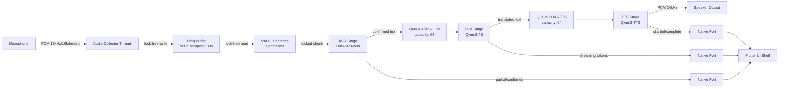
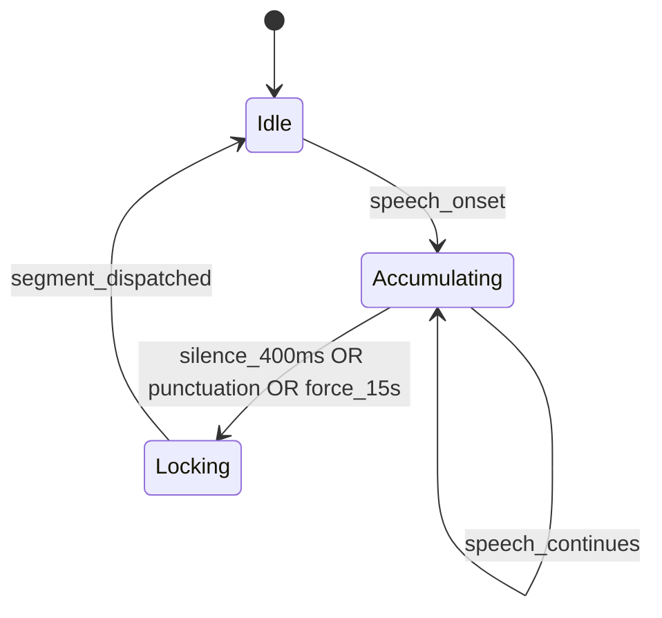
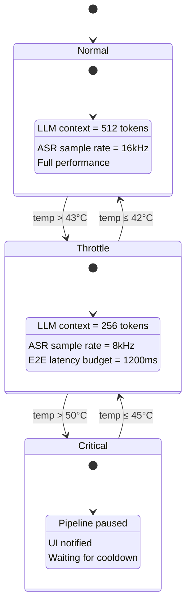
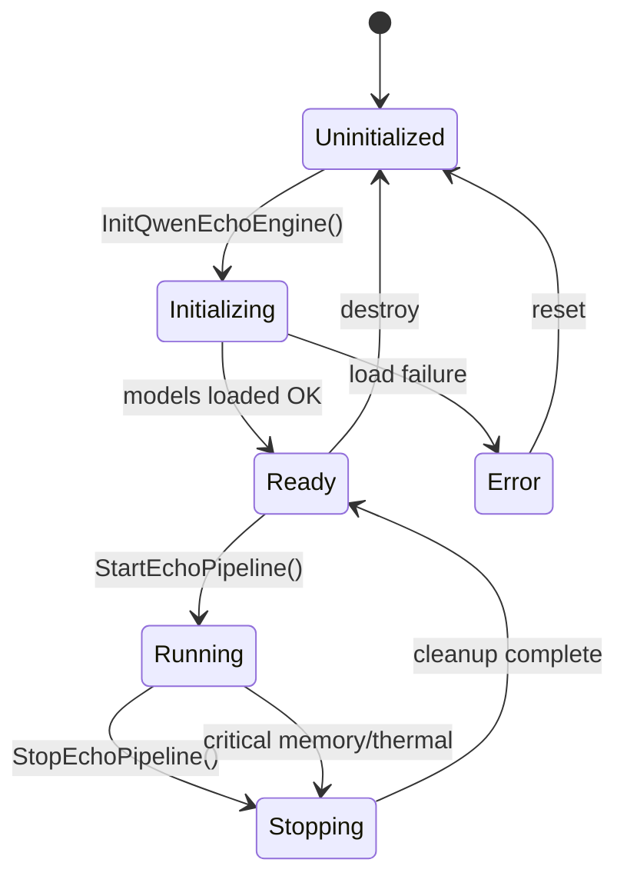
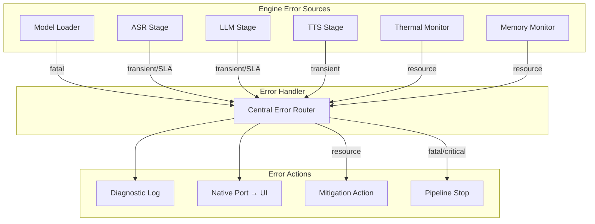

# Design Document: QwenEcho

## Overview

QwenEcho is an on-device, air-gapped simultaneous interpretation app built on a two-layer architecture: a Flutter **UI Shell** (Dart) for rendering and user interaction, and a **C/C++ Native Engine** for all AI inference and audio pipeline work. The system runs three GGUF/INT4-quantized models — FunASR-Nano (ASR), Qwen3-4B-Instruct (LLM translation), and Qwen3-TTS-Streaming (TTS) — entirely offline with zero network dependency.

The architecture prioritizes:
- **Real-time performance**: Lock-free SPSC ring buffers and bounded queues eliminate thread contention
- **Cascade processing**: Downstream pipeline stages begin before upstream stages complete
- **Thermal sustainability**: Three-mode thermal state machine prevents device overheating
- **Memory safety**: Hard platform limits (2.5GB Android, 2.0GB iOS) enforced by periodic monitoring
- **Platform abstraction**: A thin HAL isolates OS-specific APIs (NNAPI/Vulkan vs CoreML/Metal)

Communication between Dart and C/C++ uses Dart FFI with 4 C-linkage entry points and a Native Port for async message streaming from Engine to UI.

## Architecture

### System Context Diagram

```mermaid
graph TB
    subgraph Device["Mobile Device (Air-Gapped)"]
        subgraph Flutter["Flutter UI Shell (Dart)"]
            SV[Split View Controller]
            PM[Port Manager]
        end

        subgraph FFI["Dart FFI Bridge"]
            IF[InitQwenEchoEngine]
            SF[StartEchoPipeline]
            EF[StopEchoPipeline]
            RF[RegisterEchoMessagePort]
            NP[Native Port Channel]
        end

        subgraph Engine["C/C++ Native Engine"]
            EM[Engine Manager]
            ML[Model Loader]
            PP[Pipeline Processor]
            TM[Thermal Monitor]
            MM[Memory Monitor]
        end

        subgraph Pipeline["Processing Pipeline"]
            AC[Audio Collector]
            RB[Ring Buffer]
            VAD[VAD + Segmenter]
            ASR[ASR Stage]
            LLM[LLM Stage]
            TTS[TTS Stage]
            AO[Audio Output]
        end

        subgraph Models["GGUF/INT4 Models (On-Disk)"]
            M1[FunASR-Nano ~150MB]
            M2[Qwen3-4B-Instruct ~2.2GB]
            M3[Qwen3-TTS-Streaming ~250MB]
        end

        subgraph HAL["Platform Abstraction Layer"]
            AA[Android: NNAPI/Vulkan]
            IA[iOS: CoreML/Metal]
            AT[Android: Thermal HAL]
            IT[iOS: Thermal Process Info]
        end
    end

    Flutter -->|FFI calls| FFI
    FFI -->|Native Port msgs| Flutter
    FFI --> Engine
    Engine --> Pipeline
    Pipeline --> HAL
    ML --> Models
```




### Pipeline Data Flow



### Thread Model

```mermaid
graph TB
    subgraph Threads["Engine Thread Pool"]
        T1[Audio Collector<br/>SCHED_FIFO / RT QoS<br/>Highest Priority]
        T2[ASR Worker<br/>Normal Priority<br/>NPU-bound]
        T3[LLM Worker<br/>Normal Priority<br/>NPU-bound]
        T4[TTS Worker<br/>Normal Priority<br/>NPU-bound]
        T5[Thermal Monitor<br/>Low Priority<br/>5s poll interval]
        T6[Memory Monitor<br/>Low Priority<br/>2s poll interval]
    end

    subgraph IPC["Lock-Free IPC"]
        RB[Ring Buffer<br/>SPSC: T1→T2]
        Q1[Bounded Queue<br/>SPSC: T2→T3<br/>cap=64]
        Q2[Bounded Queue<br/>SPSC: T3→T4<br/>cap=64]
    end

    T1 -->|write| RB
    T2 -->|read| RB
    T2 -->|enqueue| Q1
    T3 -->|dequeue| Q1
    T3 -->|enqueue| Q2
    T4 -->|dequeue| Q2
end
```


## Components and Interfaces

### 1. Engine Manager

The central coordinator that owns the Engine lifecycle, model loading, and pipeline orchestration.

**Responsibilities:**
- Load/unload GGUF models via the Model Loader
- Create and destroy pipeline threads
- Route thermal/memory events to pipeline stages
- Maintain engine state machine: `Uninitialized → Initializing → Ready → Running → Stopping → Ready`

**Interface:**
```c
// Engine states
typedef enum {
    ENGINE_UNINITIALIZED = 0,
    ENGINE_INITIALIZING,
    ENGINE_READY,
    ENGINE_RUNNING,
    ENGINE_STOPPING,
    ENGINE_ERROR
} EngineState;

// Internal API (not exposed via FFI)
typedef struct EngineManager EngineManager;
EngineManager* engine_manager_create(void);
int engine_manager_load_models(EngineManager* em, const char* asr_path,
                               const char* llm_path, const char* tts_path);
int engine_manager_start_pipeline(EngineManager* em, const char* src_lang,
                                  const char* tgt_lang);
int engine_manager_stop_pipeline(EngineManager* em);
void engine_manager_destroy(EngineManager* em);
EngineState engine_manager_get_state(const EngineManager* em);
```

### 2. Model Loader

Handles GGUF file validation, memory mapping, and model instantiation via the ggml backend.

**Responsibilities:**
- Validate GGUF header magic bytes and INT4 quantization format
- Memory-map model files to reduce peak RAM during loading
- Instantiate inference contexts for ASR, LLM, TTS
- Report per-model memory consumption

**Design Decisions:**
- Use `mmap` for initial model file access to leverage OS page cache
- Validate GGUF header (magic: `0x46475547`) before allocating inference buffers
- Each model gets its own ggml context to allow independent lifecycle management


### 3. Ring Buffer (Audio)

A lock-free Single-Producer Single-Consumer (SPSC) circular buffer for PCM audio data.

**Responsibilities:**
- Accept writes from the Audio Collector thread without blocking
- Provide reads to the VAD/ASR consumer thread without blocking
- Overwrite oldest data on capacity overflow (no backpressure)
- Maintain cache-line-aligned head/tail indices to avoid false sharing

**Design Decisions:**
- Power-of-two capacity for efficient modulo via bitmask
- `std::atomic<uint32_t>` for head and tail with `memory_order_acquire/release`
- Padding between head and tail indices to separate cache lines (64-byte alignment)
- Capacity: 1,048,576 samples (2^20) ≈ 65.5 seconds at 16kHz, exceeding the 30s minimum

**Interface:**
```cpp
class AudioRingBuffer {
public:
    explicit AudioRingBuffer(uint32_t capacity_power_of_two);
    
    // Producer (Audio Collector thread)
    uint32_t write(const int16_t* samples, uint32_t count);
    
    // Consumer (ASR thread) 
    uint32_t read(int16_t* dest, uint32_t count);
    uint32_t available() const;
    
    // Overflow policy: overwrite oldest
    void advance_read_on_overflow(uint32_t count);
    
private:
    alignas(64) std::atomic<uint32_t> write_pos_;
    alignas(64) std::atomic<uint32_t> read_pos_;
    std::unique_ptr<int16_t[]> buffer_;
    uint32_t capacity_;
    uint32_t mask_;
};
```

### 4. Bounded Lock-Free Queue

SPSC bounded queue for inter-stage message passing (ASR→LLM, LLM→TTS).

**Responsibilities:**
- Transfer structured messages between pipeline stages
- Drop oldest element on capacity overflow (never block producer)
- Guarantee atomicity of element reads (no partial reads)

**Design Decisions:**
- Fixed capacity of 64 elements (power of two for bitmask indexing)
- Slot-based design: each slot has a sequence number for occupancy tracking
- Elements are small POD structs copied by value (no heap allocation per enqueue)

**Interface:**
```cpp
template<typename T, uint32_t Capacity = 64>
class BoundedSPSCQueue {
    static_assert((Capacity & (Capacity - 1)) == 0, "Capacity must be power of 2");
public:
    bool try_push(const T& item);      // Returns false if overflow (oldest dropped)
    bool try_pop(T& item);             // Returns false if empty
    uint32_t size() const;
    
private:
    struct Slot {
        std::atomic<uint32_t> sequence;
        T data;
    };
    alignas(64) std::atomic<uint32_t> head_;
    alignas(64) std::atomic<uint32_t> tail_;
    std::array<Slot, Capacity> slots_;
};
```


### 5. Audio Collector

Captures PCM audio from the platform microphone and writes to the Ring Buffer.

**Responsibilities:**
- Configure platform audio input (16kHz, 16-bit, mono)
- Run on real-time thread priority (SCHED_FIFO / RT QoS)
- Detect and report sample drops exceeding 160 samples (10ms)
- Write audio continuously to Ring Buffer

**Platform Specifics:**
- Android: `AAudio` API with `AAUDIO_PERFORMANCE_MODE_LOW_LATENCY`
- iOS: `AVAudioEngine` input node with real-time thread QoS

### 6. VAD + Sentence Segmenter

Classifies audio frames as speech/non-speech and determines sentence boundaries.

**Responsibilities:**
- Run FunASR-Nano's built-in FSMN-VAD on each frame (≤30ms latency)
- Track speech onset/offset transitions
- Lock segments on: 400ms silence after speech, punctuation detection, or 15s force-lock
- Enforce minimum segment length (200ms of speech audio)
- Pass locked segments to ASR transcription stage

**State Machine:**


### 7. ASR Stage

Performs speech-to-text transcription using FunASR-Nano (GGUF/INT4).

**Responsibilities:**
- Transcribe locked audio segments with ≤200ms first-character latency
- Stream partial (unconfirmed) tokens to UI via Native Port
- Finalize confirmed text on sentence boundary
- Discard unintelligible/noise-only chunks with silent notification
- Report SLA violations when latency exceeds 200ms threshold

**Design Decisions:**
- Uses FunASR's SenseVoice SAN-M encoder + Qwen3-0.6B LLM decoder architecture
- Inference accelerated via HAL (NNAPI/Vulkan on Android, CoreML/Metal on iOS)
- In Throttle mode, sample rate drops to 8kHz (resampled from Ring Buffer)

### 8. LLM Translation Stage

Translates confirmed ASR text using Qwen3-4B-Instruct (GGUF/INT4).

**Responsibilities:**
- Begin translation within 450ms of receiving confirmed text
- Maintain sliding context window (last 3 confirmed translations)
- Stream output tokens to UI and TTS via cascade truncation at punctuation
- Adapt context window size based on thermal mode (512 Normal, 256 Throttle)
- Truncate oldest context entries when combined input exceeds window limit

**Design Decisions:**
- KV cache allocated per-session, released on memory pressure or pipeline stop
- Token generation uses NPU-accelerated matmul via HAL
- Minimum throughput target: 35 tokens/second on supported hardware


### 9. TTS Synthesis Stage

Converts translated text to speech using Qwen3-TTS-Streaming (GGUF/INT4).

**Responsibilities:**
- Begin synthesis within 100ms TTFA on punctuation boundary
- Output PCM audio at 24kHz, 16-bit, mono in streaming chunks
- Operate concurrently with ASR/LLM (no pipeline blocking)
- Skip failed segments and continue processing subsequent ones
- Discard whitespace-only/punctuation-only text segments

**Design Decisions:**
- Cascade truncation: TTS starts producing audio as soon as LLM emits text up to a punctuation boundary
- Audio output buffer is a secondary ring buffer feeding the platform audio output
- Buffer size: ~500ms of audio (12,000 samples at 24kHz) for jitter absorption

### 10. Thermal Monitor

Polls hardware temperature and drives the thermal state machine.

**Responsibilities:**
- Poll temperature every 5 seconds via platform HAL
- Manage Normal → Throttle → Critical state transitions
- Notify Engine Manager and UI Shell of thermal mode changes
- Trigger pipeline pause on critical temperature

**Platform Specifics:**
- Android: `AThermal_getThermalHeadroom()` / `PowerManager.getCurrentThermalStatus()`
- iOS: `ProcessInfo.thermalState` via `NSProcessInfoThermalStateDidChangeNotification`

### 11. Memory Monitor

Samples process memory and triggers mitigation when approaching platform limits.

**Responsibilities:**
- Sample RSS every 2 seconds
- Trigger Level 1 mitigation at 85% (release KV caches + TTS buffers)
- Trigger Level 2 mitigation at 95% (graceful pipeline stop)
- Report memory pressure events to UI Shell

**Platform Specifics:**
- Android: `/proc/self/statm` or `android_getMemoryInfo()`
- iOS: `task_info(mach_task_self(), TASK_VM_INFO, ...)`

### 12. Dart FFI Bridge

The 4-function C-linkage interface between Flutter and the Native Engine.

**Interface Specification:**
```c
// All functions use C linkage and default symbol visibility
// Return: 0 = success, negative = error code

extern "C" {

// Initialize engine with model paths. Sends completion via Native Port.
__attribute__((visibility("default")))
int32_t InitQwenEchoEngine(const char* asr_path,
                           const char* llm_path,
                           const char* tts_path);

// Start pipeline with source/target language (ISO 639-1 codes).
__attribute__((visibility("default")))
int32_t StartEchoPipeline(const char* source_lang,
                          const char* target_lang);

// Stop active pipeline. Processes locked segments, discards unlocked audio.
__attribute__((visibility("default")))
int32_t StopEchoPipeline(void);

// Register Dart Native Port for async message delivery.
__attribute__((visibility("default")))
int32_t RegisterEchoMessagePort(int64_t dart_port_id);

}
```


### 13. Platform Abstraction Layer (HAL)

Isolates all OS-specific APIs behind a uniform C interface.

**Modules:**

| Module | Android Implementation | iOS Implementation |
|--------|----------------------|-------------------|
| Accelerator | NNAPI 1.3+ / Vulkan Compute | CoreML 5+ / Metal Performance Shaders |
| Audio Input | AAudio (low-latency) | AVAudioEngine (input tap) |
| Audio Output | AAudio (low-latency) | AVAudioEngine (output) |
| Thermal | AThermal API / sysfs thermal zones | ProcessInfo.thermalState |
| Memory | /proc/self/statm | task_info TASK_VM_INFO |
| Thread | pthread_setschedparam SCHED_FIFO | pthread_set_qos_class_self_np |

**Interface:**
```c
// Accelerator HAL
typedef struct AcceleratorContext AcceleratorContext;
AcceleratorContext* hal_accelerator_create(void);
int hal_accelerator_load_model(AcceleratorContext* ctx, const void* gguf_data,
                               size_t size, ModelType type);
int hal_accelerator_infer(AcceleratorContext* ctx, const float* input,
                          size_t input_len, float* output, size_t* output_len);
void hal_accelerator_destroy(AcceleratorContext* ctx);

// Thermal HAL
float hal_thermal_get_temperature(void);  // Returns Celsius
int hal_thermal_register_callback(void (*cb)(float temp, void* user), void* user);

// Memory HAL
size_t hal_memory_get_rss(void);          // Returns bytes
size_t hal_memory_get_platform_limit(void); // Returns platform budget in bytes

// Audio HAL
typedef struct AudioCapture AudioCapture;
AudioCapture* hal_audio_capture_create(uint32_t sample_rate, uint32_t channels);
int hal_audio_capture_start(AudioCapture* cap, void (*cb)(const int16_t*, uint32_t, void*), void* user);
void hal_audio_capture_stop(AudioCapture* cap);
void hal_audio_capture_destroy(AudioCapture* cap);
```

## Data Models

### Native Port Message Format

All messages from Engine to UI Shell are serialized as Dart-compatible lists sent via `Dart_PostCObject`. Each message begins with an integer type tag.

```c
// Message type tags
typedef enum {
    MSG_ASR_PARTIAL      = 1,   // Temporary/unconfirmed ASR text
    MSG_ASR_CONFIRMED    = 2,   // Finalized ASR text with punctuation
    MSG_TRANSLATION_STREAM = 3, // Streaming translation token
    MSG_TRANSLATION_DONE = 4,   // Translation segment complete
    MSG_TTS_STARTED      = 5,   // TTS synthesis began for a segment
    MSG_TTS_COMPLETE     = 6,   // TTS synthesis finished for a segment
    MSG_ERROR            = 10,  // Error notification
    MSG_THERMAL_STATE    = 11,  // Thermal mode change
    MSG_MEMORY_WARNING   = 12,  // Memory pressure event
    MSG_LATENCY_WARNING  = 13,  // SLA violation
    MSG_SAMPLE_DROP      = 14,  // Audio sample drop detected
} MessageType;
```


### Message Payloads

Each message type carries a specific payload structure:

| Type | Fields | Description |
|------|--------|-------------|
| MSG_ASR_PARTIAL | `[type, speaker_id, text, timestamp_ms]` | Streaming partial ASR text (gray in UI) |
| MSG_ASR_CONFIRMED | `[type, speaker_id, text, timestamp_ms, segment_id]` | Finalized sentence (white in UI) |
| MSG_TRANSLATION_STREAM | `[type, speaker_id, token, segment_id]` | Single translated token (green typewriter) |
| MSG_TRANSLATION_DONE | `[type, speaker_id, full_text, segment_id]` | Complete translated sentence |
| MSG_TTS_STARTED | `[type, speaker_id, segment_id]` | TTS synthesis beginning |
| MSG_TTS_COMPLETE | `[type, speaker_id, segment_id]` | TTS playback complete |
| MSG_ERROR | `[type, error_code, model_name, detail_string]` | Error with context |
| MSG_THERMAL_STATE | `[type, thermal_mode, temperature_c]` | 0=Normal, 1=Throttle, 2=Critical |
| MSG_MEMORY_WARNING | `[type, current_bytes, limit_bytes, level]` | 1=85% warning, 2=95% critical |
| MSG_LATENCY_WARNING | `[type, stage, actual_ms, budget_ms]` | Which stage exceeded SLA |
| MSG_SAMPLE_DROP | `[type, dropped_samples, timestamp_ms]` | Audio collector drop event |

### Inter-Stage Queue Element

```c
// ASR → LLM queue element
typedef struct {
    uint32_t segment_id;
    uint8_t  speaker_id;      // 0 = speaker A (bottom), 1 = speaker B (top)
    char     text[2048];      // UTF-8 confirmed text (null-terminated)
    uint16_t text_len;
    uint64_t timestamp_ms;    // Segment lock timestamp
} AsrToLlmElement;

// LLM → TTS queue element
typedef struct {
    uint32_t segment_id;
    uint8_t  speaker_id;
    char     text[4096];      // UTF-8 translated text (null-terminated)
    uint16_t text_len;
    uint64_t timestamp_ms;
} LlmToTtsElement;
```

### Engine Configuration

```c
typedef struct {
    // Model paths
    const char* asr_model_path;
    const char* llm_model_path;
    const char* tts_model_path;
    
    // Pipeline parameters
    const char* source_lang;  // ISO 639-1
    const char* target_lang;  // ISO 639-1
    
    // Ring buffer
    uint32_t ring_buffer_capacity;  // Default: 1048576 (2^20)
    
    // Thermal thresholds (Celsius)
    float throttle_temp;       // Default: 43.0
    float normal_temp;         // Default: 42.0
    float critical_temp;       // Default: 50.0
    float resume_temp;         // Default: 45.0
    
    // Memory limits (bytes)
    size_t memory_limit;       // Platform-specific
    float memory_warn_pct;     // Default: 0.85
    float memory_critical_pct; // Default: 0.95
    
    // LLM context
    uint32_t llm_context_normal;   // Default: 512
    uint32_t llm_context_throttle; // Default: 256
    uint32_t llm_sliding_history;  // Default: 3 (previous translations)
    
    // Sentence segmenter
    uint32_t silence_threshold_ms; // Default: 400
    uint32_t min_speech_ms;        // Default: 200
    uint32_t max_segment_ms;       // Default: 15000
    
    // Audio
    uint32_t asr_sample_rate;      // 16000 (Normal), 8000 (Throttle)
    uint32_t tts_sample_rate;      // 24000
} EngineConfig;
```


### Thermal State Machine



### Engine State Machine



### Memory Budget Allocation

| Component | Android Budget | iOS Budget |
|-----------|---------------|------------|
| ASR Model (FunASR-Nano) | ~165MB | ~165MB |
| LLM Model (Qwen3-4B) | ~2,200MB | ~1,600MB* |
| TTS Model (Qwen3-TTS) | ~275MB | ~275MB |
| Ring Buffer (audio) | ~2MB | ~2MB |
| LLM KV Cache (Normal) | ~60MB | ~60MB |
| TTS Output Buffer | ~1MB | ~1MB |
| Pipeline Queues + Misc | ~50MB | ~50MB |
| **Total** | **~2,753MB** | **~2,153MB** |

*Note: iOS uses aggressive mmap paging for LLM weights; only active pages resident.*

**Mitigation Strategy:**
- Level 1 (85%): Release KV cache + TTS output buffers → saves ~61MB
- Level 2 (95%): Graceful pipeline stop + report to UI

### FFI Error Codes

```c
typedef enum {
    ECHO_OK                    =  0,
    ECHO_ERR_NOT_INITIALIZED   = -1,
    ECHO_ERR_ALREADY_INIT      = -2,
    ECHO_ERR_MODEL_MISSING     = -3,
    ECHO_ERR_MODEL_INVALID     = -4,
    ECHO_ERR_MODEL_PERMISSION  = -5,
    ECHO_ERR_MEMORY            = -6,
    ECHO_ERR_UNSUPPORTED_LANG  = -7,
    ECHO_ERR_SESSION_ACTIVE    = -8,
    ECHO_ERR_NO_SESSION        = -9,
    ECHO_ERR_NO_PORT           = -10,
    ECHO_ERR_ENGINE_NOT_READY  = -11,
    ECHO_ERR_THERMAL_CRITICAL  = -12,
} EchoErrorCode;
```


## Correctness Properties

*A property is a characteristic or behavior that should hold true across all valid executions of a system — essentially, a formal statement about what the system should do. Properties serve as the bridge between human-readable specifications and machine-verifiable correctness guarantees.*

### Property 1: Ring Buffer Overflow Preserves Most Recent Data

*For any* sequence of N writes to a Ring Buffer of capacity C where N > C, the buffer SHALL contain exactly the last C samples written, and no write operation SHALL block the producer thread.

**Validates: Requirements 3.4, 14.6**

### Property 2: Ring Buffer SPSC Integrity

*For any* interleaved sequence of concurrent single-producer writes and single-consumer reads on the Ring Buffer, every sample read by the consumer SHALL exactly match a sample written by the producer (no corruption), and no partial sample SHALL ever be visible to the consumer.

**Validates: Requirements 14.1, 14.5**

### Property 3: Bounded Queue Capacity Enforcement

*For any* SPSC bounded queue of capacity 64 receiving a push when full, the oldest element SHALL be discarded, the new element SHALL be enqueued, and the push operation SHALL complete without blocking the producer. The queue size SHALL never exceed 64.

**Validates: Requirements 14.2, 14.4**

### Property 4: Engine State Machine Valid Transitions

*For any* engine in a non-Ready state, calling StartEchoPipeline SHALL return an error and leave the engine state unchanged. *For any* engine with an active session, calling StartEchoPipeline again SHALL return a session-active error without disrupting the running pipeline. *For any* engine in Ready state with no active session, calling StopEchoPipeline SHALL return success with no side effects.

**Validates: Requirements 2.4, 2.5, 2.6, 2.7**


### Property 5: Thermal State Machine Transitions

*For any* sequence of temperature readings, the thermal state machine SHALL transition: Normal → Throttle when temp > 43°C, Throttle → Normal when temp ≤ 42°C, Throttle → Critical when temp > 50°C, and Critical → Throttle when temp ≤ 45°C. Every transition SHALL produce a MSG_THERMAL_STATE notification to the UI Shell.

**Validates: Requirements 10.2, 10.3, 10.6, 10.7, 10.8, 10.9**

### Property 6: LLM Context Window Mode Adaptation

*For any* translation in Normal thermal mode, the LLM context window SHALL be 512 tokens. *For any* translation in Throttle mode, the context window SHALL be 256 tokens. *For any* thermal mode transition occurring mid-translation, the current translation SHALL complete with its original window size, and the new window size SHALL apply starting with the next segment.

**Validates: Requirements 6.4, 6.5, 6.9**

### Property 7: LLM Context Truncation

*For any* combined input (sliding context + current segment) exceeding the active context window size, the LLM SHALL truncate by removing the oldest context entries first until the total fits within the window limit. The current segment SHALL never be truncated.

**Validates: Requirements 6.2, 6.8**

### Property 8: LLM Sliding Context Window

*For any* sequence of N confirmed translations where N ≥ 3, the context prepended to translation N+1 SHALL contain exactly translations N, N-1, and N-2 in order. For N < 3, all available prior translations SHALL be prepended.

**Validates: Requirements 6.2**

### Property 9: Sentence Segmenter Lock Conditions

*For any* audio stream, the Sentence Segmenter SHALL lock the current segment when ANY of these conditions is met: (a) 400ms of silence follows speech of at least 200ms duration, (b) sentence-ending punctuation is detected in ASR output, or (c) continuous speech exceeds 15 seconds without a boundary. After locking, a new segment SHALL immediately begin accumulating.

**Validates: Requirements 4.2, 4.3, 4.4, 4.5, 4.7**

### Property 10: TTS Whitespace/Punctuation Discard

*For any* text segment delivered to TTS that consists entirely of whitespace characters and/or punctuation characters with no translatable content, the TTS SHALL produce zero audio output and no TTS_STARTED event.

**Validates: Requirements 7.6**


### Property 11: TTS Failure Resilience

*For any* TTS synthesis failure on segment K, the TTS stage SHALL skip segment K, log the failure, and successfully process segment K+1 without halting or restarting the pipeline.

**Validates: Requirements 7.5**

### Property 12: Memory Mitigation Two-Level Response

*For any* memory reading exceeding 85% of the platform limit, the Engine SHALL release LLM KV caches and TTS output buffers. *For any* memory reading exceeding 95% after Level 1 mitigation has been applied, the Engine SHALL stop the pipeline gracefully and report a memory pressure error to the UI Shell.

**Validates: Requirements 9.4, 9.5**

### Property 13: UI Text Color Mapping

*For any* MSG_ASR_PARTIAL message, the UI SHALL render text in gray (#9E9E9E). *For any* MSG_ASR_CONFIRMED message, the UI SHALL render text in white (#FFFFFF). *For any* MSG_TRANSLATION_STREAM message, the UI SHALL render text in green (#00E676).

**Validates: Requirements 12.3, 12.4, 12.5**

### Property 14: UI Line Buffer Limit

*For any* speaker half displaying N lines where N > 50, the UI SHALL retain only the 50 most recent lines and discard the oldest lines. The view SHALL auto-scroll to keep the most recent text visible.

**Validates: Requirements 12.7**

### Property 15: Audio Sample Drop Reporting

*For any* detected audio sample drop exceeding 160 samples (10ms at 16kHz), the Engine SHALL report a MSG_SAMPLE_DROP event to the UI Shell. *For any* drop of 160 samples or fewer, no drop event SHALL be generated.

**Validates: Requirements 3.7**

### Property 16: SLA Violation Stage Identification

*For any* pipeline stage (ASR, LLM, or TTS) that exceeds its latency budget (200ms, 450ms, 100ms respectively), the Engine SHALL report a latency warning identifying that specific stage, its actual latency, and its budget. The delayed result SHALL still be delivered.

**Validates: Requirements 5.6, 6.7, 8.5**

### Property 17: Native Port Message Format Completeness

*For any* pipeline event (ASR partial, ASR confirmed, translation streaming, translation complete, TTS started, TTS complete, error), the message sent via Native Port SHALL contain the correct type tag and all required fields as specified in the message payload table.

**Validates: Requirements 15.5**

### Property 18: Port Registration Replacement

*For any* sequence of N calls to RegisterEchoMessagePort with different port IDs, only the most recently registered port SHALL receive subsequent messages. Previously registered ports SHALL receive no further messages.

**Validates: Requirements 15.8**


### Property 19: Port Prerequisite for Pipeline Operations

*For any* engine state where no Native Port has been registered via RegisterEchoMessagePort, calling StartEchoPipeline or StopEchoPipeline SHALL return ECHO_ERR_NO_PORT without modifying engine state.

**Validates: Requirements 15.7**

### Property 20: Model Validation Error Reporting

*For any* model file that is missing, has invalid permissions, or fails GGUF header validation (magic bytes ≠ 0x46475547 or non-INT4 quantization), the Engine SHALL report an error containing the model name, attempted file path, and categorized failure reason (missing, permission denied, or invalid format).

**Validates: Requirements 1.3, 16.5**

### Property 21: Engine Init Idempotence

*For any* number of repeated calls to InitQwenEchoEngine after the first successful initialization, the Engine SHALL return ECHO_ERR_ALREADY_INIT without reloading models or changing engine state.

**Validates: Requirements 1.5**

### Property 22: Pipeline Stop Segment Handling

*For any* pipeline state with locked segments and unlocked audio in the Ring Buffer at the time StopEchoPipeline is called, all locked segments SHALL be processed through the full pipeline, all unlocked audio SHALL be discarded, and pipeline resources SHALL be released.

**Validates: Requirements 2.2**

## Error Handling

### Error Categories

| Category | Scope | Recovery | Example |
|----------|-------|----------|---------|
| Fatal | Engine lifecycle | Report to UI, require restart | Model load failure, memory exhaustion |
| Degraded | Pipeline stage | Continue with reduced capability | NPU unavailable → CPU fallback |
| Transient | Single segment | Skip and continue | ASR noise discard, TTS segment failure |
| SLA Warning | Performance | Log and continue | Latency threshold exceeded |
| Resource | Memory/Thermal | Staged mitigation | 85% memory → release caches |

### Error Propagation Flow




### Error Handling Strategies by Component

**Model Loader:**
- Missing file → ECHO_ERR_MODEL_MISSING + file path in error message
- Permission denied → ECHO_ERR_MODEL_PERMISSION + file path
- Invalid GGUF header → ECHO_ERR_MODEL_INVALID + model name
- Memory allocation failure → ECHO_ERR_MEMORY + release partial loads
- All errors reported via Native Port with MSG_ERROR type

**ASR Stage:**
- Noise-only input → discard chunk, send silent-discard notification
- SLA violation (>200ms) → deliver result anyway, log violation event
- Model inference error → skip segment, report via MSG_ERROR

**LLM Stage:**
- SLA violation (>450ms) → deliver result, log violation
- Context overflow → truncate oldest entries (not an error)
- Model inference error → skip translation, report error

**TTS Stage:**
- Synthesis failure → skip segment, log, continue to next
- Whitespace-only input → discard (not an error)
- Audio output buffer overflow → drop oldest audio (acceptable degradation)

**Thermal Monitor:**
- Critical temperature → pause pipeline, MSG_THERMAL_STATE to UI
- Sensor read failure → assume worst case (Throttle), log warning

**Memory Monitor:**
- 85% threshold → release KV caches + TTS buffers
- 95% threshold → stop pipeline, MSG_MEMORY_WARNING to UI
- Memory read failure → assume worst case, trigger Level 1

### Graceful Degradation Hierarchy

1. **Normal operation** → full performance
2. **NPU unavailable** → CPU fallback with degraded latency (report to UI)
3. **Thermal Throttle** → reduced context window + sample rate
4. **Memory Level 1** → release caches (temporary quality reduction)
5. **Memory Level 2 / Thermal Critical** → pipeline pause with user notification
6. **Unrecoverable** → engine error state, require app restart

## Testing Strategy

### Unit Tests (Example-Based)

Unit tests cover specific scenarios, edge cases, and API contract verification:

- **FFI Interface Contract**: Verify each of the 4 C-linkage functions returns correct status codes for valid/invalid inputs
- **Engine State Machine**: Test specific transition sequences (Init → Ready → Running → Stopping → Ready)
- **GGUF Header Validation**: Test with valid GGUF file, corrupted magic bytes, wrong quantization type
- **Language Code Validation**: Test with supported ISO codes, invalid codes, empty strings
- **Message Serialization**: Verify each message type produces correct Dart_CObject structure
- **Audio Format Configuration**: Verify capture/output parameters (16kHz/8kHz, 24kHz, mono)
- **Platform Detection**: Verify correct HAL backend selection per platform

### Property-Based Tests

Property-based tests verify universal properties across randomized inputs. Each test runs a minimum of 100 iterations.

**Testing Library**: [fast_check](https://github.com/dubzzz/fast-check) for Dart-side tests, [RapidCheck](https://github.com/emil-e/rapidcheck) for C++ engine tests.

| Property | Test Description | Generator Strategy |
|----------|-----------------|-------------------|
| Property 1 | Ring Buffer overflow | Random write sequences of varying length (C > capacity) |
| Property 2 | Ring Buffer SPSC integrity | Concurrent random read/write patterns on separate threads |
| Property 3 | Bounded Queue capacity | Random push sequences exceeding 64, verify size invariant |
| Property 4 | Engine state machine | Random sequences of Init/Start/Stop/Register calls |
| Property 5 | Thermal FSM | Random temperature sequences (30°C–60°C range) |
| Property 6 | LLM context window | Random thermal mode + translation requests |
| Property 7 | LLM context truncation | Random context histories of varying length |
| Property 8 | LLM sliding context | Random sequences of 1–20 confirmed translations |
| Property 9 | Sentence segmenter | Random audio durations + silence patterns + punctuation |
| Property 10 | TTS discard | Random strings of whitespace/punctuation combinations |
| Property 11 | TTS resilience | Random failure injection at different segments |
| Property 12 | Memory mitigation | Random memory readings (0%–100% of limit) |
| Property 13 | UI text color | Random message types mapped to expected colors |
| Property 14 | UI line buffer | Random line counts (1–200) per speaker half |
| Property 15 | Sample drop reporting | Random drop sizes (1–1000 samples) |
| Property 16 | SLA violation | Random latencies per stage (0–2000ms) |
| Property 17 | Message format | Random pipeline events, verify field completeness |
| Property 18 | Port replacement | Random sequences of port registrations |
| Property 19 | Port prerequisite | Random call sequences without prior registration |
| Property 20 | Model validation | Random invalid file scenarios (missing, corrupted, wrong format) |
| Property 21 | Init idempotence | Random repeated Init calls (1–100 times) |
| Property 22 | Pipeline stop | Random pipeline states with N locked + M unlocked segments |

**Tag Format**: Each property test is tagged with:
```
// Feature: qwen-echo, Property N: <property_text>
```

### Integration Tests

- **End-to-end pipeline latency**: Measure from segment lock to first TTS audio packet
- **Model loading time**: Verify < 15 seconds on reference hardware
- **Concurrent bilateral streams**: Two simultaneous speaker pipelines operating independently
- **Thermal response time**: Verify mode transitions occur within one poll interval (5s)
- **Memory monitoring accuracy**: Verify RSS readings match platform tools

### Platform-Specific Tests

- **Android**: NNAPI/Vulkan acceleration verification, 16KB page alignment, SCHED_FIFO priority
- **iOS**: CoreML/Metal acceleration verification, real-time QoS thread priority
- **Both**: Airplane mode operation, model loading from app sandbox
