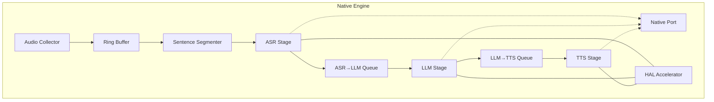
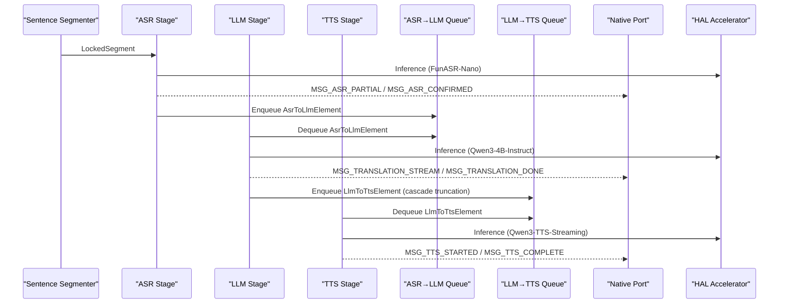
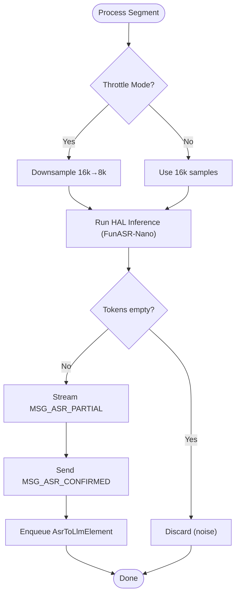
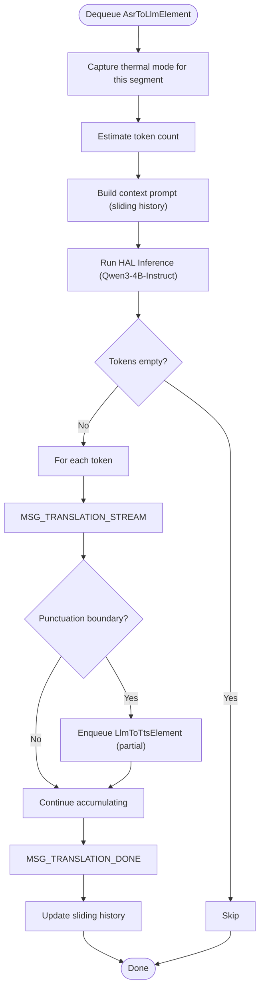
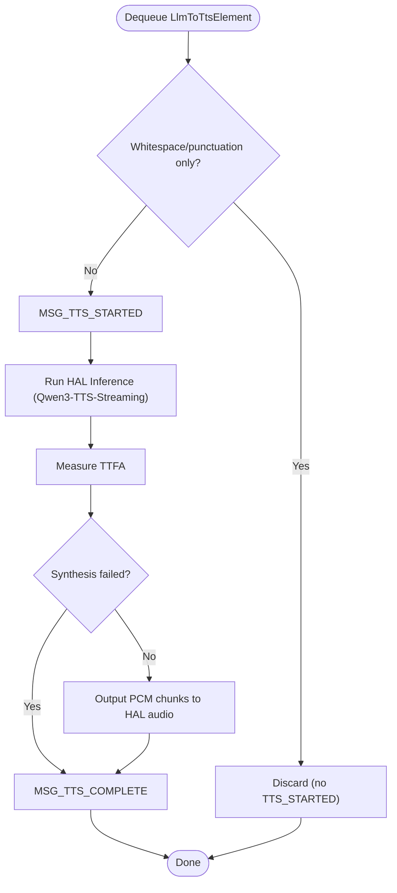
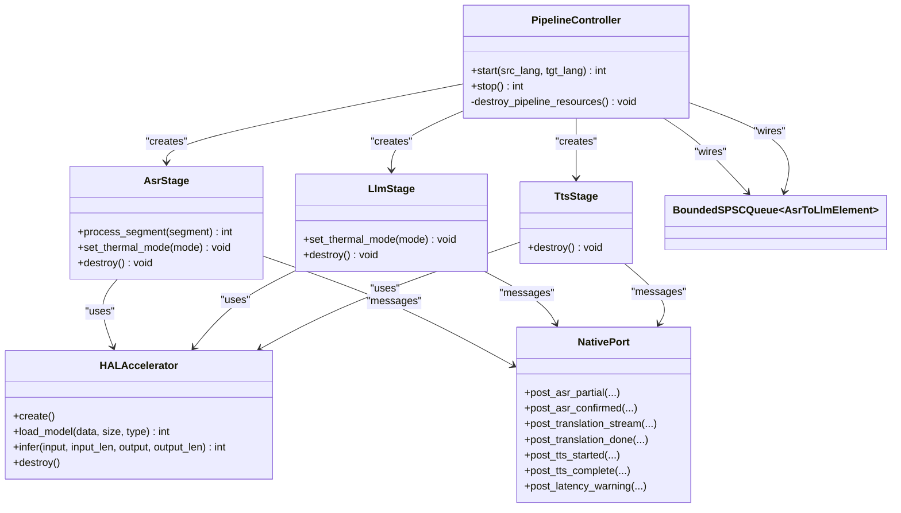
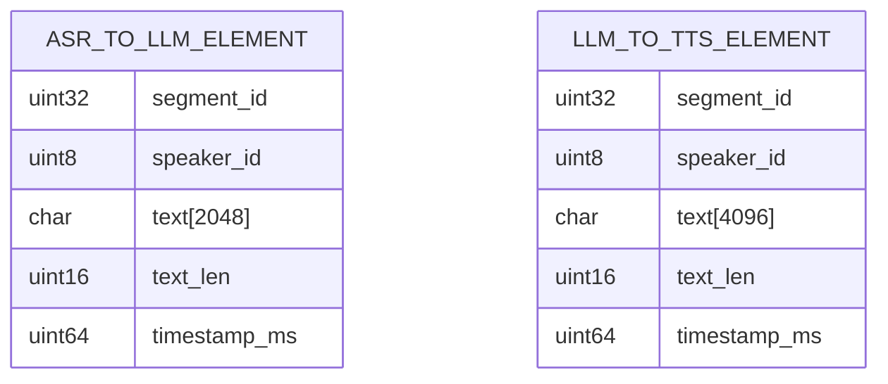

# AI Model Processing Stages

<cite>
**Referenced Files in This Document**
- [asr_stage.h](file://native/include/asr_stage.h)
- [asr_stage.cpp](file://native/src/asr_stage.cpp)
- [llm_stage.h](file://native/include/llm_stage.h)
- [llm_stage.cpp](file://native/src/llm_stage.cpp)
- [tts_stage.h](file://native/include/tts_stage.h)
- [tts_stage.cpp](file://native/src/tts_stage.cpp)
- [echo_types.h](file://native/include/echo_types.h)
- [bounded_spsc_queue.h](file://native/include/bounded_spsc_queue.h)
- [native_port.h](file://native/include/native_port.h)
- [hal_accelerator.h](file://native/hal/hal_accelerator.h)
- [pipeline_controller.h](file://native/include/pipeline_controller.h)
- [pipeline_controller.cpp](file://native/src/pipeline_controller.cpp)
- [engine_manager.h](file://native/include/engine_manager.h)
- [README.md](file://README.md)
</cite>

## Table of Contents
1. [Introduction](#introduction)
2. [Project Structure](#project-structure)
3. [Core Components](#core-components)
4. [Architecture Overview](#architecture-overview)
5. [Detailed Component Analysis](#detailed-component-analysis)
6. [Dependency Analysis](#dependency-analysis)
7. [Performance Considerations](#performance-considerations)
8. [Troubleshooting Guide](#troubleshooting-guide)
9. [Conclusion](#conclusion)
10. [Appendices](#appendices)

## Introduction
This document explains QwenEcho’s AI model processing stages for speech recognition, translation, and synthesis. It focuses on:
- ASR Stage using FunASR-Nano for 52-language speech-to-text with streaming support
- LLM Stage using Qwen3-4B-Instruct for bilingual translation with context window management and cascade truncation
- TTS Stage using Qwen3-TTS-Streaming for real-time text-to-speech synthesis
It also covers inter-stage communication protocols, data structure transformations, performance optimization strategies, configuration examples, and integration guidance for additional language packs or model variants.

## Project Structure
QwenEcho implements a three-stage pipeline (ASR → LLM → TTS) orchestrated by a controller that wires components together and manages lifecycle. The native engine exposes typed messages to the Flutter UI via a Native Port.

**Diagram sources**
- [pipeline_controller.cpp:107-126](file://native/src/pipeline_controller.cpp#L107-L126)
- [asr_stage.h:1-104](file://native/include/asr_stage.h#L1-L104)
- [llm_stage.h:1-93](file://native/include/llm_stage.h#L1-L93)
- [tts_stage.h:1-79](file://native/include/tts_stage.h#L1-L79)
- [native_port.h:1-179](file://native/include/native_port.h#L1-L179)
- [hal_accelerator.h:1-81](file://native/hal/hal_accelerator.h#L1-L81)

**Section sources**
- [README.md:15-40](file://README.md#L15-L40)
- [pipeline_controller.h:1-107](file://native/include/pipeline_controller.h#L1-L107)

## Core Components
- ASR Stage: Receives locked audio segments, runs inference via HAL (NPU-first), streams partial tokens, enqueues confirmed text into ASR→LLM queue.
- LLM Stage: Dequeues confirmed ASR text, builds sliding context, translates token-by-token, streams tokens, applies cascade truncation at punctuation boundaries, enqueues partials to LLM→TTS queue.
- TTS Stage: Dequeues translated text, synthesizes PCM audio chunks, tracks TTFA, outputs to platform speaker via HAL audio.

Key shared elements:
- BoundedSPSCQueue: Lock-free bounded queues with overflow-drop semantics for zero-contention pipeline.
- Native Port: Typed message dispatch from C/C++ to Dart UI.
- HAL Accelerator: Platform abstraction for NPU/GPU inference with CPU fallback.

**Section sources**
- [asr_stage.h:1-104](file://native/include/asr_stage.h#L1-L104)
- [llm_stage.h:1-93](file://native/include/llm_stage.h#L1-L93)
- [tts_stage.h:1-79](file://native/include/tts_stage.h#L1-L79)
- [bounded_spsc_queue.h:1-145](file://native/include/bounded_spsc_queue.h#L1-L145)
- [native_port.h:1-179](file://native/include/native_port.h#L1-L179)
- [hal_accelerator.h:1-81](file://native/hal/hal_accelerator.h#L1-L81)

## Architecture Overview
The pipeline is orchestrated by PipelineController, which creates and starts all components, connects queues, and handles graceful stop. Each stage runs on its own worker thread and communicates via bounded SPSC queues and typed Native Port messages.

**Diagram sources**
- [pipeline_controller.cpp:107-126](file://native/src/pipeline_controller.cpp#L107-L126)
- [asr_stage.cpp:167-271](file://native/src/asr_stage.cpp#L167-L271)
- [llm_stage.cpp:243-361](file://native/src/llm_stage.cpp#L243-L361)
- [tts_stage.cpp:191-272](file://native/src/tts_stage.cpp#L191-L272)
- [native_port.h:100-172](file://native/include/native_port.h#L100-L172)
- [hal_accelerator.h:53-67](file://native/hal/hal_accelerator.h#L53-L67)

## Detailed Component Analysis

### ASR Stage (FunASR-Nano)
Responsibilities:
- Accept LockedSegment from Sentence Segmenter
- Optional resampling (16kHz→8kHz) in Throttle mode
- Run inference via HAL accelerator (stub provided; production uses FunASR-Nano)
- Stream partial tokens via MSG_ASR_PARTIAL
- Finalize confirmed text via MSG_ASR_CONFIRMED and enqueue into ASR→LLM queue
- Enforce SLA ≤200ms first-character latency

Data structures:
- AsrToLlmElement carries segment_id, speaker_id, UTF-8 text buffer, length, timestamp

Thermal modes:
- Normal: 16kHz inference
- Throttle: downsample to 8kHz before inference

Error handling:
- Noise-only/unintelligible segments are silently discarded (no confirmed message, no queue push)

Configuration example paths:
- asr_model_path in EngineConfig
- source_lang/target_lang validated against supported languages list

Integration points:
- Uses BoundedSPSCQueue<AsrToLlmElement> to send confirmed text to LLM
- Uses Native Port for streaming partials and final confirmation

**Diagram sources**
- [asr_stage.cpp:167-271](file://native/src/asr_stage.cpp#L167-L271)
- [asr_stage.h:58-87](file://native/include/asr_stage.h#L58-L87)

**Section sources**
- [asr_stage.h:1-104](file://native/include/asr_stage.h#L1-L104)
- [asr_stage.cpp:1-341](file://native/src/asr_stage.cpp#L1-L341)
- [echo_types.h:68-74](file://native/include/echo_types.h#L68-L74)
- [native_port.h:100-113](file://native/include/native_port.h#L100-L113)
- [pipeline_controller.cpp:60-89](file://native/src/pipeline_controller.cpp#L60-L89)

### LLM Stage (Qwen3-4B-Instruct)
Responsibilities:
- Dequeue confirmed ASR text from ASR→LLM queue
- Maintain sliding context window of last 3 translations
- Build context prompt and truncate oldest entries when over limit
- Translate token-by-token via HAL accelerator (stub provided; production uses Qwen3-4B-Instruct)
- Stream tokens via MSG_TRANSLATION_STREAM
- Apply cascade truncation: enqueue partial results at punctuation boundaries to LLM→TTS queue
- Send MSG_TRANSLATION_DONE when segment complete
- Track first-token latency SLA ≤450ms

Context window management:
- Normal mode: 512-token window
- Throttle mode: 256-token window
- Sliding history: last 3 confirmed translations prepended
- Truncation: oldest entries removed first when over limit
- Mid-translation mode change: finish current with original window, apply new window next

Data structures:
- AsrToLlmElement consumed; LlmToTtsElement produced with segment_id, speaker_id, UTF-8 text buffer, length, timestamp

Integration points:
- Consumes BoundedSPSCQueue<AsrToLlmElement>, produces BoundedSPSCQueue<LlmToTtsElement>
- Uses Native Port for streaming tokens and completion

**Diagram sources**
- [llm_stage.cpp:243-361](file://native/src/llm_stage.cpp#L243-L361)
- [llm_stage.h:67-76](file://native/include/llm_stage.h#L67-L76)

**Section sources**
- [llm_stage.h:1-93](file://native/include/llm_stage.h#L1-L93)
- [llm_stage.cpp:1-412](file://native/src/llm_stage.cpp#L1-L412)
- [echo_types.h:80-86](file://native/include/echo_types.h#L80-L86)
- [native_port.h:118-127](file://native/include/native_port.h#L118-L127)

### TTS Stage (Qwen3-TTS-Streaming)
Responsibilities:
- Dequeue translated text from LLM→TTS queue
- Discard whitespace-only or punctuation-only segments without starting synthesis
- Send MSG_TTS_STARTED before synthesis begins
- Synthesize PCM audio chunks (24kHz, 16-bit, mono) via HAL accelerator (stub provided; production uses Qwen3-TTS-Streaming)
- Track TTFA SLA ≤100ms and report warnings
- Output audio to platform speaker via HAL audio output
- Send MSG_TTS_COMPLETE when synthesis finishes
- On failure: log error, skip segment, continue processing next

Data structures:
- LlmToTtsElement consumed with segment_id, speaker_id, UTF-8 text buffer, length, timestamp

Integration points:
- Consumes BoundedSPSCQueue<LlmToTtsElement>
- Uses Native Port for lifecycle events and latency warnings

**Diagram sources**
- [tts_stage.cpp:191-272](file://native/src/tts_stage.cpp#L191-L272)
- [tts_stage.h:64-72](file://native/include/tts_stage.h#L64-L72)

**Section sources**
- [tts_stage.h:1-79](file://native/include/tts_stage.h#L1-L79)
- [tts_stage.cpp:1-315](file://native/src/tts_stage.cpp#L1-L315)
- [echo_types.h:80-86](file://native/include/echo_types.h#L80-L86)
- [native_port.h:132-139](file://native/include/native_port.h#L132-L139)

### Inter-Stage Communication Protocols
Message types sent via Native Port:
- MSG_ASR_PARTIAL: Temporary/unconfirmed ASR text
- MSG_ASR_CONFIRMED: Finalized ASR text with punctuation
- MSG_TRANSLATION_STREAM: Streaming translation token
- MSG_TRANSLATION_DONE: Translation segment complete
- MSG_TTS_STARTED: TTS synthesis began for a segment
- MSG_TTS_COMPLETE: TTS synthesis finished for a segment
- MSG_LATENCY_WARNING: SLA violation notifications

Queues:
- ASR→LLM: BoundedSPSCQueue<AsrToLlmElement>
- LLM→TTS: BoundedSPSCQueue<LlmToTtsElement>

Data structures:
- AsrToLlmElement: segment_id, speaker_id, text[2048], text_len, timestamp_ms
- LlmToTtsElement: segment_id, speaker_id, text[4096], text_len, timestamp_ms

**Section sources**
- [echo_types.h:27-42](file://native/include/echo_types.h#L27-L42)
- [echo_types.h:68-86](file://native/include/echo_types.h#L68-L86)
- [native_port.h:100-172](file://native/include/native_port.h#L100-L172)
- [bounded_spsc_queue.h:1-145](file://native/include/bounded_spsc_queue.h#L1-L145)

### Configuration Examples
EngineConfig fields relevant to model parameters and pipeline behavior:
- asr_model_path, llm_model_path, tts_model_path: Paths to GGUF models
- source_lang, target_lang: ISO 639-1 codes validated against supported list
- ring_buffer_capacity: Default 2^20 samples
- throttle_temp, normal_temp, critical_temp, resume_temp: Thermal thresholds
- memory_limit, memory_warn_pct, memory_critical_pct: Memory limits and warning levels
- llm_context_normal, llm_context_throttle, llm_sliding_history: Context window sizes and sliding history count
- silence_threshold_ms, min_speech_ms, max_segment_ms: Sentence segmentation parameters
- asr_sample_rate, tts_sample_rate: Audio sample rates

Example usage paths:
- PipelineController validates language codes and constructs pipeline resources
- EngineManager coordinates lifecycle transitions and model loading

**Section sources**
- [echo_types.h:92-129](file://native/include/echo_types.h#L92-L129)
- [pipeline_controller.cpp:272-393](file://native/src/pipeline_controller.cpp#L272-L393)
- [engine_manager.h:53-70](file://native/include/engine_manager.h#L53-L70)

### Handling Streaming Responses
- ASR: Streams partial tokens via MSG_ASR_PARTIAL; finalizes with MSG_ASR_CONFIRMED and enqueues confirmed text
- LLM: Streams tokens via MSG_TRANSLATION_STREAM; emits partials at punctuation boundaries to downstream TTS; completes with MSG_TRANSLATION_DONE
- TTS: Emits MSG_TTS_STARTED before synthesis, then MSG_TTS_COMPLETE after finishing; outputs PCM chunks to HAL audio

**Section sources**
- [asr_stage.cpp:214-271](file://native/src/asr_stage.cpp#L214-L271)
- [llm_stage.cpp:281-361](file://native/src/llm_stage.cpp#L281-L361)
- [tts_stage.cpp:214-272](file://native/src/tts_stage.cpp#L214-L272)
- [native_port.h:100-139](file://native/include/native_port.h#L100-L139)

### Integrating Additional Language Packs or Model Variants
- Add language codes to the supported list in PipelineController to enable new ISO 639-1 codes
- Provide corresponding GGUF model files for ASR/LLM/TTS and update EngineConfig paths
- Ensure HAL Accelerator supports the new model type and variant

**Section sources**
- [pipeline_controller.cpp:60-89](file://native/src/pipeline_controller.cpp#L60-L89)
- [hal_accelerator.h:22-26](file://native/hal/hal_accelerator.h#L22-L26)
- [engine_manager.h:53-54](file://native/include/engine_manager.h#L53-L54)

## Dependency Analysis
Component relationships and coupling:
- PipelineController orchestrates creation and wiring of stages and queues
- Each stage depends on HAL Accelerator for inference and Native Port for messaging
- Queues decouple producers and consumers with overflow-drop semantics

**Diagram sources**
- [pipeline_controller.cpp:107-126](file://native/src/pipeline_controller.cpp#L107-L126)
- [asr_stage.h:52-53](file://native/include/asr_stage.h#L52-L53)
- [llm_stage.h:60-62](file://native/include/llm_stage.h#L60-L62)
- [tts_stage.h:58-59](file://native/include/tts_stage.h#L58-L59)
- [native_port.h:100-172](file://native/include/native_port.h#L100-L172)
- [hal_accelerator.h:42-67](file://native/hal/hal_accelerator.h#L42-L67)

**Section sources**
- [pipeline_controller.cpp:107-126](file://native/src/pipeline_controller.cpp#L107-L126)
- [bounded_spsc_queue.h:1-145](file://native/include/bounded_spsc_queue.h#L1-L145)

## Performance Considerations
- SLA budgets:
  - ASR first-character ≤200ms
  - LLM first-token ≤450ms
  - TTS TTFA ≤100ms
  - E2E total ≤800ms (Normal), ≤1200ms (Throttle)
- Cascade truncation reduces perceived latency by enabling downstream stages to start early
- Lock-free SPSC queues prevent contention and ensure non-blocking operations
- Thermal throttling adapts ASR sampling rate and LLM context window to maintain responsiveness under heat constraints
- Pre-allocated buffers and capacity planning reduce allocation overhead during runtime

**Section sources**
- [README.md:140-147](file://README.md#L140-L147)
- [asr_stage.cpp:39-40](file://native/src/asr_stage.cpp#L39-L40)
- [llm_stage.cpp:40-53](file://native/src/llm_stage.cpp#L40-L53)
- [tts_stage.cpp:42-60](file://native/src/tts_stage.cpp#L42-L60)
- [bounded_spsc_queue.h:1-28](file://native/include/bounded_spsc_queue.h#L1-L28)

## Troubleshooting Guide
Common issues and remedies:
- Unsupported language code: Ensure both source and target codes are in the supported list; otherwise, start returns unsupported language error
- Session active: Stop existing pipeline before starting a new session
- Memory pressure: Level 2 triggers graceful stop; monitor memory warnings and adjust limits if needed
- Latency violations: Review per-stage SLA warnings and consider thermal throttling adjustments
- Synthesis failures: TTS logs errors and skips segments; verify model availability and HAL backend status

Operational checks:
- Verify Native Port registration before sending messages
- Confirm queues are draining during graceful stop
- Monitor thermal state changes and propagate to stages

**Section sources**
- [pipeline_controller.cpp:272-393](file://native/src/pipeline_controller.cpp#L272-L393)
- [tts_stage.cpp:241-252](file://native/src/tts_stage.cpp#L241-L252)
- [native_port.h:77-94](file://native/include/native_port.h#L77-L94)

## Conclusion
QwenEcho’s AI model processing pipeline achieves low-latency, real-time bilateral interpretation through carefully designed stages, lock-free queues, and robust orchestration. The ASR, LLM, and TTS stages integrate seamlessly via typed messages and bounded queues, while thermal and memory monitors ensure stability under resource constraints. With clear configuration points and extensibility for additional languages and model variants, the system provides a solid foundation for offline, on-device simultaneous interpretation.

## Appendices

### Data Models Diagram

**Diagram sources**
- [echo_types.h:68-86](file://native/include/echo_types.h#L68-L86)