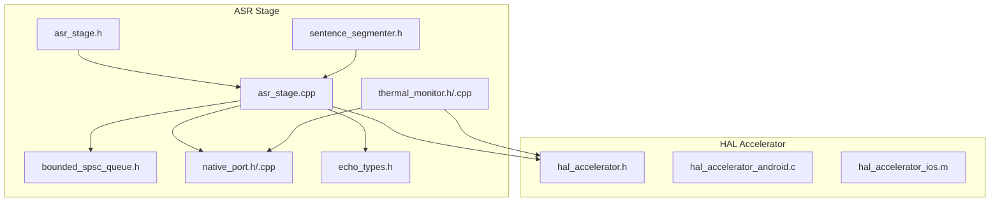
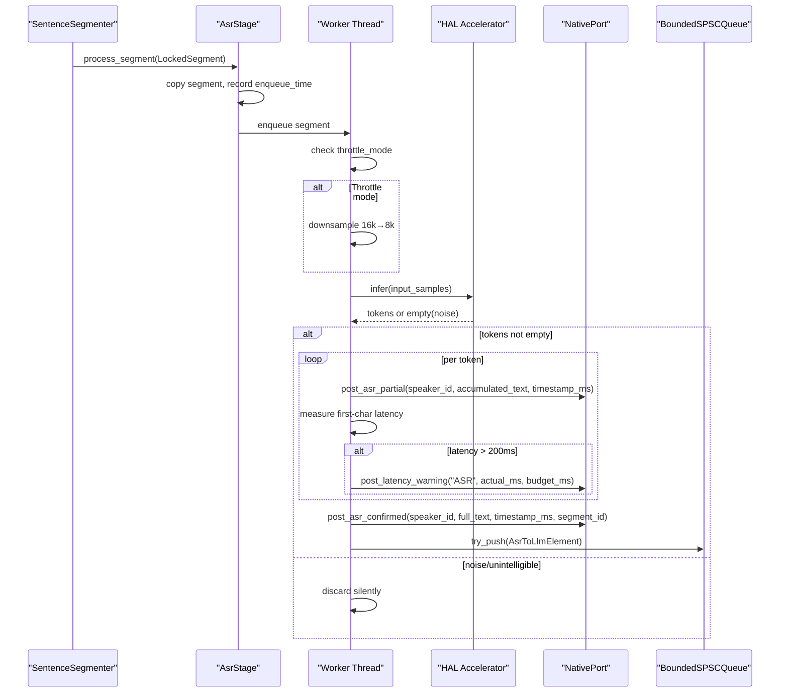
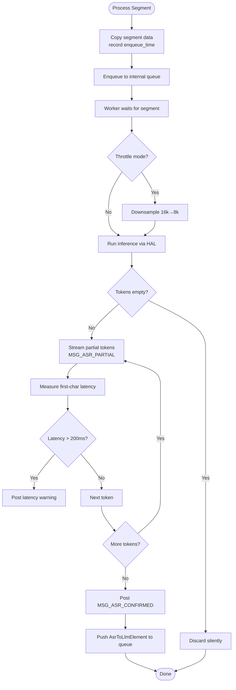
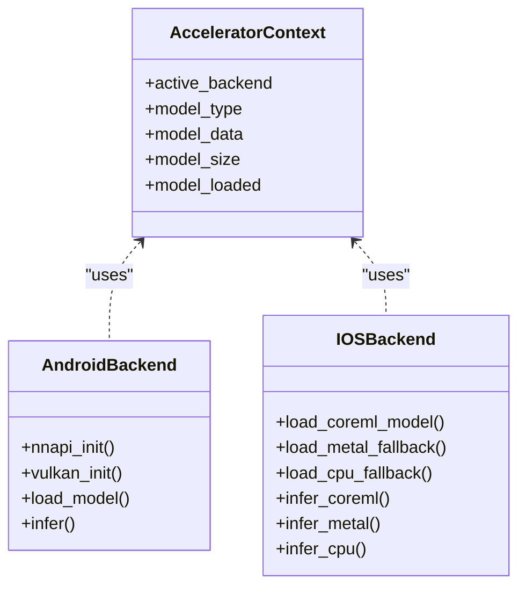
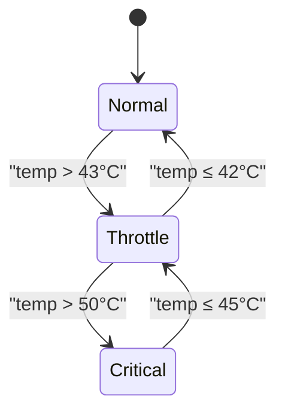
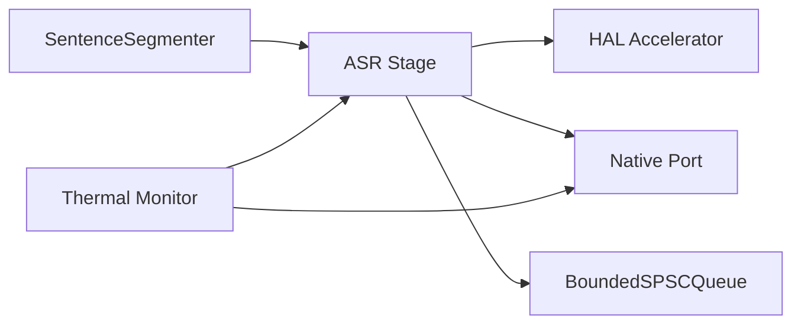

# ASR Stage - Speech Recognition

<cite>
**Referenced Files in This Document**
- [asr_stage.h](file://native/include/asr_stage.h)
- [asr_stage.cpp](file://native/src/asr_stage.cpp)
- [thermal_monitor.h](file://native/include/thermal_monitor.h)
- [thermal_monitor.cpp](file://native/src/thermal_monitor.cpp)
- [hal_accelerator.h](file://native/hal/hal_accelerator.h)
- [hal_accelerator_android.c](file://native/hal/android/hal_accelerator_android.c)
- [hal_accelerator_ios.m](file://native/hal/ios/hal_accelerator_ios.m)
- [native_port.h](file://native/include/native_port.h)
- [native_port.cpp](file://native/src/native_port.cpp)
- [sentence_segmenter.h](file://native/include/sentence_segmenter.h)
- [echo_types.h](file://native/include/echo_types.h)
- [bounded_spsc_queue.h](file://native/include/bounded_spsc_queue.h)
- [test_asr_stage.cpp](file://native/tests/test_asr_stage.cpp)
</cite>

## Table of Contents
1. [Introduction](#introduction)
2. [Project Structure](#project-structure)
3. [Core Components](#core-components)
4. [Architecture Overview](#architecture-overview)
5. [Detailed Component Analysis](#detailed-component-analysis)
6. [Dependency Analysis](#dependency-analysis)
7. [Performance Considerations](#performance-considerations)
8. [Troubleshooting Guide](#troubleshooting-guide)
9. [Conclusion](#conclusion)

## Introduction
This document explains the ASR (Automatic Speech Recognition) stage that converts speech to text using FunASR-Nano through a Hardware Accelerator HAL with NPU-first and CPU fallback. It covers:
- Worker thread processing pipeline
- HAL integration for inference acceleration
- Streaming partial tokens and confirmed text outputs
- Thermal mode system (Normal 16kHz vs Throttle 8kHz resampling)
- SLA enforcement for first-character latency ≤200ms
- Integration with the sentence segmenter
- Noise-only filtering, error handling, and resource management

## Project Structure
The ASR stage is implemented in C/C++ under native/, with platform-specific HAL backends for Android and iOS. The public API is exposed via asr_stage.h and integrates with Native Port messaging, thermal monitoring, and bounded queues.

**Diagram sources**
- [asr_stage.h:1-104](file://native/include/asr_stage.h#L1-L104)
- [asr_stage.cpp:1-341](file://native/src/asr_stage.cpp#L1-L341)
- [bounded_spsc_queue.h:1-145](file://native/include/bounded_spsc_queue.h#L1-L145)
- [native_port.h:1-179](file://native/include/native_port.h#L1-L179)
- [native_port.cpp:1-320](file://native/src/native_port.cpp#L1-L320)
- [thermal_monitor.h:1-109](file://native/include/thermal_monitor.h#L1-L109)
- [thermal_monitor.cpp:1-190](file://native/src/thermal_monitor.cpp#L1-L190)
- [sentence_segmenter.h:1-142](file://native/include/sentence_segmenter.h#L1-L142)
- [echo_types.h:1-136](file://native/include/echo_types.h#L1-L136)
- [hal_accelerator.h:1-81](file://native/hal/hal_accelerator.h#L1-L81)
- [hal_accelerator_android.c:1-496](file://native/hal/android/hal_accelerator_android.c#L1-L496)
- [hal_accelerator_ios.m:1-401](file://native/hal/ios/hal_accelerator_ios.m#L1-L401)

**Section sources**
- [asr_stage.h:1-104](file://native/include/asr_stage.h#L1-L104)
- [asr_stage.cpp:1-341](file://native/src/asr_stage.cpp#L1-L341)
- [native_port.h:1-179](file://native/include/native_port.h#L1-L179)
- [native_port.cpp:1-320](file://native/src/native_port.cpp#L1-L320)
- [thermal_monitor.h:1-109](file://native/include/thermal_monitor.h#L1-L109)
- [thermal_monitor.cpp:1-190](file://native/src/thermal_monitor.cpp#L1-L190)
- [hal_accelerator.h:1-81](file://native/hal/hal_accelerator.h#L1-L81)
- [hal_accelerator_android.c:1-496](file://native/hal/android/hal_accelerator_android.c#L1-L496)
- [hal_accelerator_ios.m:1-401](file://native/hal/ios/hal_accelerator_ios.m#L1-L401)
- [sentence_segmenter.h:1-142](file://native/include/sentence_segmenter.h#L1-L142)
- [echo_types.h:1-136](file://native/include/echo_types.h#L1-L136)
- [bounded_spsc_queue.h:1-145](file://native/include/bounded_spsc_queue.h#L1-L145)

## Core Components
- ASR Stage: Asynchronous worker processes LockedSegment inputs, optionally resamples audio, runs inference via HAL, streams partial tokens, emits confirmed text, enqueues results, and monitors SLA.
- HAL Accelerator: Platform abstraction for NPU/GPU/CPU inference with automatic fallback.
- Thermal Monitor: Low-priority polling thread implementing hysteresis-based thermal state machine; notifies UI and Engine Manager on transitions.
- Native Port: Typed message dispatch from native engine to Flutter UI Shell.
- Sentence Segmenter: VAD + sentence boundary detection producing LockedSegments for ASR.
- Bounded SPSC Queue: Lock-free queue with overflow-drop semantics used for ASR→LLM inter-stage communication.

Key responsibilities:
- Non-blocking enqueueing of segments
- Streaming partial tokens via MSG_ASR_PARTIAL
- Finalizing confirmed text via MSG_ASR_CONFIRMED and bounded queue push
- Enforcing ≤200ms first-character latency SLA by reporting violations
- Thermal-driven resampling (Throttle mode downsamples 16kHz → 8kHz)

**Section sources**
- [asr_stage.h:1-104](file://native/include/asr_stage.h#L1-L104)
- [asr_stage.cpp:1-341](file://native/src/asr_stage.cpp#L1-L341)
- [hal_accelerator.h:1-81](file://native/hal/hal_accelerator.h#L1-L81)
- [thermal_monitor.h:1-109](file://native/include/thermal_monitor.h#L1-L109)
- [native_port.h:1-179](file://native/include/native_port.h#L1-L179)
- [sentence_segmenter.h:1-142](file://native/include/sentence_segmenter.h#L1-L142)
- [bounded_spsc_queue.h:1-145](file://native/include/bounded_spsc_queue.h#L1-L145)

## Architecture Overview
The ASR stage orchestrates a multi-threaded pipeline:
- Producer threads (e.g., Sentence Segmenter) call asr_stage_process_segment to enqueue LockedSegments.
- A dedicated worker thread dequeues segments, applies optional resampling, performs inference via HAL, streams partials, finalizes confirmed text, and pushes into the ASR→LLM queue.
- Thermal Monitor independently polls device temperature and drives Normal/Throttle modes; ASR reads throttle_mode atomically to decide resampling.
- Native Port posts typed messages to the UI shell for real-time updates and warnings.

**Diagram sources**
- [asr_stage.cpp:167-271](file://native/src/asr_stage.cpp#L167-L271)
- [native_port.h:100-166](file://native/include/native_port.h#L100-L166)
- [native_port.cpp:116-154](file://native/src/native_port.cpp#L116-L154)
- [bounded_spsc_queue.h:51-85](file://native/include/bounded_spsc_queue.h#L51-L85)

## Detailed Component Analysis

### ASR Stage Implementation
Responsibilities:
- Create/destroy stage with worker thread lifecycle
- Process segments asynchronously
- Stream partial tokens and finalize confirmed text
- Enqueue confirmed text into ASR→LLM queue
- Report SLA violations when first-character latency exceeds 200ms
- Support thermal-driven resampling (Throttle mode)

Key behaviors:
- Non-blocking enqueue via internal queue and condition variable
- Optional resampling from 16kHz to 8kHz based on throttle_mode
- Stub inference path simulates token generation; production uses HAL accelerator
- Noise-only segments are discarded without output
- First partial timing measured against enqueue time; latency warning posted if exceeded

**Diagram sources**
- [asr_stage.cpp:167-271](file://native/src/asr_stage.cpp#L167-L271)

**Section sources**
- [asr_stage.h:42-97](file://native/include/asr_stage.h#L42-L97)
- [asr_stage.cpp:277-341](file://native/src/asr_stage.cpp#L277-L341)
- [asr_stage.cpp:167-271](file://native/src/asr_stage.cpp#L167-L271)

### HAL Accelerator Integration (NPU-first, CPU fallback)
Platform backends:
- Android: NNAPI primary, Vulkan compute secondary, CPU fallback
- iOS: CoreML primary, Metal Performance Shaders secondary, CPU fallback

Lifecycle:
- hal_accelerator_create selects best available backend
- hal_accelerator_load_model loads GGUF model and configures backend
- hal_accelerator_infer executes inference on selected backend
- Automatic fallback occurs on initialization or model load failure

**Diagram sources**
- [hal_accelerator.h:19-74](file://native/hal/hal_accelerator.h#L19-L74)
- [hal_accelerator_android.c:75-91](file://native/hal/android/hal_accelerator_android.c#L75-L91)
- [hal_accelerator_ios.m:35-50](file://native/hal/ios/hal_accelerator_ios.m#L35-L50)

**Section sources**
- [hal_accelerator.h:1-81](file://native/hal/hal_accelerator.h#L1-L81)
- [hal_accelerator_android.c:282-409](file://native/hal/android/hal_accelerator_android.c#L282-L409)
- [hal_accelerator_ios.m:203-221](file://native/hal/ios/hal_accelerator_ios.m#L203-L221)

### Thermal Mode System
Thermal Monitor implements a three-mode state machine with hysteresis:
- Normal → Throttle when temp > 43°C
- Throttle → Normal when temp ≤ 42°C
- Throttle → Critical when temp > 50°C
- Critical → Throttle when temp ≤ 45°C

On each transition:
- Posts MSG_THERMAL_STATE via Native Port
- Invokes user callback for Engine Manager adaptation

ASR stage reads throttle_mode atomically to decide whether to resample audio before inference.

**Diagram sources**
- [thermal_monitor.cpp:28-92](file://native/src/thermal_monitor.cpp#L28-L92)

**Section sources**
- [thermal_monitor.h:26-102](file://native/include/thermal_monitor.h#L26-L102)
- [thermal_monitor.cpp:99-128](file://native/src/thermal_monitor.cpp#L99-L128)
- [asr_stage.cpp:193-202](file://native/src/asr_stage.cpp#L193-L202)

### Native Port Messaging
Typed message functions serialize payloads and dispatch via Dart Native Port:
- MSG_ASR_PARTIAL: streaming partial text updates
- MSG_ASR_CONFIRMED: finalized text with segment metadata
- MSG_LATENCY_WARNING: SLA violation notifications
- MSG_THERMAL_STATE: thermal mode changes

**Section sources**
- [native_port.h:100-166](file://native/include/native_port.h#L100-L166)
- [native_port.cpp:116-154](file://native/src/native_port.cpp#L116-L154)
- [native_port.cpp:283-300](file://native/src/native_port.cpp#L283-L300)

### Sentence Segmenter Integration
The Sentence Segmenter produces LockedSegments based on VAD and sentence boundary detection:
- States: Idle → Accumulating → Locking
- Lock conditions: silence after speech, punctuation detection, or max duration
- Minimum speech duration required before locking

ASR consumes these segments via asr_stage_process_segment.

**Section sources**
- [sentence_segmenter.h:34-142](file://native/include/sentence_segmenter.h#L34-L142)
- [asr_stage.h:58-79](file://native/include/asr_stage.h#L58-L79)

### Bounded SPSC Queue
Lock-free bounded queue with overflow-drop semantics:
- Fixed capacity (power of two)
- Sequence numbers for occupancy tracking
- try_push returns true/false indicating overflow occurred
- Used for ASR→LLM inter-stage communication

**Section sources**
- [bounded_spsc_queue.h:29-145](file://native/include/bounded_spsc_queue.h#L29-L145)
- [asr_stage.cpp:254-269](file://native/src/asr_stage.cpp#L254-L269)

## Dependency Analysis
Component relationships:
- ASR Stage depends on HAL Accelerator for inference, Native Port for messaging, Bounded Queue for output, and reads thermal mode for resampling decisions.
- Thermal Monitor depends on HAL Thermal interface and Native Port for notifications.
- Sentence Segmenter provides input segments to ASR Stage.

**Diagram sources**
- [asr_stage.cpp:18-31](file://native/src/asr_stage.cpp#L18-L31)
- [thermal_monitor.cpp:18-26](file://native/src/thermal_monitor.cpp#L18-L26)

**Section sources**
- [asr_stage.cpp:18-31](file://native/src/asr_stage.cpp#L18-L31)
- [thermal_monitor.cpp:18-26](file://native/src/thermal_monitor.cpp#L18-L26)

## Performance Considerations
- SLA Enforcement: First-character latency measured from segment enqueue to first partial; violations reported via MSG_LATENCY_WARNING when exceeding 200ms budget.
- Throttle Mode: Reduces computational load by resampling audio to 8kHz, improving latency at potential cost of accuracy.
- Overflow Handling: Bounded queue drops oldest elements under pressure to maintain non-blocking behavior.
- Backend Selection: NPU-first acceleration ensures optimal performance with graceful fallback to CPU when needed.

[No sources needed since this section provides general guidance]

## Troubleshooting Guide
Common issues and strategies:
- Null pointer errors: Validate stage and segment pointers before processing; return negative error codes for invalid inputs.
- Empty audio segments: Reject segments with zero sample count or null audio data.
- Noise-only segments: Silently discarded without output; verify energy threshold configuration if unexpected behavior occurs.
- Resource cleanup: Ensure proper destruction sequence to stop worker threads and join them safely.
- Thermal transitions: Monitor thermal state changes and adjust processing parameters accordingly.

**Section sources**
- [asr_stage.cpp:297-318](file://native/src/asr_stage.cpp#L297-L318)
- [asr_stage.cpp:325-338](file://native/src/asr_stage.cpp#L325-L338)
- [test_asr_stage.cpp:167-191](file://native/tests/test_asr_stage.cpp#L167-L191)

## Conclusion
The ASR stage provides a robust, high-performance speech-to-text pipeline with:
- Asynchronous worker thread processing
- Hardware-accelerated inference with automatic fallback
- Streaming partial tokens and confirmed text outputs
- Thermal-aware processing with Normal and Throttle modes
- Strict SLA enforcement for first-character latency
- Comprehensive error handling and resource management

The design balances performance, reliability, and adaptability across different hardware platforms while maintaining clear interfaces for integration with other pipeline components.

[No sources needed since this section summarizes without analyzing specific files]