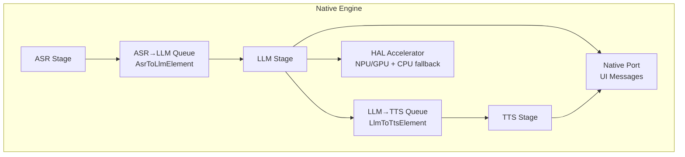
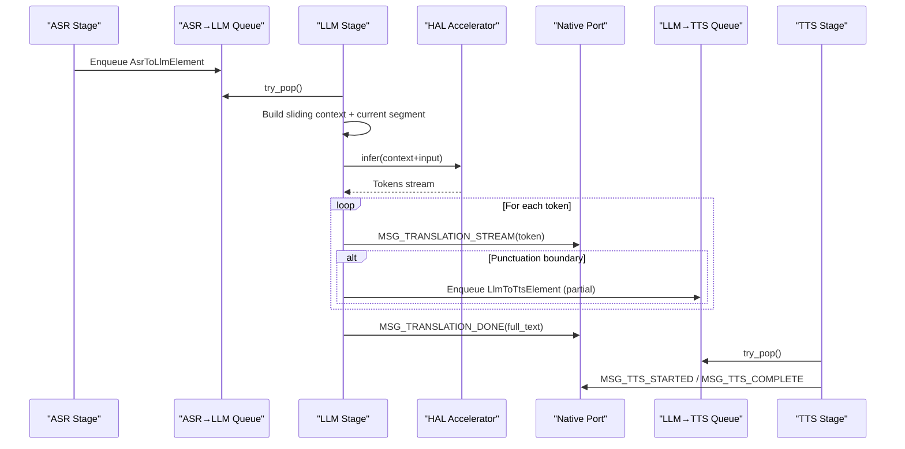
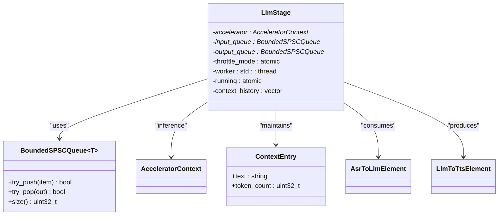
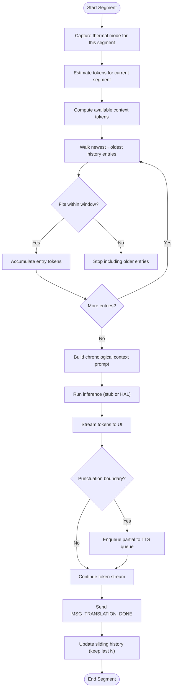
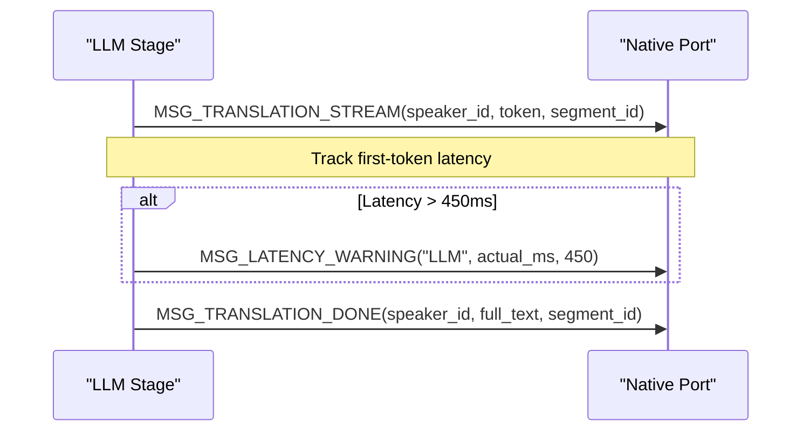
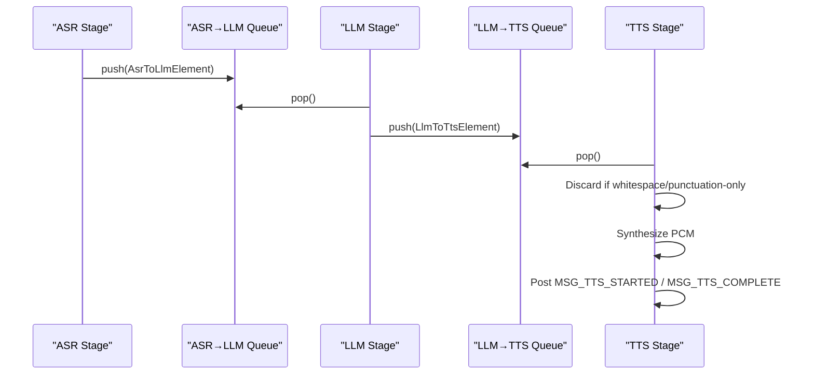
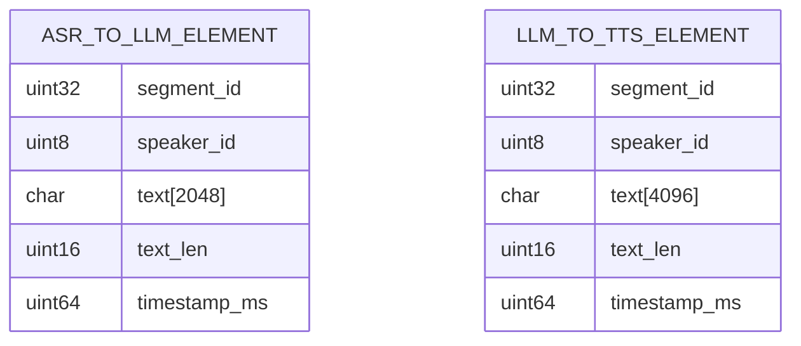
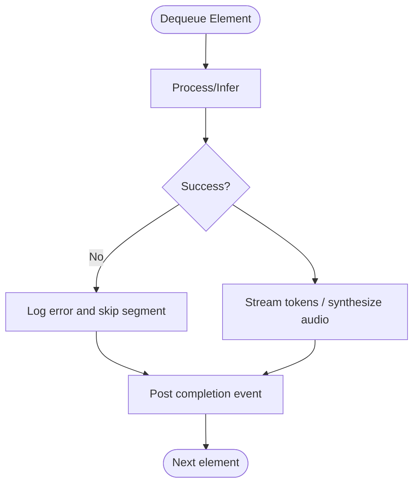
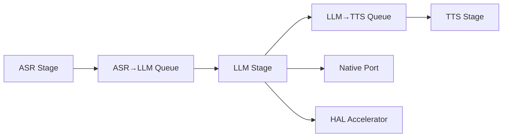

# LLM Stage - Language Translation

<cite>
**Referenced Files in This Document**
- [llm_stage.h](file://native/include/llm_stage.h)
- [llm_stage.cpp](file://native/src/llm_stage.cpp)
- [asr_stage.h](file://native/include/asr_stage.h)
- [tts_stage.h](file://native/include/tts_stage.h)
- [echo_types.h](file://native/include/echo_types.h)
- [bounded_spsc_queue.h](file://native/include/bounded_spsc_queue.h)
- [native_port.h](file://native/include/native_port.h)
- [hal_accelerator.h](file://native/hal/hal_accelerator.h)
- [README.md](file://README.md)
</cite>

## Table of Contents
1. [Introduction](#introduction)
2. [Project Structure](#project-structure)
3. [Core Components](#core-components)
4. [Architecture Overview](#architecture-overview)
5. [Detailed Component Analysis](#detailed-component-analysis)
6. [Dependency Analysis](#dependency-analysis)
7. [Performance Considerations](#performance-considerations)
8. [Troubleshooting Guide](#troubleshooting-guide)
9. [Conclusion](#conclusion)
10. [Appendices](#appendices)

## Introduction
This document provides a comprehensive guide to the LLM stage responsible for bilingual translation using Qwen3-4B-Instruct within an on-device, offline interpretation pipeline. It explains how the LLM stage integrates with ASR and TTS stages, manages context windows with cascade truncation, streams tokens for real-time display, and transforms data between AsrToLlmElement and LlmToTtsElement formats. It also covers configuration, error recovery, model loading strategies, and performance tuning across device capabilities.

## Project Structure
The LLM stage is part of a three-stage pipeline: ASR → LLM → TTS. The LLM stage consumes confirmed text from ASR via a bounded queue, translates it using the accelerator-backed inference interface, streams tokens to the UI, and enqueues translated segments to TTS.

**Diagram sources**
- [llm_stage.h:1-93](file://native/include/llm_stage.h#L1-L93)
- [llm_stage.cpp:1-412](file://native/src/llm_stage.cpp#L1-L412)
- [asr_stage.h:1-104](file://native/include/asr_stage.h#L1-L104)
- [tts_stage.h:1-79](file://native/include/tts_stage.h#L1-L79)
- [echo_types.h:64-86](file://native/include/echo_types.h#L64-L86)
- [bounded_spsc_queue.h:1-145](file://native/include/bounded_spsc_queue.h#L1-L145)
- [native_port.h:100-172](file://native/include/native_port.h#L100-L172)
- [hal_accelerator.h:1-81](file://native/hal/hal_accelerator.h#L1-L81)

**Section sources**
- [README.md:15-40](file://README.md#L15-L40)
- [llm_stage.h:1-24](file://native/include/llm_stage.h#L1-L24)

## Core Components
- LLM Stage: Worker thread polls ASR→LLM queue, builds sliding context, runs inference via HAL, streams tokens to UI, applies cascade truncation to enqueue partial translations to TTS, and updates sliding history.
- Inter-stage Queues: BoundedSPSCQueue<T> with overflow-drop semantics ensures non-blocking, lock-free communication.
- Data Structures: AsrToLlmElement (ASR output) and LlmToTtsElement (LLM output) define payload shapes and lifetimes.
- Native Port: Typed message dispatch functions send streaming tokens and completion events to the Flutter UI.
- HAL Accelerator: Abstracts NPU/GPU acceleration with CPU fallback; supports MODEL_TYPE_LLM for Qwen3-4B-Instruct.

Key responsibilities and SLAs:
- First-token latency budget ≤450ms.
- Throughput target ≥35 tokens/second.
- Cascade truncation at punctuation boundaries to start TTS early.

**Section sources**
- [llm_stage.h:1-24](file://native/include/llm_stage.h#L1-L24)
- [llm_stage.cpp:40-54](file://native/src/llm_stage.cpp#L40-L54)
- [bounded_spsc_queue.h:8-28](file://native/include/bounded_spsc_queue.h#L8-L28)
- [echo_types.h:64-86](file://native/include/echo_types.h#L64-L86)
- [native_port.h:116-127](file://native/include/native_port.h#L116-L127)
- [hal_accelerator.h:22-26](file://native/hal/hal_accelerator.h#L22-L26)

## Architecture Overview
End-to-end flow for a single segment:
1. ASR confirms text and enqueues AsrToLlmElement into ASR→LLM queue.
2. LLM worker dequeues, constructs prompt with sliding context, infers tokens, streams MSG_TRANSLATION_STREAM, and enqueues partial/full translations as LlmToTtsElement into LLM→TTS queue.
3. TTS discards whitespace/punctuation-only segments, synthesizes audio, and posts lifecycle messages.

**Diagram sources**
- [llm_stage.cpp:243-361](file://native/src/llm_stage.cpp#L243-L361)
- [native_port.h:116-127](file://native/include/native_port.h#L116-L127)
- [bounded_spsc_queue.h:51-116](file://native/include/bounded_spsc_queue.h#L51-L116)
- [hal_accelerator.h:53-67](file://native/hal/hal_accelerator.h#L53-L67)

## Detailed Component Analysis

### LLM Stage Internal Design
The LLM stage maintains:
- A worker thread polling the input queue.
- A sliding context window of last N confirmed translations.
- Thermal-mode-aware context window sizes.
- Token streaming and cascade truncation logic.
- Latency tracking and warning reporting.

**Diagram sources**
- [llm_stage.cpp:68-87](file://native/src/llm_stage.cpp#L68-L87)
- [bounded_spsc_queue.h:29-142](file://native/include/bounded_spsc_queue.h#L29-L142)
- [echo_types.h:68-86](file://native/include/echo_types.h#L68-L86)
- [hal_accelerator.h:29-32](file://native/hal/hal_accelerator.h#L29-L32)

#### Context Window Management and Cascade Truncation
- Sliding history: last 3 confirmed translations prepended to prompts.
- Window sizes: Normal = 512 tokens; Throttle = 256 tokens.
- Truncation strategy: oldest entries removed first when combined tokens exceed window.
- Mid-translation mode change: current segment completes with original window; next segment uses new window.
- Cascade truncation: partial results enqueued to TTS at punctuation boundaries (. ! ?).

**Diagram sources**
- [llm_stage.cpp:116-156](file://native/src/llm_stage.cpp#L116-L156)
- [llm_stage.cpp:243-361](file://native/src/llm_stage.cpp#L243-L361)

**Section sources**
- [llm_stage.h:13-21](file://native/include/llm_stage.h#L13-L21)
- [llm_stage.cpp:43-50](file://native/src/llm_stage.cpp#L43-L50)
- [llm_stage.cpp:116-156](file://native/src/llm_stage.cpp#L116-L156)
- [llm_stage.cpp:243-361](file://native/src/llm_stage.cpp#L243-L361)

### Streaming Token Output Mechanism
- Each token is posted via MSG_TRANSLATION_STREAM with speaker_id and segment_id.
- First-token latency measured against dequeue time; if >450ms, MSG_LATENCY_WARNING("LLM", actual_ms, 450) is sent.
- Full translation completion posted via MSG_TRANSLATION_DONE.

**Diagram sources**
- [llm_stage.cpp:298-317](file://native/src/llm_stage.cpp#L298-L317)
- [native_port.h:116-127](file://native/include/native_port.h#L116-L127)

**Section sources**
- [llm_stage.cpp:298-317](file://native/src/llm_stage.cpp#L298-L317)
- [native_port.h:116-127](file://native/include/native_port.h#L116-L127)

### Integration with ASR Input Queue and TTS Output Queue
- ASR produces AsrToLlmElement and pushes into ASR→LLM queue.
- LLM consumes AsrToLlmElement, processes, and enqueues LlmToTtsElement into LLM→TTS queue.
- TTS consumes LlmToTtsElement, discards whitespace/punctuation-only segments, synthesizes audio, and posts lifecycle messages.

**Diagram sources**
- [asr_stage.h:49-53](file://native/include/asr_stage.h#L49-L53)
- [llm_stage.cpp:218-237](file://native/src/llm_stage.cpp#L218-L237)
- [tts_stage.cpp:200-272](file://native/src/tts_stage.cpp#L200-L272)
- [bounded_spsc_queue.h:51-116](file://native/include/bounded_spsc_queue.h#L51-L116)

**Section sources**
- [asr_stage.h:49-53](file://native/include/asr_stage.h#L49-L53)
- [llm_stage.cpp:218-237](file://native/src/llm_stage.cpp#L218-L237)
- [tts_stage.cpp:200-272](file://native/src/tts_stage.cpp#L200-L272)

### Data Structure Transformations: AsrToLlmElement ↔ LlmToTtsElement
- AsrToLlmElement fields: segment_id, speaker_id, text[2048], text_len, timestamp_ms.
- LlmToTtsElement fields: segment_id, speaker_id, text[4096], text_len, timestamp_ms.
- Transformation: LLM copies segment_id, speaker_id, timestamp_ms; converts translated text into LlmToTtsElement and enqueues.

**Diagram sources**
- [echo_types.h:68-86](file://native/include/echo_types.h#L68-L86)

**Section sources**
- [echo_types.h:68-86](file://native/include/echo_types.h#L68-L86)
- [llm_stage.cpp:218-237](file://native/src/llm_stage.cpp#L218-L237)

### Error Handling and Recovery
- LLM: If no tokens produced, skip segment; otherwise stream and complete normally.
- TTS: On synthesis failure, log error, skip segment, still post MSG_TTS_COMPLETE to maintain lifecycle consistency.
- Latency warnings: Both LLM and TTS report SLA violations via MSG_LATENCY_WARNING.

**Diagram sources**
- [llm_stage.cpp:272-279](file://native/src/llm_stage.cpp#L272-L279)
- [tts_stage.cpp:241-252](file://native/src/tts_stage.cpp#L241-L252)

**Section sources**
- [llm_stage.cpp:272-279](file://native/src/llm_stage.cpp#L272-L279)
- [tts_stage.cpp:241-252](file://native/src/tts_stage.cpp#L241-L252)

## Dependency Analysis
- LLM depends on:
  - BoundedSPSCQueue for ASR→LLM and LLM→TTS queues.
  - Native Port for UI messaging.
  - HAL Accelerator for inference.
- ASR and TTS are independent consumers/producers connected by queues.

**Diagram sources**
- [llm_stage.cpp:22-26](file://native/src/llm_stage.cpp#L22-L26)
- [bounded_spsc_queue.h:1-28](file://native/include/bounded_spsc_queue.h#L1-L28)
- [native_port.h:100-172](file://native/include/native_port.h#L100-L172)
- [hal_accelerator.h:1-26](file://native/hal/hal_accelerator.h#L1-L26)

**Section sources**
- [llm_stage.cpp:22-26](file://native/src/llm_stage.cpp#L22-L26)
- [bounded_spsc_queue.h:1-28](file://native/include/bounded_spsc_queue.h#L1-L28)
- [native_port.h:100-172](file://native/include/native_port.h#L100-L172)
- [hal_accelerator.h:1-26](file://native/hal/hal_accelerator.h#L1-L26)

## Performance Considerations
- Context window sizing:
  - Normal mode: 512 tokens.
  - Throttle mode: 256 tokens.
  - Adjust based on device memory and thermal state.
- Cascade truncation reduces TTFA by starting TTS earlier.
- Polling intervals:
  - LLM/TTS poll every ~5ms when queues empty to balance latency and CPU usage.
- Throughput targets:
  - LLM ≥35 tokens/second.
  - E2E budgets: Normal ≤800ms; Throttle ≤1200ms.

Optimization tips:
- Prefer NPU/GPU acceleration via HAL; ensure models are INT4 GGUF for efficiency.
- Keep sliding history small (default 3) to reduce prompt size.
- Use throttle mode under thermal pressure to reduce context and resample ASR to 8kHz.

**Section sources**
- [llm_stage.cpp:43-54](file://native/src/llm_stage.cpp#L43-L54)
- [README.md:140-147](file://README.md#L140-L147)
- [llm_stage.cpp:243-251](file://native/src/llm_stage.cpp#L243-L251)

## Troubleshooting Guide
Common issues and remedies:
- No translation tokens produced:
  - Check input text length and content; verify ASR confirmation and queue connectivity.
- Excessive first-token latency:
  - Monitor MSG_LATENCY_WARNING("LLM", ...); consider reducing context window or switching to throttle mode.
- TTS failures:
  - Verify text is not whitespace/punctuation-only; check synthesis result codes; ensure completion events are posted.
- Memory pressure:
  - Reduce context window size; release KV caches; stop pipeline if critical thresholds reached.

Operational checks:
- Ensure Native Port is registered before starting pipeline.
- Validate language pair support; unsupported pairs return specific error codes.

**Section sources**
- [llm_stage.cpp:314-316](file://native/src/llm_stage.cpp#L314-L316)
- [tts_stage.cpp:241-252](file://native/src/tts_stage.cpp#L241-L252)
- [native_port.h:77-84](file://native/include/native_port.h#L77-L84)
- [echo_types.h:48-62](file://native/include/echo_types.h#L48-L62)

## Conclusion
The LLM stage implements robust bilingual translation with efficient context management, real-time token streaming, and seamless integration with ASR and TTS stages. Its design emphasizes low-latency operation, resilience to errors, and adaptability to thermal and memory constraints through configurable context windows and cascade truncation. Proper configuration of language pairs, context sizes, and thermal modes ensures optimal performance across diverse devices.

## Appendices

### Configuration Examples
- Language pairs:
  - Provide ISO 639-1 source and target languages during pipeline start.
- Context windows:
  - Normal: 512 tokens; Throttle: 256 tokens.
  - Sliding history count: 3 previous translations.
- Long conversations:
  - Maintain last N translations in context; older entries truncated automatically.
- Latency optimization:
  - Enable cascade truncation; use throttle mode under thermal pressure; prefer NPU/GPU acceleration.

**Section sources**
- [llm_stage.h:13-21](file://native/include/llm_stage.h#L13-L21)
- [llm_stage.cpp:43-50](file://native/src/llm_stage.cpp#L43-L50)
- [llm_stage.cpp:116-156](file://native/src/llm_stage.cpp#L116-L156)
- [README.md:149-156](file://README.md#L149-L156)