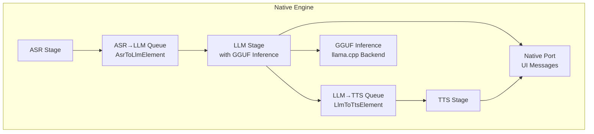
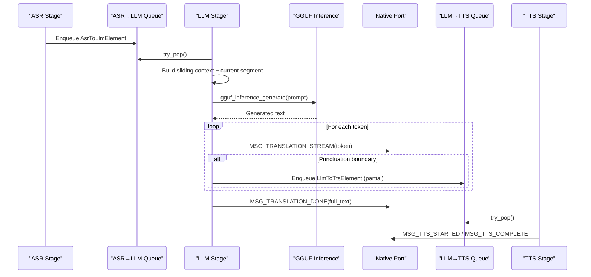
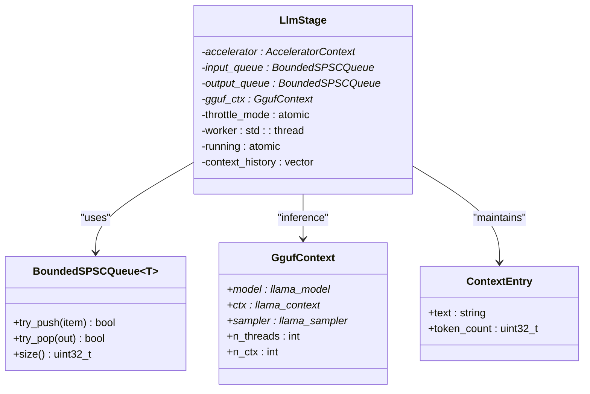
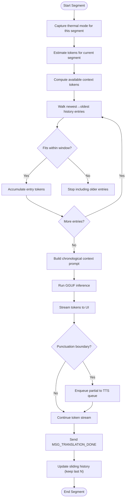
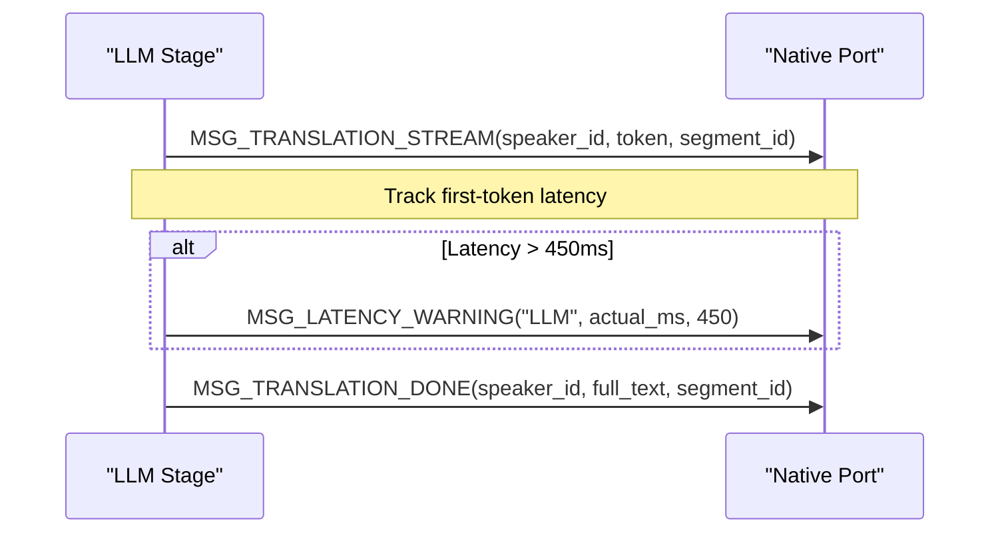
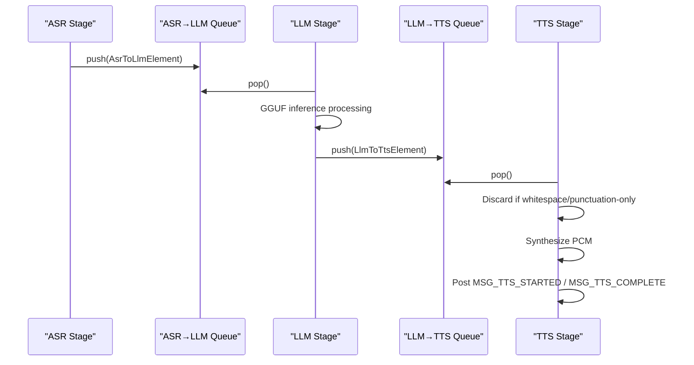
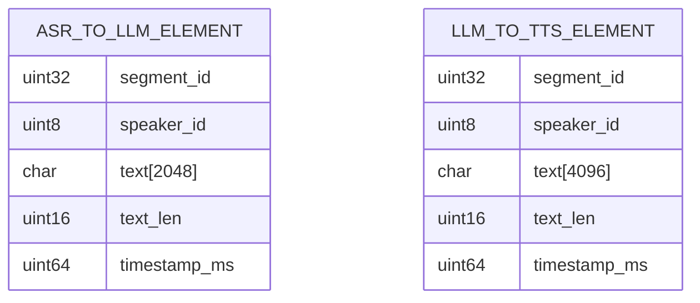
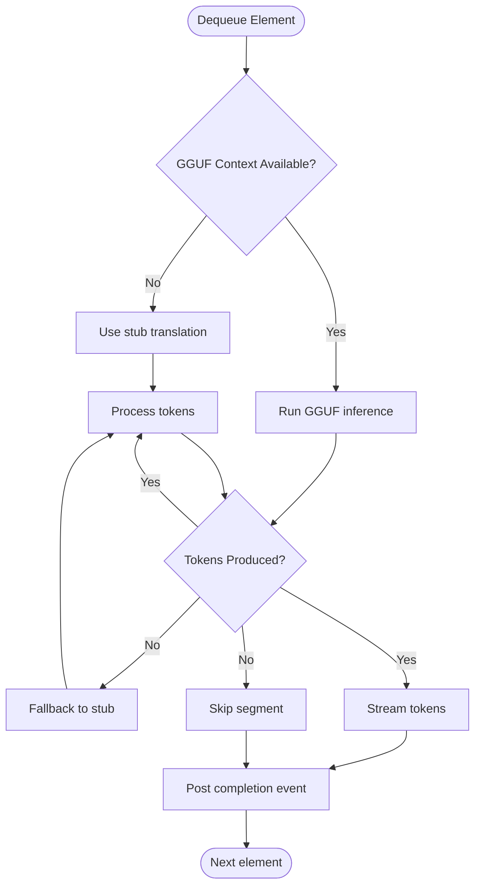
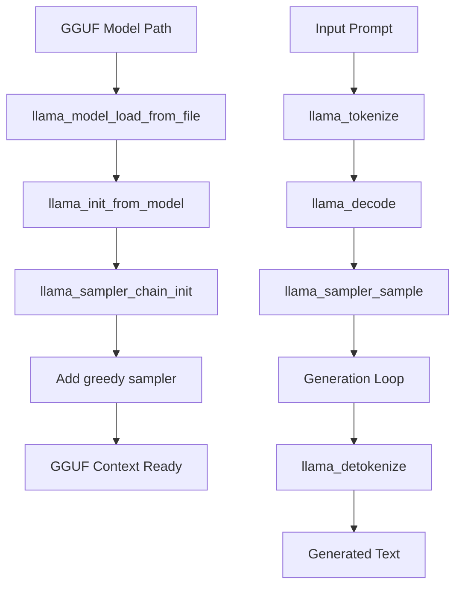
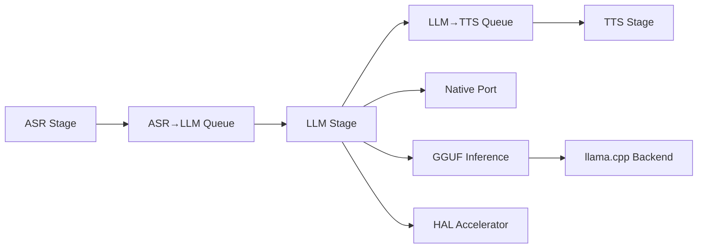

# LLM Stage - Language Translation

<cite>
**Referenced Files in This Document**
- [llm_stage.h](file://native/include/llm_stage.h)
- [llm_stage.cpp](file://native/src/llm_stage.cpp)
- [gguf_inference.h](file://native/include/gguf_inference.h)
- [gguf_inference.cpp](file://native/src/gguf_inference.cpp)
- [asr_stage.h](file://native/include/asr_stage.h)
- [tts_stage.h](file://native/include/tts_stage.h)
- [echo_types.h](file://native/include/echo_types.h)
- [bounded_spsc_queue.h](file://native/include/bounded_spsc_queue.h)
- [native_port.h](file://native/include/native_port.h)
- [hal_accelerator.h](file://native/hal/hal_accelerator.h)
- [README.md](file://README.md)
</cite>

## Update Summary
**Changes Made**
- Updated LLM inference implementation from stub-based to real GGUF model inference using llama.cpp
- Added comprehensive GGUF context management and model loading capabilities
- Enhanced logging system with detailed debugging information throughout the pipeline
- Updated architecture diagrams to reflect real-time GGUF inference flow
- Added new sections covering GGUF model integration and performance optimization

## Table of Contents
1. [Introduction](#introduction)
2. [Project Structure](#project-structure)
3. [Core Components](#core-components)
4. [Architecture Overview](#architecture-overview)
5. [Detailed Component Analysis](#detailed-component-analysis)
6. [GGUF Model Integration](#gguf-model-integration)
7. [Dependency Analysis](#dependency-analysis)
8. [Performance Considerations](#performance-considerations)
9. [Troubleshooting Guide](#troubleshooting-guide)
10. [Conclusion](#conclusion)
11. [Appendices](#appendices)

## Introduction
This document provides a comprehensive guide to the LLM stage responsible for bilingual translation using Qwen3-4B-Instruct within an on-device, offline interpretation pipeline. The LLM stage now implements real GGUF model inference through llama.cpp, providing authentic translation capabilities while maintaining efficient context window management with cascade truncation, streaming token output for real-time display, and seamless integration with ASR and TTS stages. It explains data transformations between AsrToLlmElement and LlmToTtsElement formats, configuration options, error recovery mechanisms, model loading strategies, and performance tuning across different device capabilities.

## Project Structure
The LLM stage is part of a three-stage pipeline: ASR → LLM → TTS. The LLM stage consumes confirmed text from ASR via a bounded queue, translates it using real GGUF model inference through llama.cpp, streams tokens to the UI, and enqueues translated segments to TTS.

**Diagram sources**
- [llm_stage.h:1-94](file://native/include/llm_stage.h#L1-L94)
- [llm_stage.cpp:1-470](file://native/src/llm_stage.cpp#L1-L470)
- [gguf_inference.h:1-98](file://native/include/gguf_inference.h#L1-L98)
- [gguf_inference.cpp:1-346](file://native/src/gguf_inference.cpp#L1-L346)
- [asr_stage.h:1-104](file://native/include/asr_stage.h#L1-L104)
- [tts_stage.h:1-79](file://native/include/tts_stage.h#L1-L79)
- [echo_types.h:64-86](file://native/include/echo_types.h#L64-L86)
- [bounded_spsc_queue.h:1-145](file://native/include/bounded_spsc_queue.h#L1-L145)
- [native_port.h:100-172](file://native/include/native_port.h#L100-L172)

**Section sources**
- [README.md:15-40](file://README.md#L15-L40)
- [llm_stage.h:1-24](file://native/include/llm_stage.h#L1-L24)

## Core Components
- **LLM Stage**: Worker thread polls ASR→LLM queue, builds sliding context, runs real GGUF inference via llama.cpp, streams tokens to UI, applies cascade truncation to enqueue partial translations to TTS, and updates sliding history.
- **GGUF Inference Layer**: Thin wrapper around llama.cpp providing model loading, tokenization, generation, and detokenization APIs.
- **Inter-stage Queues**: BoundedSPSCQueue<T> with overflow-drop semantics ensures non-blocking, lock-free communication.
- **Data Structures**: AsrToLlmElement (ASR output) and LlmToTtsElement (LLM output) define payload shapes and lifetimes.
- **Native Port**: Typed message dispatch functions send streaming tokens and completion events to the Flutter UI.

Key responsibilities and SLAs:
- First-token latency budget ≤450ms.
- Throughput target ≥35 tokens/second.
- Cascade truncation at punctuation boundaries to start TTS early.
- Real GGUF model inference with fallback to stub mode when models are unavailable.

**Section sources**
- [llm_stage.h:1-24](file://native/include/llm_stage.h#L1-L24)
- [llm_stage.cpp:40-54](file://native/src/llm_stage.cpp#L40-L54)
- [bounded_spsc_queue.h:8-28](file://native/include/bounded_spsc_queue.h#L8-L28)
- [echo_types.h:64-86](file://native/include/echo_types.h#L64-L86)
- [native_port.h:116-127](file://native/include/native_port.h#L116-L127)

## Architecture Overview
End-to-end flow for a single segment with real GGUF inference:
1. ASR confirms text and enqueues AsrToLlmElement into ASR→LLM queue.
2. LLM worker dequeues, constructs prompt with sliding context, calls gguf_inference_generate() for real translation, streams tokens to UI, and enqueues partial/full translations as LlmToTtsElement into LLM→TTS queue.
3. TTS discards whitespace/punctuation-only segments, synthesizes audio, and posts lifecycle messages.

**Diagram sources**
- [llm_stage.cpp:278-402](file://native/src/llm_stage.cpp#L278-L402)
- [gguf_inference.cpp:267-316](file://native/src/gguf_inference.cpp#L267-L316)
- [native_port.h:116-127](file://native/include/native_port.h#L116-L127)
- [bounded_spsc_queue.h:51-116](file://native/include/bounded_spsc_queue.h#L51-L116)

## Detailed Component Analysis

### LLM Stage Internal Design
The LLM stage maintains:
- A worker thread polling the input queue.
- A sliding context window of last N confirmed translations.
- Thermal-mode-aware context window sizes.
- Token streaming and cascade truncation logic.
- GGUF inference context for real model execution.
- Latency tracking and warning reporting.

**Diagram sources**
- [llm_stage.cpp:76-98](file://native/src/llm_stage.cpp#L76-L98)
- [gguf_inference.cpp:30-37](file://native/src/gguf_inference.cpp#L30-L37)
- [bounded_spsc_queue.h:29-142](file://native/include/bounded_spsc_queue.h#L29-L142)

#### Context Window Management and Cascade Truncation
- Sliding history: last 3 confirmed translations prepended to prompts.
- Window sizes: Normal = 512 tokens; Throttle = 256 tokens.
- Truncation strategy: oldest entries removed first when combined tokens exceed window.
- Mid-translation mode change: current segment completes with original window; next segment uses new window.
- Cascade truncation: partial results enqueued to TTS at punctuation boundaries (. ! ?).

**Diagram sources**
- [llm_stage.cpp:116-156](file://native/src/llm_stage.cpp#L116-L156)
- [llm_stage.cpp:278-402](file://native/src/llm_stage.cpp#L278-L402)

**Section sources**
- [llm_stage.h:13-21](file://native/include/llm_stage.h#L13-L21)
- [llm_stage.cpp:43-50](file://native/src/llm_stage.cpp#L43-L50)
- [llm_stage.cpp:116-156](file://native/src/llm_stage.cpp#L116-L156)
- [llm_stage.cpp:278-402](file://native/src/llm_stage.cpp#L278-L402)

### Streaming Token Output Mechanism
- Each token is posted via MSG_TRANSLATION_STREAM with speaker_id and segment_id.
- First-token latency measured against dequeue time; if >450ms, MSG_LATENCY_WARNING("LLM", actual_ms, 450) is sent.
- Full translation completion posted via MSG_TRANSLATION_DONE.

**Diagram sources**
- [llm_stage.cpp:324-389](file://native/src/llm_stage.cpp#L324-L389)
- [native_port.h:116-127](file://native/include/native_port.h#L116-L127)

**Section sources**
- [llm_stage.cpp:324-389](file://native/src/llm_stage.cpp#L324-L389)
- [native_port.h:116-127](file://native/include/native_port.h#L116-L127)

### Integration with ASR Input Queue and TTS Output Queue
- ASR produces AsrToLlmElement and pushes into ASR→LLM queue.
- LLM consumes AsrToLlmElement, processes with GGUF inference, and enqueues LlmToTtsElement into LLM→TTS queue.
- TTS consumes LlmToTtsElement, discards whitespace/punctuation-only segments, synthesizes audio, and posts lifecycle messages.

**Diagram sources**
- [asr_stage.h:49-53](file://native/include/asr_stage.h#L49-L53)
- [llm_stage.cpp:278-402](file://native/src/llm_stage.cpp#L278-L402)
- [bounded_spsc_queue.h:51-116](file://native/include/bounded_spsc_queue.h#L51-L116)

**Section sources**
- [asr_stage.h:49-53](file://native/include/asr_stage.h#L49-L53)
- [llm_stage.cpp:278-402](file://native/src/llm_stage.cpp#L278-L402)

### Data Structure Transformations: AsrToLlmElement ↔ LlmToTtsElement
- AsrToLlmElement fields: segment_id, speaker_id, text[2048], text_len, timestamp_ms.
- LlmToTtsElement fields: segment_id, speaker_id, text[4096], text_len, timestamp_ms.
- Transformation: LLM copies segment_id, speaker_id, timestamp_ms; converts translated text into LlmToTtsElement and enqueues.

**Diagram sources**
- [echo_types.h:68-86](file://native/include/echo_types.h#L68-L86)

**Section sources**
- [echo_types.h:68-86](file://native/include/echo_types.h#L68-L86)
- [llm_stage.cpp:253-272](file://native/src/llm_stage.cpp#L253-L272)

### Error Handling and Recovery
- **GGUF Fallback**: If GGUF model fails to load or inference fails, automatically falls back to stub mode.
- **LLM Processing**: If no tokens produced, skip segment; otherwise stream and complete normally.
- **Latency Monitoring**: Reports SLA violations via MSG_LATENCY_WARNING when first-token latency exceeds 450ms.

**Diagram sources**
- [llm_stage.cpp:181-248](file://native/src/llm_stage.cpp#L181-L248)
- [llm_stage.cpp:314-317](file://native/src/llm_stage.cpp#L314-L317)

**Section sources**
- [llm_stage.cpp:181-248](file://native/src/llm_stage.cpp#L181-L248)
- [llm_stage.cpp:314-317](file://native/src/llm_stage.cpp#L314-L317)

## GGUF Model Integration

### GGUF Inference Architecture
The GGUF inference layer provides a thin C++ wrapper around llama.cpp, implementing:
- **Model Loading**: Efficient GGUF model loading with memory-mapped files for mobile optimization.
- **Context Management**: Configurable context windows with automatic sizing based on model training parameters.
- **Tokenization Pipeline**: Prompt tokenization, generation loop, and detokenization.
- **Sampling Strategy**: Greedy sampling for deterministic translation output.
- **Streaming Support**: Optional per-token callback support for real-time generation.

**Diagram sources**
- [gguf_inference.cpp:57-127](file://native/src/gguf_inference.cpp#L57-L127)
- [gguf_inference.cpp:202-261](file://native/src/gguf_inference.cpp#L202-L261)

### Real Translation Implementation
The `real_translate_tokens()` function orchestrates the complete translation workflow:
1. **Input Validation**: Checks for empty input and GGUF context availability.
2. **Prompt Construction**: Builds translation prompts using chat templates.
3. **Inference Execution**: Calls `gguf_inference_generate()` for actual translation work.
4. **Token Processing**: Converts generated text into streaming tokens.
5. **Fallback Handling**: Automatically reverts to stub mode on inference failures.

**Section sources**
- [llm_stage.cpp:181-248](file://native/src/llm_stage.cpp#L181-L248)
- [gguf_inference.cpp:267-316](file://native/src/gguf_inference.cpp#L267-L316)

### Enhanced Logging System
Comprehensive logging throughout the pipeline provides detailed debugging information:
- **Model Loading**: Logs successful GGUF model initialization with context details.
- **Translation Processing**: Records input text, prompt construction, and generation results.
- **Error Tracking**: Captures inference failures and fallback scenarios.
- **Performance Metrics**: Monitors token generation and timing information.

**Section sources**
- [llm_stage.cpp:208-247](file://native/src/llm_stage.cpp#L208-L247)
- [gguf_inference.cpp:43-51](file://native/src/gguf_inference.cpp#L43-L51)
- [gguf_inference.cpp:121-124](file://native/src/gguf_inference.cpp#L121-L124)

## Dependency Analysis
- **LLM depends on**:
  - BoundedSPSCQueue for ASR→LLM and LLM→TTS queues.
  - Native Port for UI messaging.
  - GGUF Inference for real model execution.
  - HAL Accelerator for potential hardware acceleration.
- **GGUF Inference depends on**:
  - llama.cpp backend for core model operations.
  - Platform-specific optimizations for mobile deployment.
- **ASR and TTS are independent consumers/producers connected by queues**.

**Diagram sources**
- [llm_stage.cpp:22-26](file://native/src/llm_stage.cpp#L22-L26)
- [gguf_inference.cpp:9-11](file://native/src/gguf_inference.cpp#L9-L11)
- [bounded_spsc_queue.h:1-28](file://native/include/bounded_spsc_queue.h#L1-L28)
- [native_port.h:100-172](file://native/include/native_port.h#L100-L172)

**Section sources**
- [llm_stage.cpp:22-26](file://native/src/llm_stage.cpp#L22-L26)
- [gguf_inference.cpp:9-11](file://native/src/gguf_inference.cpp#L9-L11)
- [bounded_spsc_queue.h:1-28](file://native/include/bounded_spsc_queue.h#L1-L28)
- [native_port.h:100-172](file://native/include/native_port.h#L100-L172)

## Performance Considerations
- **Context Window Sizing**:
  - Normal mode: 512 tokens.
  - Throttle mode: 256 tokens.
  - GGUF context: Automatically sized based on model training parameters, capped at 2048 for mobile.
- **Cascade Truncation**: Reduces TTFA by starting TTS earlier at punctuation boundaries.
- **Polling Intervals**: LLM/TTS poll every ~5ms when queues empty to balance latency and CPU usage.
- **Throughput Targets**:
  - LLM ≥35 tokens/second.
  - E2E budgets: Normal ≤800ms; Throttle ≤1200ms.

**GGUF-Specific Optimizations**:
- **Memory Mapping**: Uses mmap for efficient model loading on mobile devices.
- **Greedy Sampling**: Deterministic output suitable for translation tasks.
- **Batch Processing**: Optimized batch size of 512 for prompt processing.
- **Thread Configuration**: Auto-detects optimal thread count for device capabilities.

**Section sources**
- [llm_stage.cpp:43-54](file://native/src/llm_stage.cpp#L43-L54)
- [gguf_inference.cpp:75-87](file://native/src/gguf_inference.cpp#L75-L87)
- [gguf_inference.cpp:89-91](file://native/src/gguf_inference.cpp#L89-L91)
- [README.md:140-147](file://README.md#L140-L147)

## Troubleshooting Guide
Common issues and remedies:
- **GGUF Model Loading Failures**:
  - Verify model file path and permissions.
  - Check available disk space for model loading.
  - Ensure GGUF format compatibility with llama.cpp version.
- **No Translation Tokens Produced**:
  - Check input text length and content; verify ASR confirmation and queue connectivity.
  - Monitor GGUF inference logs for tokenization or generation errors.
- **Excessive First-Token Latency**:
  - Monitor MSG_LATENCY_WARNING("LLM", ...); consider reducing context window or switching to throttle mode.
  - Check device thermal state and memory pressure.
- **TTS Failures**:
  - Verify text is not whitespace/punctuation-only; check synthesis result codes; ensure completion events are posted.
- **Memory Pressure**:
  - Reduce context window size; release KV caches; stop pipeline if critical thresholds reached.

**Operational Checks**:
- Ensure Native Port is registered before starting pipeline.
- Validate language pair support; unsupported pairs return specific error codes.
- Monitor GGUF context creation and destruction for resource leaks.

**Section sources**
- [llm_stage.cpp:314-316](file://native/src/llm_stage.cpp#L314-L316)
- [gguf_inference.cpp:67-70](file://native/src/gguf_inference.cpp#L67-L70)
- [native_port.h:77-84](file://native/include/native_port.h#L77-84)
- [echo_types.h:48-62](file://native/include/echo_types.h#L48-L62)

## Conclusion
The LLM stage now implements robust bilingual translation with real GGUF model inference through llama.cpp, providing authentic translation capabilities while maintaining efficient context management, real-time token streaming, and seamless integration with ASR and TTS stages. The enhanced logging system provides comprehensive debugging information, while the flexible architecture supports both real model execution and stub mode fallback. Its design emphasizes low-latency operation, resilience to errors, and adaptability to thermal and memory constraints through configurable context windows and cascade truncation. Proper configuration of language pairs, context sizes, thermal modes, and GGUF model paths ensures optimal performance across diverse devices.

## Appendices

### Configuration Examples
- **Language pairs**:
  - Provide ISO 639-1 source and target languages during pipeline start.
- **Context windows**:
  - Normal: 512 tokens; Throttle: 256 tokens.
  - Sliding history count: 3 previous translations.
  - GGUF context: Automatically sized, max 2048 tokens for mobile.
- **Long conversations**:
  - Maintain last N translations in context; older entries truncated automatically.
- **Latency optimization**:
  - Enable cascade truncation; use throttle mode under thermal pressure; prefer NPU/GPU acceleration.
- **GGUF Model Setup**:
  - Provide valid GGUF model path during LLM stage creation.
  - Use INT4 quantized models for optimal mobile performance.
  - Ensure sufficient disk space (~2.2GB for Qwen3-4B-Instruct).

**Section sources**
- [llm_stage.h:13-21](file://native/include/llm_stage.h#L13-L21)
- [llm_stage.cpp:43-50](file://native/src/llm_stage.cpp#L43-L50)
- [llm_stage.cpp:116-156](file://native/src/llm_stage.cpp#L116-L156)
- [gguf_inference.cpp:75-82](file://native/src/gguf_inference.cpp#L75-L82)
- [README.md:149-156](file://README.md#L149-L156)

### GGUF Model Integration Details
- **Model Loading**: Automatic detection of model training context size with mobile-friendly caps.
- **Memory Management**: Memory-mapped file loading reduces peak memory usage.
- **Threading**: Auto-detection of optimal thread count based on device capabilities.
- **Error Handling**: Graceful fallback to stub mode when GGUF inference fails.
- **Logging**: Comprehensive debug information for troubleshooting model loading and inference issues.

**Section sources**
- [gguf_inference.cpp:57-127](file://native/src/gguf_inference.cpp#L57-L127)
- [llm_stage.cpp:426-435](file://native/src/llm_stage.cpp#L426-L435)