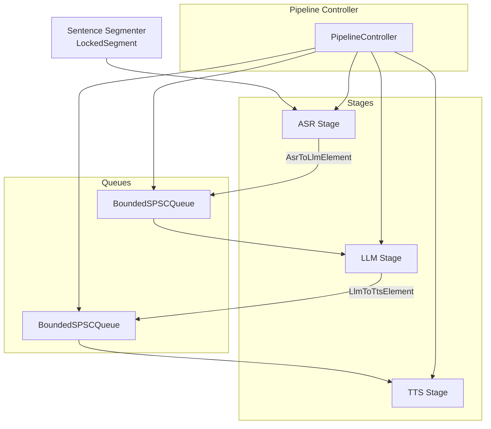
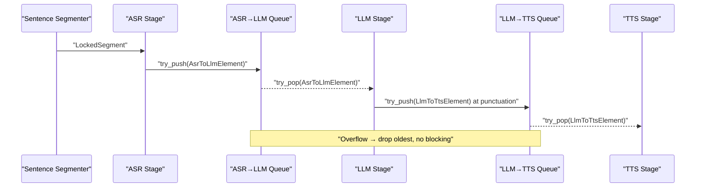
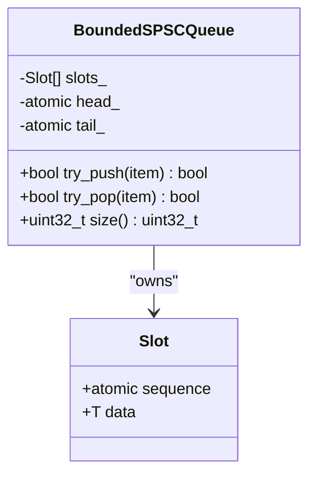
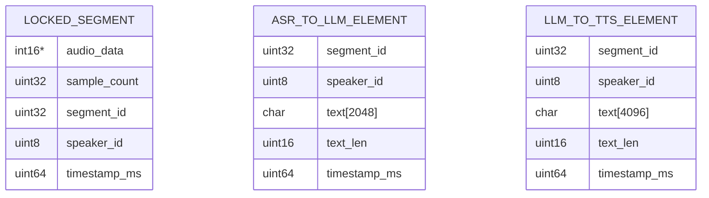
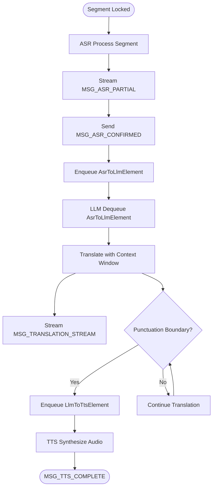
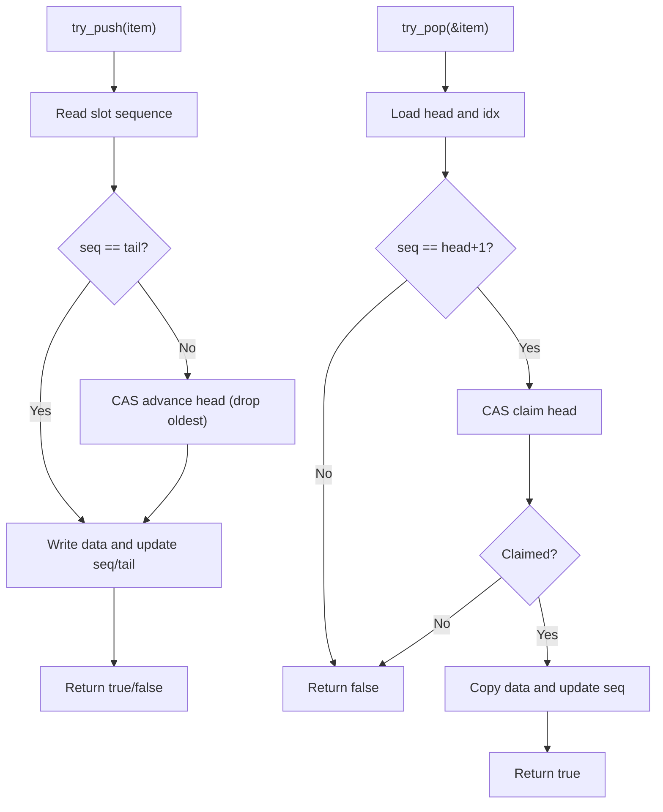
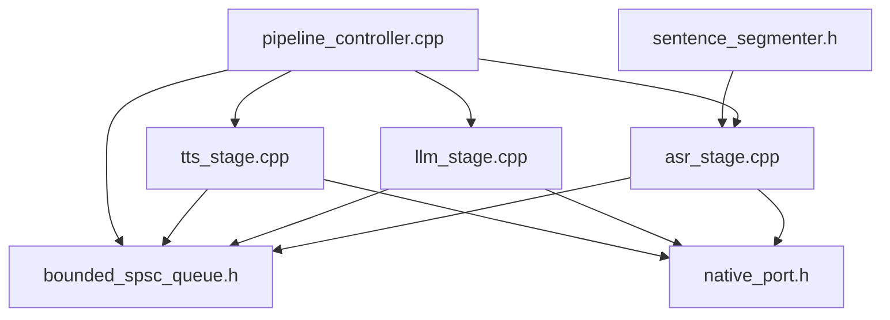

# Stage Communication and Data Flow

<cite>
**Referenced Files in This Document**
- [bounded_spsc_queue.h](file://native/include/bounded_spsc_queue.h)
- [asr_stage.h](file://native/include/asr_stage.h)
- [llm_stage.h](file://native/include/llm_stage.h)
- [tts_stage.h](file://native/include/tts_stage.h)
- [echo_types.h](file://native/include/echo_types.h)
- [sentence_segmenter.h](file://native/include/sentence_segmenter.h)
- [pipeline_controller.h](file://native/include/pipeline_controller.h)
- [native_port.h](file://native/include/native_port.h)
- [asr_stage.cpp](file://native/src/asr_stage.cpp)
- [llm_stage.cpp](file://native/src/llm_stage.cpp)
- [tts_stage.cpp](file://native/src/tts_stage.cpp)
- [pipeline_controller.cpp](file://native/src/pipeline_controller.cpp)
</cite>

## Table of Contents
1. [Introduction](#introduction)
2. [Project Structure](#project-structure)
3. [Core Components](#core-components)
4. [Architecture Overview](#architecture-overview)
5. [Detailed Component Analysis](#detailed-component-analysis)
6. [Dependency Analysis](#dependency-analysis)
7. [Performance Considerations](#performance-considerations)
8. [Troubleshooting Guide](#troubleshooting-guide)
9. [Conclusion](#conclusion)
10. [Appendices](#appendices)

## Introduction
This document explains the inter-stage communication mechanisms used by the AI processing pipeline, focusing on the bounded Single Producer Single Consumer (SPSC) queues that connect ASR→LLM and LLM→TTS stages. It documents the data structures exchanged across stages, including LockedSegment, AsrToLlmElement, and LlmToTtsElement, along with their lifecycle management. It also details message flow patterns, backpressure handling via overflow-drop semantics, memory safety guarantees provided by the queue implementation, and practical guidance for implementing custom stages, handling overflow scenarios, and debugging data flow issues. Performance considerations such as queue sizing, memory allocation strategies, and thread synchronization patterns are included to help optimize throughput and latency.

## Project Structure
The pipeline is implemented in C/C++ under native/, with clear separation between headers (interfaces) and implementations (logic). The core components involved in inter-stage communication include:
- BoundedSPSCQueue: a lock-free bounded queue with overflow-drop semantics
- Stages: ASR, LLM, TTS, each running on its own worker thread
- Sentence Segmenter: produces LockedSegment objects for ASR
- Pipeline Controller: wires up queues and stages, manages lifecycle
- Native Port: dispatches UI-facing messages from stages

**Diagram sources**
- [pipeline_controller.cpp:304-353](file://native/src/pipeline_controller.cpp#L304-L353)
- [asr_stage.cpp:277-293](file://native/src/asr_stage.cpp#L277-L293)
- [llm_stage.cpp:367-388](file://native/src/llm_stage.cpp#L367-L388)
- [tts_stage.cpp:278-296](file://native/src/tts_stage.cpp#L278-L296)
- [bounded_spsc_queue.h:29-142](file://native/include/bounded_spsc_queue.h#L29-L142)

**Section sources**
- [pipeline_controller.h:1-107](file://native/include/pipeline_controller.h#L1-L107)
- [pipeline_controller.cpp:248-393](file://native/src/pipeline_controller.cpp#L248-L393)

## Core Components
- BoundedSPSCQueue<T, Capacity>: A lock-free bounded queue using a slot-based sequence protocol. It never blocks; on overflow it drops the oldest element and pushes the new one. It provides try_push() and try_pop(), plus size().
- AsrStage: Consumes LockedSegment from the segmenter, performs inference, streams partials, enqueues confirmed text into the ASR→LLM queue.
- LlmStage: Dequeues AsrToLlmElement, translates with context windowing, streams tokens, enqueues translated text at punctuation boundaries into the LLM→TTS queue.
- TtsStage: Dequeues LlmToTtsElement, synthesizes audio, outputs PCM chunks, and reports lifecycle events.
- Sentence Segmenter: Produces LockedSegment when speech segments are locked.
- Pipeline Controller: Creates and wires queues and stages, orchestrates start/stop and graceful flush.

Key responsibilities and interactions are defined in the stage headers and implementations.

**Section sources**
- [bounded_spsc_queue.h:8-28](file://native/include/bounded_spsc_queue.h#L8-L28)
- [asr_stage.h:1-104](file://native/include/asr_stage.h#L1-L104)
- [llm_stage.h:1-93](file://native/include/llm_stage.h#L1-L93)
- [tts_stage.h:1-79](file://native/include/tts_stage.h#L1-L79)
- [sentence_segmenter.h:1-142](file://native/include/sentence_segmenter.h#L1-L142)
- [pipeline_controller.h:1-107](file://native/include/pipeline_controller.h#L1-L107)

## Architecture Overview
The pipeline uses two bounded SPSC queues to decouple stages:
- ASR→LLM queue carries AsrToLlmElement produced by ASR and consumed by LLM.
- LLM→TTS queue carries LlmToTtsElement produced by LLM and consumed by TTS.

Each stage runs on its own thread, enabling overlapped execution and low-latency streaming. Backpressure is handled by dropping the oldest elements when queues are full, ensuring producers never block.

**Diagram sources**
- [asr_stage.cpp:297-318](file://native/src/asr_stage.cpp#L297-L318)
- [asr_stage.cpp:254-270](file://native/src/asr_stage.cpp#L254-L270)
- [llm_stage.cpp:243-252](file://native/src/llm_stage.cpp#L243-L252)
- [llm_stage.cpp:319-341](file://native/src/llm_stage.cpp#L319-L341)
- [tts_stage.cpp:191-200](file://native/src/tts_stage.cpp#L191-L200)
- [bounded_spsc_queue.h:51-85](file://native/include/bounded_spsc_queue.h#L51-L85)

## Detailed Component Analysis

### BoundedSPSCQueue Implementation
- Design: Fixed capacity (power-of-two), slot array with per-slot atomic sequence numbers. Head and tail are aligned to separate cache lines to avoid false sharing.
- Concurrency model:
  - tail_ exclusively owned by producer; head_ advanced by consumer and producer (on overflow). Both use compare_exchange to safely advance head_.
  - Sequence/turn protocol ensures safe reuse of slots.
- Semantics:
  - try_push(): non-blocking; returns true if normal push, false if overflow occurred (oldest dropped).
  - try_pop(): non-blocking; returns true if item dequeued, false if empty.
  - size(): approximate current occupancy.

**Diagram sources**
- [bounded_spsc_queue.h:29-142](file://native/include/bounded_spsc_queue.h#L29-L142)

**Section sources**
- [bounded_spsc_queue.h:8-28](file://native/include/bounded_spsc_queue.h#L8-L28)
- [bounded_spsc_queue.h:51-116](file://native/include/bounded_spsc_queue.h#L51-L116)
- [bounded_spsc_queue.h:123-128](file://native/include/bounded_spsc_queue.h#L123-L128)

### Inter-Stage Data Structures
- LockedSegment: Produced by the sentence segmenter; contains audio pointer, sample count, segment ID, speaker ID, and timestamp. Valid only during callback lifetime.
- AsrToLlmElement: Produced by ASR; includes segment_id, speaker_id, UTF-8 text buffer, text_len, and timestamp_ms.
- LlmToTtsElement: Produced by LLM; includes segment_id, speaker_id, UTF-8 translated text buffer, text_len, and timestamp_ms.

Lifecycle notes:
- LockedSegment is copied internally by ASR before processing to ensure ownership and safety.
- AsrToLlmElement and LlmToTtsElement are constructed locally and pushed into queues; they are moved/copied into queue slots and then consumed by downstream stages.

**Diagram sources**
- [sentence_segmenter.h:43-49](file://native/include/sentence_segmenter.h#L43-L49)
- [echo_types.h:68-86](file://native/include/echo_types.h#L68-L86)

**Section sources**
- [sentence_segmenter.h:43-49](file://native/include/sentence_segmenter.h#L43-L49)
- [echo_types.h:68-86](file://native/include/echo_types.h#L68-L86)
- [asr_stage.cpp:301-318](file://native/src/asr_stage.cpp#L301-L318)

### Message Flow Patterns
- ASR→LLM:
  - ASR processes LockedSegment, streams partials via Native Port, finalizes confirmed text, and enqueues AsrToLlmElement into the ASR→LLM queue.
  - LLM polls the queue, builds context from sliding history, translates, streams tokens, and enqueues LlmToTtsElement at punctuation boundaries.
- LLM→TTS:
  - TTS polls the queue, discards whitespace/punctuation-only segments, synthesizes audio, and emits lifecycle events.

**Diagram sources**
- [asr_stage.cpp:214-270](file://native/src/asr_stage.cpp#L214-L270)
- [llm_stage.cpp:281-341](file://native/src/llm_stage.cpp#L281-L341)
- [tts_stage.cpp:191-271](file://native/src/tts_stage.cpp#L191-L271)

**Section sources**
- [asr_stage.cpp:297-318](file://native/src/asr_stage.cpp#L297-L318)
- [llm_stage.cpp:243-341](file://native/src/llm_stage.cpp#L243-L341)
- [tts_stage.cpp:191-271](file://native/src/tts_stage.cpp#L191-L271)

### Backpressure Handling and Memory Safety
- Overflow behavior: When the queue is full, try_push advances head (drops oldest) and writes the new element without blocking. Consumers may observe an empty queue if the element was already dropped.
- Memory safety:
  - Lock-free design avoids mutex contention and deadlocks.
  - Sequence protocol prevents reading uninitialized or reused slots.
  - Head/tail alignment reduces false sharing.
  - Producers do not retain references to input buffers beyond copies; ASR copies LockedSegment internally.
- Non-blocking semantics:
  - All queue operations return immediately; consumers poll with short sleeps when empty.

**Diagram sources**
- [bounded_spsc_queue.h:51-116](file://native/include/bounded_spsc_queue.h#L51-L116)

**Section sources**
- [bounded_spsc_queue.h:8-28](file://native/include/bounded_spsc_queue.h#L8-L28)
- [bounded_spsc_queue.h:51-116](file://native/include/bounded_spsc_queue.h#L51-L116)
- [asr_stage.cpp:301-318](file://native/src/asr_stage.cpp#L301-L318)

### Implementing Custom Stages
Guidelines for adding a new stage that consumes from one queue and produces to another:
- Create a stage struct with:
  - AcceleratorContext pointer (optional)
  - Input/output queue pointers
  - Worker thread and running flag
  - Any internal state (e.g., buffers, counters)
- Implement a worker loop that:
  - Polls input_queue->try_pop()
  - Processes data
  - Constructs output element(s)
  - Calls output_queue->try_push()
- Provide create/destroy functions that manage thread lifecycle and resource cleanup.
- Ensure all shared fields use appropriate atomics and memory ordering.
- Integrate with PipelineController by creating the stage and wiring queues.

Example integration points:
- Creating queues and stages in pipeline startup
- Passing queue pointers to stage constructors
- Destroying stages in reverse order

**Section sources**
- [pipeline_controller.cpp:304-353](file://native/src/pipeline_controller.cpp#L304-L353)
- [asr_stage.cpp:277-293](file://native/src/asr_stage.cpp#L277-L293)
- [llm_stage.cpp:367-388](file://native/src/llm_stage.cpp#L367-L388)
- [tts_stage.cpp:278-296](file://native/src/tts_stage.cpp#L278-L296)

### Handling Queue Overflow Scenarios
- Producer side:
  - Always call try_push(); check return value if you need to track overflow events.
  - Avoid blocking waits; rely on overflow-drop semantics to maintain responsiveness.
- Consumer side:
  - Use try_pop() in a polling loop with small sleep intervals.
  - Be prepared to handle cases where items were dropped due to overflow.
- Monitoring:
  - Use queue.size() for diagnostics (approximate).
  - Track latency warnings and adjust queue sizes or processing rates accordingly.

**Section sources**
- [bounded_spsc_queue.h:51-85](file://native/include/bounded_spsc_queue.h#L51-L85)
- [bounded_spsc_queue.h:93-116](file://native/include/bounded_spsc_queue.h#L93-L116)
- [bounded_spsc_queue.h:123-128](file://native/include/bounded_spsc_queue.h#L123-L128)

### Debugging Data Flow Issues
Common symptoms and checks:
- No output from downstream stage:
  - Verify upstream try_push calls succeed and queues are wired correctly.
  - Confirm consumer loops are running and not sleeping too long.
- Frequent overflow warnings:
  - Increase queue capacity or reduce producer rate.
  - Inspect SLA metrics and latency warnings.
- Incorrect timestamps or IDs:
  - Validate construction of AsrToLlmElement/LlmToTtsElement fields.
  - Ensure LockedSegment fields are set before enqueue.

Use Native Port messages to trace flow:
- ASR partials and confirmations
- Translation stream and done events
- TTS started and complete events
- Latency warnings for each stage

**Section sources**
- [native_port.h:100-172](file://native/include/native_port.h#L100-L172)
- [asr_stage.cpp:214-270](file://native/src/asr_stage.cpp#L214-L270)
- [llm_stage.cpp:281-341](file://native/src/llm_stage.cpp#L281-L341)
- [tts_stage.cpp:214-271](file://native/src/tts_stage.cpp#L214-L271)

## Dependency Analysis
The following diagram shows how stages depend on queues and external interfaces:

**Diagram sources**
- [asr_stage.cpp:18-33](file://native/src/asr_stage.cpp#L18-L33)
- [llm_stage.cpp:22-35](file://native/src/llm_stage.cpp#L22-L35)
- [tts_stage.cpp:23-36](file://native/src/tts_stage.cpp#L23-L36)
- [pipeline_controller.cpp:40-51](file://native/src/pipeline_controller.cpp#L40-L51)
- [bounded_spsc_queue.h:1-7](file://native/include/bounded_spsc_queue.h#L1-L7)
- [native_port.h:1-17](file://native/include/native_port.h#L1-L17)
- [sentence_segmenter.h:1-20](file://native/include/sentence_segmenter.h#L1-L20)

**Section sources**
- [asr_stage.cpp:18-33](file://native/src/asr_stage.cpp#L18-L33)
- [llm_stage.cpp:22-35](file://native/src/llm_stage.cpp#L22-L35)
- [tts_stage.cpp:23-36](file://native/src/tts_stage.cpp#L23-L36)
- [pipeline_controller.cpp:40-51](file://native/src/pipeline_controller.cpp#L40-L51)

## Performance Considerations
- Queue sizing:
  - Default capacity is 64 for both inter-stage queues. Adjust based on observed throughput and latency.
  - Larger queues reduce overflow frequency but increase memory usage and potential latency jitter.
- Memory allocation strategies:
  - Prefer fixed-size buffers within elements to avoid dynamic allocations during hot paths.
  - Pre-reserve vectors where possible (e.g., TTS output buffer).
- Thread synchronization patterns:
  - Use lock-free queues for inter-stage communication to minimize overhead.
  - Keep worker threads independent; avoid cross-stage locks.
  - Use atomics with appropriate memory ordering for flags and mode switches.
- Latency budgets:
  - ASR first-character ≤200ms
  - LLM first-token ≤450ms
  - TTS TTFA ≤100ms
  - Monitor and report violations via Native Port.

[No sources needed since this section provides general guidance]

## Troubleshooting Guide
- Symptoms:
  - Missing TTS_STARTED/TTS_COMPLETE events:
    - Check should_discard_segment logic; whitespace/punctuation-only segments are skipped.
    - Verify queue wiring and consumer loop.
  - High latency warnings:
    - Inspect per-stage timing measurements and Native Port latency warnings.
    - Consider increasing queue capacity or optimizing inference steps.
  - Overflows:
    - Track try_push return values; consider reducing producer rate or increasing capacity.
- Diagnostics:
  - Use Native Port messages to trace flow across stages.
  - Periodically log queue.size() for monitoring.
  - Validate timestamps and IDs in elements to ensure correct correlation.

**Section sources**
- [tts_stage.cpp:206-271](file://native/src/tts_stage.cpp#L206-L271)
- [native_port.h:164-166](file://native/include/native_port.h#L164-L166)
- [bounded_spsc_queue.h:123-128](file://native/include/bounded_spsc_queue.h#L123-L128)

## Conclusion
The AI processing pipeline leverages lock-free bounded SPSC queues to achieve high-throughput, low-latency inter-stage communication with robust backpressure handling. By adopting overflow-drop semantics and careful memory management, the system maintains responsiveness while preserving correctness. Following the guidelines for custom stage development, overflow handling, and debugging will help extend the pipeline effectively. Performance tuning around queue sizing, allocation strategies, and synchronization patterns can further optimize end-to-end latency and stability.

[No sources needed since this section summarizes without analyzing specific files]

## Appendices

### Example: Integrating a New Stage
- Define a new stage header with create/destroy APIs and queue pointers.
- Implement a worker loop that polls input_queue->try_pop(), processes data, and pushes to output_queue->try_push().
- Wire the stage in pipeline_controller_start by creating the stage and passing queue pointers.
- Ensure destroy order respects dependencies (reverse pipeline order).

**Section sources**
- [pipeline_controller.cpp:304-353](file://native/src/pipeline_controller.cpp#L304-L353)
- [asr_stage.cpp:277-293](file://native/src/asr_stage.cpp#L277-L293)
- [llm_stage.cpp:367-388](file://native/src/llm_stage.cpp#L367-L388)
- [tts_stage.cpp:278-296](file://native/src/tts_stage.cpp#L278-L296)