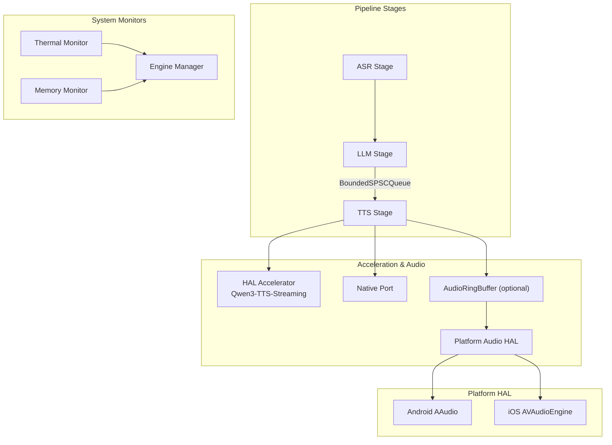
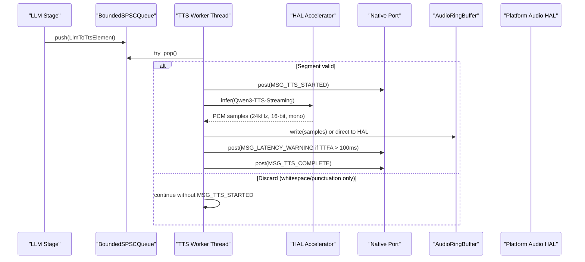
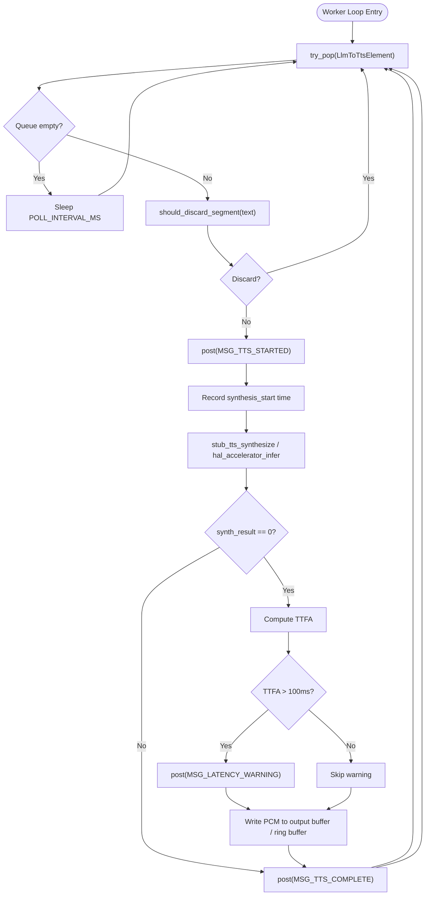
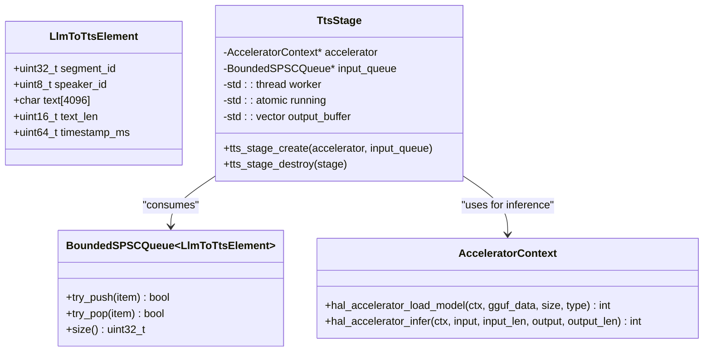
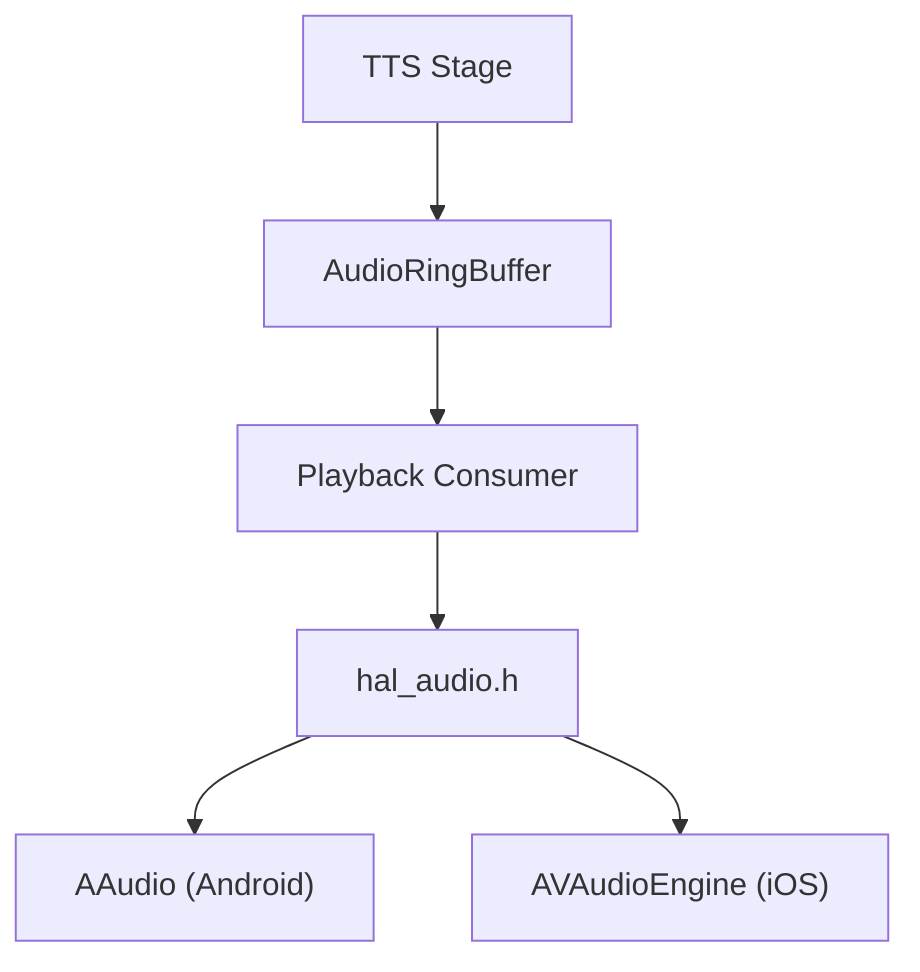
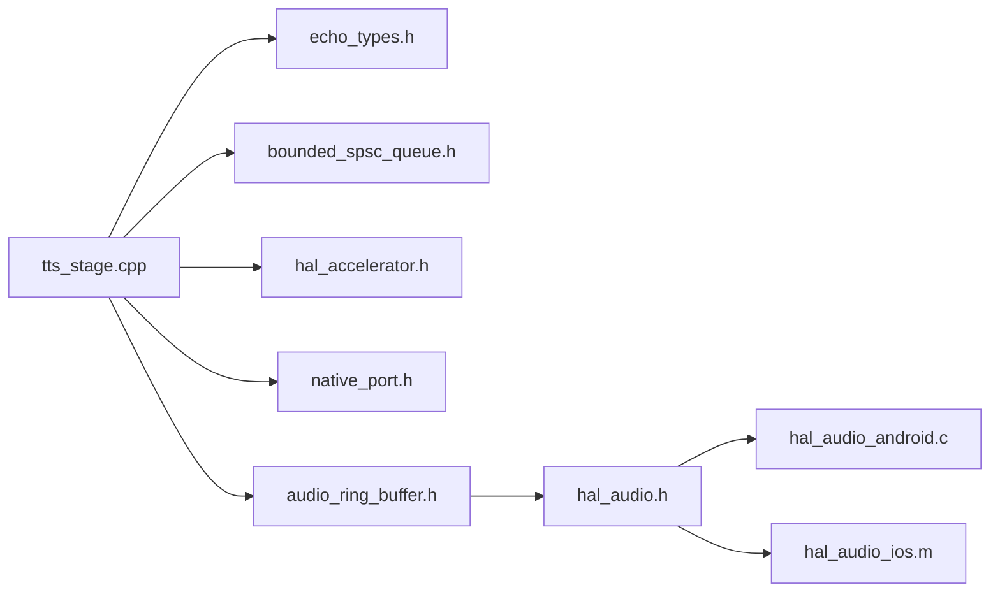
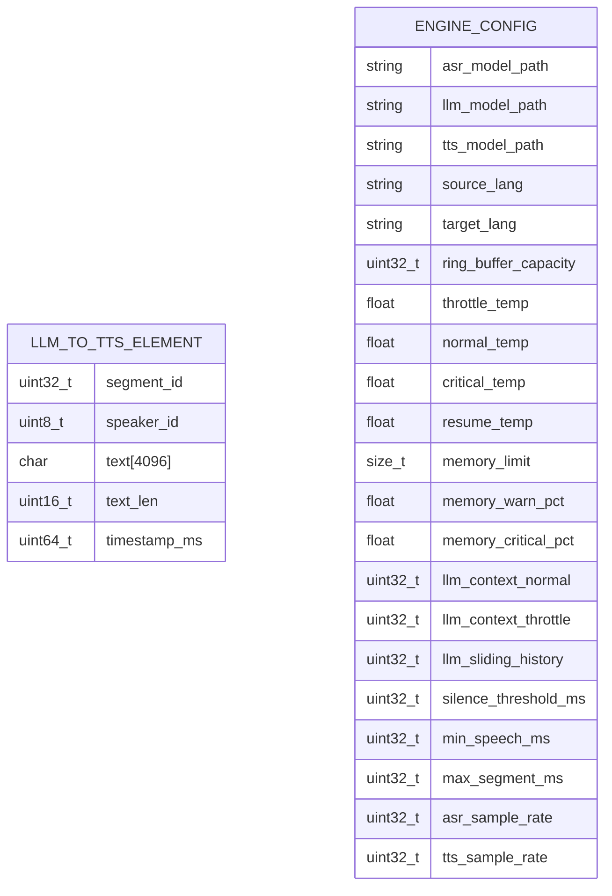

# TTS Stage - Text-to-Speech Synthesis

<cite>
**Referenced Files in This Document**
- [tts_stage.h](file://native/include/tts_stage.h)
- [tts_stage.cpp](file://native/src/tts_stage.cpp)
- [hal_accelerator.h](file://native/hal/hal_accelerator.h)
- [hal_audio.h](file://native/hal/hal_audio.h)
- [hal_audio_android.c](file://native/hal/android/hal_audio_android.c)
- [hal_audio_ios.m](file://native/hal/ios/hal_audio_ios.m)
- [echo_types.h](file://native/include/echo_types.h)
- [bounded_spsc_queue.h](file://native/include/bounded_spsc_queue.h)
- [native_port.h](file://native/include/native_port.h)
- [audio_ring_buffer.h](file://native/include/audio_ring_buffer.h)
- [thermal_monitor.h](file://native/include/thermal_monitor.h)
- [memory_monitor.h](file://native/include/memory_monitor.h)
- [model_catalog.dart](file://lib/src/model/model_catalog.dart)
</cite>

## Table of Contents
1. [Introduction](#introduction)
2. [Project Structure](#project-structure)
3. [Core Components](#core-components)
4. [Architecture Overview](#architecture-overview)
5. [Detailed Component Analysis](#detailed-component-analysis)
6. [Dependency Analysis](#dependency-analysis)
7. [Performance Considerations](#performance-considerations)
8. [Troubleshooting Guide](#troubleshooting-guide)
9. [Conclusion](#conclusion)
10. [Appendices](#appendices)

## Introduction
This document explains the TTS (Text-to-Speech) stage that converts translated tokens into real-time audio using Qwen3-TTS-Streaming. It covers the streaming synthesis pipeline, integration with platform audio HAL for low-latency playback on Android and iOS, token processing from LlmToTtsElement input to PCM output, voice synthesis parameters, quality settings, configuration examples, buffer management, interruption handling, and optimization strategies for different acoustic environments. It also addresses memory management, thermal throttling considerations, and synchronization with the main audio pipeline.

## Project Structure
The TTS stage is implemented as a native C++ component that:
- Consumes translated text segments from a bounded single-producer single-consumer queue produced by the LLM stage.
- Performs inference via the HAL accelerator (NPU-first with CPU fallback).
- Emits PCM audio at 24kHz, 16-bit, mono in streaming chunks.
- Posts lifecycle and latency events through the Native Port to the Flutter UI shell.

**Diagram sources**
- [tts_stage.h:1-79](file://native/include/tts_stage.h#L1-L79)
- [tts_stage.cpp:1-315](file://native/src/tts_stage.cpp#L1-L315)
- [hal_accelerator.h:1-81](file://native/hal/hal_accelerator.h#L1-L81)
- [hal_audio.h:1-78](file://native/hal/hal_audio.h#L1-L78)
- [hal_audio_android.c:1-214](file://native/hal/android/hal_audio_android.c#L1-L214)
- [hal_audio_ios.m:1-297](file://native/hal/ios/hal_audio_ios.m#L1-L297)
- [bounded_spsc_queue.h:1-145](file://native/include/bounded_spsc_queue.h#L1-L145)
- [native_port.h:1-179](file://native/include/native_port.h#L1-L179)
- [audio_ring_buffer.h:1-192](file://native/include/audio_ring_buffer.h#L1-L192)
- [thermal_monitor.h:1-109](file://native/include/thermal_monitor.h#L1-L109)
- [memory_monitor.h:1-108](file://native/include/memory_monitor.h#L1-L108)

**Section sources**
- [tts_stage.h:1-79](file://native/include/tts_stage.h#L1-L79)
- [tts_stage.cpp:1-315](file://native/src/tts_stage.cpp#L1-L315)
- [hal_accelerator.h:1-81](file://native/hal/hal_accelerator.h#L1-L81)
- [hal_audio.h:1-78](file://native/hal/hal_audio.h#L1-L78)
- [hal_audio_android.c:1-214](file://native/hal/android/hal_audio_android.c#L1-L214)
- [hal_audio_ios.m:1-297](file://native/hal/ios/hal_audio_ios.m#L1-L297)
- [bounded_spsc_queue.h:1-145](file://native/include/bounded_spsc_queue.h#L1-L145)
- [native_port.h:1-179](file://native/include/native_port.h#L1-L179)
- [audio_ring_buffer.h:1-192](file://native/include/audio_ring_buffer.h#L1-L192)
- [thermal_monitor.h:1-109](file://native/include/thermal_monitor.h#L1-L109)
- [memory_monitor.h:1-108](file://native/include/memory_monitor.h#L1-L108)

## Core Components
- TTS Stage: Owns a worker thread that polls translated text elements, performs synthesis, tracks TTFA SLA, and posts lifecycle messages.
- Bounded SPSC Queue: Lock-free queue with overflow-drop semantics used to pass LlmToTtsElement from LLM to TTS.
- HAL Accelerator: Abstracts NPU/GPU inference; supports MODEL_TYPE_TTS for Qwen3-TTS-Streaming.
- Platform Audio HAL: Provides low-latency capture/playback backends for Android (AAudio) and iOS (AVAudioEngine).
- Native Port: Typed message dispatch to Flutter UI for TTS_STARTED, TTS_COMPLETE, and latency warnings.
- Audio Ring Buffer: Optional lock-free SPSC buffer for decoupling synthesis and playback.
- System Monitors: Thermal and Memory monitors influence engine behavior and resource usage.

Key data types and constants:
- LlmToTtsElement: Translated text segment passed to TTS.
- TTS sample rate: 24kHz, 16-bit, mono.
- TTFA budget: ≤100ms from dequeue to first PCM chunk.
- Output buffer sizing: ~500ms pre-allocation for jitter absorption.

**Section sources**
- [tts_stage.h:1-79](file://native/include/tts_stage.h#L1-L79)
- [tts_stage.cpp:1-315](file://native/src/tts_stage.cpp#L1-L315)
- [echo_types.h:76-86](file://native/include/echo_types.h#L76-L86)
- [bounded_spsc_queue.h:1-145](file://native/include/bounded_spsc_queue.h#L1-L145)
- [hal_accelerator.h:1-81](file://native/hal/hal_accelerator.h#L1-L81)
- [hal_audio.h:1-78](file://native/hal/hal_audio.h#L1-L78)
- [native_port.h:130-166](file://native/include/native_port.h#L130-L166)
- [audio_ring_buffer.h:1-192](file://native/include/audio_ring_buffer.h#L1-L192)

## Architecture Overview
The TTS stage integrates tightly with the pipeline and platform layers:

**Diagram sources**
- [tts_stage.cpp:191-272](file://native/src/tts_stage.cpp#L191-L272)
- [bounded_spsc_queue.h:51-116](file://native/include/bounded_spsc_queue.h#L51-L116)
- [hal_accelerator.h:53-67](file://native/hal/hal_accelerator.h#L53-L67)
- [native_port.h:130-166](file://native/include/native_port.h#L130-L166)
- [audio_ring_buffer.h:52-91](file://native/include/audio_ring_buffer.h#L52-L91)

## Detailed Component Analysis

### TTS Stage Implementation
Responsibilities:
- Polling loop consumes LlmToTtsElement from the queue.
- Discards whitespace-only or punctuation-only segments without emitting TTS_STARTED.
- Emits MSG_TTS_STARTED before synthesis begins.
- Runs synthesis via stub or HAL accelerator; measures TTFA and reports SLA violations.
- Outputs PCM to an internal buffer (placeholder for platform speaker feed).
- Emits MSG_TTS_COMPLETE after synthesis finishes.
- Operates on its own thread concurrently with ASR/LLM.

**Diagram sources**
- [tts_stage.cpp:191-272](file://native/src/tts_stage.cpp#L191-L272)
- [tts_stage.cpp:112-127](file://native/src/tts_stage.cpp#L112-L127)
- [tts_stage.cpp:142-185](file://native/src/tts_stage.cpp#L142-L185)
- [native_port.h:130-166](file://native/include/native_port.h#L130-L166)

**Section sources**
- [tts_stage.h:1-79](file://native/include/tts_stage.h#L1-L79)
- [tts_stage.cpp:1-315](file://native/src/tts_stage.cpp#L1-L315)

### Token Processing Workflow: LlmToTtsElement to PCM
- Input element fields: segment_id, speaker_id, text, text_len, timestamp_ms.
- Validation: skip segments composed solely of whitespace/punctuation.
- Lifecycle messaging: TTS_STARTED → synthesis → TTS_COMPLETE.
- Latency tracking: TTFA measured between TTS_STARTED and first PCM availability.
- Output format: 24kHz, 16-bit, mono PCM.

**Diagram sources**
- [echo_types.h:76-86](file://native/include/echo_types.h#L76-L86)
- [tts_stage.cpp:66-81](file://native/src/tts_stage.cpp#L66-L81)
- [bounded_spsc_queue.h:29-142](file://native/include/bounded_spsc_queue.h#L29-L142)
- [hal_accelerator.h:28-67](file://native/hal/hal_accelerator.h#L28-L67)

**Section sources**
- [echo_types.h:76-86](file://native/include/echo_types.h#L76-L86)
- [tts_stage.cpp:191-272](file://native/src/tts_stage.cpp#L191-L272)

### Integration with Platform Audio HAL
- Android backend uses AAudio with low-latency performance mode and exclusive sharing.
- iOS backend uses AVAudioEngine with input tap and low IO buffer duration.
- Both provide a unified interface for capture; TTS output typically writes to a ring buffer consumed by a separate playback path.

**Diagram sources**
- [hal_audio.h:1-78](file://native/hal/hal_audio.h#L1-L78)
- [hal_audio_android.c:1-214](file://native/hal/android/hal_audio_android.c#L1-L214)
- [hal_audio_ios.m:1-297](file://native/hal/ios/hal_audio_ios.m#L1-L297)
- [audio_ring_buffer.h:1-192](file://native/include/audio_ring_buffer.h#L1-L192)

**Section sources**
- [hal_audio_android.c:1-214](file://native/hal/android/hal_audio_android.c#L1-L214)
- [hal_audio_ios.m:1-297](file://native/hal/ios/hal_audio_ios.m#L1-L297)
- [hal_audio.h:1-78](file://native/hal/hal_audio.h#L1-L78)
- [audio_ring_buffer.h:1-192](file://native/include/audio_ring_buffer.h#L1-L192)

### Voice Synthesis Parameters and Quality Settings
- Sample rate: 24kHz.
- Bit depth: 16-bit signed integer.
- Channels: Mono.
- Output buffer capacity: Pre-allocated for ~500ms to absorb jitter.
- TTFA SLA: ≤100ms from dequeue to first PCM chunk.
- Stub synthesis caps maximum audio length to avoid excessive memory usage and ensures minimum duration for non-empty text.

Configuration references:
- EngineConfig includes tts_sample_rate field for consistency across stages.
- Model catalog defines Qwen3-TTS-Streaming model spec and max disk size.

**Section sources**
- [tts_stage.cpp:42-60](file://native/src/tts_stage.cpp#L42-L60)
- [tts_stage.cpp:289-295](file://native/src/tts_stage.cpp#L289-L295)
- [echo_types.h:126-129](file://native/include/echo_types.h#L126-L129)
- [model_catalog.dart:69-75](file://lib/src/model/model_catalog.dart#L69-L75)

### Examples: Configuring TTS Voices, Managing Buffers, Handling Interruptions, Optimizing Environments
- Configure voices: The current implementation does not expose per-voice parameters in the public API. To support multiple voices, extend the LlmToTtsElement payload or add a voice selection parameter to the synthesis call.
- Manage audio buffers: Use AudioRingBuffer to decouple synthesis and playback; set capacity based on desired latency vs. glitch tolerance.
- Handle streaming interruptions: On synthesis failure, log error, skip segment, and continue; ensure TTS_COMPLETE is posted to maintain lifecycle consistency.
- Optimize for acoustic environments: Adjust ring buffer sizes and polling intervals; leverage thermal and memory monitors to adapt processing under constraints.

Note: These are guidance examples derived from existing interfaces and behaviors.

**Section sources**
- [tts_stage.cpp:241-252](file://native/src/tts_stage.cpp#L241-L252)
- [audio_ring_buffer.h:52-91](file://native/include/audio_ring_buffer.h#L52-L91)
- [bounded_spsc_queue.h:51-85](file://native/include/bounded_spsc_queue.h#L51-L85)

## Dependency Analysis
The TTS stage depends on several components:

**Diagram sources**
- [tts_stage.cpp:1-315](file://native/src/tts_stage.cpp#L1-L315)
- [echo_types.h:1-136](file://native/include/echo_types.h#L1-L136)
- [bounded_spsc_queue.h:1-145](file://native/include/bounded_spsc_queue.h#L1-L145)
- [hal_accelerator.h:1-81](file://native/hal/hal_accelerator.h#L1-L81)
- [native_port.h:1-179](file://native/include/native_port.h#L1-L179)
- [audio_ring_buffer.h:1-192](file://native/include/audio_ring_buffer.h#L1-L192)
- [hal_audio.h:1-78](file://native/hal/hal_audio.h#L1-L78)
- [hal_audio_android.c:1-214](file://native/hal/android/hal_audio_android.c#L1-L214)
- [hal_audio_ios.m:1-297](file://native/hal/ios/hal_audio_ios.m#L1-L297)

**Section sources**
- [tts_stage.cpp:1-315](file://native/src/tts_stage.cpp#L1-L315)
- [hal_accelerator.h:1-81](file://native/hal/hal_accelerator.h#L1-L81)
- [hal_audio.h:1-78](file://native/hal/hal_audio.h#L1-L78)
- [hal_audio_android.c:1-214](file://native/hal/android/hal_audio_android.c#L1-L214)
- [hal_audio_ios.m:1-297](file://native/hal/ios/hal_audio_ios.m#L1-L297)
- [bounded_spsc_queue.h:1-145](file://native/include/bounded_spsc_queue.h#L1-L145)
- [native_port.h:1-179](file://native/include/native_port.h#L1-L179)
- [audio_ring_buffer.h:1-192](file://native/include/audio_ring_buffer.h#L1-L192)

## Performance Considerations
- TTFA SLA: Ensure synthesis starts promptly; measure and warn when exceeding 100ms.
- Buffer sizing: Use ~500ms pre-allocation to reduce jitter; tune based on device capabilities.
- Overwrite policy: AudioRingBuffer overwrites oldest samples to prevent blocking producer.
- Polling interval: Small sleep (e.g., 5ms) balances CPU usage and responsiveness.
- Platform-specific optimizations:
  - Android: AAudio low-latency mode and exclusive sharing minimize latency.
  - iOS: Low IO buffer duration and small tap buffer sizes improve responsiveness.

[No sources needed since this section provides general guidance]

## Troubleshooting Guide
Common issues and remedies:
- Synthesis failures: Log error details, skip segment, and still emit TTS_COMPLETE to keep lifecycle consistent.
- Latency warnings: If TTFA exceeds budget, investigate accelerator load times and queue contention.
- Audio glitches: Increase ring buffer capacity or adjust platform buffer sizes; verify callback paths do not block.
- Thermal pressure: Use thermal monitor transitions to adapt processing (e.g., reduce context size or sample rates).
- Memory pressure: Use memory monitor levels to release caches and TTS output buffers; consider graceful pipeline stop at critical levels.

**Section sources**
- [tts_stage.cpp:241-252](file://native/src/tts_stage.cpp#L241-L252)
- [tts_stage.cpp:234-236](file://native/src/tts_stage.cpp#L234-L236)
- [thermal_monitor.h:1-109](file://native/include/thermal_monitor.h#L1-L109)
- [memory_monitor.h:1-108](file://native/include/memory_monitor.h#L1-L108)

## Conclusion
The TTS stage provides a robust, low-latency synthesis pipeline that integrates seamlessly with the broader interpretation system. By leveraging a lock-free queue, hardware acceleration, and platform-specific audio HALs, it achieves real-time speech output while maintaining strict SLAs and resilient error handling. Proper buffer sizing, monitoring, and environment-aware tuning ensure high-quality playback across diverse devices and conditions.

[No sources needed since this section summarizes without analyzing specific files]

## Appendices

### Data Models

**Diagram sources**
- [echo_types.h:76-86](file://native/include/echo_types.h#L76-L86)
- [echo_types.h:92-129](file://native/include/echo_types.h#L92-L129)