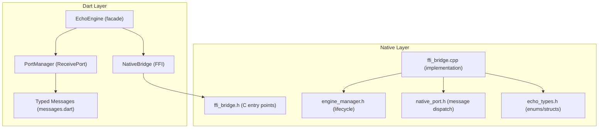
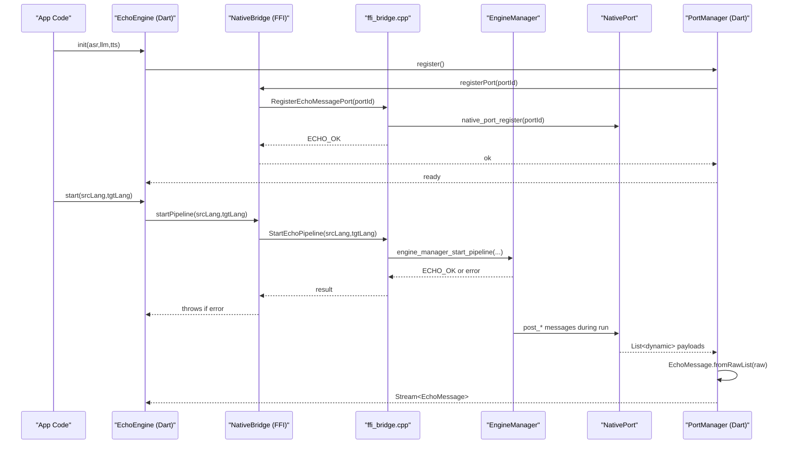
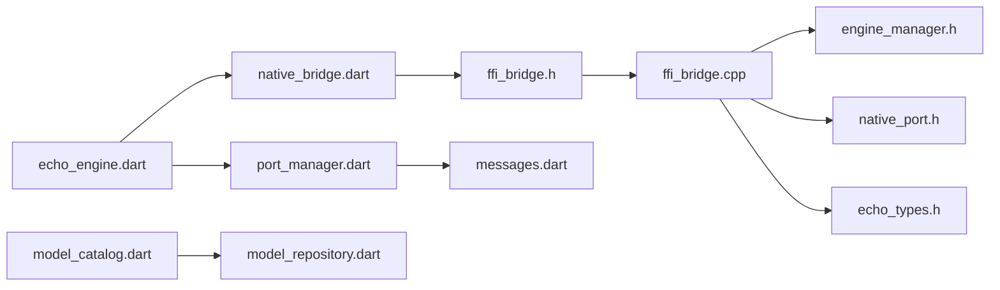

# API Reference

<cite>
**Referenced Files in This Document**
- [ffi_bridge.h](file://native/include/ffi_bridge.h)
- [echo_types.h](file://native/include/echo_types.h)
- [ffi_bridge.cpp](file://native/src/ffi_bridge.cpp)
- [engine_manager.h](file://native/include/engine_manager.h)
- [native_port.h](file://native/include/native_port.h)
- [qwen_echo.dart](file://lib/qwen_echo.dart)
- [echo_engine.dart](file://lib/src/echo_engine.dart)
- [messages.dart](file://lib/src/messages.dart)
- [native_bridge.dart](file://lib/src/native_bridge.dart)
- [port_manager.dart](file://lib/src/port_manager.dart)
- [model_catalog.dart](file://lib/src/model/model_catalog.dart)
- [model_repository.dart](file://lib/src/model/model_repository.dart)
- [README.md](file://README.md)
</cite>

## Table of Contents
1. [Introduction](#introduction)
2. [Project Structure](#project-structure)
3. [Core Components](#core-components)
4. [Architecture Overview](#architecture-overview)
5. [Detailed Component Analysis](#detailed-component-analysis)
6. [Dependency Analysis](#dependency-analysis)
7. [Performance Considerations](#performance-considerations)
8. [Troubleshooting Guide](#troubleshooting-guide)
9. [Conclusion](#conclusion)
10. [Appendices](#appendices)

## Introduction
This document provides comprehensive API documentation for QwenEcho’s public interfaces, focusing on programmatic access to the core engine via:
- Four C-linkage FFI functions exposed to Dart
- The EchoErrorCode enumeration and error handling patterns
- The EchoEngine Dart facade for high-level engine control
- The complete message protocol used for Dart-native communication
- All data structures, enums, and constants used in the public API
- Code examples, integration patterns, error recovery strategies, and best practices

QwenEcho is an on-device simultaneous interpretation engine that runs three AI models offline (ASR, LLM, TTS). It exposes a minimal, stable C interface for cross-platform use and a typed Dart API for Flutter applications.

[No sources needed since this section summarizes without analyzing specific files]

## Project Structure
At a high level:
- Native layer (C/C++): Public headers define the FFI entry points, shared types, and internal orchestration components.
- Dart layer: FFI bindings wrap the C functions; a high-level EchoEngine facade manages lifecycle; a PortManager handles async messages; typed message classes describe the protocol.

**Diagram sources**
- [ffi_bridge.h:1-84](file://native/include/ffi_bridge.h#L1-L84)
- [ffi_bridge.cpp:1-124](file://native/src/ffi_bridge.cpp#L1-L124)
- [engine_manager.h:1-104](file://native/include/engine_manager.h#L1-L104)
- [native_port.h:1-179](file://native/include/native_port.h#L1-L179)
- [echo_types.h:1-136](file://native/include/echo_types.h#L1-L136)
- [echo_engine.dart:1-108](file://lib/src/echo_engine.dart#L1-L108)
- [native_bridge.dart:1-230](file://lib/src/native_bridge.dart#L1-L230)
- [port_manager.dart:1-85](file://lib/src/port_manager.dart#L1-L85)
- [messages.dart:1-336](file://lib/src/messages.dart#L1-L336)

**Section sources**
- [README.md:15-93](file://README.md#L15-L93)

## Core Components
- C-linkage FFI entry points: InitQwenEchoEngine, StartEchoPipeline, StopEchoPipeline, RegisterEchoMessagePort
- Error codes: EchoErrorCode enum
- Dart facade: EchoEngine with init/start/stop/dispose
- Message protocol: MessageType tags and typed message classes
- Data structures: EngineState, AsrToLlmElement, LlmToTtsElement, EngineConfig

Key responsibilities:
- FFI bridge: Thin wrapper delegating to Engine Manager and managing port registration state.
- Engine Manager: Lifecycle state machine and pipeline orchestration.
- Native Port: Typed message dispatch from native to Dart.
- Dart side: FFI bindings, port management, typed message parsing, and high-level facade.

**Section sources**
- [ffi_bridge.h:17-77](file://native/include/ffi_bridge.h#L17-L77)
- [echo_types.h:17-129](file://native/include/echo_types.h#L17-L129)
- [ffi_bridge.cpp:54-124](file://native/src/ffi_bridge.cpp#L54-L124)
- [engine_manager.h:37-98](file://native/include/engine_manager.h#L37-L98)
- [native_port.h:69-172](file://native/include/native_port.h#L69-L172)
- [echo_engine.dart:37-107](file://lib/src/echo_engine.dart#L37-L107)
- [native_bridge.dart:132-185](file://lib/src/native_bridge.dart#L132-L185)
- [port_manager.dart:18-84](file://lib/src/port_manager.dart#L18-L84)
- [messages.dart:36-335](file://lib/src/messages.dart#L36-L335)

## Architecture Overview
The runtime flow involves:
- Dart initializes the engine by registering a Native Port and calling the C init function.
- Dart starts the pipeline with language codes; native validates state and port registration before launching ASR → LLM → TTS stages.
- Native posts typed messages to Dart via the registered port.
- Dart parses raw lists into typed messages and exposes them as a stream.

**Diagram sources**
- [echo_engine.dart:66-98](file://lib/src/echo_engine.dart#L66-L98)
- [native_bridge.dart:138-185](file://lib/src/native_bridge.dart#L138-L185)
- [ffi_bridge.cpp:71-106](file://native/src/ffi_bridge.cpp#L71-L106)
- [engine_manager.h:69-81](file://native/include/engine_manager.h#L69-L81)
- [native_port.h:100-172](file://native/include/native_port.h#L100-L172)
- [port_manager.dart:42-83](file://lib/src/port_manager.dart#L42-L83)
- [messages.dart:14-33](file://lib/src/messages.dart#L14-L33)

## Detailed Component Analysis

### C-linkage FFI Functions
All four functions are declared with C linkage and return int32_t: 0 indicates success; negative values correspond to EchoErrorCode.

- InitQwenEchoEngine(const char* asr_path, const char* llm_path, const char* tts_path)
  - Purpose: Initialize the engine by loading ASR, LLM, and TTS models from provided paths. Must be called before starting the pipeline.
  - Parameters:
    - asr_path: Path to FunASR-Nano GGUF model file
    - llm_path: Path to Qwen3-4B-Instruct GGUF model file
    - tts_path: Path to Qwen3-TTS-Streaming GGUF model file
  - Returns: ECHO_OK on success; errors include ECHO_ERR_ALREADY_INIT, ECHO_ERR_MODEL_MISSING, and others per EchoErrorCode.
  - Notes: Delegates to Engine Manager load_models; returns memory allocation failure code if manager creation fails.

- StartEchoPipeline(const char* source_lang, const char* target_lang)
  - Purpose: Begin audio capture and activate the full ASR → LLM → TTS pipeline for the specified language pair.
  - Parameters:
    - source_lang: ISO 639-1 source language code (e.g., "zh")
    - target_lang: ISO 639-1 target language code (e.g., "en")
  - Returns: ECHO_OK on success; errors include ECHO_ERR_ENGINE_NOT_READY, ECHO_ERR_SESSION_ACTIVE, ECHO_ERR_NO_PORT, ECHO_ERR_UNSUPPORTED_LANG.
  - Notes: Requires a registered Native Port; otherwise returns ECHO_ERR_NO_PORT.

- StopEchoPipeline(void)
  - Purpose: Stop the active interpretation pipeline. Processes locked segments and discards unlocked audio; releases resources.
  - Returns: ECHO_OK on success; errors include ECHO_ERR_NO_SESSION, ECHO_ERR_NO_PORT.
  - Notes: Requires a registered Native Port for status notifications.

- RegisterEchoMessagePort(int64_t dart_port_id)
  - Purpose: Register a Dart SendPort ID for asynchronous message delivery. Replaces any previously registered port.
  - Parameters:
    - dart_port_id: Dart SendPort.nativePort value
  - Returns: ECHO_OK on success.
  - Notes: Forwards registration to native_port module for message dispatch.

Return codes and error handling:
- All functions return int32_t where 0 means success and negative values map to EchoErrorCode.
- The Dart NativeBridge wraps these calls and throws EchoEngineException when non-zero is returned.

Usage example references:
- Dart facade usage pattern: see EchoEngine.init/start/stop methods.
- FFI binding usage pattern: see NativeBridge.initEngine/startPipeline/stopPipeline/registerPort.

**Section sources**
- [ffi_bridge.h:17-77](file://native/include/ffi_bridge.h#L17-L77)
- [ffi_bridge.cpp:54-124](file://native/src/ffi_bridge.cpp#L54-L124)
- [native_bridge.dart:132-185](file://lib/src/native_bridge.dart#L132-L185)
- [echo_engine.dart:66-98](file://lib/src/echo_engine.dart#L66-L98)

### EchoErrorCode Enumeration and Error Handling Patterns
- Definition: EchoErrorCode enumerates all possible error codes returned by the C-linkage functions. Values are negative integers except ECHO_OK = 0.
- Dart mirror: EchoErrorCode class mirrors the C enum and provides human-readable descriptions via describe(code).
- Exception type: EchoEngineException encapsulates the raw code and a descriptive message thrown by Dart wrappers on non-zero returns.

Common patterns:
- Always check return codes at the FFI boundary; Dart wrappers throw exceptions automatically.
- On error, inspect the code and message to determine recovery strategy (e.g., reinitialize after clearing state, prompt user to provide valid model paths, handle unsupported languages).

Recovery strategies:
- ECHO_ERR_ALREADY_INIT: Reset or destroy the engine instance before retrying initialization.
- ECHO_ERR_MODEL_MISSING / ECHO_ERR_MODEL_INVALID / ECHO_ERR_MODEL_PERMISSION: Validate model paths and permissions; ensure files exist and are readable.
- ECHO_ERR_MEMORY: Reduce context sizes or sample rates; free other resources; retry later.
- ECHO_ERR_UNSUPPORTED_LANG: Prompt user to select supported language pairs.
- ECHO_ERR_SESSION_ACTIVE: Stop the current session before starting a new one.
- ECHO_ERR_NO_PORT: Ensure RegisterEchoMessagePort has been called before starting/stopping the pipeline.
- ECHO_ERR_ENGINE_NOT_READY: Wait until engine reaches Ready state before starting.
- ECHO_ERR_THERMAL_CRITICAL: Pause operations and wait for thermal state to recover.

**Section sources**
- [echo_types.h:48-62](file://native/include/echo_types.h#L48-L62)
- [native_bridge.dart:43-93](file://lib/src/native_bridge.dart#L43-L93)

### EchoEngine Dart Facade Methods
High-level facade over native engine and port management:
- EchoEngine(): Creates the facade, initializing NativeBridge and PortManager.
- EchoEngine.withBridge(NativeBridge): Allows custom bridge injection (useful for testing).
- init({asrPath, llmPath, ttsPath}): Registers the Native Port, then calls the native init function; transitions to ready state.
- start({srcLang, tgtLang}): Starts the pipeline; requires engine in ready state; transitions to running.
- stop(): Stops the pipeline; processes locked segments; returns to ready state.
- dispose(): Disposes Dart-side resources; does not stop the native engine.

Lifecycle states:
- uninitialized → ready → running → ready (after stop)

Error handling:
- Throws EchoEngineException on failures; callers should catch and handle based on error code.

Best practices:
- Always call init before start.
- Call stop before disposing to avoid leaving the native engine in a running state.
- Subscribe to messages.stream to receive real-time updates.

**Section sources**
- [echo_engine.dart:37-107](file://lib/src/echo_engine.dart#L37-L107)

### Message Protocol for Dart-Native Communication
The protocol uses integer type tags followed by payload fields. Each message is a List<dynamic> sent via Dart Native Port.

Type tags (MessageType):
- asrPartial (1): Temporary/unconfirmed ASR text
- asrConfirmed (2): Finalized ASR text with punctuation
- translationStream (3): Streaming translation token
- translationDone (4): Translation segment complete
- ttsStarted (5): TTS synthesis began for a segment
- ttsComplete (6): TTS synthesis finished for a segment
- error (10): Error notification
- thermalState (11): Thermal mode change
- memoryWarning (12): Memory pressure event
- latencyWarning (13): SLA violation
- sampleDrop (14): Audio sample drop detected

Typed message classes (Dart):
- AsrPartialMessage: speakerId, text, timestampMs
- AsrConfirmedMessage: speakerId, text, timestampMs, segmentId
- TranslationStreamMessage: speakerId, token, segmentId
- TranslationDoneMessage: speakerId, fullText, segmentId
- TtsStartedMessage: speakerId, segmentId
- TtsCompleteMessage: speakerId, segmentId
- ErrorMessage: errorCode, modelName, detail
- ThermalStateMessage: thermalMode, temperatureC
- MemoryWarningMessage: currentBytes, limitBytes, level
- LatencyWarningMessage: stage, actualMs, budgetMs
- SampleDropMessage: droppedSamples, timestampMs

Parsing:
- EchoMessage.fromRawList(List<dynamic>) maps raw lists to typed messages based on the first element (type tag).

Native posting functions:
- native_port_post_asr_partial/post_asr_confirmed/post_translation_stream/post_translation_done/post_tts_started/post_tts_complete/post_error/post_thermal_state/post_memory_warning/post_latency_warning/post_sample_drop

Example usage references:
- PortManager.register creates a ReceivePort, registers it with the engine, and transforms incoming lists into typed messages.
- EchoEngine.messages exposes a broadcast Stream<EchoMessage>.

**Section sources**
- [messages.dart:36-335](file://lib/src/messages.dart#L36-L335)
- [native_port.h:100-172](file://native/include/native_port.h#L100-L172)
- [port_manager.dart:42-83](file://lib/src/port_manager.dart#L42-L83)

### Data Structures, Enums, and Constants
Enums:
- EngineState: Uninitialized, Initializing, Ready, Running, Stopping, Error
- MessageType: Tags for message types (see above)
- ModelKind: asr, llm, tts (used in model catalog)

Structs:
- AsrToLlmElement: segment_id, speaker_id, text, text_len, timestamp_ms
- LlmToTtsElement: segment_id, speaker_id, text, text_len, timestamp_ms
- EngineConfig: model paths, language codes, ring buffer capacity, thermal thresholds, memory limits, LLM context, sentence segmenter parameters, audio sample rates

Constants:
- kRequiredModels: Catalog of required GGUF models with filenames and size ceilings
- GGUF magic bytes: Used to validate model files

Model repository:
- Resolves sandbox directory, imports models, validates GGUF magic, reports status, and resolves paths for engine initialization.

**Section sources**
- [echo_types.h:17-129](file://native/include/echo_types.h#L17-L129)
- [model_catalog.dart:15-81](file://lib/src/model/model_catalog.dart#L15-L81)
- [model_repository.dart:19-256](file://lib/src/model/model_repository.dart#L19-L256)

## Dependency Analysis
The following diagram shows key dependencies between modules and files:

**Diagram sources**
- [echo_engine.dart:1-108](file://lib/src/echo_engine.dart#L1-L108)
- [native_bridge.dart:1-230](file://lib/src/native_bridge.dart#L1-L230)
- [port_manager.dart:1-85](file://lib/src/port_manager.dart#L1-L85)
- [messages.dart:1-336](file://lib/src/messages.dart#L1-L336)
- [ffi_bridge.h:1-84](file://native/include/ffi_bridge.h#L1-L84)
- [ffi_bridge.cpp:1-124](file://native/src/ffi_bridge.cpp#L1-L124)
- [engine_manager.h:1-104](file://native/include/engine_manager.h#L1-L104)
- [native_port.h:1-179](file://native/include/native_port.h#L1-L179)
- [echo_types.h:1-136](file://native/include/echo_types.h#L1-L136)
- [model_catalog.dart:1-81](file://lib/src/model/model_catalog.dart#L1-L81)
- [model_repository.dart:1-256](file://lib/src/model/model_repository.dart#L1-L256)

Coupling and cohesion:
- EchoEngine depends on NativeBridge and PortManager; cohesive lifecycle management.
- NativeBridge depends only on FFI declarations; low coupling to internals.
- PortManager depends on messages.dart for parsing; clear separation of concerns.
- Native side: ffi_bridge.cpp orchestrates Engine Manager and Native Port; minimal state kept at FFI layer.

Potential circular dependencies:
- None observed across Dart and native layers; dependencies are unidirectional.

External dependencies:
- Dart FFI and DynamicLibrary for platform-specific library loading.
- path_provider for sandbox directory resolution.

Interface contracts:
- FFI functions contract: int32_t return codes, UTF-8 strings for paths and language codes, int64_t port IDs.
- Message protocol contract: First element is type tag; subsequent elements match typed message definitions.

**Section sources**
- [ffi_bridge.cpp:1-124](file://native/src/ffi_bridge.cpp#L1-L124)
- [native_bridge.dart:191-222](file://lib/src/native_bridge.dart#L191-L222)
- [port_manager.dart:18-84](file://lib/src/port_manager.dart#L18-L84)
- [messages.dart:14-33](file://lib/src/messages.dart#L14-L33)

## Performance Considerations
- Pipeline budgets:
  - ASR first-character ≤200ms (Normal), ≤200ms (Throttle)
  - LLM first-token ≤450ms (Normal), ≤450ms (Throttle)
  - TTS time-to-first-audio ≤100ms (Normal), ≤100ms (Throttle)
  - End-to-end total ≤800ms (Normal), ≤1200ms (Throttle)
- Thermal management:
  - Normal: Full performance, larger LLM context
  - Throttle: Reduced context, lower ASR sample rate
  - Critical: Pipeline paused until temperature drops below resume threshold
- Memory budget:
  - Level 1 (85%): Release KV caches
  - Level 2 (95%): Stop pipeline to prevent OOM
- Recommendations:
  - Monitor ThermalStateMessage and MemoryWarningMessage to adapt UI and behavior.
  - Use smaller contexts and sample rates under throttle conditions.
  - Avoid frequent start/stop cycles; reuse sessions when possible.

[No sources needed since this section provides general guidance]

## Troubleshooting Guide
Common issues and resolutions:
- Initialization failures:
  - Check model paths and permissions; ensure files exist and are valid GGUF.
  - Handle ECHO_ERR_MODEL_MISSING, ECHO_ERR_MODEL_INVALID, ECHO_ERR_MODEL_PERMISSION.
- Starting pipeline errors:
  - Ensure engine is initialized and in Ready state.
  - Verify a Native Port is registered before starting.
  - Handle ECHO_ERR_ENGINE_NOT_READY, ECHO_ERR_NO_PORT, ECHO_ERR_SESSION_ACTIVE, ECHO_ERR_UNSUPPORTED_LANG.
- Stopping pipeline errors:
  - Confirm a session is active; otherwise no-op is acceptable.
  - Handle ECHO_ERR_NO_SESSION, ECHO_ERR_NO_PORT.
- Runtime diagnostics:
  - Listen for ErrorMessage, ThermalStateMessage, MemoryWarningMessage, LatencyWarningMessage, SampleDropMessage to detect and respond to issues.
- Recovery strategies:
  - On critical thermal state, pause operations and wait for normal state.
  - On memory warnings, reduce resource usage or stop the pipeline.
  - On unsupported language pairs, prompt users to select valid combinations.

**Section sources**
- [native_bridge.dart:43-93](file://lib/src/native_bridge.dart#L43-L93)
- [messages.dart:201-335](file://lib/src/messages.dart#L201-L335)

## Conclusion
QwenEcho exposes a concise, robust API surface:
- Four C-linkage FFI functions for lifecycle control
- Comprehensive error codes and exception handling
- A high-level Dart facade for ease of use
- A well-defined message protocol for real-time streaming
- Clear data structures and configuration options

Adhering to the documented patterns ensures reliable integration, predictable error handling, and optimal performance across platforms.

[No sources needed since this section summarizes without analyzing specific files]

## Appendices

### Appendix A: Integration Examples and Best Practices
- Typical initialization sequence:
  - Create EchoEngine
  - Register Native Port (via EchoEngine.init)
  - Provide valid model paths
  - Transition to ready state
- Starting interpretation:
  - Choose supported language pair
  - Call start; listen to messages.stream
- Stopping and cleanup:
  - Call stop to process final segments
  - Dispose Dart resources
- Error recovery:
  - Catch EchoEngineException
  - Inspect code and message
  - Apply appropriate recovery (retry, prompt user, adjust settings)
- Monitoring:
  - React to thermal and memory events
  - Adjust UI indicators and behavior accordingly

References:
- EchoEngine facade methods and lifecycle: [echo_engine.dart:66-98](file://lib/src/echo_engine.dart#L66-L98)
- FFI binding wrappers: [native_bridge.dart:138-185](file://lib/src/native_bridge.dart#L138-L185)
- Message parsing and stream exposure: [port_manager.dart:42-83](file://lib/src/port_manager.dart#L42-L83), [messages.dart:14-33](file://lib/src/messages.dart#L14-L33)

### Appendix B: Model Provisioning
- Required models and filenames:
  - FunASR-Nano: funasr-nano-int4.gguf
  - Qwen3-4B-Instruct: qwen3-4b-instruct-int4.gguf
  - Qwen3-TTS-Streaming: qwen3-tts-streaming-int4.gguf
- Validation:
  - GGUF magic bytes check
  - Size ceiling enforcement
- Import workflow:
  - Copy streamed chunks to sandbox
  - Atomic rename upon completion
  - Emit progress events

References:
- Model catalog: [model_catalog.dart:54-76](file://lib/src/model/model_catalog.dart#L54-L76)
- Repository implementation: [model_repository.dart:153-211](file://lib/src/model/model_repository.dart#L153-L211)