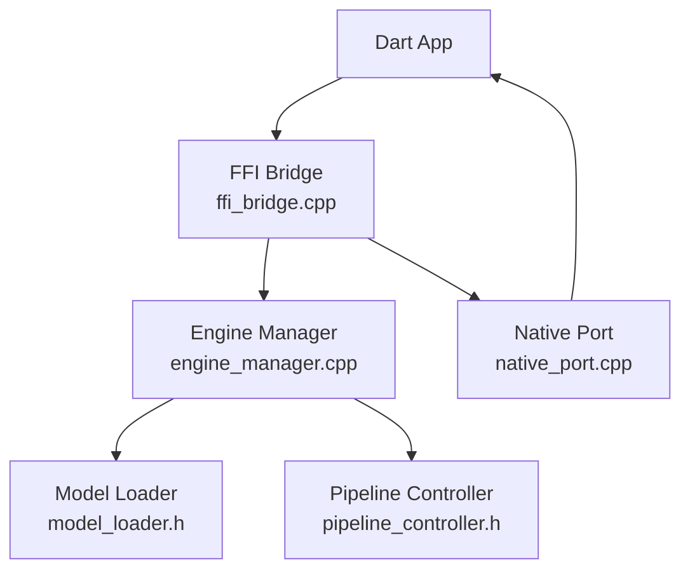
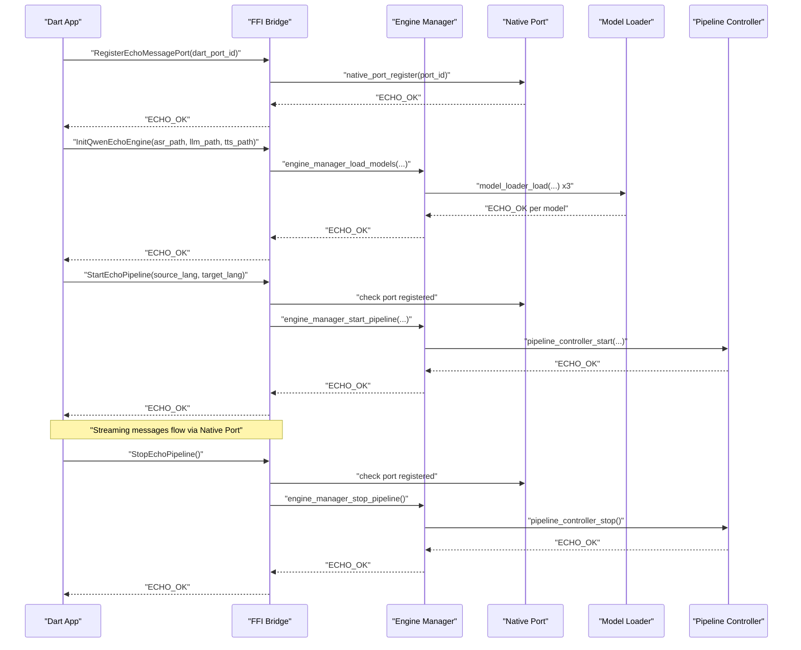
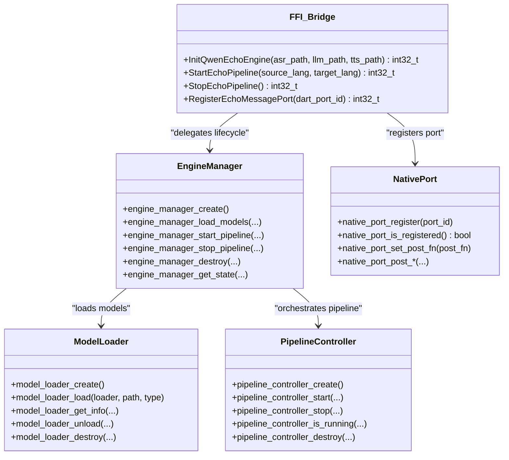

# C FFI API

<cite>
**Referenced Files in This Document**
- [ffi_bridge.h](file://native/include/ffi_bridge.h)
- [ffi_bridge.cpp](file://native/src/ffi_bridge.cpp)
- [echo_types.h](file://native/include/echo_types.h)
- [engine_manager.h](file://native/include/engine_manager.h)
- [engine_manager.cpp](file://native/src/engine_manager.cpp)
- [model_loader.h](file://native/include/model_loader.h)
- [pipeline_controller.h](file://native/include/pipeline_controller.h)
- [native_port.h](file://native/include/native_port.h)
- [native_port.cpp](file://native/src/native_port.cpp)
- [CMakeLists.txt](file://native/CMakeLists.txt)
- [README.md](file://README.md)
</cite>

## Table of Contents
1. [Introduction](#introduction)
2. [Project Structure](#project-structure)
3. [Core Components](#core-components)
4. [Architecture Overview](#architecture-overview)
5. [Detailed Component Analysis](#detailed-component-analysis)
6. [Dependency Analysis](#dependency-analysis)
7. [Performance Considerations](#performance-considerations)
8. [Troubleshooting Guide](#troubleshooting-guide)
9. [Conclusion](#conclusion)
10. [Appendices](#appendices)

## Introduction
This document provides comprehensive C FFI API documentation for QwenEcho’s native interface. It covers the four C-linkage entry points exposed to Dart:
- InitQwenEchoEngine
- StartEchoPipeline
- StopEchoPipeline
- RegisterEchoMessagePort

It includes parameter specifications, return code enumerations (EchoErrorCode), error handling patterns, thread safety considerations, usage examples, memory management best practices, and cross-platform compilation requirements.

## Project Structure
The C FFI surface is defined in a small set of headers and implemented in a thin bridge layer that delegates to internal components:
- Public C FFI declarations are in ffi_bridge.h
- Bridge implementation is in ffi_bridge.cpp
- Shared types and enums are in echo_types.h
- Lifecycle orchestration is in engine_manager.{h,cpp}
- Model loading and validation are in model_loader.h
- Pipeline orchestration is in pipeline_controller.h
- Dart message dispatch is in native_port.{h,cpp}
- Build configuration is in native/CMakeLists.txt

**Diagram sources**
- [ffi_bridge.cpp:54-124](file://native/src/ffi_bridge.cpp#L54-L124)
- [engine_manager.cpp:29-202](file://native/src/engine_manager.cpp#L29-L202)
- [model_loader.h:82-135](file://native/include/model_loader.h#L82-L135)
- [pipeline_controller.h:46-100](file://native/include/pipeline_controller.h#L46-L100)
- [native_port.cpp:36-75](file://native/src/native_port.cpp#L36-L75)

**Section sources**
- [README.md:164-175](file://README.md#L164-L175)
- [ffi_bridge.h:1-84](file://native/include/ffi_bridge.h#L1-L84)

## Core Components
- FFI Bridge: Exposes exactly four C-linkage functions with default visibility attributes. All return int32_t where 0 indicates success and negative values indicate EchoErrorCode.
- Engine Manager: Implements lifecycle state machine and guards transitions; coordinates model loading and pipeline start/stop.
- Native Port: Serializes typed messages into Dart_CObject arrays and posts them via a registered Dart SendPort.
- Model Loader: Validates GGUF files, checks quantization, memory maps models, and creates inference contexts.
- Pipeline Controller: Orchestrates audio capture, ASR→LLM→TTS stages, thermal/memory monitoring, and graceful shutdown.

Key responsibilities and constraints:
- Thread safety: The FFI bridge serializes calls using a global mutex; Engine Manager also uses its own mutex for state transitions.
- Port registration: A Dart port must be registered before starting or stopping the pipeline.
- Language codes: ISO 639-1 strings are validated by the pipeline controller.
- Model formats: GGUF files must match expected magic bytes and supported INT4 quantization variants.

**Section sources**
- [ffi_bridge.h:17-77](file://native/include/ffi_bridge.h#L17-L77)
- [engine_manager.h:27-98](file://native/include/engine_manager.h#L27-L98)
- [native_port.h:69-172](file://native/include/native_port.h#L69-L172)
- [model_loader.h:26-100](file://native/include/model_loader.h#L26-L100)
- [pipeline_controller.h:48-82](file://native/include/pipeline_controller.h#L48-L82)

## Architecture Overview
The FFI layer is intentionally minimal and delegates all heavy lifting to internal modules. The following diagram shows how the four public functions interact with internal components and the Dart runtime.

**Diagram sources**
- [ffi_bridge.cpp:54-124](file://native/src/ffi_bridge.cpp#L54-L124)
- [engine_manager.cpp:44-168](file://native/src/engine_manager.cpp#L44-L168)
- [native_port.cpp:36-75](file://native/src/native_port.cpp#L36-L75)
- [model_loader.h:82-100](file://native/include/model_loader.h#L82-L100)
- [pipeline_controller.h:48-82](file://native/include/pipeline_controller.h#L48-L82)

## Detailed Component Analysis

### C FFI Entry Points

#### InitQwenEchoEngine
- Purpose: Initialize the engine by loading ASR, LLM, and TTS models from provided paths. Must be called before StartEchoPipeline.
- Parameters:
  - asr_path: Path to FunASR-Nano GGUF model file
  - llm_path: Path to Qwen3-4B-Instruct GGUF model file
  - tts_path: Path to Qwen3-TTS-Streaming GGUF model file
- Return codes:
  - ECHO_OK on success
  - ECHO_ERR_ALREADY_INIT if already initialized
  - ECHO_ERR_MODEL_MISSING if any path is NULL or empty
  - ECHO_ERR_MEMORY if allocation fails
  - ECHO_ERR_MODEL_INVALID/ECHO_ERR_MODEL_PERMISSION if model validation fails
- Behavior:
  - Transitions engine state Uninitialized → Initializing → Ready on success
  - On failure, transitions to Error state
- Requirements:
  - Paths must point to valid GGUF files with correct magic bytes and supported INT4 quantization

**Section sources**
- [ffi_bridge.h:17-33](file://native/include/ffi_bridge.h#L17-L33)
- [ffi_bridge.cpp:56-69](file://native/src/ffi_bridge.cpp#L56-L69)
- [engine_manager.cpp:44-100](file://native/src/engine_manager.cpp#L44-L100)
- [model_loader.h:82-100](file://native/include/model_loader.h#L82-L100)

#### StartEchoPipeline
- Purpose: Begin audio capture and activate the full ASR → LLM → TTS pipeline for a given language pair.
- Parameters:
  - source_lang: ISO 639-1 source language code (e.g., "zh")
  - target_lang: ISO 639-1 target language code (e.g., "en")
- Return codes:
  - ECHO_OK on success
  - ECHO_ERR_ENGINE_NOT_READY if engine not in Ready state
  - ECHO_ERR_SESSION_ACTIVE if a session is already running
  - ECHO_ERR_NO_PORT if no Native Port registered
  - ECHO_ERR_UNSUPPORTED_LANG if language pair not supported
- Behavior:
  - Requires a registered Dart port
  - Validates language codes
  - Creates and starts pipeline resources
  - Transitions engine state Ready → Running

**Section sources**
- [ffi_bridge.h:35-51](file://native/include/ffi_bridge.h#L35-L51)
- [ffi_bridge.cpp:71-88](file://native/src/ffi_bridge.cpp#L71-L88)
- [engine_manager.cpp:102-141](file://native/src/engine_manager.cpp#L102-L141)
- [pipeline_controller.h:48-64](file://native/include/pipeline_controller.h#L48-L64)

#### StopEchoPipeline
- Purpose: Stop the active interpretation pipeline, process locked segments, discard unlocked audio, and release pipeline resources.
- Return codes:
  - ECHO_OK on success
  - ECHO_ERR_NO_SESSION if no pipeline session is active
  - ECHO_ERR_NO_PORT if no Native Port registered
- Behavior:
  - Requires a registered Dart port
  - Graceful stop within a bounded time window
  - Transitions engine state Running → Stopping → Ready

**Section sources**
- [ffi_bridge.h:53-65](file://native/include/ffi_bridge.h#L53-L65)
- [ffi_bridge.cpp:90-106](file://native/src/ffi_bridge.cpp#L90-L106)
- [engine_manager.cpp:143-168](file://native/src/engine_manager.cpp#L143-L168)
- [pipeline_controller.h:66-82](file://native/include/pipeline_controller.h#L66-L82)

#### RegisterEchoMessagePort
- Purpose: Register a Dart Native Port for async message delivery. Replaces any previously registered port.
- Parameters:
  - dart_port_id: The Dart SendPort ID for Native Port communication
- Return codes:
  - ECHO_OK on success
- Behavior:
  - Stores port ID and sets registration flag
  - Forwards registration to native_port module for message dispatch

**Section sources**
- [ffi_bridge.h:67-77](file://native/include/ffi_bridge.h#L67-L77)
- [ffi_bridge.cpp:108-121](file://native/src/ffi_bridge.cpp#L108-L121)
- [native_port.h:69-77](file://native/include/native_port.h#L69-L77)
- [native_port.cpp:36-47](file://native/src/native_port.cpp#L36-L47)

### Error Codes (EchoErrorCode)
All C-linkage functions return int32_t where 0 indicates success and negative values indicate errors. Key codes include:
- ECHO_OK
- ECHO_ERR_NOT_INITIALIZED
- ECHO_ERR_ALREADY_INIT
- ECHO_ERR_MODEL_MISSING
- ECHO_ERR_MODEL_INVALID
- ECHO_ERR_MODEL_PERMISSION
- ECHO_ERR_MEMORY
- ECHO_ERR_UNSUPPORTED_LANG
- ECHO_ERR_SESSION_ACTIVE
- ECHO_ERR_NO_SESSION
- ECHO_ERR_NO_PORT
- ECHO_ERR_ENGINE_NOT_READY
- ECHO_ERR_THERMAL_CRITICAL

These codes are used consistently across initialization, pipeline control, and model loading operations.

**Section sources**
- [echo_types.h:44-62](file://native/include/echo_types.h#L44-L62)
- [engine_manager.cpp:44-100](file://native/src/engine_manager.cpp#L44-L100)
- [engine_manager.cpp:102-168](file://native/src/engine_manager.cpp#L102-L168)

### Message Types and Native Port
The Native Port supports typed messages sent from the engine to Dart. Each message begins with a MessageType tag followed by payload fields. Examples include:
- MSG_ASR_PARTIAL, MSG_ASR_CONFIRMED
- MSG_TRANSLATION_STREAM, MSG_TRANSLATION_DONE
- MSG_TTS_STARTED, MSG_TTS_COMPLETE
- MSG_ERROR, MSG_THERMAL_STATE, MSG_MEMORY_WARNING, MSG_LATENCY_WARNING, MSG_SAMPLE_DROP

Messages are serialized as Dart_CObject arrays and posted through the registered port.

**Section sources**
- [echo_types.h:27-42](file://native/include/echo_types.h#L27-L42)
- [native_port.h:96-172](file://native/include/native_port.h#L96-L172)
- [native_port.cpp:116-317](file://native/src/native_port.cpp#L116-L317)

### Thread Safety and Concurrency
- FFI Bridge: Uses a global mutex to serialize calls to Init/Start/Stop and port registration.
- Engine Manager: Uses its own mutex to protect state transitions and resource creation/destruction.
- Native Port: Uses atomic variables for port ID, registration flag, and post function pointer to support concurrent posting from pipeline threads.

Best practices:
- Always call RegisterEchoMessagePort before StartEchoPipeline.
- Avoid calling StartEchoPipeline while a session is active.
- Ensure StopEchoPipeline is called to release resources and return to Ready state.

**Section sources**
- [ffi_bridge.cpp:22-48](file://native/src/ffi_bridge.cpp#L22-L48)
- [engine_manager.cpp:19-42](file://native/src/engine_manager.cpp#L19-L42)
- [native_port.cpp:19-52](file://native/src/native_port.cpp#L19-L52)

### Memory Management Best Practices
- Model paths: Provide stable, valid paths to GGUF files; they must remain accessible during initialization.
- Resource cleanup: Call StopEchoPipeline to gracefully stop the pipeline and release resources. Destroying the engine manager will unload models and free resources.
- Port lifetime: The port registration persists until replaced; ensure the Dart side maintains a valid SendPort for the duration of use.

**Section sources**
- [engine_manager.cpp:170-202](file://native/src/engine_manager.cpp#L170-L202)
- [model_loader.h:120-135](file://native/include/model_loader.h#L120-L135)
- [native_port.cpp:36-52](file://native/src/native_port.cpp#L36-L52)

### Usage Examples

#### Initialization Sequence
- Register a Dart Native Port first.
- Initialize the engine with three GGUF model paths.
- Validate return codes and handle errors accordingly.

Example steps:
1. Call RegisterEchoMessagePort with a Dart SendPort ID.
2. Call InitQwenEchoEngine with asr_path, llm_path, tts_path.
3. Check for ECHO_OK; if ECHO_ERR_MODEL_MISSING or ECHO_ERR_MODEL_INVALID, verify file existence and format.

**Section sources**
- [ffi_bridge.cpp:108-121](file://native/src/ffi_bridge.cpp#L108-L121)
- [ffi_bridge.cpp:56-69](file://native/src/ffi_bridge.cpp#L56-L69)
- [engine_manager.cpp:44-100](file://native/src/engine_manager.cpp#L44-L100)

#### Starting the Pipeline
- Ensure the engine is in Ready state.
- Provide valid ISO 639-1 language codes.
- Confirm a Native Port is registered.

Example steps:
1. Call StartEchoPipeline("source_lang", "target_lang").
2. If ECHO_ERR_ENGINE_NOT_READY, reinitialize engine.
3. If ECHO_ERR_SESSION_ACTIVE, call StopEchoPipeline first.
4. If ECHO_ERR_NO_PORT, register a port.

**Section sources**
- [ffi_bridge.cpp:71-88](file://native/src/ffi_bridge.cpp#L71-L88)
- [engine_manager.cpp:102-141](file://native/src/engine_manager.cpp#L102-L141)
- [pipeline_controller.h:48-64](file://native/include/pipeline_controller.h#L48-L64)

#### Stopping the Pipeline
- Call StopEchoPipeline when done.
- Handle ECHO_ERR_NO_PORT if a port was not registered.
- Expect ECHO_OK even if no session is active (no-op behavior).

**Section sources**
- [ffi_bridge.cpp:90-106](file://native/src/ffi_bridge.cpp#L90-L106)
- [engine_manager.cpp:143-168](file://native/src/engine_manager.cpp#L143-L168)
- [pipeline_controller.h:66-82](file://native/include/pipeline_controller.h#L66-L82)

#### Error Recovery Strategies
- On ECHO_ERR_MODEL_MISSING: Verify file paths and permissions.
- On ECHO_ERR_MODEL_INVALID: Ensure GGUF magic bytes and INT4 quantization are correct.
- On ECHO_ERR_ENGINE_NOT_READY: Reinitialize engine before starting pipeline.
- On ECHO_ERR_SESSION_ACTIVE: Stop existing session before starting a new one.
- On ECHO_ERR_NO_PORT: Register a Dart port prior to starting/stopping.

**Section sources**
- [engine_manager.cpp:44-100](file://native/src/engine_manager.cpp#L44-L100)
- [engine_manager.cpp:102-168](file://native/src/engine_manager.cpp#L102-L168)
- [model_loader.h:82-100](file://native/include/model_loader.h#L82-L100)

## Dependency Analysis
The FFI bridge depends on:
- Engine Manager for lifecycle and orchestration
- Native Port for Dart message dispatch
- Model Loader for GGUF validation and context creation
- Pipeline Controller for stage orchestration and graceful shutdown

**Diagram sources**
- [ffi_bridge.h:17-77](file://native/include/ffi_bridge.h#L17-L77)
- [engine_manager.h:27-98](file://native/include/engine_manager.h#L27-L98)
- [native_port.h:69-172](file://native/include/native_port.h#L69-L172)
- [model_loader.h:82-135](file://native/include/model_loader.h#L82-L135)
- [pipeline_controller.h:46-100](file://native/include/pipeline_controller.h#L46-L100)

**Section sources**
- [ffi_bridge.cpp:54-124](file://native/src/ffi_bridge.cpp#L54-L124)
- [engine_manager.cpp:29-202](file://native/src/engine_manager.cpp#L29-L202)
- [native_port.cpp:36-75](file://native/src/native_port.cpp#L36-L75)

## Performance Considerations
- Use GGUF/INT4 models to reduce memory footprint and improve inference speed.
- Ensure sufficient device RAM (recommended ≥4GB) for model loading and pipeline operation.
- Monitor thermal and memory warnings via Native Port messages to adapt behavior (e.g., throttle mode).
- Keep pipeline sessions short-lived to avoid resource contention and maintain responsiveness.

[No sources needed since this section provides general guidance]

## Troubleshooting Guide
Common issues and resolutions:
- ECHO_ERR_MODEL_MISSING: Verify file paths exist and are non-empty.
- ECHO_ERR_MODEL_PERMISSION: Check read permissions for model files.
- ECHO_ERR_MODEL_INVALID: Confirm GGUF magic bytes and INT4 quantization.
- ECHO_ERR_ENGINE_NOT_READY: Reinitialize engine before starting pipeline.
- ECHO_ERR_SESSION_ACTIVE: Stop current session before starting a new one.
- ECHO_ERR_NO_PORT: Register a Dart port before starting/stopping pipeline.
- ECHO_ERR_UNSUPPORTED_LANG: Use valid ISO 639-1 codes supported by the pipeline.

Diagnostic tips:
- Inspect Native Port messages for error notifications and telemetry.
- Query engine state via engine_manager_get_state for debugging transitions.
- Review model loader info for memory usage and load status.

**Section sources**
- [engine_manager.cpp:44-100](file://native/src/engine_manager.cpp#L44-L100)
- [engine_manager.cpp:102-168](file://native/src/engine_manager.cpp#L102-L168)
- [model_loader.h:100-135](file://native/include/model_loader.h#L100-L135)
- [native_port.h:142-172](file://native/include/native_port.h#L142-L172)

## Conclusion
QwenEcho’s C FFI API provides a concise, thread-safe interface for initializing models, controlling the interpretation pipeline, and communicating with Dart via Native Port messages. Proper initialization sequences, error handling, and resource management are essential for reliable operation across Android and iOS platforms.

[No sources needed since this section summarizes without analyzing specific files]

## Appendices

### Visibility Attributes and Compilation Requirements
- Visibility: All four FFI functions are declared with __attribute__((visibility("default"))) to ensure they are exported from the shared/static library.
- Build system:
  - C++17 and C11 standards required
  - arm64 architecture targeting (Android arm64-v8a, iOS/macOS arm64)
  - Android-specific linker options for 16KB page size compatibility
  - Optional RapidCheck-based tests

**Section sources**
- [ffi_bridge.h:30-77](file://native/include/ffi_bridge.h#L30-L77)
- [CMakeLists.txt:1-68](file://native/CMakeLists.txt#L1-L68)

### GGUF File Requirements
- Magic bytes: GGUF_MAGIC (0x46475547)
- Supported quantization: INT4 variants (Q4_0, Q4_1, Q4_K family)
- Validation: Missing file, permission denied, invalid header, unsupported quantization produce distinct error codes

**Section sources**
- [model_loader.h:26-49](file://native/include/model_loader.h#L26-L49)
- [model_loader.h:82-100](file://native/include/model_loader.h#L82-L100)