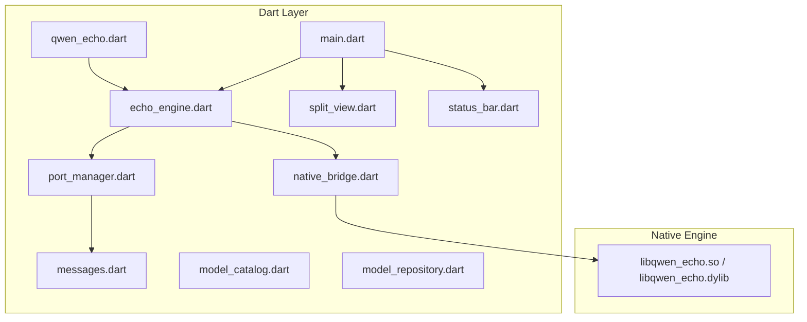
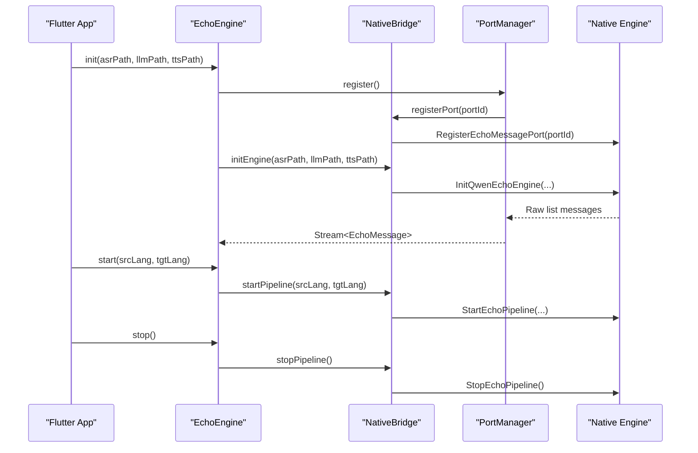
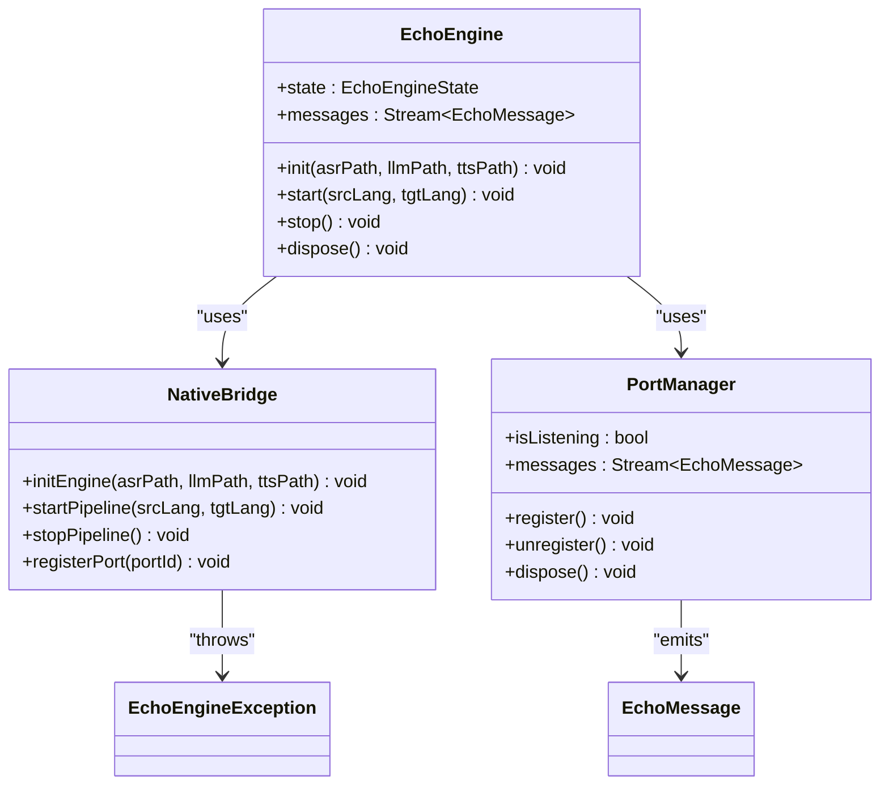
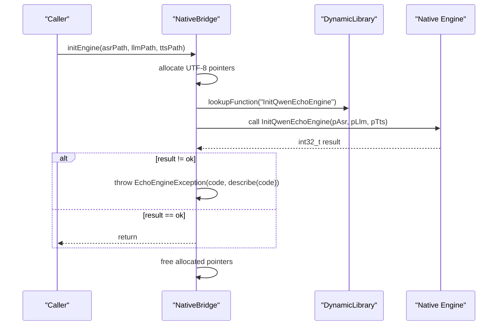
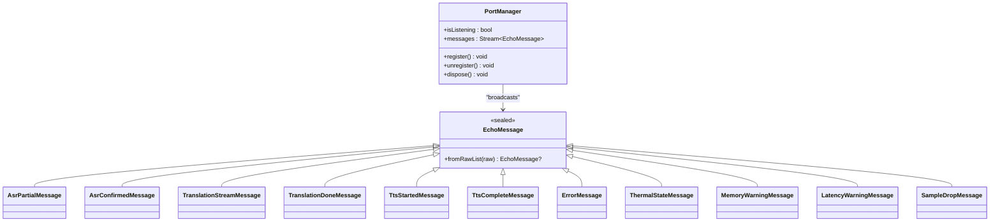
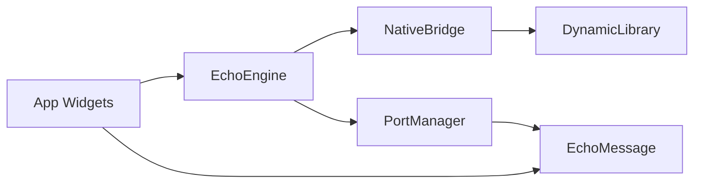

# Dart Facade API

<cite>
**Referenced Files in This Document**
- [qwen_echo.dart](file://lib/qwen_echo.dart)
- [echo_engine.dart](file://lib/src/echo_engine.dart)
- [native_bridge.dart](file://lib/src/native_bridge.dart)
- [port_manager.dart](file://lib/src/port_manager.dart)
- [messages.dart](file://lib/src/messages.dart)
- [model_catalog.dart](file://lib/src/model/model_catalog.dart)
- [model_repository.dart](file://lib/src/model/model_repository.dart)
- [main.dart](file://lib/main.dart)
- [split_view.dart](file://lib/src/ui/split_view.dart)
- [status_bar.dart](file://lib/src/ui/status_bar.dart)
- [README.md](file://README.md)
</cite>

## Table of Contents
1. [Introduction](#introduction)
2. [Project Structure](#project-structure)
3. [Core Components](#core-components)
4. [Architecture Overview](#architecture-overview)
5. [Detailed Component Analysis](#detailed-component-analysis)
6. [Dependency Analysis](#dependency-analysis)
7. [Performance Considerations](#performance-considerations)
8. [Troubleshooting Guide](#troubleshooting-guide)
9. [Conclusion](#conclusion)
10. [Appendices](#appendices)

## Introduction
This document provides a comprehensive Dart facade API reference for QwenEcho’s high-level interface. It focuses on:
- EchoEngine lifecycle management (initialization with model paths, pipeline control with language pairs, graceful shutdown)
- NativeBridge wrapper methods that perform FFI calls and translate native error codes into Dart exceptions
- PortManager for asynchronous message handling and event streaming from the native engine
- Practical usage patterns for starting interpretation sessions, handling real-time messages, and managing state transitions
- Flutter-specific considerations for widget integration and UI updates from background operations

The goal is to enable developers to integrate and operate QwenEcho safely and efficiently within Flutter applications.

## Project Structure
QwenEcho exposes a small, focused Dart facade over a C/C++ native engine. The Dart layer includes:
- A barrel export file that re-exports public APIs
- High-level EchoEngine facade combining NativeBridge and PortManager
- FFI bindings in NativeBridge
- Asynchronous message transport via PortManager
- Typed message definitions for ASR, translation, TTS, and diagnostics
- Model catalog and repository for local GGUF provisioning
- Example Flutter app wiring the engine to UI components

**Diagram sources**
- [qwen_echo.dart:1-16](file://lib/qwen_echo.dart#L1-L16)
- [echo_engine.dart:1-108](file://lib/src/echo_engine.dart#L1-L108)
- [native_bridge.dart:1-230](file://lib/src/native_bridge.dart#L1-L230)
- [port_manager.dart:1-85](file://lib/src/port_manager.dart#L1-L85)
- [messages.dart:1-336](file://lib/src/messages.dart#L1-L336)
- [model_catalog.dart:1-81](file://lib/src/model/model_catalog.dart#L1-L81)
- [model_repository.dart:1-256](file://lib/src/model/model_repository.dart#L1-L256)
- [main.dart:1-154](file://lib/main.dart#L1-L154)
- [split_view.dart:1-118](file://lib/src/ui/split_view.dart#L1-L118)
- [status_bar.dart:1-181](file://lib/src/ui/status_bar.dart#L1-L181)

**Section sources**
- [qwen_echo.dart:1-16](file://lib/qwen_echo.dart#L1-L16)
- [README.md:15-93](file://README.md#L15-L93)

## Core Components
This section summarizes the primary Dart facade components and their responsibilities.

- EchoEngine
  - Orchestrates initialization with model paths, starts/stops the interpretation pipeline, and exposes a typed message stream.
  - Manages lifecycle state transitions: uninitialized → ready → running.
  - Delegates FFI calls to NativeBridge and async messaging to PortManager.

- NativeBridge
  - Loads platform-specific native libraries and binds to four C-linkage entry points.
  - Converts string arguments to UTF-8 pointers, invokes native functions, frees memory, and throws EchoEngineException on non-zero returns.
  - Provides human-readable descriptions for error codes.

- PortManager
  - Creates and registers a Dart ReceivePort with the native engine.
  - Deserializes raw lists into strongly-typed EchoMessage subclasses and broadcasts them via a StreamController.

- Messages
  - Defines all message types received from the native engine, including ASR partial/confirmed, translation streaming/done, TTS started/completed, errors, thermal state, memory warnings, latency warnings, and sample drops.

- Model Catalog and Repository
  - Catalog defines required GGUF models and metadata.
  - Repository manages local provisioning, validation, and path resolution without network access.

- Flutter Integration
  - Example app wires EchoEngine messages to SplitView and StatusBar widgets.
  - Demonstrates subscription to engine messages and safe disposal.

**Section sources**
- [echo_engine.dart:1-108](file://lib/src/echo_engine.dart#L1-L108)
- [native_bridge.dart:1-230](file://lib/src/native_bridge.dart#L1-L230)
- [port_manager.dart:1-85](file://lib/src/port_manager.dart#L1-L85)
- [messages.dart:1-336](file://lib/src/messages.dart#L1-L336)
- [model_catalog.dart:1-81](file://lib/src/model/model_catalog.dart#L1-L81)
- [model_repository.dart:1-256](file://lib/src/model/model_repository.dart#L1-L256)
- [main.dart:1-154](file://lib/main.dart#L1-L154)

## Architecture Overview
The Dart facade sits between Flutter UI and the native engine. EchoEngine composes NativeBridge and PortManager to provide a simple, synchronous-looking API while leveraging asynchronous messaging under the hood.

**Diagram sources**
- [echo_engine.dart:60-98](file://lib/src/echo_engine.dart#L60-L98)
- [native_bridge.dart:132-185](file://lib/src/native_bridge.dart#L132-L185)
- [port_manager.dart:38-50](file://lib/src/port_manager.dart#L38-L50)
- [README.md:164-175](file://README.md#L164-L175)

## Detailed Component Analysis

### EchoEngine
High-level facade for engine lifecycle and pipeline control.

Key responsibilities:
- Initialize the engine with model paths and transition to ready state
- Start the pipeline with ISO 639-1 language pair and transition to running
- Stop the pipeline and return to ready state
- Dispose resources and close the port manager

Lifecycle states:
- uninitialized
- ready
- running

Public API summary:
- Constructor(s): default and with custom bridge
- init(asrPath, llmPath, ttsPath): void
- start(srcLang, tgtLang): void
- stop(): void
- dispose(): void
- messages: Stream<EchoMessage>
- state: EchoEngineState

Behavioral notes:
- init registers the native port first so status messages can be received before model loading completes.
- start requires the engine to be in ready state; otherwise, underlying FFI will fail and throw an exception.
- stop processes locked segments and discards unlocked audio; it does not free native resources—call dispose after stop when tearing down.

Error handling:
- Throws EchoEngineException on any non-zero native return code.

Usage example references:
- See main.dart for typical usage pattern: create engine, subscribe to messages, call init/start/stop/dispose.

**Section sources**
- [echo_engine.dart:13-108](file://lib/src/echo_engine.dart#L13-L108)
- [main.dart:47-65](file://lib/main.dart#L47-L65)

#### Class Diagram: EchoEngine and Dependencies

**Diagram sources**
- [echo_engine.dart:37-108](file://lib/src/echo_engine.dart#L37-L108)
- [native_bridge.dart:99-185](file://lib/src/native_bridge.dart#L99-L185)
- [port_manager.dart:18-63](file://lib/src/port_manager.dart#L18-L63)
- [messages.dart:8-34](file://lib/src/messages.dart#L8-L34)
- [native_bridge.dart:82-93](file://lib/src/native_bridge.dart#L82-L93)

### NativeBridge
FFI wrapper providing type-safe Dart methods over four C-linkage entry points.

Responsibilities:
- Load platform-specific shared library (Android/Linux vs iOS/macOS)
- Lookup function symbols and bind signatures
- Convert Dart strings to UTF-8 pointers and free memory
- Translate non-zero return codes into EchoEngineException with descriptive messages

Public API summary:
- initEngine(asrPath, llmPath, ttsPath): void
- startPipeline(srcLang, tgtLang): void
- stopPipeline(): void
- registerPort(portId): void

Error codes:
- EchoErrorCode constants mirror native enum values
- describe(code) returns human-readable text

Platform behavior:
- Android/Linux: loads libqwen_echo.so
- iOS/macOS: tries process library first, falls back to libqwen_echo.dylib

Memory safety:
- All pointer allocations are freed in finally blocks to prevent leaks.

**Section sources**
- [native_bridge.dart:16-75](file://lib/src/native_bridge.dart#L16-L75)
- [native_bridge.dart:99-230](file://lib/src/native_bridge.dart#L99-L230)
- [README.md:164-175](file://README.md#L164-L175)

#### Sequence Diagram: FFI Call Flow

**Diagram sources**
- [native_bridge.dart:138-150](file://lib/src/native_bridge.dart#L138-L150)
- [native_bridge.dart:209-228](file://lib/src/native_bridge.dart#L209-L228)

### PortManager
Manages the Native Port connection and transforms raw lists into typed messages.

Responsibilities:
- Create and register a ReceivePort with the native engine
- Subscribe to incoming raw messages and deserialize them using EchoMessage.fromRawList
- Expose a broadcast Stream<EchoMessage> for multiple subscribers
- Provide lifecycle methods to register/unregister and dispose

Public API summary:
- register(): void
- unregister(): void
- dispose(): void
- messages: Stream<EchoMessage>
- isListening: bool

Behavioral notes:
- If a port is already registered, register closes it and replaces it with a new one.
- Unregister cancels subscriptions and closes the receive port; in-flight messages may be lost.

**Section sources**
- [port_manager.dart:18-85](file://lib/src/port_manager.dart#L18-L85)
- [messages.dart:14-33](file://lib/src/messages.dart#L14-L33)

#### Class Diagram: PortManager and Message Types

**Diagram sources**
- [port_manager.dart:18-33](file://lib/src/port_manager.dart#L18-L33)
- [messages.dart:8-336](file://lib/src/messages.dart#L8-L336)

### Messages
Defines all message types received from the native engine. Each message begins with a type tag followed by payload fields.

Highlights:
- Base sealed class EchoMessage with factory fromRawList(List<dynamic>)
- MessageType constants mapping tags to concrete classes
- Concrete message classes for ASR, translation, TTS, errors, thermal state, memory warnings, latency warnings, and sample drops
- Utility getters for display-friendly information (e.g., modeName, usagePercent)

Validation:
- fromRawList returns null for unrecognized tags, allowing callers to ignore unknown messages gracefully.

**Section sources**
- [messages.dart:1-336](file://lib/src/messages.dart#L1-L336)

### Model Catalog and Repository
Model catalog defines required GGUF models and constraints. Repository handles local provisioning and validation.

Catalog:
- ModelKind enum: asr, llm, tts
- ModelSpec: kind, displayName, subtitle, fileName, maxSizeBytes
- kRequiredModels: ordered list of specs
- specForKind(kind): lookup helper

Repository:
- modelsDir(): resolves sandbox directory
- pathFor(spec): absolute destination path
- statusFor(spec), statusAll(), isComplete: health checks
- resolvePathsIfComplete(): map of kind to path if all models are ready
- importModel(spec, sourcePath): streamed copy with progress events and GGUF magic validation
- deleteModel(spec): remove model file

Constraints:
- Air-gapped policy: no network I/O
- Size ceiling enforcement per model spec
- Atomic move from temp file to final path

**Section sources**
- [model_catalog.dart:1-81](file://lib/src/model/model_catalog.dart#L1-L81)
- [model_repository.dart:1-256](file://lib/src/model/model_repository.dart#L1-L256)

### Flutter Integration Examples
The example app demonstrates:
- Creating EchoEngine and subscribing to messages
- Routing ASR and translation messages to SplitView
- Displaying thermal state and offline badge via StatusBar
- Opening model configuration screen

Practical patterns:
- Use initState to create engine and subscribe to messages
- Use dispose to cancel subscriptions and call engine.dispose()
- Update UI only on the main isolate; messages are delivered on the same isolate by default through the broadcast stream

**Section sources**
- [main.dart:47-105](file://lib/main.dart#L47-L105)
- [split_view.dart:52-77](file://lib/src/ui/split_view.dart#L52-L77)
- [status_bar.dart:74-99](file://lib/src/ui/status_bar.dart#L74-L99)

## Dependency Analysis
The Dart facade has clear separation of concerns:
- EchoEngine depends on NativeBridge and PortManager
- PortManager depends on messages deserialization
- NativeBridge depends on DynamicLibrary and platform detection
- UI components depend on EchoEngine.messages and message types

**Diagram sources**
- [echo_engine.dart:37-58](file://lib/src/echo_engine.dart#L37-L58)
- [port_manager.dart:18-33](file://lib/src/port_manager.dart#L18-L33)
- [native_bridge.dart:191-222](file://lib/src/native_bridge.dart#L191-L222)
- [messages.dart:8-336](file://lib/src/messages.dart#L8-L336)

**Section sources**
- [echo_engine.dart:37-58](file://lib/src/echo_engine.dart#L37-L58)
- [native_bridge.dart:191-222](file://lib/src/native_bridge.dart#L191-L222)
- [port_manager.dart:18-33](file://lib/src/port_manager.dart#L18-L33)
- [messages.dart:8-336](file://lib/src/messages.dart#L8-L336)

## Performance Considerations
- Streaming translation tokens minimize UI update overhead; prefer incremental rendering rather than waiting for full segments.
- Avoid heavy work inside message handlers; offload expensive computations to isolates if needed.
- Ensure proper disposal of subscriptions and engine resources to prevent memory leaks.
- Respect thermal and memory warnings; pause or reduce workload when critical conditions are reported.

[No sources needed since this section provides general guidance]

## Troubleshooting Guide
Common issues and resolutions:
- Initialization failures
  - Check model paths exist and are valid GGUF files
  - Validate sizes against model catalog limits
  - Inspect EchoEngineException details for specific error codes

- Pipeline start failures
  - Ensure engine is in ready state before calling start
  - Verify supported language pair codes
  - Confirm no active session exists

- No messages received
  - Confirm PortManager.register was called before init
  - Ensure the app subscribes to EchoEngine.messages
  - Check that the native library loaded successfully on the target platform

- Resource cleanup
  - Always cancel subscriptions and call engine.dispose() in widget dispose
  - Call stop before dispose if a session is active

Relevant error categories:
- Not initialized, already initialized, unsupported language, session active/no session, no port, engine not ready, thermal critical

**Section sources**
- [native_bridge.dart:43-75](file://lib/src/native_bridge.dart#L43-L75)
- [echo_engine.dart:60-98](file://lib/src/echo_engine.dart#L60-L98)
- [port_manager.dart:38-63](file://lib/src/port_manager.dart#L38-L63)

## Conclusion
QwenEcho’s Dart facade offers a concise, robust interface for on-device simultaneous interpretation. EchoEngine encapsulates lifecycle management, NativeBridge abstracts FFI complexity and error translation, and PortManager delivers typed messages asynchronously. With careful attention to resource management, error handling, and UI updates, developers can build responsive Flutter experiences that leverage powerful offline AI capabilities.

[No sources needed since this section summarizes without analyzing specific files]

## Appendices

### Method Signatures and Validation Summary

- EchoEngine
  - init(asrPath: String, llmPath: String, ttsPath: String): void
    - Validates model paths indirectly via native engine; throws EchoEngineException on failure
    - Registers port before init to ensure status messages are received
  - start(srcLang: String, tgtLang: String): void
    - Requires ISO 639-1 codes; throws EchoEngineException if unsupported or invalid state
  - stop(): void
    - Gracefully stops pipeline; returns to ready state; throws on failure
  - dispose(): void
    - Cleans up Dart-side resources; does not stop native engine
  - messages: Stream<EchoMessage>
    - Broadcast stream of typed messages
  - state: EchoEngineState
    - Current lifecycle state

- NativeBridge
  - initEngine(asrPath: String, llmPath: String, ttsPath: String): void
  - startPipeline(srcLang: String, tgtLang: String): void
  - stopPipeline(): void
  - registerPort(portId: int): void
  - Error translation: EchoEngineException(code: int, message: String)

- PortManager
  - register(): void
  - unregister(): void
  - dispose(): void
  - messages: Stream<EchoMessage>
  - isListening: bool

- Model Repository
  - statusAll(): Future<List<ModelStatus>>
  - isComplete: Future<bool>
  - resolvePathsIfComplete(): Future<Map<ModelKind, String>?>
  - importModel(spec: ModelSpec, sourcePath: String): Stream<ModelImportProgress>
  - deleteModel(spec: ModelSpec): Future<void>

**Section sources**
- [echo_engine.dart:60-108](file://lib/src/echo_engine.dart#L60-L108)
- [native_bridge.dart:132-185](file://lib/src/native_bridge.dart#L132-L185)
- [port_manager.dart:38-63](file://lib/src/port_manager.dart#L38-L63)
- [model_repository.dart:125-211](file://lib/src/model/model_repository.dart#L125-L211)

### Practical Usage Patterns

- Starting an interpretation session
  - Create EchoEngine instance
  - Subscribe to messages
  - Call init with model paths
  - Call start with language pair
  - Handle messages in UI
  - Call stop and dispose when done

- Handling real-time messages
  - Route AsrPartialMessage and AsrConfirmedMessage to originating speaker half
  - Route TranslationStreamMessage to opposing speaker half
  - Use StatusBar to reflect thermal state and offline badge

- Managing engine state transitions
  - Ensure state is ready before starting
  - On stop, return to ready; do not reuse engine without re-initializing if needed
  - Dispose only after stopping to avoid dangling native resources

**Section sources**
- [main.dart:47-105](file://lib/main.dart#L47-L105)
- [split_view.dart:52-77](file://lib/src/ui/split_view.dart#L52-L77)
- [status_bar.dart:74-99](file://lib/src/ui/status_bar.dart#L74-L99)

### Flutter-Specific Considerations

- Widget integration
  - Use global keys to access child widget state for updating text displays
  - Lock orientation and system UI for immersive experience during interpretation

- UI updates from background operations
  - Messages are delivered on the same isolate; avoid blocking operations in listeners
  - Debounce frequent token updates if necessary to maintain smooth rendering

- Error presentation
  - Show transient warnings for memory and latency events
  - Persist offline indicator and thermal state at all times

**Section sources**
- [split_view.dart:34-50](file://lib/src/ui/split_view.dart#L34-L50)
- [status_bar.dart:102-123](file://lib/src/ui/status_bar.dart#L102-L123)