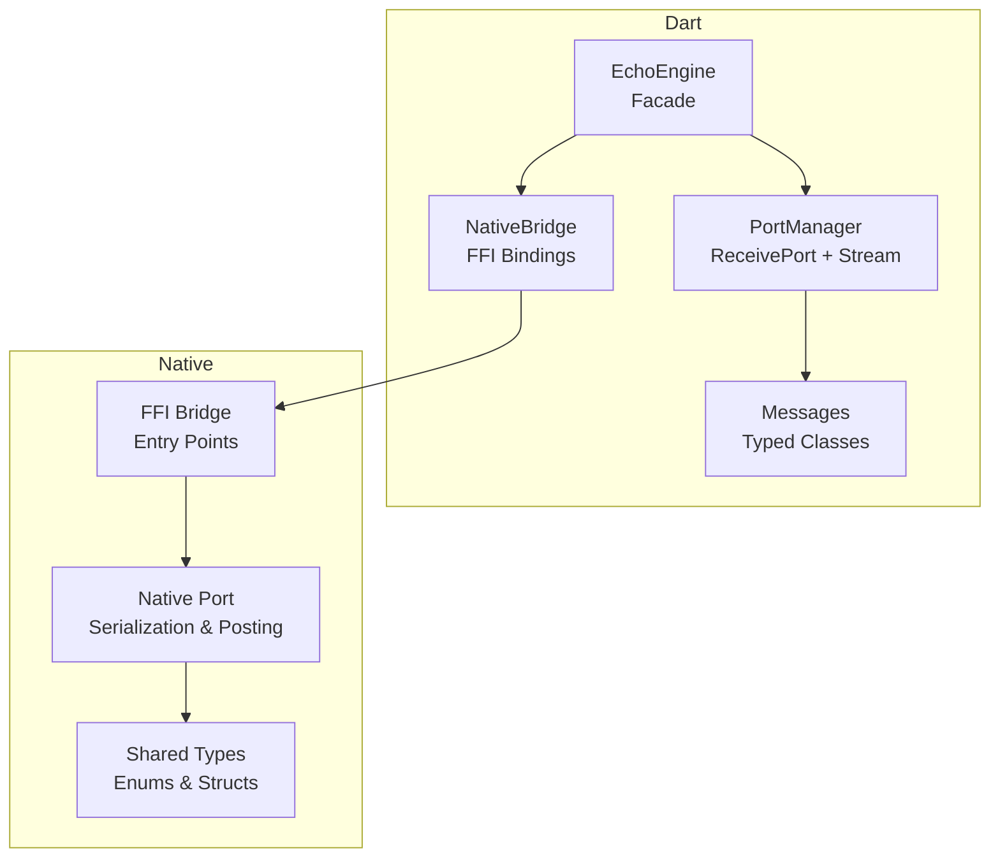
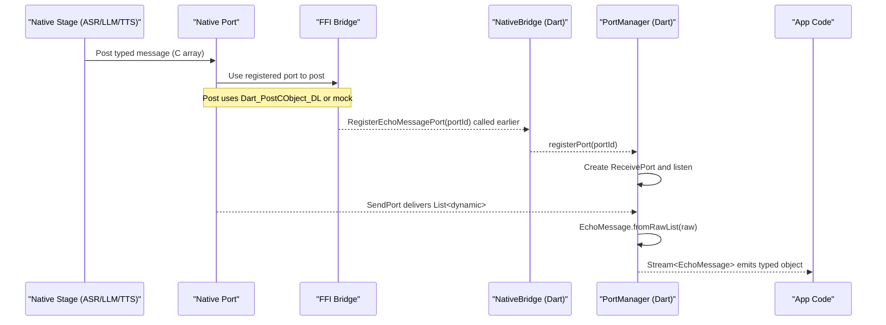
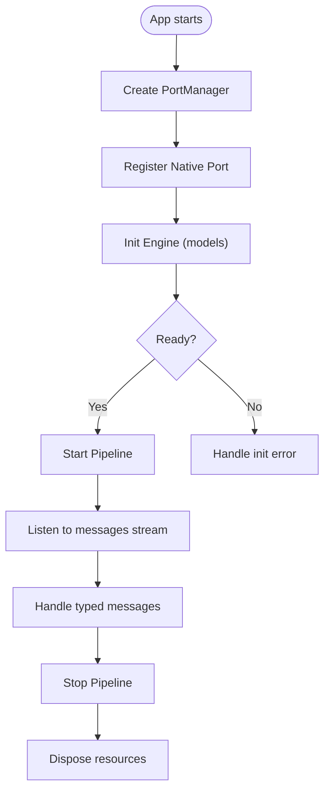
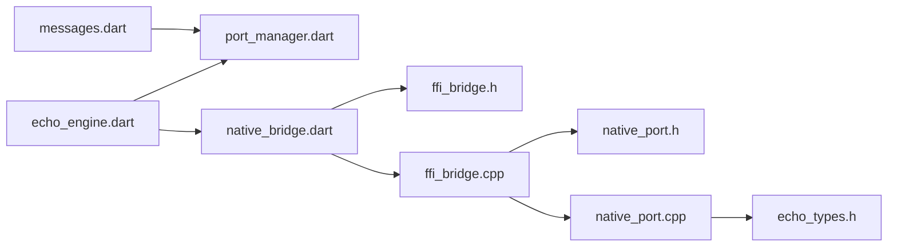

# Message Protocol

<cite>
**Referenced Files in This Document**
- [native/include/native_port.h](file://native/include/native_port.h)
- [native/src/native_port.cpp](file://native/src/native_port.cpp)
- [native/include/echo_types.h](file://native/include/echo_types.h)
- [native/include/ffi_bridge.h](file://native/include/ffi_bridge.h)
- [native/src/ffi_bridge.cpp](file://native/src/ffi_bridge.cpp)
- [lib/qwen_echo.dart](file://lib/qwen_echo.dart)
- [lib/src/messages.dart](file://lib/src/messages.dart)
- [lib/src/port_manager.dart](file://lib/src/port_manager.dart)
- [lib/src/echo_engine.dart](file://lib/src/echo_engine.dart)
- [lib/src/native_bridge.dart](file://lib/src/native_bridge.dart)
- [test/messages_test.dart](file://test/messages_test.dart)
</cite>

## Table of Contents
1. [Introduction](#introduction)
2. [Project Structure](#project-structure)
3. [Core Components](#core-components)
4. [Architecture Overview](#architecture-overview)
5. [Detailed Component Analysis](#detailed-component-analysis)
6. [Dependency Analysis](#dependency-analysis)
7. [Performance Considerations](#performance-considerations)
8. [Troubleshooting Guide](#troubleshooting-guide)
9. [Conclusion](#conclusion)
10. [Appendices](#appendices)

## Introduction
This document describes the typed message protocol used for Dart-native communication in QwenEcho. It covers all message types, their fields and data structures, serialization formats, ordering guarantees, error propagation, event subscription patterns, callback registration, handling examples, high-load queuing behavior, and debugging techniques. The protocol is implemented as a Native Port system: native C/C++ stages serialize messages into Dart_CObject arrays and post them to a registered Dart ReceivePort; Dart deserializes these into strongly-typed classes and exposes them via a broadcast Stream for UI consumers.

## Project Structure
The message protocol spans both native and Dart layers:
- Native side: FFI bridge entry points, port registration, typed message posting, and shared type definitions.
- Dart side: FFI bindings, port manager that receives and transforms raw lists into typed messages, and a high-level engine facade exposing a Stream of messages.

**Diagram sources**
- [lib/src/echo_engine.dart:1-108](file://lib/src/echo_engine.dart#L1-L108)
- [lib/src/port_manager.dart:1-85](file://lib/src/port_manager.dart#L1-L85)
- [lib/src/messages.dart:1-336](file://lib/src/messages.dart#L1-L336)
- [lib/src/native_bridge.dart:1-230](file://lib/src/native_bridge.dart#L1-L230)
- [native/include/ffi_bridge.h:1-84](file://native/include/ffi_bridge.h#L1-L84)
- [native/src/ffi_bridge.cpp:1-124](file://native/src/ffi_bridge.cpp#L1-L124)
- [native/include/native_port.h:1-179](file://native/include/native_port.h#L1-L179)
- [native/src/native_port.cpp:1-320](file://native/src/native_port.cpp#L1-L320)
- [native/include/echo_types.h:1-136](file://native/include/echo_types.h#L1-L136)

**Section sources**
- [lib/qwen_echo.dart:1-16](file://lib/qwen_echo.dart#L1-L16)
- [README.md:15-33](file://README.md#L15-L33)

## Core Components
- EchoMessage and typed subclasses define the Dart-side contract for each message type. They parse raw lists from the Native Port into strongly-typed objects.
- MessageType constants mirror the native enum values to ensure tag alignment across layers.
- PortManager owns a ReceivePort, registers it with the native engine, and broadcasts parsed messages on a Stream.
- NativeBridge provides FFI bindings for lifecycle calls and port registration.
- Native Port module serializes typed events into Dart_CObject arrays and posts them to the registered Dart port.
- Shared types define message tags and engine states.

Key responsibilities:
- Serialization: Native side builds Dart_CObject arrays with fixed field order per message type.
- Delivery: Dart ReceivePort delivers raw lists; PortManager converts to typed messages.
- Subscription: Consumers subscribe to the broadcast Stream from PortManager or EchoEngine.

**Section sources**
- [lib/src/messages.dart:1-336](file://lib/src/messages.dart#L1-L336)
- [lib/src/port_manager.dart:1-85](file://lib/src/port_manager.dart#L1-L85)
- [lib/src/native_bridge.dart:1-230](file://lib/src/native_bridge.dart#L1-L230)
- [native/include/native_port.h:1-179](file://native/include/native_port.h#L1-L179)
- [native/src/native_port.cpp:1-320](file://native/src/native_port.cpp#L1-L320)
- [native/include/echo_types.h:1-136](file://native/include/echo_types.h#L1-L136)

## Architecture Overview
End-to-end flow from generation in native code to delivery in Dart:

**Diagram sources**
- [native/src/native_port.cpp:1-320](file://native/src/native_port.cpp#L1-L320)
- [native/include/native_port.h:1-179](file://native/include/native_port.h#L1-L179)
- [native/src/ffi_bridge.cpp:1-124](file://native/src/ffi_bridge.cpp#L1-L124)
- [native/include/ffi_bridge.h:1-84](file://native/include/ffi_bridge.h#L1-L84)
- [lib/src/native_bridge.dart:1-230](file://lib/src/native_bridge.dart#L1-L230)
- [lib/src/port_manager.dart:1-85](file://lib/src/port_manager.dart#L1-L85)
- [lib/src/messages.dart:1-336](file://lib/src/messages.dart#L1-L336)

## Detailed Component Analysis

### Message Types and Data Structures
All messages are serialized as Dart_CObject arrays with a leading type tag followed by payload fields. The following table summarizes each message type, its tag, and fields.

- AsrPartialMessage
  - Tag: MSG_ASR_PARTIAL
  - Fields: speaker_id (int), text (string), timestamp_ms (int64)
  - Purpose: Temporary/unconfirmed ASR text updates
- AsrConfirmedMessage
  - Tag: MSG_ASR_CONFIRMED
  - Fields: speaker_id (int), text (string), timestamp_ms (int64), segment_id (int)
  - Purpose: Finalized ASR text with punctuation and segment association
- TranslationStreamMessage
  - Tag: MSG_TRANSLATION_STREAM
  - Fields: speaker_id (int), token (string), segment_id (int)
  - Purpose: Streaming translation tokens
- TranslationDoneMessage
  - Tag: MSG_TRANSLATION_DONE
  - Fields: speaker_id (int), full_text (string), segment_id (int)
  - Purpose: Completed translation for a segment
- TtsStartedMessage
  - Tag: MSG_TTS_STARTED
  - Fields: speaker_id (int), segment_id (int)
  - Purpose: TTS synthesis started for a segment
- TtsCompleteMessage
  - Tag: MSG_TTS_COMPLETE
  - Fields: speaker_id (int), segment_id (int)
  - Purpose: TTS synthesis completed for a segment
- ErrorMessage
  - Tag: MSG_ERROR
  - Fields: error_code (int), model_name (string), detail (string)
  - Purpose: Error notifications with context
- ThermalStateMessage
  - Tag: MSG_THERMAL_STATE
  - Fields: thermal_mode (int), temperature_c (double)
  - Purpose: Thermal mode changes (Normal/Throttle/Critical)
- MemoryWarningMessage
  - Tag: MSG_MEMORY_WARNING
  - Fields: current_bytes (int64), limit_bytes (int64), level (int)
  - Purpose: Memory pressure events (levels indicate thresholds)
- LatencyWarningMessage
  - Tag: MSG_LATENCY_WARNING
  - Fields: stage (string), actual_ms (int), budget_ms (int)
  - Purpose: SLA/latency violations
- SampleDropMessage
  - Tag: MSG_SAMPLE_DROP
  - Fields: dropped_samples (int), timestamp_ms (int64)
  - Purpose: Audio sample drop detection

Notes:
- Tags are defined in native enums and mirrored in Dart constants to ensure alignment.
- Timestamps are milliseconds since an epoch relevant to the pipeline session.
- Speaker IDs differentiate speakers (e.g., bottom/top).
- Segment IDs correlate related messages across stages.

**Section sources**
- [native/include/echo_types.h:27-42](file://native/include/echo_types.h#L27-L42)
- [native/include/native_port.h:100-172](file://native/include/native_port.h#L100-L172)
- [native/src/native_port.cpp:116-317](file://native/src/native_port.cpp#L116-L317)
- [lib/src/messages.dart:36-336](file://lib/src/messages.dart#L36-L336)
- [test/messages_test.dart:1-135](file://test/messages_test.dart#L1-135)

### Serialization Format and Ordering Guarantees
- Serialization format: Each message is a Dart_CObject array where element 0 is the integer type tag, followed by typed payload elements in a fixed order per message type. Strings are UTF-8 null-terminated when passed through C APIs.
- Ordering guarantees: Messages posted via the same registered port are delivered in FIFO order within a single ReceivePort. There is no cross-port ordering guarantee. Within a single listener, Dart processes messages sequentially on the isolate’s event loop.
- Concurrency: Native posting functions are thread-safe at the port registration level using atomics; multiple threads can post concurrently without corrupting state.

**Section sources**
- [native/src/native_port.cpp:1-320](file://native/src/native_port.cpp#L1-L320)
- [native/include/native_port.h:65-94](file://native/include/native_port.h#L65-L94)
- [lib/src/port_manager.dart:1-85](file://lib/src/port_manager.dart#L1-L85)

### Error Propagation Mechanisms
Two mechanisms exist:
- Synchronous errors: FFI entry points return int32_t codes mirroring EchoErrorCode. Dart throws EchoEngineException with a human-readable description when non-zero.
- Asynchronous errors: ErrorMessage messages carry error_code, model_name, and detail for runtime issues encountered during pipeline operation.

Error codes include initialization failures, unsupported languages, missing models, memory constraints, thermal critical conditions, and port/session state errors.

**Section sources**
- [native/include/echo_types.h:44-62](file://native/include/echo_types.h#L44-L62)
- [native/include/ffi_bridge.h:17-77](file://native/include/ffi_bridge.h#L17-L77)
- [native/src/ffi_bridge.cpp:54-124](file://native/src/ffi_bridge.cpp#L54-L124)
- [lib/src/native_bridge.dart:37-93](file://lib/src/native_bridge.dart#L37-L93)
- [lib/src/messages.dart:201-224](file://lib/src/messages.dart#L201-L224)

### Event Subscription Patterns and Callback Registration
- Registration:
  - Dart creates a ReceivePort and passes its native port ID to the native engine via RegisterEchoMessagePort.
  - The native engine stores the port and uses it to post messages.
- Listening:
  - PortManager listens on the ReceivePort, parses raw lists into typed EchoMessage instances, and adds them to a broadcast StreamController.
  - Consumers subscribe to EchoEngine.messages or PortManager.messages to receive events.
- Lifecycle:
  - EchoEngine.init registers the port before initializing the engine so status messages can be received early.
  - EchoEngine.start/stop control the pipeline; dispose cleans up resources.

**Diagram sources**
- [lib/src/echo_engine.dart:60-107](file://lib/src/echo_engine.dart#L60-L107)
- [lib/src/port_manager.dart:38-84](file://lib/src/port_manager.dart#L38-L84)
- [lib/src/native_bridge.dart:177-185](file://lib/src/native_bridge.dart#L177-L185)

**Section sources**
- [lib/src/echo_engine.dart:1-108](file://lib/src/echo_engine.dart#L1-L108)
- [lib/src/port_manager.dart:1-85](file://lib/src/port_manager.dart#L1-L85)
- [lib/src/native_bridge.dart:177-185](file://lib/src/native_bridge.dart#L177-L185)

### Handling Different Message Types
- ASR partial and confirmed: Update live transcription buffers; confirm final text with punctuation and associate with segment_id.
- Translation streaming and done: Append tokens incrementally; finalize full translated text per segment.
- TTS started/completed: Manage playback state and UI indicators for audio synthesis progress.
- Errors: Surface user-visible alerts and log details; consider stopping pipeline if unrecoverable.
- Thermal state: Adjust UI indicators and adapt performance policies (context size, sampling rate).
- Memory warnings: Trigger cache releases or stop pipeline based on severity.
- Latency warnings: Log and potentially throttle upstream stages.
- Sample drops: Monitor audio quality and alert users if frequent.

Implementation guidance:
- Subscribe to EchoEngine.messages and switch on message type to route handlers.
- Maintain per-segment state keyed by segment_id to correlate ASR → LLM → TTS events.
- Debounce or coalesce high-frequency messages (e.g., ASR partial) to reduce UI churn.

**Section sources**
- [lib/src/messages.dart:51-336](file://lib/src/messages.dart#L51-L336)
- [test/messages_test.dart:1-135](file://test/messages_test.dart#L1-135)

### Implementing Custom Message Handlers
- Extend the message parsing logic only if adding new message types; otherwise, add handler branches in your app code.
- For custom diagnostics, wrap the Stream subscription with logging and metrics collection.
- Ensure handlers are idempotent and resilient to out-of-order arrivals by relying on segment_id and timestamps.

**Section sources**
- [lib/src/messages.dart:14-33](file://lib/src/messages.dart#L14-L33)
- [lib/src/port_manager.dart:76-83](file://lib/src/port_manager.dart#L76-L83)

### High-Load Scenarios and Queuing Behavior
- Native posting: Multiple threads can post messages concurrently; the port registration uses atomics to avoid races.
- Dart processing: A single ReceivePort delivers messages in order; heavy handlers may block the event loop.
- Recommendations:
  - Offload heavy work to isolates or microtasks.
  - Throttle UI updates by batching or throttling high-frequency messages.
  - Monitor backpressure by tracking queue sizes and dropping low-priority diagnostics under load.

**Section sources**
- [native/src/native_port.cpp:1-320](file://native/src/native_port.cpp#L1-L320)
- [lib/src/port_manager.dart:1-85](file://lib/src/port_manager.dart#L1-L85)

### Debugging Techniques for Message Flow Monitoring
- Enable verbose logging around message creation and dispatch in native code paths.
- On Dart side, wrap the Stream subscription to log raw payloads before parsing and after typing.
- Validate message structure against expected lengths and types; assert on unexpected shapes to catch regressions quickly.
- Use unit tests to verify parsing for each message type.

**Section sources**
- [test/messages_test.dart:1-135](file://test/messages_test.dart#L1-135)
- [lib/src/messages.dart:14-33](file://lib/src/messages.dart#L14-L33)

## Dependency Analysis
High-level dependencies between components involved in the message protocol:

**Diagram sources**
- [lib/src/messages.dart:1-336](file://lib/src/messages.dart#L1-L336)
- [lib/src/port_manager.dart:1-85](file://lib/src/port_manager.dart#L1-L85)
- [lib/src/echo_engine.dart:1-108](file://lib/src/echo_engine.dart#L1-L108)
- [lib/src/native_bridge.dart:1-230](file://lib/src/native_bridge.dart#L1-L230)
- [native/include/ffi_bridge.h:1-84](file://native/include/ffi_bridge.h#L1-L84)
- [native/src/ffi_bridge.cpp:1-124](file://native/src/ffi_bridge.cpp#L1-L124)
- [native/include/native_port.h:1-179](file://native/include/native_port.h#L1-L179)
- [native/src/native_port.cpp:1-320](file://native/src/native_port.cpp#L1-L320)
- [native/include/echo_types.h:1-136](file://native/include/echo_types.h#L1-L136)

**Section sources**
- [lib/qwen_echo.dart:1-16](file://lib/qwen_echo.dart#L1-L16)

## Performance Considerations
- Minimize allocations in hot paths: reuse buffers where possible and avoid excessive string conversions.
- Coalesce frequent messages (e.g., ASR partial) to reduce UI rebuilds.
- Keep message payloads compact; prefer integers and short strings.
- Monitor CPU usage on the Dart isolate; offload heavy computations to background isolates.
- Tune thermal and memory policies to maintain responsiveness under load.

[No sources needed since this section provides general guidance]

## Troubleshooting Guide
Common issues and resolutions:
- No messages received:
  - Verify RegisterEchoMessagePort was called before starting the pipeline.
  - Ensure the ReceivePort is created and listening.
- Unexpected message format:
  - Check that Dart MessageType constants match native MessageType enum values.
  - Validate raw list length and types before parsing.
- Errors during initialization:
  - Inspect EchoErrorCode returned by FFI calls and handle EchoEngineException.
  - Confirm model paths exist and are accessible.
- High latency or dropped samples:
  - Review LatencyWarningMessage and SampleDropMessage; adjust pipeline parameters or device cooling.
- Memory pressure:
  - React to MemoryWarningMessage by releasing caches or stopping the pipeline at critical levels.

**Section sources**
- [native/include/ffi_bridge.h:17-77](file://native/include/ffi_bridge.h#L17-L77)
- [native/src/ffi_bridge.cpp:71-124](file://native/src/ffi_bridge.cpp#L71-L124)
- [lib/src/native_bridge.dart:138-185](file://lib/src/native_bridge.dart#L138-L185)
- [lib/src/messages.dart:201-336](file://lib/src/messages.dart#L201-L336)

## Conclusion
QwenEcho’s message protocol provides a robust, typed channel between native stages and Dart UI. By aligning message tags, serializing consistent arrays, and leveraging a broadcast Stream, the system ensures reliable delivery and easy extensibility. Proper error handling, careful resource management, and targeted debugging practices enable smooth operation under real-world constraints.

[No sources needed since this section summarizes without analyzing specific files]

## Appendices

### Appendix A: FFI Entry Points Summary
- InitQwenEchoEngine(asr_path, llm_path, tts_path): Initialize models.
- StartEchoPipeline(source_lang, target_lang): Start interpretation.
- StopEchoPipeline(): Stop active session.
- RegisterEchoMessagePort(dart_port_id): Register Dart Native Port.

Return semantics: 0 on success, negative EchoErrorCode on failure.

**Section sources**
- [native/include/ffi_bridge.h:17-77](file://native/include/ffi_bridge.h#L17-L77)
- [lib/src/native_bridge.dart:191-222](file://lib/src/native_bridge.dart#L191-L222)

### Appendix B: Example Usage Paths
- Initialization and startup:
  - EchoEngine.init registers the port and initializes models.
  - EchoEngine.start begins the pipeline.
- Receiving messages:
  - EchoEngine.messages exposes a Stream of typed messages.
  - Subscribers handle each message type accordingly.

**Section sources**
- [lib/src/echo_engine.dart:60-107](file://lib/src/echo_engine.dart#L60-L107)
- [lib/src/messages.dart:14-33](file://lib/src/messages.dart#L14-L33)