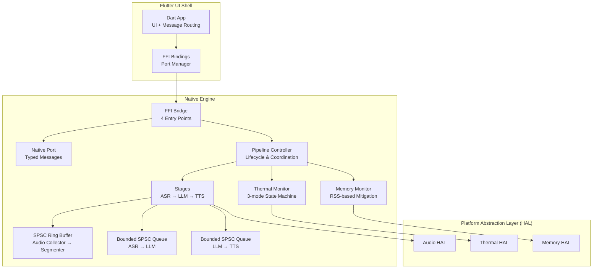
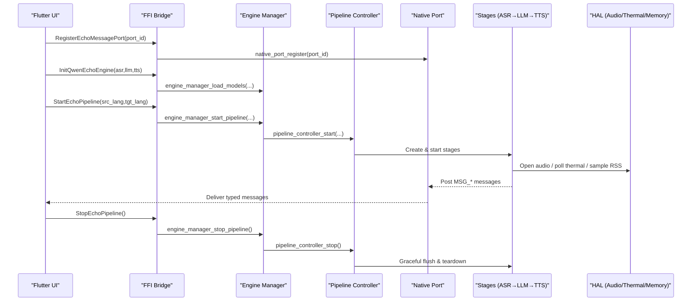
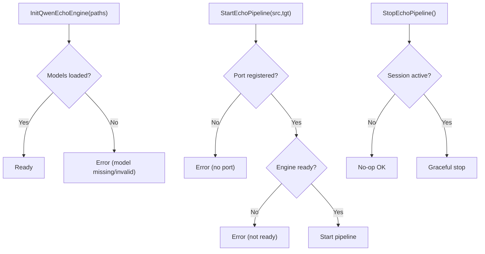
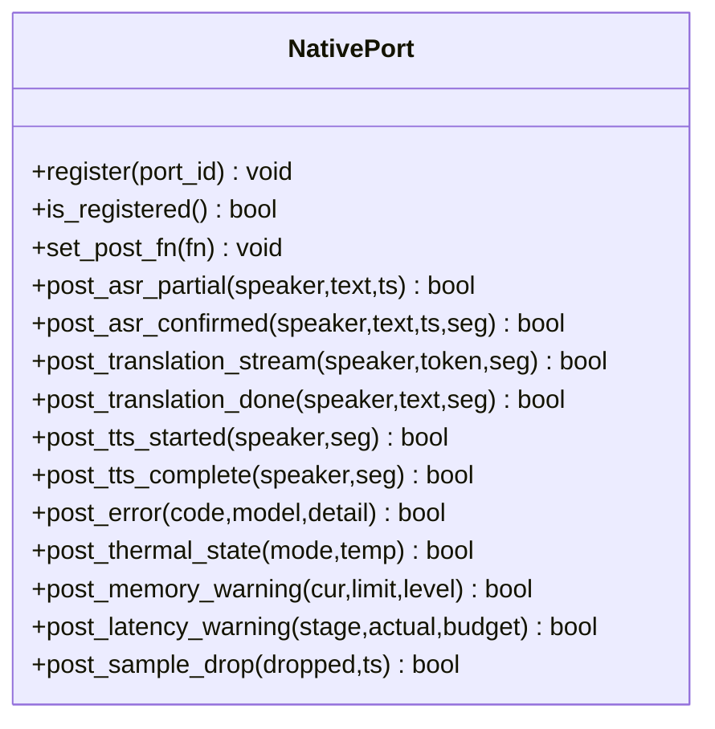
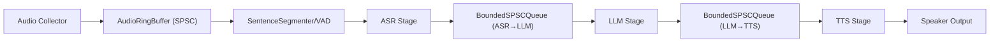
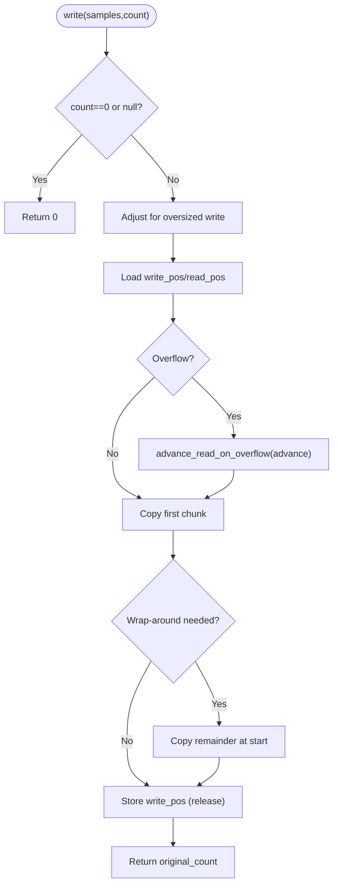
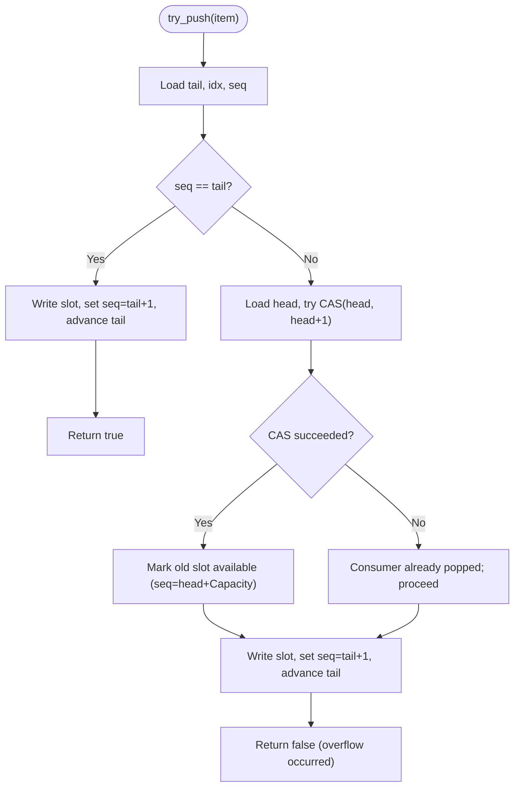
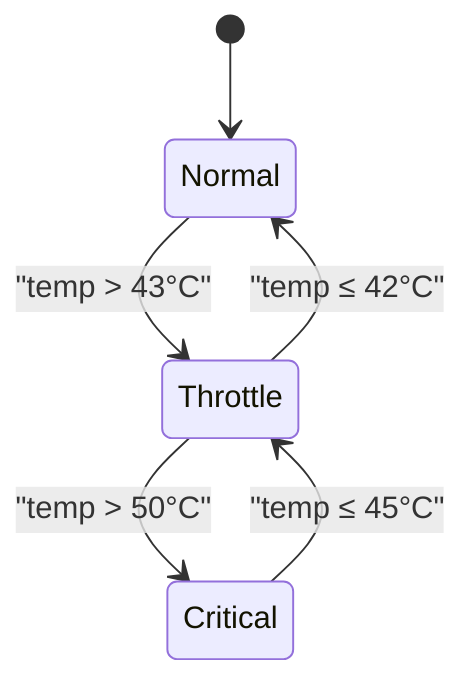
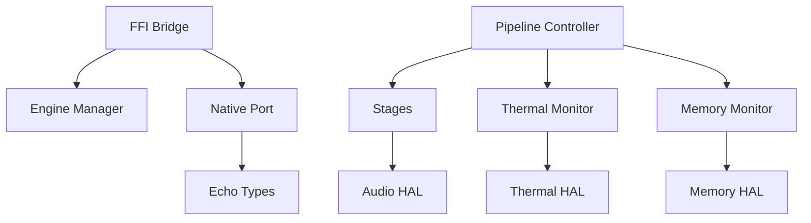

# Architecture Overview

<cite>
**Referenced Files in This Document**
- [README.md](file://README.md)
- [qwen_echo.dart](file://lib/qwen_echo.dart)
- [ffi_bridge.h](file://native/include/ffi_bridge.h)
- [ffi_bridge.cpp](file://native/src/ffi_bridge.cpp)
- [native_port.h](file://native/include/native_port.h)
- [native_port.cpp](file://native/src/native_port.cpp)
- [pipeline_controller.h](file://native/include/pipeline_controller.h)
- [echo_types.h](file://native/include/echo_types.h)
- [audio_ring_buffer.h](file://native/include/audio_ring_buffer.h)
- [bounded_spsc_queue.h](file://native/include/bounded_spsc_queue.h)
- [thermal_monitor.h](file://native/include/thermal_monitor.h)
- [memory_monitor.h](file://native/include/memory_monitor.h)
</cite>

## Table of Contents
1. [Introduction](#introduction)
2. [Project Structure](#project-structure)
3. [Core Components](#core-components)
4. [Architecture Overview](#architecture-overview)
5. [Detailed Component Analysis](#detailed-component-analysis)
6. [Dependency Analysis](#dependency-analysis)
7. [Performance Considerations](#performance-considerations)
8. [Troubleshooting Guide](#troubleshooting-guide)
9. [Conclusion](#conclusion)

## Introduction
QwenEcho is an on-device, air-gapped simultaneous interpretation app that runs three AI models offline: ASR (FunASR-Nano), LLM (Qwen3-4B-Instruct), and TTS (Qwen3-TTS-Streaming). The system uses a hybrid Flutter-native architecture where the Flutter UI shell orchestrates user interactions and displays results, while a C/C++ native engine performs real-time audio capture, segmentation, transcription, translation, and speech synthesis. Inter-process communication between Dart and native code is implemented via a minimal FFI interface and a typed Native Port message system. The pipeline employs lock-free SPSC ring buffers and bounded queues to achieve low-latency, zero-contention data flow, and includes thermal and memory monitors to maintain stability under resource constraints.

## Project Structure
The repository separates concerns into a Flutter UI shell and a C/C++ native engine with a platform abstraction layer (HAL):
- Flutter UI Shell (Dart): Exposes high-level bindings, typed messages, port management, and UI components.
- Native Engine (C/C++): Implements the audio processing pipeline, inter-stage queues, model orchestration, and cross-platform HAL.
- Platform Abstraction Layer (HAL): Encapsulates Android/iOS specifics for audio, thermal, memory, threading, and acceleration.

**Diagram sources**
- [ffi_bridge.h:1-84](file://native/include/ffi_bridge.h#L1-L84)
- [ffi_bridge.cpp:1-124](file://native/src/ffi_bridge.cpp#L1-L124)
- [native_port.h:1-179](file://native/include/native_port.h#L1-L179)
- [native_port.cpp:1-320](file://native/src/native_port.cpp#L1-L320)
- [pipeline_controller.h:1-107](file://native/include/pipeline_controller.h#L1-L107)
- [thermal_monitor.h:1-109](file://native/include/thermal_monitor.h#L1-L109)
- [memory_monitor.h:1-108](file://native/include/memory_monitor.h#L1-L108)
- [audio_ring_buffer.h:1-192](file://native/include/audio_ring_buffer.h#L1-L192)
- [bounded_spsc_queue.h:1-145](file://native/include/bounded_spsc_queue.h#L1-L145)

**Section sources**
- [README.md:15-93](file://README.md#L15-L93)
- [qwen_echo.dart:1-16](file://lib/qwen_echo.dart#L1-L16)

## Core Components
- FFI Bridge: Provides four C-linkage entry points for initialization, pipeline control, and port registration. It enforces preconditions such as port registration before starting the pipeline.
- Native Port: Serializes typed messages into Dart_CObject arrays and posts them to the registered Dart port. Includes helpers for all message types used by the pipeline and monitors.
- Pipeline Controller: Orchestrates creation, startup, and graceful shutdown of pipeline stages and resources. Validates language codes and ensures deterministic stop semantics within a time budget.
- Lock-free Data Structures: AudioRingBuffer (SPSC circular buffer with overwrite-on-overflow) and BoundedSPSCQueue (slot-based queue with drop-oldest overflow policy) provide contention-free throughput.
- Thermal Monitor: Polls hardware temperature and implements a hysteresis-driven three-mode state machine (Normal/Throttle/Critical), notifying the UI and adapting engine behavior via callbacks.
- Memory Monitor: Samples process RSS via HAL and triggers two-level mitigation (release caches at 85%, stop pipeline at 95%) with hysteresis.

**Section sources**
- [ffi_bridge.h:17-77](file://native/include/ffi_bridge.h#L17-L77)
- [ffi_bridge.cpp:54-124](file://native/src/ffi_bridge.cpp#L54-L124)
- [native_port.h:65-172](file://native/include/native_port.h#L65-L172)
- [native_port.cpp:36-320](file://native/src/native_port.cpp#L36-L320)
- [pipeline_controller.h:1-107](file://native/include/pipeline_controller.h#L1-L107)
- [audio_ring_buffer.h:10-192](file://native/include/audio_ring_buffer.h#L10-L192)
- [bounded_spsc_queue.h:8-145](file://native/include/bounded_spsc_queue.h#L8-L145)
- [thermal_monitor.h:1-109](file://native/include/thermal_monitor.h#L1-L109)
- [memory_monitor.h:1-108](file://native/include/memory_monitor.h#L1-L108)

## Architecture Overview
The system follows a layered design:
- Flutter UI Shell: Presents bilateral split view, status indicators, and manages lifecycle through FFI calls.
- FFI Boundary: Minimal surface area (four functions) reduces integration complexity and risk.
- Native Engine: Contains the full audio processing pipeline with stage isolation and lock-free buffering.
- HAL: Abstracts platform-specific audio capture/output, thermal polling, memory sampling, and threading primitives.

**Diagram sources**
- [ffi_bridge.h:17-77](file://native/include/ffi_bridge.h#L17-L77)
- [ffi_bridge.cpp:54-124](file://native/src/ffi_bridge.cpp#L54-L124)
- [native_port.h:65-172](file://native/include/native_port.h#L65-L172)
- [native_port.cpp:36-320](file://native/src/native_port.cpp#L36-L320)
- [pipeline_controller.h:46-100](file://native/include/pipeline_controller.h#L46-L100)

## Detailed Component Analysis

### FFI Interface Pattern (Four Functions)
The FFI boundary exposes exactly four entry points:
- Initialization with model paths
- Starting the pipeline with language pair
- Stopping the pipeline gracefully
- Registering the Dart Native Port for async messaging

Preconditions are enforced at the bridge layer (e.g., port must be registered before start/stop). All return standardized error codes.

**Diagram sources**
- [ffi_bridge.h:17-77](file://native/include/ffi_bridge.h#L17-L77)
- [ffi_bridge.cpp:54-124](file://native/src/ffi_bridge.cpp#L54-L124)
- [echo_types.h:48-62](file://native/include/echo_types.h#L48-L62)

**Section sources**
- [ffi_bridge.h:17-77](file://native/include/ffi_bridge.h#L17-L77)
- [ffi_bridge.cpp:54-124](file://native/src/ffi_bridge.cpp#L54-L124)
- [echo_types.h:48-62](file://native/include/echo_types.h#L48-L62)

### Dart Port Message System
The Native Port module serializes structured messages into Dart_CObject arrays and posts them to the registered Dart port. Each typed function corresponds to a specific event in the pipeline or monitoring subsystem.

**Diagram sources**
- [native_port.h:65-172](file://native/include/native_port.h#L65-L172)
- [native_port.cpp:36-320](file://native/src/native_port.cpp#L36-L320)

**Section sources**
- [native_port.h:1-179](file://native/include/native_port.h#L1-L179)
- [native_port.cpp:1-320](file://native/src/native_port.cpp#L1-L320)

### Audio Processing Pipeline and Lock-free Buffers
The pipeline consists of:
- Audio Collector → AudioRingBuffer (SPSC) → SentenceSegmenter/VAD
- ASR Stage → BoundedSPSCQueue → LLM Stage → BoundedSPSCQueue → TTS Stage
- Monitors (Thermal, Memory) run concurrently and influence behavior via callbacks and messages.

**Diagram sources**
- [pipeline_controller.h:1-107](file://native/include/pipeline_controller.h#L1-L107)
- [audio_ring_buffer.h:10-192](file://native/include/audio_ring_buffer.h#L10-L192)
- [bounded_spsc_queue.h:8-145](file://native/include/bounded_spsc_queue.h#L8-L145)

#### AudioRingBuffer (Lock-free SPSC)
Key characteristics:
- Power-of-two capacity with bitmask indexing for efficient modulo operations.
- Atomic head/tail positions with acquire/release ordering; cache-line alignment prevents false sharing.
- Overflow policy: overwrite oldest samples by advancing read pointer; producer never blocks.

**Diagram sources**
- [audio_ring_buffer.h:34-91](file://native/include/audio_ring_buffer.h#L34-L91)
- [audio_ring_buffer.h:101-132](file://native/include/audio_ring_buffer.h#L101-L132)
- [audio_ring_buffer.h:152-155](file://native/include/audio_ring_buffer.h#L152-L155)

**Section sources**
- [audio_ring_buffer.h:10-192](file://native/include/audio_ring_buffer.h#L10-L192)

#### BoundedSPSCQueue (Drop-oldest Overflow)
Key characteristics:
- Slot-based with sequence numbers for occupancy tracking.
- On overflow, advances head via CAS to discard oldest element, then pushes new item without blocking.
- Cache-line aligned head/tail to avoid false sharing.

**Diagram sources**
- [bounded_spsc_queue.h:51-85](file://native/include/bounded_spsc_queue.h#L51-L85)
- [bounded_spsc_queue.h:93-116](file://native/include/bounded_spsc_queue.h#L93-L116)

**Section sources**
- [bounded_spsc_queue.h:8-145](file://native/include/bounded_spsc_queue.h#L8-L145)

### Three-mode Thermal State Machine
The thermal monitor implements a hysteresis-driven state machine:
- Normal → Throttle when temp > 43°C
- Throttle → Normal when temp ≤ 42°C
- Throttle → Critical when temp > 50°C
- Critical → Throttle when temp ≤ 45°C

On transitions, it posts MSG_THERMAL_STATE and invokes a callback for engine adaptation.

**Diagram sources**
- [thermal_monitor.h:6-17](file://native/include/thermal_monitor.h#L6-L17)
- [thermal_monitor.h:29-41](file://native/include/thermal_monitor.h#L29-L41)

**Section sources**
- [thermal_monitor.h:1-109](file://native/include/thermal_monitor.h#L1-L109)

### Platform Abstraction Layer (HAL)
HAL isolates platform-specific implementations:
- Audio HAL: Captures and outputs PCM across Android (AAudio) and iOS (AVAudioEngine).
- Thermal HAL: Polls device temperature via platform APIs.
- Memory HAL: Samples process RSS for pressure detection.
- Threading HAL: Provides RT priority and thread primitives.

This separation enables cross-platform compatibility and simplifies testing and maintenance.

**Section sources**
- [README.md:81-89](file://README.md#L81-L89)

## Dependency Analysis
High-level dependencies among core modules:
- FFI Bridge depends on Engine Manager and Native Port.
- Native Port depends on Echo Types for message tags and error codes.
- Pipeline Controller coordinates stages and monitors.
- Monitors depend on HAL for telemetry and act via callbacks/messages.

**Diagram sources**
- [ffi_bridge.cpp:1-124](file://native/src/ffi_bridge.cpp#L1-L124)
- [native_port.cpp:1-320](file://native/src/native_port.cpp#L1-L320)
- [pipeline_controller.h:1-107](file://native/include/pipeline_controller.h#L1-L107)
- [thermal_monitor.h:1-109](file://native/include/thermal_monitor.h#L1-L109)
- [memory_monitor.h:1-108](file://native/include/memory_monitor.h#L1-L108)

**Section sources**
- [ffi_bridge.cpp:1-124](file://native/src/ffi_bridge.cpp#L1-L124)
- [native_port.cpp:1-320](file://native/src/native_port.cpp#L1-L320)
- [pipeline_controller.h:1-107](file://native/include/pipeline_controller.h#L1-L107)

## Performance Considerations
- Lock-free SPSC ring buffer eliminates contention between audio collector and consumer threads, using power-of-two sizing and bitwise masking for fast index calculations.
- Bounded SPSC queues with drop-oldest semantics ensure backpressure without blocking producers, maintaining steady throughput even under load spikes.
- Cascade truncation strategy allows downstream stages to begin processing before upstream completes, reducing end-to-end latency.
- Thermal and memory monitors adapt pipeline behavior (context size, sample rate, pipeline pause/resume) to meet performance targets under varying conditions.
- End-to-end latency budgets are defined per stage and overall, with throttling modes relaxing context and sample rates to preserve responsiveness.

[No sources needed since this section provides general guidance]

## Troubleshooting Guide
Common issues and diagnostics:
- Missing or invalid model paths during initialization result in specific error codes returned by the FFI bridge.
- Starting the pipeline without registering a Native Port yields an explicit error; ensure port registration precedes start.
- Unsupported language pairs are rejected early by the pipeline controller’s validation logic.
- Thermal transitions trigger UI updates and may reduce performance parameters; verify thresholds and hysteresis behavior.
- Memory warnings indicate pressure levels; Level 1 releases caches, Level 2 stops the pipeline to prevent crashes.

**Section sources**
- [ffi_bridge.h:17-77](file://native/include/ffi_bridge.h#L17-L77)
- [ffi_bridge.cpp:54-124](file://native/src/ffi_bridge.cpp#L54-L124)
- [pipeline_controller.h:16-21](file://native/include/pipeline_controller.h#L16-L21)
- [thermal_monitor.h:6-17](file://native/include/thermal_monitor.h#L6-L17)
- [memory_monitor.h:5-11](file://native/include/memory_monitor.h#L5-L11)

## Conclusion
QwenEcho’s hybrid Flutter-native architecture achieves real-time bilateral translation by combining a minimal FFI boundary, a robust Native Port message system, and a lock-free audio processing pipeline. The three-mode thermal state machine and two-level memory mitigation ensure stable operation under resource constraints, while the HAL abstracts platform differences for broad compatibility. These architectural decisions collectively enable low-latency, reliable, and offline-first interpretation on mobile devices.