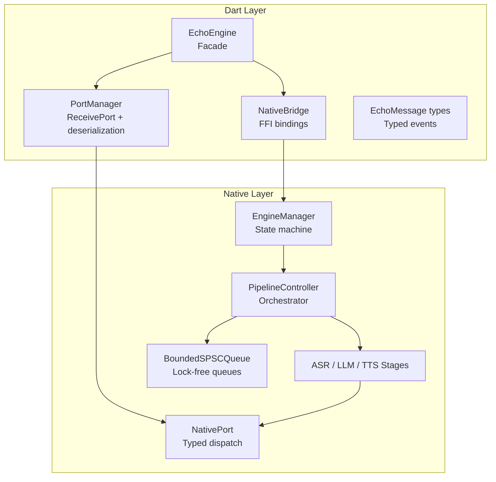
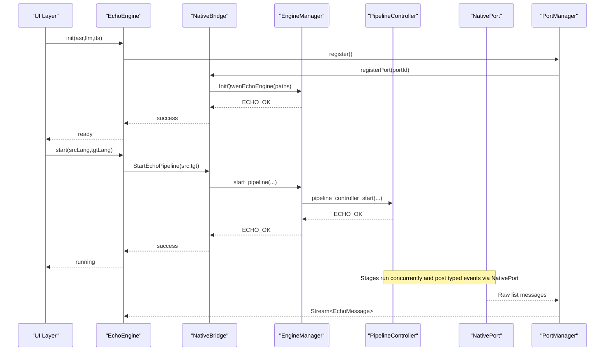
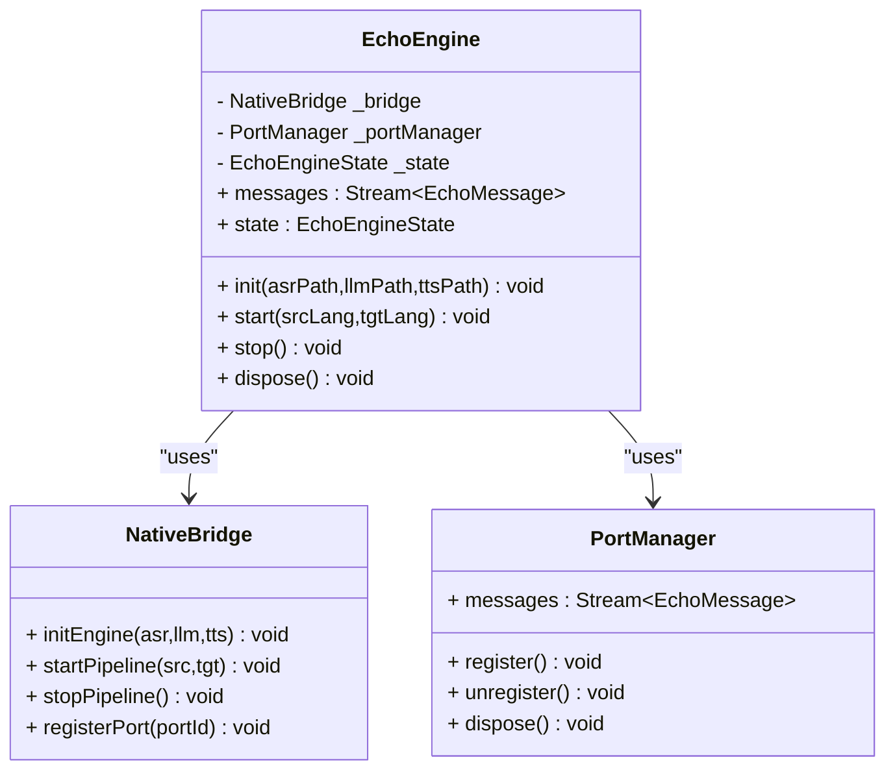
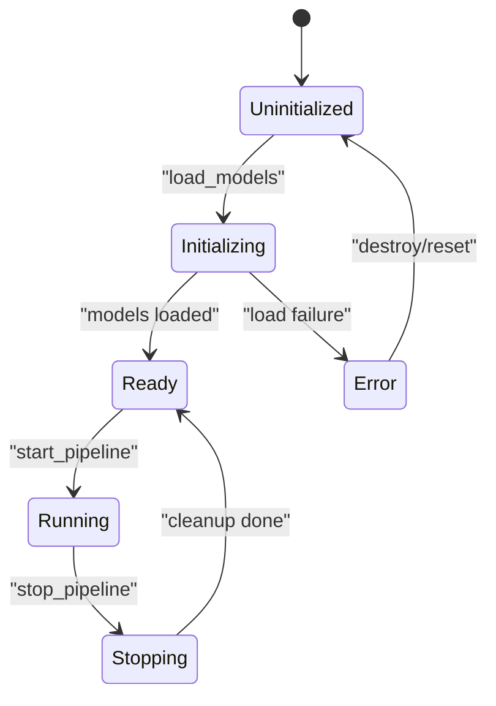
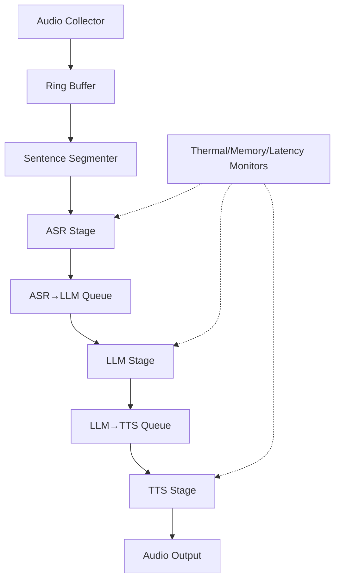
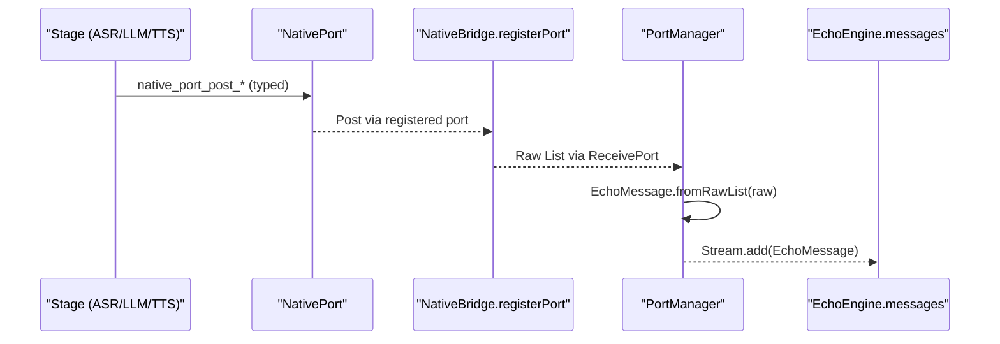
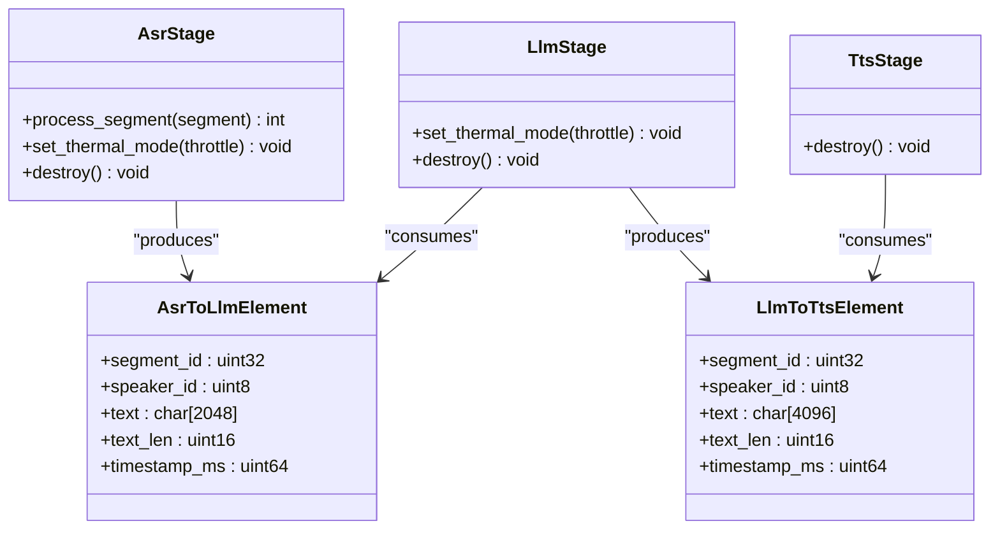
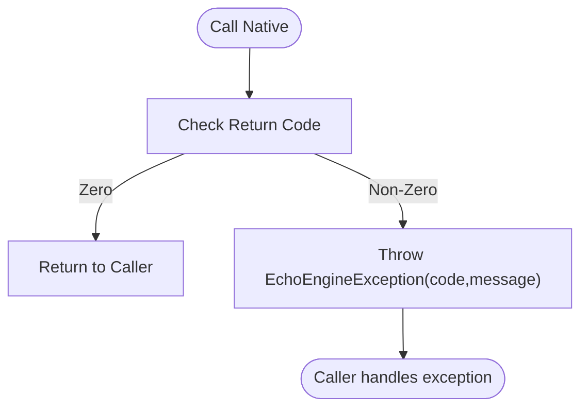
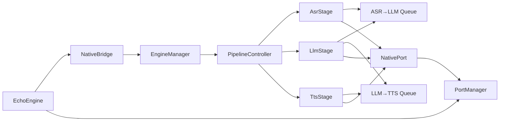

# Component Architecture

<cite>
**Referenced Files in This Document**
- [qwen_echo.dart](file://lib/qwen_echo.dart)
- [echo_engine.dart](file://lib/src/echo_engine.dart)
- [native_bridge.dart](file://lib/src/native_bridge.dart)
- [port_manager.dart](file://lib/src/port_manager.dart)
- [messages.dart](file://lib/src/messages.dart)
- [engine_manager.h](file://native/include/engine_manager.h)
- [pipeline_controller.h](file://native/include/pipeline_controller.h)
- [native_port.h](file://native/include/native_port.h)
- [echo_types.h](file://native/include/echo_types.h)
- [bounded_spsc_queue.h](file://native/include/bounded_spsc_queue.h)
- [asr_stage.h](file://native/include/asr_stage.h)
- [llm_stage.h](file://native/include/llm_stage.h)
- [tts_stage.h](file://native/include/tts_stage.h)
- [engine_manager.cpp](file://native/src/engine_manager.cpp)
- [pipeline_controller.cpp](file://native/src/pipeline_controller.cpp)
</cite>

## Table of Contents
1. Introduction
2. Project Structure
3. Core Components
4. Architecture Overview
5. Detailed Component Analysis
6. Dependency Analysis
7. Performance Considerations
8. Troubleshooting Guide
9. Conclusion

## Introduction
This document explains QwenEcho’s component architecture with a focus on modular design and inter-component relationships across the Flutter shell and native C/C++ engine. It details:
- The EchoEngine facade that unifies NativeBridge and PortManager responsibilities for lifecycle and messaging.
- The EngineManager state machine governing initialization, session lifecycle, and resource cleanup.
- The PipelineController orchestration of audio processing stages using lock-free queues.
- The NativePort system for asynchronous message delivery and the typed event system via the EchoMessage hierarchy.
- Concrete examples of instantiation, dependency injection patterns, error propagation strategies, isolation, testing, and extension points.

## Project Structure
QwenEcho is organized into a Dart layer (Flutter UI shell) and a native C/C++ layer (audio pipeline and model inference). The Dart side exposes a simple facade to the UI while delegating FFI calls and port management. The native side implements a stateful engine manager and a pipeline controller that wires together audio capture, segmentation, ASR, LLM translation, TTS synthesis, and monitoring.

**Diagram sources**
- [echo_engine.dart:37-107](file://lib/src/echo_engine.dart#L37-L107)
- [native_bridge.dart:103-229](file://lib/src/native_bridge.dart#L103-L229)
- [port_manager.dart:18-84](file://lib/src/port_manager.dart#L18-L84)
- [messages.dart:8-336](file://lib/src/messages.dart#L8-L336)
- [engine_manager.h:30-98](file://native/include/engine_manager.h#L30-L98)
- [pipeline_controller.h:36-100](file://native/include/pipeline_controller.h#L36-L100)
- [native_port.h:77-172](file://native/include/native_port.h#L77-L172)
- [bounded_spsc_queue.h:29-142](file://native/include/bounded_spsc_queue.h#L29-L142)
- [asr_stage.h:52-97](file://native/include/asr_stage.h#L52-L97)
- [llm_stage.h:60-86](file://native/include/llm_stage.h#L60-L86)
- [tts_stage.h:58-72](file://native/include/tts_stage.h#L58-L72)

**Section sources**
- [qwen_echo.dart:1-16](file://lib/qwen_echo.dart#L1-L16)
- [echo_engine.dart:37-107](file://lib/src/echo_engine.dart#L37-L107)
- [native_bridge.dart:103-229](file://lib/src/native_bridge.dart#L103-L229)
- [port_manager.dart:18-84](file://lib/src/port_manager.dart#L18-L84)
- [messages.dart:8-336](file://lib/src/messages.dart#L8-L336)
- [engine_manager.h:30-98](file://native/include/engine_manager.h#L30-L98)
- [pipeline_controller.h:36-100](file://native/include/pipeline_controller.h#L36-L100)
- [native_port.h:77-172](file://native/include/native_port.h#L77-L172)
- [bounded_spsc_queue.h:29-142](file://native/include/bounded_spsc_queue.h#L29-L142)
- [asr_stage.h:52-97](file://native/include/asr_stage.h#L52-L97)
- [llm_stage.h:60-86](file://native/include/llm_stage.h#L60-L86)
- [tts_stage.h:58-72](file://native/include/tts_stage.h#L58-L72)

## Core Components
- EchoEngine (facade): Combines NativeBridge and PortManager to provide a simple init/start/stop API and a typed message stream.
- NativeBridge: Loads platform-specific shared libraries and wraps four C-linkage entry points with type-safe Dart methods and error conversion.
- PortManager: Registers a Dart ReceivePort with the engine, listens for raw lists, and deserializes them into typed EchoMessage objects.
- EngineManager: Manages engine lifecycle states and delegates model loading and pipeline control.
- PipelineController: Orchestrates all pipeline components, manages resources, and enforces graceful stop semantics.
- NativePort: Provides typed functions to post structured messages from native code to the Dart UI.
- BoundedSPSCQueue: Lock-free bounded queue with overflow-drop semantics used between stages.
- Stages (ASR/LLM/TTS): Each runs on its own thread, consuming input queues and producing output or events.

Key responsibilities and interactions are detailed in subsequent sections.

**Section sources**
- [echo_engine.dart:37-107](file://lib/src/echo_engine.dart#L37-L107)
- [native_bridge.dart:103-229](file://lib/src/native_bridge.dart#L103-L229)
- [port_manager.dart:18-84](file://lib/src/port_manager.dart#L18-L84)
- [engine_manager.h:30-98](file://native/include/engine_manager.h#L30-L98)
- [pipeline_controller.h:36-100](file://native/include/pipeline_controller.h#L36-L100)
- [native_port.h:77-172](file://native/include/native_port.h#L77-L172)
- [bounded_spsc_queue.h:29-142](file://native/include/bounded_spsc_queue.h#L29-L142)
- [asr_stage.h:52-97](file://native/include/asr_stage.h#L52-L97)
- [llm_stage.h:60-86](file://native/include/llm_stage.h#L60-L86)
- [tts_stage.h:58-72](file://native/include/tts_stage.h#L58-L72)

## Architecture Overview
The system follows a layered architecture:
- Dart Facade (EchoEngine) hides complexity and coordinates FFI and messaging.
- Native Bridge abstracts dynamic library loading and function lookup.
- Engine Manager encapsulates state transitions and resource ownership.
- Pipeline Controller composes stages and data channels.
- Native Port bridges async events back to Dart.

**Diagram sources**
- [echo_engine.dart:66-98](file://lib/src/echo_engine.dart#L66-L98)
- [native_bridge.dart:138-185](file://lib/src/native_bridge.dart#L138-L185)
- [engine_manager.h:53-81](file://native/include/engine_manager.h#L53-L81)
- [pipeline_controller.h:63-82](file://native/include/pipeline_controller.h#L63-L82)
- [native_port.h:103-172](file://native/include/native_port.h#L103-L172)
- [port_manager.dart:42-50](file://lib/src/port_manager.dart#L42-L50)

## Detailed Component Analysis

### EchoEngine Facade Pattern
EchoEngine combines NativeBridge and PortManager into a single facade:
- Lifecycle: uninitialized → ready → running.
- Responsibilities:
  - Register the Native Port before initializing the engine so status messages can be delivered.
  - Delegate init/start/stop to NativeBridge.
  - Expose a broadcast Stream of typed EchoMessage for consumers.
- Error propagation:
  - Throws EchoEngineException when native calls return non-zero codes.
- Dependency injection:
  - Accepts a custom NativeBridge for testing via constructor.

**Diagram sources**
- [echo_engine.dart:37-107](file://lib/src/echo_engine.dart#L37-L107)
- [native_bridge.dart:103-185](file://lib/src/native_bridge.dart#L103-L185)
- [port_manager.dart:18-84](file://lib/src/port_manager.dart#L18-L84)

**Section sources**
- [echo_engine.dart:37-107](file://lib/src/echo_engine.dart#L37-L107)
- [native_bridge.dart:103-185](file://lib/src/native_bridge.dart#L103-L185)
- [port_manager.dart:18-84](file://lib/src/port_manager.dart#L18-L84)

### EngineManager State Machine
EngineManager implements a strict state machine:
- States: Uninitialized → Initializing → Ready → Running → Stopping → Ready; error transitions allowed.
- Guards:
  - load_models only in Uninitialized.
  - start_pipeline only in Ready and no active session.
  - stop_pipeline is a no-op if no session.
- Resource ownership:
  - Owns ModelLoader and PipelineController lifetimes.
- Concurrency:
  - Uses a mutex to serialize state transitions.

**Diagram sources**
- [engine_manager.h:6-16](file://native/include/engine_manager.h#L6-L16)
- [engine_manager.cpp:44-168](file://native/src/engine_manager.cpp#L44-L168)

**Section sources**
- [engine_manager.h:30-98](file://native/include/engine_manager.h#L30-L98)
- [engine_manager.cpp:29-200](file://native/src/engine_manager.cpp#L29-L200)

### PipelineController Orchestration and Lock-Free Queues
PipelineController orchestrates:
- AudioRingBuffer, SentenceSegmenter, ASR, LLM, TTS, ThermalMonitor, MemoryMonitor, LatencyTracker.
- Cascade truncation: downstream stages begin before upstream completes, enabling overlapped execution.
- Graceful stop within a deadline, flushing locked segments and discarding unlocked audio.
- Language validation against supported ISO 639-1 codes.

Data flow uses BoundedSPSCQueue between stages:
- ASR→LLM queue carries confirmed text elements.
- LLM→TTS queue carries translated text elements.
- Overflow behavior drops oldest items to avoid blocking producers.

**Diagram sources**
- [pipeline_controller.h:3-21](file://native/include/pipeline_controller.h#L3-L21)
- [pipeline_controller.cpp:105-126](file://native/src/pipeline_controller.cpp#L105-L126)
- [bounded_spsc_queue.h:9-28](file://native/include/bounded_spsc_queue.h#L9-L28)

**Section sources**
- [pipeline_controller.h:36-100](file://native/include/pipeline_controller.h#L36-L100)
- [pipeline_controller.cpp:105-200](file://native/src/pipeline_controller.cpp#L105-L200)
- [bounded_spsc_queue.h:29-142](file://native/include/bounded_spsc_queue.h#L29-L142)

### NativePort System and Typed Event System
NativePort provides typed functions to post structured messages to Dart:
- Message types include ASR partial/confirmed, translation streaming/done, TTS started/completed, errors, thermal state, memory warnings, latency warnings, sample drops.
- Messages are serialized as Dart_CObject arrays and posted through a registered Dart SendPort.

On the Dart side, PortManager registers a ReceivePort and deserializes incoming lists into typed EchoMessage subclasses via a central factory.

**Diagram sources**
- [native_port.h:103-172](file://native/include/native_port.h#L103-L172)
- [messages.dart:14-33](file://lib/src/messages.dart#L14-L33)
- [port_manager.dart:76-83](file://lib/src/port_manager.dart#L76-L83)

**Section sources**
- [native_port.h:77-172](file://native/include/native_port.h#L77-L172)
- [messages.dart:8-336](file://lib/src/messages.dart#L8-L336)
- [port_manager.dart:18-84](file://lib/src/port_manager.dart#L18-L84)

### Stage Interfaces and Data Contracts
Stages expose minimal public APIs and communicate via typed structures:
- ASR stage processes LockedSegment, streams partial tokens, enqueues confirmed text.
- LLM stage consumes AsrToLlmElement, emits LlmToTtsElement at punctuation boundaries.
- TTS stage consumes LlmToTtsElement and outputs PCM chunks.

**Diagram sources**
- [asr_stage.h:52-97](file://native/include/asr_stage.h#L52-L97)
- [llm_stage.h:60-86](file://native/include/llm_stage.h#L60-L86)
- [tts_stage.h:58-72](file://native/include/tts_stage.h#L58-L72)
- [echo_types.h:68-86](file://native/include/echo_types.h#L68-L86)

**Section sources**
- [asr_stage.h:52-97](file://native/include/asr_stage.h#L52-L97)
- [llm_stage.h:60-86](file://native/include/llm_stage.h#L60-L86)
- [tts_stage.h:58-72](file://native/include/tts_stage.h#L58-L72)
- [echo_types.h:68-86](file://native/include/echo_types.h#L68-L86)

### Error Propagation Strategies
- Dart side:
  - NativeBridge converts non-zero native returns into EchoEngineException with human-readable descriptions.
  - EchoEngine propagates exceptions up to callers.
- Native side:
  - EngineManager guards state transitions and returns specific EchoErrorCode values.
  - PipelineController validates inputs (e.g., language codes) and returns appropriate errors.
  - Stages report SLA violations and errors via NativePort messages rather than throwing.

**Diagram sources**
- [native_bridge.dart:224-228](file://lib/src/native_bridge.dart#L224-L228)
- [engine_manager.cpp:44-168](file://native/src/engine_manager.cpp#L44-L168)

**Section sources**
- [native_bridge.dart:43-93](file://lib/src/native_bridge.dart#L43-L93)
- [native_bridge.dart:224-228](file://lib/src/native_bridge.dart#L224-L228)
- [engine_manager.cpp:44-168](file://native/src/engine_manager.cpp#L44-L168)

### Instantiation and Dependency Injection Examples
- Dart:
  - Default: EchoEngine() constructs NativeBridge and PortManager internally.
  - Testable: EchoEngine.withBridge(customBridge) allows injecting a mock bridge.
- Native:
  - EngineManager created via engine_manager_create(), then models loaded and pipeline started/stopped via explicit calls.
  - PipelineController created by EngineManager and destroyed during engine teardown.

Concrete usage paths:
- [echo_engine.dart:51-58](file://lib/src/echo_engine.dart#L51-L58)
- [engine_manager.cpp:29-42](file://native/src/engine_manager.cpp#L29-L42)

**Section sources**
- [echo_engine.dart:51-58](file://lib/src/echo_engine.dart#L51-L58)
- [engine_manager.cpp:29-42](file://native/src/engine_manager.cpp#L29-L42)

### Component Isolation and Testing Strategies
- Dart isolation:
  - EchoEngine isolates FFI and port concerns behind a facade.
  - PortManager encapsulates ReceivePort lifecycle and message parsing.
  - Use EchoEngine.withBridge(mockBridge) to test without native dependencies.
- Native isolation:
  - EngineManager owns resources and serializes state changes under a mutex.
  - PipelineController encapsulates stage wiring and shutdown logic.
  - Stages are independent worker threads communicating via lock-free queues.
- Testing tips:
  - Mock NativeBridge.registerPort and other FFI calls.
  - Validate state transitions by asserting EngineManager state after operations.
  - Verify graceful stop timing and queue drain behavior in integration tests.

**Section sources**
- [echo_engine.dart:55-58](file://lib/src/echo_engine.dart#L55-L58)
- [port_manager.dart:42-50](file://lib/src/port_manager.dart#L42-L50)
- [engine_manager.cpp:48-53](file://native/src/engine_manager.cpp#L48-L53)
- [pipeline_controller.cpp:182-200](file://native/src/pipeline_controller.cpp#L182-L200)

### Extension Points
- Adding new processing stages:
  - Implement a new stage header and implementation following existing stage contracts.
  - Wire it into PipelineController’s create/destroy flows and connect via BoundedSPSCQueue.
  - Add corresponding NativePort posting functions and Dart message types if needed.
- Platform implementations:
  - HAL accelerators and audio I/O are abstracted; extend hal/ directories for new platforms.
  - Update NativeBridge library loading for additional targets if necessary.

**Section sources**
- [pipeline_controller.cpp:182-200](file://native/src/pipeline_controller.cpp#L182-L200)
- [native_port.h:103-172](file://native/include/native_port.h#L103-L172)
- [messages.dart:14-33](file://lib/src/messages.dart#L14-L33)

## Dependency Analysis
High-level dependencies among core components:

**Diagram sources**
- [echo_engine.dart:37-107](file://lib/src/echo_engine.dart#L37-L107)
- [native_bridge.dart:103-185](file://lib/src/native_bridge.dart#L103-L185)
- [engine_manager.h:30-98](file://native/include/engine_manager.h#L30-L98)
- [pipeline_controller.h:36-100](file://native/include/pipeline_controller.h#L36-L100)
- [asr_stage.h:52-97](file://native/include/asr_stage.h#L52-L97)
- [llm_stage.h:60-86](file://native/include/llm_stage.h#L60-L86)
- [tts_stage.h:58-72](file://native/include/tts_stage.h#L58-L72)
- [native_port.h:103-172](file://native/include/native_port.h#L103-L172)
- [bounded_spsc_queue.h:29-142](file://native/include/bounded_spsc_queue.h#L29-L142)

**Section sources**
- [echo_engine.dart:37-107](file://lib/src/echo_engine.dart#L37-L107)
- [native_bridge.dart:103-185](file://lib/src/native_bridge.dart#L103-L185)
- [engine_manager.h:30-98](file://native/include/engine_manager.h#L30-L98)
- [pipeline_controller.h:36-100](file://native/include/pipeline_controller.h#L36-L100)
- [asr_stage.h:52-97](file://native/include/asr_stage.h#L52-L97)
- [llm_stage.h:60-86](file://native/include/llm_stage.h#L60-L86)
- [tts_stage.h:58-72](file://native/include/tts_stage.h#L58-L72)
- [native_port.h:103-172](file://native/include/native_port.h#L103-L172)
- [bounded_spsc_queue.h:29-142](file://native/include/bounded_spsc_queue.h#L29-L142)

## Performance Considerations
- Lock-free queues:
  - BoundedSPSCQueue avoids contention and guarantees non-blocking push/pop with overflow-drop semantics.
- Overlapped execution:
  - Cascade truncation ensures low-latency streaming across ASR→LLM→TTS.
- SLA monitoring:
  - LatencyTracker reports violations per stage and overall budget.
- Thermal and memory adaptation:
  - Thermal mode affects ASR sampling rate and LLM context window size.
  - Memory pressure can trigger graceful pipeline stop to protect stability.

[No sources needed since this section provides general guidance]

## Troubleshooting Guide
Common issues and diagnostics:
- Initialization failures:
  - Check model paths and permissions; EngineManager returns specific error codes for missing/invalid models.
- Unsupported languages:
  - PipelineController validates ISO 639-1 codes; unsupported pairs yield an error.
- No messages received:
  - Ensure PortManager.register() is called before engine init and that the port remains open.
- High latency or dropped samples:
  - Inspect MSG_LATENCY_WARNING and MSG_SAMPLE_DROP messages; consider thermal throttling effects.
- Memory pressure:
  - Monitor MSG_MEMORY_WARNING; critical levels may cause automatic pipeline stop.

Actionable checks:
- Validate EchoEngine state transitions and ensure stop is called before dispose.
- Confirm NativeBridge loads the correct platform library.
- Review NativePort registration and message payload formats.

**Section sources**
- [engine_manager.cpp:44-100](file://native/src/engine_manager.cpp#L44-L100)
- [pipeline_controller.cpp:60-89](file://native/src/pipeline_controller.cpp#L60-L89)
- [port_manager.dart:42-50](file://lib/src/port_manager.dart#L42-L50)
- [messages.dart:289-336](file://lib/src/messages.dart#L289-L336)

## Conclusion
QwenEcho’s architecture cleanly separates concerns:
- EchoEngine provides a simple, testable facade.
- EngineManager enforces robust lifecycle and resource management.
- PipelineController orchestrates concurrent stages with lock-free queues for low-latency streaming.
- NativePort and EchoMessage deliver typed, asynchronous events to Dart.
This design supports extensibility, clear error propagation, and strong isolation, making it suitable for production-grade real-time interpretation on mobile devices.

[No sources needed since this section summarizes without analyzing specific files]