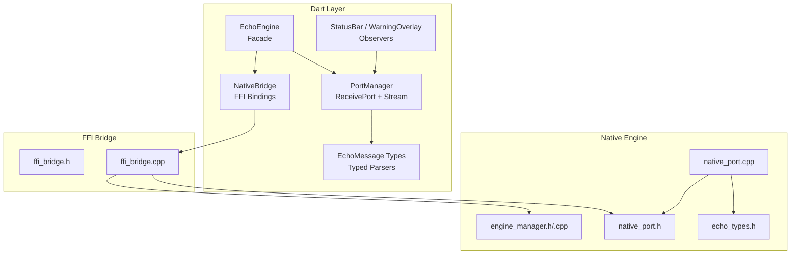
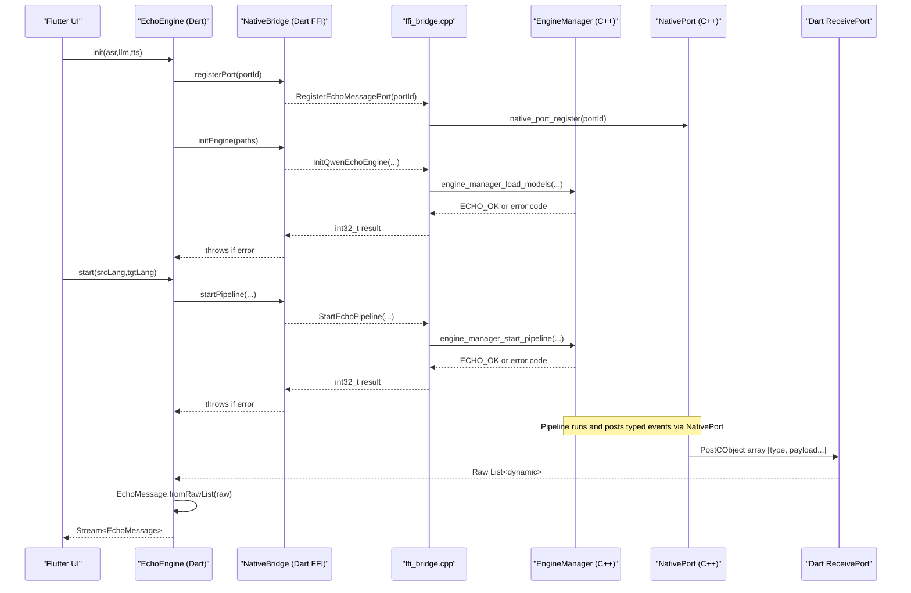
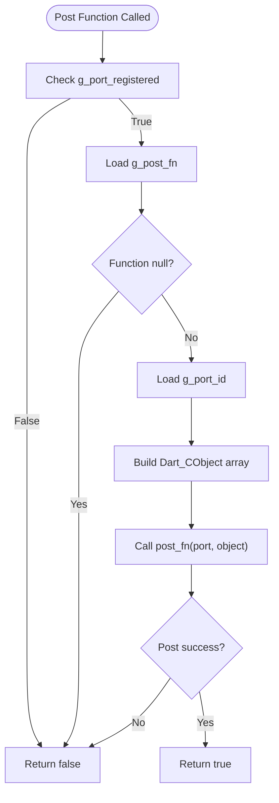
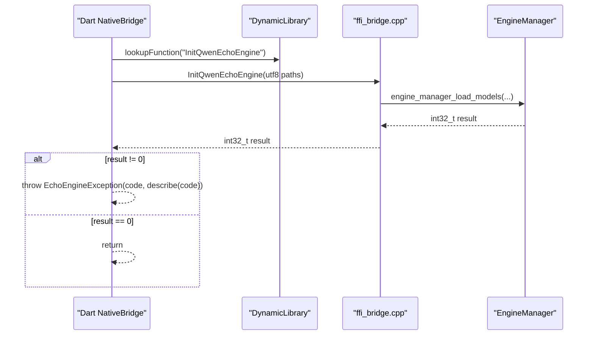
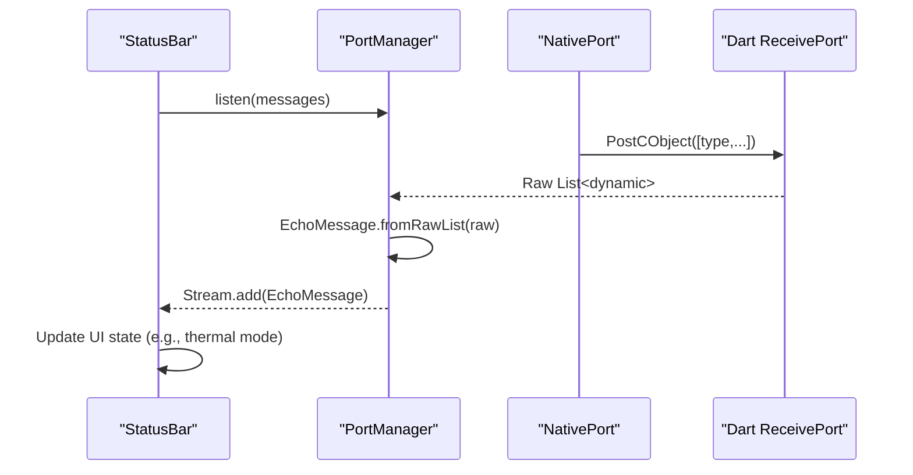
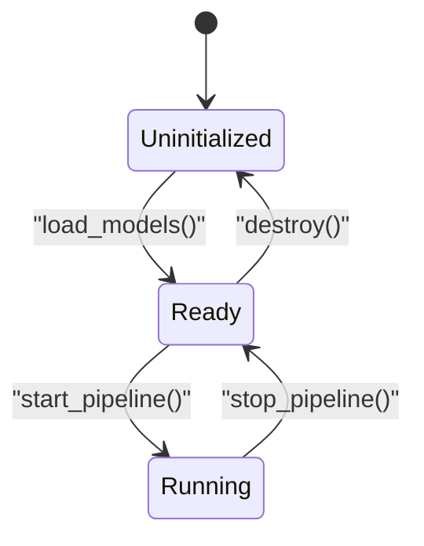
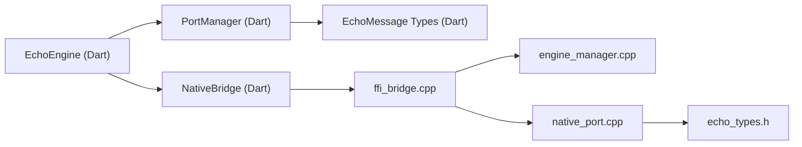

# Component Communication Patterns

<cite>
**Referenced Files in This Document**
- [echo_types.h](file://native/include/echo_types.h)
- [ffi_bridge.h](file://native/include/ffi_bridge.h)
- [ffi_bridge.cpp](file://native/src/ffi_bridge.cpp)
- [native_port.h](file://native/include/native_port.h)
- [native_port.cpp](file://native/src/native_port.cpp)
- [engine_manager.h](file://native/include/engine_manager.h)
- [engine_manager.cpp](file://native/src/engine_manager.cpp)
- [qwen_echo.dart](file://lib/qwen_echo.dart)
- [messages.dart](file://lib/src/messages.dart)
- [native_bridge.dart](file://lib/src/native_bridge.dart)
- [port_manager.dart](file://lib/src/port_manager.dart)
- [echo_engine.dart](file://lib/src/echo_engine.dart)
- [status_bar.dart](file://lib/src/ui/status_bar.dart)
</cite>

## Table of Contents
1. Introduction
2. Project Structure
3. Core Components
4. Architecture Overview
5. Detailed Component Analysis
6. Dependency Analysis
7. Performance Considerations
8. Troubleshooting Guide
9. Conclusion

## Introduction
This document explains QwenEcho’s component communication patterns with a focus on the typed event system and inter-process messaging protocols between Flutter UI and native engine components. It details:
- The EchoMessage hierarchy design for type-safe Dart-side message handling
- The FFI bridge implementation, including function marshaling, error code translation, and data serialization
- The observer pattern for real-time status updates and progress reporting
- Concrete examples of message types, event subscription patterns, and callback mechanisms
- Performance considerations for high-frequency messaging and memory management across language boundaries

## Project Structure
QwenEcho is organized into three primary layers:
- Dart layer (Flutter UI Shell): exposes a typed API, manages ports, and renders UI based on messages
- FFI bridge layer: thin C-linkage entry points that marshal calls to the native engine and manage port registration
- Native engine layer: orchestrates lifecycle, pipeline execution, and posts typed events via Native Port

**Diagram sources**
- [echo_engine.dart:1-108](file://lib/src/echo_engine.dart#L1-L108)
- [native_bridge.dart:1-230](file://lib/src/native_bridge.dart#L1-L230)
- [port_manager.dart:1-85](file://lib/src/port_manager.dart#L1-L85)
- [messages.dart:1-336](file://lib/src/messages.dart#L1-L336)
- [ffi_bridge.h:1-84](file://native/include/ffi_bridge.h#L1-L84)
- [ffi_bridge.cpp:1-124](file://native/src/ffi_bridge.cpp#L1-L124)
- [engine_manager.h:1-104](file://native/include/engine_manager.h#L1-L104)
- [engine_manager.cpp:1-202](file://native/src/engine_manager.cpp#L1-L202)
- [native_port.h:1-179](file://native/include/native_port.h#L1-L179)
- [native_port.cpp:1-320](file://native/src/native_port.cpp#L1-L320)
- [echo_types.h:1-136](file://native/include/echo_types.h#L1-L136)

**Section sources**
- [qwen_echo.dart:1-16](file://lib/qwen_echo.dart#L1-L16)
- [echo_engine.dart:1-108](file://lib/src/echo_engine.dart#L1-L108)
- [native_bridge.dart:1-230](file://lib/src/native_bridge.dart#L1-L230)
- [port_manager.dart:1-85](file://lib/src/port_manager.dart#L1-L85)
- [messages.dart:1-336](file://lib/src/messages.dart#L1-L336)
- [ffi_bridge.h:1-84](file://native/include/ffi_bridge.h#L1-L84)
- [ffi_bridge.cpp:1-124](file://native/src/ffi_bridge.cpp#L1-L124)
- [engine_manager.h:1-104](file://native/include/engine_manager.h#L1-L104)
- [engine_manager.cpp:1-202](file://native/src/engine_manager.cpp#L1-L202)
- [native_port.h:1-179](file://native/include/native_port.h#L1-L179)
- [native_port.cpp:1-320](file://native/src/native_port.cpp#L1-L320)
- [echo_types.h:1-136](file://native/include/echo_types.h#L1-L136)

## Core Components
- EchoMessage hierarchy: A sealed base class with concrete subclasses for each message type. Each subclass provides a factory parser from raw lists received over the Dart Native Port.
- MessageType tags: Dart constants mirroring the native MessageType enum, ensuring tag alignment across boundaries.
- NativeBridge: Dart FFI bindings that load the platform-specific shared library, lookup functions, marshal UTF-8 strings, and translate non-zero return codes into typed exceptions.
- PortManager: Creates a ReceivePort, registers it with the native side, and transforms incoming raw lists into typed EchoMessage instances via a broadcast stream.
- EchoEngine: Facade combining NativeBridge and PortManager, exposing init/start/stop lifecycle and a messages stream for observers.
- Native Port: C/C++ module that serializes typed messages as Dart_CObject arrays and posts them to the registered Dart port using a runtime-set post function pointer.
- Engine Manager: Central coordinator managing state transitions, model loading, and pipeline orchestration; enforces guards and returns standardized error codes.

**Section sources**
- [messages.dart:1-336](file://lib/src/messages.dart#L1-L336)
- [native_bridge.dart:1-230](file://lib/src/native_bridge.dart#L1-L230)
- [port_manager.dart:1-85](file://lib/src/port_manager.dart#L1-L85)
- [echo_engine.dart:1-108](file://lib/src/echo_engine.dart#L1-L108)
- [native_port.h:1-179](file://native/include/native_port.h#L1-L179)
- [native_port.cpp:1-320](file://native/src/native_port.cpp#L1-L320)
- [engine_manager.h:1-104](file://native/include/engine_manager.h#L1-L104)
- [engine_manager.cpp:1-202](file://native/src/engine_manager.cpp#L1-L202)

## Architecture Overview
The communication architecture uses a unidirectional event flow from native to Dart, with synchronous control flows from Dart to native via FFI.

**Diagram sources**
- [echo_engine.dart:1-108](file://lib/src/echo_engine.dart#L1-L108)
- [native_bridge.dart:1-230](file://lib/src/native_bridge.dart#L1-L230)
- [ffi_bridge.cpp:1-124](file://native/src/ffi_bridge.cpp#L1-L124)
- [engine_manager.cpp:1-202](file://native/src/engine_manager.cpp#L1-L202)
- [native_port.cpp:1-320](file://native/src/native_port.cpp#L1-L320)
- [messages.dart:1-336](file://lib/src/messages.dart#L1-L336)

## Detailed Component Analysis

### Typed Event System: EchoMessage Hierarchy
- Base class EchoMessage provides a static parser from raw lists. Each concrete subclass implements a private factory to parse fields by index.
- MessageType constants mirror the native MessageType enum, ensuring consistent dispatching.
- Message payloads include ASR partial/confirmed, streaming/done translation tokens, TTS started/completed, errors, thermal state, memory warnings, latency warnings, and sample drops.

```mermaid
classDiagram
class EchoMessage {
+fromRawList(raw) EchoMessage?
}
class AsrPartialMessage {
+speakerId : int
+text : String
+timestampMs : int
}
class AsrConfirmedMessage {
+speakerId : int
+text : String
+timestampMs : int
+segmentId : int
}
class TranslationStreamMessage {
+speakerId : int
+token : String
+segmentId : int
}
class TranslationDoneMessage {
+speakerId : int
+fullText : String
+segmentId : int
}
class TtsStartedMessage {
+speakerId : int
+segmentId : int
}
class TtsCompleteMessage {
+speakerId : int
+segmentId : int
}
class ErrorMessage {
+errorCode : int
+modelName : String
+detail : String
}
class ThermalStateMessage {
+thermalMode : int
+temperatureC : double
+modeName : String
}
class MemoryWarningMessage {
+currentBytes : int
+limitBytes : int
+level : int
+usagePercent : double
}
class LatencyWarningMessage {
+stage : String
+actualMs : int
+budgetMs : int
}
class SampleDropMessage {
+droppedSamples : int
+timestampMs : int
}
EchoMessage <|-- AsrPartialMessage
EchoMessage <|-- AsrConfirmedMessage
EchoMessage <|-- TranslationStreamMessage
EchoMessage <|-- TranslationDoneMessage
EchoMessage <|-- TtsStartedMessage
EchoMessage <|-- TtsCompleteMessage
EchoMessage <|-- ErrorMessage
EchoMessage <|-- ThermalStateMessage
EchoMessage <|-- MemoryWarningMessage
EchoMessage <|-- LatencyWarningMessage
EchoMessage <|-- SampleDropMessage
```

**Diagram sources**
- [messages.dart:1-336](file://lib/src/messages.dart#L1-L336)

**Section sources**
- [messages.dart:1-336](file://lib/src/messages.dart#L1-L336)
- [echo_types.h:1-136](file://native/include/echo_types.h#L1-L136)

### Inter-Process Messaging Protocol: Native Port Serialization
- Native Port constructs Dart_CObject arrays representing typed messages. Each field is set using helper setters for int32/int64/double/string/array.
- Messages are posted through a runtime-set function pointer (Dart_PostCObject_DL), enabling compatibility when building without full Dart SDK headers.
- Registration stores the Dart SendPort ID and flags whether a port is registered; posting checks both before dispatch.

**Diagram sources**
- [native_port.cpp:1-320](file://native/src/native_port.cpp#L1-L320)
- [native_port.h:1-179](file://native/include/native_port.h#L1-L179)

**Section sources**
- [native_port.h:1-179](file://native/include/native_port.h#L1-L179)
- [native_port.cpp:1-320](file://native/src/native_port.cpp#L1-L320)

### FFI Bridge Implementation Details
- Dart NativeBridge loads the platform-specific shared library and looks up four C-linkage functions.
- String marshaling converts Dart Strings to UTF-8 pointers; memory is freed after calls.
- Error translation maps non-zero int32_t results to EchoEngineException with human-readable descriptions.
- FFI context maintains an atomic port registration flag and forwards to native_port_register.

**Diagram sources**
- [native_bridge.dart:1-230](file://lib/src/native_bridge.dart#L1-L230)
- [ffi_bridge.cpp:1-124](file://native/src/ffi_bridge.cpp#L1-L124)
- [engine_manager.cpp:1-202](file://native/src/engine_manager.cpp#L1-L202)

**Section sources**
- [native_bridge.dart:1-230](file://lib/src/native_bridge.dart#L1-L230)
- [ffi_bridge.h:1-84](file://native/include/ffi_bridge.h#L1-L84)
- [ffi_bridge.cpp:1-124](file://native/src/ffi_bridge.cpp#L1-L124)

### Observer Pattern for Real-Time Status Updates
- PortManager creates a ReceivePort, registers it with the engine, and exposes a broadcast Stream<EchoMessage>.
- UI widgets subscribe to the stream and react to specific message types (e.g., ThermalStateMessage updates the thermal indicator).
- StatusBar demonstrates a simple observer updating UI state upon receiving thermal mode changes.

**Diagram sources**
- [port_manager.dart:1-85](file://lib/src/port_manager.dart#L1-L85)
- [messages.dart:1-336](file://lib/src/messages.dart#L1-L336)
- [status_bar.dart:1-181](file://lib/src/ui/status_bar.dart#L1-L181)
- [native_port.cpp:1-320](file://native/src/native_port.cpp#L1-L320)

**Section sources**
- [port_manager.dart:1-85](file://lib/src/port_manager.dart#L1-L85)
- [status_bar.dart:1-181](file://lib/src/ui/status_bar.dart#L1-L181)

### Lifecycle and Control Flow
- EchoEngine coordinates initialization, starting, stopping, and disposal. It ensures the port is registered before initiating operations and updates its internal state accordingly.
- Engine Manager enforces state machine transitions and validates inputs, returning standardized error codes.

**Diagram sources**
- [engine_manager.h:1-104](file://native/include/engine_manager.h#L1-L104)
- [engine_manager.cpp:1-202](file://native/src/engine_manager.cpp#L1-L202)
- [echo_engine.dart:1-108](file://lib/src/echo_engine.dart#L1-L108)

**Section sources**
- [echo_engine.dart:1-108](file://lib/src/echo_engine.dart#L1-L108)
- [engine_manager.h:1-104](file://native/include/engine_manager.h#L1-L104)
- [engine_manager.cpp:1-202](file://native/src/engine_manager.cpp#L1-L202)

## Dependency Analysis
High-level dependencies among core modules:

**Diagram sources**
- [echo_engine.dart:1-108](file://lib/src/echo_engine.dart#L1-L108)
- [native_bridge.dart:1-230](file://lib/src/native_bridge.dart#L1-L230)
- [port_manager.dart:1-85](file://lib/src/port_manager.dart#L1-L85)
- [messages.dart:1-336](file://lib/src/messages.dart#L1-L336)
- [ffi_bridge.cpp:1-124](file://native/src/ffi_bridge.cpp#L1-L124)
- [engine_manager.cpp:1-202](file://native/src/engine_manager.cpp#L1-L202)
- [native_port.cpp:1-320](file://native/src/native_port.cpp#L1-L320)
- [echo_types.h:1-136](file://native/include/echo_types.h#L1-L136)

**Section sources**
- [echo_engine.dart:1-108](file://lib/src/echo_engine.dart#L1-L108)
- [native_bridge.dart:1-230](file://lib/src/native_bridge.dart#L1-L230)
- [port_manager.dart:1-85](file://lib/src/port_manager.dart#L1-L85)
- [messages.dart:1-336](file://lib/src/messages.dart#L1-L336)
- [ffi_bridge.cpp:1-124](file://native/src/ffi_bridge.cpp#L1-L124)
- [engine_manager.cpp:1-202](file://native/src/engine_manager.cpp#L1-L202)
- [native_port.cpp:1-320](file://native/src/native_port.cpp#L1-L320)
- [echo_types.h:1-136](file://native/include/echo_types.h#L1-L136)

## Performance Considerations
- High-frequency messaging:
  - Prefer batching UI updates where possible; avoid excessive setState calls per message.
  - Use broadcast streams efficiently; ensure listeners are lightweight and do not perform heavy work synchronously.
- Memory management across boundaries:
  - Always free allocated UTF-8 buffers after FFI calls to prevent leaks.
  - Avoid large string copies; keep payloads minimal and use segment IDs to correlate related events.
- Serialization overhead:
  - Keep message payloads compact; prefer integers and short strings.
  - Reuse message structures on the native side to minimize allocations.
- Concurrency:
  - Native Port uses atomics for port state; ensure posting functions are thread-safe and avoid blocking the pipeline threads.
- Error propagation:
  - Translate error codes early at the FFI boundary to simplify higher-layer handling and reduce branching in hot paths.

[No sources needed since this section provides general guidance]

## Troubleshooting Guide
Common issues and resolutions:
- No messages received:
  - Verify that the Dart port is registered before starting the pipeline.
  - Ensure the native post function pointer is set and the port is marked as registered.
- Errors during initialization:
  - Check model file paths and permissions; invalid GGUF headers or unsupported quantization will fail.
  - Confirm the engine is in the correct state (Uninitialized → Initializing → Ready).
- Unsupported language pair:
  - Validate ISO 639-1 codes; unsupported pairs return specific error codes.
- Thermal or memory warnings:
  - Monitor ThermalStateMessage and MemoryWarningMessage to adapt behavior (e.g., lower sampling rate).
- Session conflicts:
  - Do not start a new pipeline while one is active; stop the current session first.

**Section sources**
- [native_bridge.dart:1-230](file://lib/src/native_bridge.dart#L1-L230)
- [ffi_bridge.cpp:1-124](file://native/src/ffi_bridge.cpp#L1-L124)
- [engine_manager.cpp:1-202](file://native/src/engine_manager.cpp#L1-L202)
- [messages.dart:1-336](file://lib/src/messages.dart#L1-L336)

## Conclusion
QwenEcho’s communication architecture combines a robust typed event system with a carefully designed FFI bridge and Native Port serialization layer. The EchoMessage hierarchy ensures type safety on the Dart side, while the native side guarantees efficient, thread-aware message delivery. Observers can subscribe to real-time updates for UI responsiveness, and lifecycle controls enforce safe state transitions. By adhering to performance best practices—minimizing allocations, keeping payloads small, and properly managing memory across boundaries—the system supports high-frequency messaging suitable for real-time interpretation scenarios.