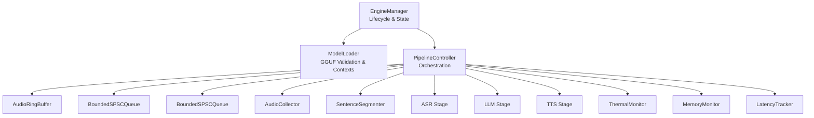
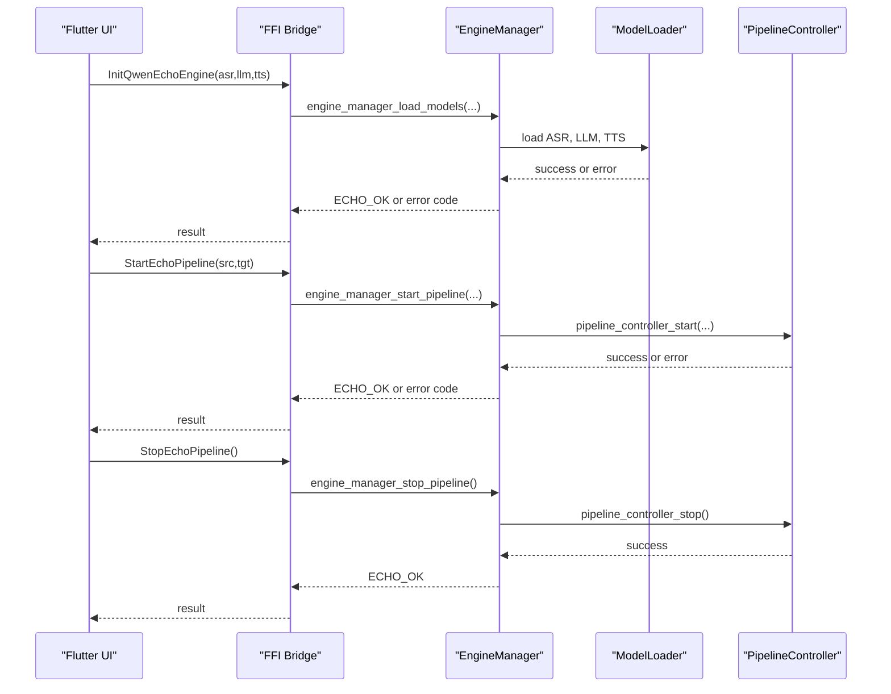
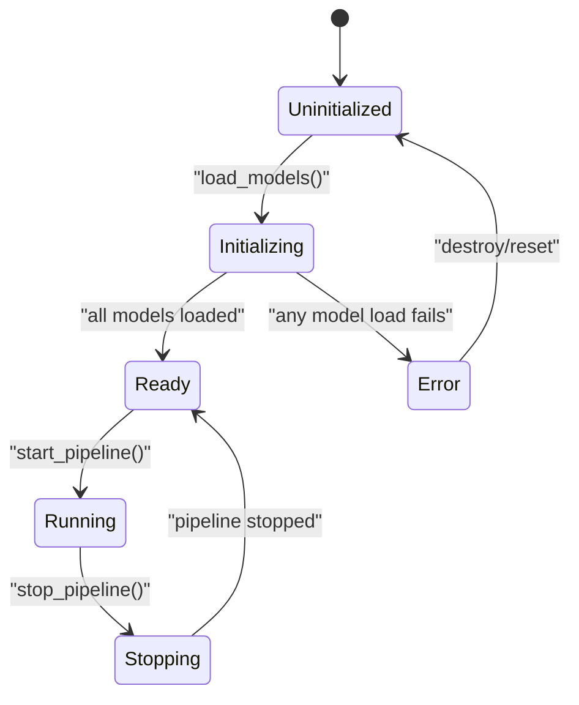
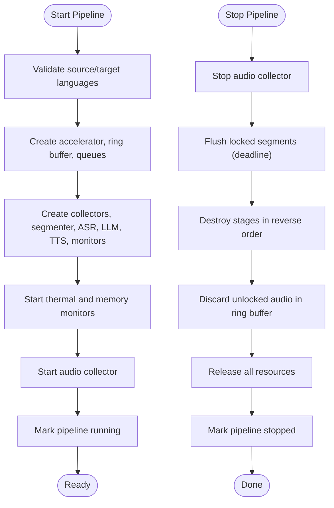
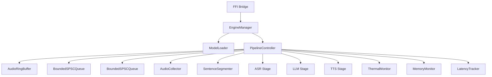

# Engine State Machine

<cite>
**Referenced Files in This Document**
- [engine_manager.h](file://native/include/engine_manager.h)
- [engine_manager.cpp](file://native/src/engine_manager.cpp)
- [pipeline_controller.h](file://native/include/pipeline_controller.h)
- [pipeline_controller.cpp](file://native/src/pipeline_controller.cpp)
- [echo_types.h](file://native/include/echo_types.h)
- [model_loader.h](file://native/include/model_loader.h)
- [model_loader.cpp](file://native/src/model_loader.cpp)
- [ffi_bridge.h](file://native/include/ffi_bridge.h)
- [bounded_spsc_queue.h](file://native/include/bounded_spsc_queue.h)
</cite>

## Table of Contents
1. [Introduction](#introduction)
2. [Project Structure](#project-structure)
3. [Core Components](#core-components)
4. [Architecture Overview](#architecture-overview)
5. [Detailed Component Analysis](#detailed-component-analysis)
6. [Dependency Analysis](#dependency-analysis)
7. [Performance Considerations](#performance-considerations)
8. [Troubleshooting Guide](#troubleshooting-guide)
9. [Conclusion](#conclusion)

## Introduction
This document explains QwenEcho’s engine state machine with a focus on the EngineManager’s lifecycle management and the PipelineController’s orchestration of audio processing stages. It details state transitions between initialization, session management, and cleanup phases; resource allocation/deallocation patterns; error handling and recovery mechanisms; validation rules; rollback procedures; concurrent access patterns; thread synchronization; and graceful degradation under resource pressure.

## Project Structure
The core engine is implemented in native C/C++ components:
- EngineManager coordinates lifecycle and delegates to ModelLoader and PipelineController.
- PipelineController creates and manages the full audio pipeline (AudioCollector → Ring Buffer → SentenceSegmenter → ASR → LLM → TTS), plus monitors and latency tracking.
- ModelLoader validates GGUF models and provides inference contexts.
- FFI bridge exposes public entry points for the Flutter UI shell.

**Diagram sources**
- [engine_manager.cpp:19-25](file://native/src/engine_manager.cpp#L19-L25)
- [pipeline_controller.cpp:107-126](file://native/src/pipeline_controller.cpp#L107-L126)
- [bounded_spsc_queue.h:29-144](file://native/include/bounded_spsc_queue.h#L29-L144)

**Section sources**
- [engine_manager.h:1-104](file://native/include/engine_manager.h#L1-L104)
- [engine_manager.cpp:1-202](file://native/src/engine_manager.cpp#L1-L202)
- [pipeline_controller.h:1-107](file://native/include/pipeline_controller.h#L1-L107)
- [pipeline_controller.cpp:1-488](file://native/src/pipeline_controller.cpp#L1-L488)
- [model_loader.h:1-142](file://native/include/model_loader.h#L1-L142)
- [model_loader.cpp:1-460](file://native/src/model_loader.cpp#L1-L460)
- [ffi_bridge.h:1-84](file://native/include/ffi_bridge.h#L1-L84)
- [bounded_spsc_queue.h:1-144](file://native/include/bounded_spsc_queue.h#L1-L144)

## Core Components
- EngineManager: Central coordinator for engine lifecycle, model loading, and pipeline orchestration. Maintains a strict state machine and guards against invalid transitions.
- PipelineController: Orchestrates creation, startup, and graceful shutdown of all pipeline components and threads. Implements cascade truncation across stages and enforces stop deadlines.
- ModelLoader: Validates GGUF files, memory-maps them, and creates per-model inference contexts. Provides categorized error reporting.
- BoundedSPSCQueue: Lock-free bounded queue with overflow-drop semantics used between stages to ensure non-blocking data flow.

Key responsibilities:
- EngineManager ensures correct state transitions and resource ownership.
- PipelineController guarantees ordered resource creation and deterministic teardown.
- ModelLoader isolates file I/O and format validation from runtime logic.
- Inter-stage queues provide backpressure via drop semantics.

**Section sources**
- [engine_manager.h:1-104](file://native/include/engine_manager.h#L1-L104)
- [engine_manager.cpp:1-202](file://native/src/engine_manager.cpp#L1-L202)
- [pipeline_controller.h:1-107](file://native/include/pipeline_controller.h#L1-L107)
- [pipeline_controller.cpp:1-488](file://native/src/pipeline_controller.cpp#L1-L488)
- [model_loader.h:1-142](file://native/include/model_loader.h#L1-L142)
- [model_loader.cpp:1-460](file://native/src/model_loader.cpp#L1-L460)
- [bounded_spsc_queue.h:1-144](file://native/include/bounded_spsc_queue.h#L1-L144)

## Architecture Overview
The engine follows a layered architecture:
- FFI layer exposes InitQwenEchoEngine, StartEchoPipeline, StopEchoPipeline, RegisterEchoMessagePort.
- EngineManager implements the state machine and delegates to ModelLoader and PipelineController.
- PipelineController wires the audio processing pipeline and monitors.

**Diagram sources**
- [ffi_bridge.h:18-77](file://native/include/ffi_bridge.h#L18-L77)
- [engine_manager.cpp:44-168](file://native/src/engine_manager.cpp#L44-L168)
- [pipeline_controller.cpp:272-469](file://native/src/pipeline_controller.cpp#L272-L469)

## Detailed Component Analysis

### EngineManager Lifecycle and State Machine
EngineManager maintains a strict state machine:
- States: Uninitialized, Initializing, Ready, Running, Stopping, Error.
- Transitions:
  - Uninitialized → Initializing → Ready (on successful model loads).
  - Uninitialized → Initializing → Error (on any model load failure).
  - Ready → Running (start pipeline).
  - Running → Stopping → Ready (stop pipeline).
  - Error → Uninitialized (via destroy/reset path).

Guards and validation:
- load_models requires Uninitialized; otherwise returns already-initialized error.
- start_pipeline requires Ready and no active session; validates language codes.
- stop_pipeline is idempotent when no session is active.

Resource management:
- ModelLoader created during load_models; destroyed in destroy.
- PipelineController lazily created on first start_pipeline; destroyed in destroy.
- Session flag prevents duplicate sessions.

Concurrency:
- All state mutations are serialized by a mutex.
- State reads are safe without lock for query purposes.

Error handling and rollback:
- On partial model load failure, previously loaded models are released and state set to Error.
- Destroy stops any active session before releasing resources.

**Diagram sources**
- [engine_manager.h:6-16](file://native/include/engine_manager.h#L6-L16)
- [engine_manager.cpp:44-168](file://native/src/engine_manager.cpp#L44-L168)
- [echo_types.h:17-24](file://native/include/echo_types.h#L17-L24)

Concrete examples of triggers and validation:
- Trigger: Calling load_models with valid paths transitions to Initializing and then Ready if all three models succeed.
- Guard: Attempting load_models after transitioning out of Uninitialized returns an already-initialized error.
- Validation: start_pipeline rejects unsupported ISO 639-1 codes and duplicates.

Rollback procedure:
- If any model load fails, previously loaded models are unloaded and state set to Error.
- Destroy ensures stop_pipeline is called first, then releases ModelLoader and PipelineController.

**Section sources**
- [engine_manager.h:1-104](file://native/include/engine_manager.h#L1-L104)
- [engine_manager.cpp:1-202](file://native/src/engine_manager.cpp#L1-L202)
- [echo_types.h:48-62](file://native/include/echo_types.h#L48-L62)

### PipelineController Orchestration and Resource Management
PipelineController orchestrates the full audio processing pipeline:
- Creation order: Accelerator → Ring Buffer → Queues → Audio Collector → ASR → Sentence Segmenter → LLM → TTS → Monitors → Latency Tracker.
- Startup: Starts monitors first, then audio collector; marks running.
- Graceful stop: Stops audio collector, flushes locked segments within deadline, destroys stages in reverse order, discards unlocked audio, releases resources.

Cascade truncation:
- ASR→LLM queue delivers confirmed text immediately; LLM begins translation without waiting for segment completion.
- LLM→TTS queue emits partial results at punctuation boundaries; TTS begins synthesis while LLM continues.

Language validation:
- Supported languages list enforced; unsupported codes return unsupported-language error.

Stop semantics:
- Polling loop checks sentence segmenter idle and inter-stage queues empty within a fixed deadline.
- Ensures all locked segments are processed; unlocked audio discarded.

**Diagram sources**
- [pipeline_controller.cpp:272-469](file://native/src/pipeline_controller.cpp#L272-L469)

Resource allocation/deallocation patterns:
- Allocation uses placement-new for C++ members after calloc.
- Destruction explicitly calls destructors for mutex and atomic before freeing raw memory.
- Each stage’s destroy joins its worker thread.

Error handling:
- Any allocation failure triggers immediate cleanup of previously allocated resources and returns memory error.
- Unsupported language returns unsupported-language error.

**Section sources**
- [pipeline_controller.h:1-107](file://native/include/pipeline_controller.h#L1-L107)
- [pipeline_controller.cpp:1-488](file://native/src/pipeline_controller.cpp#L1-L488)

### ModelLoader Validation and Inference Contexts
ModelLoader responsibilities:
- Validate GGUF magic bytes and quantization type (INT4 variants).
- Memory-map files for efficient OS page cache usage.
- Create per-model inference contexts and report memory usage.

Validation steps:
- Check existence and permissions.
- Read header and verify magic.
- Parse metadata to extract first tensor’s quantization type.
- Reject non-INT4 formats.

Error categories:
- Missing file, permission denied, invalid format, memory mapping failure.

Rollback behavior:
- If already loaded, unload before reload.
- On failure, unmap and close descriptors, free context.

**Section sources**
- [model_loader.h:1-142](file://native/include/model_loader.h#L1-L142)
- [model_loader.cpp:1-460](file://native/src/model_loader.cpp#L1-L460)

### Inter-Stage Concurrency: BoundedSPSCQueue
Design highlights:
- Fixed capacity power-of-two bitmask indexing.
- Sequence/turn protocol for occupancy tracking.
- Overflow-drop semantics: oldest element dropped on push when full.
- Lock-free producer-consumer with acquire/release ordering.
- Head/tail aligned to separate cache lines to avoid false sharing.

Usage in pipeline:
- AsrToLlmElement and LlmToTtsElement flow through bounded queues enabling cascade truncation and overlapped execution.

**Section sources**
- [bounded_spsc_queue.h:1-144](file://native/include/bounded_spsc_queue.h#L1-L144)

## Dependency Analysis
High-level dependencies:
- EngineManager depends on ModelLoader and PipelineController.
- PipelineController depends on multiple stages and monitors.
- FFI bridge exposes public APIs that delegate to EngineManager.

**Diagram sources**
- [ffi_bridge.h:18-77](file://native/include/ffi_bridge.h#L18-L77)
- [engine_manager.cpp:19-25](file://native/src/engine_manager.cpp#L19-L25)
- [pipeline_controller.cpp:107-126](file://native/src/pipeline_controller.cpp#L107-L126)

**Section sources**
- [ffi_bridge.h:1-84](file://native/include/ffi_bridge.h#L1-L84)
- [engine_manager.cpp:1-202](file://native/src/engine_manager.cpp#L1-L202)
- [pipeline_controller.cpp:1-488](file://native/src/pipeline_controller.cpp#L1-L488)

## Performance Considerations
- Cascade truncation reduces end-to-end latency by overlapping stages.
- Bounded queues prevent blocking and enforce backpressure via drop semantics.
- Thermal and memory monitors enable adaptive throttling and graceful degradation.
- Stop deadline ensures predictable shutdown timing.

[No sources needed since this section provides general guidance]

## Troubleshooting Guide
Common errors and recovery:
- Already initialized: Occurs when attempting to load models outside Uninitialized state. Reset via destroy and recreate manager.
- Engine not ready: Start pipeline attempted before Ready state. Ensure models loaded successfully.
- Session active: Duplicate start pipeline call. Stop existing session first.
- Unsupported language: Invalid ISO 639-1 code. Use supported list.
- Model missing/invalid: Verify paths and GGUF integrity.

Recovery mechanisms:
- ModelLoader categorizes errors (missing, permission, invalid) to guide remediation.
- PipelineController gracefully stops within deadline, flushing locked segments and discarding unlocked audio.
- Memory monitor can trigger pipeline stop on critical levels to prevent system instability.

**Section sources**
- [engine_manager.cpp:44-168](file://native/src/engine_manager.cpp#L44-L168)
- [pipeline_controller.cpp:395-469](file://native/src/pipeline_controller.cpp#L395-L469)
- [model_loader.cpp:284-380](file://native/src/model_loader.cpp#L284-L380)

## Conclusion
QwenEcho’s engine state machine provides robust lifecycle management through EngineManager, with clear transitions and guards ensuring correctness. PipelineController orchestrates a high-performance audio processing pipeline using cascade truncation and lock-free queues, while enforcing graceful shutdown and resource constraints. ModelLoader offers precise validation and error categorization. Together, these components deliver reliable operation under concurrency and resource pressure, with comprehensive error handling and recovery strategies.