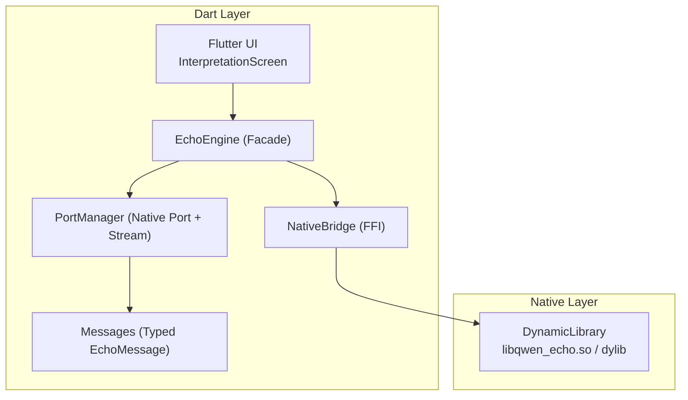
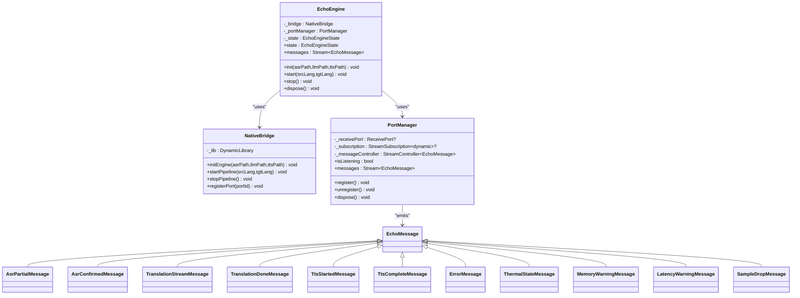
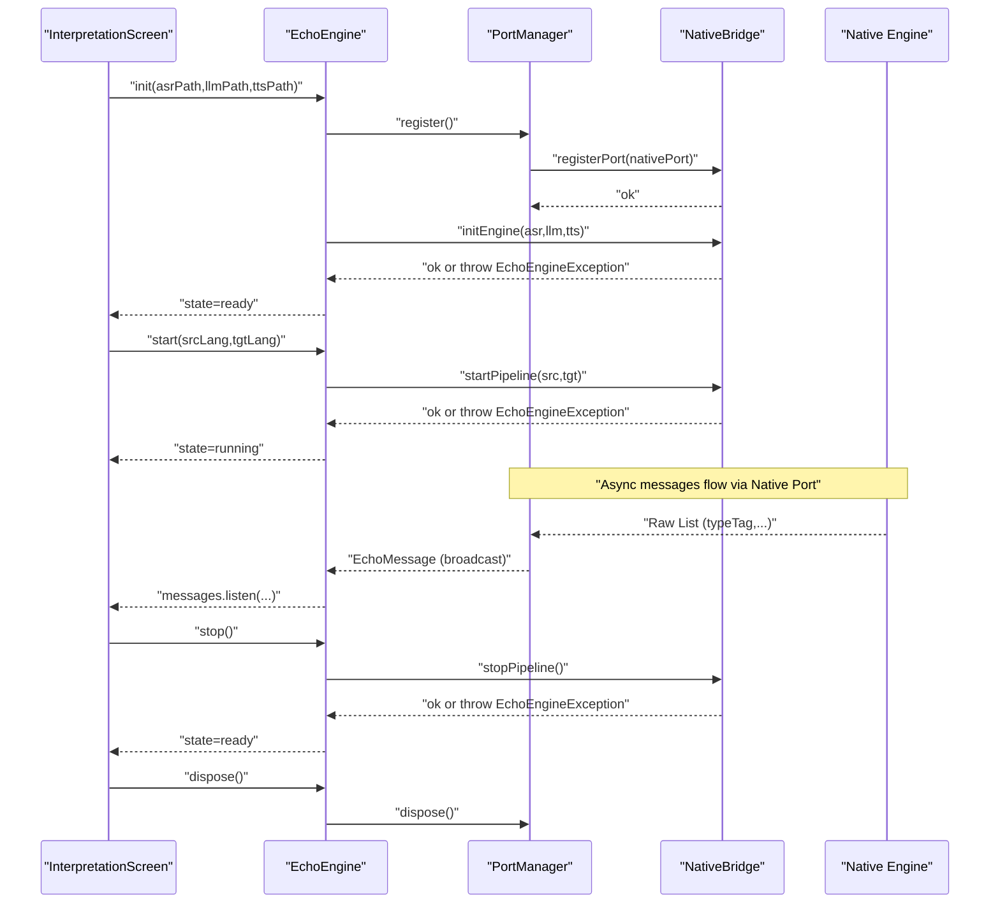
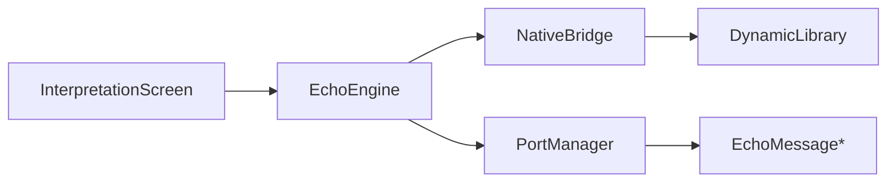

# Facade Pattern Implementation

<cite>
**Referenced Files in This Document**
- [qwen_echo.dart](file://lib/qwen_echo.dart)
- [echo_engine.dart](file://lib/src/echo_engine.dart)
- [native_bridge.dart](file://lib/src/native_bridge.dart)
- [port_manager.dart](file://lib/src/port_manager.dart)
- [messages.dart](file://lib/src/messages.dart)
- [main.dart](file://lib/main.dart)
- [split_view.dart](file://lib/src/ui/split_view.dart)
- [status_bar.dart](file://lib/src/ui/status_bar.dart)
</cite>

## Table of Contents
1. [Introduction](#introduction)
2. [Project Structure](#project-structure)
3. [Core Components](#core-components)
4. [Architecture Overview](#architecture-overview)
5. [Detailed Component Analysis](#detailed-component-analysis)
6. [Dependency Analysis](#dependency-analysis)
7. [Performance Considerations](#performance-considerations)
8. [Troubleshooting Guide](#troubleshooting-guide)
9. [Conclusion](#conclusion)

## Introduction
This document explains the facade pattern implementation in QwenEcho centered on the EchoEngine class. EchoEngine combines responsibilities of NativeBridge (FFI bindings to native C/C++ engine) and PortManager (Native Port registration and message deserialization) into a single, simple Dart API for the UI layer. It documents lifecycle management from initialization through running state to disposal, the three-state machine (uninitialized → ready → running), error propagation strategies, dependency injection patterns for testing, and separation of concerns between UI and native engine communication.

## Project Structure
The relevant Dart code is organized under lib/src with clear separation:
- Engine facade and orchestration: echo_engine.dart
- FFI bridge to native library: native_bridge.dart
- Native Port manager and typed message stream: port_manager.dart, messages.dart
- UI integration and usage examples: main.dart, split_view.dart, status_bar.dart
- Library entrypoint exports: qwen_echo.dart

**Diagram sources**
- [echo_engine.dart:1-108](file://lib/src/echo_engine.dart#L1-L108)
- [native_bridge.dart:1-230](file://lib/src/native_bridge.dart#L1-L230)
- [port_manager.dart:1-85](file://lib/src/port_manager.dart#L1-L85)
- [messages.dart:1-336](file://lib/src/messages.dart#L1-L336)
- [main.dart:1-154](file://lib/main.dart#L1-L154)

**Section sources**
- [qwen_echo.dart:1-16](file://lib/qwen_echo.dart#L1-L16)
- [echo_engine.dart:1-108](file://lib/src/echo_engine.dart#L1-L108)
- [native_bridge.dart:1-230](file://lib/src/native_bridge.dart#L1-L230)
- [port_manager.dart:1-85](file://lib/src/port_manager.dart#L1-L85)
- [messages.dart:1-336](file://lib/src/messages.dart#L1-L336)
- [main.dart:1-154](file://lib/main.dart#L1-L154)

## Core Components
- EchoEngine (facade): Orchestrates lifecycle, exposes init/start/stop/dispose, and forwards messages via PortManager.
- NativeBridge: Loads platform-specific shared libraries and wraps four C-linkage functions; throws EchoEngineException on non-zero returns.
- PortManager: Registers a ReceivePort with the native engine, listens for raw lists, deserializes them into typed EchoMessage objects, and exposes a broadcast Stream.
- Messages: Sealed hierarchy of EchoMessage types parsed from raw lists by type tag.

Key responsibilities:
- EchoEngine abstracts complex native operations behind simple Dart APIs and enforces state transitions.
- NativeBridge isolates FFI details and memory management for UTF-8 strings.
- PortManager encapsulates asynchronous message delivery and parsing.
- UI components subscribe to EchoEngine.messages without knowing about ports or FFI.

**Section sources**
- [echo_engine.dart:25-108](file://lib/src/echo_engine.dart#L25-L108)
- [native_bridge.dart:96-230](file://lib/src/native_bridge.dart#L96-L230)
- [port_manager.dart:12-85](file://lib/src/port_manager.dart#L12-L85)
- [messages.dart:7-336](file://lib/src/messages.dart#L7-L336)

## Architecture Overview
EchoEngine acts as a facade over two collaborators:
- NativeBridge provides synchronous control-plane calls (init, start, stop, registerPort).
- PortManager provides an asynchronous data-plane stream of typed messages.

**Diagram sources**
- [echo_engine.dart:1-108](file://lib/src/echo_engine.dart#L1-L108)
- [native_bridge.dart:1-230](file://lib/src/native_bridge.dart#L1-L230)
- [port_manager.dart:1-85](file://lib/src/port_manager.dart#L1-L85)
- [messages.dart:1-336](file://lib/src/messages.dart#L1-L336)

## Detailed Component Analysis

### EchoEngine Facade: Lifecycle and State Machine
EchoEngine implements a strict three-state machine:
- uninitialized: default after construction
- ready: after successful init (engine initialized and port registered)
- running: after successful start (pipeline active)

Transitions:
- uninitialized → ready: via init(asrPath, llmPath, ttsPath)
- ready → running: via start(srcLang, tgtLang)
- running → ready: via stop()
- Any state → disposed: via dispose() (does not stop native engine automatically)

Error handling:
- init/start/stop delegate to NativeBridge methods that throw EchoEngineException on non-zero return codes.
- The UI should catch exceptions around these calls and surface user-friendly feedback.

Example usage patterns:
- Default instantiation: final engine = EchoEngine();
- Custom bridge for testing: final engine = EchoEngine.withBridge(mockBridge);

Separation of concerns:
- UI subscribes to engine.messages and routes typed messages to SplitView and StatusBar.
- UI never touches FFI or ports directly.

**Diagram sources**
- [echo_engine.dart:60-108](file://lib/src/echo_engine.dart#L60-L108)
- [native_bridge.dart:132-186](file://lib/src/native_bridge.dart#L132-L186)
- [port_manager.dart:38-63](file://lib/src/port_manager.dart#L38-L63)
- [messages.dart:14-33](file://lib/src/messages.dart#L14-L33)

**Section sources**
- [echo_engine.dart:13-108](file://lib/src/echo_engine.dart#L13-L108)
- [native_bridge.dart:40-93](file://lib/src/native_bridge.dart#L40-L93)
- [port_manager.dart:18-85](file://lib/src/port_manager.dart#L18-L85)
- [messages.dart:7-336](file://lib/src/messages.dart#L7-L336)
- [main.dart:47-65](file://lib/main.dart#L47-L65)

### NativeBridge: FFI Abstraction and Error Propagation
Responsibilities:
- Load platform-specific dynamic library (Android/Linux vs iOS/macOS).
- Lookup and cache function pointers for InitQwenEchoEngine, StartEchoPipeline, StopEchoPipeline, RegisterEchoMessagePort.
- Convert Dart strings to native UTF-8, invoke functions, free memory, and throw EchoEngineException when error codes are non-zero.

Error propagation strategy:
- All public methods wrap native calls and convert non-zero results into EchoEngineException with human-readable messages derived from EchoErrorCode.describe.
- UI can catch EchoEngineException and present actionable errors (e.g., missing model files, unsupported language pair).

Testing considerations:
- Use NativeBridge.fromLibrary(DynamicLibrary) to inject a pre-loaded library or mock wrapper for unit tests.

**Section sources**
- [native_bridge.dart:96-230](file://lib/src/native_bridge.dart#L96-L230)

### PortManager: Native Port Registration and Message Deserialization
Responsibilities:
- Create and manage a ReceivePort, register it with the native engine, and listen for incoming raw lists.
- Deserialize raw lists into typed EchoMessage instances using EchoMessage.fromRawList.
- Expose a broadcast Stream<EchoMessage> so multiple UI components can subscribe independently.

Lifecycle:
- register(): closes any existing port, creates new ReceivePort, registers with engine, starts listening.
- unregister(): stops listening and closes port.
- dispose(): cancels subscription, closes port, and closes the StreamController.

Integration with EchoEngine:
- EchoEngine.init calls PortManager.register before initializing the engine so early status messages can be received.
- EchoEngine.dispose delegates to PortManager.dispose.

**Section sources**
- [port_manager.dart:12-85](file://lib/src/port_manager.dart#L12-L85)
- [messages.dart:14-33](file://lib/src/messages.dart#L14-L33)

### Messages: Typed Event Model
Design:
- Sealed base EchoMessage with static factory fromRawList dispatching on integer type tags.
- Concrete subclasses for ASR partial/confirmed, translation streaming/done, TTS started/completed, error, thermal state, memory warning, latency warning, and sample drop.

Complexity:
- Parsing is O(1) per message based on fixed-length list access by index.
- Memory overhead is proportional to payload size; streaming tokens are small fragments.

Usage:
- UI switches on concrete message types to update SplitView text buffers and StatusBar indicators.

**Section sources**
- [messages.dart:7-336](file://lib/src/messages.dart#L7-L336)

### UI Integration and Separation of Concerns
InterpretationScreen:
- Instantiates EchoEngine, subscribes to messages, and routes events to SplitView and StatusBar.
- Ensures subscriptions are canceled and engine is disposed in widget dispose.

SplitView:
- Provides methods to add ASR partial/confirmed text and translation tokens to speaker halves.

StatusBar:
- Subscribes to messages to reflect offline badge and thermal mode changes.

Separation of concerns:
- UI depends only on EchoEngine facade and typed messages.
- No direct knowledge of FFI, ports, or native library loading.

**Section sources**
- [main.dart:47-105](file://lib/main.dart#L47-L105)
- [split_view.dart:52-77](file://lib/src/ui/split_view.dart#L52-L77)
- [status_bar.dart:64-123](file://lib/src/ui/status_bar.dart#L64-L123)

## Dependency Analysis
High-level dependencies:
- EchoEngine depends on NativeBridge and PortManager.
- PortManager depends on NativeBridge (for registerPort) and messages (for parsing).
- UI depends on EchoEngine and messages.

**Diagram sources**
- [echo_engine.dart:1-108](file://lib/src/echo_engine.dart#L1-L108)
- [native_bridge.dart:1-230](file://lib/src/native_bridge.dart#L1-L230)
- [port_manager.dart:1-85](file://lib/src/port_manager.dart#L1-L85)
- [messages.dart:1-336](file://lib/src/messages.dart#L1-L336)
- [main.dart:1-154](file://lib/main.dart#L1-L154)

**Section sources**
- [echo_engine.dart:1-108](file://lib/src/echo_engine.dart#L1-L108)
- [native_bridge.dart:1-230](file://lib/src/native_bridge.dart#L1-L230)
- [port_manager.dart:1-85](file://lib/src/port_manager.dart#L1-L85)
- [messages.dart:1-336](file://lib/src/messages.dart#L1-L336)
- [main.dart:1-154](file://lib/main.dart#L1-L154)

## Performance Considerations
- Streaming tokens minimize memory pressure; avoid buffering large translations in UI.
- Prefer late initialization and lazy resource allocation where possible.
- Ensure dispose is called promptly to release ports and streams.
- Avoid repeated re-registration of ports; reuse a single PortManager instance per engine lifetime.

[No sources needed since this section provides general guidance]

## Troubleshooting Guide
Common issues and strategies:
- Initialization failures: Catch EchoEngineException around init/start/stop and inspect error codes. Typical causes include missing or invalid model files, unsupported language pairs, or already-active sessions.
- No messages received: Verify PortManager.register was called before starting the pipeline and that the UI subscribed to messages.
- Resource leaks: Ensure StreamSubscription is canceled and engine.dispose is called in widget dispose.

Operational checks:
- Confirm correct platform library loading (Android/Linux .so vs iOS/macOS dylib/process).
- Validate GGUF models exist and pass magic-byte checks before calling init.

**Section sources**
- [native_bridge.dart:40-93](file://lib/src/native_bridge.dart#L40-L93)
- [port_manager.dart:38-63](file://lib/src/port_manager.dart#L38-L63)
- [main.dart:61-65](file://lib/main.dart#L61-L65)

## Conclusion
EchoEngine cleanly implements the facade pattern by combining NativeBridge and PortManager into a cohesive, easy-to-use API. Its three-state machine ensures predictable lifecycle behavior, while typed messages and broadcast streams enable robust, decoupled UI updates. Dependency injection via constructors supports testability, and consistent exception propagation simplifies error handling across layers.