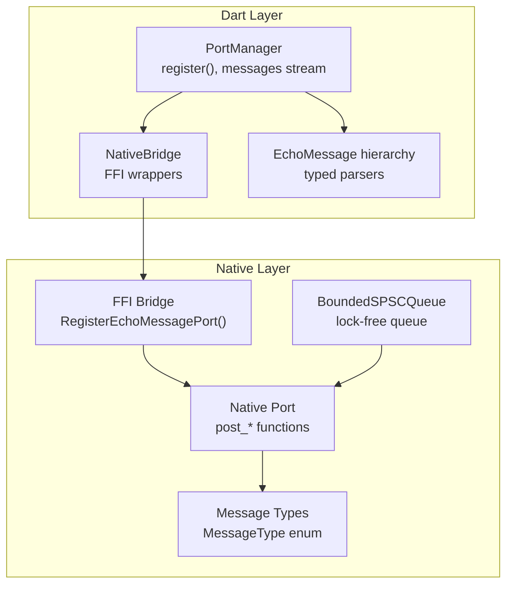
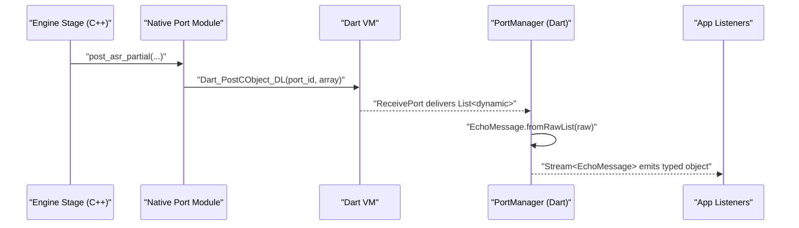
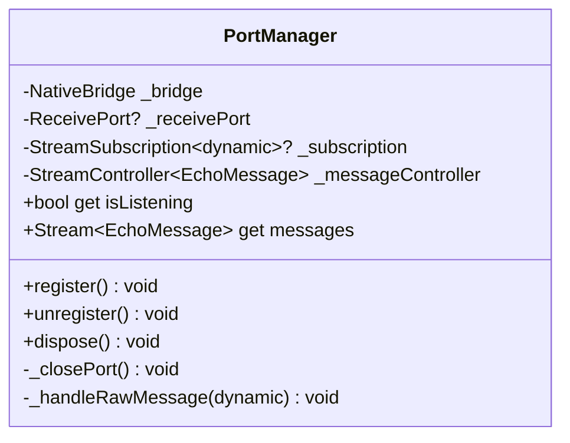
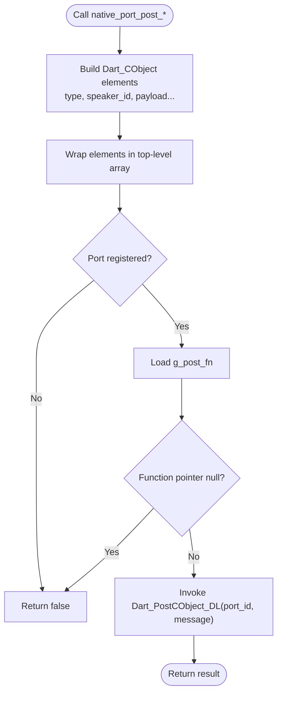
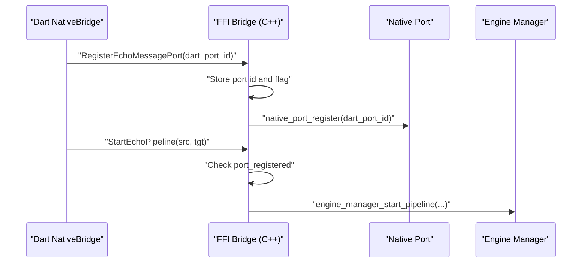
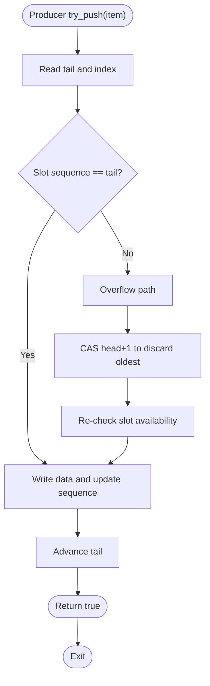
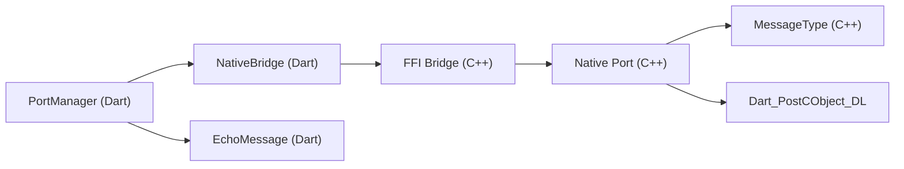

# Native Port System

<cite>
**Referenced Files in This Document**
- [native_port.h](file://native/include/native_port.h)
- [native_port.cpp](file://native/src/native_port.cpp)
- [echo_types.h](file://native/include/echo_types.h)
- [ffi_bridge.h](file://native/include/ffi_bridge.h)
- [ffi_bridge.cpp](file://native/src/ffi_bridge.cpp)
- [bounded_spsc_queue.h](file://native/include/bounded_spsc_queue.h)
- [port_manager.dart](file://lib/src/port_manager.dart)
- [messages.dart](file://lib/src/messages.dart)
- [native_bridge.dart](file://lib/src/native_bridge.dart)
- [qwen_echo.dart](file://lib/qwen_echo.dart)
- [test_native_port.cpp](file://native/tests/test_native_port.cpp)
</cite>

## Table of Contents
1. [Introduction](#introduction)
2. [Project Structure](#project-structure)
3. [Core Components](#core-components)
4. [Architecture Overview](#architecture-overview)
5. [Detailed Component Analysis](#detailed-component-analysis)
6. [Dependency Analysis](#dependency-analysis)
7. [Performance Considerations](#performance-considerations)
8. [Troubleshooting Guide](#troubleshooting-guide)
9. [Conclusion](#conclusion)

## Introduction
This document explains QwenEcho’s native port system for asynchronous, type-safe messaging between the C/C++ engine and the Dart layer. It focuses on:
- The PortManager class that registers a Dart ReceivePort and deserializes incoming messages into typed EchoMessage objects.
- The underlying native port registration mechanism and message dispatch from C/C++.
- The typed event system using the EchoMessage hierarchy to ensure type safety across FFI boundaries.
- The producer-consumer pattern used by high-frequency audio processing stages via a lock-free bounded queue.
- Thread safety, memory management across FFI boundaries, and performance optimization strategies for real-time messaging.

## Project Structure
The native port system spans both native (C/C++) and Dart layers:
- Native side:
  - Message types and enums are defined centrally.
  - A thin FFI bridge exposes lifecycle functions and port registration.
  - The native port module serializes messages as Dart_CObject arrays and posts them to the registered Dart port.
- Dart side:
  - FFI bindings load the native library and expose typed methods.
  - PortManager creates a ReceivePort, registers it with the engine, and transforms raw lists into typed EchoMessage instances.
  - Messages are modeled as a sealed hierarchy for safe parsing and consumption.

**Diagram sources**
- [port_manager.dart:1-85](file://lib/src/port_manager.dart#L1-L85)
- [native_bridge.dart:100-230](file://lib/src/native_bridge.dart#L100-L230)
- [ffi_bridge.h:1-84](file://native/include/ffi_bridge.h#L1-L84)
- [ffi_bridge.cpp:108-121](file://native/src/ffi_bridge.cpp#L108-L121)
- [native_port.h:65-179](file://native/include/native_port.h#L65-L179)
- [native_port.cpp:1-320](file://native/src/native_port.cpp#L1-L320)
- [echo_types.h:26-42](file://native/include/echo_types.h#L26-L42)
- [bounded_spsc_queue.h:1-145](file://native/include/bounded_spsc_queue.h#L1-L145)

**Section sources**
- [native_port.h:1-179](file://native/include/native_port.h#L1-L179)
- [native_port.cpp:1-320](file://native/src/native_port.cpp#L1-L320)
- [echo_types.h:1-136](file://native/include/echo_types.h#L1-L136)
- [ffi_bridge.h:1-84](file://native/include/ffi_bridge.h#L1-L84)
- [ffi_bridge.cpp:1-124](file://native/src/ffi_bridge.cpp#L1-L124)
- [bounded_spsc_queue.h:1-145](file://native/include/bounded_spsc_queue.h#L1-L145)
- [port_manager.dart:1-85](file://lib/src/port_manager.dart#L1-L85)
- [messages.dart:1-336](file://lib/src/messages.dart#L1-L336)
- [native_bridge.dart:1-230](file://lib/src/native_bridge.dart#L1-L230)
- [qwen_echo.dart:1-16](file://lib/qwen_echo.dart#L1-L16)

## Core Components
- PortManager (Dart):
  - Creates a ReceivePort and registers it with the native engine via FFI.
  - Subscribes to raw messages and converts them into typed EchoMessage instances.
  - Exposes a broadcast Stream<EchoMessage> for multiple listeners.
- Native Port (C/C++):
  - Provides typed post_* functions that serialize payloads into Dart_CObject arrays.
  - Uses atomic state for port ID, registration flag, and runtime function pointer.
  - Posts messages through a settable Dart_PostCObject function pointer.
- FFI Bridge (C/C++):
  - Exposes RegisterEchoMessagePort to Dart, which forwards to native_port_register.
  - Guards pipeline start/stop with port registration checks.
- Message Types (C/C++ and Dart):
  - MessageType enum defines tags for all events.
  - EchoMessage sealed hierarchy provides strongly-typed parsers for each tag.
- BoundedSPSCQueue (C++):
  - Lock-free bounded queue with overflow-drop semantics for high-frequency producers.

**Section sources**
- [port_manager.dart:1-85](file://lib/src/port_manager.dart#L1-L85)
- [native_port.h:65-179](file://native/include/native_port.h#L65-L179)
- [native_port.cpp:1-320](file://native/src/native_port.cpp#L1-L320)
- [ffi_bridge.h:1-84](file://native/include/ffi_bridge.h#L1-L84)
- [ffi_bridge.cpp:108-121](file://native/src/ffi_bridge.cpp#L108-L121)
- [echo_types.h:26-42](file://native/include/echo_types.h#L26-L42)
- [messages.dart:1-336](file://lib/src/messages.dart#L1-L336)
- [bounded_spsc_queue.h:1-145](file://native/include/bounded_spsc_queue.h#L1-L145)

## Architecture Overview
The architecture implements an asynchronous producer-consumer model:
- Producers (ASR/LLM/TTS stages) generate events and push them into internal queues or directly post messages via the native port.
- The native port serializes events and posts them to the Dart ReceivePort.
- PortManager receives raw lists, parses them into typed EchoMessage objects, and emits them on a broadcast stream.

**Diagram sources**
- [native_port.cpp:116-133](file://native/src/native_port.cpp#L116-L133)
- [native_port.h:100-106](file://native/include/native_port.h#L100-L106)
- [port_manager.dart:76-83](file://lib/src/port_manager.dart#L76-L83)
- [messages.dart:14-33](file://lib/src/messages.dart#L14-L33)

## Detailed Component Analysis

### PortManager (Dart)
Responsibilities:
- Create and manage a ReceivePort.
- Register the port with the native engine via NativeBridge.registerPort.
- Transform raw lists into typed EchoMessage instances.
- Provide a broadcast Stream for consumers.

Key behaviors:
- register(): closes any existing port, creates a new ReceivePort, registers it, and starts listening.
- unregister()/dispose(): cancel subscriptions, close ports, and release resources.
- _handleRawMessage(): validates input is a List, delegates to EchoMessage.fromRawList, and adds parsed messages to the broadcast controller.

**Diagram sources**
- [port_manager.dart:18-84](file://lib/src/port_manager.dart#L18-L84)

**Section sources**
- [port_manager.dart:1-85](file://lib/src/port_manager.dart#L1-L85)

### Native Port Module (C/C++)
Responsibilities:
- Maintain thread-safe global state for port registration and posting function.
- Serialize typed messages as Dart_CObject arrays and post them to the registered Dart port.
- Provide typed post_* functions for each event type.

Thread safety:
- Uses std::atomic for g_port_id, g_port_registered, and g_post_fn.
- Memory ordering ensures visibility across threads when pipeline components post concurrently.

Serialization helpers:
- Inline setters initialize Dart_CObject fields for int32/int64/double/string/array.

Post flow:
- Each post_* builds a small stack-allocated array of Dart_CObject elements and wraps them in a top-level array message.
- post_message checks registration and function pointer before calling the runtime Dart_PostCObject function.

**Diagram sources**
- [native_port.cpp:62-75](file://native/src/native_port.cpp#L62-L75)
- [native_port.cpp:81-110](file://native/src/native_port.cpp#L81-L110)
- [native_port.cpp:116-133](file://native/src/native_port.cpp#L116-L133)

**Section sources**
- [native_port.h:65-179](file://native/include/native_port.h#L65-L179)
- [native_port.cpp:1-320](file://native/src/native_port.cpp#L1-L320)

### FFI Bridge (C/C++)
Responsibilities:
- Expose RegisterEchoMessagePort to Dart.
- Guard StartEchoPipeline and StopEchoPipeline with port registration checks.
- Forward registration to native_port_register.

Lifecycle integration:
- Maintains a mutex-protected context holding EngineManager pointer and port registration flags.
- Ensures only one active session and enforces port availability before starting/stopping.

**Diagram sources**
- [ffi_bridge.cpp:108-121](file://native/src/ffi_bridge.cpp#L108-L121)
- [ffi_bridge.cpp:72-88](file://native/src/ffi_bridge.cpp#L72-L88)
- [ffi_bridge.h:67-77](file://native/include/ffi_bridge.h#L67-L77)

**Section sources**
- [ffi_bridge.h:1-84](file://native/include/ffi_bridge.h#L1-L84)
- [ffi_bridge.cpp:1-124](file://native/src/ffi_bridge.cpp#L1-L124)

### Typed Event System (EchoMessage Hierarchy)
Design:
- MessageType enum defines integer tags for each event.
- EchoMessage base class provides a static parser fromRawList that switches on the first element (type tag).
- Concrete subclasses implement _fromRaw factory methods to parse payload fields.

Benefits:
- Strong typing prevents misinterpretation of fields.
- Centralized parsing logic simplifies maintenance and reduces duplication.

```mermaid
classDiagram
class EchoMessage {
<<sealed>>
+static fromRawList(dynamic[]) EchoMessage?
}
class AsrPartialMessage {
+int speakerId
+String text
+int timestampMs
+factory _fromRaw(dynamic[])
}
class AsrConfirmedMessage {
+int speakerId
+String text
+int timestampMs
+int segmentId
+factory _fromRaw(dynamic[])
}
class TranslationStreamMessage {
+int speakerId
+String token
+int segmentId
+factory _fromRaw(dynamic[])
}
class TranslationDoneMessage {
+int speakerId
+String fullText
+int segmentId
+factory _fromRaw(dynamic[])
}
class TtsStartedMessage {
+int speakerId
+int segmentId
+factory _fromRaw(dynamic[])
}
class TtsCompleteMessage {
+int speakerId
+int segmentId
+factory _fromRaw(dynamic[])
}
class ErrorMessage {
+int errorCode
+String modelName
+String detail
+factory _fromRaw(dynamic[])
}
class ThermalStateMessage {
+int thermalMode
+double temperatureC
+String get modeName
+factory _fromRaw(dynamic[])
}
class MemoryWarningMessage {
+int currentBytes
+int limitBytes
+int level
+double get usagePercent
+factory _fromRaw(dynamic[])
}
class LatencyWarningMessage {
+String stage
+int actualMs
+int budgetMs
+factory _fromRaw(dynamic[])
}
class SampleDropMessage {
+int droppedSamples
+int timestampMs
+factory _fromRaw(dynamic[])
}
EchoMessage <|-- AsrPartialMessage
EchoMessage <|-- AsrConfirmedMessage
EchoMessage <|-- TranslationStreamMessage
EchoMessage <|-- TranslationDoneMessage
EchoMessage <|-- TtsStartedMessage
EchoMessage <|-- TtsCompleteMessage
EchoMessage <|-- ErrorMessage
EchoMessage <|-- ThermalStateMessage
EchoMessage <|-- MemoryWarningMessage
EchoMessage <|-- LatencyWarningMessage
EchoMessage <|-- SampleDropMessage
```

**Diagram sources**
- [messages.dart:8-336](file://lib/src/messages.dart#L8-L336)

**Section sources**
- [messages.dart:1-336](file://lib/src/messages.dart#L1-L336)
- [echo_types.h:26-42](file://native/include/echo_types.h#L26-L42)

### Producer-Consumer Pattern (High-Frequency Audio Events)
Implementation:
- BoundedSPSCQueue provides a lock-free, power-of-two capacity queue with overflow-drop semantics.
- Producers call try_push; if full, the oldest element is dropped and replaced.
- Consumers call try_pop; returns true if an item was dequeued, false otherwise.
- Head/tail are aligned to separate cache lines to avoid false sharing.

Use cases:
- ASR → LLM inter-stage queue elements.
- LLM → TTS inter-stage queue elements.
- High-frequency telemetry or sample drop notifications can be buffered similarly.

**Diagram sources**
- [bounded_spsc_queue.h:51-85](file://native/include/bounded_spsc_queue.h#L51-L85)

**Section sources**
- [bounded_spsc_queue.h:1-145](file://native/include/bounded_spsc_queue.h#L1-L145)

### Example Patterns: Message Creation, Sending, and Receiving
- Creating and sending a message (native):
  - Call a typed post_* function (e.g., native_port_post_asr_partial) with appropriate parameters.
  - The function constructs a Dart_CObject array and posts it via the registered port.
- Receiving and parsing a message (Dart):
  - PortManager listens on ReceivePort and calls EchoMessage.fromRawList to parse.
  - The resulting typed object is emitted on the broadcast stream for app consumers.

Validation:
- Unit tests verify message structure, field order, and port ID delivery.

**Section sources**
- [native_port.cpp:116-133](file://native/src/native_port.cpp#L116-L133)
- [port_manager.dart:76-83](file://lib/src/port_manager.dart#L76-L83)
- [test_native_port.cpp:153-184](file://native/tests/test_native_port.cpp#L153-L184)

## Dependency Analysis
Component relationships:
- Dart NativeBridge depends on platform-specific DynamicLibrary loading and FFI function lookups.
- PortManager depends on NativeBridge for registration and on messages.dart for parsing.
- FFI Bridge depends on EngineManager for lifecycle and on native_port for message dispatch.
- Native Port depends on echo_types for message tags and uses a runtime-set Dart_PostCObject function pointer.

**Diagram sources**
- [native_bridge.dart:100-230](file://lib/src/native_bridge.dart#L100-L230)
- [ffi_bridge.cpp:108-121](file://native/src/ffi_bridge.cpp#L108-L121)
- [native_port.cpp:1-320](file://native/src/native_port.cpp#L1-L320)
- [echo_types.h:26-42](file://native/include/echo_types.h#L26-L42)
- [messages.dart:1-336](file://lib/src/messages.dart#L1-L336)

**Section sources**
- [native_bridge.dart:1-230](file://lib/src/native_bridge.dart#L1-L230)
- [ffi_bridge.cpp:1-124](file://native/src/ffi_bridge.cpp#L1-L124)
- [native_port.cpp:1-320](file://native/src/native_port.cpp#L1-L320)
- [echo_types.h:1-136](file://native/include/echo_types.h#L1-L136)
- [messages.dart:1-336](file://lib/src/messages.dart#L1-L336)

## Performance Considerations
- Lock-free queue:
  - BoundedSPSCQueue avoids contention and blocking; overflow-drop ensures steady-state throughput under bursts.
  - Cache-line alignment minimizes false sharing between head and tail.
- Atomic state in native port:
  - Minimal overhead checks for registration and function pointer before posting.
  - Avoids unnecessary allocations by constructing small stack-based Dart_CObject arrays.
- String handling:
  - Strings are passed as const char* pointers; ensure lifetimes are valid until posted.
  - On Dart side, strings are copied into Dart heap during FFI marshaling.
- Serialization cost:
  - Keep payloads compact; prefer integers and short tokens where possible.
  - Batch non-critical telemetry if needed to reduce message frequency.
- Backpressure:
  - If Dart cannot keep up, consider dropping low-priority messages at the producer or increasing queue capacity judiciously.

[No sources needed since this section provides general guidance]

## Troubleshooting Guide
Common issues and resolutions:
- No messages received:
  - Ensure RegisterEchoMessagePort is called before StartEchoPipeline.
  - Verify port registration flags and function pointer are set.
- Pipeline start fails with no-port error:
  - Confirm port registration succeeded and is visible to the FFI bridge.
- Incorrect message format:
  - Validate that the first element matches MessageType tags and subsequent fields match expected types.
- Memory leaks or crashes:
  - Ensure string pointers remain valid until posted.
  - Free allocated UTF-8 buffers after FFI calls in Dart.

Verification:
- Use unit tests to assert message structure and port ID delivery.

**Section sources**
- [ffi_bridge.cpp:72-88](file://native/src/ffi_bridge.cpp#L72-L88)
- [native_port.cpp:62-75](file://native/src/native_port.cpp#L62-L75)
- [test_native_port.cpp:105-121](file://native/tests/test_native_port.cpp#L105-L121)
- [test_native_port.cpp:373-384](file://native/tests/test_native_port.cpp#L373-L384)

## Conclusion
QwenEcho’s native port system provides a robust, type-safe, and high-performance channel for asynchronous messaging between C/C++ and Dart. The design leverages:
- A typed event system with centralized parsing.
- Thread-safe registration and posting mechanisms.
- A lock-free bounded queue for high-frequency producers.
- Clear separation of concerns across FFI bridge, native port, and Dart PortManager.

Adhering to the patterns and guidelines outlined here will help maintain reliability and performance in real-time interpretation scenarios.