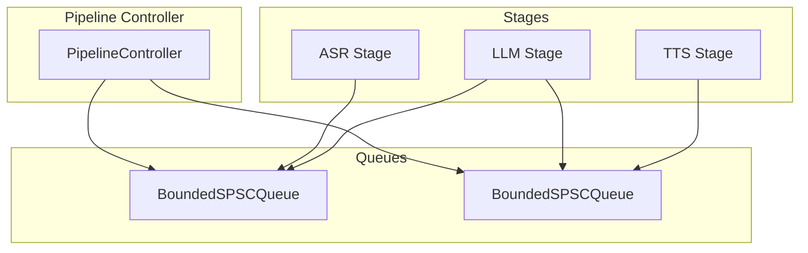
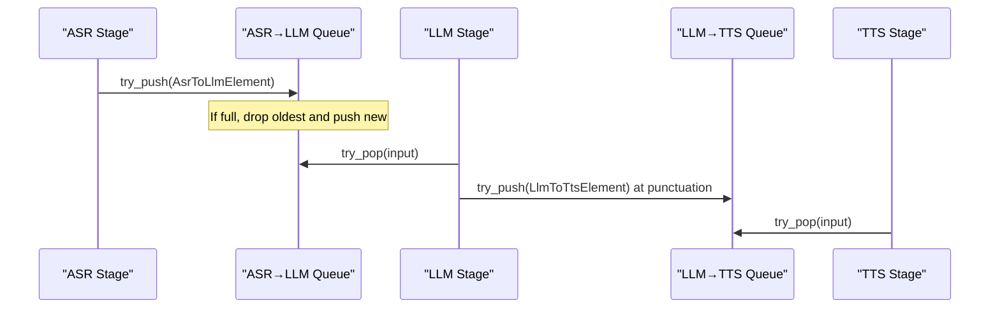
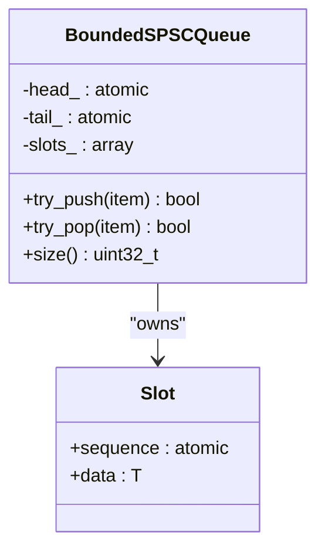
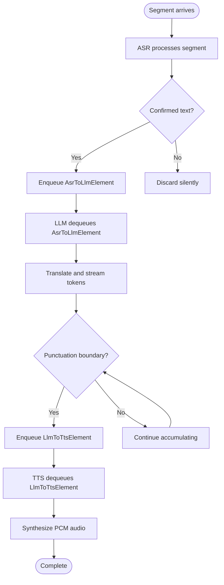
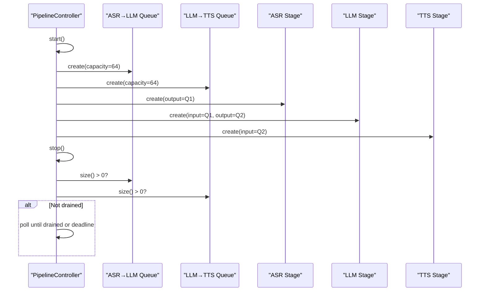
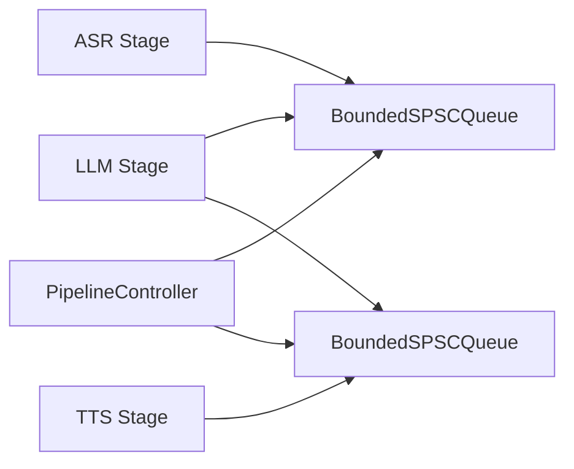

# Bounded SPSC Queues

<cite>
**Referenced Files in This Document**
- [bounded_spsc_queue.h](file://native/include/bounded_spsc_queue.h)
- [echo_types.h](file://native/include/echo_types.h)
- [pipeline_controller.cpp](file://native/src/pipeline_controller.cpp)
- [asr_stage.cpp](file://native/src/asr_stage.cpp)
- [llm_stage.cpp](file://native/src/llm_stage.cpp)
- [tts_stage.cpp](file://native/src/tts_stage.cpp)
</cite>

## Table of Contents
1. [Introduction](#introduction)
2. [Project Structure](#project-structure)
3. [Core Components](#core-components)
4. [Architecture Overview](#architecture-overview)
5. [Detailed Component Analysis](#detailed-component-analysis)
6. [Dependency Analysis](#dependency-analysis)
7. [Performance Considerations](#performance-considerations)
8. [Troubleshooting Guide](#troubleshooting-guide)
9. [Conclusion](#conclusion)

## Introduction
This document explains QwenEcho’s bounded single-producer single-consumer (SPSC) queue system used for inter-stage communication between ASR, LLM, and TTS stages. The queues provide backpressure via overflow-drop semantics to prevent unbounded memory growth under high load. They are lock-free, use a sequence/turn protocol with atomic indices, and integrate tightly with the pipeline controller that orchestrates lifecycle and graceful shutdown.

## Project Structure
The queue implementation is a header-only C++ template used by the audio processing stages:
- Queue definition: native/include/bounded_spsc_queue.h
- Data element types: native/include/echo_types.h
- Pipeline wiring and resource management: native/src/pipeline_controller.cpp
- Stage producers/consumers:
  - ASR → LLM: native/src/asr_stage.cpp
  - LLM → TTS: native/src/llm_stage.cpp and native/src/tts_stage.cpp

**Diagram sources**
- [pipeline_controller.cpp:304-353](file://native/src/pipeline_controller.cpp#L304-L353)
- [bounded_spsc_queue.h:29-142](file://native/include/bounded_spsc_queue.h#L29-L142)

**Section sources**
- [bounded_spsc_queue.h:1-144](file://native/include/bounded_spsc_queue.h#L1-L144)
- [pipeline_controller.cpp:248-393](file://native/src/pipeline_controller.cpp#L248-L393)

## Core Components
- BoundedSPSCQueue<T, Capacity>: Lock-free bounded queue with overflow-drop semantics. It never blocks on enqueue; when full, it drops the oldest element and enqueues the new one. Dequeue returns false if empty.
- AsrToLlmElement: Inter-stage data from ASR to LLM containing segment metadata and confirmed text.
- LlmToTtsElement: Inter-stage data from LLM to TTS containing segment metadata and translated text.

Key behaviors:
- Backpressure strategy: Overflow-drop prevents unbounded memory growth during high-load scenarios.
- Synchronization: Uses atomic head/tail indices and per-slot sequence numbers with acquire/release ordering.
- Monitoring: size() provides current occupancy for utilization metrics and graceful stop checks.

**Section sources**
- [bounded_spsc_queue.h:29-142](file://native/include/bounded_spsc_queue.h#L29-L142)
- [echo_types.h:68-86](file://native/include/echo_types.h#L68-L86)

## Architecture Overview
The pipeline uses two bounded SPSC queues:
- ASR→LLM: ASR produces confirmed text elements; LLM consumes them.
- LLM→TTS: LLM produces translation fragments at punctuation boundaries; TTS consumes them.

**Diagram sources**
- [asr_stage.cpp:254-270](file://native/src/asr_stage.cpp#L254-L270)
- [llm_stage.cpp:218-237](file://native/src/llm_stage.cpp#L218-L237)
- [tts_stage.cpp:191-200](file://native/src/tts_stage.cpp#L191-L200)

## Detailed Component Analysis

### BoundedSPSCQueue<T, Capacity>
Design highlights:
- Fixed power-of-two capacity with bitmask indexing.
- Slot-based storage with per-slot sequence numbers indicating readiness for write/read.
- Producer owns tail; consumer advances head; producer may also advance head on overflow using CAS.
- Cache-line alignment for head/tail to avoid false sharing.
- Non-blocking operations: try_push returns true/false (overflow), try_pop returns true/false (empty).

**Diagram sources**
- [bounded_spsc_queue.h:29-142](file://native/include/bounded_spsc_queue.h#L29-L142)

Operational details:
- Enqueue path:
  - Read tail and slot sequence.
  - If slot ready (seq == tail), write data and update sequence and tail.
  - Else (full): attempt to advance head via CAS; mark old slot available; write new data; update tail.
- Dequeue path:
  - Read head and slot sequence.
  - If seq != head+1, return false (empty).
  - Claim via CAS on head; copy data; mark slot available; return true.
- Size:
  - Compute diff = tail - head; clamp to capacity.

Complexity:
- Time: O(1) for enqueue/dequeue/size.
- Space: O(Capacity) fixed.

Error handling:
- Overflow: oldest dropped; caller receives false from try_push.
- Empty: try_pop returns false.

**Section sources**
- [bounded_spsc_queue.h:51-128](file://native/include/bounded_spsc_queue.h#L51-L128)

### Data Element Structures and Lifecycle
- AsrToLlmElement: Produced by ASR upon sentence confirmation; consumed by LLM for translation. Contains segment_id, speaker_id, UTF-8 text buffer, length, and timestamp.
- LlmToTtsElement: Produced by LLM at punctuation boundaries or finalization; consumed by TTS for synthesis. Contains similar fields with translated text.

Lifecycle:
- ASR worker processes segments, streams partials, then enqueues confirmed text into ASR→LLM queue.
- LLM worker dequeues confirmed text, translates, streams tokens, and enqueues partial/final translations into LLM→TTS queue.
- TTS worker dequeues translation fragments, synthesizes audio, and emits lifecycle messages.

**Diagram sources**
- [asr_stage.cpp:245-270](file://native/src/asr_stage.cpp#L245-L270)
- [llm_stage.cpp:286-341](file://native/src/llm_stage.cpp#L286-L341)
- [tts_stage.cpp:191-271](file://native/src/tts_stage.cpp#L191-L271)

**Section sources**
- [echo_types.h:68-86](file://native/include/echo_types.h#L68-L86)
- [asr_stage.cpp:245-270](file://native/src/asr_stage.cpp#L245-L270)
- [llm_stage.cpp:218-237](file://native/src/llm_stage.cpp#L218-L237)
- [tts_stage.cpp:191-271](file://native/src/tts_stage.cpp#L191-L271)

### Integration with Pipeline Controller
The controller creates and wires both queues and stages:
- Creates BoundedSPSCQueue<AsrToLlmElement> and BoundedSPSCQueue<LlmToTtsElement>.
- Instantiates ASR, LLM, and TTS stages with appropriate queue references.
- During graceful stop, polls queue sizes to ensure flush completion within a deadline.

**Diagram sources**
- [pipeline_controller.cpp:304-353](file://native/src/pipeline_controller.cpp#L304-L353)
- [pipeline_controller.cpp:427-448](file://native/src/pipeline_controller.cpp#L427-L448)

**Section sources**
- [pipeline_controller.cpp:304-353](file://native/src/pipeline_controller.cpp#L304-L353)
- [pipeline_controller.cpp:427-448](file://native/src/pipeline_controller.cpp#L427-L448)

## Dependency Analysis
- ASR depends on BoundedSPSCQueue<AsrToLlmElement> for output.
- LLM depends on both queues: input from ASR→LLM, output to LLM→TTS.
- TTS depends on BoundedSPSCQueue<LlmToTtsElement> for input.
- Pipeline controller owns and initializes all components and queues.

**Diagram sources**
- [asr_stage.cpp:277-293](file://native/src/asr_stage.cpp#L277-L293)
- [llm_stage.cpp:367-388](file://native/src/llm_stage.cpp#L367-L388)
- [tts_stage.cpp:278-296](file://native/src/tts_stage.cpp#L278-L296)
- [pipeline_controller.cpp:304-353](file://native/src/pipeline_controller.cpp#L304-L353)

**Section sources**
- [asr_stage.cpp:277-293](file://native/src/asr_stage.cpp#L277-L293)
- [llm_stage.cpp:367-388](file://native/src/llm_stage.cpp#L367-L388)
- [tts_stage.cpp:278-296](file://native/src/tts_stage.cpp#L278-L296)
- [pipeline_controller.cpp:304-353](file://native/src/pipeline_controller.cpp#L304-L353)

## Performance Considerations
- Lock-free design minimizes contention and avoids blocking, crucial for real-time audio pipelines.
- Overflow-drop ensures bounded memory usage even under heavy load; prefer dropping oldest to maintain freshness.
- Cache-line separation of head/tail reduces false sharing between producer and consumer threads.
- Polling intervals in consumers (e.g., 5 ms) balance latency and CPU usage; tune based on platform constraints.
- Use size() sparingly for monitoring; frequent calls add overhead.

[No sources needed since this section provides general guidance]

## Troubleshooting Guide
Common issues and remedies:
- Queue overflow frequently observed:
  - Symptom: try_push returns false often; downstream may be slow.
  - Action: Verify consumer throughput; consider increasing capacity if acceptable; investigate stage SLA violations.
- Consumer stalls:
  - Symptom: Queue size remains non-zero; no progress.
  - Action: Check consumer thread liveness; ensure polling loop runs; verify error paths do not exit early.
- Graceful stop does not complete:
  - Symptom: Stop exceeds deadline.
  - Action: Inspect queue draining logic; confirm segmenter idle state; reduce workload or increase deadline cautiously.

Relevant integration points:
- Pipeline controller polls queue sizes during stop and waits up to a deadline.
- Stages report SLA warnings via native port when budgets are exceeded.

**Section sources**
- [pipeline_controller.cpp:427-448](file://native/src/pipeline_controller.cpp#L427-L448)
- [asr_stage.cpp:238-242](file://native/src/asr_stage.cpp#L238-L242)
- [llm_stage.cpp:313-317](file://native/src/llm_stage.cpp#L313-L317)
- [tts_stage.cpp:234-236](file://native/src/tts_stage.cpp#L234-L236)

## Conclusion
QwenEcho’s bounded SPSC queues provide a robust, low-latency, and memory-safe foundation for inter-stage communication in the audio pipeline. Their overflow-drop semantics guarantee bounded memory growth while maintaining responsiveness. Integrated with the pipeline controller, they enable cascade truncation and early synthesis, improving end-to-end latency. Proper monitoring and tuning of capacities and polling intervals ensure stable operation under varying loads.