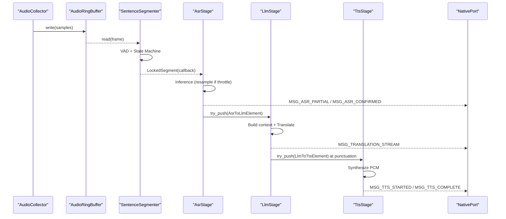
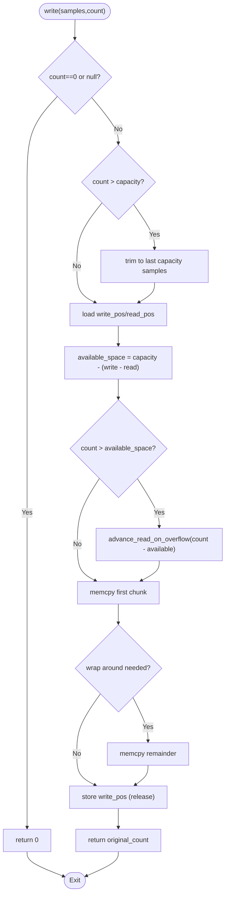
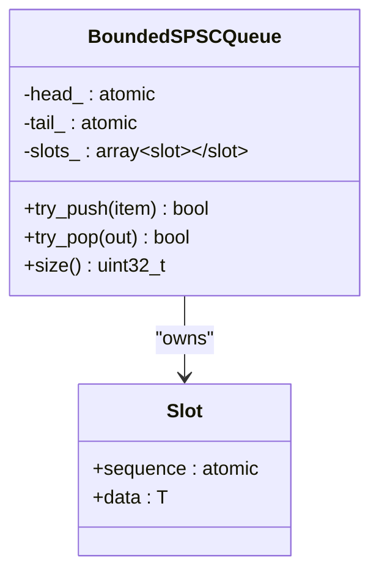
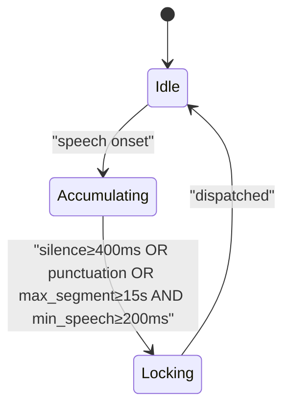
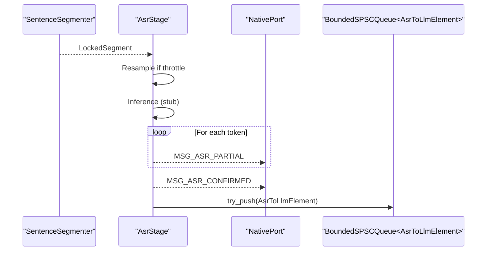
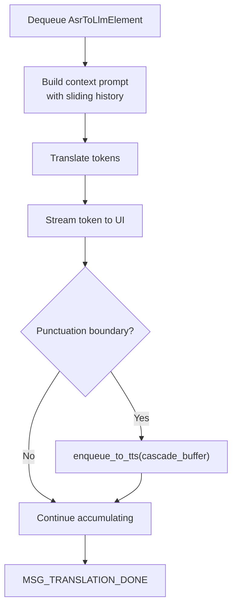
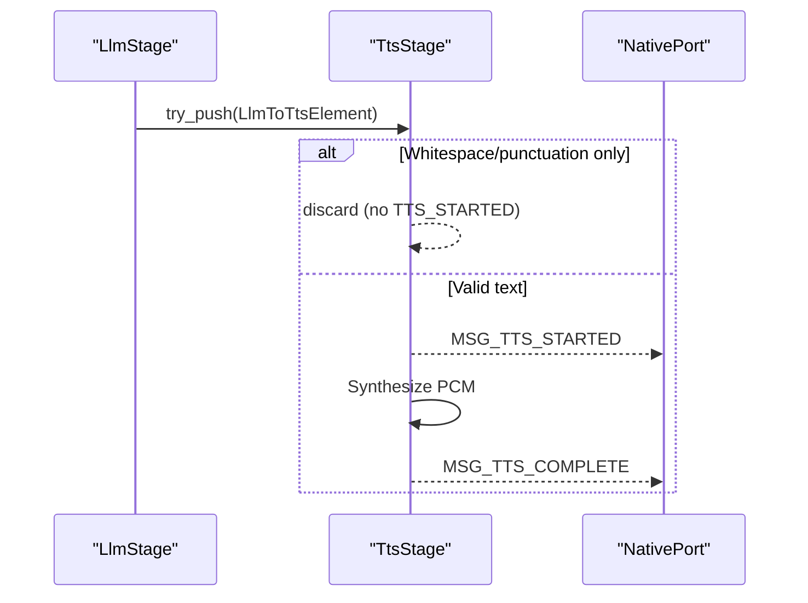
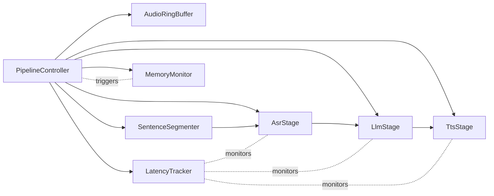

# Data Flow Patterns

<cite>
**Referenced Files in This Document**
- [pipeline_controller.cpp](file://native/src/pipeline_controller.cpp)
- [audio_ring_buffer.h](file://native/include/audio_ring_buffer.h)
- [bounded_spsc_queue.h](file://native/include/bounded_spsc_queue.h)
- [sentence_segmenter.h](file://native/include/sentence_segmenter.h)
- [sentence_segmenter.cpp](file://native/src/sentence_segmenter.cpp)
- [asr_stage.h](file://native/include/asr_stage.h)
- [asr_stage.cpp](file://native/src/asr_stage.cpp)
- [llm_stage.h](file://native/include/llm_stage.h)
- [llm_stage.cpp](file://native/src/llm_stage.cpp)
- [tts_stage.h](file://native/include/tts_stage.h)
- [tts_stage.cpp](file://native/src/tts_stage.cpp)
- [echo_types.h](file://native/include/echo_types.h)
- [latency_tracker.h](file://native/include/latency_tracker.h)
- [memory_monitor.h](file://native/include/memory_monitor.h)
- [native_port.h](file://native/include/native_port.h)
- [native_port.cpp](file://native/src/native_port.cpp)
</cite>

## Table of Contents
1. Introduction
2. Project Structure
3. Core Components
4. Architecture Overview
5. Detailed Component Analysis
6. Dependency Analysis
7. Performance Considerations
8. Troubleshooting Guide
9. Conclusion

## Introduction
This document explains QwenEcho’s real-time audio processing pipeline with a focus on data flow patterns. It details the producer-consumer architecture using lock-free SPSC ring buffers and bounded queues, the cascade truncation strategy for early downstream activation, sentence segmentation with voice activity detection (VAD), and end-to-end latency monitoring. It also covers backpressure handling, buffer overflow protection, and performance metrics for throughput measurement.

## Project Structure
The native layer implements a multi-stage pipeline:
- Audio capture writes to a lock-free SPSC ring buffer.
- A sentence segmenter consumes from the ring buffer, performs VAD, and emits locked segments.
- ASR stage processes locked segments and enqueues confirmed text into an inter-stage queue.
- LLM stage translates text, streams tokens, and uses cascade truncation to push partial translations at punctuation boundaries.
- TTS stage synthesizes speech from translated text chunks.
- Monitors track thermal state, memory pressure, and latency SLAs.

```mermaid
graph TB
subgraph "Audio Capture"
AC["AudioCollector"]
RB["AudioRingBuffer<br/>Lock-free SPSC"]
end
subgraph "Segmentation"
SS["SentenceSegmenter<br/>VAD + State Machine"]
end
subgraph "ASR"
ASR["AsrStage<br/>Worker Thread"]
end
subgraph "LLM"
LLM["LlmStage<br/>Sliding Context + Cascade Truncation"]
end
subgraph "TTS"
TTS["TtsStage<br/>Streaming Synthesis"]
end
subgraph "Monitoring"
LAT["LatencyTracker"]
MEM["MemoryMonitor"]
end
AC --> RB
RB --> SS
SS --> ASR
ASR --> |"BoundedSPSCQueue<br/>AsrToLlmElement"| LLM
LLM --> |"BoundedSPSCQueue<br/>LlmToTtsElement"| TTS
SS -.-> LAT
ASR -.-> LAT
LLM -.-> LAT
TTS -.-> LAT
MEM -.-> AC
```

**Diagram sources**
- [pipeline_controller.cpp:107-126](file://native/src/pipeline_controller.cpp#L107-L126)
- [audio_ring_buffer.h:27-189](file://native/include/audio_ring_buffer.h#L27-L189)
- [bounded_spsc_queue.h:29-142](file://native/include/bounded_spsc_queue.h#L29-L142)
- [sentence_segmenter.h:34-50](file://native/include/sentence_segmenter.h#L34-L50)
- [asr_stage.h:52-79](file://native/include/asr_stage.h#L52-L79)
- [llm_stage.h:60-76](file://native/include/llm_stage.h#L60-L76)
- [tts_stage.h:58-72](file://native/include/tts_stage.h#L58-L72)
- [latency_tracker.h:34-49](file://native/include/latency_tracker.h#L34-L49)
- [memory_monitor.h:25-29](file://native/include/memory_monitor.h#L25-L29)

**Section sources**
- [pipeline_controller.cpp:107-126](file://native/src/pipeline_controller.cpp#L107-L126)

## Core Components
- Lock-free SPSC ring buffer for PCM samples with overwrite-on-overflow policy and cache-line alignment to avoid false sharing.
- Bounded SPSC queue with drop-oldest semantics for inter-stage communication.
- Sentence segmenter with energy-based VAD and a three-state machine (Idle → Accumulating → Locking).
- ASR stage with optional resampling under thermal throttling, streaming partials, and confirmed text enqueue.
- LLM stage with sliding context window, cascade truncation at punctuation, and first-token latency tracking.
- TTS stage with TTFA tracking and robust error handling.
- Latency tracker enforcing per-stage and E2E budgets; memory monitor triggering graceful stop at critical levels.

**Section sources**
- [audio_ring_buffer.h:27-189](file://native/include/audio_ring_buffer.h#L27-L189)
- [bounded_spsc_queue.h:29-142](file://native/include/bounded_spsc_queue.h#L29-L142)
- [sentence_segmenter.h:34-50](file://native/include/sentence_segmenter.h#L34-L50)
- [asr_stage.h:52-79](file://native/include/asr_stage.h#L52-L79)
- [llm_stage.h:60-76](file://native/include/llm_stage.h#L60-L76)
- [tts_stage.h:58-72](file://native/include/tts_stage.h#L58-L72)
- [latency_tracker.h:34-49](file://native/include/latency_tracker.h#L34-L49)
- [memory_monitor.h:25-29](file://native/include/memory_monitor.h#L25-L29)

## Architecture Overview
The pipeline is a linear chain of producers and consumers connected by lock-free SPSC structures. Each stage runs on its own thread, enabling overlapped execution and low-latency cascading.



**Diagram sources**
- [pipeline_controller.cpp:134-139](file://native/src/pipeline_controller.cpp#L134-L139)
- [asr_stage.cpp:167-271](file://native/src/asr_stage.cpp#L167-L271)
- [llm_stage.cpp:243-361](file://native/src/llm_stage.cpp#L243-L361)
- [tts_stage.cpp:191-272](file://native/src/tts_stage.cpp#L191-L272)
- [native_port.cpp:116-300](file://native/src/native_port.cpp#L116-L300)

## Detailed Component Analysis

### Producer-Consumer with Lock-Free SPSC Ring Buffer
- Design highlights:
  - Power-of-two capacity for bitmask indexing.
  - Atomic head/tail with acquire/release ordering.
  - Cache-line separation between write_pos_ and read_pos_.
  - Overflow policy: overwrite oldest samples by advancing read pointer; never blocks producer.
- Backpressure and overflow:
  - Producer checks available space; if insufficient, advances read pointer to make room.
  - Consumer reads up to available count; returns zero when empty.



**Diagram sources**
- [audio_ring_buffer.h:52-91](file://native/include/audio_ring_buffer.h#L52-L91)
- [audio_ring_buffer.h:152-155](file://native/include/audio_ring_buffer.h#L152-L155)

**Section sources**
- [audio_ring_buffer.h:27-189](file://native/include/audio_ring_buffer.h#L27-L189)

### Inter-Stage Queues: BoundedSPSCQueue with Drop-Oldest Semantics
- Slot-based design with sequence numbers for occupancy.
- On overflow, CAS advances head to discard oldest element; then pushes new item without blocking.
- try_pop claims slot via CAS; if CAS fails due to prior overflow, treats as empty.



**Diagram sources**
- [bounded_spsc_queue.h:29-142](file://native/include/bounded_spsc_queue.h#L29-L142)

**Section sources**
- [bounded_spsc_queue.h:29-142](file://native/include/bounded_spsc_queue.h#L29-L142)

### Sentence Segmentation: VAD + State Machine
- Energy-based VAD classifies frames (10ms) as speech or silence.
- State transitions:
  - Idle → Accumulating on speech onset.
  - Accumulating → Locking on 400ms silence, punctuation notification, or 15s force-lock (if ≥200ms speech).
  - Locking → Idle after dispatching a LockedSegment.
- Outputs LockedSegment via callback to ASR stage.



**Diagram sources**
- [sentence_segmenter.h:34-50](file://native/include/sentence_segmenter.h#L34-L50)
- [sentence_segmenter.cpp:145-198](file://native/src/sentence_segmenter.cpp#L145-L198)

**Section sources**
- [sentence_segmenter.h:34-50](file://native/include/sentence_segmenter.h#L34-L50)
- [sentence_segmenter.cpp:145-198](file://native/src/sentence_segmenter.cpp#L145-L198)

### ASR Stage: Streaming Partial Tokens and Confirmed Text
- Worker thread pulls segments, optionally resamples (16kHz→8kHz) under throttle mode.
- Streams partial tokens via Native Port; finalizes confirmed text and enqueues into ASR→LLM queue.
- Discards noise-only segments silently.



**Diagram sources**
- [asr_stage.cpp:167-271](file://native/src/asr_stage.cpp#L167-L271)
- [asr_stage.h:52-79](file://native/include/asr_stage.h#L52-L79)

**Section sources**
- [asr_stage.cpp:167-271](file://native/src/asr_stage.cpp#L167-L271)
- [asr_stage.h:52-79](file://native/include/asr_stage.h#L52-L79)

### LLM Stage: Sliding Context and Cascade Truncation
- Maintains a sliding context window of recent translations (last 3 entries).
- Builds prompt by prepending context entries that fit within active window size (512 tokens normal, 256 throttle).
- Streams translation tokens; at punctuation boundaries (. ! ?), enqueues partial translation to LLM→TTS queue (cascade truncation).
- Tracks first-token latency against budget.



**Diagram sources**
- [llm_stage.cpp:243-361](file://native/src/llm_stage.cpp#L243-L361)
- [llm_stage.h:60-76](file://native/include/llm_stage.h#L60-L76)

**Section sources**
- [llm_stage.cpp:243-361](file://native/src/llm_stage.cpp#L243-L361)
- [llm_stage.h:60-76](file://native/include/llm_stage.h#L60-L76)

### TTS Stage: TTFA Tracking and Robust Error Handling
- Discards whitespace/punctuation-only segments without starting synthesis.
- Sends MSG_TTS_STARTED, synthesizes PCM, tracks TTFA, sends MSG_TTS_COMPLETE.
- On failure, logs and continues to next segment without halting the pipeline.



**Diagram sources**
- [tts_stage.cpp:191-272](file://native/src/tts_stage.cpp#L191-L272)
- [tts_stage.h:58-72](file://native/include/tts_stage.h#L58-L72)

**Section sources**
- [tts_stage.cpp:191-272](file://native/src/tts_stage.cpp#L191-L272)
- [tts_stage.h:58-72](file://native/include/tts_stage.h#L58-L72)

### Data Transformation Examples Across Stages
- Raw audio samples → Locked segments:
  - AudioRingBuffer provides int16 PCM frames consumed by SentenceSegmenter, which emits LockedSegment with sample pointers and metadata.
- Locked segments → ASR text:
  - AsrStage produces MSG_ASR_PARTIAL and MSG_ASR_CONFIRMED, and enqueues AsrToLlmElement into the ASR→LLM queue.
- ASR text → Translation tokens:
  - LlmStage streams MSG_TRANSLATION_STREAM tokens and enqueues LlmToTtsElement at punctuation boundaries.
- Translation tokens → TTS output:
  - TtsStage synthesizes PCM (24kHz, 16-bit, mono) and posts lifecycle messages.

**Section sources**
- [echo_types.h:68-86](file://native/include/echo_types.h#L68-86)
- [asr_stage.cpp:245-271](file://native/src/asr_stage.cpp#L245-L271)
- [llm_stage.cpp:281-341](file://native/src/llm_stage.cpp#L281-L341)
- [tts_stage.cpp:214-272](file://native/src/tts_stage.cpp#L214-L272)

## Dependency Analysis
Inter-component dependencies are primarily through well-defined queues and callbacks. The PipelineController wires components and manages lifecycle.



**Diagram sources**
- [pipeline_controller.cpp:107-126](file://native/src/pipeline_controller.cpp#L107-L126)
- [latency_tracker.h:34-49](file://native/include/latency_tracker.h#L34-L49)
- [memory_monitor.h:25-29](file://native/include/memory_monitor.h#L25-L29)

**Section sources**
- [pipeline_controller.cpp:107-126](file://native/src/pipeline_controller.cpp#L107-L126)

## Performance Considerations
- Zero-contention transfer:
  - AudioRingBuffer uses lock-free SPSC with power-of-two sizing and cache-line alignment to minimize false sharing.
  - BoundedSPSCQueue avoids locks and uses CAS for safe head advancement during overflow.
- Backpressure and overflow protection:
  - Ring buffer overwrites oldest samples when full; consumer can detect drops via available() and upstream notifications.
  - Bounded queues drop oldest elements on overflow; producers continue without blocking.
- Latency optimization:
  - Cascade truncation allows TTS to start before full translation completes.
  - Thermal throttling reduces ASR/LLM load by resampling and shrinking context windows.
- Monitoring:
  - Per-stage and E2E latency budgets enforced by LatencyTracker; warnings posted via NativePort.
  - MemoryMonitor triggers graceful stop at critical levels.

[No sources needed since this section provides general guidance]

## Troubleshooting Guide
- No audio output:
  - Verify TTS discarded segments are not the only input; check should_discard logic and ensure non-whitespace content.
- High latency warnings:
  - Inspect per-stage budgets and actual latencies reported via MSG_LATENCY_WARNING.
  - Confirm thermal mode adjustments and context window sizes.
- Sample drops:
  - Monitor MSG_SAMPLE_DROP events; consider increasing ring buffer capacity or reducing upstream production rate.
- Graceful stop behavior:
  - At memory level critical, pipeline stops gracefully; ensure downstream flush completes within deadline.

**Section sources**
- [tts_stage.cpp:112-127](file://native/src/tts_stage.cpp#L112-L127)
- [latency_tracker.h:34-49](file://native/include/latency_tracker.h#L34-L49)
- [memory_monitor.h:25-29](file://native/include/memory_monitor.h#L25-L29)
- [native_port.cpp:283-300](file://native/src/native_port.cpp#L283-L300)

## Conclusion
QwenEcho’s pipeline leverages lock-free SPSC primitives and cascade truncation to achieve low-latency, high-throughput real-time audio processing. The combination of VAD-driven segmentation, streaming ASR/LLM/TTS stages, and robust backpressure mechanisms ensures responsive user experience even under high-load conditions. Continuous monitoring via latency and memory trackers enables proactive adaptation and graceful degradation.