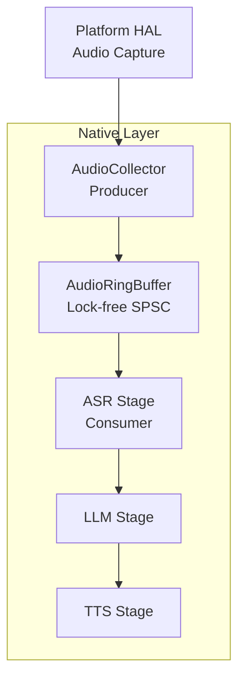
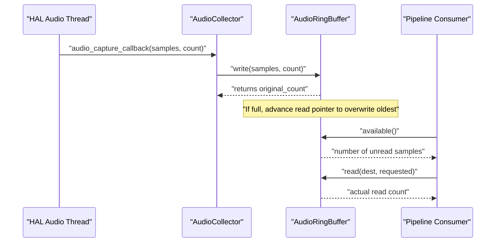
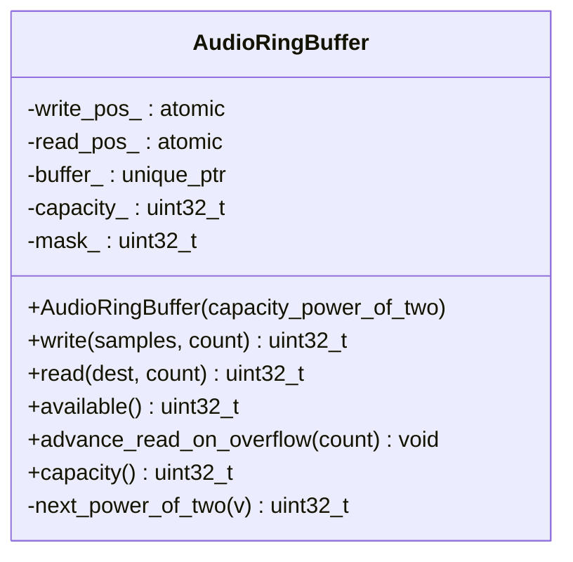
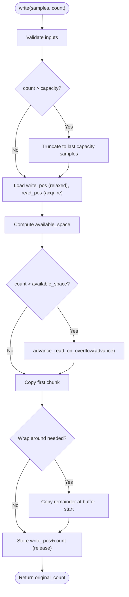
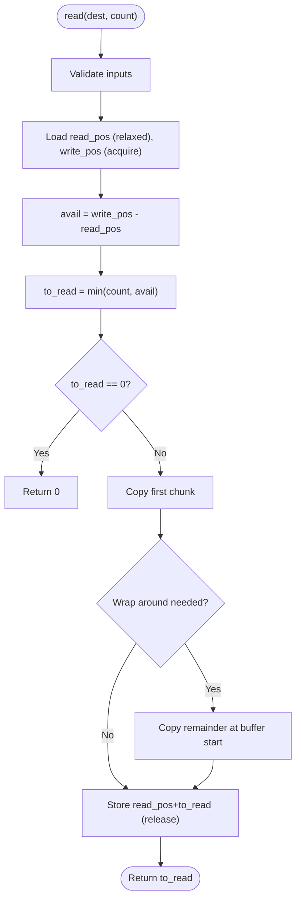
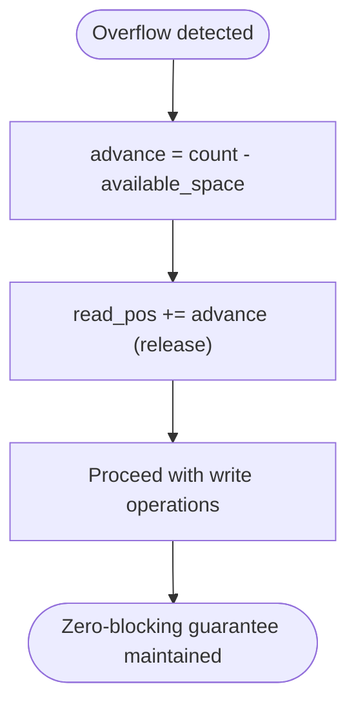
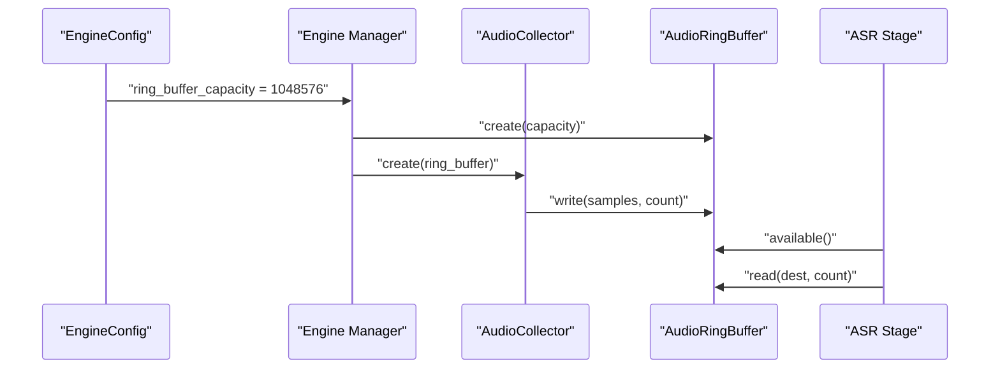
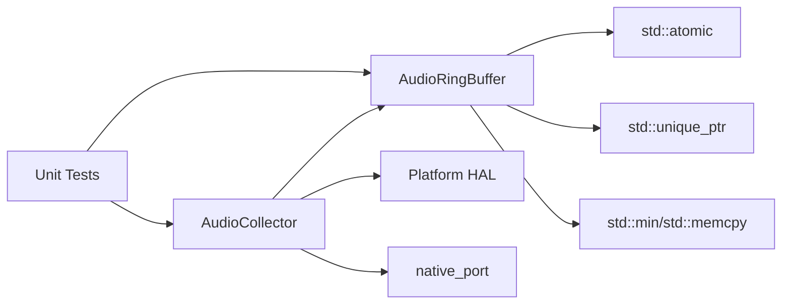

# Ring Buffer Implementation

<cite>
**Referenced Files in This Document**
- [audio_ring_buffer.h](file://native/include/audio_ring_buffer.h)
- [audio_collector.h](file://native/include/audio_collector.h)
- [audio_collector.cpp](file://native/src/audio_collector.cpp)
- [echo_types.h](file://native/include/echo_types.h)
- [test_audio_collector.cpp](file://native/tests/test_audio_collector.cpp)
</cite>

## Table of Contents
1. [Introduction](#introduction)
2. [Project Structure](#project-structure)
3. [Core Components](#core-components)
4. [Architecture Overview](#architecture-overview)
5. [Detailed Component Analysis](#detailed-component-analysis)
6. [Dependency Analysis](#dependency-analysis)
7. [Performance Considerations](#performance-considerations)
8. [Troubleshooting Guide](#troubleshooting-guide)
9. [Conclusion](#conclusion)

## Introduction
This document explains the AudioRingBuffer implementation used by QwenEcho for real-time audio streaming. It is a lock-free, single-producer single-consumer (SPSC) circular buffer designed for 16-bit PCM samples. The design emphasizes zero-blocking writes with an overwrite policy, power-of-two capacity optimization via bitmask modulo, and carefully chosen atomic memory orderings to ensure correctness between producer and consumer threads. Cache-line alignment prevents false sharing, and integration points with the audio pipeline are documented.

## Project Structure
The ring buffer is implemented as a C++ class and integrated into the native layer:
- Header-only API definition for the ring buffer
- Producer side: AudioCollector captures platform audio and writes to the ring buffer
- Consumer side: Pipeline stages read from the ring buffer
- Configuration includes default ring buffer capacity

**Diagram sources**
- [audio_ring_buffer.h](file://native/include/audio_ring_buffer.h)
- [audio_collector.h](file://native/include/audio_collector.h)
- [audio_collector.cpp](file://native/src/audio_collector.cpp)

**Section sources**
- [audio_ring_buffer.h](file://native/include/audio_ring_buffer.h)
- [audio_collector.h](file://native/include/audio_collector.h)
- [audio_collector.cpp](file://native/src/audio_collector.cpp)
- [echo_types.h](file://native/include/echo_types.h)

## Core Components
- AudioRingBuffer: Lock-free SPSC circular buffer with:
  - Power-of-two capacity and bitmask-based index wrapping
  - Atomic head/tail indices with acquire/release semantics
  - 64-byte cache-line alignment to avoid false sharing
  - Overflow handling that advances the read pointer to overwrite oldest samples
- AudioCollector: Real-time producer that writes captured PCM samples to the ring buffer without blocking
- Integration points:
  - Engine configuration provides ring buffer capacity
  - Tests demonstrate write/read flows and wrap-around behavior

Key responsibilities:
- Producer (AudioCollector): call write() on each audio callback; never blocks
- Consumer (pipeline stages): call available(), then read() to consume data

**Section sources**
- [audio_ring_buffer.h](file://native/include/audio_ring_buffer.h)
- [audio_collector.h](file://native/include/audio_collector.h)
- [audio_collector.cpp](file://native/src/audio_collector.cpp)
- [echo_types.h](file://native/include/echo_types.h)

## Architecture Overview
The ring buffer sits between the real-time audio capture thread and the processing pipeline. The producer writes continuously; if the buffer would overflow, the oldest samples are discarded by advancing the read pointer, ensuring zero-blocking behavior.

**Diagram sources**
- [audio_collector.cpp](file://native/src/audio_collector.cpp)
- [audio_ring_buffer.h](file://native/include/audio_ring_buffer.h)

## Detailed Component Analysis

### AudioRingBuffer Class Design
- Capacity management:
  - Constructor rounds input capacity up to the next power of two
  - Maintains mask_ = capacity_ - 1 for efficient index wrapping using bitwise AND
- Memory layout:
  - Sample storage is a contiguous array of int16_t
  - write_pos_ and read_pos_ are aligned to 64 bytes to prevent false sharing
- Atomic indices:
  - write_pos_: modified only by producer
  - read_pos_: modified only by consumer; producer reads it during overflow handling
- Memory ordering:
  - Producer uses release store when publishing write_pos_
  - Consumer uses acquire load when reading write_pos_
  - Similar acquire/release semantics apply to read_pos_ updates and reads
- Overflow policy:
  - If writing more than available space, compute advance = count - available_space
  - Advance read pointer by advance to discard oldest samples
  - Ensures producer never blocks

**Diagram sources**
- [audio_ring_buffer.h](file://native/include/audio_ring_buffer.h)

**Section sources**
- [audio_ring_buffer.h](file://native/include/audio_ring_buffer.h)

### Write Operation Flow
- Input validation: return early if count == 0 or samples is null
- Truncate oversized writes to capacity_
- Compute available space as capacity_ - (write_pos - read_pos)
- If overflow:
  - Calculate advance = count - available_space
  - Call advance_read_on_overflow(advance) to discard oldest samples
- Perform memcpy in two chunks to handle wrap-around:
  - first_chunk = min(count, capacity_ - start_idx)
  - second chunk copies remaining samples at buffer start
- Publish new write position with release ordering

**Diagram sources**
- [audio_ring_buffer.h](file://native/include/audio_ring_buffer.h)

**Section sources**
- [audio_ring_buffer.h](file://native/include/audio_ring_buffer.h)

### Read Operation Flow
- Input validation: return early if count == 0 or dest is null
- Load read_pos (relaxed) and write_pos (acquire)
- Compute avail = write_pos - read_pos
- Determine to_read = min(count, avail)
- If to_read == 0, return immediately
- Perform memcpy in two chunks to handle wrap-around:
  - first_chunk = min(to_read, capacity_ - start_idx)
  - second chunk copies remaining samples at buffer start
- Publish new read position with release ordering

**Diagram sources**
- [audio_ring_buffer.h](file://native/include/audio_ring_buffer.h)

**Section sources**
- [audio_ring_buffer.h](file://native/include/audio_ring_buffer.h)

### Overflow Handling Mechanism
- When the producer attempts to write more samples than available space, it computes how many oldest samples must be discarded
- It advances the read pointer by that amount, effectively overwriting the oldest data
- This ensures the producer never blocks and maintains real-time guarantees
- The consumer will see fewer samples than produced but always receives the most recent data

**Diagram sources**
- [audio_ring_buffer.h](file://native/include/audio_ring_buffer.h)

**Section sources**
- [audio_ring_buffer.h](file://native/include/audio_ring_buffer.h)

### Power-of-Two Optimization and Bitmask Operations
- Capacity is rounded up to the next power of two during construction
- mask_ = capacity_ - 1 enables efficient modulo operations via bitwise AND
- Index wrapping becomes: index & mask_ instead of expensive division/modulo
- This optimization reduces computational overhead in hot paths

**Section sources**
- [audio_ring_buffer.h](file://native/include/audio_ring_buffer.h)

### Atomic Memory Ordering Strategy
- Producer uses:
  - Relaxed load of read_pos_ during write operations
  - Release store of write_pos_ after publishing new data
- Consumer uses:
  - Acquire load of write_pos_ to observe published data
  - Release store of read_pos_ after consuming data
- This acquire-release pairing ensures proper synchronization without locks
- Relaxed loads are used for positions that don't require immediate visibility

**Section sources**
- [audio_ring_buffer.h](file://native/include/audio_ring_buffer.h)

### Cache-Line Alignment and False Sharing Prevention
- write_pos_ and read_pos_ are aligned to 64 bytes using alignas(64)
- This prevents false sharing where both threads might invalidate each other's cache lines
- Each atomic position resides on its own cache line, optimizing performance

**Section sources**
- [audio_ring_buffer.h](file://native/include/audio_ring_buffer.h)

### Integration with Audio Pipeline
- AudioCollector acts as the producer, receiving samples from platform HAL
- Pipeline stages (ASR, LLM, TTS) act as consumers, reading from the ring buffer
- Engine configuration specifies ring buffer capacity (default 1048576 samples)

**Diagram sources**
- [echo_types.h](file://native/include/echo_types.h)
- [audio_collector.h](file://native/include/audio_collector.h)
- [audio_collector.cpp](file://native/src/audio_collector.cpp)
- [audio_ring_buffer.h](file://native/include/audio_ring_buffer.h)

**Section sources**
- [echo_types.h](file://native/include/echo_types.h)
- [audio_collector.h](file://native/include/audio_collector.h)
- [audio_collector.cpp](file://native/src/audio_collector.cpp)

### Usage Examples from Tests
- Basic write/read cycle:
  - Create ring buffer with capacity 1024
  - Write 160 samples via callback simulation
  - Verify available() returns 160
  - Read all samples and verify data integrity
- Multiple callbacks accumulation:
  - Deliver three batches of 80 samples each
  - Verify accumulated count is 240
- Stop behavior:
  - After stopping, subsequent callbacks are ignored
  - Ring buffer remains empty

**Section sources**
- [test_audio_collector.cpp](file://native/tests/test_audio_collector.cpp)

## Dependency Analysis
The ring buffer has minimal dependencies and clear separation of concerns:

**Diagram sources**
- [audio_ring_buffer.h](file://native/include/audio_ring_buffer.h)
- [audio_collector.cpp](file://native/src/audio_collector.cpp)
- [test_audio_collector.cpp](file://native/tests/test_audio_collector.cpp)

**Section sources**
- [audio_ring_buffer.h](file://native/include/audio_ring_buffer.h)
- [audio_collector.cpp](file://native/src/audio_collector.cpp)
- [test_audio_collector.cpp](file://native/tests/test_audio_collector.cpp)

## Performance Considerations
- Zero-blocking writes: Producer never waits, critical for real-time audio
- Bitmask modulo: O(1) index wrapping vs O(log n) division operations
- Cache-line alignment: Eliminates false sharing between producer/consumer
- Minimal atomic operations: Only necessary synchronization points use acquire/release
- Contiguous memory layout: Efficient memcpy operations for bulk sample transfer
- Overwrite policy: Prevents buffer starvation under high load conditions

## Troubleshooting Guide
Common issues and their solutions:

- **Buffer overflow symptoms**: 
  - Missing older audio samples in consumption
  - Solution: Increase ring buffer capacity or improve consumer throughput
  
- **Stuttering or gaps in audio**:
  - Check sample drop detection thresholds
  - Verify consumer processing latency doesn't exceed producer rate
  
- **Memory corruption**:
  - Ensure single producer/single consumer contract is maintained
  - Verify no concurrent access from multiple threads
  
- **Performance degradation**:
  - Monitor cache miss rates due to potential false sharing
  - Verify proper cache-line alignment is maintained

**Section sources**
- [audio_collector.cpp](file://native/src/audio_collector.cpp)
- [audio_ring_buffer.h](file://native/include/audio_ring_buffer.h)

## Conclusion
The AudioRingBuffer implementation provides a robust, high-performance foundation for real-time audio processing in QwenEcho. Its lock-free SPSC design, combined with power-of-two optimizations, careful memory ordering, and cache-line alignment, ensures predictable low-latency performance. The overwrite overflow policy guarantees system stability under varying load conditions, while the clean separation between producer and consumer facilitates maintainable integration with the broader audio pipeline.