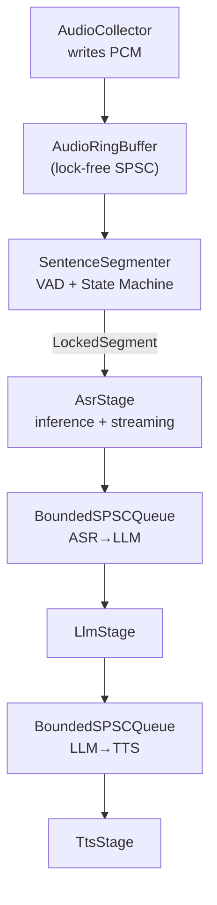
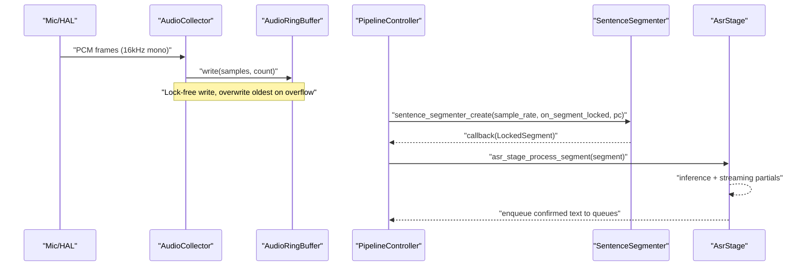
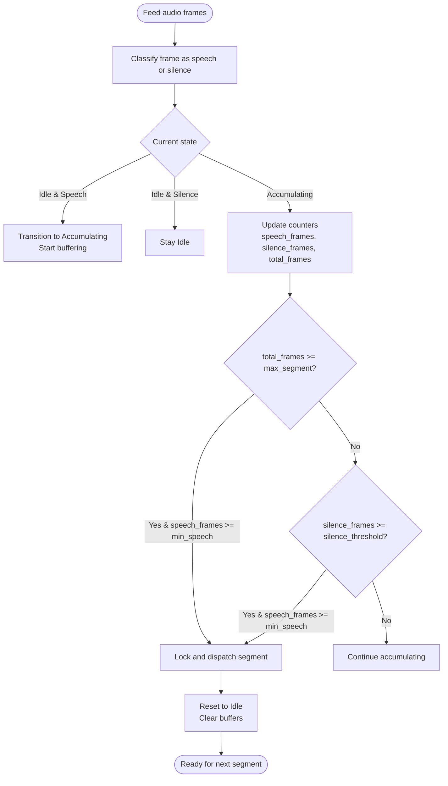
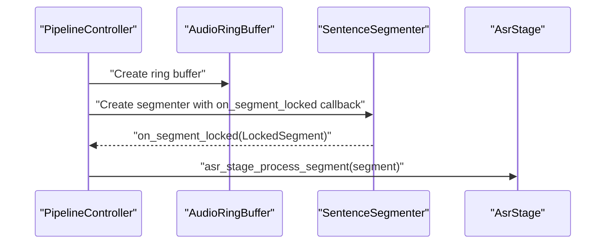
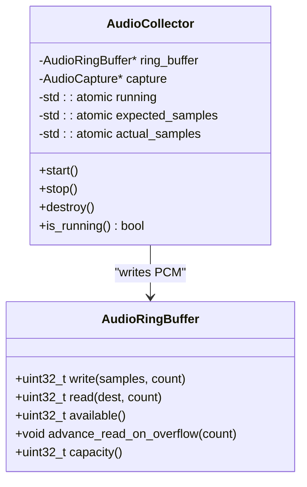
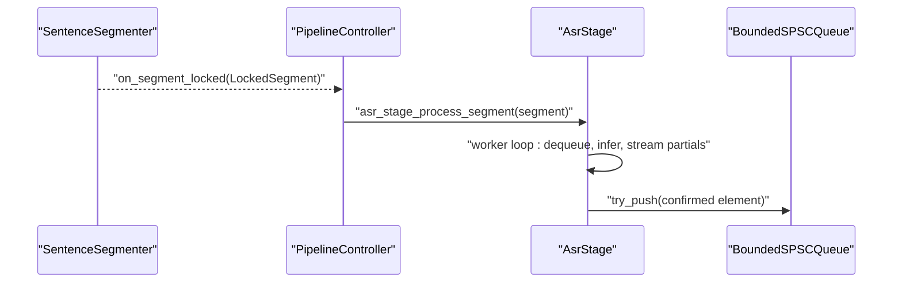
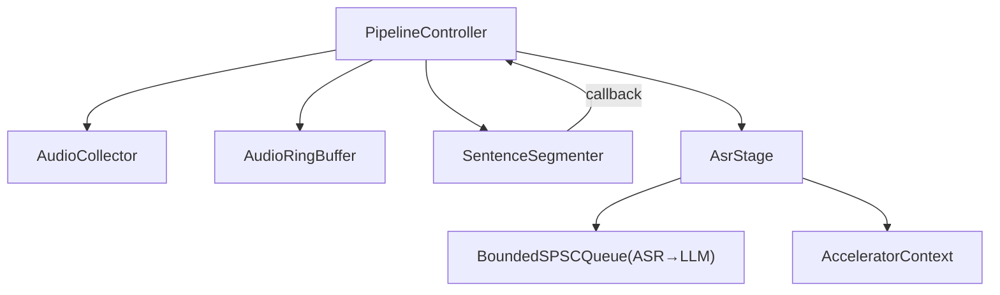

# Sentence Segmentation

<cite>
**Referenced Files in This Document**
- [sentence_segmenter.h](file://native/include/sentence_segmenter.h)
- [sentence_segmenter.cpp](file://native/src/sentence_segmenter.cpp)
- [audio_ring_buffer.h](file://native/include/audio_ring_buffer.h)
- [audio_collector.h](file://native/include/audio_collector.h)
- [audio_collector.cpp](file://native/src/audio_collector.cpp)
- [asr_stage.h](file://native/include/asr_stage.h)
- [asr_stage.cpp](file://native/src/asr_stage.cpp)
- [pipeline_controller.h](file://native/include/pipeline_controller.h)
- [pipeline_controller.cpp](file://native/src/pipeline_controller.cpp)
- [bounded_spsc_queue.h](file://native/include/bounded_spsc_queue.h)
- [test_sentence_segmenter.cpp](file://native/tests/test_sentence_segmenter.cpp)
</cite>

## Table of Contents
1. [Introduction](#introduction)
2. [Project Structure](#project-structure)
3. [Core Components](#core-components)
4. [Architecture Overview](#architecture-overview)
5. [Detailed Component Analysis](#detailed-component-analysis)
6. [Dependency Analysis](#dependency-analysis)
7. [Performance Considerations](#performance-considerations)
8. [Troubleshooting Guide](#troubleshooting-guide)
9. [Conclusion](#conclusion)

## Introduction
This document explains QwenEcho’s sentence segmentation system focused on voice activity detection (VAD) and speech boundary identification. It details how continuous audio is segmented into processable units using energy-based VAD, a state machine for silence periods and natural breaks, and integration with the audio ring buffer to consume raw PCM samples. The LockedSegment data structure carries per-segment metadata such as timestamps and speaker identification. Configuration parameters for sensitivity thresholds, minimum segment duration, and maximum segment length are documented, along with performance considerations for real-time processing and accuracy trade-offs in noisy environments.

## Project Structure
The sentence segmentation subsystem resides in native code and integrates with the broader pipeline:
- Audio capture writes PCM into a lock-free ring buffer.
- The sentence segmenter consumes frames from the ring buffer via a callback-driven flow orchestrated by the pipeline controller.
- When a segment is locked, it is dispatched to the ASR stage for transcription.

**Diagram sources**
- [audio_collector.cpp:93-128](file://native/src/audio_collector.cpp#L93-L128)
- [audio_ring_buffer.h:27-189](file://native/include/audio_ring_buffer.h#L27-L189)
- [sentence_segmenter.cpp:206-327](file://native/src/sentence_segmenter.cpp#L206-L327)
- [asr_stage.cpp:295-318](file://native/src/asr_stage.cpp#L295-L318)
- [bounded_spsc_queue.h:29-142](file://native/include/bounded_spsc_queue.h#L29-L142)
- [pipeline_controller.cpp:134-139](file://native/src/pipeline_controller.cpp#L134-L139)

**Section sources**
- [audio_collector.h:1-95](file://native/include/audio_collector.h#L1-L95)
- [audio_ring_buffer.h:1-192](file://native/include/audio_ring_buffer.h#L1-L192)
- [sentence_segmenter.h:1-142](file://native/include/sentence_segmenter.h#L1-L142)
- [asr_stage.h:1-104](file://native/include/asr_stage.h#L1-L104)
- [pipeline_controller.h:1-107](file://native/include/pipeline_controller.h#L1-L107)

## Core Components
- AudioRingBuffer: Lock-free single-producer single-consumer circular buffer for 16-bit PCM samples with overwrite-on-overflow policy.
- AudioCollector: Real-time thread that captures PCM at 16kHz mono and writes to the ring buffer; detects sample drops.
- SentenceSegmenter: Energy-based VAD plus a three-state machine (Idle → Accumulating → Locking) to detect silence periods, punctuation-triggered boundaries, and force-lock after long segments. Produces LockedSegment instances via callback.
- AsrStage: Consumes LockedSegments, performs inference (stubbed), streams partial tokens, enqueues confirmed text to downstream stages.
- PipelineController: Orchestrates creation, wiring, and lifecycle of all components; connects segmenter callbacks to ASR.

Key responsibilities:
- Ring buffer provides low-latency, non-blocking transport between capture and processing.
- Segmenter ensures segments meet minimum speech requirements before locking and handles multiple boundary triggers.
- ASR stage decouples transcription from segmentation and supports thermal throttling.

**Section sources**
- [audio_ring_buffer.h:27-189](file://native/include/audio_ring_buffer.h#L27-L189)
- [audio_collector.cpp:93-128](file://native/src/audio_collector.cpp#L93-L128)
- [sentence_segmenter.h:31-142](file://native/include/sentence_segmenter.h#L31-L142)
- [asr_stage.h:34-104](file://native/include/asr_stage.h#L34-L104)
- [pipeline_controller.cpp:134-139](file://native/src/pipeline_controller.cpp#L134-L139)

## Architecture Overview
End-to-end flow from microphone to transcription:
- AudioCollector runs at high priority, writing PCM to the ring buffer.
- PipelineController wires the SentenceSegmenter to read from the ring buffer and dispatch LockedSegments to AsrStage.
- AsrStage processes segments asynchronously, emitting partials and confirmed text.

**Diagram sources**
- [audio_collector.cpp:93-128](file://native/src/audio_collector.cpp#L93-L128)
- [pipeline_controller.cpp:331-337](file://native/src/pipeline_controller.cpp#L331-L337)
- [sentence_segmenter.cpp:115-140](file://native/src/sentence_segmenter.cpp#L115-L140)
- [asr_stage.cpp:295-318](file://native/src/asr_stage.cpp#L295-L318)

## Detailed Component Analysis

### Sentence Segmenter: Algorithm and Data Structures
- VAD: Energy-based classification per 10ms frame (160 samples at 16kHz). A frame is classified as speech if its mean absolute amplitude exceeds a fixed threshold.
- State machine:
  - Idle: Waits for speech onset.
  - Accumulating: Buffers audio and counts speech vs silence frames.
  - Locking: Transient state during dispatch; resets to Idle afterward.
- Lock conditions:
  - Silence period ≥ configured silence threshold after accumulating ≥ minimum speech duration.
  - Punctuation notification while in Accumulating and meeting minimum speech.
  - Force-lock when total segment duration reaches maximum segment length and minimum speech is met.
- Minimum segment requirement: At least min_speech_ms of speech must be accumulated before any lock occurs.
- Output: LockedSegment contains pointers to audio data, sample count, auto-incrementing segment ID, speaker ID, and timestamp in milliseconds.

**Diagram sources**
- [sentence_segmenter.cpp:85-96](file://native/src/sentence_segmenter.cpp#L85-96)
- [sentence_segmenter.cpp:145-198](file://native/src/sentence_segmenter.cpp#L145-L198)
- [sentence_segmenter.cpp:115-140](file://native/src/sentence_segmenter.cpp#L115-L140)

#### LockedSegment Data Structure
- Fields:
  - audio_data: Pointer to segment audio samples.
  - sample_count: Number of samples in the segment.
  - segment_id: Auto-incrementing identifier.
  - speaker_id: Speaker identifier (0 or 1).
  - timestamp_ms: Approximate timestamp when segment was locked.
- Validity: The pointer is valid only during the callback invocation; consumers should copy or enqueue the segment promptly.

**Section sources**
- [sentence_segmenter.h:41-57](file://native/include/sentence_segmenter.h#L41-L57)
- [sentence_segmenter.cpp:115-140](file://native/src/sentence_segmenter.cpp#L115-L140)

#### Configuration Parameters
- sentence_segmenter_configure(silence_threshold_ms, min_speech_ms, max_segment_ms):
  - silence_threshold_ms: Duration of continuous silence required to trigger lock (default 400ms).
  - min_speech_ms: Minimum speech duration required before any lock (default 200ms).
  - max_segment_ms: Maximum segment duration before force-lock (default 15000ms).
- Frame size: Fixed at 10ms (160 samples at 16kHz).
- Threshold recalculation: Internal conversion from ms to frames based on sample rate and frame size.

**Section sources**
- [sentence_segmenter.h:77-87](file://native/include/sentence_segmenter.h#L77-L87)
- [sentence_segmenter.cpp:101-110](file://native/src/sentence_segmenter.cpp#L101-L110)
- [sentence_segmenter.cpp:239-249](file://native/src/sentence_segmenter.cpp#L239-L249)

#### Integration with Audio Ring Buffer
- PipelineController creates the ring buffer and passes it to AudioCollector.
- SentenceSegmenter is created with a callback that routes LockedSegments to AsrStage.
- While the segmenter API exposes feed_audio for direct usage, in the pipeline, the controller orchestrates consumption from the ring buffer and feeding into the segmenter.

**Diagram sources**
- [pipeline_controller.cpp:297-337](file://native/src/pipeline_controller.cpp#L297-L337)
- [pipeline_controller.cpp:134-139](file://native/src/pipeline_controller.cpp#L134-L139)

**Section sources**
- [pipeline_controller.cpp:297-337](file://native/src/pipeline_controller.cpp#L297-L337)
- [audio_ring_buffer.h:27-189](file://native/include/audio_ring_buffer.h#L27-L189)

### Audio Collector and Ring Buffer
- AudioCollector:
  - Runs at real-time priority.
  - Writes PCM frames directly to the ring buffer without blocking.
  - Detects sample drops by comparing expected vs actual cumulative sample counts and reports via native port.
- AudioRingBuffer:
  - Power-of-two capacity for efficient modulo operations.
  - Overwrite policy: advances read pointer to make room when producer would overflow.
  - Thread-safe for one producer and one consumer with atomic positions and cache-line alignment.

**Diagram sources**
- [audio_ring_buffer.h:27-189](file://native/include/audio_ring_buffer.h#L27-L189)
- [audio_collector.cpp:47-74](file://native/src/audio_collector.cpp#L47-L74)
- [audio_collector.cpp:93-128](file://native/src/audio_collector.cpp#L93-L128)

**Section sources**
- [audio_collector.h:1-95](file://native/include/audio_collector.h#L1-L95)
- [audio_collector.cpp:93-128](file://native/src/audio_collector.cpp#L93-L128)
- [audio_ring_buffer.h:27-189](file://native/include/audio_ring_buffer.h#L27-L189)

### ASR Stage Integration
- Receives LockedSegments from the segmenter callback.
- Enqueues segments for asynchronous processing on a worker thread.
- Supports thermal throttling by resampling to 8kHz in throttle mode.
- Streams partial tokens and enqueues confirmed text into bounded queues for downstream stages.

**Diagram sources**
- [sentence_segmenter.cpp:115-140](file://native/src/sentence_segmenter.cpp#L115-L140)
- [pipeline_controller.cpp:134-139](file://native/src/pipeline_controller.cpp#L134-L139)
- [asr_stage.cpp:295-318](file://native/src/asr_stage.cpp#L295-L318)
- [bounded_spsc_queue.h:51-85](file://native/include/bounded_spsc_queue.h#L51-L85)

**Section sources**
- [asr_stage.h:58-97](file://native/include/asr_stage.h#L58-L97)
- [asr_stage.cpp:167-271](file://native/src/asr_stage.cpp#L167-L271)
- [bounded_spsc_queue.h:29-142](file://native/include/bounded_spsc_queue.h#L29-L142)

## Dependency Analysis
- Coupling:
  - PipelineController depends on all major components and wires them together.
  - SentenceSegmenter depends on configuration and callback mechanism; does not depend on ring buffer directly in its API but is integrated via controller.
  - AsrStage depends on bounded queue and accelerator context.
- Cohesion:
  - Each component encapsulates specific responsibilities: capture, buffering, segmentation, transcription, translation, synthesis.
- External dependencies:
  - HAL audio and accelerator interfaces abstract platform specifics.
  - Native port used for reporting events like sample drops and latency warnings.

**Diagram sources**
- [pipeline_controller.cpp:297-337](file://native/src/pipeline_controller.cpp#L297-L337)
- [asr_stage.cpp:277-293](file://native/src/asr_stage.cpp#L277-L293)

**Section sources**
- [pipeline_controller.cpp:107-126](file://native/src/pipeline_controller.cpp#L107-L126)
- [asr_stage.h:34-53](file://native/include/asr_stage.h#L34-L53)

## Performance Considerations
- Real-time constraints:
  - AudioCollector runs at RT priority; ring buffer writes are lock-free and never block.
  - SentenceSegmenter processes 10ms frames; energy computation is O(n) per frame and designed to complete within tight budgets.
- Throughput and latency:
  - Ring buffer capacity (~65.5 seconds at 16kHz) prevents backpressure under normal operation.
  - Overwrite policy ensures no blocking even if consumer lags; oldest samples are discarded.
- Accuracy trade-offs:
  - Energy-based VAD may misclassify in noisy environments; increasing silence_threshold_ms can reduce false locks but may delay segmentation.
  - Lowering min_speech_ms increases responsiveness but risks fragmenting short utterances.
  - max_segment_ms acts as a safety valve to prevent excessively long segments; tuning balances completeness vs latency.
- Thermal throttling:
  - ASR stage can downsample to 8kHz to reduce compute load, trading off transcription quality for lower CPU/NPU usage.

[No sources needed since this section provides general guidance]

## Troubleshooting Guide
- No segments produced:
  - Verify speech onset transitions to Accumulating and that min_speech_ms is met before silence-based locks.
  - Confirm punctuation notifications are issued only when in Accumulating state and sufficient speech has been accumulated.
- Excessive fragmentation:
  - Increase min_speech_ms to require longer speech before locking.
  - Adjust silence_threshold_ms upward to tolerate brief pauses.
- Late locks or missed boundaries:
  - Reduce silence_threshold_ms to lock sooner after pauses.
  - Ensure punctuation notifications are timely and accurate.
- High noise environment:
  - Consider raising VAD energy threshold or integrating a more robust VAD model.
  - Use thermal throttling judiciously; downsampling may degrade recognition quality.
- Sample drops:
  - Monitor drop reports from AudioCollector; investigate platform audio scheduling and buffer sizes.

**Section sources**
- [test_sentence_segmenter.cpp:133-170](file://native/tests/test_sentence_segmenter.cpp#L133-L170)
- [test_sentence_segmenter.cpp:172-207](file://native/tests/test_sentence_segmenter.cpp#L172-L207)
- [test_sentence_segmenter.cpp:297-315](file://native/tests/test_sentence_segmenter.cpp#L297-L315)
- [audio_collector.cpp:116-127](file://native/src/audio_collector.cpp#L116-L127)

## Conclusion
QwenEcho’s sentence segmentation system combines an efficient energy-based VAD with a robust state machine to identify natural speech boundaries. The design emphasizes real-time performance through lock-free buffering and asynchronous processing, while offering configurable thresholds to balance responsiveness and accuracy. Integration with the pipeline controller ensures seamless routing of LockedSegments to ASR and beyond, supporting scalable and maintainable architecture across capture, segmentation, transcription, translation, and synthesis stages.