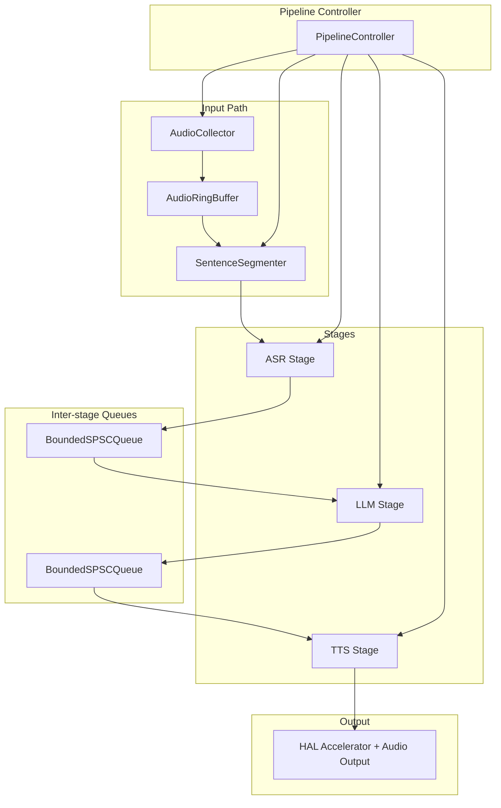
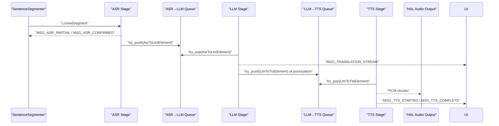
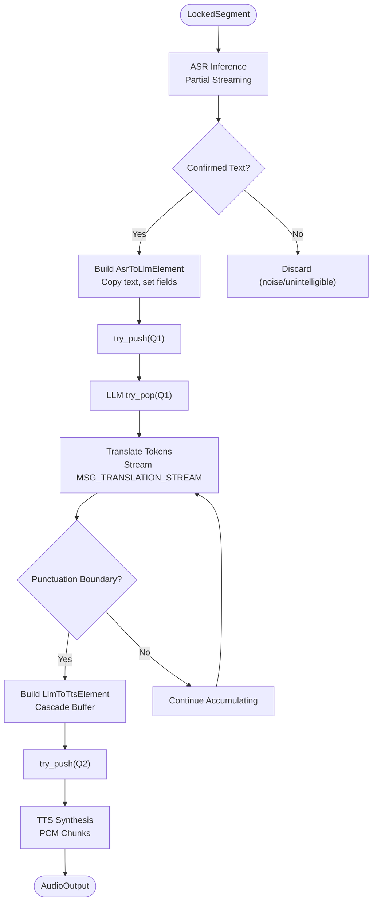
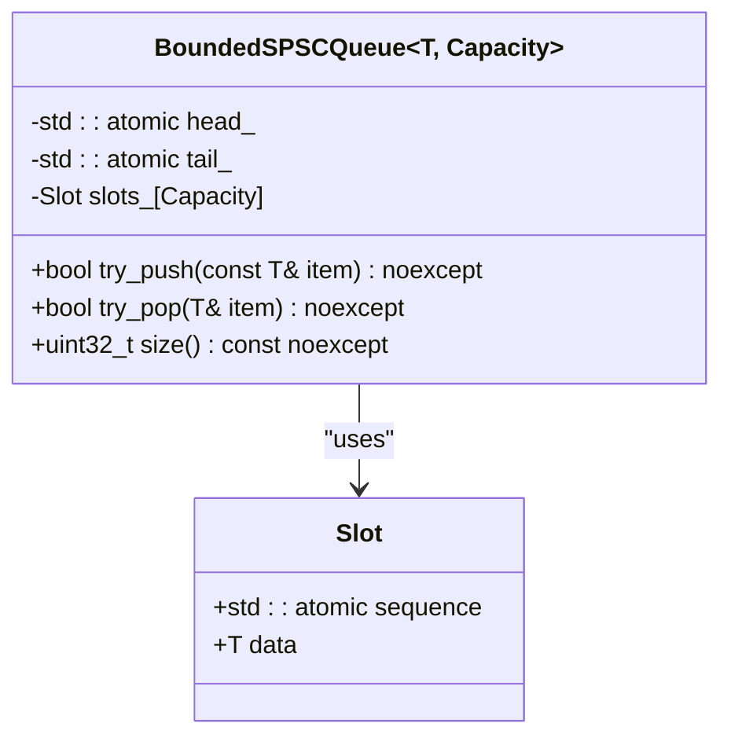
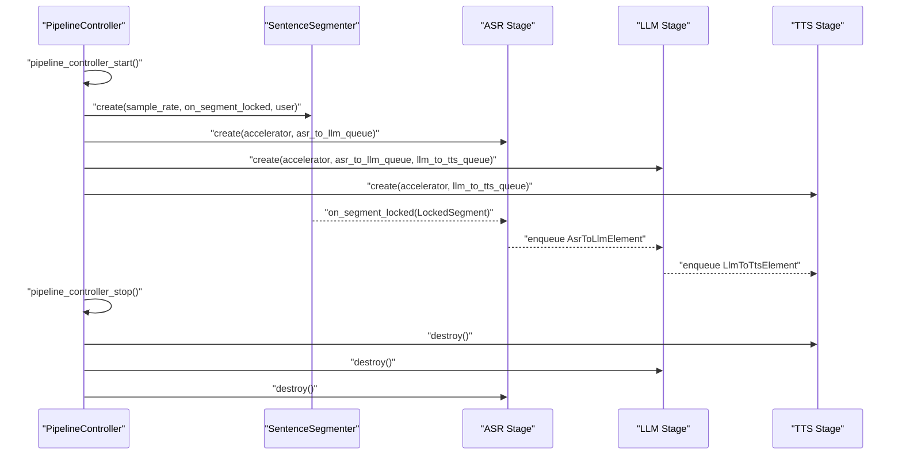
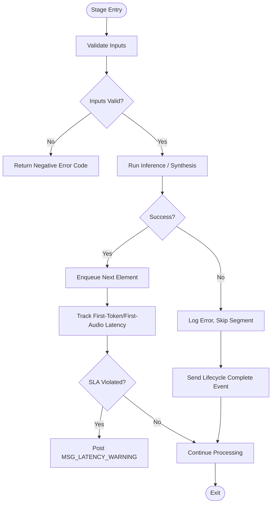
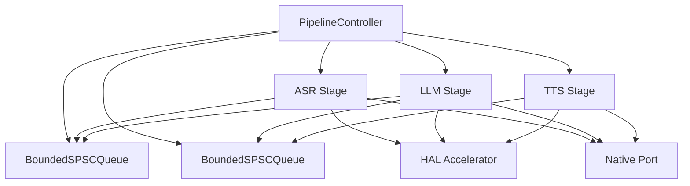

# Stage Communication Patterns

<cite>
**Referenced Files in This Document**
- [echo_types.h](file://native/include/echo_types.h)
- [asr_stage.h](file://native/include/asr_stage.h)
- [llm_stage.h](file://native/include/llm_stage.h)
- [tts_stage.h](file://native/include/tts_stage.h)
- [pipeline_controller.h](file://native/include/pipeline_controller.h)
- [bounded_spsc_queue.h](file://native/include/bounded_spsc_queue.h)
- [sentence_segmenter.h](file://native/include/sentence_segmenter.h)
- [native_port.h](file://native/include/native_port.h)
- [hal_accelerator.h](file://native/hal/hal_accelerator.h)
- [asr_stage.cpp](file://native/src/asr_stage.cpp)
- [llm_stage.cpp](file://native/src/llm_stage.cpp)
- [tts_stage.cpp](file://native/src/tts_stage.cpp)
- [pipeline_controller.cpp](file://native/src/pipeline_controller.cpp)
</cite>

## Table of Contents
1. [Introduction](#introduction)
2. [Project Structure](#project-structure)
3. [Core Components](#core-components)
4. [Architecture Overview](#architecture-overview)
5. [Detailed Component Analysis](#detailed-component-analysis)
6. [Dependency Analysis](#dependency-analysis)
7. [Performance Considerations](#performance-considerations)
8. [Troubleshooting Guide](#troubleshooting-guide)
9. [Conclusion](#conclusion)
10. [Appendices](#appendices)

## Introduction
This document explains QwenEcho’s inter-stage communication patterns across the AI processing pipeline. It focuses on the standardized interface used by ASR, LLM, and TTS stages for consistent data transformation and error propagation. The message types flowing between stages are:
- LockedSegment → AsrToLlmElement → LlmToTtsElement → AudioOutput

The system uses an asynchronous, queue-based model with backpressure via bounded single-producer/single-consumer (SPSC) queues that drop the oldest element when full. Each stage runs on its own worker thread, enabling overlapped execution and low-latency streaming. We also cover initialization, processing callbacks, cleanup, error handling, timeout management, recovery strategies, and guidance for implementing custom stages following these patterns.

## Project Structure
QwenEcho’s native layer implements a multi-stage audio-to-speech pipeline:
- Sentence Segmenter produces LockedSegment objects from incoming PCM audio.
- ASR stage consumes segments, streams partial text, emits confirmed text, and enqueues AsrToLlmElement into the ASR→LLM queue.
- LLM stage dequeues AsrToLlmElement, translates tokens, streams translation tokens, and enqueues LlmToTtsElement at punctuation boundaries (cascade truncation).
- TTS stage dequeues LlmToTtsElement, synthesizes PCM audio chunks, and outputs to platform speaker via HAL audio.

**Diagram sources**
- [pipeline_controller.cpp:107-126](file://native/src/pipeline_controller.cpp#L107-L126)
- [asr_stage.cpp:64-82](file://native/src/asr_stage.cpp#L64-L82)
- [llm_stage.cpp:68-87](file://native/src/llm_stage.cpp#L68-L87)
- [tts_stage.cpp:66-81](file://native/src/tts_stage.cpp#L66-L81)
- [bounded_spsc_queue.h:29-142](file://native/include/bounded_spsc_queue.h#L29-L142)

**Section sources**
- [pipeline_controller.h:1-107](file://native/include/pipeline_controller.h#L1-L107)
- [pipeline_controller.cpp:272-393](file://native/src/pipeline_controller.cpp#L272-L393)

## Core Components
- Message Types and Engine Configuration:
  - AsrToLlmElement and LlmToTtsElement define the typed payloads exchanged between stages.
  - EngineConfig provides shared configuration for models, languages, ring buffer capacity, thermal thresholds, memory limits, context windows, segmenter timing, and audio sample rates.
- Inter-stage Queues:
  - BoundedSPSCQueue<T, Capacity=64> is a lock-free bounded queue with overflow-drop semantics. try_push returns true if normal push, false if overflow occurred (oldest dropped). try_pop returns true if item was dequeued, false if empty.
- Stages:
  - ASR Stage: processes LockedSegment, streams partials, enqueues AsrToLlmElement.
  - LLM Stage: dequeues AsrToLlmElement, translates, streams tokens, enqueues LlmToTtsElement at punctuation boundaries.
  - TTS Stage: dequeues LlmToTtsElement, synthesizes PCM audio, outputs via HAL audio.
- Pipeline Controller:
  - Orchestrates creation, wiring, startup, graceful stop, and resource cleanup.

Key responsibilities and contracts:
- Non-blocking enqueue/dequeue with backpressure via overflow-dropping.
- Per-stage worker threads with joinable lifecycle management.
- SLA tracking and latency warnings per stage.
- Thermal mode propagation to ASR and LLM stages.

**Section sources**
- [echo_types.h:64-129](file://native/include/echo_types.h#L64-L129)
- [bounded_spsc_queue.h:29-142](file://native/include/bounded_spsc_queue.h#L29-L142)
- [asr_stage.h:34-104](file://native/include/asr_stage.h#L34-L104)
- [llm_stage.h:40-93](file://native/include/llm_stage.h#L40-L93)
- [tts_stage.h:37-79](file://native/include/tts_stage.h#L37-L79)
- [pipeline_controller.h:33-107](file://native/include/pipeline_controller.h#L33-L107)

## Architecture Overview
The pipeline follows a cascade truncation pattern:
- ASR confirms text and immediately enqueues AsrToLlmElement; LLM begins translation without waiting for audio capture completion.
- LLM emits partial results at punctuation boundaries into the LLM→TTS queue; TTS starts synthesis while LLM continues producing the remainder.
- Each stage runs concurrently on its own worker thread, consuming from input queues without blocking upstream producers.

**Diagram sources**
- [asr_stage.cpp:297-318](file://native/src/asr_stage.cpp#L297-L318)
- [asr_stage.cpp:254-270](file://native/src/asr_stage.cpp#L254-L270)
- [llm_stage.cpp:243-361](file://native/src/llm_stage.cpp#L243-L361)
- [tts_stage.cpp:191-272](file://native/src/tts_stage.cpp#L191-L272)
- [native_port.h:100-172](file://native/include/native_port.h#L100-L172)

## Detailed Component Analysis

### Message Types and Transformation Rules
- LockedSegment:
  - Produced by SentenceSegmenter when a sentence boundary is detected. Contains audio samples, segment_id, speaker_id, timestamp_ms.
- AsrToLlmElement:
  - Produced by ASR after confirming text. Includes segment_id, speaker_id, UTF-8 text, text_len, timestamp_ms.
  - Transformation rule: ASR copies confirmed text into fixed-size buffer, null-terminates, sets text_len, and enqueues via try_push.
- LlmToTtsElement:
  - Produced by LLM at punctuation boundaries or final piece. Includes segment_id, speaker_id, UTF-8 translated text, text_len, timestamp_ms.
  - Transformation rule: LLM builds cascade_buffer up to punctuation, enqueues partial result, clears buffer, and repeats until full translation is complete.
- AudioOutput:
  - Produced by TTS as PCM 24kHz, 16-bit, mono chunks streamed to HAL audio output.

**Diagram sources**
- [asr_stage.cpp:254-270](file://native/src/asr_stage.cpp#L254-L270)
- [llm_stage.cpp:218-237](file://native/src/llm_stage.cpp#L218-L237)
- [llm_stage.cpp:319-341](file://native/src/llm_stage.cpp#L319-L341)
- [tts_stage.cpp:191-272](file://native/src/tts_stage.cpp#L191-L272)

**Section sources**
- [sentence_segmenter.h:40-49](file://native/include/sentence_segmenter.h#L40-L49)
- [echo_types.h:64-86](file://native/include/echo_types.h#L64-L86)
- [asr_stage.cpp:254-270](file://native/src/asr_stage.cpp#L254-L270)
- [llm_stage.cpp:218-237](file://native/src/llm_stage.cpp#L218-L237)
- [tts_stage.cpp:191-272](file://native/src/tts_stage.cpp#L191-L272)

### Asynchronous Processing Model and Backpressure
- Queue Semantics:
  - BoundedSPSCQueue<T, Capacity=64> ensures non-blocking behavior. On overflow, the oldest element is dropped and the new one is pushed. Consumers may see fewer items under high load, preserving throughput and preventing stalls.
- Worker Threads:
  - Each stage owns a worker thread that polls or waits for work. ASR uses a condition variable to wake on new segments; LLM and TTS poll with short sleep intervals.
- Backpressure Mechanism:
  - Overflow-drop prevents producer stalls. Downstream stages continue draining; older elements may be lost but newer ones are preserved, maintaining responsiveness.

**Diagram sources**
- [bounded_spsc_queue.h:29-142](file://native/include/bounded_spsc_queue.h#L29-L142)

**Section sources**
- [bounded_spsc_queue.h:29-142](file://native/include/bounded_spsc_queue.h#L29-L142)
- [asr_stage.cpp:167-271](file://native/src/asr_stage.cpp#L167-L271)
- [llm_stage.cpp:243-361](file://native/src/llm_stage.cpp#L243-L361)
- [tts_stage.cpp:191-272](file://native/src/tts_stage.cpp#L191-L272)

### Stage Initialization, Processing Callbacks, and Cleanup
- Initialization:
  - PipelineController creates queues, stages, monitors, and starts components. ASR, LLM, and TTS constructors launch worker threads.
- Processing Callbacks:
  - SentenceSegmenter invokes on_segment_locked callback to route LockedSegment to ASR.
  - Native Port functions post UI messages for partials, confirmations, translation streams, and TTS lifecycle events.
- Cleanup:
  - Destroy functions signal workers to stop, join threads, and release resources. PipelineController orchestrates reverse-order destruction and discards unlocked audio.

**Diagram sources**
- [pipeline_controller.cpp:272-393](file://native/src/pipeline_controller.cpp#L272-L393)
- [asr_stage.cpp:277-293](file://native/src/asr_stage.cpp#L277-L293)
- [llm_stage.cpp:367-388](file://native/src/llm_stage.cpp#L367-L388)
- [tts_stage.cpp:278-296](file://native/src/tts_stage.cpp#L278-L296)

**Section sources**
- [pipeline_controller.cpp:272-393](file://native/src/pipeline_controller.cpp#L272-L393)
- [asr_stage.cpp:277-338](file://native/src/asr_stage.cpp#L277-L338)
- [llm_stage.cpp:367-411](file://native/src/llm_stage.cpp#L367-L411)
- [tts_stage.cpp:278-314](file://native/src/tts_stage.cpp#L278-L314)

### Error Handling Strategies, Timeout Management, and Recovery
- Error Codes:
  - EchoErrorCode enumerates return codes for all C-linkage entry points.
- Stage Failures:
  - TTS logs errors and skips segments without halting the pipeline; it still sends MSG_TTS_COMPLETE to maintain lifecycle consistency.
  - ASR silently discards noise/unintelligible segments without confirmed messages or queue pushes.
- Latency SLAs:
  - ASR: ≤200ms first-character latency.
  - LLM: ≤450ms first-token latency.
  - TTS: ≤100ms TTFA.
  - Violations are reported via MSG_LATENCY_WARNING with stage name, actual_ms, budget_ms.
- Graceful Stop:
  - Stops AudioCollector, flushes locked segments through ASR→LLM→TTS within a 2-second deadline, destroys stages, discards unlocked audio, and releases resources.

**Diagram sources**
- [tts_stage.cpp:241-252](file://native/src/tts_stage.cpp#L241-L252)
- [asr_stage.cpp:238-242](file://native/src/asr_stage.cpp#L238-L242)
- [llm_stage.cpp:313-316](file://native/src/llm_stage.cpp#L313-L316)
- [pipeline_controller.cpp:395-469](file://native/src/pipeline_controller.cpp#L395-L469)

**Section sources**
- [echo_types.h:48-62](file://native/include/echo_types.h#L48-L62)
- [tts_stage.cpp:241-252](file://native/src/tts_stage.cpp#L241-L252)
- [asr_stage.cpp:238-242](file://native/src/asr_stage.cpp#L238-L242)
- [llm_stage.cpp:313-316](file://native/src/llm_stage.cpp#L313-L316)
- [pipeline_controller.cpp:395-469](file://native/src/pipeline_controller.cpp#L395-L469)

### Guidance for Implementing Custom Processing Stages
Follow the established patterns:
- Use BoundedSPSCQueue<T> for inter-stage communication. Ensure your element type is copyable and fits within fixed-size buffers if applicable.
- Implement a stage struct with:
  - AcceleratorContext pointer (may be NULL in stub mode).
  - Input/output queue pointers.
  - Atomic throttle_mode flag for thermal adaptation.
  - Worker thread and atomic running flag.
- Provide public APIs:
  - create(accelerator, input_queue[, output_queue]) returning opaque handle.
  - set_thermal_mode(stage, throttle_mode) for runtime adaptation.
  - destroy(stage) signaling stop, joining worker, and freeing resources.
- Worker loop:
  - Poll input queue with try_pop; sleep briefly when empty.
  - Process data, stream intermediate results via Native Port functions.
  - Enqueue transformed elements via try_push; handle overflow gracefully.
  - Track SLA metrics and report latency warnings.
- Error handling:
  - Validate inputs, log errors, skip segments on failure, and maintain lifecycle events.
- Integration:
  - Wire your stage in PipelineController start/stop sequences, ensuring correct order of creation and destruction.

[No sources needed since this section provides general guidance based on analyzed files]

## Dependency Analysis
The pipeline controller wires components together and manages their lifecycles. Stages depend on the HAL accelerator for inference and use Native Port for UI messaging.

**Diagram sources**
- [pipeline_controller.cpp:107-126](file://native/src/pipeline_controller.cpp#L107-L126)
- [asr_stage.cpp:64-82](file://native/src/asr_stage.cpp#L64-L82)
- [llm_stage.cpp:68-87](file://native/src/llm_stage.cpp#L68-L87)
- [tts_stage.cpp:66-81](file://native/src/tts_stage.cpp#L66-L81)
- [native_port.h:100-172](file://native/include/native_port.h#L100-L172)
- [hal_accelerator.h:19-74](file://native/hal/hal_accelerator.h#L19-L74)

**Section sources**
- [pipeline_controller.cpp:272-393](file://native/src/pipeline_controller.cpp#L272-L393)
- [asr_stage.cpp:277-338](file://native/src/asr_stage.cpp#L277-L338)
- [llm_stage.cpp:367-411](file://native/src/llm_stage.cpp#L367-L411)
- [tts_stage.cpp:278-314](file://native/src/tts_stage.cpp#L278-L314)

## Performance Considerations
- Cascade Truncation:
  - Enables downstream stages to begin early, reducing end-to-end latency.
- Queue Capacity:
  - Default capacity of 64 balances memory usage and throughput; adjust if necessary for specific workloads.
- Thermal Modes:
  - ASR resamples to 8kHz in Throttle mode; LLM reduces context window size; both reduce compute pressure.
- SLA Monitoring:
  - Per-stage latency budgets ensure responsiveness; violations are reported for observability.

[No sources needed since this section provides general guidance]

## Troubleshooting Guide
Common issues and remedies:
- No audio output:
  - Verify TTS lifecycle events (MSG_TTS_STARTED/COMPLETE) are posted; check discard logic for whitespace/punctuation-only segments.
- High latency warnings:
  - Inspect per-stage SLA measurements; consider adjusting thermal modes or queue capacities.
- Pipeline not stopping:
  - Ensure graceful stop sequence completes within 2 seconds; verify queues are drained and segmenter is idle.
- Memory pressure:
  - Critical memory level triggers graceful stop; monitor memory warnings and adjust limits.

**Section sources**
- [tts_stage.cpp:206-214](file://native/src/tts_stage.cpp#L206-L214)
- [asr_stage.cpp:238-242](file://native/src/asr_stage.cpp#L238-L242)
- [llm_stage.cpp:313-316](file://native/src/llm_stage.cpp#L313-L316)
- [pipeline_controller.cpp:395-469](file://native/src/pipeline_controller.cpp#L395-L469)

## Conclusion
QwenEcho’s inter-stage communication relies on a robust, asynchronous, queue-based architecture with clear message types and standardized interfaces. The bounded SPSC queues provide backpressure via overflow-dropping, while each stage maintains independent worker threads for concurrency. SLA monitoring and graceful shutdown ensure reliability and performance. Following the documented patterns enables seamless integration of custom stages and consistent error propagation throughout the pipeline.

[No sources needed since this section summarizes without analyzing specific files]

## Appendices

### API Reference Summary
- ASR Stage:
  - Create/Destroy: asr_stage_create, asr_stage_destroy
  - Process: asr_stage_process_segment
  - Thermal Mode: asr_stage_set_thermal_mode
- LLM Stage:
  - Create/Destroy: llm_stage_create, llm_stage_destroy
  - Thermal Mode: llm_stage_set_thermal_mode
- TTS Stage:
  - Create/Destroy: tts_stage_create, tts_stage_destroy
- Pipeline Controller:
  - Create/Destroy: pipeline_controller_create, pipeline_controller_destroy
  - Start/Stop: pipeline_controller_start, pipeline_controller_stop
  - Status: pipeline_controller_is_running

**Section sources**
- [asr_stage.h:52-97](file://native/include/asr_stage.h#L52-L97)
- [llm_stage.h:60-86](file://native/include/llm_stage.h#L60-L86)
- [tts_stage.h:58-72](file://native/include/tts_stage.h#L58-L72)
- [pipeline_controller.h:46-100](file://native/include/pipeline_controller.h#L46-L100)