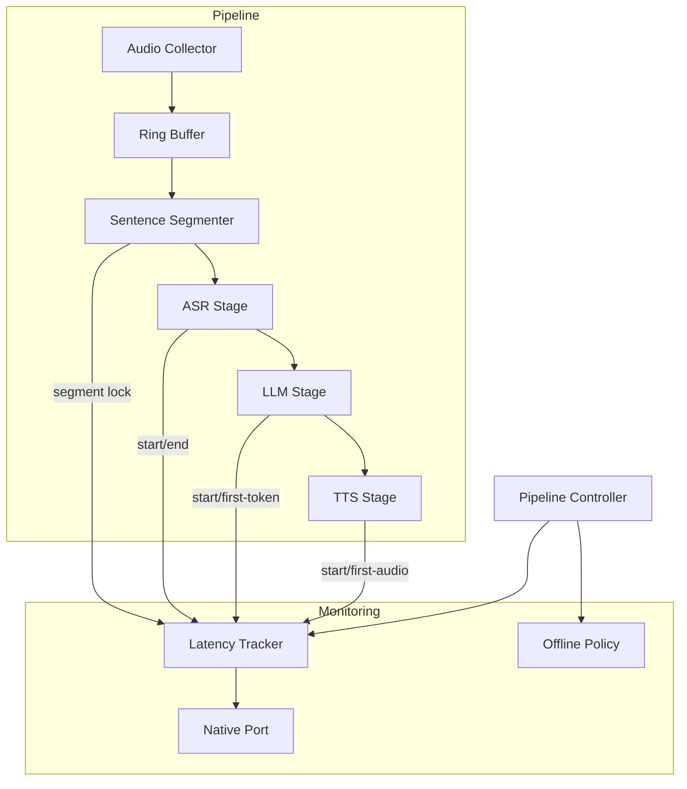
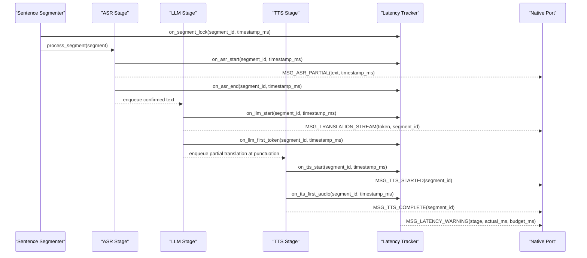
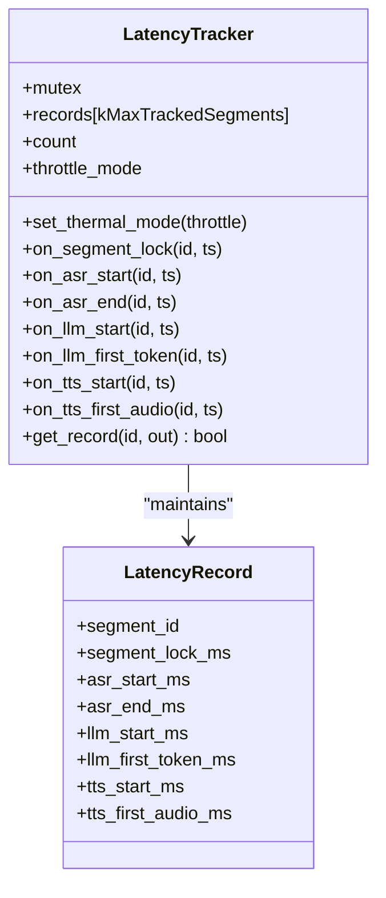
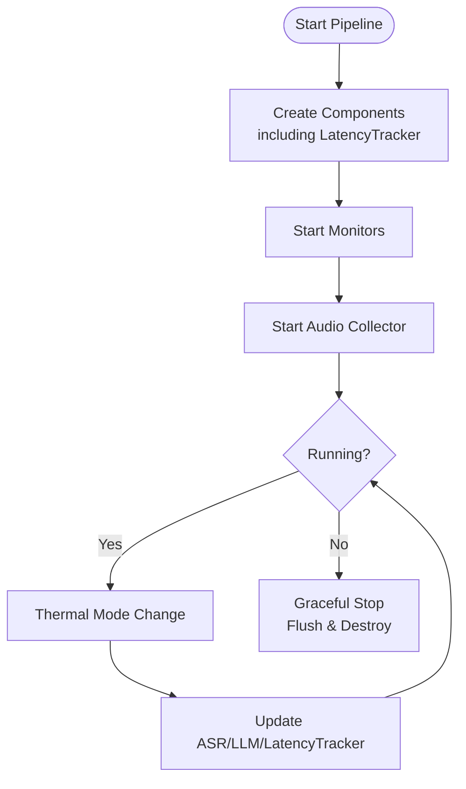
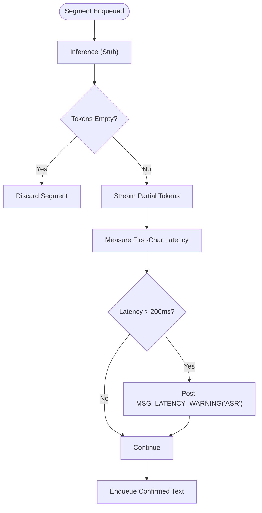
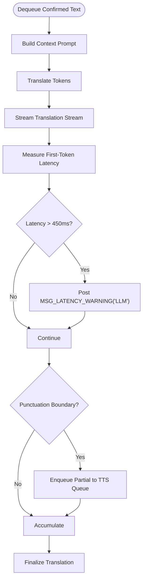
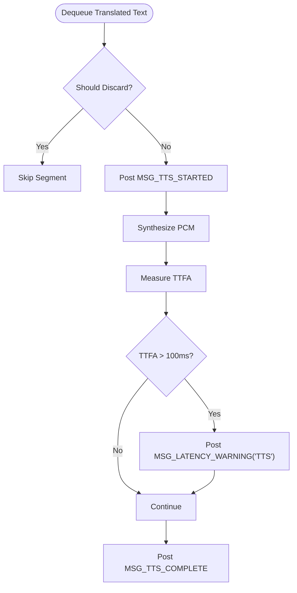
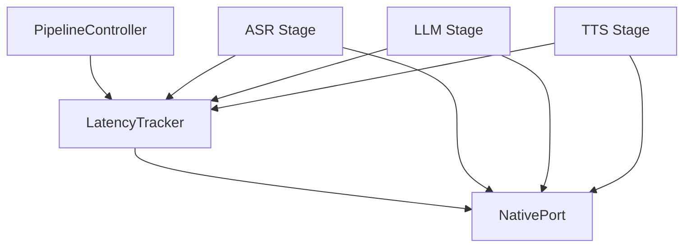

# Latency Tracking

<cite>
**Referenced Files in This Document**
- [latency_tracker.h](file://native/include/latency_tracker.h)
- [latency_tracker.cpp](file://native/src/latency_tracker.cpp)
- [pipeline_controller.h](file://native/include/pipeline_controller.h)
- [pipeline_controller.cpp](file://native/src/pipeline_controller.cpp)
- [asr_stage.h](file://native/include/asr_stage.h)
- [asr_stage.cpp](file://native/src/asr_stage.cpp)
- [llm_stage.h](file://native/include/llm_stage.h)
- [llm_stage.cpp](file://native/src/llm_stage.cpp)
- [tts_stage.h](file://native/include/tts_stage.h)
- [tts_stage.cpp](file://native/src/tts_stage.cpp)
- [native_port.h](file://native/include/native_port.h)
- [native_port.cpp](file://native/src/native_port.cpp)
- [offline_policy.h](file://native/include/offline_policy.h)
- [offline_policy.cpp](file://native/src/offline_policy.cpp)
</cite>

## Table of Contents
1. [Introduction](#introduction)
2. [Project Structure](#project-structure)
3. [Core Components](#core-components)
4. [Architecture Overview](#architecture-overview)
5. [Detailed Component Analysis](#detailed-component-analysis)
6. [Dependency Analysis](#dependency-analysis)
7. [Performance Considerations](#performance-considerations)
8. [Troubleshooting Guide](#troubleshooting-guide)
9. [Conclusion](#conclusion)
10. [Appendices](#appendices)

## Introduction
This document explains QwenEcho’s end-to-end latency tracking system that measures time from audio capture to speech output. It details timestamp injection points across the pipeline (audio collection, sentence segmentation, ASR processing, LLM inference, and TTS synthesis), the latency calculation algorithms, statistical aggregation methods, performance threshold monitoring, and integration with offline policy for adaptive quality adjustment based on measured latencies. It also covers latency reporting mechanisms, alerting systems for performance degradation, debugging tools for bottleneck identification, and approaches for establishing baselines and detecting regressions for continuous performance monitoring.

## Project Structure
The latency tracking system is implemented in native C/C++ components integrated into the processing pipeline:
- LatencyTracker: centralizes per-segment timestamps and SLA checks
- PipelineController: orchestrates stages and integrates thermal mode changes with LatencyTracker
- Stages (ASR, LLM, TTS): emit events and integrate with LatencyTracker via callbacks or explicit calls
- NativePort: transports MSG_LATENCY_WARNING messages to the Flutter UI
- OfflinePolicy: enforces air-gapped operation; indirectly supports reliability by ensuring no network-induced variability

**Diagram sources**
- [pipeline_controller.cpp:107-126](file://native/src/pipeline_controller.cpp#L107-L126)
- [latency_tracker.h:57-80](file://native/include/latency_tracker.h#L57-L80)
- [native_port.h:162-166](file://native/include/native_port.h#L162-L166)

**Section sources**
- [pipeline_controller.h:1-107](file://native/include/pipeline_controller.h#L1-L107)
- [pipeline_controller.cpp:107-126](file://native/src/pipeline_controller.cpp#L107-L126)
- [latency_tracker.h:1-224](file://native/include/latency_tracker.h#L1-L224)
- [native_port.h:1-179](file://native/include/native_port.h#L1-L179)

## Core Components
- LatencyTracker: maintains a circular buffer of per-segment records and checks stage-level and E2E budgets against current thermal mode. Emits MSG_LATENCY_WARNING when budgets are exceeded.
- PipelineController: creates and wires all stages, sets thermal mode on LatencyTracker and stages, and coordinates graceful stop.
- ASR Stage: processes locked segments, streams partial tokens, enqueues confirmed text, and reports first-character latency SLA violations.
- LLM Stage: translates confirmed text, streams tokens, applies cascade truncation at punctuation boundaries, and reports first-token latency SLA violations.
- TTS Stage: synthesizes speech, tracks TTFA, and reports TTFA SLA violations.
- NativePort: serializes and posts typed messages including MSG_LATENCY_WARNING to the Flutter UI.
- OfflinePolicy: ensures offline-only operation; indirectly stabilizes latency behavior by preventing network-related variability.

Key responsibilities:
- Timestamp injection at segment lock, ASR start/end, LLM start/first-token, TTS start/first-audio
- Budget checks: ASR ≤200ms, LLM ≤450ms, TTS ≤100ms, E2E ≤800ms (Normal) or ≤1200ms (Throttle)
- Reporting via MSG_LATENCY_WARNING with stage name, actual_ms, budget_ms
- Thermal mode propagation to adjust budgets and stage behavior

**Section sources**
- [latency_tracker.h:34-49](file://native/include/latency_tracker.h#L34-L49)
- [latency_tracker.cpp:122-128](file://native/src/latency_tracker.cpp#L122-L128)
- [pipeline_controller.cpp:145-160](file://native/src/pipeline_controller.cpp#L145-L160)
- [asr_stage.cpp:228-242](file://native/src/asr_stage.cpp#L228-L242)
- [llm_stage.cpp:304-317](file://native/src/llm_stage.cpp#L304-L317)
- [tts_stage.cpp:227-236](file://native/src/tts_stage.cpp#L227-L236)
- [native_port.cpp:283-300](file://native/src/native_port.cpp#L283-L300)
- [offline_policy.h:1-121](file://native/include/offline_policy.h#L1-L121)

## Architecture Overview
End-to-end latency measurement spans multiple stages with precise timestamp injection and centralized SLA enforcement. The pipeline uses cascade truncation to reduce perceived latency by starting downstream stages early.

**Diagram sources**
- [latency_tracker.h:131-203](file://native/include/latency_tracker.h#L131-L203)
- [latency_tracker.cpp:156-267](file://native/src/latency_tracker.cpp#L156-L267)
- [native_port.h:101-166](file://native/include/native_port.h#L101-L166)
- [native_port.cpp:116-300](file://native/src/native_port.cpp#L116-L300)

## Detailed Component Analysis

### LatencyTracker
- Data model: LatencyRecord holds per-segment timestamps for segment lock, ASR start/end, LLM start/first-token, TTS start/first-audio.
- Budgets: ASR ≤200ms, LLM ≤450ms, TTS ≤100ms, E2E ≤800ms (Normal) or ≤1200ms (Throttle).
- Thermal mode: latency_tracker_set_thermal_mode selects E2E budget.
- SLA checks: check_and_report posts MSG_LATENCY_WARNING when any stage or E2E exceeds its budget.
- Concurrency: mutex-protected access to records; atomic throttle_mode.

**Diagram sources**
- [latency_tracker.h:57-80](file://native/include/latency_tracker.h#L57-L80)
- [latency_tracker.cpp:47-54](file://native/src/latency_tracker.cpp#L47-L54)

**Section sources**
- [latency_tracker.h:34-49](file://native/include/latency_tracker.h#L34-L49)
- [latency_tracker.h:119-203](file://native/include/latency_tracker.h#L119-L203)
- [latency_tracker.cpp:122-128](file://native/src/latency_tracker.cpp#L122-L128)
- [latency_tracker.cpp:151-267](file://native/src/latency_tracker.cpp#L151-L267)

### PipelineController Integration
- Creates and owns LatencyTracker alongside other stages.
- Propagates thermal mode changes to ASR, LLM, and LatencyTracker via on_thermal_mode_change callback.
- Ensures graceful stop flushes locked segments through ASR→LLM→TTS within 2 seconds.

**Diagram sources**
- [pipeline_controller.cpp:272-393](file://native/src/pipeline_controller.cpp#L272-L393)
- [pipeline_controller.cpp:145-160](file://native/src/pipeline_controller.cpp#L145-L160)

**Section sources**
- [pipeline_controller.cpp:107-126](file://native/src/pipeline_controller.cpp#L107-L126)
- [pipeline_controller.cpp:145-160](file://native/src/pipeline_controller.cpp#L145-L160)
- [pipeline_controller.cpp:272-393](file://native/src/pipeline_controller.cpp#L272-L393)

### ASR Stage Latency Measurement
- First-character latency measured from segment enqueue time to first partial token emission.
- If >200ms, posts MSG_LATENCY_WARNING("ASR", actual_ms, 200).
- Streams partial tokens and enqueues confirmed text to LLM queue.

**Diagram sources**
- [asr_stage.cpp:228-242](file://native/src/asr_stage.cpp#L228-L242)
- [asr_stage.cpp:245-270](file://native/src/asr_stage.cpp#L245-L270)

**Section sources**
- [asr_stage.h:1-104](file://native/include/asr_stage.h#L1-L104)
- [asr_stage.cpp:228-242](file://native/src/asr_stage.cpp#L228-L242)
- [asr_stage.cpp:245-270](file://native/src/asr_stage.cpp#L245-L270)

### LLM Stage Latency Measurement
- First-token latency measured from dequeue time to first translated token emission.
- If >450ms, posts MSG_LATENCY_WARNING("LLM", actual_ms, 450).
- Applies cascade truncation at punctuation boundaries to start TTS earlier.

**Diagram sources**
- [llm_stage.cpp:304-317](file://native/src/llm_stage.cpp#L304-L317)
- [llm_stage.cpp:319-341](file://native/src/llm_stage.cpp#L319-L341)

**Section sources**
- [llm_stage.h:1-93](file://native/include/llm_stage.h#L1-L93)
- [llm_stage.cpp:304-317](file://native/src/llm_stage.cpp#L304-L317)
- [llm_stage.cpp:319-341](file://native/src/llm_stage.cpp#L319-L341)

### TTS Stage Latency Measurement
- TTFA measured from TTS_STARTED to first audio sample generation.
- If >100ms, posts MSG_LATENCY_WARNING("TTS", actual_ms, 100).
- Discards whitespace-only or punctuation-only segments without TTS_STARTED.

**Diagram sources**
- [tts_stage.cpp:212-236](file://native/src/tts_stage.cpp#L212-L236)
- [tts_stage.cpp:267-271](file://native/src/tts_stage.cpp#L267-L271)

**Section sources**
- [tts_stage.h:1-79](file://native/include/tts_stage.h#L1-L79)
- [tts_stage.cpp:212-236](file://native/src/tts_stage.cpp#L212-L236)
- [tts_stage.cpp:267-271](file://native/src/tts_stage.cpp#L267-L271)

### NativePort Latency Warning Delivery
- MSG_LATENCY_WARNING payload includes stage name, actual_ms, budget_ms.
- Serialized as Dart_CObject array and posted via registered port.

**Section sources**
- [native_port.h:162-166](file://native/include/native_port.h#L162-L166)
- [native_port.cpp:283-300](file://native/src/native_port.cpp#L283-L300)

### Offline Policy Integration
- Compile-time symbol poisoning prevents accidental networking usage.
- Runtime verification checks sandbox paths and absence of network libraries.
- Indirectly stabilizes latency by eliminating network-induced variability.

**Section sources**
- [offline_policy.h:53-84](file://native/include/offline_policy.h#L53-L84)
- [offline_policy.cpp:155-218](file://native/src/offline_policy.cpp#L155-L218)

## Dependency Analysis
LatencyTracker depends on NativePort for warnings and is managed by PipelineController. Stages interact with LatencyTracker via explicit API calls and post messages via NativePort.

**Diagram sources**
- [latency_tracker.cpp:122-128](file://native/src/latency_tracker.cpp#L122-L128)
- [native_port.cpp:283-300](file://native/src/native_port.cpp#L283-L300)
- [pipeline_controller.cpp:145-160](file://native/src/pipeline_controller.cpp#L145-L160)

**Section sources**
- [latency_tracker.cpp:122-128](file://native/src/latency_tracker.cpp#L122-L128)
- [native_port.cpp:283-300](file://native/src/native_port.cpp#L283-L300)
- [pipeline_controller.cpp:145-160](file://native/src/pipeline_controller.cpp#L145-L160)

## Performance Considerations
- Cascade truncation reduces perceived latency by starting downstream stages early at punctuation boundaries.
- Thermal mode affects budgets and stage behavior:
  - Normal: ASR ≤200ms, LLM ≤450ms, TTS ≤100ms, E2E ≤800ms
  - Throttle: E2E ≤1200ms; ASR may resample to 8kHz; LLM context window reduced
- High-resolution timers: std::chrono::steady_clock used for precise measurements across platforms.
- Cross-platform precision: steady_clock provides monotonic timing suitable for latency measurement regardless of wall-clock adjustments.

[No sources needed since this section provides general guidance]

## Troubleshooting Guide
- Identify offending stage: MSG_LATENCY_WARNING includes stage name ("ASR", "LLM", "TTS", "E2E"), actual_ms, budget_ms.
- Check thermal mode: ensure latency_tracker_set_thermal_mode is updated on mode changes.
- Verify timestamp ordering: confirm segment lock precedes ASR start, ASR start precedes ASR end, etc.
- Inspect cascade truncation: ensure LLM emits partial results at punctuation boundaries to enable early TTS start.
- Validate offline policy: verify sandbox path constraints and absence of network libraries to avoid unexpected delays.

**Section sources**
- [latency_tracker.cpp:122-128](file://native/src/latency_tracker.cpp#L122-L128)
- [pipeline_controller.cpp:145-160](file://native/src/pipeline_controller.cpp#L145-L160)
- [offline_policy.cpp:155-218](file://native/src/offline_policy.cpp#L155-L218)

## Conclusion
QwenEcho’s latency tracking system provides comprehensive end-to-end measurement from audio capture to speech output, with precise timestamp injection, robust SLA enforcement, and clear reporting via MSG_LATENCY_WARNING. The design leverages cascade truncation and thermal-aware budgets to maintain low-latency performance while adapting to device conditions. Integrated with offline policy, it ensures stable operation without network-induced variability.

[No sources needed since this section summarizes without analyzing specific files]

## Appendices

### Latency Calculation Algorithms
- ASR first-character latency: time from segment enqueue to first partial token emission.
- LLM first-token latency: time from dequeue to first translated token emission.
- TTS TTFA: time from TTS_STARTED to first audio sample generation.
- E2E latency: time from segment lock to TTS first audio.

**Section sources**
- [asr_stage.cpp:228-242](file://native/src/asr_stage.cpp#L228-L242)
- [llm_stage.cpp:304-317](file://native/src/llm_stage.cpp#L304-L317)
- [tts_stage.cpp:216-236](file://native/src/tts_stage.cpp#L216-L236)
- [latency_tracker.cpp:256-267](file://native/src/latency_tracker.cpp#L256-L267)

### Statistical Aggregation Methods
- Maintain recent records in a fixed-size buffer for quick lookups and eviction of oldest entries.
- Use mutex protection for concurrent access and atomic variables for thermal mode state.

**Section sources**
- [latency_tracker.cpp:47-92](file://native/src/latency_tracker.cpp#L47-L92)
- [latency_tracker.cpp:132-154](file://native/src/latency_tracker.cpp#L132-L154)

### Performance Threshold Monitoring
- Per-stage budgets: ASR ≤200ms, LLM ≤450ms, TTS ≤100ms.
- E2E budgets: Normal ≤800ms, Throttle ≤1200ms.
- Alerts: MSG_LATENCY_WARNING posted when thresholds exceeded.

**Section sources**
- [latency_tracker.h:34-49](file://native/include/latency_tracker.h#L34-L49)
- [latency_tracker.cpp:122-128](file://native/src/latency_tracker.cpp#L122-L128)

### High-Resolution Timer Usage
- std::chrono::steady_clock used consistently across stages for precise timing.
- Duration cast to milliseconds for reporting and comparison.

**Section sources**
- [asr_stage.cpp:232-236](file://native/src/asr_stage.cpp#L232-L236)
- [llm_stage.cpp:308-311](file://native/src/llm_stage.cpp#L308-L311)
- [tts_stage.cpp:229-232](file://native/src/tts_stage.cpp#L229-L232)

### Cross-Platform Timing Precision Considerations
- steady_clock provides monotonic time unaffected by system clock updates.
- Suitable for cross-platform latency measurement on Android and iOS.

[No sources needed since this section provides general guidance]

### Integration with Offline Policy for Adaptive Quality Adjustment
- Offline policy ensures models reside within sandbox and no network libraries are loaded.
- Thermal mode changes propagate to stages and LatencyTracker, enabling adaptive quality and latency budgets.

**Section sources**
- [offline_policy.cpp:155-218](file://native/src/offline_policy.cpp#L155-L218)
- [pipeline_controller.cpp:145-160](file://native/src/pipeline_controller.cpp#L145-L160)

### Latency Reporting Mechanisms
- MSG_LATENCY_WARNING carries stage, actual_ms, budget_ms.
- Delivered via NativePort to Flutter UI for visualization and alerting.

**Section sources**
- [native_port.h:162-166](file://native/include/native_port.h#L162-L166)
- [native_port.cpp:283-300](file://native/src/native_port.cpp#L283-L300)

### Alerting Systems for Performance Degradation
- Real-time alerts triggered when any stage or E2E exceeds budget.
- UI can aggregate and display trends, highlight frequent offenders, and prompt user feedback.

**Section sources**
- [latency_tracker.cpp:122-128](file://native/src/latency_tracker.cpp#L122-L128)
- [native_port.cpp:283-300](file://native/src/native_port.cpp#L283-L300)

### Debugging Tools for Latency Bottleneck Identification
- Query latest record for a segment via latency_tracker_get_record.
- Correlate timestamps to identify slow stages and analyze cascade truncation effectiveness.

**Section sources**
- [latency_tracker.h:215-217](file://native/include/latency_tracker.h#L215-L217)
- [latency_tracker.cpp:269-284](file://native/src/latency_tracker.cpp#L269-L284)

### Performance Baseline Establishment and Regression Detection
- Establish baseline by measuring median and p95 latencies under normal and throttle modes.
- Detect regressions by comparing current metrics against historical baselines and alerting on significant deviations.
- Use MSG_LATENCY_WARNING frequency as an indicator of sustained performance issues.

[No sources needed since this section provides general guidance]