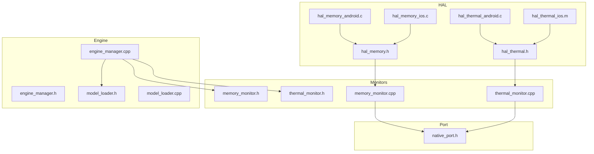
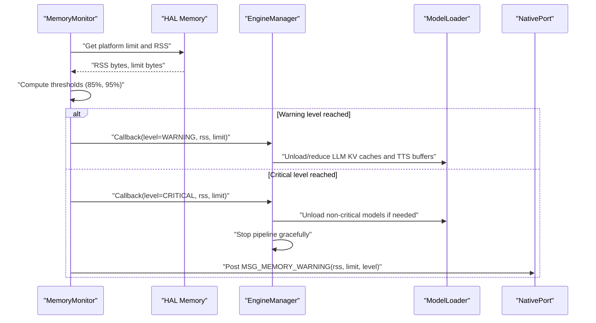
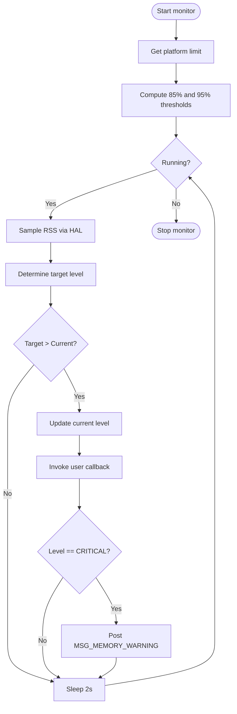
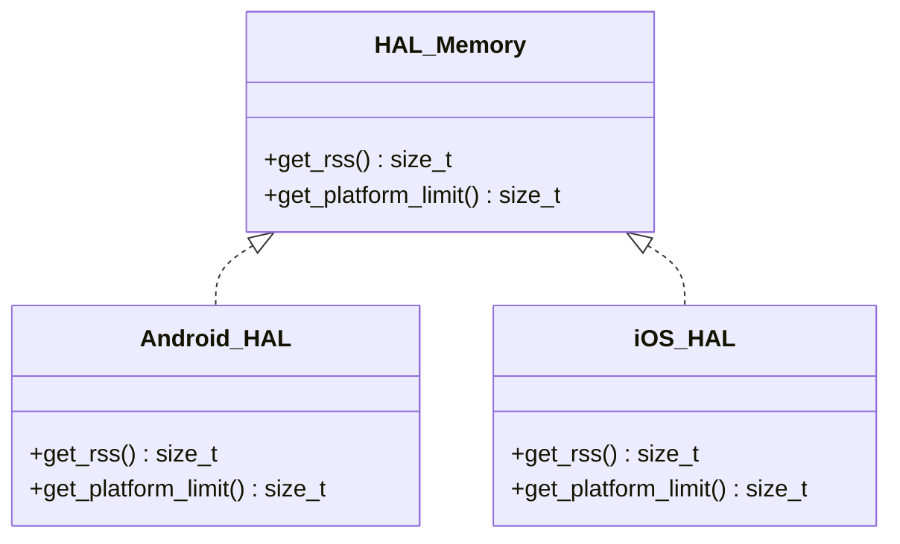
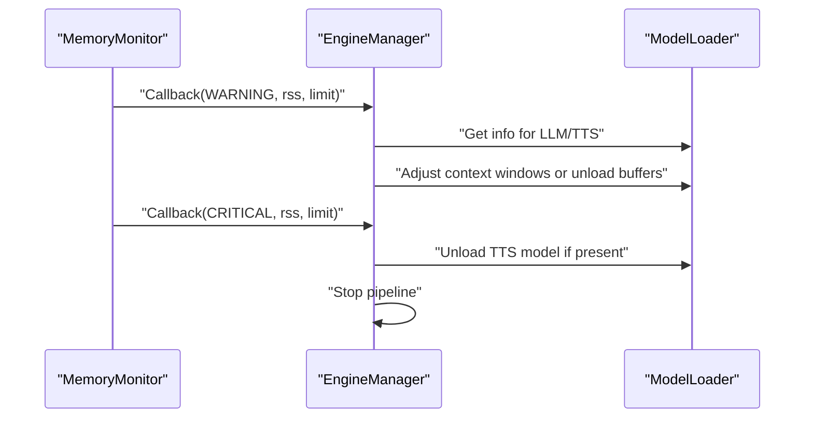
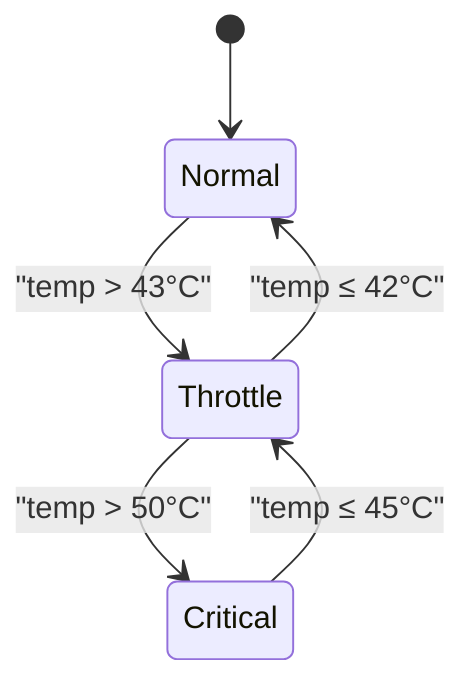
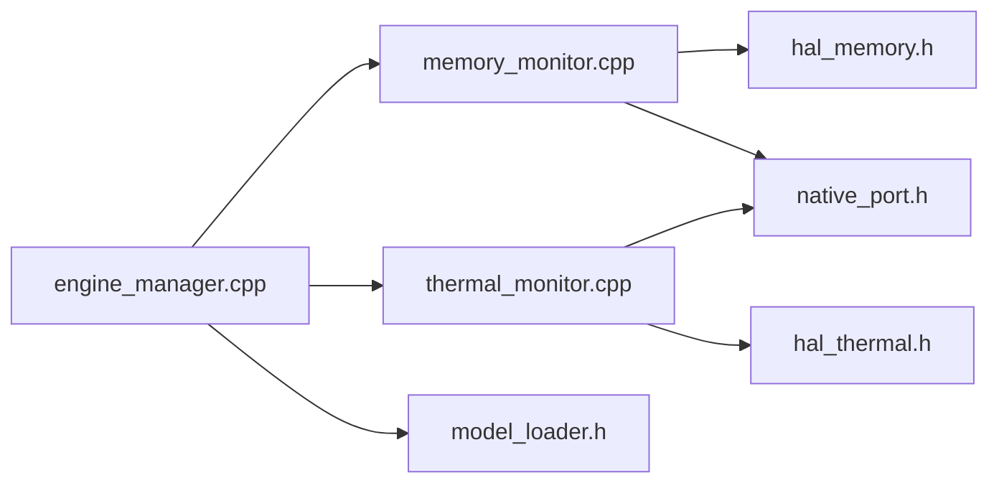

# Memory Optimization

<cite>
**Referenced Files in This Document**
- [memory_monitor.h](file://native/include/memory_monitor.h)
- [memory_monitor.cpp](file://native/src/memory_monitor.cpp)
- [hal_memory.h](file://native/hal/hal_memory.h)
- [hal_memory_android.c](file://native/hal/android/hal_memory_android.c)
- [hal_memory_ios.c](file://native/hal/ios/hal_memory_ios.c)
- [model_loader.h](file://native/include/model_loader.h)
- [model_loader.cpp](file://native/src/model_loader.cpp)
- [engine_manager.h](file://native/include/engine_manager.h)
- [engine_manager.cpp](file://native/src/engine_manager.cpp)
- [native_port.h](file://native/include/native_port.h)
- [thermal_monitor.h](file://native/include/thermal_monitor.h)
- [thermal_monitor.cpp](file://native/src/thermal_monitor.cpp)
- [hal_thermal_android.c](file://native/hal/android/hal_thermal_android.c)
- [hal_thermal_ios.m](file://native/hal/ios/hal_thermal_ios.m)
</cite>

## Table of Contents
1. [Introduction](#introduction)
2. [Project Structure](#project-structure)
3. [Core Components](#core-components)
4. [Architecture Overview](#architecture-overview)
5. [Detailed Component Analysis](#detailed-component-analysis)
6. [Dependency Analysis](#dependency-analysis)
7. [Performance Considerations](#performance-considerations)
8. [Troubleshooting Guide](#troubleshooting-guide)
9. [Conclusion](#conclusion)
10. [Appendices](#appendices)

## Introduction
This document explains QwenEcho’s memory optimization strategies with a focus on progressive cleanup mechanisms and RSS monitoring. It details the memory budget enforcement system, automatic model cache eviction triggers, and resource cleanup actions. It also covers memory pressure detection algorithms, platform-specific monitoring APIs (Android and iOS), integration points with the model loader for dynamic context window adjustments, and the relationship between thermal states and memory policies. Finally, it provides guidance on leak prevention, allocation tracking, performance impact analysis, benchmarking methodologies, and optimization recommendations across device memory constraints.

## Project Structure
QwenEcho implements memory optimization through a layered architecture:
- HAL layer: Platform-specific memory and thermal accessors
- Monitor layer: Background threads that sample metrics and enforce policies
- Engine layer: Lifecycle and orchestration coordinating models and pipeline
- Port layer: Messaging to the UI shell for observability and user feedback

**Diagram sources**
- [hal_memory.h:1-44](file://native/hal/hal_memory.h#L1-L44)
- [hal_memory_android.c:1-83](file://native/hal/android/hal_memory_android.c#L1-L83)
- [hal_memory_ios.c:1-58](file://native/hal/ios/hal_memory_ios.c#L1-L58)
- [hal_thermal_android.c:1-207](file://native/hal/android/hal_thermal_android.c#L1-L207)
- [hal_thermal_ios.m:1-113](file://native/hal/ios/hal_thermal_ios.m#L1-L113)
- [memory_monitor.h:1-108](file://native/include/memory_monitor.h#L1-L108)
- [memory_monitor.cpp:1-187](file://native/src/memory_monitor.cpp#L1-L187)
- [thermal_monitor.h:1-109](file://native/include/thermal_monitor.h#L1-L109)
- [thermal_monitor.cpp:1-190](file://native/src/thermal_monitor.cpp#L1-L190)
- [engine_manager.h:1-104](file://native/include/engine_manager.h#L1-L104)
- [engine_manager.cpp:1-202](file://native/src/engine_manager.cpp#L1-L202)
- [model_loader.h:1-142](file://native/include/model_loader.h#L1-L142)
- [model_loader.cpp:1-460](file://native/src/model_loader.cpp#L1-L460)
- [native_port.h:1-179](file://native/include/native_port.h#L1-L179)

**Section sources**
- [memory_monitor.h:1-108](file://native/include/memory_monitor.h#L1-L108)
- [memory_monitor.cpp:1-187](file://native/src/memory_monitor.cpp#L1-L187)
- [hal_memory.h:1-44](file://native/hal/hal_memory.h#L1-L44)
- [hal_memory_android.c:1-83](file://native/hal/android/hal_memory_android.c#L1-L83)
- [hal_memory_ios.c:1-58](file://native/hal/ios/hal_memory_ios.c#L1-L58)
- [thermal_monitor.h:1-109](file://native/include/thermal_monitor.h#L1-L109)
- [thermal_monitor.cpp:1-190](file://native/src/thermal_monitor.cpp#L1-L190)
- [hal_thermal_android.c:1-207](file://native/hal/android/hal_thermal_android.c#L1-L207)
- [hal_thermal_ios.m:1-113](file://native/hal/ios/hal_thermal_ios.m#L1-L113)
- [engine_manager.h:1-104](file://native/include/engine_manager.h#L1-L104)
- [engine_manager.cpp:1-202](file://native/src/engine_manager.cpp#L1-L202)
- [model_loader.h:1-142](file://native/include/model_loader.h#L1-L142)
- [model_loader.cpp:1-460](file://native/src/model_loader.cpp#L1-L460)
- [native_port.h:1-179](file://native/include/native_port.h#L1-L179)

## Core Components
- Memory Monitor: Periodically samples process RSS via HAL and enforces two-level mitigation using upward-only hysteresis. Level 1 (85%) triggers cache/buffer release; Level 2 (95%) triggers graceful pipeline stop and UI warning.
- Model Loader: Validates GGUF models, memory-maps files, creates inference contexts, and reports per-model memory usage. Provides unload semantics for releasing mapped regions and inference buffers.
- Thermal Monitor: Polls hardware temperature and drives a three-mode state machine with hysteresis. On transitions, posts thermal state to UI and invokes engine callback for adaptation.
- Native Port: Typed message dispatch from native code to Flutter UI for memory warnings, thermal state, and other events.
- Engine Manager: Orchestrates lifecycle, model loading, and pipeline control. Integrates with monitors to adapt behavior under memory or thermal pressure.

Key responsibilities:
- Progressive cleanup: Release LLM KV caches and TTS output buffers at warning level; stop pipeline at critical level.
- Budget enforcement: Use platform limits (Android ~2.5 GB, iOS ~2.0 GB) to compute thresholds.
- Observability: Post memory and thermal messages to UI for diagnostics and user feedback.

**Section sources**
- [memory_monitor.h:1-108](file://native/include/memory_monitor.h#L1-L108)
- [memory_monitor.cpp:1-187](file://native/src/memory_monitor.cpp#L1-L187)
- [model_loader.h:1-142](file://native/include/model_loader.h#L1-L142)
- [model_loader.cpp:1-460](file://native/src/model_loader.cpp#L1-L460)
- [thermal_monitor.h:1-109](file://native/include/thermal_monitor.h#L1-L109)
- [thermal_monitor.cpp:1-190](file://native/src/thermal_monitor.cpp#L1-L190)
- [native_port.h:1-179](file://native/include/native_port.h#L1-L179)
- [engine_manager.h:1-104](file://native/include/engine_manager.h#L1-L104)
- [engine_manager.cpp:1-202](file://native/src/engine_manager.cpp#L1-L202)

## Architecture Overview
The memory optimization architecture integrates monitoring, policy enforcement, and resource management:

**Diagram sources**
- [memory_monitor.cpp:59-116](file://native/src/memory_monitor.cpp#L59-L116)
- [memory_monitor.h:22-42](file://native/include/memory_monitor.h#L22-L42)
- [native_port.h:154-159](file://native/include/native_port.h#L154-L159)
- [engine_manager.cpp:143-168](file://native/src/engine_manager.cpp#L143-L168)
- [model_loader.cpp:419-448](file://native/src/model_loader.cpp#L419-L448)

## Detailed Component Analysis

### Memory Monitor
- Sampling: Spawns a background thread polling every 2 seconds.
- Thresholds: Computes absolute thresholds from platform limit (Android 2.5 GB, iOS 2.0 GB).
- Hysteresis: Upward-only transitions prevent flapping; once at WARNING, stays until CRITICAL or restart.
- Actions:
  - WARNING: Invoke user callback to release LLM KV caches and TTS output buffers.
  - CRITICAL: Stop pipeline gracefully and post memory warning to UI.

**Diagram sources**
- [memory_monitor.cpp:59-116](file://native/src/memory_monitor.cpp#L59-L116)
- [memory_monitor.h:22-42](file://native/include/memory_monitor.h#L22-L42)
- [native_port.h:154-159](file://native/include/native_port.h#L154-L159)

**Section sources**
- [memory_monitor.h:1-108](file://native/include/memory_monitor.h#L1-L108)
- [memory_monitor.cpp:1-187](file://native/src/memory_monitor.cpp#L1-L187)

### HAL Memory (Platform-Specific RSS and Limits)
- Android: Reads /proc/self/statm resident pages and multiplies by page size (supports 4KB and 16KB pages). Platform limit is 2.5 GB.
- iOS: Uses task_info TASK_VM_INFO phys_footprint as RSS proxy. Platform limit is 2.0 GB.

**Diagram sources**
- [hal_memory.h:1-44](file://native/hal/hal_memory.h#L1-L44)
- [hal_memory_android.c:1-83](file://native/hal/android/hal_memory_android.c#L1-L83)
- [hal_memory_ios.c:1-58](file://native/hal/ios/hal_memory_ios.c#L1-L58)

**Section sources**
- [hal_memory.h:1-44](file://native/hal/hal_memory.h#L1-L44)
- [hal_memory_android.c:1-83](file://native/hal/android/hal_memory_android.c#L1-L83)
- [hal_memory_ios.c:1-58](file://native/hal/ios/hal_memory_ios.c#L1-L58)

### Model Loader Integration for Dynamic Context Window Adjustment
- Validation: Checks file existence, permissions, magic bytes, and quantization type (INT4 variants).
- Mapping: Memory-maps GGUF files for OS page cache benefits.
- Inference Context: Creates per-model inference contexts with estimated buffer sizes.
- Reporting: Exposes per-model memory usage (mapped region + inference buffers).
- Unload Semantics: Releases inference context, unmaps file, closes FD.

Integration points for memory optimization:
- At WARNING: Reduce LLM KV cache size or unload TTS buffers to free memory.
- At CRITICAL: Unload non-critical models (e.g., TTS) and stop pipeline to reduce footprint.

**Diagram sources**
- [model_loader.h:67-142](file://native/include/model_loader.h#L67-L142)
- [model_loader.cpp:284-460](file://native/src/model_loader.cpp#L284-L460)
- [engine_manager.cpp:143-168](file://native/src/engine_manager.cpp#L143-L168)

**Section sources**
- [model_loader.h:1-142](file://native/include/model_loader.h#L1-L142)
- [model_loader.cpp:1-460](file://native/src/model_loader.cpp#L1-L460)
- [engine_manager.cpp:1-202](file://native/src/engine_manager.cpp#L1-L202)

### Thermal Monitor and Memory Policy Relationship
- State Machine: Normal → Throttle (>43°C), Throttle ↔ Normal (≤42°C), Throttle → Critical (>50°C), Critical → Throttle (≤45°C).
- Notifications: Posts thermal state to UI and invokes engine callback for adaptation.
- Memory Policy Interaction: Under Throttle/Critical thermal states, the engine can proactively reduce model context sizes or pause heavy tasks to avoid compounding memory pressure.

**Diagram sources**
- [thermal_monitor.h:26-33](file://native/include/thermal_monitor.h#L26-L33)
- [thermal_monitor.cpp:59-92](file://native/src/thermal_monitor.cpp#L59-L92)
- [hal_thermal_android.c:159-181](file://native/hal/android/hal_thermal_android.c#L159-L181)
- [hal_thermal_ios.m:29-51](file://native/hal/ios/hal_thermal_ios.m#L29-L51)

**Section sources**
- [thermal_monitor.h:1-109](file://native/include/thermal_monitor.h#L1-L109)
- [thermal_monitor.cpp:1-190](file://native/src/thermal_monitor.cpp#L1-L190)
- [hal_thermal_android.c:1-207](file://native/hal/android/hal_thermal_android.c#L1-L207)
- [hal_thermal_ios.m:1-113](file://native/hal/ios/hal_thermal_ios.m#L1-L113)

### Native Port Messaging for Observability
- Memory Warning: Posts MSG_MEMORY_WARNING with current RSS, limit, and level.
- Thermal State: Posts MSG_THERMAL_STATE with mode and temperature.
- These messages enable UI-level dashboards and alerts for memory and thermal conditions.

**Section sources**
- [native_port.h:148-159](file://native/include/native_port.h#L148-L159)
- [memory_monitor.cpp:99-105](file://native/src/memory_monitor.cpp#L99-L105)
- [thermal_monitor.cpp:108-116](file://native/src/thermal_monitor.cpp#L108-L116)

## Dependency Analysis
High-level dependencies among core components:

**Diagram sources**
- [memory_monitor.cpp:16-21](file://native/src/memory_monitor.cpp#L16-L21)
- [memory_monitor.h:1-108](file://native/include/memory_monitor.h#L1-L108)
- [native_port.h:1-179](file://native/include/native_port.h#L1-L179)
- [thermal_monitor.cpp:18-21](file://native/src/thermal_monitor.cpp#L18-L21)
- [engine_manager.cpp:9-11](file://native/src/engine_manager.cpp#L9-L11)
- [model_loader.h:1-142](file://native/include/model_loader.h#L1-L142)

**Section sources**
- [memory_monitor.cpp:1-187](file://native/src/memory_monitor.cpp#L1-L187)
- [memory_monitor.h:1-108](file://native/include/memory_monitor.h#L1-L108)
- [native_port.h:1-179](file://native/include/native_port.h#L1-L179)
- [thermal_monitor.cpp:1-190](file://native/src/thermal_monitor.cpp#L1-L190)
- [engine_manager.cpp:1-202](file://native/src/engine_manager.cpp#L1-L202)
- [model_loader.h:1-142](file://native/include/model_loader.h#L1-L142)

## Performance Considerations
- Monitoring Overhead: The memory monitor polls every 2 seconds; ensure callbacks are lightweight to avoid blocking the worker thread.
- Threshold Tuning: Adjust thresholds based on device profile and workload characteristics.
- Model Unloading Cost: Unloading models incurs I/O and reinitialization costs; prefer incremental reductions (context window resizing) before full unload.
- Thermal-Memory Coupling: Combine thermal throttling with memory reduction to maintain stability under sustained load.
- Page Cache Benefits: Memory mapping leverages OS page cache; avoid excessive unmapping/mapping cycles.

[No sources needed since this section provides general guidance]

## Troubleshooting Guide
Common issues and resolutions:
- No memory warnings received: Verify HAL returns valid RSS and limit values; check that monitor is started and callback is registered.
- Frequent level flapping: Ensure hysteresis is enabled and thresholds are not too close; confirm no external allocations spike during sampling.
- Pipeline does not stop at critical: Validate engine manager’s stop logic and that the callback path triggers pipeline termination.
- Thermal readings unavailable: On Android, AThermal may be unavailable; fallback to sysfs should work. On iOS, ensure NSProcessInfo is accessible.

Actionable checks:
- Confirm native port registration before posting messages.
- Inspect per-model memory usage via model loader info to identify large consumers.
- Log threshold computations and RSS samples to diagnose misconfigurations.

**Section sources**
- [memory_monitor.cpp:59-116](file://native/src/memory_monitor.cpp#L59-L116)
- [native_port.h:148-159](file://native/include/native_port.h#L148-L159)
- [model_loader.cpp:382-404](file://native/src/model_loader.cpp#L382-L404)
- [hal_thermal_android.c:159-181](file://native/hal/android/hal_thermal_android.c#L159-L181)
- [hal_thermal_ios.m:46-51](file://native/hal/ios/hal_thermal_ios.m#L46-L51)

## Conclusion
QwenEcho’s memory optimization combines precise RSS monitoring, robust hysteresis-based pressure detection, and proactive resource management. By integrating with the model loader for dynamic context adjustments and coupling thermal states with memory policies, the system maintains stability across diverse devices. The design emphasizes low overhead, clear observability, and graceful degradation under pressure.

[No sources needed since this section summarizes without analyzing specific files]

## Appendices

### Platform-Specific Monitoring Implementation Details
- Android RSS: Read /proc/self/statm resident field and multiply by page size; handle 4KB and 16KB pages.
- iOS RSS: Use task_info TASK_VM_INFO phys_footprint as the recommended metric aligned with Jetsam enforcement.

**Section sources**
- [hal_memory_android.c:42-76](file://native/hal/android/hal_memory_android.c#L42-L76)
- [hal_memory_ios.c:30-51](file://native/hal/ios/hal_memory_ios.c#L30-L51)

### Memory Leak Prevention and Allocation Tracking
- Ensure all loaded models are unloaded during destruction paths.
- Track per-model memory usage via model loader info to detect anomalies.
- Avoid holding references to temporary buffers beyond their scope; release promptly on warnings.

**Section sources**
- [model_loader.cpp:419-448](file://native/src/model_loader.cpp#L419-L448)
- [model_loader.cpp:382-404](file://native/src/model_loader.cpp#L382-L404)

### Benchmarking Methodologies for Memory Usage Patterns
- Baseline: Measure RSS at idle with models loaded but pipeline stopped.
- Load Test: Run continuous ASR→LLM→TTS sessions; record RSS over time and note threshold crossings.
- Stress Test: Increase context window sizes incrementally; observe when warnings trigger and what actions occur.
- Thermal Correlation: Repeat tests under varying thermal states to validate combined effects.
- Metrics: Peak RSS, average RSS, time-to-warning, number of evictions, pipeline interruptions, and recovery time.

[No sources needed since this section provides general guidance]

### Optimization Recommendations by Device Memory Constraints
- Low-memory devices (~2 GB): Prefer smaller context windows, aggressive cache eviction at warning, early TTS unload at critical.
- Mid-range devices (~4–6 GB): Moderate context sizes, selective unloads, rely on thermal-mem coupling for sustained loads.
- High-end devices (>8 GB): Larger context windows, delayed unloads, prioritize quality while still honoring critical thresholds.

[No sources needed since this section provides general guidance]