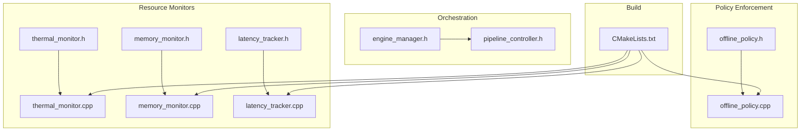
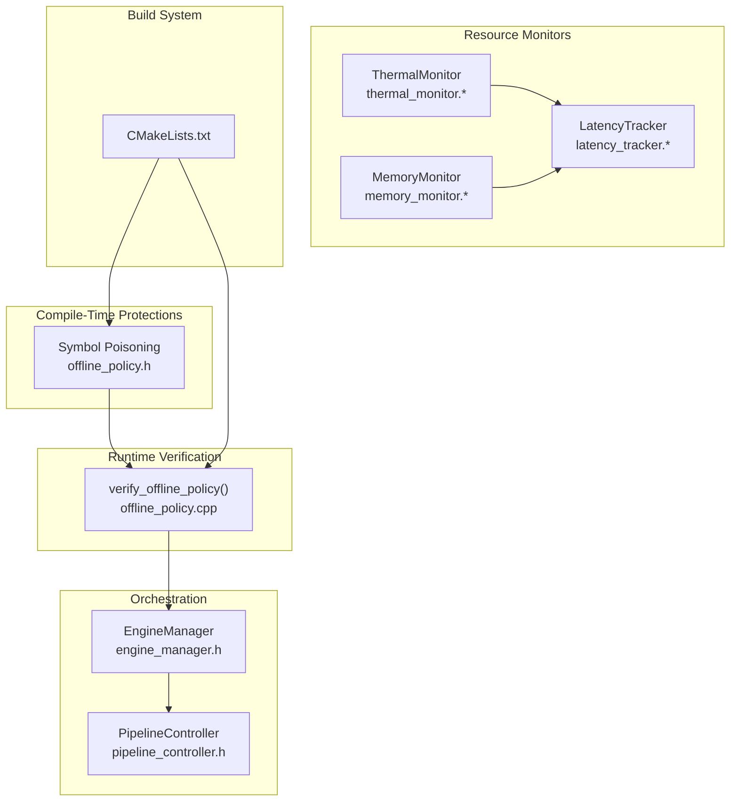
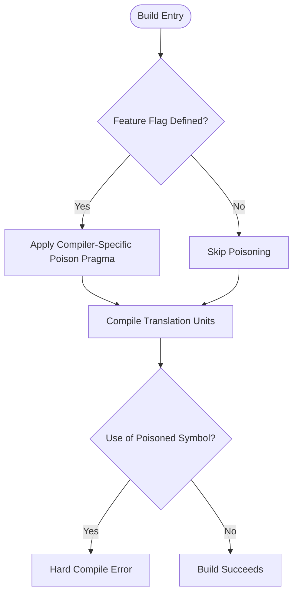
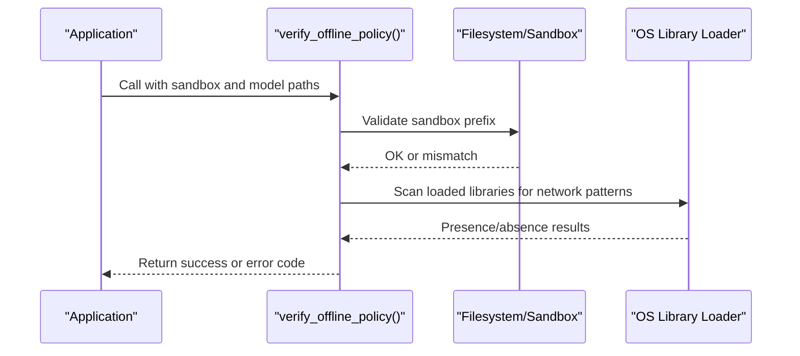
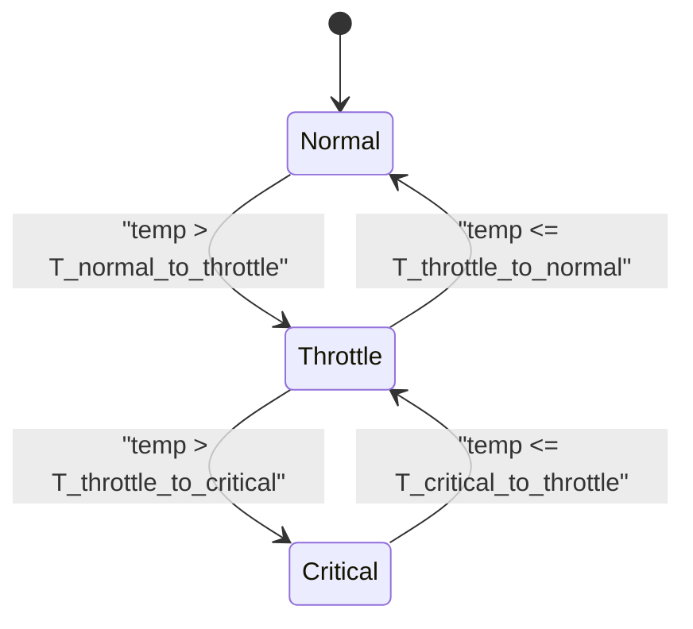
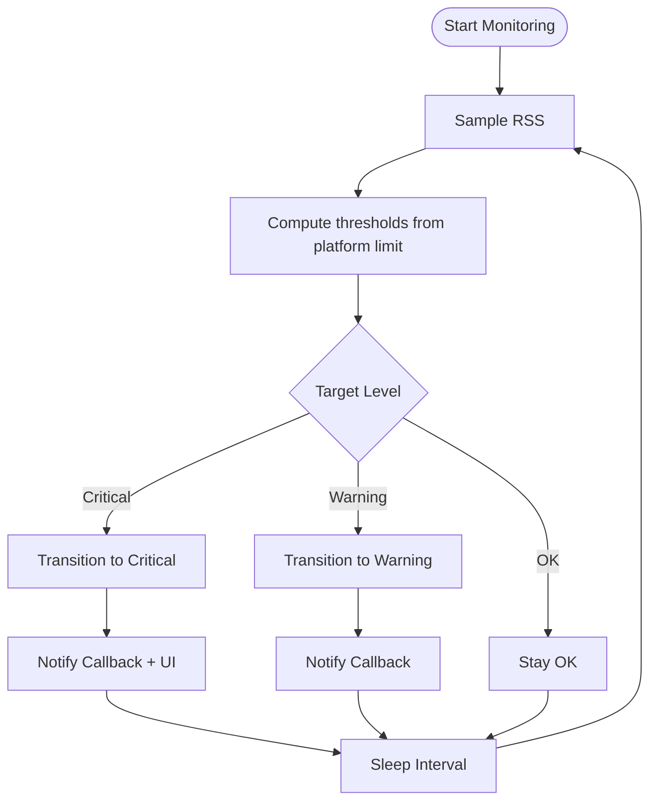
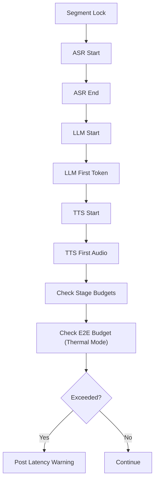
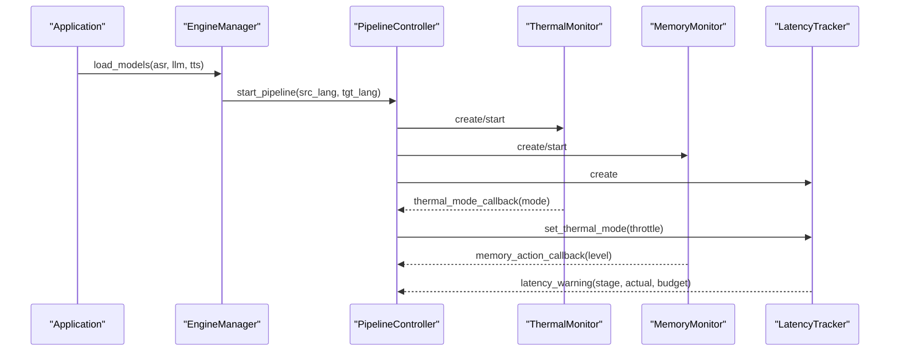
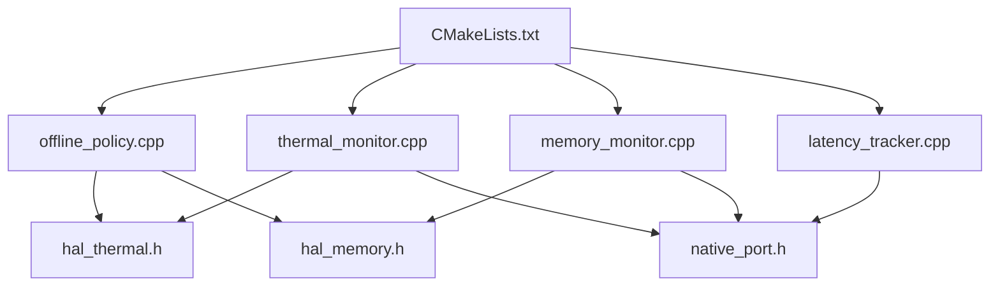

# Offline Policy Engine

<cite>
**Referenced Files in This Document**
- [offline_policy.h](file://native/include/offline_policy.h)
- [offline_policy.cpp](file://native/src/offline_policy.cpp)
- [thermal_monitor.h](file://native/include/thermal_monitor.h)
- [thermal_monitor.cpp](file://native/src/thermal_monitor.cpp)
- [memory_monitor.h](file://native/include/memory_monitor.h)
- [memory_monitor.cpp](file://native/src/memory_monitor.cpp)
- [latency_tracker.h](file://native/include/latency_tracker.h)
- [latency_tracker.cpp](file://native/src/latency_tracker.cpp)
- [engine_manager.h](file://native/include/engine_manager.h)
- [pipeline_controller.h](file://native/include/pipeline_controller.h)
- [CMakeLists.txt](file://native/CMakeLists.txt)
</cite>

## Table of Contents
1. [Introduction](#introduction)
2. [Project Structure](#project-structure)
3. [Core Components](#core-components)
4. [Architecture Overview](#architecture-overview)
5. [Detailed Component Analysis](#detailed-component-analysis)
6. [Dependency Analysis](#dependency-analysis)
7. [Performance Considerations](#performance-considerations)
8. [Troubleshooting Guide](#troubleshooting-guide)
9. [Conclusion](#conclusion)
10. [Appendices](#appendices)

## Introduction
This document explains QwenEcho’s offline policy engine, focusing on compile-time and runtime network prevention mechanisms, the symbol poisoning system that blocks accidental network API usage, and the security guarantees provided by the air-gapped architecture. It also documents the policy decision framework that adapts processing quality based on thermal state, memory pressure, and measured latency, including concrete examples of policy rule implementation, conditional compilation directives, and runtime policy evaluation. Finally, it covers integration with the thermal monitor, memory monitor, and latency tracker for holistic resource management, as well as policy versioning, configuration management, and testing strategies to verify offline compliance.

## Project Structure
The offline policy engine is implemented in native C/C++ components under the native directory:
- Compile-time and runtime enforcement resides in offline_policy.h and offline_policy.cpp.
- Resource monitors (thermal, memory, latency) are defined in their respective headers and implementations.
- Orchestration interfaces are exposed via engine_manager.h and pipeline_controller.h.
- Build configuration is managed by CMakeLists.txt.

**Diagram sources**
- [offline_policy.h:1-120](file://native/include/offline_policy.h#L1-L120)
- [offline_policy.cpp:1-219](file://native/src/offline_policy.cpp#L1-L219)
- [thermal_monitor.h:1-109](file://native/include/thermal_monitor.h#L1-L109)
- [thermal_monitor.cpp:1-190](file://native/src/thermal_monitor.cpp#L1-L190)
- [memory_monitor.h:1-108](file://native/include/memory_monitor.h#L1-L108)
- [memory_monitor.cpp:1-187](file://native/src/memory_monitor.cpp#L1-L187)
- [latency_tracker.h:1-224](file://native/include/latency_tracker.h#L1-L224)
- [latency_tracker.cpp:1-285](file://native/src/latency_tracker.cpp#L1-L285)
- [engine_manager.h:1-104](file://native/include/engine_manager.h#L1-L104)
- [pipeline_controller.h:1-107](file://native/include/pipeline_controller.h#L1-L107)
- [CMakeLists.txt:1-126](file://native/CMakeLists.txt#L1-L126)

**Section sources**
- [offline_policy.h:1-120](file://native/include/offline_policy.h#L1-L120)
- [offline_policy.cpp:1-219](file://native/src/offline_policy.cpp#L1-L219)
- [thermal_monitor.h:1-109](file://native/include/thermal_monitor.h#L1-L109)
- [memory_monitor.h:1-108](file://native/include/memory_monitor.h#L1-L108)
- [latency_tracker.h:1-224](file://native/include/latency_tracker.h#L1-L224)
- [engine_manager.h:1-104](file://native/include/engine_manager.h#L1-L104)
- [pipeline_controller.h:1-107](file://native/include/pipeline_controller.h#L1-L107)
- [CMakeLists.txt:1-126](file://native/CMakeLists.txt#L1-L126)

## Core Components
- Offline Policy Enforcement: Provides compile-time symbol poisoning and runtime verification to ensure zero network access after model provisioning.
- Thermal Monitor: Polls hardware temperature and drives a three-mode state machine with hysteresis; notifies UI and triggers adaptation callbacks.
- Memory Monitor: Periodically samples process RSS and triggers two-level mitigation when approaching platform limits.
- Latency Tracker: Measures per-segment pipeline latency and reports SLA violations via messages; adapts E2E budgets based on thermal mode.
- Orchestration Interfaces: Engine Manager and Pipeline Controller coordinate lifecycle and resource creation.

Key responsibilities:
- Enforce air-gapped operation at build time and runtime.
- Adapt processing quality using thermal, memory, and latency signals.
- Provide clear error codes and notifications for policy violations.

**Section sources**
- [offline_policy.h:1-120](file://native/include/offline_policy.h#L1-L120)
- [offline_policy.cpp:1-219](file://native/src/offline_policy.cpp#L1-L219)
- [thermal_monitor.h:1-109](file://native/include/thermal_monitor.h#L1-L109)
- [memory_monitor.h:1-108](file://native/include/memory_monitor.h#L1-L108)
- [latency_tracker.h:1-224](file://native/include/latency_tracker.h#L1-L224)

## Architecture Overview
The offline policy engine integrates compile-time protections with runtime checks and resource-aware policy decisions. The following diagram maps actual source files to architectural components.

**Diagram sources**
- [offline_policy.h:1-120](file://native/include/offline_policy.h#L1-L120)
- [offline_policy.cpp:1-219](file://native/src/offline_policy.cpp#L1-L219)
- [thermal_monitor.h:1-109](file://native/include/thermal_monitor.h#L1-L109)
- [memory_monitor.h:1-108](file://native/include/memory_monitor.h#L1-L108)
- [latency_tracker.h:1-224](file://native/include/latency_tracker.h#L1-L224)
- [engine_manager.h:1-104](file://native/include/engine_manager.h#L1-L104)
- [pipeline_controller.h:1-107](file://native/include/pipeline_controller.h#L1-L107)
- [CMakeLists.txt:1-126](file://native/CMakeLists.txt#L1-L126)

## Detailed Component Analysis

### Offline Policy Engine: Compile-Time Symbol Poisoning
- Purpose: Prevent accidental use of networking APIs by poisoning identifiers during compilation.
- Mechanism: Conditional compilation guarded by a feature flag enables compiler-specific poison pragmas for socket-related and HTTP client symbols.
- Platform coverage: GCC/Clang hard errors; MSVC warnings via deprecated pragma.
- Security guarantee: Any translation unit attempting to call poisoned symbols will fail to build, ensuring no network code is introduced inadvertently.

**Diagram sources**
- [offline_policy.h:53-84](file://native/include/offline_policy.h#L53-L84)

**Section sources**
- [offline_policy.h:53-84](file://native/include/offline_policy.h#L53-L84)

### Offline Policy Engine: Runtime Verification
- Purpose: Confirm offline-only policy at engine initialization.
- Checks performed:
  - Validate sandbox path non-empty.
  - Ensure all model paths reside within the application sandbox.
  - Scan loaded libraries for known network dependencies (platform-specific).
  - Confirm absence of telemetry/analytics entry points.
- Return semantics: Success or specific error codes indicating permission or initialization violations.

**Diagram sources**
- [offline_policy.cpp:155-218](file://native/src/offline_policy.cpp#L155-L218)

**Section sources**
- [offline_policy.cpp:155-218](file://native/src/offline_policy.cpp#L155-L218)

### Thermal Monitor: State Machine and Hysteresis
- States: Normal, Throttle, Critical.
- Transitions:
  - Normal → Throttle when temp > threshold.
  - Throttle → Normal when temp ≤ lower threshold.
  - Throttle → Critical when temp > higher threshold.
  - Critical → Throttle when temp ≤ recovery threshold.
- Behavior: On each transition, posts a message to the UI shell and invokes an adaptation callback.

**Diagram sources**
- [thermal_monitor.cpp:28-92](file://native/src/thermal_monitor.cpp#L28-L92)

**Section sources**
- [thermal_monitor.h:26-41](file://native/include/thermal_monitor.h#L26-L41)
- [thermal_monitor.cpp:28-92](file://native/src/thermal_monitor.cpp#L28-L92)

### Memory Monitor: Two-Level Mitigation
- Levels: OK, Warning (85% of limit), Critical (95% of limit).
- Behavior:
  - Level transitions upward only due to hysteresis.
  - At Warning: invoke user callback to release caches/buffers.
  - At Critical: invoke user callback and post a warning message to UI.
- Polling interval: Low-priority background thread sampling every 2 seconds.

**Diagram sources**
- [memory_monitor.cpp:59-116](file://native/src/memory_monitor.cpp#L59-L116)

**Section sources**
- [memory_monitor.h:22-42](file://native/include/memory_monitor.h#L22-L42)
- [memory_monitor.cpp:59-116](file://native/src/memory_monitor.cpp#L59-L116)

### Latency Tracker: Stage Budgets and E2E SLA
- Stage budgets:
  - ASR first-character latency budget.
  - LLM first-token latency budget.
  - TTS first-audio latency budget.
- E2E budgets:
  - Normal mode total budget.
  - Throttle mode total budget.
- Behavior:
  - Records timestamps at stage boundaries.
  - Computes latencies and compares against budgets.
  - Posts warnings when budgets are exceeded.
  - Adapts E2E budget based on current thermal mode.

**Diagram sources**
- [latency_tracker.cpp:122-128](file://native/src/latency_tracker.cpp#L122-L128)
- [latency_tracker.cpp:240-267](file://native/src/latency_tracker.cpp#L240-L267)

**Section sources**
- [latency_tracker.h:34-49](file://native/include/latency_tracker.h#L34-L49)
- [latency_tracker.cpp:122-128](file://native/src/latency_tracker.cpp#L122-L128)
- [latency_tracker.cpp:240-267](file://native/src/latency_tracker.cpp#L240-L267)

### Integration with Orchestration
- Engine Manager coordinates lifecycle and model loading, transitioning states and guarding operations.
- Pipeline Controller orchestrates component creation, startup, and graceful shutdown, integrating monitors into the pipeline.

**Diagram sources**
- [engine_manager.h:53-70](file://native/include/engine_manager.h#L53-L70)
- [pipeline_controller.h:63-82](file://native/include/pipeline_controller.h#L63-L82)
- [thermal_monitor.h:59-60](file://native/include/thermal_monitor.h#L59-L60)
- [memory_monitor.h:59-60](file://native/include/memory_monitor.h#L59-L60)
- [latency_tracker.h:119](file://native/include/latency_tracker.h#L119)

**Section sources**
- [engine_manager.h:53-70](file://native/include/engine_manager.h#L53-L70)
- [pipeline_controller.h:63-82](file://native/include/pipeline_controller.h#L63-L82)

## Dependency Analysis
The offline policy engine depends on platform HALs for thermal and memory data, and uses native port messaging to notify the UI shell. The build system configures linking and includes, ensuring minimal dependencies and strict offline constraints.

**Diagram sources**
- [offline_policy.cpp:53-103](file://native/src/offline_policy.cpp#L53-L103)
- [thermal_monitor.cpp:18-20](file://native/src/thermal_monitor.cpp#L18-L20)
- [memory_monitor.cpp:16-21](file://native/src/memory_monitor.cpp#L16-L21)
- [latency_tracker.cpp:25-26](file://native/src/latency_tracker.cpp#L25-L26)
- [CMakeLists.txt:25-68](file://native/CMakeLists.txt#L25-L68)

**Section sources**
- [CMakeLists.txt:25-68](file://native/CMakeLists.txt#L25-L68)

## Performance Considerations
- Thermal monitoring runs at low priority with periodic polling to minimize CPU impact.
- Memory monitoring uses upward-only hysteresis to avoid thrashing and reduces callback frequency.
- Latency tracking maintains a bounded buffer of records and performs constant-time checks per event.
- Policy adaptations (e.g., adjusting E2E budgets) help maintain responsiveness under thermal stress.

[No sources needed since this section provides general guidance]

## Troubleshooting Guide
Common issues and resolutions:
- Build failures due to symbol poisoning:
  - Cause: Accidental use of network APIs after enabling offline policy enforcement.
  - Resolution: Remove or guard offending calls; ensure feature flag is correctly configured.
- Runtime policy violation:
  - Cause: Model paths outside sandbox or presence of network libraries.
  - Resolution: Provision models within app sandbox; audit linked libraries and remove network dependencies.
- Excessive latency warnings:
  - Cause: Stage budgets exceeded due to device performance or thermal throttling.
  - Resolution: Adjust pipeline parameters; rely on thermal mode adaptation; investigate stage bottlenecks.

**Section sources**
- [offline_policy.h:90-114](file://native/include/offline_policy.h#L90-L114)
- [offline_policy.cpp:155-218](file://native/src/offline_policy.cpp#L155-L218)
- [latency_tracker.cpp:122-128](file://native/src/latency_tracker.cpp#L122-L128)

## Conclusion
QwenEcho’s offline policy engine enforces strict air-gapped operation through compile-time symbol poisoning and runtime verification. Resource monitors provide adaptive policy decisions based on thermal state, memory pressure, and measured latency, ensuring robust performance while maintaining offline guarantees. The orchestration layer integrates these components seamlessly, and the build system ensures minimal dependencies. Together, these mechanisms deliver strong security and reliability for offline-first applications.

[No sources needed since this section summarizes without analyzing specific files]

## Appendices

### Policy Rule Examples and Conditional Compilation
- Conditional compilation directive:
  - Feature flag controls whether symbol poisoning is applied.
  - Example path: [offline_policy.h:53-84](file://native/include/offline_policy.h#L53-L84)
- Policy rule implementation:
  - Sandbox validation and library scanning in runtime verification.
  - Example path: [offline_policy.cpp:155-218](file://native/src/offline_policy.cpp#L155-L218)
- Runtime policy evaluation:
  - Thermal mode updates influence latency budgets.
  - Example path: [latency_tracker.cpp:240-267](file://native/src/latency_tracker.cpp#L240-L267)

### Configuration Management
- Build configuration:
  - Includes directories, source collection, and platform-specific linking.
  - Example path: [CMakeLists.txt:25-68](file://native/CMakeLists.txt#L25-L68)
- Platform requirements:
  - Android manifest and iOS plist constraints documented in header comments.
  - Example path: [offline_policy.h:14-28](file://native/include/offline_policy.h#L14-L28)

### Testing Strategies for Offline Compliance
- Unit tests for monitors and trackers:
  - RapidCheck-based property tests integrated via CMake.
  - Example path: [CMakeLists.txt:71-125](file://native/CMakeLists.txt#L71-L125)
- Offline verification tests:
  - Invoke runtime verification with valid sandbox paths and model files.
  - Assert success or expected error codes.
  - Example path: [offline_policy.cpp:155-218](file://native/src/offline_policy.cpp#L155-L218)

### Extending Policy Rules and Maintaining Offline Guarantees
- Guidelines:
  - Add new policy checks to runtime verification function.
  - Update compile-time poisoning if new network APIs must be blocked.
  - Integrate new monitors by creating handles and starting them in the pipeline controller.
  - Ensure build system does not link additional network libraries.
- References:
  - Policy extension points: [offline_policy.cpp:155-218](file://native/src/offline_policy.cpp#L155-L218)
  - Monitor integration: [pipeline_controller.h:63-82](file://native/include/pipeline_controller.h#L63-L82)
  - Build constraints: [CMakeLists.txt:52-68](file://native/CMakeLists.txt#L52-L68)