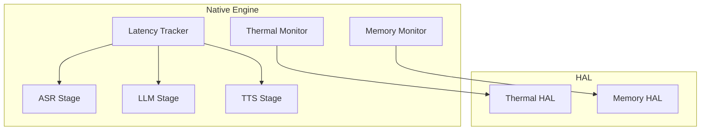
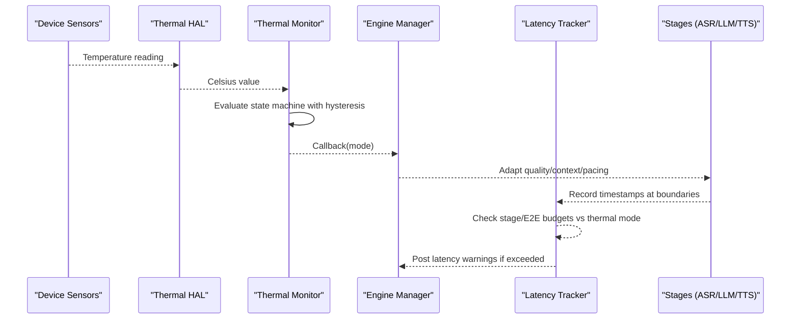
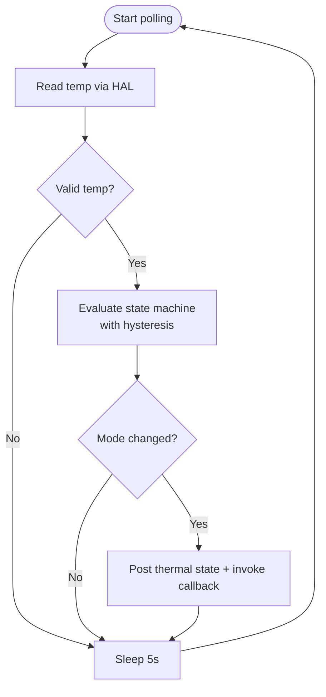
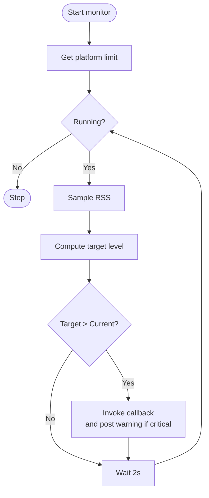
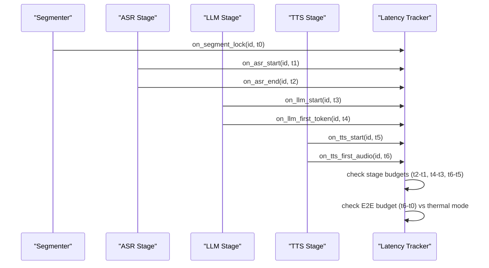
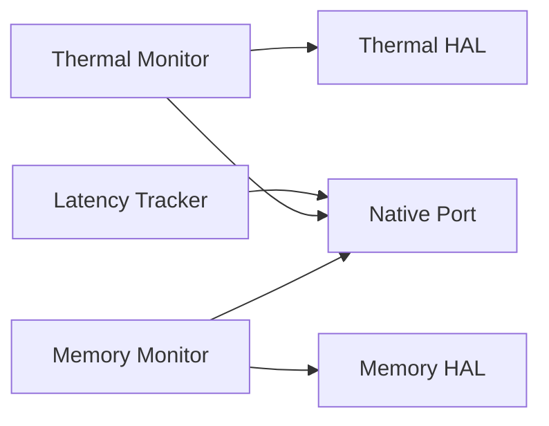

# Performance Optimization

<cite>
**Referenced Files in This Document**
- [README.md](file://README.md)
- [thermal_monitor.h](file://native/include/thermal_monitor.h)
- [thermal_monitor.cpp](file://native/src/thermal_monitor.cpp)
- [hal_thermal.h](file://native/hal/hal_thermal.h)
- [hal_thermal_android.c](file://native/hal/android/hal_thermal_android.c)
- [hal_thermal_ios.m](file://native/hal/ios/hal_thermal_ios.m)
- [memory_monitor.h](file://native/include/memory_monitor.h)
- [memory_monitor.cpp](file://native/src/memory_monitor.cpp)
- [hal_memory.h](file://native/hal/hal_memory.h)
- [hal_memory_android.c](file://native/hal/android/hal_memory_android.c)
- [hal_memory_ios.c](file://native/hal/ios/hal_memory_ios.c)
- [latency_tracker.h](file://native/include/latency_tracker.h)
- [latency_tracker.cpp](file://native/src/latency_tracker.cpp)
</cite>

## Table of Contents
1. Introduction
2. Project Structure
3. Core Components
4. Architecture Overview
5. Detailed Component Analysis
6. Dependency Analysis
7. Performance Considerations
8. Troubleshooting Guide
9. Conclusion

## Introduction
This document explains QwenEcho’s performance optimization strategies for real-time mobile AI processing. It focuses on:
- A three-mode thermal state machine (Normal, Throttle, Critical) with adaptive throttling and automatic model quality adjustment
- Progressive memory cleanup driven by RSS monitoring and platform budget enforcement
- End-to-end latency tracking from audio capture to speech output
- Concrete examples of thermal policy implementation, memory pressure response algorithms, and performance degradation prevention
- CPU/GPU utilization optimization, cache management strategies, and platform-specific optimizations for Android and iOS
- Benchmarking methodologies and performance regression detection approaches

## Project Structure
QwenEcho is a Flutter UI shell over a C/C++ native engine. The native engine implements the core pipeline and performance subsystems:
- Thermal Monitor: polls device temperature via HAL and drives a three-mode state machine
- Memory Monitor: samples process RSS via HAL and enforces two-level mitigation
- Latency Tracker: records timestamps at stage boundaries and checks SLA budgets per thermal mode
- HAL layer: abstracts Android/iOS specifics for thermal and memory access

**Diagram sources**
- [thermal_monitor.h:1-109](file://native/include/thermal_monitor.h#L1-L109)
- [thermal_monitor.cpp:1-190](file://native/src/thermal_monitor.cpp#L1-L190)
- [memory_monitor.h:1-108](file://native/include/memory_monitor.h#L1-L108)
- [memory_monitor.cpp:1-187](file://native/src/memory_monitor.cpp#L1-L187)
- [latency_tracker.h:1-224](file://native/include/latency_tracker.h#L1-L224)
- [latency_tracker.cpp:1-285](file://native/src/latency_tracker.cpp#L1-L285)
- [hal_thermal.h:1-53](file://native/hal/hal_thermal.h#L1-L53)
- [hal_memory.h:1-44](file://native/hal/hal_memory.h#L1-L44)

**Section sources**
- [README.md:15-40](file://README.md#L15-L40)

## Core Components
- Thermal Monitor: Low-priority polling thread reads temperature via HAL, evaluates a hysteresis-based state machine, posts thermal state updates, and invokes an engine callback to adapt behavior.
- Memory Monitor: Background thread samples RSS every 2 seconds, compares against platform limits, and triggers upward-only hysteresis transitions to warning/critical levels.
- Latency Tracker: Maintains per-segment timestamp records across ASR/LLM/TTS boundaries, checks stage and E2E budgets based on current thermal mode, and posts warnings when SLAs are violated.

Key behaviors:
- Adaptive throttling: reduce context size, lower ASR sampling rate, or pause pipeline depending on thermal state
- Progressive memory cleanup: release KV caches and TTS buffers at warning; stop pipeline at critical
- E2E latency budgets: Normal ≤800ms, Throttle ≤1200ms; stage budgets enforced independently

**Section sources**
- [thermal_monitor.h:1-109](file://native/include/thermal_monitor.h#L1-L109)
- [thermal_monitor.cpp:1-190](file://native/src/thermal_monitor.cpp#L1-L190)
- [memory_monitor.h:1-108](file://native/include/memory_monitor.h#L1-L108)
- [memory_monitor.cpp:1-187](file://native/src/memory_monitor.cpp#L1-L187)
- [latency_tracker.h:1-224](file://native/include/latency_tracker.h#L1-L224)
- [latency_tracker.cpp:1-285](file://native/src/latency_tracker.cpp#L1-L285)

## Architecture Overview
The performance subsystem integrates tightly with the pipeline and platform HALs.

**Diagram sources**
- [thermal_monitor.cpp:99-128](file://native/src/thermal_monitor.cpp#L99-L128)
- [latency_tracker.cpp:156-267](file://native/src/latency_tracker.cpp#L156-L267)
- [hal_thermal.h:26-46](file://native/hal/hal_thermal.h#L26-L46)

## Detailed Component Analysis

### Thermal State Machine and Adaptive Throttling
- States: Normal → Throttle → Critical with hysteresis thresholds
- Polling interval: 5 seconds on a low-priority thread
- On transition: posts thermal state to UI and invokes engine callback to adjust model quality and pacing
- Platform HALs:
  - Android: uses AThermal headroom with sysfs fallback; maps headroom to approximate Celsius
  - iOS: maps NSProcessInfo thermal states to representative Celsius values

**Diagram sources**
- [thermal_monitor.cpp:59-128](file://native/src/thermal_monitor.cpp#L59-L128)
- [hal_thermal_android.c:159-181](file://native/hal/android/hal_thermal_android.c#L159-L181)
- [hal_thermal_ios.m:46-51](file://native/hal/ios/hal_thermal_ios.m#L46-L51)

Concrete policy examples:
- Normal: full performance, larger LLM context
- Throttle: reduced LLM context, lower ASR sample rate
- Critical: pause pipeline until temperature drops below recovery threshold

**Section sources**
- [thermal_monitor.h:1-109](file://native/include/thermal_monitor.h#L1-L109)
- [thermal_monitor.cpp:1-190](file://native/src/thermal_monitor.cpp#L1-L190)
- [hal_thermal.h:1-53](file://native/hal/hal_thermal.h#L1-L53)
- [hal_thermal_android.c:1-207](file://native/hal/android/hal_thermal_android.c#L1-L207)
- [hal_thermal_ios.m:1-113](file://native/hal/ios/hal_thermal_ios.m#L1-L113)

### Progressive Memory Cleanup and Budget Enforcement
- Sampling: RSS every 2 seconds via HAL
- Thresholds: 85% (warning), 95% (critical) of platform limit
- Actions:
  - Warning: release LLM KV caches and TTS output buffers
  - Critical: graceful pipeline stop and notify UI
- Hysteresis: upward-only transitions prevent flapping

**Diagram sources**
- [memory_monitor.cpp:59-116](file://native/src/memory_monitor.cpp#L59-L116)
- [hal_memory.h:19-37](file://native/hal/hal_memory.h#L19-L37)

Platform-specific details:
- Android: RSS from /proc/self/statm; page-size aware; 2.5 GB limit
- iOS: phys_footprint via task_info; 2.0 GB limit

**Section sources**
- [memory_monitor.h:1-108](file://native/include/memory_monitor.h#L1-L108)
- [memory_monitor.cpp:1-187](file://native/src/memory_monitor.cpp#L1-L187)
- [hal_memory_android.c:1-83](file://native/hal/android/hal_memory_android.c#L1-L83)
- [hal_memory_ios.c:1-58](file://native/hal/ios/hal_memory_ios.c#L1-L58)

### End-to-End Latency Tracking and SLA Enforcement
- Records timestamps at segment lock, ASR start/end, LLM start/first-token, TTS start/first-audio
- Stage budgets: ASR ≤200ms, LLM ≤450ms, TTS ≤100ms
- E2E budgets: Normal ≤800ms, Throttle ≤1200ms
- Cascade truncation enables early downstream processing to meet tight budgets

**Diagram sources**
- [latency_tracker.h:34-50](file://native/include/latency_tracker.h#L34-L50)
- [latency_tracker.cpp:156-267](file://native/src/latency_tracker.cpp#L156-L267)

Implementation notes:
- Circular buffer of up to 32 in-flight segments
- Evicts oldest entries under contention
- Posts latency warnings identifying offending stage and actual vs budgeted time

**Section sources**
- [latency_tracker.h:1-224](file://native/include/latency_tracker.h#L1-L224)
- [latency_tracker.cpp:1-285](file://native/src/latency_tracker.cpp#L1-L285)

### Platform-Specific Optimizations (Android and iOS)
- Android
  - Thermal: dynamic loading of AThermal API with sysfs fallback; conservative mapping from headroom to Celsius
  - Memory: RSS via /proc/self/statm with page-size awareness; 2.5 GB budget
- iOS
  - Thermal: NSProcessInfo thermalState mapped to representative temperatures; reactive notifications available
  - Memory: phys_footprint via mach task_info; 2.0 GB budget

These choices minimize overhead while providing accurate signals for adaptation.

**Section sources**
- [hal_thermal_android.c:1-207](file://native/hal/android/hal_thermal_android.c#L1-L207)
- [hal_thermal_ios.m:1-113](file://native/hal/ios/hal_thermal_ios.m#L1-L113)
- [hal_memory_android.c:1-83](file://native/hal/android/hal_memory_android.c#L1-L83)
- [hal_memory_ios.c:1-58](file://native/hal/ios/hal_memory_ios.c#L1-L58)

## Dependency Analysis
The performance components depend on HALs and communicate with higher layers through callbacks and messages.

**Diagram sources**
- [thermal_monitor.cpp:108-116](file://native/src/thermal_monitor.cpp#L108-L116)
- [memory_monitor.cpp:99-105](file://native/src/memory_monitor.cpp#L99-L105)
- [latency_tracker.cpp:122-128](file://native/src/latency_tracker.cpp#L122-L128)

Coupling and cohesion:
- Each monitor encapsulates its own polling loop, thresholds, and notification logic
- HALs isolate platform differences, improving cohesion and testability
- Latency tracker depends only on stage boundary events and thermal mode configuration

Potential circular dependencies:
- None observed between monitors and tracker; they interact via callbacks/messages rather than direct coupling

External dependencies:
- Android: libandroid.so (AThermal), /proc filesystem
- iOS: Foundation (NSProcessInfo), Mach APIs

**Section sources**
- [thermal_monitor.cpp:1-190](file://native/src/thermal_monitor.cpp#L1-L190)
- [memory_monitor.cpp:1-187](file://native/src/memory_monitor.cpp#L1-L187)
- [latency_tracker.cpp:1-285](file://native/src/latency_tracker.cpp#L1-L285)

## Performance Considerations
- CPU/GPU utilization
  - Use cascade truncation to overlap stages and reduce idle time
  - Lower ASR sampling rate and reduce LLM context in Throttle mode to keep CPU usage within safe bounds
  - Prefer quantized models (GGUF/INT4) to reduce compute and memory bandwidth
- Cache management
  - Release LLM KV caches proactively at memory warning
  - Clear TTS output buffers promptly after playback to avoid retention
- Platform-specific tuning
  - Android: leverage AThermal headroom for proactive throttling; ensure page-size-aware RSS calculations
  - iOS: rely on phys_footprint for accurate memory accounting; use thermal state notifications where appropriate
- Pipeline pacing
  - Enforce stage budgets to prevent backpressure buildup
  - Adjust input buffering and queue sizes to match measured latencies

[No sources needed since this section provides general guidance]

## Troubleshooting Guide
Common issues and diagnostics:
- Thermal oscillation
  - Symptoms: frequent mode flips
  - Mitigation: verify hysteresis thresholds and polling interval; ensure HAL returns stable readings
- Memory thrashing
  - Symptoms: repeated warning/critical transitions
  - Mitigation: confirm correct platform limits; validate that KV caches and TTS buffers are released on warning
- Latency regressions
  - Symptoms: frequent MSG_LATENCY_WARNING
  - Mitigation: inspect which stage exceeds budget; consider reducing model complexity or lowering input rates

Operational tips:
- Use Native Port messages for thermal state, memory warnings, and latency violations to correlate with UI indicators
- Log stage timestamps around hot paths to identify bottlenecks
- Validate platform HAL behavior on emulators and real devices

**Section sources**
- [thermal_monitor.cpp:99-128](file://native/src/thermal_monitor.cpp#L99-L128)
- [memory_monitor.cpp:99-116](file://native/src/memory_monitor.cpp#L99-L116)
- [latency_tracker.cpp:122-128](file://native/src/latency_tracker.cpp#L122-L128)

## Conclusion
QwenEcho’s performance strategy combines proactive thermal management, progressive memory cleanup, and rigorous latency tracking to maintain responsive real-time translation under mobile constraints. By adapting model quality and pipeline pacing based on hardware conditions and enforcing strict SLAs, the system prevents overheating, avoids memory pressure-induced termination, and delivers consistent user experience across Android and iOS platforms.

[No sources needed since this section summarizes without analyzing specific files]