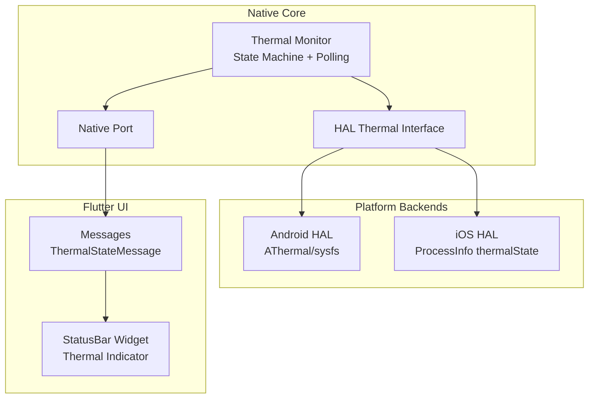
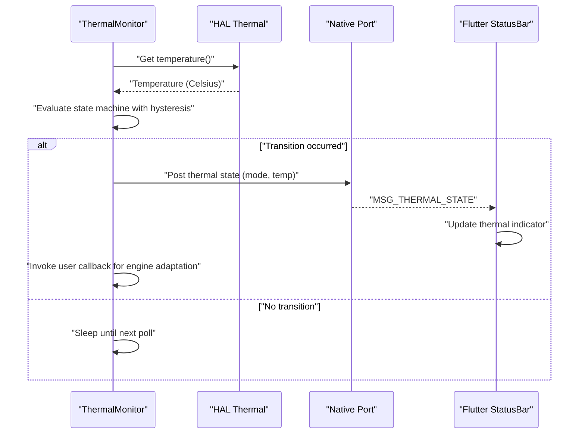
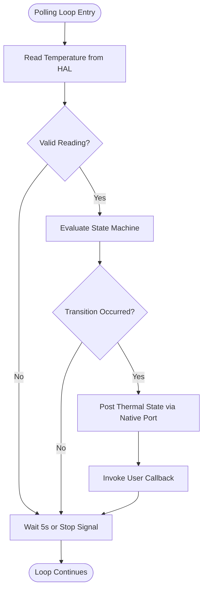
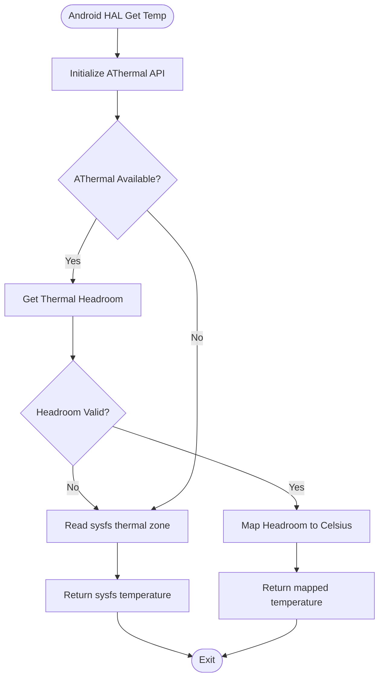
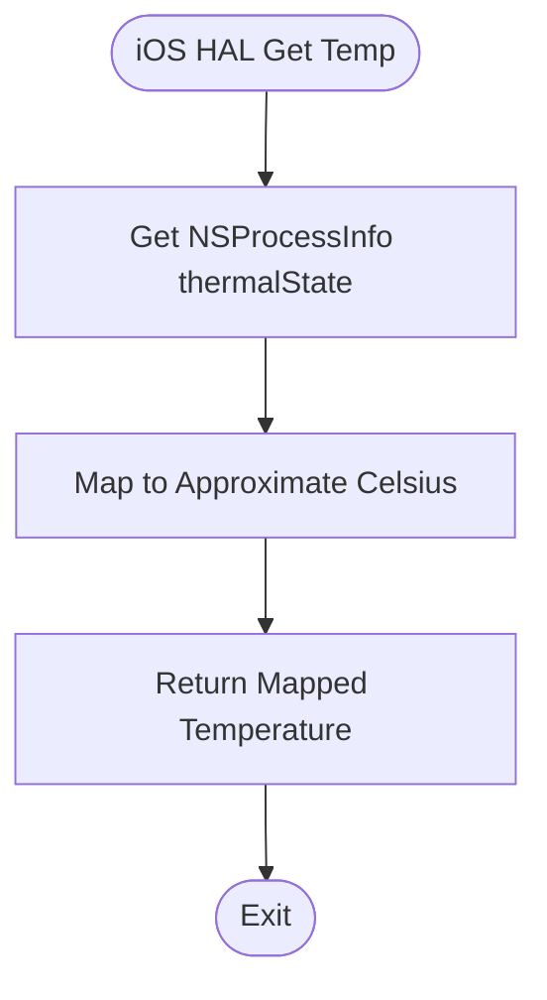
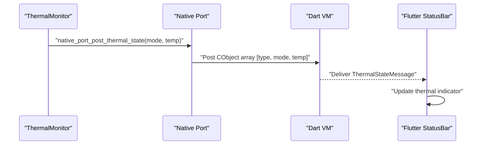
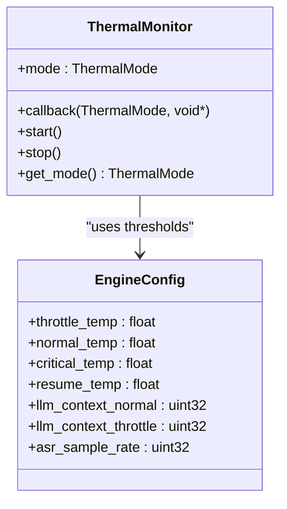
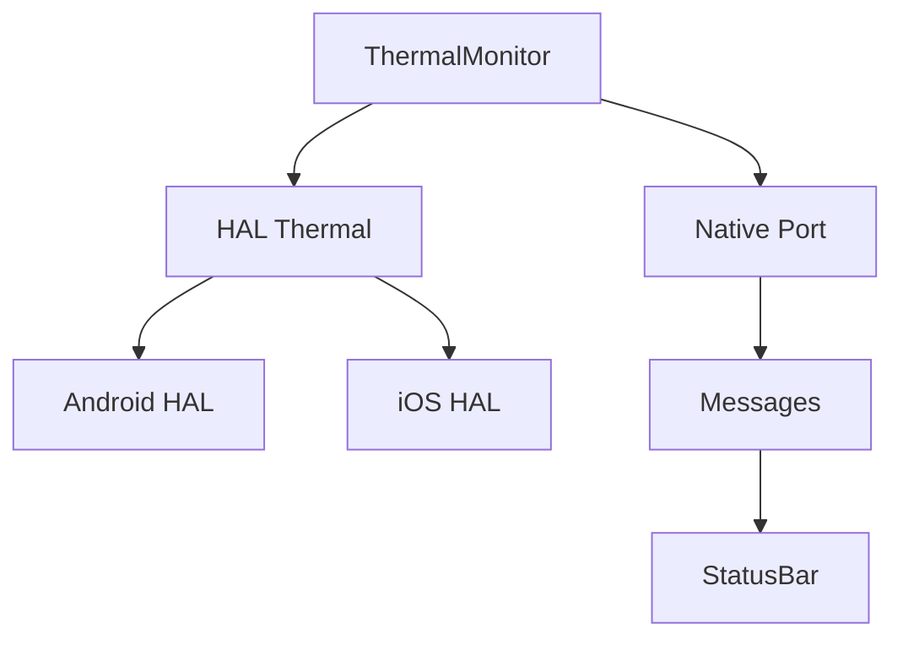

# Thermal Management

<cite>
**Referenced Files in This Document**
- [thermal_monitor.h](file://native/include/thermal_monitor.h)
- [thermal_monitor.cpp](file://native/src/thermal_monitor.cpp)
- [hal_thermal.h](file://native/hal/hal_thermal.h)
- [hal_thermal_android.c](file://native/hal/android/hal_thermal_android.c)
- [hal_thermal_ios.m](file://native/hal/ios/hal_thermal_ios.m)
- [native_port.h](file://native/include/native_port.h)
- [native_port.cpp](file://native/src/native_port.cpp)
- [echo_types.h](file://native/include/echo_types.h)
- [status_bar.dart](file://lib/src/ui/status_bar.dart)
- [messages.dart](file://lib/src/messages.dart)
</cite>

## Table of Contents
1. [Introduction](#introduction)
2. [Project Structure](#project-structure)
3. [Core Components](#core-components)
4. [Architecture Overview](#architecture-overview)
5. [Detailed Component Analysis](#detailed-component-analysis)
6. [Dependency Analysis](#dependency-analysis)
7. [Performance Considerations](#performance-considerations)
8. [Troubleshooting Guide](#troubleshooting-guide)
9. [Conclusion](#conclusion)

## Introduction
This document describes QwenEcho’s thermal management system with a focus on the three-mode thermal state machine and its integration across native and UI layers. The system implements hysteresis-based transitions between Normal, Throttle, and Critical states, runs a low-priority monitoring thread at 5-second intervals, and uses Native Port messaging to inform the Flutter UI shell. It also exposes a callback mechanism for engine adaptation (e.g., throttling strategies). Platform-specific temperature polling is abstracted via a HAL layer that supports Android and iOS backends.

## Project Structure
The thermal subsystem spans several modules:
- State machine and polling loop: thermal monitor
- Hardware abstraction layer (HAL): platform-specific temperature sources
- Messaging bridge: Native Port to Flutter UI Shell
- UI indicators: status bar widget and message types

**Diagram sources**
- [thermal_monitor.cpp:1-190](file://native/src/thermal_monitor.cpp#L1-L190)
- [hal_thermal.h:1-53](file://native/hal/hal_thermal.h#L1-L53)
- [hal_thermal_android.c:1-207](file://native/hal/android/hal_thermal_android.c#L1-L207)
- [hal_thermal_ios.m:1-113](file://native/hal/ios/hal_thermal_ios.m#L1-L113)
- [native_port.cpp:1-320](file://native/src/native_port.cpp#L1-L320)
- [messages.dart:225-244](file://lib/src/messages.dart#L225-L244)
- [status_bar.dart:1-180](file://lib/src/ui/status_bar.dart#L1-L180)

**Section sources**
- [thermal_monitor.h:1-109](file://native/include/thermal_monitor.h#L1-L109)
- [thermal_monitor.cpp:1-190](file://native/src/thermal_monitor.cpp#L1-L190)
- [hal_thermal.h:1-53](file://native/hal/hal_thermal.h#L1-L53)
- [hal_thermal_android.c:1-207](file://native/hal/android/hal_thermal_android.c#L1-L207)
- [hal_thermal_ios.m:1-113](file://native/hal/ios/hal_thermal_ios.m#L1-L113)
- [native_port.h:1-179](file://native/include/native_port.h#L1-L179)
- [native_port.cpp:1-320](file://native/src/native_port.cpp#L1-L320)
- [messages.dart:225-244](file://lib/src/messages.dart#L225-L244)
- [status_bar.dart:1-180](file://lib/src/ui/status_bar.dart#L1-L180)

## Core Components
- Three-mode thermal state machine with hysteresis thresholds:
  - Normal → Throttle when temp > 43°C
  - Throttle → Normal when temp ≤ 42°C
  - Throttle → Critical when temp > 50°C
  - Critical → Throttle when temp ≤ 45°C
- Low-priority monitoring thread:
  - Polls temperature every 5 seconds
  - Evaluates state transitions atomically
  - Posts thermal state updates to UI and invokes user callback for engine adaptation
- HAL abstraction:
  - Android: AThermal API with sysfs fallback
  - iOS: NSProcessInfo thermalState mapped to approximate Celsius
- Native Port messaging:
  - Sends structured messages to Flutter UI Shell
- UI feedback:
  - StatusBar displays current thermal mode with color-coded indicator

**Section sources**
- [thermal_monitor.h:1-109](file://native/include/thermal_monitor.h#L1-L109)
- [thermal_monitor.cpp:28-92](file://native/src/thermal_monitor.cpp#L28-L92)
- [hal_thermal.h:25-46](file://native/hal/hal_thermal.h#L25-L46)
- [hal_thermal_android.c:159-181](file://native/hal/android/hal_thermal_android.c#L159-L181)
- [hal_thermal_ios.m:29-51](file://native/hal/ios/hal_thermal_ios.m#L29-L51)
- [native_port.h:148-152](file://native/include/native_port.h#L148-L152)
- [native_port.cpp:247-262](file://native/src/native_port.cpp#L247-L262)
- [status_bar.dart:18-54](file://lib/src/ui/status_bar.dart#L18-L54)

## Architecture Overview
The thermal system follows a layered architecture:
- Monitoring Layer: ThermalMonitor owns the state machine and polling loop.
- Abstraction Layer: HAL provides cross-platform temperature readings.
- Messaging Layer: Native Port serializes and posts thermal state changes.
- Presentation Layer: Flutter UI consumes messages and updates the status indicator.

**Diagram sources**
- [thermal_monitor.cpp:99-128](file://native/src/thermal_monitor.cpp#L99-L128)
- [native_port.cpp:247-262](file://native/src/native_port.cpp#L247-L262)
- [status_bar.dart:90-99](file://lib/src/ui/status_bar.dart#L90-L99)

## Detailed Component Analysis

### Thermal State Machine and Polling Loop
- State transitions are evaluated using strict hysteresis thresholds to avoid oscillation near boundaries.
- The polling loop:
  - Reads temperature from HAL
  - Skips evaluation if HAL returns an error
  - Posts thermal state via Native Port
  - Invokes user-supplied callback for engine adaptation
  - Sleeps for 5 seconds or until stop signal

**Diagram sources**
- [thermal_monitor.cpp:99-128](file://native/src/thermal_monitor.cpp#L99-L128)
- [thermal_monitor.cpp:59-92](file://native/src/thermal_monitor.cpp#L59-L92)

**Section sources**
- [thermal_monitor.cpp:28-92](file://native/src/thermal_monitor.cpp#L28-L92)
- [thermal_monitor.cpp:99-128](file://native/src/thermal_monitor.cpp#L99-L128)

### HAL Implementations

#### Android Backend
- Uses AThermal API (API level 30+) for thermal headroom forecasting.
- Falls back to sysfs thermal zone reading if AThermal is unavailable or fails.
- Converts headroom to approximate Celsius using a linear mapping clamped to safe bounds.

**Diagram sources**
- [hal_thermal_android.c:159-181](file://native/hal/android/hal_thermal_android.c#L159-L181)
- [hal_thermal_android.c:102-142](file://native/hal/android/hal_thermal_android.c#L102-L142)

**Section sources**
- [hal_thermal_android.c:1-207](file://native/hal/android/hal_thermal_android.c#L1-L207)

#### iOS Backend
- Uses NSProcessInfo.thermalState to determine device thermal condition.
- Maps four thermal states to representative Celsius values aligned with the state machine thresholds.
- Supports optional callback registration for reactive updates.

**Diagram sources**
- [hal_thermal_ios.m:29-51](file://native/hal/ios/hal_thermal_ios.m#L29-L51)

**Section sources**
- [hal_thermal_ios.m:1-113](file://native/hal/ios/hal_thermal_ios.m#L1-L113)

### Native Port Messaging
- Thermal state changes are serialized into typed Dart_CObject arrays and posted to the registered Dart port.
- Message format includes type tag, thermal mode, and temperature.

**Diagram sources**
- [native_port.cpp:247-262](file://native/src/native_port.cpp#L247-L262)
- [messages.dart:225-244](file://lib/src/messages.dart#L225-L244)
- [status_bar.dart:90-99](file://lib/src/ui/status_bar.dart#L90-L99)

**Section sources**
- [native_port.h:148-152](file://native/include/native_port.h#L148-L152)
- [native_port.cpp:247-262](file://native/src/native_port.cpp#L247-L262)
- [messages.dart:225-244](file://lib/src/messages.dart#L225-L244)
- [status_bar.dart:18-54](file://lib/src/ui/status_bar.dart#L18-L54)

### Engine Adaptation Callback
- The thermal monitor invokes a user-supplied callback on each mode transition.
- Typical usage: adjust LLM context size, sample rates, or pipeline parameters based on thermal mode.
- Configuration fields in EngineConfig define default thresholds and adaptive parameters.

**Diagram sources**
- [thermal_monitor.h:26-41](file://native/include/thermal_monitor.h#L26-L41)
- [echo_types.h:105-129](file://native/include/echo_types.h#L105-L129)

**Section sources**
- [thermal_monitor.h:26-41](file://native/include/thermal_monitor.h#L26-L41)
- [echo_types.h:105-129](file://native/include/echo_types.h#L105-L129)

## Dependency Analysis
- ThermalMonitor depends on:
  - HAL for temperature readings
  - Native Port for UI notifications
  - User callback for engine adaptation
- HAL implementations depend on platform APIs:
  - Android: AThermal and sysfs
  - iOS: NSProcessInfo
- Flutter UI depends on:
  - Messages for parsing thermal state
  - StatusBar for visual feedback

**Diagram sources**
- [thermal_monitor.cpp:1-190](file://native/src/thermal_monitor.cpp#L1-L190)
- [hal_thermal_android.c:1-207](file://native/hal/android/hal_thermal_android.c#L1-L207)
- [hal_thermal_ios.m:1-113](file://native/hal/ios/hal_thermal_ios.m#L1-L113)
- [native_port.cpp:1-320](file://native/src/native_port.cpp#L1-L320)
- [messages.dart:225-244](file://lib/src/messages.dart#L225-L244)
- [status_bar.dart:1-180](file://lib/src/ui/status_bar.dart#L1-L180)

**Section sources**
- [thermal_monitor.cpp:1-190](file://native/src/thermal_monitor.cpp#L1-L190)
- [hal_thermal_android.c:1-207](file://native/hal/android/hal_thermal_android.c#L1-L207)
- [hal_thermal_ios.m:1-113](file://native/hal/ios/hal_thermal_ios.m#L1-L113)
- [native_port.cpp:1-320](file://native/src/native_port.cpp#L1-L320)
- [messages.dart:225-244](file://lib/src/messages.dart#L225-L244)
- [status_bar.dart:1-180](file://lib/src/ui/status_bar.dart#L1-L180)

## Performance Considerations
- Polling interval: 5 seconds balances responsiveness and CPU usage.
- Thread priority: Default (non-RT) priority avoids contention with critical audio/LLM threads.
- Atomic operations: Mode state is atomic for lock-free reads, minimizing overhead.
- HAL efficiency:
  - Android: AThermal headroom forecast reduces unnecessary sysfs reads.
  - iOS: Direct access to thermalState is lightweight.
- UI updates: StatusBar only rebuilds when thermal mode changes.

[No sources needed since this section provides general guidance]

## Troubleshooting Guide
- No temperature readings:
  - Check HAL availability and fallback paths (sysfs on Android, ProcessInfo on iOS).
  - Verify permissions and device capabilities.
- Frequent state oscillation:
  - Ensure hysteresis thresholds are respected; avoid rapid temperature fluctuations.
- UI not updating:
  - Confirm Native Port registration and message delivery.
  - Validate message parsing in Flutter (ThermalStateMessage).
- Engine adaptation not triggered:
  - Verify callback registration and user_data pointer validity.
  - Check threshold configuration in EngineConfig.

**Section sources**
- [hal_thermal_android.c:159-181](file://native/hal/android/hal_thermal_android.c#L159-L181)
- [hal_thermal_ios.m:46-51](file://native/hal/ios/hal_thermal_ios.m#L46-L51)
- [native_port.cpp:247-262](file://native/src/native_port.cpp#L247-L262)
- [status_bar.dart:90-99](file://lib/src/ui/status_bar.dart#L90-L99)
- [echo_types.h:105-129](file://native/include/echo_types.h#L105-L129)

## Conclusion
QwenEcho’s thermal management system provides robust, platform-aware thermal monitoring with hysteresis-based state transitions, low-priority background polling, and clear UI feedback. The modular design separates concerns across monitoring, hardware abstraction, messaging, and presentation layers, enabling flexible engine adaptation and reliable operation across diverse devices.

[No sources needed since this section summarizes without analyzing specific files]