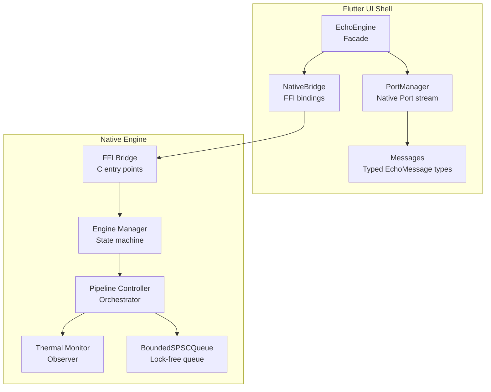
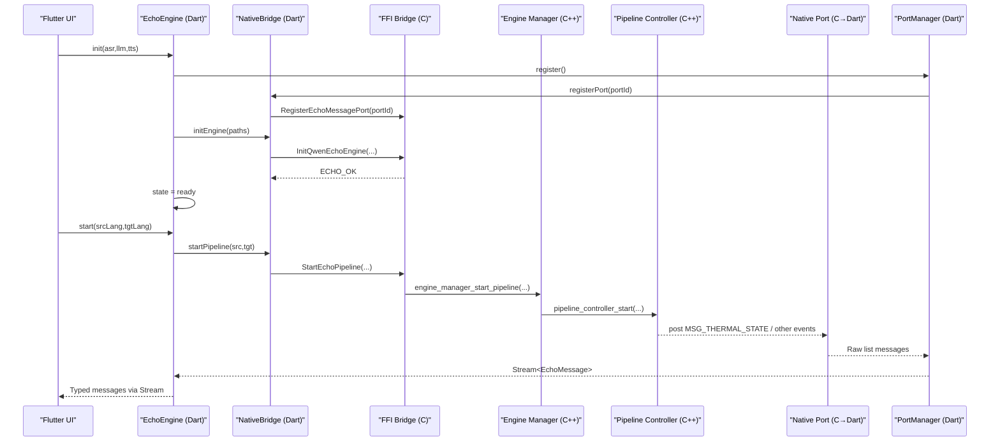
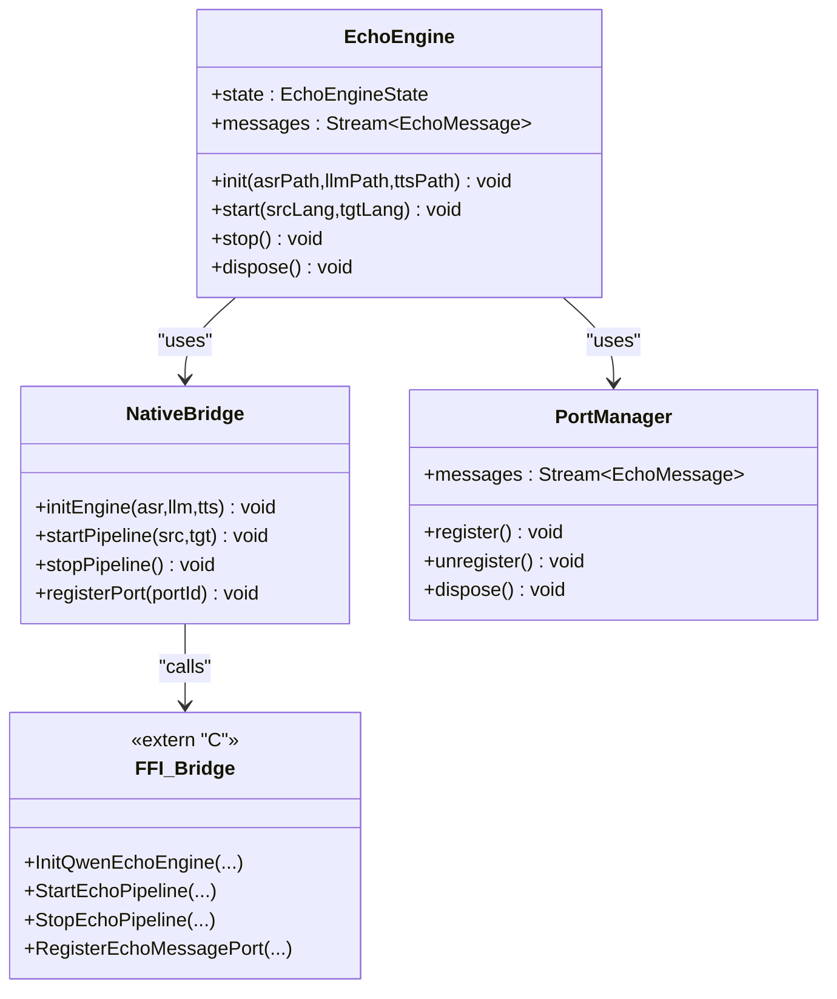
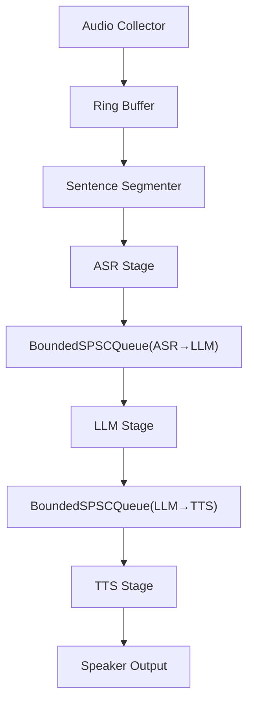
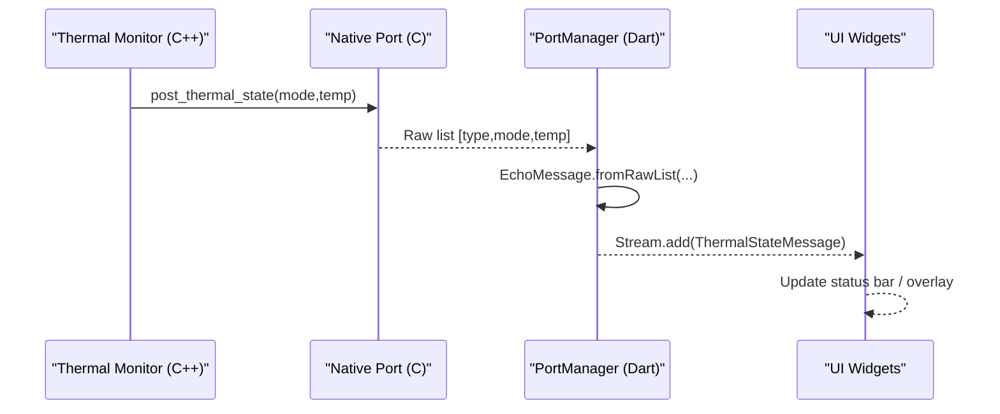
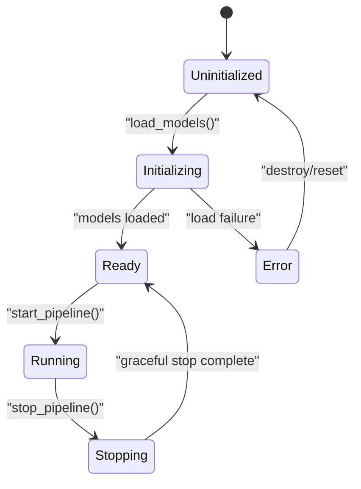
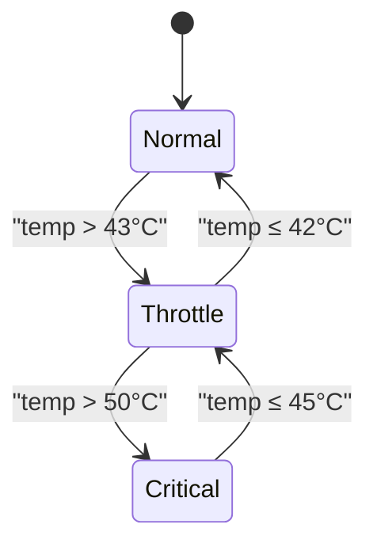
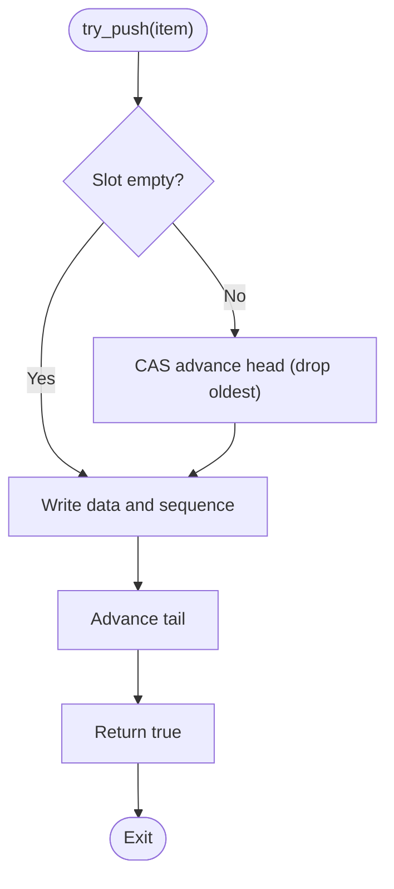
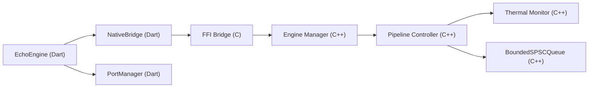

# Architecture Patterns

<cite>
**Referenced Files in This Document**
- [README.md](file://README.md)
- [qwen_echo.dart](file://lib/qwen_echo.dart)
- [echo_engine.dart](file://lib/src/echo_engine.dart)
- [native_bridge.dart](file://lib/src/native_bridge.dart)
- [port_manager.dart](file://lib/src/port_manager.dart)
- [messages.dart](file://lib/src/messages.dart)
- [ffi_bridge.h](file://native/include/ffi_bridge.h)
- [engine_manager.h](file://native/include/engine_manager.h)
- [pipeline_controller.h](file://native/include/pipeline_controller.h)
- [thermal_monitor.h](file://native/include/thermal_monitor.h)
- [bounded_spsc_queue.h](file://native/include/bounded_spsc_queue.h)
- [engine_manager.cpp](file://native/src/engine_manager.cpp)
- [pipeline_controller.cpp](file://native/src/pipeline_controller.cpp)
- [thermal_monitor.cpp](file://native/src/thermal_monitor.cpp)
</cite>

## Table of Contents
1. [Introduction](#introduction)
2. [Project Structure](#project-structure)
3. [Core Components](#core-components)
4. [Architecture Overview](#architecture-overview)
5. [Detailed Component Analysis](#detailed-component-analysis)
6. [Dependency Analysis](#dependency-analysis)
7. [Performance Considerations](#performance-considerations)
8. [Troubleshooting Guide](#troubleshooting-guide)
9. [Conclusion](#conclusion)

## Introduction
This document explains QwenEcho’s core architectural patterns and how they collaborate to deliver real-time, on-device simultaneous interpretation with clean separation of concerns:
- Layered architecture separates Flutter UI from native processing via a minimal FFI boundary and an asynchronous message channel.
- Pipeline pattern orchestrates audio processing stages (ASR → LLM → TTS) with lock-free queues for low-latency, overlapped execution.
- Observer pattern enables event-driven communication between monitors (thermal, memory, latency) and the pipeline/UI.
- State machine pattern governs engine lifecycle and thermal modes to ensure safe transitions and predictable behavior.

These patterns together achieve sub-second end-to-end latency while maintaining robust resource management and clear boundaries between presentation, business logic, and processing layers.

## Project Structure
QwenEcho is organized into two primary layers:
- Flutter UI Shell (Dart): Presentation and orchestration facade over native capabilities.
- Native Engine (C/C++): Real-time audio processing, model inference, and platform abstraction.

**Diagram sources**
- [echo_engine.dart:1-108](file://lib/src/echo_engine.dart#L1-L108)
- [native_bridge.dart:1-230](file://lib/src/native_bridge.dart#L1-L230)
- [port_manager.dart:1-85](file://lib/src/port_manager.dart#L1-L85)
- [messages.dart:1-336](file://lib/src/messages.dart#L1-L336)
- [ffi_bridge.h:1-84](file://native/include/ffi_bridge.h#L1-L84)
- [engine_manager.h:1-104](file://native/include/engine_manager.h#L1-L104)
- [pipeline_controller.h:1-107](file://native/include/pipeline_controller.h#L1-L107)
- [thermal_monitor.h:1-109](file://native/include/thermal_monitor.h#L1-L109)
- [bounded_spsc_queue.h:1-145](file://native/include/bounded_spsc_queue.h#L1-L145)

**Section sources**
- [README.md:15-93](file://README.md#L15-L93)
- [qwen_echo.dart:1-16](file://lib/qwen_echo.dart#L1-L16)

## Core Components
- EchoEngine (Dart facade): Combines NativeBridge and PortManager to expose a simple init/start/stop API and a typed message stream for UI consumers.
- NativeBridge (Dart FFI): Loads the native library and exposes four C-linkage functions with error translation to Dart exceptions.
- PortManager (Dart): Registers a Dart Native Port, receives raw lists from native code, and publishes typed EchoMessage objects via a broadcast Stream.
- FFI Bridge (C): Declares the four public entry points used by Dart FFI.
- Engine Manager (C++): Implements the engine state machine and coordinates model loading and pipeline lifecycle.
- Pipeline Controller (C++): Creates and wires all pipeline components, manages graceful stop, and enforces cascade truncation across stages.
- Thermal Monitor (C++): Polls temperature, implements a three-mode state machine with hysteresis, and posts events to UI and callbacks.
- BoundedSPSCQueue (C++ template): Lock-free bounded queue with overflow-drop semantics used between pipeline stages.

Key responsibilities and interactions are detailed in subsequent sections.

**Section sources**
- [echo_engine.dart:1-108](file://lib/src/echo_engine.dart#L1-L108)
- [native_bridge.dart:1-230](file://lib/src/native_bridge.dart#L1-L230)
- [port_manager.dart:1-85](file://lib/src/port_manager.dart#L1-L85)
- [messages.dart:1-336](file://lib/src/messages.dart#L1-L336)
- [ffi_bridge.h:1-84](file://native/include/ffi_bridge.h#L1-L84)
- [engine_manager.h:1-104](file://native/include/engine_manager.h#L1-L104)
- [engine_manager.cpp:1-202](file://native/src/engine_manager.cpp#L1-L202)
- [pipeline_controller.h:1-107](file://native/include/pipeline_controller.h#L1-L107)
- [pipeline_controller.cpp:1-488](file://native/src/pipeline_controller.cpp#L1-L488)
- [thermal_monitor.h:1-109](file://native/include/thermal_monitor.h#L1-L109)
- [thermal_monitor.cpp:1-190](file://native/src/thermal_monitor.cpp#L1-L190)
- [bounded_spsc_queue.h:1-145](file://native/include/bounded_spsc_queue.h#L1-L145)

## Architecture Overview
The system follows a layered design:
- Presentation layer (Flutter UI) interacts only with EchoEngine.
- Business logic layer (Dart facade) handles lifecycle and message routing.
- Processing layer (Native Engine) performs real-time audio capture, segmentation, ASR, LLM translation, and TTS synthesis.

**Diagram sources**
- [echo_engine.dart:60-98](file://lib/src/echo_engine.dart#L60-L98)
- [native_bridge.dart:132-185](file://lib/src/native_bridge.dart#L132-L185)
- [port_manager.dart:42-50](file://lib/src/port_manager.dart#L42-L50)
- [ffi_bridge.h:30-77](file://native/include/ffi_bridge.h#L30-L77)
- [engine_manager.cpp:102-141](file://native/src/engine_manager.cpp#L102-L141)
- [pipeline_controller.cpp:272-393](file://native/src/pipeline_controller.cpp#L272-L393)
- [messages.dart:14-33](file://lib/src/messages.dart#L14-L33)

## Detailed Component Analysis

### Layered Architecture: Flutter UI ↔ Native Processing
- Dart side:
  - EchoEngine encapsulates lifecycle and exposes a Stream of typed messages.
  - NativeBridge loads the shared library and maps four C functions to Dart methods with exception translation.
  - PortManager registers a Dart ReceivePort, listens for raw lists, and converts them to typed EchoMessage instances.
- Native side:
  - FFI bridge declares the four entry points.
  - Engine Manager validates states and delegates to Pipeline Controller.
  - Pipeline Controller constructs and starts all stages and monitors; posts events via Native Port.

**Diagram sources**
- [echo_engine.dart:1-108](file://lib/src/echo_engine.dart#L1-L108)
- [native_bridge.dart:1-230](file://lib/src/native_bridge.dart#L1-L230)
- [port_manager.dart:1-85](file://lib/src/port_manager.dart#L1-L85)
- [ffi_bridge.h:1-84](file://native/include/ffi_bridge.h#L1-L84)

**Section sources**
- [echo_engine.dart:1-108](file://lib/src/echo_engine.dart#L1-L108)
- [native_bridge.dart:1-230](file://lib/src/native_bridge.dart#L1-L230)
- [port_manager.dart:1-85](file://lib/src/port_manager.dart#L1-L85)
- [ffi_bridge.h:1-84](file://native/include/ffi_bridge.h#L1-L84)

### Pipeline Pattern: Audio Processing Stages
The pipeline connects stages with lock-free bounded queues and runs each stage on its own thread:
- Data flow: Audio Collector → Ring Buffer → Sentence Segmenter → ASR Stage → LLM Stage → TTS Stage → Speaker.
- Cascade truncation: Downstream stages begin before upstream completes, reducing end-to-end latency.
- Inter-stage queues: BoundedSPSCQueue provides non-blocking, overflow-drop semantics to maintain throughput under load.

**Diagram sources**
- [pipeline_controller.cpp:10-38](file://native/src/pipeline_controller.cpp#L10-L38)
- [pipeline_controller.cpp:291-393](file://native/src/pipeline_controller.cpp#L291-L393)
- [bounded_spsc_queue.h:1-145](file://native/include/bounded_spsc_queue.h#L1-L145)

**Section sources**
- [pipeline_controller.h:1-107](file://native/include/pipeline_controller.h#L1-L107)
- [pipeline_controller.cpp:1-488](file://native/src/pipeline_controller.cpp#L1-L488)
- [bounded_spsc_queue.h:1-145](file://native/include/bounded_spsc_queue.h#L1-L145)

### Observer Pattern: Message-Based Communication
Observers (Thermal Monitor, Memory Monitor, Latency Tracker) publish events that are delivered to the UI via Native Port:
- Thermal Monitor polls hardware temperature and posts MSG_THERMAL_STATE on mode transitions.
- It also invokes a user-supplied callback to adapt pipeline behavior (e.g., throttling).
- PortManager deserializes raw lists into typed EchoMessage objects for UI consumption.

**Diagram sources**
- [thermal_monitor.cpp:99-128](file://native/src/thermal_monitor.cpp#L99-L128)
- [messages.dart:226-256](file://lib/src/messages.dart#L226-L256)
- [port_manager.dart:76-83](file://lib/src/port_manager.dart#L76-L83)

**Section sources**
- [thermal_monitor.h:1-109](file://native/include/thermal_monitor.h#L1-L109)
- [thermal_monitor.cpp:1-190](file://native/src/thermal_monitor.cpp#L1-L190)
- [messages.dart:1-336](file://lib/src/messages.dart#L1-L336)
- [port_manager.dart:1-85](file://lib/src/port_manager.dart#L1-L85)

### State Machine Pattern: Engine Management
Engine Manager implements a strict lifecycle state machine:
- States: Uninitialized → Initializing → Ready → Running → Stopping → Ready
- Guards prevent invalid transitions (e.g., starting when not Ready, duplicate sessions).
- On stop, it triggers graceful pipeline shutdown and returns to Ready.

**Diagram sources**
- [engine_manager.h:6-16](file://native/include/engine_manager.h#L6-L16)
- [engine_manager.cpp:44-100](file://native/src/engine_manager.cpp#L44-L100)
- [engine_manager.cpp:102-168](file://native/src/engine_manager.cpp#L102-L168)

**Section sources**
- [engine_manager.h:1-104](file://native/include/engine_manager.h#L1-L104)
- [engine_manager.cpp:1-202](file://native/src/engine_manager.cpp#L1-L202)

### State Machine Pattern: Thermal Monitoring
Thermal Monitor implements a three-mode state machine with hysteresis:
- Normal → Throttle when temp > 43°C
- Throttle → Normal when temp ≤ 42°C
- Throttle → Critical when temp > 50°C
- Critical → Throttle when temp ≤ 45°C

On each transition, it posts a message to the UI and invokes an adaptation callback.

**Diagram sources**
- [thermal_monitor.h:6-16](file://native/include/thermal_monitor.h#L6-L16)
- [thermal_monitor.cpp:59-92](file://native/src/thermal_monitor.cpp#L59-L92)

**Section sources**
- [thermal_monitor.h:1-109](file://native/include/thermal_monitor.h#L1-L109)
- [thermal_monitor.cpp:1-190](file://native/src/thermal_monitor.cpp#L1-L190)

### Lock-Free Queue Design: BoundedSPSCQueue
BoundedSPSCQueue provides non-blocking producer/consumer semantics:
- Fixed capacity with bitmask indexing.
- Sequence/turn protocol ensures safe concurrent access without locks.
- Overflow policy drops oldest element to keep throughput high.

**Diagram sources**
- [bounded_spsc_queue.h:51-85](file://native/include/bounded_spsc_queue.h#L51-L85)

**Section sources**
- [bounded_spsc_queue.h:1-145](file://native/include/bounded_spsc_queue.h#L1-L145)

## Dependency Analysis
High-level dependencies between modules:

**Diagram sources**
- [echo_engine.dart:1-108](file://lib/src/echo_engine.dart#L1-L108)
- [native_bridge.dart:1-230](file://lib/src/native_bridge.dart#L1-L230)
- [port_manager.dart:1-85](file://lib/src/port_manager.dart#L1-L85)
- [ffi_bridge.h:1-84](file://native/include/ffi_bridge.h#L1-L84)
- [engine_manager.cpp:1-202](file://native/src/engine_manager.cpp#L1-L202)
- [pipeline_controller.cpp:1-488](file://native/src/pipeline_controller.cpp#L1-L488)
- [thermal_monitor.cpp:1-190](file://native/src/thermal_monitor.cpp#L1-L190)
- [bounded_spsc_queue.h:1-145](file://native/include/bounded_spsc_queue.h#L1-L145)

**Section sources**
- [README.md:15-93](file://README.md#L15-L93)

## Performance Considerations
- Lock-free SPSC queues minimize contention between stages.
- Cascade truncation allows downstream stages to begin early, reducing end-to-end latency.
- Monitors enforce budgets and adaptive behavior (e.g., throttling) to meet SLAs.
- Graceful stop ensures in-flight segments are processed within a bounded time window.

[No sources needed since this section provides general guidance]

## Troubleshooting Guide
Common issues and diagnostics:
- Initialization failures: Verify model paths and permissions; check EchoErrorCode descriptions.
- Unsupported language codes: Ensure ISO 639-1 codes are supported by the ASR engine.
- Session conflicts: Avoid starting a pipeline when one is already active.
- Thermal critical: The pipeline may pause or throttle; monitor ThermalStateMessage updates.
- Memory pressure: Level 2 warnings can trigger graceful stop; review MemoryWarningMessage usage percentage.
- Latency violations: Inspect LatencyWarningMessage to identify bottleneck stages.

**Section sources**
- [native_bridge.dart:40-75](file://lib/src/native_bridge.dart#L40-L75)
- [messages.dart:201-336](file://lib/src/messages.dart#L201-L336)
- [pipeline_controller.cpp:395-469](file://native/src/pipeline_controller.cpp#L395-L469)

## Conclusion
QwenEcho’s architecture combines layered separation, pipeline orchestration, observer-driven monitoring, and strict state machines to deliver real-time performance with clear boundaries. The Dart facade simplifies integration for UI developers, while the native engine focuses on low-latency processing and robust resource management. Together, these patterns enable reliable, efficient, and maintainable on-device simultaneous interpretation.