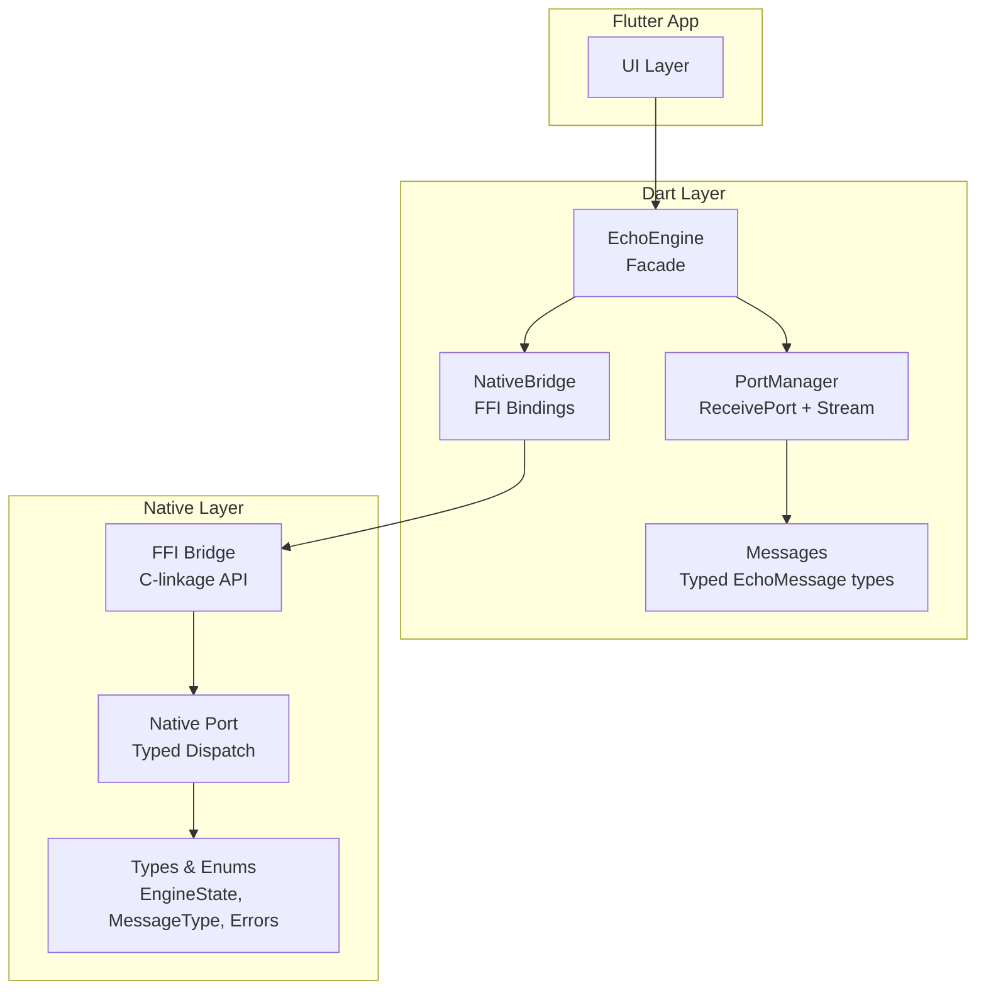
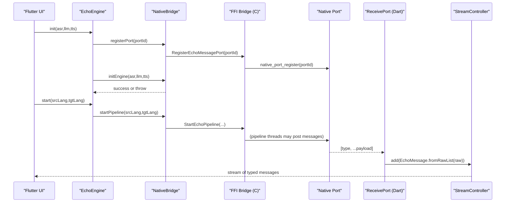
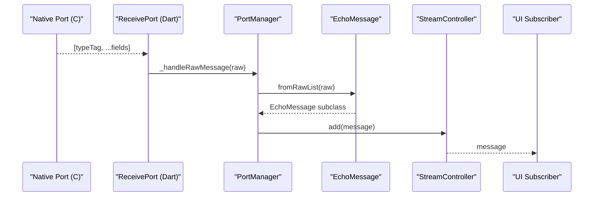
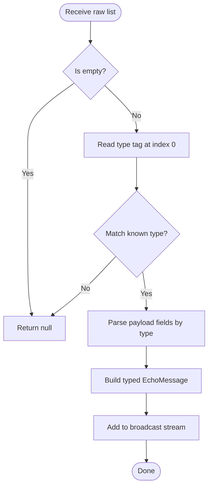
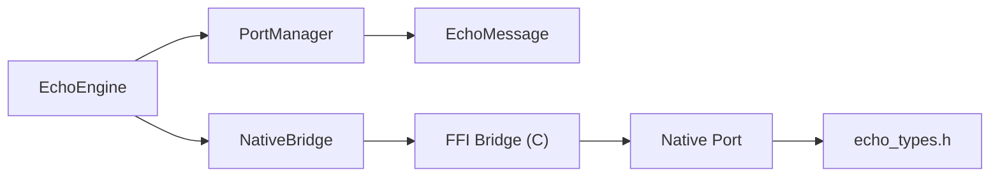

# Communication Protocols

<cite>
**Referenced Files in This Document**
- [ffi_bridge.h](file://native/include/ffi_bridge.h)
- [ffi_bridge.cpp](file://native/src/ffi_bridge.cpp)
- [native_port.h](file://native/include/native_port.h)
- [native_port.cpp](file://native/src/native_port.cpp)
- [echo_types.h](file://native/include/echo_types.h)
- [qwen_echo.dart](file://lib/qwen_echo.dart)
- [native_bridge.dart](file://lib/src/native_bridge.dart)
- [messages.dart](file://lib/src/messages.dart)
- [port_manager.dart](file://lib/src/port_manager.dart)
- [echo_engine.dart](file://lib/src/echo_engine.dart)
- [messages_test.dart](file://test/messages_test.dart)
</cite>

## Table of Contents
1. [Introduction](#introduction)
2. [Project Structure](#project-structure)
3. [Core Components](#core-components)
4. [Architecture Overview](#architecture-overview)
5. [Detailed Component Analysis](#detailed-component-analysis)
6. [Dependency Analysis](#dependency-analysis)
7. [Performance Considerations](#performance-considerations)
8. [Troubleshooting Guide](#troubleshooting-guide)
9. [Conclusion](#conclusion)

## Introduction
This document explains QwenEcho’s inter-process communication system that connects the Flutter UI shell with the native C/C++ engine. It focuses on:
- The four-function C-linkage API exposed via Dart FFI and how it minimizes Dart-to-native overhead.
- The asynchronous message delivery system using Dart Ports for streaming events from native to Flutter.
- The typed message protocol, including AsrPartialMessage, TranslationStreamMessage, and system status messages.
- Message routing patterns and error handling strategies across the FFI boundary.

The goal is to provide a clear, code-mapped understanding of how control flows and data flows between Dart and native layers, enabling robust integration and troubleshooting.

## Project Structure
QwenEcho separates concerns into three main areas relevant to IPC:
- Native FFI bridge and port dispatch (C/C++)
- Dart FFI bindings and Port manager (Dart)
- High-level engine facade and typed message definitions (Dart)

**Diagram sources**
- [echo_engine.dart:37-108](file://lib/src/echo_engine.dart#L37-L108)
- [native_bridge.dart:99-230](file://lib/src/native_bridge.dart#L99-L230)
- [port_manager.dart:18-85](file://lib/src/port_manager.dart#L18-L85)
- [messages.dart:8-336](file://lib/src/messages.dart#L8-L336)
- [ffi_bridge.h:1-84](file://native/include/ffi_bridge.h#L1-L84)
- [native_port.h:1-179](file://native/include/native_port.h#L1-L179)
- [echo_types.h:1-136](file://native/include/echo_types.h#L1-L136)

**Section sources**
- [qwen_echo.dart:1-16](file://lib/qwen_echo.dart#L1-L16)
- [echo_engine.dart:37-108](file://lib/src/echo_engine.dart#L37-L108)
- [native_bridge.dart:99-230](file://lib/src/native_bridge.dart#L99-L230)
- [port_manager.dart:18-85](file://lib/src/port_manager.dart#L18-L85)
- [messages.dart:8-336](file://lib/src/messages.dart#L8-L336)
- [ffi_bridge.h:1-84](file://native/include/ffi_bridge.h#L1-L84)
- [native_port.h:1-179](file://native/include/native_port.h#L1-L179)
- [echo_types.h:1-136](file://native/include/echo_types.h#L1-L136)

## Core Components
- Four-function C-linkage API (FFI):
  - Initialize: loads ASR, LLM, TTS models.
  - Start pipeline: begins interpretation with source/target language codes.
  - Stop pipeline: halts session and cleans up resources.
  - Register message port: registers a Dart SendPort for async event delivery.
- Dart FFI bindings:
  - Type-safe wrappers around the C functions.
  - Error mapping to Dart exceptions.
- Dart Port Manager:
  - Creates a ReceivePort, registers it with the engine, and exposes a broadcast Stream of typed messages.
- Typed message protocol:
  - Each message is a list starting with a type tag followed by payload fields.
  - Strongly-typed Dart classes parse raw lists into domain objects.

Key responsibilities:
- Minimize Dart-to-native calls by batching lifecycle operations and using one registered port for all streaming events.
- Provide a consistent, typed protocol for both user-facing events (ASR, translation, TTS) and system diagnostics (thermal, memory, latency).

**Section sources**
- [ffi_bridge.h:17-77](file://native/include/ffi_bridge.h#L17-L77)
- [ffi_bridge.cpp:54-124](file://native/src/ffi_bridge.cpp#L54-L124)
- [native_bridge.dart:16-35](file://lib/src/native_bridge.dart#L16-L35)
- [native_bridge.dart:132-185](file://lib/src/native_bridge.dart#L132-L185)
- [port_manager.dart:18-85](file://lib/src/port_manager.dart#L18-L85)
- [messages.dart:36-49](file://lib/src/messages.dart#L36-L49)

## Architecture Overview
The architecture uses a minimal FFI surface and an asynchronous Port-based event bus:
- Control plane: synchronous FFI calls for initialization and pipeline lifecycle.
- Data plane: asynchronous Dart Ports for streaming results and diagnostics.

**Diagram sources**
- [echo_engine.dart:66-87](file://lib/src/echo_engine.dart#L66-L87)
- [native_bridge.dart:132-185](file://lib/src/native_bridge.dart#L132-L185)
- [ffi_bridge.cpp:108-121](file://native/src/ffi_bridge.cpp#L108-L121)
- [native_port.cpp:38-52](file://native/src/native_port.cpp#L38-L52)
- [port_manager.dart:42-50](file://lib/src/port_manager.dart#L42-L50)
- [messages.dart:14-33](file://lib/src/messages.dart#L14-L33)

## Detailed Component Analysis

### FFI Bridge (C-linkage API)
Responsibilities:
- Expose exactly four entry points to Dart via FFI.
- Maintain thread-safe registration state for the Dart port.
- Delegate lifecycle to the Engine Manager while guarding preconditions (e.g., port must be registered before starting/stopping).

Key behaviors:
- Initialization validates model paths and returns structured error codes.
- Starting the pipeline requires a registered port; otherwise, it fails fast.
- Stopping the pipeline also requires a registered port for status notifications.

Error handling:
- All return int32_t with negative values indicating specific errors.
- Dart side maps these to descriptive exceptions.

Optimization:
- Minimal FFI surface reduces cross-language call overhead.
- Single port registration avoids repeated setup costs.

**Section sources**
- [ffi_bridge.h:17-77](file://native/include/ffi_bridge.h#L17-L77)
- [ffi_bridge.cpp:54-124](file://native/src/ffi_bridge.cpp#L54-L124)
- [echo_types.h:48-62](file://native/include/echo_types.h#L48-L62)

### Dart FFI Bindings (NativeBridge)
Responsibilities:
- Load platform-specific shared libraries.
- Lookup and bind the four C functions.
- Convert Dart strings to UTF-8 pointers and free them after use.
- Throw EchoEngineException when native returns non-zero.

Design highlights:
- Explicit typedef pairs for native and Dart signatures ensure type safety.
- Centralized error description mapping improves debugging.

**Section sources**
- [native_bridge.dart:16-35](file://lib/src/native_bridge.dart#L16-L35)
- [native_bridge.dart:191-222](file://lib/src/native_bridge.dart#L191-L222)
- [native_bridge.dart:224-228](file://lib/src/native_bridge.dart#L224-L228)

### Dart Port Manager and Stream
Responsibilities:
- Create a ReceivePort and register it with the engine.
- Transform raw lists into strongly-typed EchoMessage instances.
- Expose a broadcast Stream for multiple subscribers.

Routing pattern:
- Raw message arrives → parse by type tag → instantiate concrete message class → add to broadcast stream.

Lifecycle:
- register() opens a new port and replaces any existing one.
- unregister() closes the current port.
- dispose() cancels subscriptions and closes the controller.

**Section sources**
- [port_manager.dart:18-85](file://lib/src/port_manager.dart#L18-L85)
- [messages.dart:14-33](file://lib/src/messages.dart#L14-L33)

### Typed Message Protocol
Protocol overview:
- Every message is a List<dynamic> where the first element is a type tag.
- Subsequent elements are payload fields whose order and types are defined per message.

Core message types:
- AsrPartialMessage: temporary/unconfirmed ASR text with speaker and timestamp.
- AsrConfirmedMessage: finalized ASR text with segment ID.
- TranslationStreamMessage: streaming translation token with segment ID.
- TranslationDoneMessage: completed translation text with segment ID.
- TtsStartedMessage/TtsCompleteMessage: synthesis lifecycle markers.
- ErrorMessage: error_code, model_name, detail_string.
- ThermalStateMessage: thermal_mode, temperature_c.
- MemoryWarningMessage: current_bytes, limit_bytes, level.
- LatencyWarningMessage: stage, actual_ms, budget_ms.
- SampleDropMessage: dropped_samples, timestamp_ms.

Validation and parsing:
- Unknown tags are ignored (returns null).
- Empty lists are rejected.
- Tests cover each message shape and edge cases.

**Section sources**
- [messages.dart:36-49](file://lib/src/messages.dart#L36-L49)
- [messages.dart:51-336](file://lib/src/messages.dart#L51-L336)
- [messages_test.dart:5-133](file://test/messages_test.dart#L5-L133)

### Native Port Dispatch (C/C++)
Responsibilities:
- Serialize typed messages as Dart_CObject arrays.
- Post messages through the registered Dart port using a runtime function pointer.
- Provide helper functions for each message type.

Concurrency:
- Uses atomic variables for port state to support concurrent posting from pipeline threads.

Compatibility:
- Provides a minimal Dart_CObject compatibility shim when building without the Dart SDK headers.

**Section sources**
- [native_port.h:22-63](file://native/include/native_port.h#L22-L63)
- [native_port.h:69-172](file://native/include/native_port.h#L69-L172)
- [native_port.cpp:19-75](file://native/src/native_port.cpp#L19-L75)
- [native_port.cpp:116-317](file://native/src/native_port.cpp#L116-L317)

### High-Level Engine Facade
Responsibilities:
- Combine NativeBridge and PortManager into a single API.
- Manage lifecycle states: uninitialized → ready → running.
- Ensure port registration occurs before initialization so early status messages can be received.

Usage pattern:
- Create engine → listen to messages → init → start → stop → dispose.

**Section sources**
- [echo_engine.dart:37-108](file://lib/src/echo_engine.dart#L37-L108)

### Class Diagram: Dart-side Messaging

```mermaid
classDiagram
class EchoMessage {
+fromRawList(raw) EchoMessage?
}
class AsrPartialMessage {
+speakerId : int
+text : String
+timestampMs : int
}
class AsrConfirmedMessage {
+speakerId : int
+text : String
+timestampMs : int
+segmentId : int
}
class TranslationStreamMessage {
+speakerId : int
+token : String
+segmentId : int
}
class TranslationDoneMessage {
+speakerId : int
+fullText : String
+segmentId : int
}
class TtsStartedMessage {
+speakerId : int
+segmentId : int
}
class TtsCompleteMessage {
+speakerId : int
+segmentId : int
}
class ErrorMessage {
+errorCode : int
+modelName : String
+detail : String
}
class ThermalStateMessage {
+thermalMode : int
+temperatureC : double
+modeName : String
}
class MemoryWarningMessage {
+currentBytes : int
+limitBytes : int
+level : int
+usagePercent : double
}
class LatencyWarningMessage {
+stage : String
+actualMs : int
+budgetMs : int
}
class SampleDropMessage {
+droppedSamples : int
+timestampMs : int
}
EchoMessage <|-- AsrPartialMessage
EchoMessage <|-- AsrConfirmedMessage
EchoMessage <|-- TranslationStreamMessage
EchoMessage <|-- TranslationDoneMessage
EchoMessage <|-- TtsStartedMessage
EchoMessage <|-- TtsCompleteMessage
EchoMessage <|-- ErrorMessage
EchoMessage <|-- ThermalStateMessage
EchoMessage <|-- MemoryWarningMessage
EchoMessage <|-- LatencyWarningMessage
EchoMessage <|-- SampleDropMessage
```

**Diagram sources**
- [messages.dart:8-336](file://lib/src/messages.dart#L8-L336)

### Sequence Diagram: Message Routing Pattern

**Diagram sources**
- [native_port.cpp:116-317](file://native/src/native_port.cpp#L116-L317)
- [port_manager.dart:76-83](file://lib/src/port_manager.dart#L76-L83)
- [messages.dart:14-33](file://lib/src/messages.dart#L14-L33)

### Flowchart: Message Parsing Logic

**Diagram sources**
- [messages.dart:14-33](file://lib/src/messages.dart#L14-L33)

## Dependency Analysis
High-level dependencies:
- Dart EchoEngine depends on NativeBridge and PortManager.
- NativeBridge depends on DynamicLibrary and FFI function lookups.
- PortManager depends on ReceivePort and EchoMessage parser.
- Native FFI Bridge depends on Engine Manager and Native Port.
- Native Port depends on echo_types enums and a runtime Dart_PostCObject function pointer.

**Diagram sources**
- [echo_engine.dart:37-108](file://lib/src/echo_engine.dart#L37-L108)
- [native_bridge.dart:99-230](file://lib/src/native_bridge.dart#L99-L230)
- [port_manager.dart:18-85](file://lib/src/port_manager.dart#L18-L85)
- [messages.dart:8-336](file://lib/src/messages.dart#L8-L336)
- [ffi_bridge.cpp:9-12](file://native/src/ffi_bridge.cpp#L9-L12)
- [native_port.cpp:9-10](file://native/src/native_port.cpp#L9-L10)
- [echo_types.h:1-136](file://native/include/echo_types.h#L1-L136)

**Section sources**
- [echo_engine.dart:37-108](file://lib/src/echo_engine.dart#L37-L108)
- [native_bridge.dart:99-230](file://lib/src/native_bridge.dart#L99-L230)
- [port_manager.dart:18-85](file://lib/src/port_manager.dart#L18-L85)
- [messages.dart:8-336](file://lib/src/messages.dart#L8-L336)
- [ffi_bridge.cpp:9-12](file://native/src/ffi_bridge.cpp#L9-L12)
- [native_port.cpp:9-10](file://native/src/native_port.cpp#L9-L10)
- [echo_types.h:1-136](file://native/include/echo_types.h#L1-L136)

## Performance Considerations
- Minimize FFI calls:
  - Use a single port registration for all streaming events.
  - Batch lifecycle operations (init once, start/stop as needed).
- Avoid excessive allocations:
  - Reuse ReceivePort and StreamController lifecycles.
  - Keep message payloads compact; avoid large strings in hot paths.
- Concurrency:
  - Native Port uses atomics for safe concurrent posting.
  - Ensure UI updates are not blocking; consider debouncing high-frequency messages (e.g., partial ASR tokens).
- Platform specifics:
  - On iOS/macOS, prefer process library loading when statically linked to reduce dynamic load overhead.

[No sources needed since this section provides general guidance]

## Troubleshooting Guide
Common issues and strategies:
- No messages received:
  - Verify port registration occurred before starting the pipeline.
  - Confirm ReceivePort is active and subscription exists.
- Unknown message type:
  - Parser returns null for unknown tags; check for version mismatches between native and Dart.
- Engine errors:
  - Inspect ErrorMessage payloads for errorCode, modelName, and detail.
  - Map EchoErrorCode values to human-readable descriptions.
- Lifecycle errors:
  - ECHO_ERR_NO_PORT indicates missing port registration.
  - ECHO_ERR_ENGINE_NOT_READY indicates engine not initialized or not in Ready state.
  - ECHO_ERR_SESSION_ACTIVE indicates attempting to start while already running.

Operational checks:
- Ensure model paths exist and are readable.
- Validate ISO 639-1 language codes.
- Monitor thermal and memory warnings to adapt behavior proactively.

**Section sources**
- [native_bridge.dart:43-75](file://lib/src/native_bridge.dart#L43-L75)
- [echo_types.h:48-62](file://native/include/echo_types.h#L48-L62)
- [messages.dart:201-224](file://lib/src/messages.dart#L201-L224)
- [messages_test.dart:71-80](file://test/messages_test.dart#L71-L80)

## Conclusion
QwenEcho’s IPC design emphasizes a minimal FFI surface and a robust, typed, asynchronous message bus:
- Four C-linkage functions encapsulate lifecycle control, reducing Dart-to-native overhead.
- A single registered Dart Port streams rich, typed events to Flutter efficiently.
- Clear message contracts and comprehensive error codes enable predictable behavior and easier debugging.
Adhering to the documented patterns ensures reliable performance and maintainability across platforms.