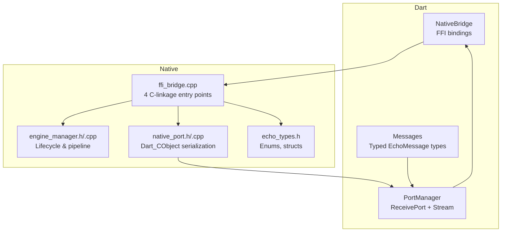
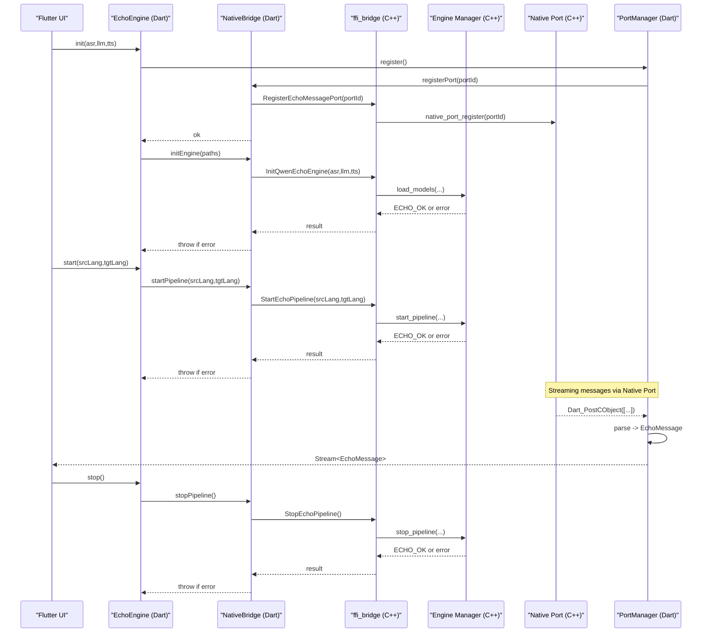
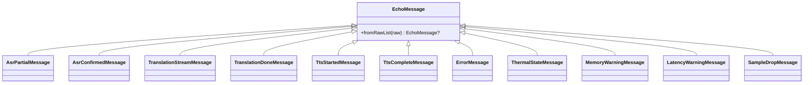
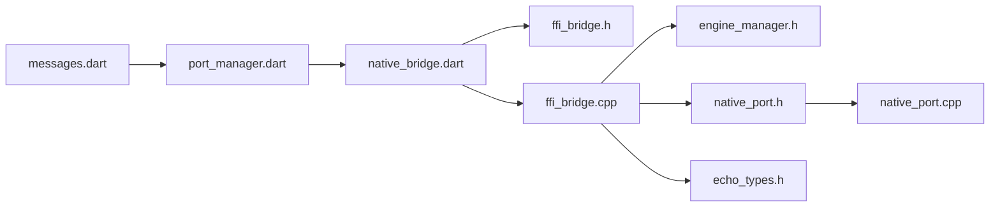

# FFI Interface Design

<cite>
**Referenced Files in This Document**
- [ffi_bridge.h](file://native/include/ffi_bridge.h)
- [ffi_bridge.cpp](file://native/src/ffi_bridge.cpp)
- [echo_types.h](file://native/include/echo_types.h)
- [engine_manager.h](file://native/include/engine_manager.h)
- [native_port.h](file://native/include/native_port.h)
- [native_port.cpp](file://native/src/native_port.cpp)
- [native_bridge.dart](file://lib/src/native_bridge.dart)
- [port_manager.dart](file://lib/src/port_manager.dart)
- [messages.dart](file://lib/src/messages.dart)
- [qwen_echo.dart](file://lib/qwen_echo.dart)
- [design.md](file://.kiro/specs/qwen-echo/design.md)
</cite>

## Table of Contents
1. [Introduction](#introduction)
2. [Project Structure](#project-structure)
3. [Core Components](#core-components)
4. [Architecture Overview](#architecture-overview)
5. [Detailed Component Analysis](#detailed-component-analysis)
6. [Dependency Analysis](#dependency-analysis)
7. [Performance Considerations](#performance-considerations)
8. [Troubleshooting Guide](#troubleshooting-guide)
9. [Conclusion](#conclusion)
10. [Appendices](#appendices)

## Introduction
This document specifies the QwenEcho FFI interface design focused on the four-function C-linkage API exposed to Dart: InitQwenEchoEngine, StartEchoPipeline, StopEchoPipeline, and RegisterEchoMessagePort. It explains parameters, return values, error codes, usage patterns, initialization sequences, error handling strategies, resource management across the FFI boundary, memory safety considerations, and type marshaling between Dart and C/C++. The design rationale emphasizes minimizing Dart-to-native communication overhead by keeping the public surface minimal and using a Native Port for asynchronous message streaming from native to Dart.

## Project Structure
The FFI boundary spans Dart and native layers:
- Dart side: NativeBridge wraps the 4 C functions; PortManager manages ReceivePort registration and deserializes messages; Messages define typed Dart classes for incoming events.
- Native side: ffi_bridge exposes the 4 entry points; engine_manager orchestrates lifecycle; native_port serializes and posts typed messages via Dart_CObject arrays.

**Diagram sources**
- [ffi_bridge.h:1-84](file://native/include/ffi_bridge.h#L1-L84)
- [ffi_bridge.cpp:1-124](file://native/src/ffi_bridge.cpp#L1-L124)
- [engine_manager.h:1-104](file://native/include/engine_manager.h#L1-L104)
- [native_port.h:1-179](file://native/include/native_port.h#L1-L179)
- [native_port.cpp:1-319](file://native/src/native_port.cpp#L1-L319)
- [echo_types.h:1-136](file://native/include/echo_types.h#L1-L136)
- [native_bridge.dart:1-230](file://lib/src/native_bridge.dart#L1-L230)
- [port_manager.dart:1-85](file://lib/src/port_manager.dart#L1-L85)
- [messages.dart:1-336](file://lib/src/messages.dart#L1-L336)

**Section sources**
- [ffi_bridge.h:1-84](file://native/include/ffi_bridge.h#L1-L84)
- [ffi_bridge.cpp:1-124](file://native/src/ffi_bridge.cpp#L1-L124)
- [engine_manager.h:1-104](file://native/include/engine_manager.h#L1-L104)
- [native_port.h:1-179](file://native/include/native_port.h#L1-L179)
- [native_port.cpp:1-319](file://native/src/native_port.cpp#L1-L319)
- [echo_types.h:1-136](file://native/include/echo_types.h#L1-L136)
- [native_bridge.dart:1-230](file://lib/src/native_bridge.dart#L1-L230)
- [port_manager.dart:1-85](file://lib/src/port_manager.dart#L1-L85)
- [messages.dart:1-336](file://lib/src/messages.dart#L1-L336)

## Core Components
- Four C-linkage entry points (C ABI):
  - InitQwenEchoEngine(asr_path, llm_path, tts_path)
  - StartEchoPipeline(source_lang, target_lang)
  - StopEchoPipeline()
  - RegisterEchoMessagePort(dart_port_id)
- All return int32_t: 0 = success, negative = EchoErrorCode.
- Dart-side wrappers:
  - NativeBridge loads platform library, maps signatures, marshals UTF-8 strings, throws EchoEngineException on non-zero returns.
  - PortManager creates a ReceivePort, registers it with the engine, and transforms raw lists into typed EchoMessage objects.
  - Messages defines MessageType tags and typed Dart classes mirroring native payloads.

Key responsibilities:
- Minimize cross-boundary calls: only 4 control functions plus one-time port registration.
- Use Native Port for high-frequency streaming updates (ASR partial/confirmed, translation tokens, TTS events, diagnostics).

**Section sources**
- [ffi_bridge.h:17-77](file://native/include/ffi_bridge.h#L17-L77)
- [ffi_bridge.cpp:54-123](file://native/src/ffi_bridge.cpp#L54-L123)
- [native_bridge.dart:16-34](file://lib/src/native_bridge.dart#L16-L34)
- [native_bridge.dart:132-185](file://lib/src/native_bridge.dart#L132-L185)
- [port_manager.dart:18-50](file://lib/src/port_manager.dart#L18-L50)
- [messages.dart:36-49](file://lib/src/messages.dart#L36-L49)

## Architecture Overview
The FFI architecture separates control-plane (4 functions) from data-plane (Native Port streaming). Control operations are infrequent and synchronous; data-plane messages are asynchronous and batched as Dart_CObject arrays.

**Diagram sources**
- [ffi_bridge.h:30-77](file://native/include/ffi_bridge.h#L30-L77)
- [ffi_bridge.cpp:56-121](file://native/src/ffi_bridge.cpp#L56-L121)
- [engine_manager.h:53-81](file://native/include/engine_manager.h#L53-L81)
- [native_port.h:77-94](file://native/include/native_port.h#L77-L94)
- [native_port.cpp:38-75](file://native/src/native_port.cpp#L38-L75)
- [native_bridge.dart:132-185](file://lib/src/native_bridge.dart#L132-L185)
- [port_manager.dart:42-50](file://lib/src/port_manager.dart#L42-L50)

## Detailed Component Analysis

### Function: InitQwenEchoEngine
- Purpose: Initialize the engine by loading ASR, LLM, and TTS models from provided paths. Must be called before starting the pipeline.
- Parameters:
  - asr_path: const char* path to FunASR-Nano GGUF model file
  - llm_path: const char* path to Qwen3-4B-Instruct GGUF model file
  - tts_path: const char* path to Qwen3-TTS-Streaming GGUF model file
- Return value: int32_t
  - 0 on success
  - Negative EchoErrorCode on failure
- Error codes:
  - ECHO_ERR_ALREADY_INIT if already initialized
  - ECHO_ERR_MODEL_MISSING if any path is NULL or empty
  - Other model-related errors may propagate from model loader
- Usage pattern:
  - Call once during app startup after registering the message port.
  - On success, engine transitions to Ready state.
- Dart marshaling:
  - Strings converted to UTF-8 pointers; freed after call.
  - Non-zero results wrapped into EchoEngineException.

**Section sources**
- [ffi_bridge.h:17-33](file://native/include/ffi_bridge.h#L17-L33)
- [ffi_bridge.cpp:56-69](file://native/src/ffi_bridge.cpp#L56-L69)
- [echo_types.h:48-62](file://native/include/echo_types.h#L48-L62)
- [native_bridge.dart:138-150](file://lib/src/native_bridge.dart#L138-L150)

### Function: StartEchoPipeline
- Purpose: Begin interpretation pipeline with specified language pair. Requires engine initialized and a registered port.
- Parameters:
  - source_lang: ISO 639-1 code (e.g., "zh")
  - target_lang: ISO 639-1 code (e.g., "en")
- Return value: int32_t
  - 0 on success
  - Negative EchoErrorCode on failure
- Error codes:
  - ECHO_ERR_ENGINE_NOT_READY if engine not in Ready state
  - ECHO_ERR_SESSION_ACTIVE if pipeline already running
  - ECHO_ERR_NO_PORT if no Native Port registered
  - ECHO_ERR_UNSUPPORTED_LANG if language pair not supported
- Usage pattern:
  - After successful InitQwenEchoEngine and RegisterEchoMessagePort.
  - Transitions engine to Running state.
- Dart marshaling:
  - UTF-8 conversion for language codes; freed after call.

**Section sources**
- [ffi_bridge.h:35-51](file://native/include/ffi_bridge.h#L35-L51)
- [ffi_bridge.cpp:71-88](file://native/src/ffi_bridge.cpp#L71-L88)
- [engine_manager.h:69-70](file://native/include/engine_manager.h#L69-L70)
- [echo_types.h:48-62](file://native/include/echo_types.h#L48-L62)
- [native_bridge.dart:157-167](file://lib/src/native_bridge.dart#L157-L167)

### Function: StopEchoPipeline
- Purpose: Stop active interpretation pipeline. Processes locked segments, discards unlocked audio, releases resources.
- Parameters: none
- Return value: int32_t
  - 0 on success
  - Negative EchoErrorCode on failure
- Error codes:
  - ECHO_ERR_NO_SESSION if no pipeline session is active
  - ECHO_ERR_NO_PORT if no Native Port registered
- Usage pattern:
  - When user ends session or when critical conditions require graceful shutdown.
  - Returns engine to Ready state on success.
- Dart marshaling:
  - No string marshaling; direct call.

**Section sources**
- [ffi_bridge.h:53-65](file://native/include/ffi_bridge.h#L53-L65)
- [ffi_bridge.cpp:90-106](file://native/src/ffi_bridge.cpp#L90-L106)
- [engine_manager.h:81](file://native/include/engine_manager.h#L81)
- [echo_types.h:48-62](file://native/include/echo_types.h#L48-L62)
- [native_bridge.dart:172-175](file://lib/src/native_bridge.dart#L172-L175)

### Function: RegisterEchoMessagePort
- Purpose: Register a Dart Native Port for async message delivery. Replaces any previously registered port.
- Parameters:
  - dart_port_id: int64_t representing Dart SendPort.nativePort
- Return value: int32_t
  - 0 on success
- Behavior:
  - Stores port ID atomically and forwards registration to native_port module.
  - Required before StartEchoPipeline and StopEchoPipeline.
- Usage pattern:
  - Early in application lifecycle; typically done before InitQwenEchoEngine so that status messages can be delivered during initialization.
- Dart marshaling:
  - Passes integer port ID directly.

**Section sources**
- [ffi_bridge.h:67-77](file://native/include/ffi_bridge.h#L67-L77)
- [ffi_bridge.cpp:108-121](file://native/src/ffi_bridge.cpp#L108-L121)
- [native_port.h:77-94](file://native/include/native_port.h#L77-L94)
- [native_port.cpp:38-52](file://native/src/native_port.cpp#L38-L52)
- [native_bridge.dart:182-185](file://lib/src/native_bridge.dart#L182-L185)

### Message Types and Marshaling
- Native side:
  - MessageType enum defines tags for all messages.
  - Each post function constructs a Dart_CObject array with tag and payload fields, then posts via Dart_PostCObject_DL or runtime-set function pointer.
- Dart side:
  - MessageType constants mirror native tags.
  - EchoMessage.fromRawList parses raw lists into typed subclasses.
  - PortManager listens on ReceivePort, converts raw lists to EchoMessage, and broadcasts via StreamController.

**Diagram sources**
- [messages.dart:8-33](file://lib/src/messages.dart#L8-L33)
- [messages.dart:52-336](file://lib/src/messages.dart#L52-L336)
- [native_port.h:100-172](file://native/include/native_port.h#L100-L172)
- [native_port.cpp:241-319](file://native/src/native_port.cpp#L241-L319)

**Section sources**
- [messages.dart:36-49](file://lib/src/messages.dart#L36-L49)
- [native_port.h:100-172](file://native/include/native_port.h#L100-L172)
- [native_port.cpp:241-319](file://native/src/native_port.cpp#L241-L319)
- [port_manager.dart:76-83](file://lib/src/port_manager.dart#L76-L83)

## Dependency Analysis
- Dart dependencies:
  - NativeBridge depends on DynamicLibrary and FFI type definitions.
  - PortManager depends on ReceivePort and NativeBridge.registerPort.
  - Messages depend on MessageType tags and raw list parsing.
- Native dependencies:
  - ffi_bridge depends on EngineManager and NativePort.
  - NativePort depends on Dart_CObject serialization and posting mechanism.
  - EngineManager implements lifecycle and pipeline orchestration.

**Diagram sources**
- [native_bridge.dart:1-230](file://lib/src/native_bridge.dart#L1-L230)
- [ffi_bridge.h:1-84](file://native/include/ffi_bridge.h#L1-L84)
- [ffi_bridge.cpp:1-124](file://native/src/ffi_bridge.cpp#L1-L124)
- [engine_manager.h:1-104](file://native/include/engine_manager.h#L1-L104)
- [native_port.h:1-179](file://native/include/native_port.h#L1-L179)
- [native_port.cpp:1-319](file://native/src/native_port.cpp#L1-L319)
- [echo_types.h:1-136](file://native/include/echo_types.h#L1-L136)
- [port_manager.dart:1-85](file://lib/src/port_manager.dart#L1-L85)
- [messages.dart:1-336](file://lib/src/messages.dart#L1-L336)

**Section sources**
- [native_bridge.dart:1-230](file://lib/src/native_bridge.dart#L1-L230)
- [ffi_bridge.cpp:1-124](file://native/src/ffi_bridge.cpp#L1-L124)
- [native_port.cpp:1-319](file://native/src/native_port.cpp#L1-L319)
- [port_manager.dart:1-85](file://lib/src/port_manager.dart#L1-L85)
- [messages.dart:1-336](file://lib/src/messages.dart#L1-L336)

## Performance Considerations
- Minimal FFI surface: Only 4 control functions reduce cross-boundary overhead. High-frequency updates use Native Port streaming.
- Batch-oriented messaging: Each message is serialized as a Dart_CObject array and posted in one operation, avoiding per-field marshaling overhead.
- Lock-free IPC: Pipeline uses lock-free ring buffers and bounded queues to minimize contention and latency.
- Platform-specific optimizations: Real-time thread priorities and hardware acceleration via HAL.

[No sources needed since this section provides general guidance]

## Troubleshooting Guide
Common issues and strategies:
- Not initialized: Ensure InitQwenEchoEngine succeeds before StartEchoPipeline. Check ECHO_ERR_NOT_INITIALIZED.
- Already initialized: Multiple calls to InitQwenEchoEngine return ECHO_ERR_ALREADY_INIT; handle gracefully.
- Missing or invalid models: Validate paths and permissions; check ECHO_ERR_MODEL_MISSING, ECHO_ERR_MODEL_INVALID, ECHO_ERR_MODEL_PERMISSION.
- Unsupported language pair: Verify ISO 639-1 codes; expect ECHO_ERR_UNSUPPORTED_LANG.
- Session conflicts: Starting while running yields ECHO_ERR_SESSION_ACTIVE; stopping first resolves.
- No port registered: Both StartEchoPipeline and StopEchoPipeline require a registered port; ensure RegisterEchoMessagePort is called early.
- Memory pressure: Monitor MSG_MEMORY_WARNING; consider releasing caches or stopping pipeline at critical levels.
- Thermal critical: Handle MSG_THERMAL_STATE; pause or throttle accordingly.

Error propagation:
- Dart wrapper throws EchoEngineException with human-readable descriptions based on EchoErrorCode.

**Section sources**
- [native_bridge.dart:43-75](file://lib/src/native_bridge.dart#L43-L75)
- [native_bridge.dart:224-228](file://lib/src/native_bridge.dart#L224-L228)
- [echo_types.h:48-62](file://native/include/echo_types.h#L48-L62)
- [messages.dart:201-224](file://lib/src/messages.dart#L201-L224)
- [messages.dart:226-287](file://lib/src/messages.dart#L226-L287)

## Conclusion
The QwenEcho FFI interface is intentionally minimal, exposing exactly four C-linkage functions for lifecycle control and a single port registration for asynchronous streaming. This design minimizes Dart-to-native overhead while enabling rich real-time feedback through typed Native Port messages. Proper initialization order, robust error handling, and careful resource management across the FFI boundary ensure safe and efficient operation on mobile platforms.

[No sources needed since this section summarizes without analyzing specific files]

## Appendices

### Initialization Sequence Example
Recommended sequence:
1. Create EchoEngine instance.
2. Register Native Port via PortManager.register().
3. Initialize engine with model paths via EchoEngine.init(...).
4. Start pipeline with language pair via EchoEngine.start(...).
5. Listen to messages stream for UI updates.
6. Stop pipeline via EchoEngine.stop() when done.
7. Dispose resources via EchoEngine.dispose().

**Section sources**
- [qwen_echo.dart:1-16](file://lib/qwen_echo.dart#L1-L16)
- [echo_engine.dart:66-98](file://lib/src/echo_engine.dart#L66-L98)
- [port_manager.dart:42-50](file://lib/src/port_manager.dart#L42-L50)

### Memory Safety and Type Marshaling Notes
- String marshaling: Dart strings are converted to UTF-8 pointers; allocated memory is freed after each call to prevent leaks.
- Integer mapping: Dart int maps to C int32_t/int64_t consistently; port IDs are int64_t.
- Array payloads: Native Port messages are Dart_CObject arrays; Dart side parses them into typed classes.
- Atomicity and concurrency: Native side uses atomic variables for port registration and posting; Dart side uses broadcast streams for safe multi-listener access.

**Section sources**
- [native_bridge.dart:138-150](file://lib/src/native_bridge.dart#L138-L150)
- [native_bridge.dart:157-167](file://lib/src/native_bridge.dart#L157-L167)
- [native_port.cpp:38-75](file://native/src/native_port.cpp#L38-L75)
- [messages.dart:14-33](file://lib/src/messages.dart#L14-L33)