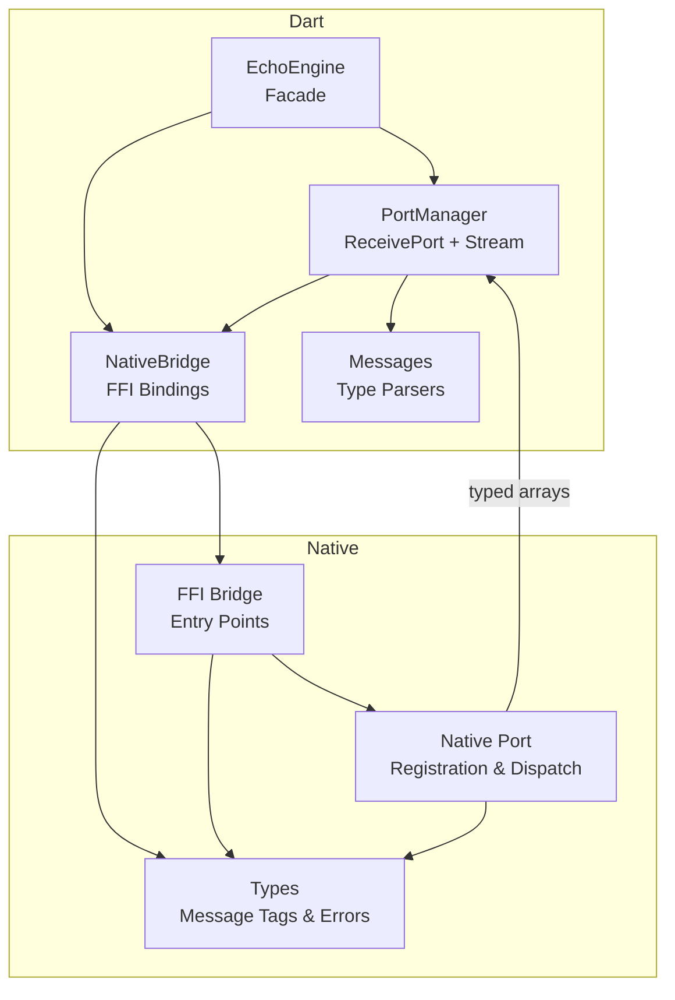
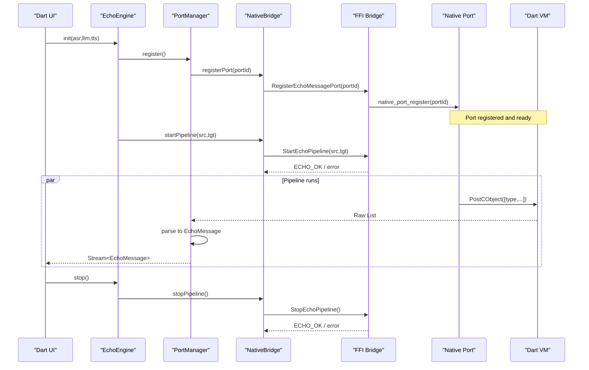
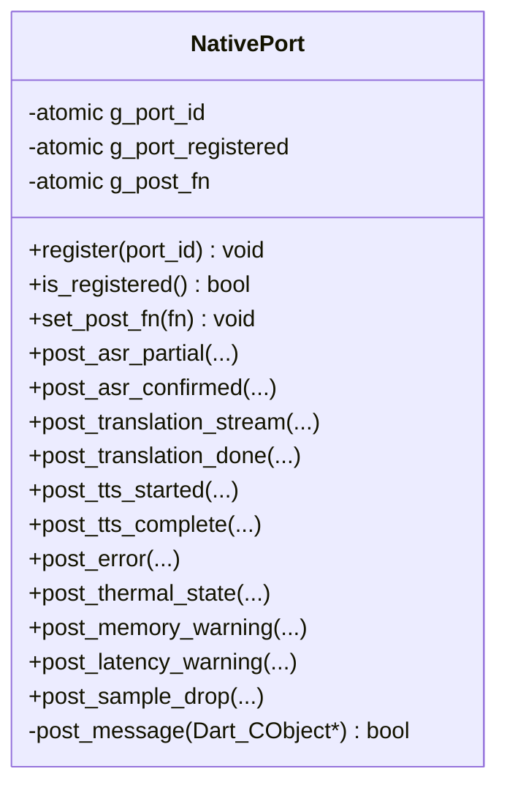
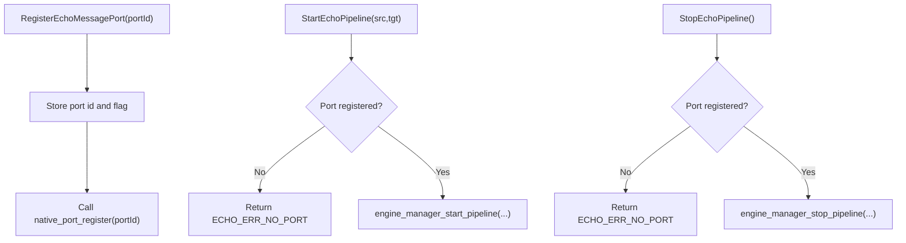
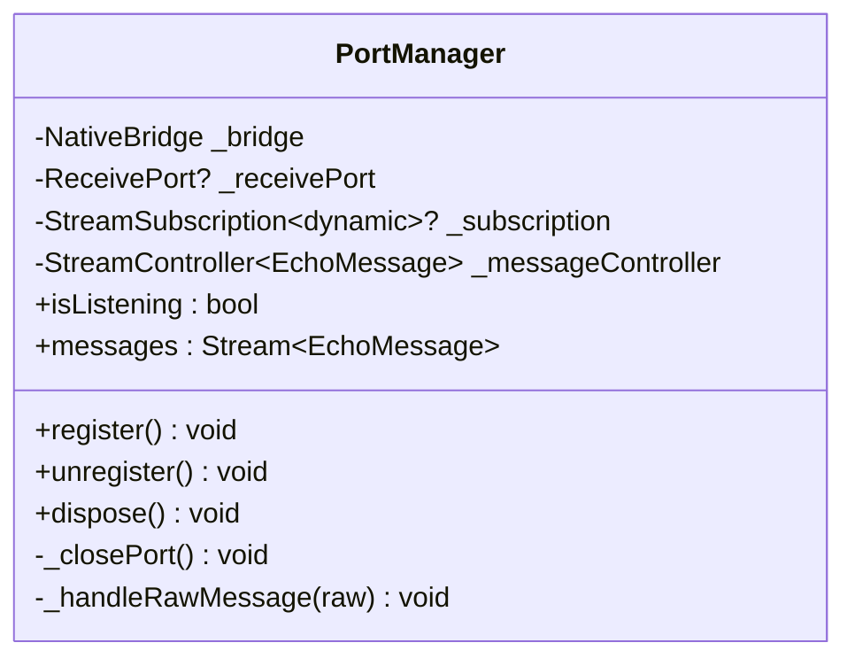
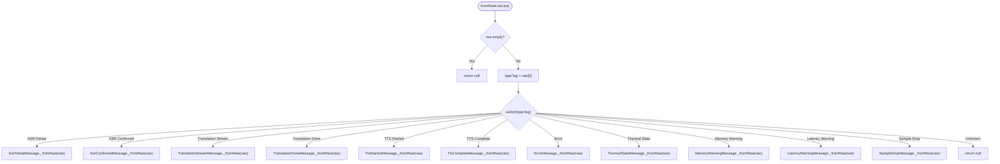
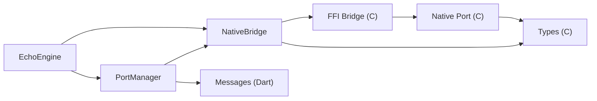

# Native Port Management

<cite>
**Referenced Files in This Document**
- [native_port.h](file://native/include/native_port.h)
- [native_port.cpp](file://native/src/native_port.cpp)
- [ffi_bridge.h](file://native/include/ffi_bridge.h)
- [ffi_bridge.cpp](file://native/src/ffi_bridge.cpp)
- [echo_types.h](file://native/include/echo_types.h)
- [port_manager.dart](file://lib/src/port_manager.dart)
- [messages.dart](file://lib/src/messages.dart)
- [native_bridge.dart](file://lib/src/native_bridge.dart)
- [echo_engine.dart](file://lib/src/echo_engine.dart)
- [test_native_port.cpp](file://native/tests/test_native_port.cpp)
</cite>

## Table of Contents
1. [Introduction](#introduction)
2. [Project Structure](#project-structure)
3. [Core Components](#core-components)
4. [Architecture Overview](#architecture-overview)
5. [Detailed Component Analysis](#detailed-component-analysis)
6. [Dependency Analysis](#dependency-analysis)
7. [Performance Considerations](#performance-considerations)
8. [Troubleshooting Guide](#troubleshooting-guide)
9. [Conclusion](#conclusion)
10. [Appendices](#appendices)

## Introduction
This document explains the Native Port management system that delivers asynchronous messages from the C/C++ engine to Dart via the Dart Native Port mechanism. It covers:
- Port registration lifecycle and replacement semantics
- Thread-safe message queuing and dispatch
- Cross-platform FFI loading behavior
- The PortManager class architecture on Dart
- Message routing algorithms (type-tagged arrays)
- Connection state management across Dart and native layers
- Examples for setup, sending patterns, and cleanup
- Performance considerations, memory management, and debugging techniques

## Project Structure
The Native Port system spans both native and Dart sides:
- Native side:
  - Public interface and implementation for port registration and typed message posting
  - FFI bridge exposing entry points to Dart
  - Shared type definitions for message tags and error codes
- Dart side:
  - FFI bindings to load the native library and call entry points
  - PortManager to create a ReceivePort, register it with native, and stream typed messages
  - EchoEngine facade orchestrating lifecycle and exposing a typed message stream

**Diagram sources**
- [echo_engine.dart:37-108](file://lib/src/echo_engine.dart#L37-L108)
- [port_manager.dart:18-85](file://lib/src/port_manager.dart#L18-L85)
- [native_bridge.dart:103-230](file://lib/src/native_bridge.dart#L103-L230)
- [ffi_bridge.cpp:54-124](file://native/src/ffi_bridge.cpp#L54-L124)
- [native_port.cpp:36-75](file://native/src/native_port.cpp#L36-L75)
- [echo_types.h:30-62](file://native/include/echo_types.h#L30-L62)

**Section sources**
- [echo_engine.dart:37-108](file://lib/src/echo_engine.dart#L37-L108)
- [port_manager.dart:18-85](file://lib/src/port_manager.dart#L18-L85)
- [native_bridge.dart:103-230](file://lib/src/native_bridge.dart#L103-L230)
- [ffi_bridge.cpp:54-124](file://native/src/ffi_bridge.cpp#L54-L124)
- [native_port.cpp:36-75](file://native/src/native_port.cpp#L36-L75)
- [echo_types.h:30-62](file://native/include/echo_types.h#L30-L62)

## Core Components
- Native Port module:
  - Provides functions to register a Dart SendPort ID and post typed messages as Dart_CObject arrays
  - Uses atomics for thread-safe access to port ID, registration flag, and post function pointer
- FFI Bridge:
  - Exposes four C-linkage entry points used by Dart
  - Enforces that a port must be registered before starting or stopping the pipeline
- Dart PortManager:
  - Creates a ReceivePort, registers its native port ID with the engine, and streams typed messages
- Dart Messages:
  - Parses raw lists into strongly-typed message classes based on a type tag
- Dart NativeBridge:
  - Loads platform-specific libraries and maps C functions to Dart methods
- EchoEngine:
  - Facade combining PortManager and NativeBridge to manage lifecycle and expose a typed message stream

**Section sources**
- [native_port.h:65-173](file://native/include/native_port.h#L65-L173)
- [native_port.cpp:36-75](file://native/src/native_port.cpp#L36-L75)
- [ffi_bridge.h:17-77](file://native/include/ffi_bridge.h#L17-L77)
- [ffi_bridge.cpp:108-124](file://native/src/ffi_bridge.cpp#L108-L124)
- [port_manager.dart:18-85](file://lib/src/port_manager.dart#L18-L85)
- [messages.dart:8-49](file://lib/src/messages.dart#L8-L49)
- [native_bridge.dart:103-230](file://lib/src/native_bridge.dart#L103-L230)
- [echo_engine.dart:37-108](file://lib/src/echo_engine.dart#L37-L108)

## Architecture Overview
End-to-end flow from Dart to native and back:
- Dart creates a ReceivePort and registers its native port ID with the engine
- Native stores the port ID and a runtime post function pointer
- Engine stages post typed messages; native serializes them and posts to the Dart port
- Dart receives raw lists, parses them into typed messages, and emits them on a broadcast stream

**Diagram sources**
- [echo_engine.dart:66-98](file://lib/src/echo_engine.dart#L66-L98)
- [port_manager.dart:42-57](file://lib/src/port_manager.dart#L42-L57)
- [native_bridge.dart:182-185](file://lib/src/native_bridge.dart#L182-L185)
- [ffi_bridge.cpp:71-106](file://native/src/ffi_bridge.cpp#L71-L106)
- [native_port.cpp:36-75](file://native/src/native_port.cpp#L36-L75)

## Detailed Component Analysis

### Native Port Module (C/C++)
Responsibilities:
- Maintain global atomic state for port ID, registration flag, and post function pointer
- Provide typed posting functions that serialize payloads into Dart_CObject arrays
- Route messages through the registered port using the runtime-set post function

Key behaviors:
- Registration replaces any previously registered port
- Posting returns false if no port is registered or no post function is set
- Each typed post function constructs a small array of Dart_CObject elements and calls the internal post helper

**Diagram sources**
- [native_port.cpp:19-75](file://native/src/native_port.cpp#L19-L75)
- [native_port.h:65-173](file://native/include/native_port.h#L65-L173)

**Section sources**
- [native_port.cpp:19-75](file://native/src/native_port.cpp#L19-L75)
- [native_port.h:65-173](file://native/include/native_port.h#L65-L173)

### FFI Bridge (C/C++)
Responsibilities:
- Expose four entry points to Dart: Init, Start, Stop, RegisterPort
- Ensure a port is registered before allowing Start/Stop
- Forward RegisterPort to the Native Port module

Cross-platform notes:
- Library loading is handled on the Dart side; the native side remains platform-agnostic
- Error codes are defined centrally and mirrored in Dart

**Diagram sources**
- [ffi_bridge.cpp:108-124](file://native/src/ffi_bridge.cpp#L108-L124)
- [ffi_bridge.cpp:71-106](file://native/src/ffi_bridge.cpp#L71-L106)
- [echo_types.h:48-62](file://native/include/echo_types.h#L48-L62)

**Section sources**
- [ffi_bridge.h:17-77](file://native/include/ffi_bridge.h#L17-L77)
- [ffi_bridge.cpp:54-124](file://native/src/ffi_bridge.cpp#L54-L124)
- [echo_types.h:48-62](file://native/include/echo_types.h#L48-L62)

### Dart PortManager
Responsibilities:
- Create a ReceivePort and register its native port ID with the engine
- Transform raw incoming lists into typed EchoMessage objects
- Expose a broadcast Stream for multiple listeners

Lifecycle:
- register(): closes existing port, creates new ReceivePort, registers with engine, starts listening
- unregister(): cancels subscription and closes port
- dispose(): cancels subscription, closes port, and closes the message controller

**Diagram sources**
- [port_manager.dart:18-85](file://lib/src/port_manager.dart#L18-L85)

**Section sources**
- [port_manager.dart:18-85](file://lib/src/port_manager.dart#L18-L85)

### Dart Messages Parsing
Responsibilities:
- Define message type tags matching native MessageType enum
- Parse raw lists into strongly-typed message classes
- Provide helpers like usage percentage and mode names

Routing algorithm:
- Read first element as type tag
- Switch on tag to construct specific message class
- Return null for unknown tags

**Diagram sources**
- [messages.dart:14-49](file://lib/src/messages.dart#L14-L49)

**Section sources**
- [messages.dart:8-49](file://lib/src/messages.dart#L8-L49)

### Dart NativeBridge
Responsibilities:
- Load platform-specific shared library
- Lookup and bind C functions
- Wrap calls with UTF-8 allocation/free and error throwing

Cross-platform differences:
- Android/Linux: loads libqwen_echo.so
- iOS/macOS: tries process library first, then libqwen_echo.dylib

**Section sources**
- [native_bridge.dart:103-230](file://lib/src/native_bridge.dart#L103-L230)

### EchoEngine Facade
Responsibilities:
- Combine PortManager and NativeBridge
- Manage lifecycle states: uninitialized → ready → running
- Expose typed message stream to UI

**Section sources**
- [echo_engine.dart:37-108](file://lib/src/echo_engine.dart#L37-L108)

## Dependency Analysis
High-level dependencies between components:

**Diagram sources**
- [echo_engine.dart:37-108](file://lib/src/echo_engine.dart#L37-L108)
- [port_manager.dart:18-85](file://lib/src/port_manager.dart#L18-L85)
- [native_bridge.dart:103-230](file://lib/src/native_bridge.dart#L103-L230)
- [ffi_bridge.cpp:54-124](file://native/src/ffi_bridge.cpp#L54-L124)
- [native_port.cpp:36-75](file://native/src/native_port.cpp#L36-L75)
- [echo_types.h:30-62](file://native/include/echo_types.h#L30-L62)
- [messages.dart:8-49](file://lib/src/messages.dart#L8-L49)

**Section sources**
- [echo_engine.dart:37-108](file://lib/src/echo_engine.dart#L37-L108)
- [port_manager.dart:18-85](file://lib/src/port_manager.dart#L18-L85)
- [native_bridge.dart:103-230](file://lib/src/native_bridge.dart#L103-L230)
- [ffi_bridge.cpp:54-124](file://native/src/ffi_bridge.cpp#L54-L124)
- [native_port.cpp:36-75](file://native/src/native_port.cpp#L36-L75)
- [echo_types.h:30-62](file://native/include/echo_types.h#L30-L62)
- [messages.dart:8-49](file://lib/src/messages.dart#L8-L49)

## Performance Considerations
- Serialization overhead:
  - Each message builds a small Dart_CObject array; keep payloads minimal and avoid large strings when possible
- Threading model:
  - Native uses atomics for port state; ensure producers do not block on posting; consider backpressure at higher layers if needed
- Memory management:
  - Dart-side UTF-8 allocations are freed after each FFI call; avoid holding long-lived references to raw data
- Stream throughput:
  - Use a single listener where possible; broadcast streams fan out to all subscribers, increasing per-message work
- Platform differences:
  - On iOS/macOS, the process library may be used; verify symbol visibility and linkage settings
- Diagnostics:
  - Monitor thermal and memory warning messages to adapt processing rates proactively

[No sources needed since this section provides general guidance]

## Troubleshooting Guide
Common issues and resolutions:
- No messages received:
  - Verify port registration succeeded and that a post function is set
  - Confirm the engine returned success for StartEchoPipeline
- ECHO_ERR_NO_PORT errors:
  - Ensure RegisterEchoMessagePort is called before StartEchoPipeline or StopEchoPipeline
- Incorrect message parsing:
  - Validate the first element matches expected MessageType tags
  - Check field types and lengths match the native layout
- Crashes during posting:
  - Ensure the post function pointer is valid and the port is registered
  - Avoid posting from threads without proper synchronization beyond atomics
- Platform loading failures:
  - On iOS/macOS, confirm symbols are exported and the process/library lookup order is correct

Validation aids:
- Unit tests demonstrate message formats and port replacement behavior

**Section sources**
- [ffi_bridge.cpp:71-106](file://native/src/ffi_bridge.cpp#L71-L106)
- [test_native_port.cpp:105-140](file://native/tests/test_native_port.cpp#L105-L140)
- [test_native_port.cpp:153-204](file://native/tests/test_native_port.cpp#L153-L204)
- [native_bridge.dart:224-228](file://lib/src/native_bridge.dart#L224-L228)

## Conclusion
The Native Port system provides a robust, cross-platform channel for asynchronous messaging from the C/C++ engine to Dart. It combines a simple, type-tagged serialization scheme with thread-safe registration and a clean Dart-side streaming API. Proper lifecycle management—registering the port early, handling errors, and cleaning up resources—ensures reliable operation across platforms.

[No sources needed since this section summarizes without analyzing specific files]

## Appendices

### Example: Port Setup and Cleanup
- Dart setup:
  - Create EchoEngine, subscribe to messages, call init (which registers the port), then start/stop as needed
  - Dispose to release Dart-side resources
- Native behavior:
  - Registration replaces any previous port
  - Posting returns false if unregistered or missing post function

**Section sources**
- [echo_engine.dart:66-98](file://lib/src/echo_engine.dart#L66-L98)
- [port_manager.dart:42-63](file://lib/src/port_manager.dart#L42-L63)
- [native_port.cpp:36-75](file://native/src/native_port.cpp#L36-L75)

### Example: Message Sending Patterns
- ASR partial and confirmed messages include speaker ID, text, timestamp, and optional segment ID
- Translation stream/done messages carry tokens or full text with segment IDs
- TTS started/complete events mark synthesis boundaries
- Diagnostic messages cover thermal state, memory warnings, latency violations, and sample drops

**Section sources**
- [native_port.h:100-173](file://native/include/native_port.h#L100-L173)
- [messages.dart:51-336](file://lib/src/messages.dart#L51-L336)