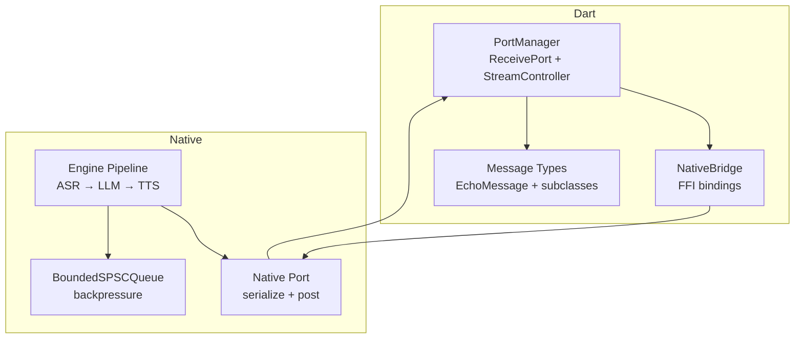
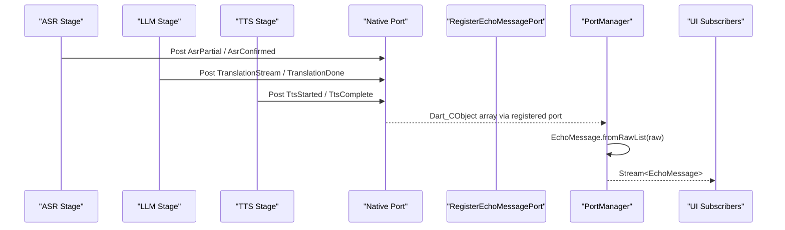
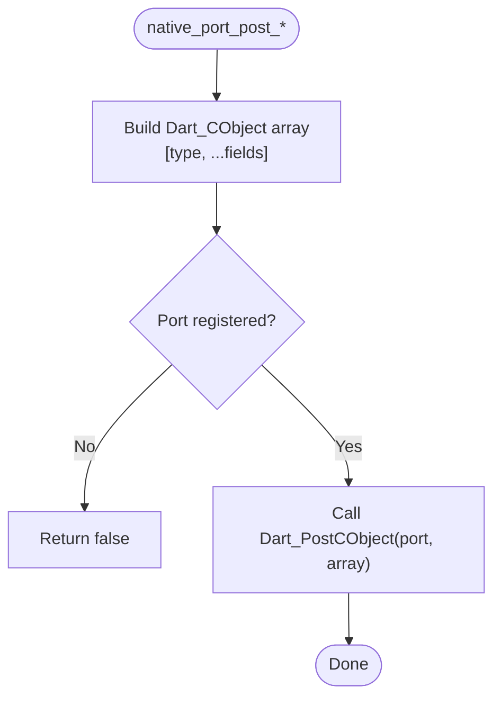
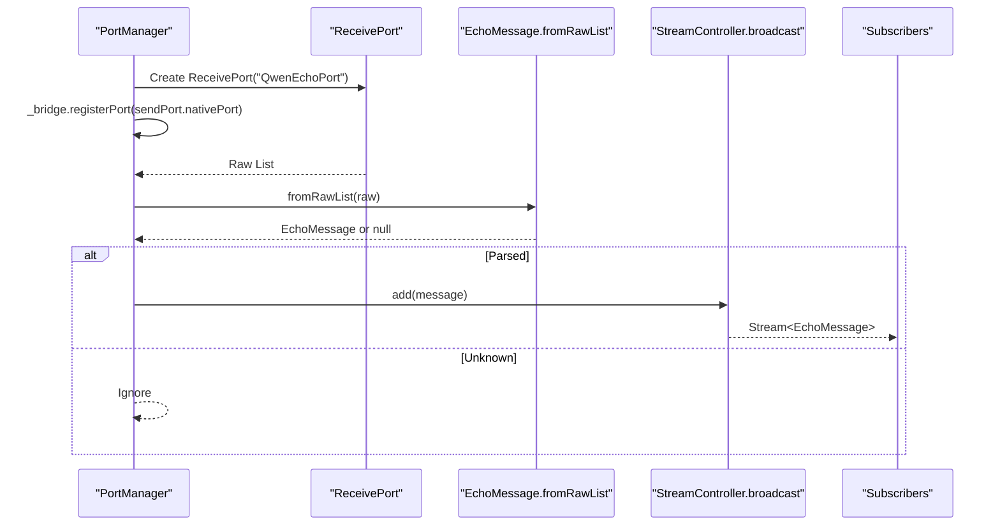
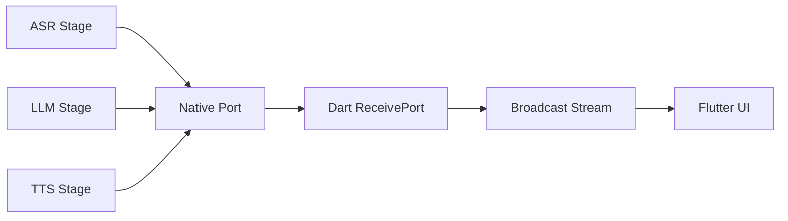
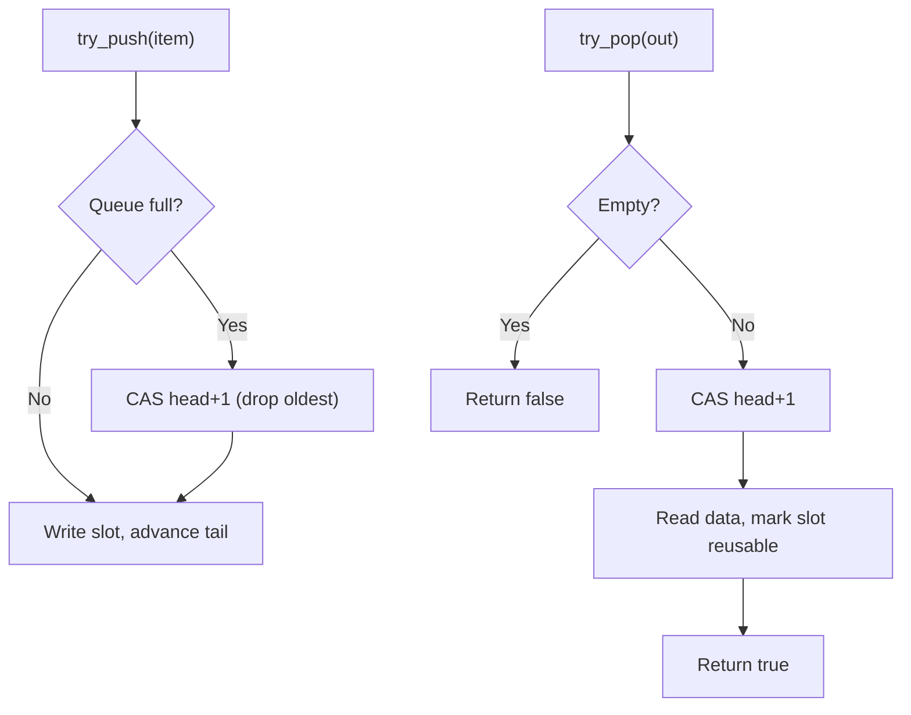
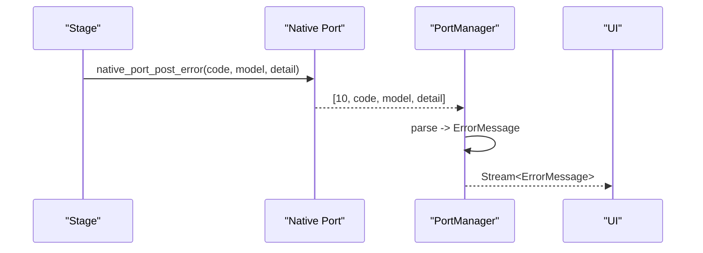
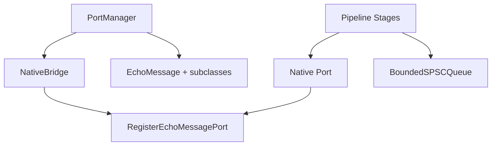

# Typed Message Protocol

<cite>
**Referenced Files in This Document**
- [messages.dart](file://lib/src/messages.dart)
- [port_manager.dart](file://lib/src/port_manager.dart)
- [native_bridge.dart](file://lib/src/native_bridge.dart)
- [echo_types.h](file://native/include/echo_types.h)
- [native_port.cpp](file://native/src/native_port.cpp)
- [bounded_spsc_queue.h](file://native/include/bounded_spsc_queue.h)
- [latency_tracker.cpp](file://native/src/latency_tracker.cpp)
- [test_native_port.cpp](file://native/tests/test_native_port.cpp)
- [messages_test.dart](file://test/messages_test.dart)
</cite>

## Table of Contents
1. [Introduction](#introduction)
2. [Project Structure](#project-structure)
3. [Core Components](#core-components)
4. [Architecture Overview](#architecture-overview)
5. [Detailed Component Analysis](#detailed-component-analysis)
6. [Dependency Analysis](#dependency-analysis)
7. [Performance Considerations](#performance-considerations)
8. [Troubleshooting Guide](#troubleshooting-guide)
9. [Conclusion](#conclusion)

## Introduction
This document describes QwenEcho’s typed message protocol that transports real-time events from the native engine to the Flutter UI. It covers all message types, their structure and serialization format, creation/parsing/routing patterns, and the event-driven architecture enabling streaming from native stages (ASR → LLM → TTS) to Dart. It also explains ordering guarantees, backpressure handling, and error propagation mechanisms across the boundary between C/C++ and Dart.

## Project Structure
The typed message protocol spans both Dart and native layers:
- Dart side: message type definitions, FFI bridge, and port manager for receiving and dispatching messages as a broadcast stream.
- Native side: message type tags, serialization into Dart_CObject arrays, and posting via the registered Dart port. Inter-stage queues provide backpressure and ordering within the pipeline.

**Diagram sources**
- [port_manager.dart:18-85](file://lib/src/port_manager.dart#L18-L85)
- [native_bridge.dart:103-230](file://lib/src/native_bridge.dart#L103-L230)
- [messages.dart:8-336](file://lib/src/messages.dart#L8-L336)
- [native_port.cpp:116-317](file://native/src/native_port.cpp#L116-L317)
- [bounded_spsc_queue.h:29-142](file://native/include/bounded_spsc_queue.h#L29-L142)

**Section sources**
- [port_manager.dart:18-85](file://lib/src/port_manager.dart#L18-L85)
- [native_bridge.dart:103-230](file://lib/src/native_bridge.dart#L103-L230)
- [messages.dart:8-336](file://lib/src/messages.dart#L8-L336)
- [native_port.cpp:116-317](file://native/src/native_port.cpp#L116-L317)
- [bounded_spsc_queue.h:29-142](file://native/include/bounded_spsc_queue.h#L29-L142)

## Core Components
- Message types and parsing: A sealed base class with a static factory parses raw lists into strongly-typed message objects. Each subclass defines its fields and a private constructor used by the parser.
- Port Manager: Creates a ReceivePort, registers it with the native engine via FFI, and exposes a broadcast Stream of typed messages.
- Native Bridge: Loads the native library and exposes lifecycle functions including RegisterEchoMessagePort.
- Native Port: Serializes typed messages into Dart_CObject arrays and posts them to the registered Dart port.
- Engine Queues: Lock-free bounded single-producer/single-consumer queues implement backpressure with drop-oldest semantics.

Key responsibilities:
- Serialization/deserialization alignment between native and Dart.
- Type-safe routing from ReceivePort to a broadcast Stream.
- Backpressure and ordering within the native pipeline.

**Section sources**
- [messages.dart:8-336](file://lib/src/messages.dart#L8-L336)
- [port_manager.dart:18-85](file://lib/src/port_manager.dart#L18-L85)
- [native_bridge.dart:103-230](file://lib/src/native_bridge.dart#L103-L230)
- [native_port.cpp:116-317](file://native/src/native_port.cpp#L116-L317)
- [bounded_spsc_queue.h:29-142](file://native/include/bounded_spsc_queue.h#L29-L142)

## Architecture Overview
The system uses an event-driven architecture where native stages produce messages that are serialized and posted to a Dart ReceivePort. The PortManager deserializes them into typed EchoMessage instances and emits them on a broadcast Stream for UI consumers.

**Diagram sources**
- [native_port.cpp:116-317](file://native/src/native_port.cpp#L116-L317)
- [messages.dart:14-33](file://lib/src/messages.dart#L14-L33)
- [port_manager.dart:42-83](file://lib/src/port_manager.dart#L42-L83)
- [native_bridge.dart:182-185](file://lib/src/native_bridge.dart#L182-L185)

## Detailed Component Analysis

### Message Types and Serialization Format
All messages are arrays starting with a type tag followed by payload fields. The Dart parser maps each tag to a concrete class.

- AsrPartialMessage (type 1): [type, speaker_id, text, timestamp_ms]
- AsrConfirmedMessage (type 2): [type, speaker_id, text, timestamp_ms, segment_id]
- TranslationStreamMessage (type 3): [type, speaker_id, token, segment_id]
- TranslationDoneMessage (type 4): [type, speaker_id, full_text, segment_id]
- TtsStartedMessage (type 5): [type, speaker_id, segment_id]
- TtsCompleteMessage (type 6): [type, speaker_id, segment_id]
- ErrorMessage (type 10): [type, error_code, model_name, detail]
- ThermalStateMessage (type 11): [type, thermal_mode, temperature_c]
- MemoryWarningMessage (type 12): [type, current_bytes, limit_bytes, level]
- LatencyWarningMessage (type 13): [type, stage, actual_ms, budget_ms]
- SampleDropMessage (type 14): [type, dropped_samples, timestamp_ms]

Type tags are defined in the native header and mirrored in Dart constants.

```mermaid
classDiagram
class EchoMessage {
+fromRawList(raw) EchoMessage?
}
class AsrPartialMessage {
+int speakerId
+String text
+int timestampMs
}
class AsrConfirmedMessage {
+int speakerId
+String text
+int timestampMs
+int segmentId
}
class TranslationStreamMessage {
+int speakerId
+String token
+int segmentId
}
class TranslationDoneMessage {
+int speakerId
+String fullText
+int segmentId
}
class TtsStartedMessage {
+int speakerId
+int segmentId
}
class TtsCompleteMessage {
+int speakerId
+int segmentId
}
class ErrorMessage {
+int errorCode
+String modelName
+String detail
}
class ThermalStateMessage {
+int thermalMode
+double temperatureC
+modeName String
}
class MemoryWarningMessage {
+int currentBytes
+int limitBytes
+int level
+usagePercent double
}
class LatencyWarningMessage {
+String stage
+int actualMs
+int budgetMs
}
class SampleDropMessage {
+int droppedSamples
+int timestampMs
}
EchoMessage <|-- AsrPartialMessage
EchoMessage <|-- AsrConfirmedMessage
EchoMessage <|-- TranslationStreamMessage
EchoMessage <|-- TranslationDoneMessage
EchoMessage <|-- TtsStartedMessage
EchoMessage <|-- TtsCompleteMessage
EchoMessage <|-- ErrorMessage
EchoMessage <|-- ThermalStateMessage
EchoMessage <|-- MemoryWarningMessage
EchoMessage <|-- LatencyWarningMessage
EchoMessage <|-- SampleDropMessage
```

**Diagram sources**
- [messages.dart:8-336](file://lib/src/messages.dart#L8-L336)

**Section sources**
- [messages.dart:36-336](file://lib/src/messages.dart#L36-L336)
- [echo_types.h:30-42](file://native/include/echo_types.h#L30-L42)
- [native_port.cpp:116-317](file://native/src/native_port.cpp#L116-L317)
- [messages_test.dart:5-133](file://test/messages_test.dart#L5-L133)

### Message Creation and Posting (Native Side)
Each typed message is constructed as a Dart_CObject array with a leading type tag and payload elements. The native port module provides helper functions per message type and posts them through a function pointer to Dart.

**Diagram sources**
- [native_port.cpp:62-75](file://native/src/native_port.cpp#L62-L75)
- [native_port.cpp:116-317](file://native/src/native_port.cpp#L116-L317)

**Section sources**
- [native_port.cpp:116-317](file://native/src/native_port.cpp#L116-L317)
- [test_native_port.cpp:323-371](file://native/tests/test_native_port.cpp#L323-L371)

### Message Parsing and Routing (Dart Side)
The PortManager creates a ReceivePort, registers it with the native engine, and listens for incoming raw lists. Each raw list is parsed into a typed EchoMessage using the central switch-based parser and emitted on a broadcast Stream.

**Diagram sources**
- [port_manager.dart:42-83](file://lib/src/port_manager.dart#L42-L83)
- [messages.dart:14-33](file://lib/src/messages.dart#L14-L33)

**Section sources**
- [port_manager.dart:18-85](file://lib/src/port_manager.dart#L18-L85)
- [messages.dart:14-33](file://lib/src/messages.dart#L14-L33)

### Event-Driven Streaming from Native Engine to Flutter UI
The pipeline stages (ASR, LLM, TTS) emit status and data updates as typed messages. These traverse the native port layer and arrive in Dart as a typed stream, enabling reactive UI updates without polling.

**Diagram sources**
- [latency_tracker.cpp:1-31](file://native/src/latency_tracker.cpp#L1-L31)
- [native_port.cpp:116-317](file://native/src/native_port.cpp#L116-L317)
- [port_manager.dart:24-33](file://lib/src/port_manager.dart#L24-L33)

**Section sources**
- [latency_tracker.cpp:1-31](file://native/src/latency_tracker.cpp#L1-L31)
- [port_manager.dart:24-33](file://lib/src/port_manager.dart#L24-L33)

### Ordering Guarantees
- Within the Dart ReceivePort, messages are delivered in the order they are posted by the native side.
- In the native pipeline, inter-stage communication uses lock-free bounded queues that preserve FIFO order per producer/consumer pair. Overflow drops the oldest element but maintains relative order among remaining items.

**Diagram sources**
- [bounded_spsc_queue.h:51-116](file://native/include/bounded_spsc_queue.h#L51-L116)

**Section sources**
- [bounded_spsc_queue.h:29-142](file://native/include/bounded_spsc_queue.h#L29-L142)

### Backpressure Handling
Backpressure is implemented via BoundedSPSCQueue with fixed capacity and drop-oldest semantics. Producers never block; when the queue is full, the oldest item is discarded to make room for the newest. This ensures low-latency streaming at the cost of dropping stale intermediate results under heavy load.

- Producer path: try_push returns true if normal push, false if overflow occurred (oldest dropped).
- Consumer path: try_pop returns true if an item was dequeued, false if empty.

**Section sources**
- [bounded_spsc_queue.h:29-142](file://native/include/bounded_spsc_queue.h#L29-L142)

### Error Propagation Mechanisms
Errors are propagated as dedicated ErrorMessage events containing an error code, model name, and detail string. Additionally, system-level warnings (thermal, memory, latency, sample drops) are sent as typed warning messages. On the Dart side, these are parsed into corresponding message classes and can be handled by subscribers.

**Diagram sources**
- [native_port.cpp:228-245](file://native/src/native_port.cpp#L228-L245)
- [messages.dart:201-224](file://lib/src/messages.dart#L201-L224)

**Section sources**
- [native_port.cpp:228-245](file://native/src/native_port.cpp#L228-L245)
- [messages.dart:201-224](file://lib/src/messages.dart#L201-L224)

### Examples of Message Creation, Parsing, and Routing Patterns
- Creating messages (native): Use the typed post functions to build arrays with a leading type tag and payload fields, then post via the registered port.
- Parsing messages (Dart): Call the central parser with a raw list; it returns a strongly-typed EchoMessage subclass based on the first element.
- Routing pattern: Subscribe to PortManager.messages and branch on runtime type to update UI state or trigger actions.

References:
- Native posting examples and assertions are validated in tests.
- Dart parsing behavior is verified by unit tests covering all message types.

**Section sources**
- [test_native_port.cpp:323-371](file://native/tests/test_native_port.cpp#L323-L371)
- [messages_test.dart:5-133](file://test/messages_test.dart#L5-L133)

## Dependency Analysis
The typed message protocol depends on tight coordination between Dart and native components:
- Dart FFI bridge loads the native library and exposes RegisterEchoMessagePort.
- PortManager registers the Dart ReceivePort and converts raw lists to typed messages.
- Native port serializes messages and posts them to the registered port.
- Engine stages use bounded queues for internal backpressure and ordering.

**Diagram sources**
- [native_bridge.dart:182-185](file://lib/src/native_bridge.dart#L182-L185)
- [port_manager.dart:42-83](file://lib/src/port_manager.dart#L42-L83)
- [native_port.cpp:116-317](file://native/src/native_port.cpp#L116-L317)
- [bounded_spsc_queue.h:29-142](file://native/include/bounded_spsc_queue.h#L29-L142)

**Section sources**
- [native_bridge.dart:103-230](file://lib/src/native_bridge.dart#L103-L230)
- [port_manager.dart:18-85](file://lib/src/port_manager.dart#L18-L85)
- [native_port.cpp:116-317](file://native/src/native_port.cpp#L116-L317)
- [bounded_spsc_queue.h:29-142](file://native/include/bounded_spsc_queue.h#L29-L142)

## Performance Considerations
- Drop-oldest backpressure avoids blocking producers and keeps streaming responsive under high load.
- Lock-free queues minimize contention and reduce overhead compared to mutex-based structures.
- Broadcasting messages to multiple UI listeners should be considered; heavy UI work may need throttling or debouncing to maintain responsiveness.

[No sources needed since this section provides general guidance]

## Troubleshooting Guide
Common issues and diagnostics:
- No messages received: Ensure the Dart ReceivePort is created and registered before starting the pipeline. If registration fails, errors are returned via the FFI layer.
- Unknown message type: The parser ignores unknown tags; verify native and Dart type tag alignment.
- High memory usage: Monitor MemoryWarningMessage and adjust limits or throttle processing.
- Latency violations: Observe LatencyWarningMessage to identify bottlenecks in specific stages.
- Audio quality issues: SampleDropMessage indicates dropped audio samples; consider reducing processing load or adjusting buffer sizes.

**Section sources**
- [messages.dart:201-336](file://lib/src/messages.dart#L201-L336)
- [native_port.cpp:228-317](file://native/src/native_port.cpp#L228-L317)

## Conclusion
QwenEcho’s typed message protocol provides a robust, type-safe channel for real-time streaming from the native engine to Flutter. The design emphasizes clear separation of concerns, efficient serialization, and predictable ordering with controlled backpressure. By leveraging typed messages and a broadcast stream, the UI can reactively render ASR, translation, and TTS events while monitoring system health through dedicated warning messages.