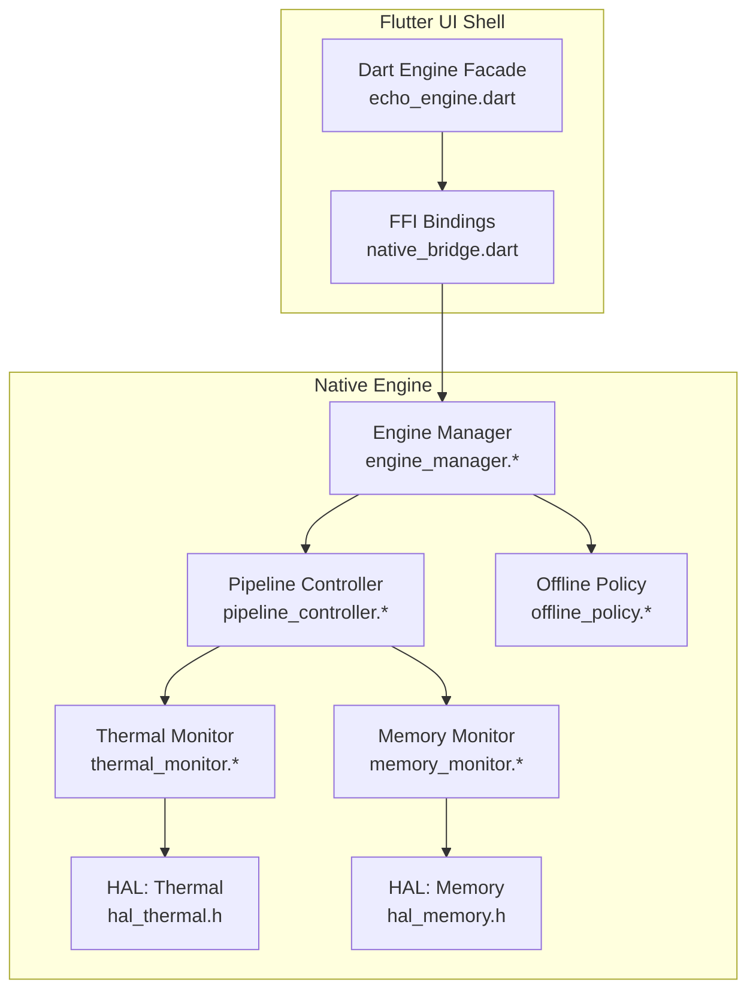
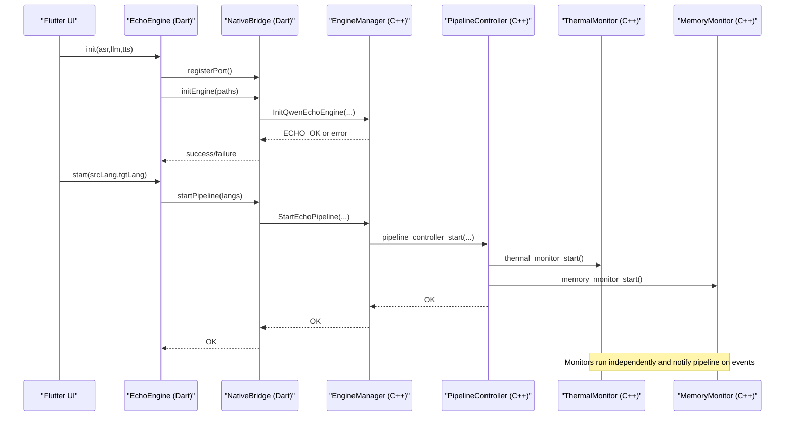
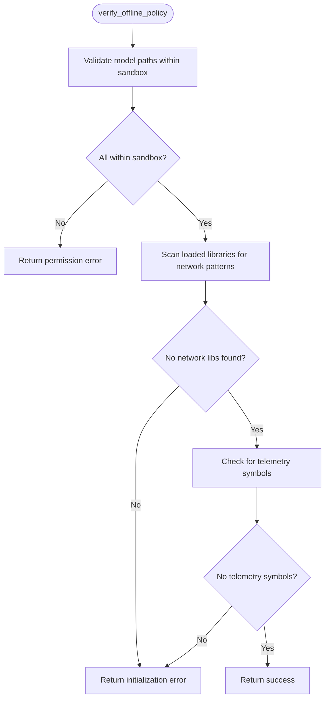
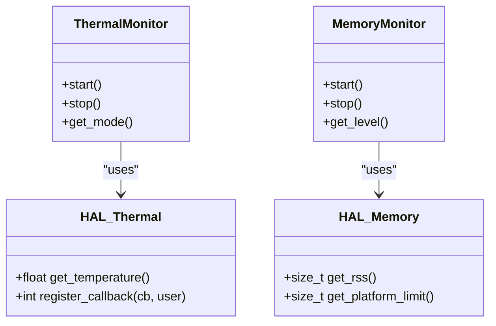
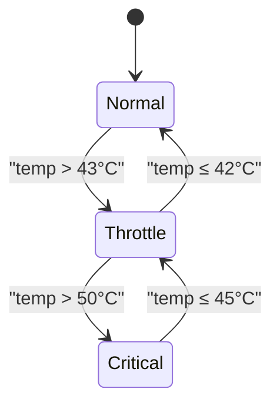
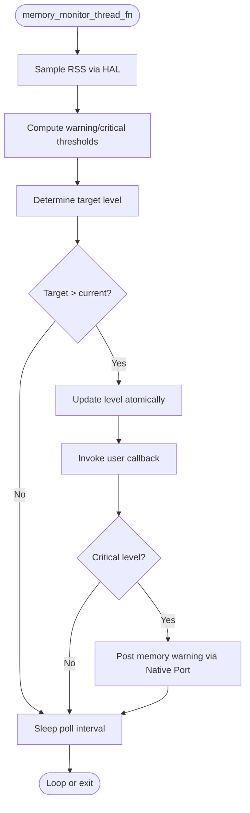
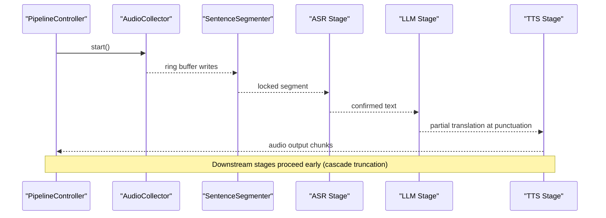
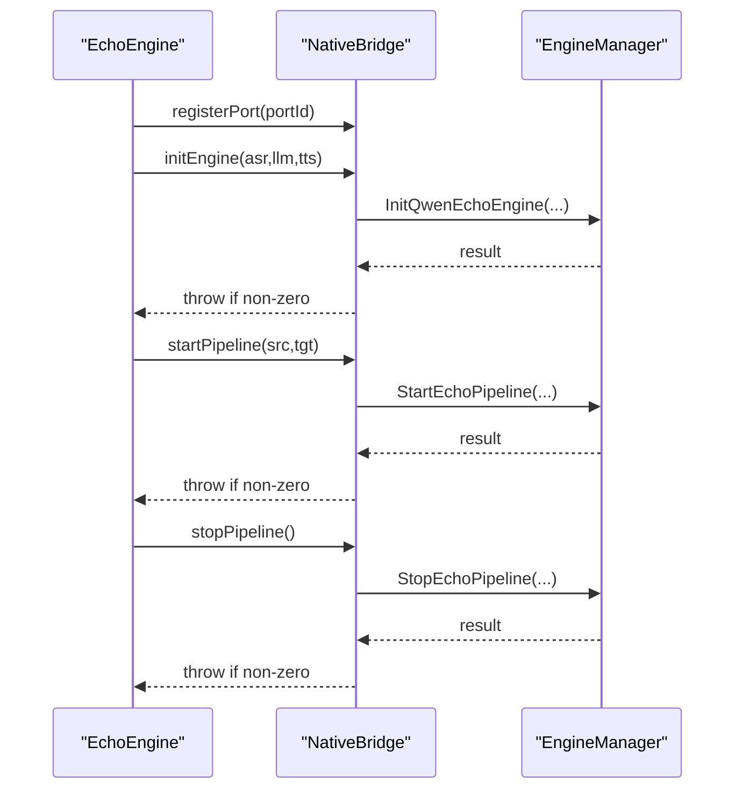
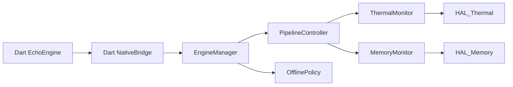

# Design Principles

<cite>
**Referenced Files in This Document**
- [README.md](file://README.md)
- [qwen_echo.dart](file://lib/qwen_echo.dart)
- [echo_engine.dart](file://lib/src/echo_engine.dart)
- [native_bridge.dart](file://lib/src/native_bridge.dart)
- [engine_manager.h](file://native/include/engine_manager.h)
- [engine_manager.cpp](file://native/src/engine_manager.cpp)
- [pipeline_controller.h](file://native/include/pipeline_controller.h)
- [pipeline_controller.cpp](file://native/src/pipeline_controller.cpp)
- [offline_policy.h](file://native/include/offline_policy.h)
- [offline_policy.cpp](file://native/src/offline_policy.cpp)
- [thermal_monitor.h](file://native/include/thermal_monitor.h)
- [thermal_monitor.cpp](file://native/src/thermal_monitor.cpp)
- [hal_thermal.h](file://native/hal/hal_thermal.h)
- [memory_monitor.h](file://native/include/memory_monitor.h)
- [memory_monitor.cpp](file://native/src/memory_monitor.cpp)
- [hal_memory.h](file://native/hal/hal_memory.h)
</cite>

## Table of Contents
1. Introduction
2. Project Structure
3. Core Components
4. Architecture Overview
5. Detailed Component Analysis
6. Dependency Analysis
7. Performance Considerations
8. Troubleshooting Guide
9. Conclusion

## Introduction
QwenEcho is an on-device, air-gapped simultaneous interpretation system that runs three AI models entirely offline on mobile hardware. After model provisioning, the engine makes zero network requests and operates without any network interfaces present. The design emphasizes:
- Offline-first with zero network dependencies after provisioning
- Zero-knowledge architecture ensuring privacy through local-only processing
- Platform abstraction enabling cross-platform compatibility (Android/iOS)
- Air-gapped deployment strategy with compile-time and runtime safeguards
- Resource optimization guided by thermal and memory monitoring to maintain performance and safety

These principles inform technical decisions across memory management, thermal throttling, pipeline orchestration, and platform isolation.

## Project Structure
The project separates a Flutter UI shell from a C/C++ native engine. The Dart layer provides FFI bindings and message routing; the native layer implements the audio-to-speech pipeline, resource monitors, and platform abstractions.

**Diagram sources**
- [echo_engine.dart:1-108](file://lib/src/echo_engine.dart#L1-L108)
- [native_bridge.dart:1-230](file://lib/src/native_bridge.dart#L1-L230)
- [engine_manager.h:1-104](file://native/include/engine_manager.h#L1-L104)
- [engine_manager.cpp:1-202](file://native/src/engine_manager.cpp#L1-L202)
- [pipeline_controller.h:1-107](file://native/include/pipeline_controller.h#L1-L107)
- [pipeline_controller.cpp:1-488](file://native/src/pipeline_controller.cpp#L1-L488)
- [offline_policy.h:1-121](file://native/include/offline_policy.h#L1-L121)
- [offline_policy.cpp:1-219](file://native/src/offline_policy.cpp#L1-L219)
- [thermal_monitor.h:1-109](file://native/include/thermal_monitor.h#L1-L109)
- [thermal_monitor.cpp:1-190](file://native/src/thermal_monitor.cpp#L1-L190)
- [hal_thermal.h:1-53](file://native/hal/hal_thermal.h#L1-L53)
- [memory_monitor.h:1-108](file://native/include/memory_monitor.h#L1-L108)
- [memory_monitor.cpp:1-187](file://native/src/memory_monitor.cpp#L1-L187)
- [hal_memory.h:1-44](file://native/hal/hal_memory.h#L1-L44)

**Section sources**
- [README.md:15-93](file://README.md#L15-L93)
- [qwen_echo.dart:1-16](file://lib/qwen_echo.dart#L1-L16)

## Core Components
- Dart Engine Facade: Orchestrates lifecycle and exposes typed messages to the UI.
- FFI Bridge: Loads the native library and maps four C-linkage entry points to Dart methods.
- Engine Manager: Central coordinator for model loading and pipeline lifecycle state transitions.
- Pipeline Controller: Creates and orchestrates all stages (audio capture, segmentation, ASR, LLM, TTS), plus monitors.
- Offline Policy: Enforces air-gapped operation via compile-time symbol poisoning and runtime checks.
- Thermal Monitor: Three-mode state machine with hysteresis to adapt behavior under heat stress.
- Memory Monitor: Two-level mitigation with upward-only hysteresis to prevent OOM and ensure graceful shutdown.
- HAL Abstraction: Isolates platform-specific details for thermal and memory access.

**Section sources**
- [echo_engine.dart:1-108](file://lib/src/echo_engine.dart#L1-L108)
- [native_bridge.dart:1-230](file://lib/src/native_bridge.dart#L1-L230)
- [engine_manager.h:1-104](file://native/include/engine_manager.h#L1-L104)
- [engine_manager.cpp:1-202](file://native/src/engine_manager.cpp#L1-L202)
- [pipeline_controller.h:1-107](file://native/include/pipeline_controller.h#L1-L107)
- [pipeline_controller.cpp:1-488](file://native/src/pipeline_controller.cpp#L1-L488)
- [offline_policy.h:1-121](file://native/include/offline_policy.h#L1-L121)
- [offline_policy.cpp:1-219](file://native/src/offline_policy.cpp#L1-L219)
- [thermal_monitor.h:1-109](file://native/include/thermal_monitor.h#L1-L109)
- [thermal_monitor.cpp:1-190](file://native/src/thermal_monitor.cpp#L1-L190)
- [memory_monitor.h:1-108](file://native/include/memory_monitor.h#L1-L108)
- [memory_monitor.cpp:1-187](file://native/src/memory_monitor.cpp#L1-L187)
- [hal_thermal.h:1-53](file://native/hal/hal_thermal.h#L1-L53)
- [hal_memory.h:1-44](file://native/hal/hal_memory.h#L1-L44)

## Architecture Overview
The system follows a layered architecture:
- Dart UI Shell communicates with the native engine via a minimal FFI surface.
- Native Engine manages model loading, pipeline orchestration, and resource monitoring.
- Platform Abstraction Layer (HAL) isolates Android/iOS specifics behind stable C APIs.
- Offline Policy enforces strict air-gapped constraints at build time and runtime.

**Diagram sources**
- [echo_engine.dart:60-98](file://lib/src/echo_engine.dart#L60-L98)
- [native_bridge.dart:132-185](file://lib/src/native_bridge.dart#L132-L185)
- [engine_manager.cpp:44-141](file://native/src/engine_manager.cpp#L44-L141)
- [pipeline_controller.cpp:272-393](file://native/src/pipeline_controller.cpp#L272-L393)
- [thermal_monitor.cpp:136-156](file://native/src/thermal_monitor.cpp#L136-L156)
- [memory_monitor.cpp:136-148](file://native/src/memory_monitor.cpp#L136-L148)

## Detailed Component Analysis

### Offline-First and Zero-Knowledge Architecture
- Compile-time network symbol poisoning prevents accidental use of networking APIs when the offline policy flag is enabled.
- Runtime verification ensures:
  - Model files reside within the application sandbox
  - No network-related shared libraries are loaded
  - No telemetry/analytics symbols are resolvable
- Platform configuration requirements prohibit network permissions and ATS exceptions.

**Diagram sources**
- [offline_policy.h:90-114](file://native/include/offline_policy.h#L90-L114)
- [offline_policy.cpp:155-218](file://native/src/offline_policy.cpp#L155-L218)

**Section sources**
- [offline_policy.h:1-121](file://native/include/offline_policy.h#L1-L121)
- [offline_policy.cpp:1-219](file://native/src/offline_policy.cpp#L1-L219)
- [README.md:177-185](file://README.md#L177-L185)

### Platform Abstraction Layer (HAL)
- HAL abstracts platform-specific details for thermal and memory access.
- Thermal HAL exposes temperature polling and optional callbacks.
- Memory HAL exposes RSS sampling and platform-specific budget limits.

**Diagram sources**
- [hal_thermal.h:1-53](file://native/hal/hal_thermal.h#L1-L53)
- [hal_memory.h:1-44](file://native/hal/hal_memory.h#L1-L44)
- [thermal_monitor.h:1-109](file://native/include/thermal_monitor.h#L1-L109)
- [memory_monitor.h:1-108](file://native/include/memory_monitor.h#L1-L108)

**Section sources**
- [hal_thermal.h:1-53](file://native/hal/hal_thermal.h#L1-L53)
- [hal_memory.h:1-44](file://native/hal/hal_memory.h#L1-L44)

### Thermal Management and Throttling
- Three-mode state machine with hysteresis:
  - Normal → Throttle when temp > 43°C
  - Throttle → Normal when temp ≤ 42°C
  - Throttle → Critical when temp > 50°C
  - Critical → Throttle when temp ≤ 45°C
- On each transition, the monitor posts a message to the UI and invokes a callback for engine adaptation.

**Diagram sources**
- [thermal_monitor.h:1-109](file://native/include/thermal_monitor.h#L1-L109)
- [thermal_monitor.cpp:59-92](file://native/src/thermal_monitor.cpp#L59-L92)

**Section sources**
- [thermal_monitor.h:1-109](file://native/include/thermal_monitor.h#L1-L109)
- [thermal_monitor.cpp:1-190](file://native/src/thermal_monitor.cpp#L1-L190)

### Memory Management and Mitigation
- Two-level mitigation with upward-only hysteresis:
  - Level 1 (85%): release caches and buffers
  - Level 2 (95%): stop pipeline and notify UI
- Polling interval and thresholds are derived from platform limits exposed by HAL.

**Diagram sources**
- [memory_monitor.cpp:59-116](file://native/src/memory_monitor.cpp#L59-L116)
- [memory_monitor.h:22-43](file://native/include/memory_monitor.h#L22-L43)
- [hal_memory.h:26-37](file://native/hal/hal_memory.h#L26-L37)

**Section sources**
- [memory_monitor.h:1-108](file://native/include/memory_monitor.h#L1-L108)
- [memory_monitor.cpp:1-187](file://native/src/memory_monitor.cpp#L1-L187)
- [hal_memory.h:1-44](file://native/hal/hal_memory.h#L1-L44)

### Pipeline Orchestration and Cascade Truncation
- Pipeline stages: Audio Collector → Ring Buffer → Sentence Segmenter → ASR Stage → LLM Stage → TTS Stage → Output.
- Cascade truncation allows downstream stages to begin before upstream completes, reducing end-to-end latency.
- Graceful stop sequence ensures locked segments are flushed while discarding unlocked audio, completing within a deadline.

**Diagram sources**
- [pipeline_controller.cpp:10-38](file://native/src/pipeline_controller.cpp#L10-L38)
- [pipeline_controller.cpp:272-393](file://native/src/pipeline_controller.cpp#L272-L393)

**Section sources**
- [pipeline_controller.h:1-107](file://native/include/pipeline_controller.h#L1-L107)
- [pipeline_controller.cpp:1-488](file://native/src/pipeline_controller.cpp#L1-L488)

### Dart-Native Integration and Lifecycle
- Dart facade coordinates lifecycle: init → start → stop → dispose.
- FFI bridge loads the platform-specific native library and maps four C-linkage functions.
- Error codes and messages are mirrored between Dart and native layers for consistent diagnostics.

**Diagram sources**
- [echo_engine.dart:60-98](file://lib/src/echo_engine.dart#L60-L98)
- [native_bridge.dart:132-185](file://lib/src/native_bridge.dart#L132-L185)
- [engine_manager.cpp:44-141](file://native/src/engine_manager.cpp#L44-L141)

**Section sources**
- [echo_engine.dart:1-108](file://lib/src/echo_engine.dart#L1-L108)
- [native_bridge.dart:1-230](file://lib/src/native_bridge.dart#L1-L230)
- [engine_manager.h:1-104](file://native/include/engine_manager.h#L1-L104)
- [engine_manager.cpp:1-202](file://native/src/engine_manager.cpp#L1-L202)

## Dependency Analysis
- Dart depends on FFI bridge for native calls and port registration.
- Engine Manager owns ModelLoader and PipelineController, enforcing lifecycle state transitions.
- Pipeline Controller composes all stages and monitors, wiring them together.
- Monitors depend on HAL for platform-specific data.
- Offline Policy is independent but invoked during initialization to enforce air-gapped constraints.

**Diagram sources**
- [echo_engine.dart:1-108](file://lib/src/echo_engine.dart#L1-L108)
- [native_bridge.dart:1-230](file://lib/src/native_bridge.dart#L1-L230)
- [engine_manager.cpp:1-202](file://native/src/engine_manager.cpp#L1-L202)
- [pipeline_controller.cpp:1-488](file://native/src/pipeline_controller.cpp#L1-L488)
- [thermal_monitor.cpp:1-190](file://native/src/thermal_monitor.cpp#L1-L190)
- [memory_monitor.cpp:1-187](file://native/src/memory_monitor.cpp#L1-L187)
- [offline_policy.cpp:1-219](file://native/src/offline_policy.cpp#L1-L219)

**Section sources**
- [README.md:15-93](file://README.md#L15-L93)

## Performance Considerations
- End-to-end latency budgets:
  - Normal mode: ASR ≤200ms, LLM ≤450ms, TTS ≤100ms, total ≤800ms
  - Throttle mode: total ≤1200ms
- Cascade truncation reduces perceived latency by overlapping stage execution.
- Thermal throttling adapts context size and sampling rates to maintain stability under heat.
- Memory monitoring triggers cache releases and graceful stops to avoid OOM conditions.
- Platform-specific acceleration (HAL accelerator) can be used by stages where available.

[No sources needed since this section provides general guidance]

## Troubleshooting Guide
- Offline policy violations:
  - Ensure no network permissions or ATS exceptions are declared.
  - Verify model paths are within the app sandbox.
  - Confirm no network libraries are linked or dynamically loaded.
- Thermal critical events:
  - Observe MSG_THERMAL_STATE notifications and reduce workload or pause pipeline.
- Memory warnings:
  - Observe MSG_MEMORY_WARNING and allow pipeline to stop gracefully.
- FFI errors:
  - Map Dart exceptions to native error codes for diagnosis.

**Section sources**
- [offline_policy.h:14-28](file://native/include/offline_policy.h#L14-L28)
- [offline_policy.cpp:155-218](file://native/src/offline_policy.cpp#L155-L218)
- [thermal_monitor.cpp:108-117](file://native/src/thermal_monitor.cpp#L108-L117)
- [memory_monitor.cpp:99-106](file://native/src/memory_monitor.cpp#L99-L106)
- [native_bridge.dart:40-75](file://lib/src/native_bridge.dart#L40-L75)

## Conclusion
QwenEcho’s foundational design principles—offline-first, zero-knowledge, platform abstraction, and air-gapped enforcement—shape every technical decision. Compile-time and runtime safeguards ensure privacy and security, while thermal and memory monitors guide adaptive behavior to preserve performance and reliability. The modular pipeline and HAL-based abstractions enable cross-platform compatibility and efficient on-device inference without network dependencies.