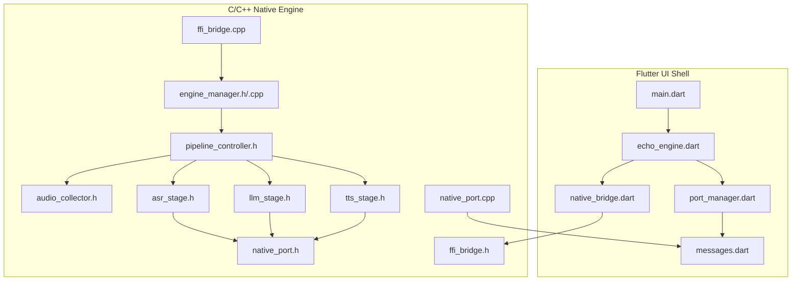
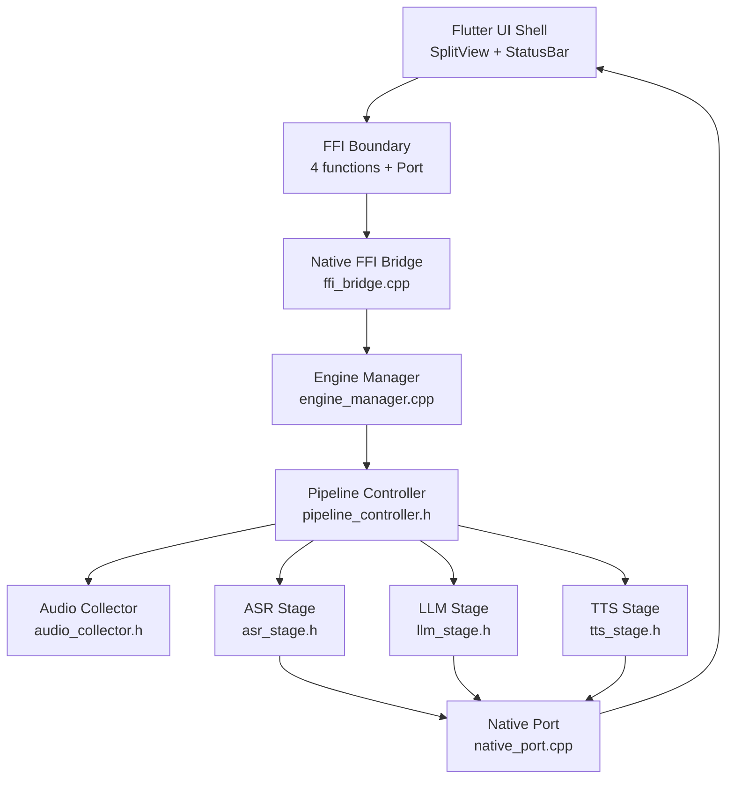
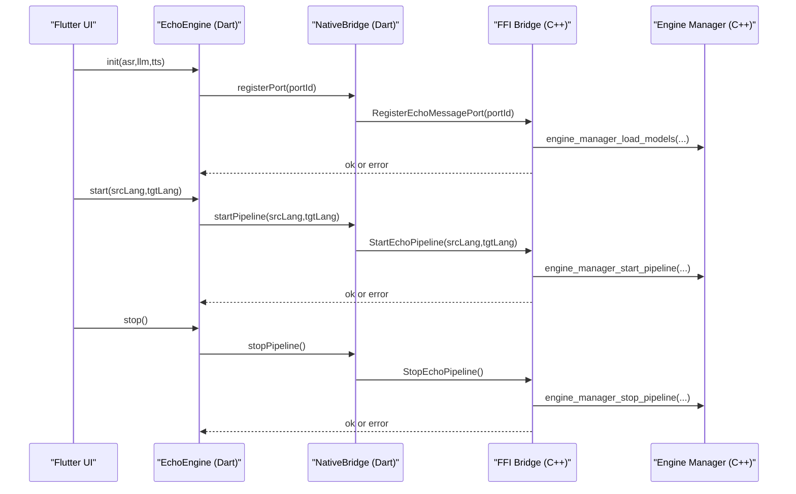
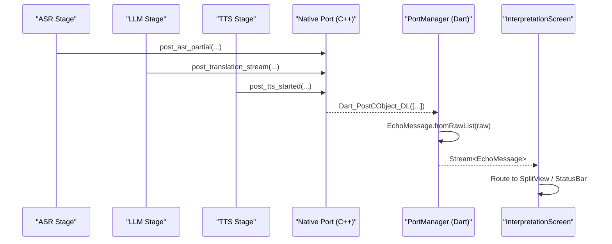
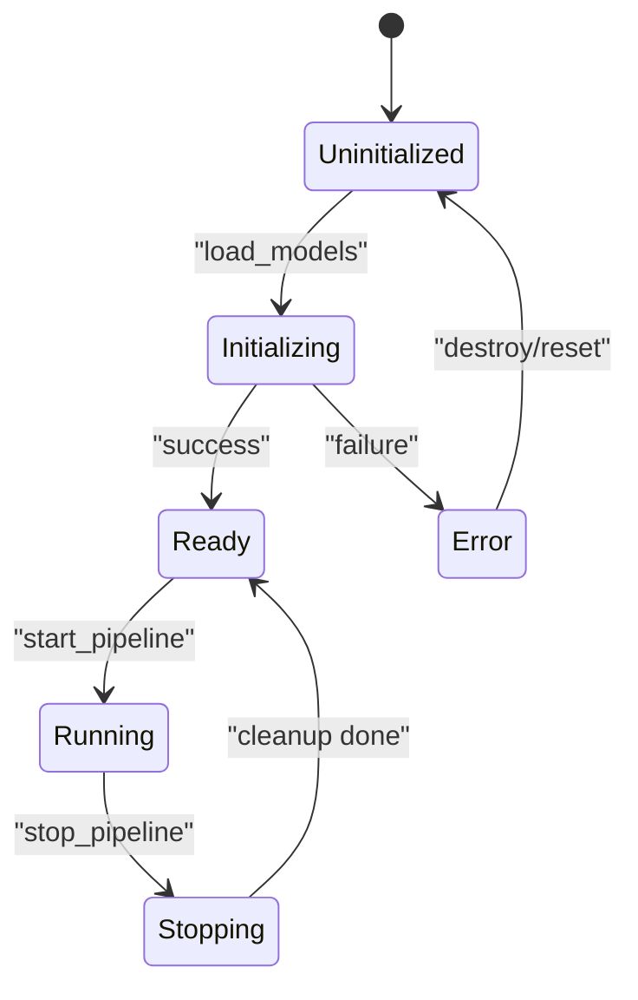
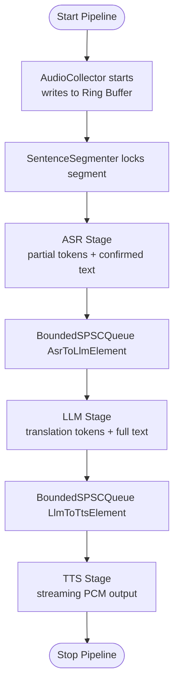
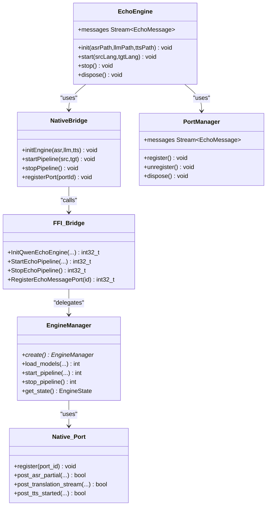
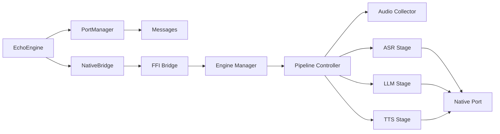

# System Design

<cite>
**Referenced Files in This Document**
- [README.md](file://README.md)
- [lib/qwen_echo.dart](file://lib/qwen_echo.dart)
- [lib/main.dart](file://lib/main.dart)
- [lib/src/echo_engine.dart](file://lib/src/echo_engine.dart)
- [lib/src/native_bridge.dart](file://lib/src/native_bridge.dart)
- [lib/src/port_manager.dart](file://lib/src/port_manager.dart)
- [lib/src/messages.dart](file://lib/src/messages.dart)
- [native/include/ffi_bridge.h](file://native/include/ffi_bridge.h)
- [native/src/ffi_bridge.cpp](file://native/src/ffi_bridge.cpp)
- [native/include/native_port.h](file://native/include/native_port.h)
- [native/src/native_port.cpp](file://native/src/native_port.cpp)
- [native/include/engine_manager.h](file://native/include/engine_manager.h)
- [native/src/engine_manager.cpp](file://native/src/engine_manager.cpp)
- [native/include/pipeline_controller.h](file://native/include/pipeline_controller.h)
- [native/include/audio_collector.h](file://native/include/audio_collector.h)
- [native/include/asr_stage.h](file://native/include/asr_stage.h)
- [native/include/llm_stage.h](file://native/include/llm_stage.h)
- [native/include/tts_stage.h](file://native/include/tts_stage.h)
</cite>

## Table of Contents
1. Introduction
2. Project Structure
3. Core Components
4. Architecture Overview
5. Detailed Component Analysis
6. Dependency Analysis
7. Performance Considerations
8. Troubleshooting Guide
9. Conclusion

## Introduction
QwenEcho is an on-device, air-gapped simultaneous interpretation application that runs three AI models entirely offline on mobile hardware. It provides real-time bilateral translation between two speakers by combining:
- A Flutter UI shell for presentation and user interaction
- A C/C++ native engine for high-performance audio capture, speech-to-text (ASR), large language model (LLM) translation, and text-to-speech (TTS) synthesis

The hybrid architecture separates concerns cleanly:
- Presentation layer (Flutter): UI rendering, message routing, and user controls
- Processing layer (Native): Real-time pipeline with lock-free queues, thermal/memory management, and platform abstraction

This design enables low-latency, cross-platform operation while maintaining zero-knowledge and offline-first guarantees.

## Project Structure
At a high level, the repository is organized into:
- lib/: Dart/Flutter code for the UI shell and FFI bindings
- native/: C/C++ engine including headers, implementations, HAL abstractions, and tests
- ios/, test/, and configuration files for build and packaging

**Diagram sources**
- [lib/main.dart:1-154](file://lib/main.dart#L1-L154)
- [lib/src/echo_engine.dart:1-108](file://lib/src/echo_engine.dart#L1-L108)
- [lib/src/native_bridge.dart:1-230](file://lib/src/native_bridge.dart#L1-L230)
- [lib/src/port_manager.dart:1-85](file://lib/src/port_manager.dart#L1-L85)
- [lib/src/messages.dart:1-336](file://lib/src/messages.dart#L1-L336)
- [native/include/ffi_bridge.h:1-84](file://native/include/ffi_bridge.h#L1-L84)
- [native/src/ffi_bridge.cpp:1-124](file://native/src/ffi_bridge.cpp#L1-L124)
- [native/include/engine_manager.h:1-104](file://native/include/engine_manager.h#L1-L104)
- [native/src/engine_manager.cpp:1-202](file://native/src/engine_manager.cpp#L1-L202)
- [native/include/pipeline_controller.h:1-107](file://native/include/pipeline_controller.h#L1-L107)
- [native/include/audio_collector.h:1-95](file://native/include/audio_collector.h#L1-L95)
- [native/include/asr_stage.h:1-104](file://native/include/asr_stage.h#L1-L104)
- [native/include/llm_stage.h:1-93](file://native/include/llm_stage.h#L1-L93)
- [native/include/tts_stage.h:1-79](file://native/include/tts_stage.h#L1-L79)
- [native/include/native_port.h:1-179](file://native/include/native_port.h#L1-L179)
- [native/src/native_port.cpp:1-320](file://native/src/native_port.cpp#L1-L320)

**Section sources**
- [README.md:15-93](file://README.md#L15-L93)

## Core Components
- Flutter-side facade: EchoEngine orchestrates lifecycle and exposes a typed message stream to the UI.
- Dart FFI bridge: Type-safe wrappers over four C-linkage entry points; throws structured exceptions on errors.
- Native Port manager: Creates a ReceivePort, registers it with the engine, and deserializes incoming lists into typed messages.
- Native FFI bridge: Minimal state holder delegating to Engine Manager and registering the port for async messaging.
- Engine Manager: Central coordinator implementing a strict lifecycle state machine and resource orchestration.
- Pipeline Controller: Orchestrates Audio Collector, Sentence Segmenter, ASR/LLM/TTS stages, and monitors.
- Stages: ASR, LLM, TTS each run on dedicated threads with bounded SPSC queues and SLA targets.
- Native Port: Serializes typed messages as Dart_CObject arrays and posts them via the registered Dart port.

Key responsibilities:
- Minimize Dart-to-native calls through a small, stable FFI surface
- Deliver asynchronous events from native to Flutter using typed messages
- Maintain clear separation between presentation and processing layers

**Section sources**
- [lib/src/echo_engine.dart:1-108](file://lib/src/echo_engine.dart#L1-L108)
- [lib/src/native_bridge.dart:1-230](file://lib/src/native_bridge.dart#L1-L230)
- [lib/src/port_manager.dart:1-85](file://lib/src/port_manager.dart#L1-L85)
- [lib/src/messages.dart:1-336](file://lib/src/messages.dart#L1-L336)
- [native/include/ffi_bridge.h:1-84](file://native/include/ffi_bridge.h#L1-L84)
- [native/src/ffi_bridge.cpp:1-124](file://native/src/ffi_bridge.cpp#L1-L124)
- [native/include/engine_manager.h:1-104](file://native/include/engine_manager.h#L1-L104)
- [native/src/engine_manager.cpp:1-202](file://native/src/engine_manager.cpp#L1-L202)
- [native/include/pipeline_controller.h:1-107](file://native/include/pipeline_controller.h#L1-L107)
- [native/include/asr_stage.h:1-104](file://native/include/asr_stage.h#L1-L104)
- [native/include/llm_stage.h:1-93](file://native/include/llm_stage.h#L1-L93)
- [native/include/tts_stage.h:1-79](file://native/include/tts_stage.h#L1-L79)
- [native/include/native_port.h:1-179](file://native/include/native_port.h#L1-L179)
- [native/src/native_port.cpp:1-320](file://native/src/native_port.cpp#L1-L320)

## Architecture Overview
The system follows a layered architecture:
- Flutter UI Shell: Renders split view, status bar, and routes messages to appropriate components
- FFI boundary: Four functions plus a registered Native Port for async events
- Native Engine: Lifecycle-managed pipeline with lock-free data structures and platform abstraction

**Diagram sources**
- [lib/main.dart:1-154](file://lib/main.dart#L1-L154)
- [native/include/ffi_bridge.h:1-84](file://native/include/ffi_bridge.h#L1-L84)
- [native/src/ffi_bridge.cpp:1-124](file://native/src/ffi_bridge.cpp#L1-L124)
- [native/include/engine_manager.h:1-104](file://native/include/engine_manager.h#L1-L104)
- [native/src/engine_manager.cpp:1-202](file://native/src/engine_manager.cpp#L1-L202)
- [native/include/pipeline_controller.h:1-107](file://native/include/pipeline_controller.h#L1-L107)
- [native/include/audio_collector.h:1-95](file://native/include/audio_collector.h#L1-L95)
- [native/include/asr_stage.h:1-104](file://native/include/asr_stage.h#L1-L104)
- [native/include/llm_stage.h:1-93](file://native/include/llm_stage.h#L1-L93)
- [native/include/tts_stage.h:1-79](file://native/include/tts_stage.h#L1-L79)
- [native/include/native_port.h:1-179](file://native/include/native_port.h#L1-L179)
- [native/src/native_port.cpp:1-320](file://native/src/native_port.cpp#L1-L320)

## Detailed Component Analysis

### FFI Interface Pattern (Four Functions)
The Dart-to-native boundary is intentionally minimal to reduce overhead:
- Initialize: Loads ASR, LLM, and TTS models
- Start: Begins the interpretation pipeline with source/target languages
- Stop: Gracefully stops the active session
- Register Port: Establishes the channel for async event delivery

Dart side wraps these with type-safe methods and throws structured exceptions on non-zero returns. The native side enforces preconditions (e.g., port must be registered before start/stop).

**Diagram sources**
- [lib/src/echo_engine.dart:60-98](file://lib/src/echo_engine.dart#L60-L98)
- [lib/src/native_bridge.dart:138-185](file://lib/src/native_bridge.dart#L138-L185)
- [native/include/ffi_bridge.h:30-77](file://native/include/ffi_bridge.h#L30-L77)
- [native/src/ffi_bridge.cpp:57-121](file://native/src/ffi_bridge.cpp#L57-L121)
- [native/include/engine_manager.h:53-81](file://native/include/engine_manager.h#L53-L81)
- [native/src/engine_manager.cpp:44-168](file://native/src/engine_manager.cpp#L44-L168)

**Section sources**
- [lib/src/native_bridge.dart:1-230](file://lib/src/native_bridge.dart#L1-L230)
- [native/include/ffi_bridge.h:1-84](file://native/include/ffi_bridge.h#L1-L84)
- [native/src/ffi_bridge.cpp:1-124](file://native/src/ffi_bridge.cpp#L1-L124)
- [native/include/engine_manager.h:1-104](file://native/include/engine_manager.h#L1-L104)
- [native/src/engine_manager.cpp:1-202](file://native/src/engine_manager.cpp#L1-L202)

### Message-Based Communication via Dart Ports
Asynchronous events flow from native to Flutter:
- Native Port serializes typed messages as Dart_CObject arrays
- Messages are posted to the registered Dart SendPort
- Flutter’s PortManager receives raw lists and deserializes them into strongly-typed EchoMessage subclasses
- UI subscribes to the broadcast stream and routes messages to SplitView and StatusBar

**Diagram sources**
- [native/include/native_port.h:100-172](file://native/include/native_port.h#L100-L172)
- [native/src/native_port.cpp:116-317](file://native/src/native_port.cpp#L116-L317)
- [lib/src/port_manager.dart:42-83](file://lib/src/port_manager.dart#L42-L83)
- [lib/src/messages.dart:14-33](file://lib/src/messages.dart#L14-L33)
- [lib/main.dart:67-105](file://lib/main.dart#L67-L105)

**Section sources**
- [native/include/native_port.h:1-179](file://native/include/native_port.h#L1-179)
- [native/src/native_port.cpp:1-320](file://native/src/native_port.cpp#L1-L320)
- [lib/src/port_manager.dart:1-85](file://lib/src/port_manager.dart#L1-L85)
- [lib/src/messages.dart:1-336](file://lib/src/messages.dart#L1-L336)
- [lib/main.dart:1-154](file://lib/main.dart#L1-L154)

### Engine Lifecycle State Machine
The native engine enforces a strict lifecycle:
- Uninitialized → Initializing → Ready → Running → Stopping → Ready
- Error transitions on failures during initialization
- Guards prevent invalid transitions (e.g., starting without being Ready)

**Diagram sources**
- [native/include/engine_manager.h:17-16](file://native/include/engine_manager.h#L17-L16)
- [native/src/engine_manager.cpp:44-168](file://native/src/engine_manager.cpp#L44-L168)

**Section sources**
- [native/include/engine_manager.h:1-104](file://native/include/engine_manager.h#L1-104)
- [native/src/engine_manager.cpp:1-202](file://native/src/engine_manager.cpp#L1-L202)

### Pipeline Orchestration and Data Flow
The Pipeline Controller coordinates:
- AudioCollector captures PCM and writes to a ring buffer
- SentenceSegmenter locks segments based on silence thresholds
- ASR stage streams partial tokens and enqueues confirmed text
- LLM stage translates with context windowing and cascading truncation
- TTS stage synthesizes streaming audio chunks

**Diagram sources**
- [native/include/pipeline_controller.h:1-107](file://native/include/pipeline_controller.h#L1-L107)
- [native/include/audio_collector.h:1-95](file://native/include/audio_collector.h#L1-L95)
- [native/include/asr_stage.h:1-104](file://native/include/asr_stage.h#L1-L104)
- [native/include/llm_stage.h:1-93](file://native/include/llm_stage.h#L1-L93)
- [native/include/tts_stage.h:1-79](file://native/include/tts_stage.h#L1-L79)

**Section sources**
- [native/include/pipeline_controller.h:1-107](file://native/include/pipeline_controller.h#L1-L107)
- [native/include/audio_collector.h:1-95](file://native/include/audio_collector.h#L1-L95)
- [native/include/asr_stage.h:1-104](file://native/include/asr_stage.h#L1-L104)
- [native/include/llm_stage.h:1-93](file://native/include/llm_stage.h#L1-L93)
- [native/include/tts_stage.h:1-79](file://native/include/tts_stage.h#L1-L79)

### Class Relationships (Code-Level View)

**Diagram sources**
- [lib/src/echo_engine.dart:37-107](file://lib/src/echo_engine.dart#L37-L107)
- [lib/src/native_bridge.dart:103-185](file://lib/src/native_bridge.dart#L103-L185)
- [lib/src/port_manager.dart:18-83](file://lib/src/port_manager.dart#L18-L83)
- [native/include/ffi_bridge.h:30-77](file://native/include/ffi_bridge.h#L30-L77)
- [native/include/engine_manager.h:37-97](file://native/include/engine_manager.h#L37-L97)
- [native/include/native_port.h:77-172](file://native/include/native_port.h#L77-L172)

**Section sources**
- [lib/src/echo_engine.dart:1-108](file://lib/src/echo_engine.dart#L1-L108)
- [lib/src/native_bridge.dart:1-230](file://lib/src/native_bridge.dart#L1-L230)
- [lib/src/port_manager.dart:1-85](file://lib/src/port_manager.dart#L1-L85)
- [native/include/ffi_bridge.h:1-84](file://native/include/ffi_bridge.h#L1-L84)
- [native/include/engine_manager.h:1-104](file://native/include/engine_manager.h#L1-L104)
- [native/include/native_port.h:1-179](file://native/include/native_port.h#L1-L179)

## Dependency Analysis
- Flutter depends on:
  - EchoEngine facade for lifecycle and message stream
  - NativeBridge for FFI calls
  - PortManager for receiving and parsing messages
  - Messages for typed message classes
- Native FFI bridge depends on:
  - Engine Manager for lifecycle and orchestration
  - Native Port for async messaging
- Engine Manager depends on:
  - Model Loader (not shown here) and Pipeline Controller
- Pipeline Controller depends on:
  - Audio Collector, ASR, LLM, TTS stages, and monitors

**Diagram sources**
- [lib/src/echo_engine.dart:1-108](file://lib/src/echo_engine.dart#L1-L108)
- [lib/src/native_bridge.dart:1-230](file://lib/src/native_bridge.dart#L1-L230)
- [lib/src/port_manager.dart:1-85](file://lib/src/port_manager.dart#L1-L85)
- [lib/src/messages.dart:1-336](file://lib/src/messages.dart#L1-L336)
- [native/include/ffi_bridge.h:1-84](file://native/include/ffi_bridge.h#L1-L84)
- [native/src/ffi_bridge.cpp:1-124](file://native/src/ffi_bridge.cpp#L1-L124)
- [native/include/engine_manager.h:1-104](file://native/include/engine_manager.h#L1-L104)
- [native/src/engine_manager.cpp:1-202](file://native/src/engine_manager.cpp#L1-L202)
- [native/include/pipeline_controller.h:1-107](file://native/include/pipeline_controller.h#L1-L107)
- [native/include/audio_collector.h:1-95](file://native/include/audio_collector.h#L1-L95)
- [native/include/asr_stage.h:1-104](file://native/include/asr_stage.h#L1-L104)
- [native/include/llm_stage.h:1-93](file://native/include/llm_stage.h#L1-L93)
- [native/include/tts_stage.h:1-79](file://native/include/tts_stage.h#L1-L79)
- [native/include/native_port.h:1-179](file://native/include/native_port.h#L1-L179)
- [native/src/native_port.cpp:1-320](file://native/src/native_port.cpp#L1-L320)

**Section sources**
- [README.md:41-93](file://README.md#L41-L93)

## Performance Considerations
- Lock-free SPSC ring buffers and bounded queues minimize contention across stages
- Cascade truncation allows downstream stages to begin before upstream completes
- Thermal state machine adapts performance (sample rate, context window) under heat constraints
- Platform abstraction isolates Android/iOS specifics for consistent behavior
- Strict SLA budgets per stage ensure real-time responsiveness

[No sources needed since this section provides general guidance]

## Troubleshooting Guide
Common issues and diagnostics:
- Initialization failures: Check model paths and permissions; verify ECHO_ERR_MODEL_MISSING or ECHO_ERR_MODEL_INVALID
- Starting pipeline without port: Ensure RegisterEchoMessagePort is called before StartEchoPipeline
- No messages received: Confirm port registration and that Post functions are set at runtime
- Thermal critical: Pipeline pauses until temperature drops below resume threshold
- Memory warnings: Release KV caches or stop pipeline when approaching limits
- Latency violations: Inspect stage-specific warnings and adjust thermal mode or context size

Error codes and messages are surfaced via:
- Structured exceptions on Dart side (non-zero return mapping)
- Typed ErrorMessage events on the message stream

**Section sources**
- [lib/src/native_bridge.dart:43-93](file://lib/src/native_bridge.dart#L43-L93)
- [native/include/ffi_bridge.h:30-77](file://native/include/ffi_bridge.h#L30-L77)
- [native/src/ffi_bridge.cpp:72-106](file://native/src/ffi_bridge.cpp#L72-L106)
- [native/include/native_port.h:142-172](file://native/include/native_port.h#L142-L172)
- [native/src/native_port.cpp:228-317](file://native/src/native_port.cpp#L228-L317)

## Conclusion
QwenEcho’s hybrid Flutter-native architecture achieves real-time performance and cross-platform compatibility by:
- Keeping the FFI surface minimal and well-defined
- Using a typed, message-based communication channel for asynchronous updates
- Enforcing a robust lifecycle state machine and graceful shutdown semantics
- Applying platform abstraction and offline-first principles for air-gapped deployment

This design cleanly separates presentation from processing, enabling maintainable, high-performance simultaneous interpretation on mobile devices.