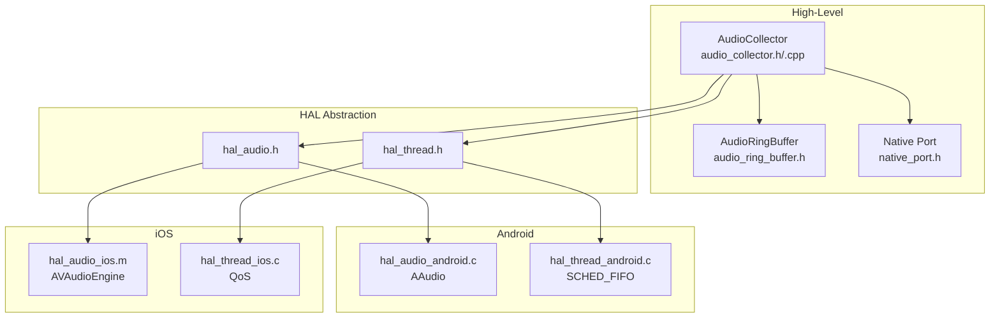
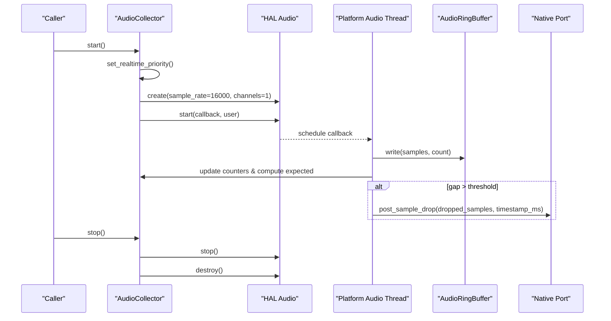
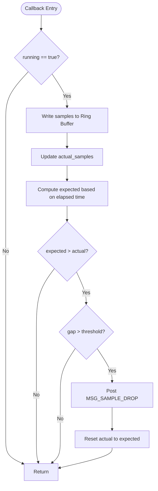
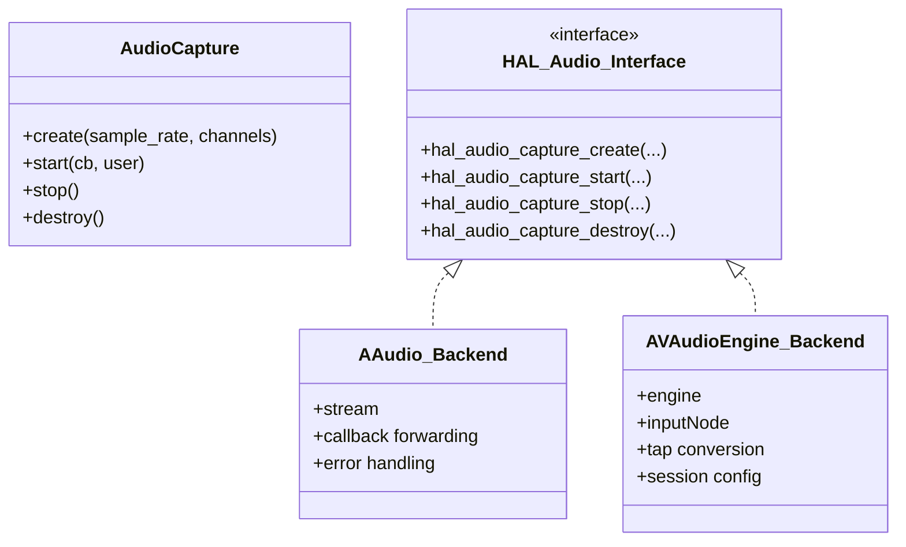
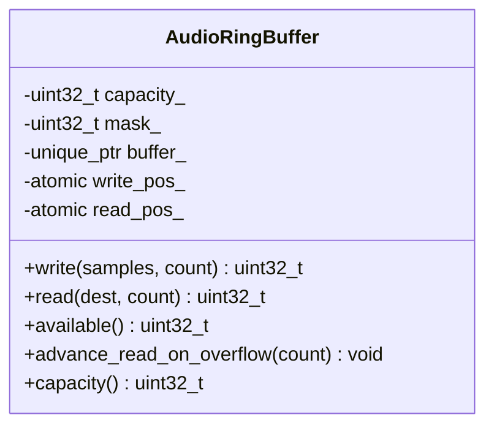
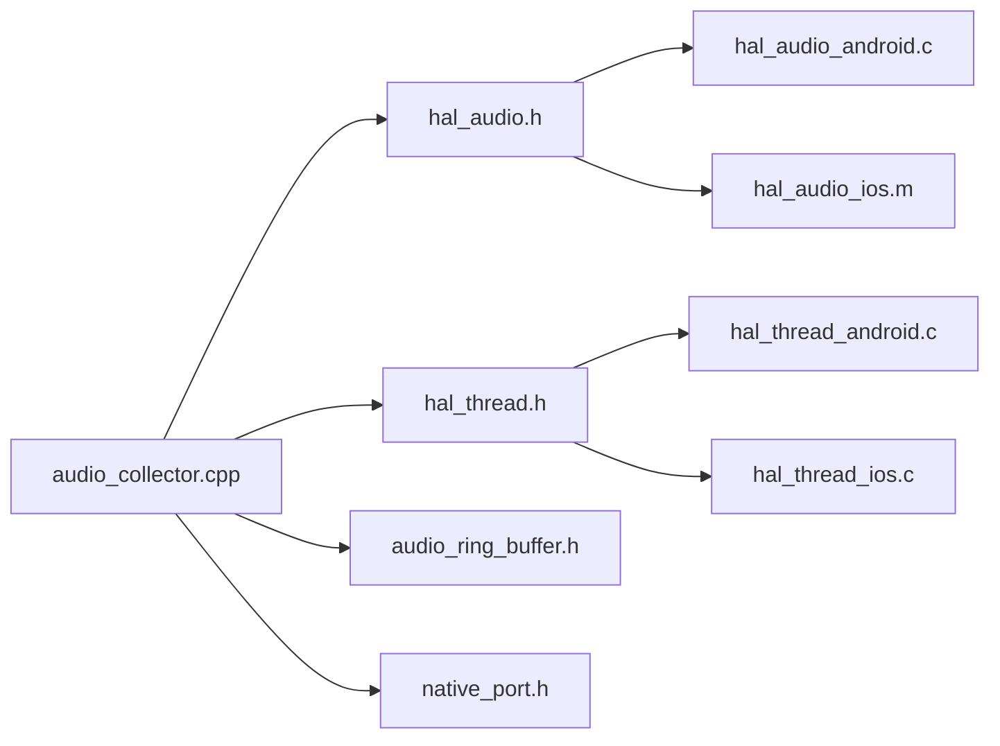

# Audio Collection and Capture

<cite>
**Referenced Files in This Document**
- [audio_collector.h](file://native/include/audio_collector.h)
- [audio_collector.cpp](file://native/src/audio_collector.cpp)
- [hal_audio.h](file://native/hal/hal_audio.h)
- [hal_audio_android.c](file://native/hal/android/hal_audio_android.c)
- [hal_audio_ios.m](file://native/hal/ios/hal_audio_ios.m)
- [hal_thread.h](file://native/hal/hal_thread.h)
- [hal_thread_android.c](file://native/hal/android/hal_thread_android.c)
- [hal_thread_ios.c](file://native/hal/ios/hal_thread_ios.c)
- [audio_ring_buffer.h](file://native/include/audio_ring_buffer.h)
- [native_port.h](file://native/include/native_port.h)
- [test_audio_collector.cpp](file://native/tests/test_audio_collector.cpp)
</cite>

## Table of Contents
1. [Introduction](#introduction)
2. [Project Structure](#project-structure)
3. [Core Components](#core-components)
4. [Architecture Overview](#architecture-overview)
5. [Detailed Component Analysis](#detailed-component-analysis)
6. [Dependency Analysis](#dependency-analysis)
7. [Performance Considerations](#performance-considerations)
8. [Troubleshooting Guide](#troubleshooting-guide)
9. [Conclusion](#conclusion)
10. [Appendices](#appendices)

## Introduction
This document explains QwenEcho’s platform-independent microphone capture system with a focus on the AudioCollector, its real-time priority thread implementation, and the HAL abstraction layer that unifies audio capture across Android and iOS. It details the 16kHz, 16-bit, mono audio format configuration, sample drop detection mechanisms, buffer synchronization strategies, error recovery patterns, and guidance for configuring parameters, handling interruptions, managing permissions, and optimizing latency.

## Project Structure
The audio subsystem is organized into:
- A high-level collector API (C/C++) that orchestrates capture lifecycle and ring buffer integration
- A platform HAL interface for audio capture and thread priority
- Platform-specific implementations for Android (AAudio) and iOS (AVAudioEngine)
- A lock-free SPSC ring buffer for producer-consumer synchronization
- A native port for messaging to the Flutter UI

**Diagram sources**
- [audio_collector.h:1-95](file://native/include/audio_collector.h#L1-L95)
- [audio_collector.cpp:1-245](file://native/src/audio_collector.cpp#L1-L245)
- [hal_audio.h:1-78](file://native/hal/hal_audio.h#L1-L78)
- [hal_thread.h:1-35](file://native/hal/hal_thread.h#L1-L35)
- [hal_audio_android.c:1-214](file://native/hal/android/hal_audio_android.c#L1-L214)
- [hal_audio_ios.m:1-297](file://native/hal/ios/hal_audio_ios.m#L1-L297)
- [hal_thread_android.c:1-106](file://native/hal/android/hal_thread_android.c#L1-L106)
- [hal_thread_ios.c:1-46](file://native/hal/ios/hal_thread_ios.c#L1-L46)
- [audio_ring_buffer.h:1-192](file://native/include/audio_ring_buffer.h#L1-L192)
- [native_port.h:1-179](file://native/include/native_port.h#L1-L179)

**Section sources**
- [audio_collector.h:1-95](file://native/include/audio_collector.h#L1-L95)
- [audio_collector.cpp:1-245](file://native/src/audio_collector.cpp#L1-L245)
- [hal_audio.h:1-78](file://native/hal/hal_audio.h#L1-L78)
- [hal_thread.h:1-35](file://native/hal/hal_thread.h#L1-L35)
- [hal_audio_android.c:1-214](file://native/hal/android/hal_audio_android.c#L1-L214)
- [hal_audio_ios.m:1-297](file://native/hal/ios/hal_audio_ios.m#L1-L297)
- [hal_thread_android.c:1-106](file://native/hal/android/hal_thread_android.c#L1-L106)
- [hal_thread_ios.c:1-46](file://native/hal/ios/hal_thread_ios.c#L1-L46)
- [audio_ring_buffer.h:1-192](file://native/include/audio_ring_buffer.h#L1-L192)
- [native_port.h:1-179](file://native/include/native_port.h#L1-L179)

## Core Components
- AudioCollector: Manages capture lifecycle, sets real-time priority, configures 16kHz/mono via HAL, writes samples to a lock-free ring buffer, and detects sample drops.
- HAL Audio Interface: Abstracts platform audio input; implemented by AAudio on Android and AVAudioEngine on iOS.
- HAL Thread Interface: Abstracts setting real-time scheduling priority per platform.
- AudioRingBuffer: Lock-free SPSC circular buffer with overwrite-on-overflow policy and cache-line separation to avoid false sharing.
- Native Port: Provides typed message posting to Dart, including sample drop notifications.

Key behaviors:
- Real-time priority elevation before starting capture.
- Callback-driven delivery from platform audio threads directly to the ring buffer.
- Expected vs actual sample counting to detect gaps exceeding a threshold.
- Safe stop/destroy semantics ensuring no further callbacks after stop.

**Section sources**
- [audio_collector.h:1-95](file://native/include/audio_collector.h#L1-L95)
- [audio_collector.cpp:1-245](file://native/src/audio_collector.cpp#L1-L245)
- [hal_audio.h:1-78](file://native/hal/hal_audio.h#L1-L78)
- [hal_thread.h:1-35](file://native/hal/hal_thread.h#L1-L35)
- [audio_ring_buffer.h:1-192](file://native/include/audio_ring_buffer.h#L1-L192)
- [native_port.h:1-179](file://native/include/native_port.h#L1-L179)

## Architecture Overview
The AudioCollector runs at elevated priority and delegates low-latency capture to the platform HAL. The HAL callback writes PCM data directly into the ring buffer without blocking. Drop detection compares expected samples (based on elapsed time) against actual received samples and posts a sample drop event when the gap exceeds the configured threshold.

**Diagram sources**
- [audio_collector.cpp:157-201](file://native/src/audio_collector.cpp#L157-L201)
- [hal_audio.h:43-71](file://native/hal/hal_audio.h#L43-L71)
- [hal_audio_android.c:101-175](file://native/hal/android/hal_audio_android.c#L101-L175)
- [hal_audio_ios.m:147-274](file://native/hal/ios/hal_audio_ios.m#L147-L274)
- [audio_ring_buffer.h:52-91](file://native/include/audio_ring_buffer.h#L52-L91)
- [native_port.h:169-172](file://native/include/native_port.h#L169-L172)

## Detailed Component Analysis

### AudioCollector Lifecycle and Real-Time Priority
- Creation: Accepts a non-owning pointer to the shared ring buffer. Initializes state and atomic counters.
- Start: Elevates current thread priority, creates the platform capture instance with 16kHz/mono, initializes counters and start time, marks running, then starts capture.
- Stop: Sets running flag false, stops and destroys the platform capture handle.
- Destroy: Ensures stop is called, frees internal memory.
- Running query: Returns the atomic running flag.

Real-time priority:
- Android: Uses SCHED_FIFO with fallbacks to lower priorities or SCHED_RR if higher priorities are denied.
- iOS: Uses QOS_CLASS_USER_INTERACTIVE via pthread QoS APIs.

Error codes:
- Negative return values indicate failures such as invalid arguments, already running, creation/start failures.

**Section sources**
- [audio_collector.h:48-88](file://native/include/audio_collector.h#L48-L88)
- [audio_collector.cpp:136-242](file://native/src/audio_collector.cpp#L136-L242)
- [hal_thread.h:17-28](file://native/hal/hal_thread.h#L17-L28)
- [hal_thread_android.c:48-103](file://native/hal/android/hal_thread_android.c#L48-L103)
- [hal_thread_ios.c:20-43](file://native/hal/ios/hal_thread_ios.c#L20-L43)

### Sample Drop Detection Mechanism
- Expected samples are computed from elapsed steady clock time multiplied by sample rate.
- Actual samples accumulate from each callback.
- If expected minus actual exceeds the threshold (160 samples = 10ms), a sample drop event is posted with dropped sample count and timestamp.
- After reporting, actual is reset to expected to avoid repeated reports for the same gap.

**Diagram sources**
- [audio_collector.cpp:93-128](file://native/src/audio_collector.cpp#L93-L128)
- [native_port.h:169-172](file://native/include/native_port.h#L169-L172)

**Section sources**
- [audio_collector.cpp:31-41](file://native/src/audio_collector.cpp#L31-L41)
- [audio_collector.cpp:109-127](file://native/src/audio_collector.cpp#L109-L127)
- [native_port.h:169-172](file://native/include/native_port.h#L169-L172)

### HAL Abstraction Layer
- hal_audio.h defines an opaque handle and functions to create, start, stop, and destroy audio capture instances. The callback signature delivers int16_t PCM samples and counts.
- Android backend uses AAudio with low-latency performance mode, exclusive sharing, and small buffer sizing. It logs stream parameters and handles errors via an error callback.
- iOS backend configures AVAudioSession for record+playback, requests preferred sample rate and minimal IO buffer duration, installs an input tap, converts float32 to int16, and starts the engine.

**Diagram sources**
- [hal_audio.h:19-71](file://native/hal/hal_audio.h#L19-L71)
- [hal_audio_android.c:26-83](file://native/hal/android/hal_audio_android.c#L26-L83)
- [hal_audio_ios.m:24-35](file://native/hal/ios/hal_audio_ios.m#L24-L35)

**Section sources**
- [hal_audio.h:1-78](file://native/hal/hal_audio.h#L1-L78)
- [hal_audio_android.c:86-175](file://native/hal/android/hal_audio_android.c#L86-L175)
- [hal_audio_ios.m:90-126](file://native/hal/ios/hal_audio_ios.m#L90-L126)
- [hal_audio_ios.m:147-274](file://native/hal/ios/hal_audio_ios.m#L147-L274)

### Ring Buffer Synchronization Strategy
- Power-of-two capacity enables efficient modulo via bitmask.
- Atomic head/tail positions with acquire/release ordering ensure visibility between producer and consumer.
- Cache-line alignment separates write_pos_ and read_pos_ to prevent false sharing.
- Overflow policy: overwrite oldest samples by advancing the read pointer; producer never blocks.

**Diagram sources**
- [audio_ring_buffer.h:27-189](file://native/include/audio_ring_buffer.h#L27-L189)

**Section sources**
- [audio_ring_buffer.h:10-26](file://native/include/audio_ring_buffer.h#L10-L26)
- [audio_ring_buffer.h:52-91](file://native/include/audio_ring_buffer.h#L52-L91)
- [audio_ring_buffer.h:101-132](file://native/include/audio_ring_buffer.h#L101-L132)
- [audio_ring_buffer.h:140-155](file://native/include/audio_ring_buffer.h#L140-L155)

### Platform-Specific Details

#### Android (AAudio)
- Stream builder configures direction, sample rate, channel count, format (PCM I16), low-latency performance mode, and exclusive sharing.
- Data callback forwards int16_t frames directly to the user callback.
- Error callback logs stream errors; production code may restart streams or switch devices.
- Buffer size tuned relative to burst size for balance between latency and glitch prevention.

**Section sources**
- [hal_audio_android.c:101-175](file://native/hal/android/hal_audio_android.c#L101-L175)
- [hal_audio_android.c:45-83](file://native/hal/android/hal_audio_android.c#L45-L83)

#### iOS (AVAudioEngine)
- Audio session configured for PlayAndRecord with options for speaker output and Bluetooth HFP.
- Preferred sample rate and minimal IO buffer duration requested; activation required.
- Input tap installed with hardware format; float32 samples converted to int16 with saturation clamping.
- Engine prepared and started; tap removed and engine stopped on cleanup.

**Section sources**
- [hal_audio_ios.m:42-86](file://native/hal/ios/hal_audio_ios.m#L42-L86)
- [hal_audio_ios.m:147-274](file://native/hal/ios/hal_audio_ios.m#L147-L274)

### Thread Priority Management
- Android: Attempts SCHED_FIFO with highest allowed priority; falls back to lower priority or SCHED_RR if denied.
- iOS: Sets QOS_CLASS_USER_INTERACTIVE for the calling thread.

**Section sources**
- [hal_thread_android.c:48-103](file://native/hal/android/hal_thread_android.c#L48-L103)
- [hal_thread_ios.c:20-43](file://native/hal/ios/hal_thread_ios.c#L20-L43)

### Configuration Examples and Usage Patterns
- Configure 16kHz, 16-bit, mono:
  - Create capture with sample_rate=16000, channels=1 via HAL.
  - Ensure ring buffer capacity is sized appropriately for latency and overflow tolerance.
- Start capture:
  - Call start to elevate priority, initialize counters, and begin callbacks.
- Handle interruptions:
  - On Android, monitor error callback for stream disconnections and restart as needed.
  - On iOS, handle session changes and reconfigure session if interrupted.
- Manage permissions:
  - Android: Request microphone permission at runtime prior to capture.
  - iOS: Add microphone usage description in Info.plist and request authorization before starting capture.
- Optimize latency:
  - Android: Use low-latency performance mode and small buffer sizes.
  - iOS: Set minimal IO buffer duration and use ~10ms tap buffers.

Note: These examples describe how to configure and operate the system using the documented APIs and platform specifics.

**Section sources**
- [hal_audio.h:36-57](file://native/hal/hal_audio.h#L36-L57)
- [hal_audio_android.c:118-161](file://native/hal/android/hal_audio_android.c#L118-L161)
- [hal_audio_ios.m:42-86](file://native/hal/ios/hal_audio_ios.m#L42-L86)
- [hal_audio_ios.m:188-200](file://native/hal/ios/hal_audio_ios.m#L188-L200)

### Error Recovery Patterns
- Start failure rollback:
  - If start fails after marking running, reset running flag and destroy capture handle.
- Stop safety:
  - Stop is idempotent; ignores calls when not running.
- Callback safety:
  - Callback checks running flag and returns early if capture has stopped.
- Platform error handling:
  - Android logs AAudio errors; production should implement restart logic.
  - iOS logs AVAudioEngine errors and removes taps on failure.

**Section sources**
- [audio_collector.cpp:189-201](file://native/src/audio_collector.cpp#L189-L201)
- [audio_collector.cpp:203-222](file://native/src/audio_collector.cpp#L203-L222)
- [hal_audio_android.c:70-83](file://native/hal/android/hal_audio_android.c#L70-L83)
- [hal_audio_ios.m:258-274](file://native/hal/ios/hal_audio_ios.m#L258-L274)

## Dependency Analysis
The following diagram shows key dependencies among components:

**Diagram sources**
- [audio_collector.cpp:16-20](file://native/src/audio_collector.cpp#L16-L20)
- [hal_audio.h:1-78](file://native/hal/hal_audio.h#L1-L78)
- [hal_thread.h:1-35](file://native/hal/hal_thread.h#L1-L35)
- [audio_ring_buffer.h:1-192](file://native/include/audio_ring_buffer.h#L1-L192)
- [native_port.h:1-179](file://native/include/native_port.h#L1-L179)
- [hal_audio_android.c:1-214](file://native/hal/android/hal_audio_android.c#L1-L214)
- [hal_audio_ios.m:1-297](file://native/hal/ios/hal_audio_ios.m#L1-L297)
- [hal_thread_android.c:1-106](file://native/hal/android/hal_thread_android.c#L1-L106)
- [hal_thread_ios.c:1-46](file://native/hal/ios/hal_thread_ios.c#L1-L46)

**Section sources**
- [audio_collector.cpp:16-20](file://native/src/audio_collector.cpp#L16-L20)
- [hal_audio.h:1-78](file://native/hal/hal_audio.h#L1-L78)
- [hal_thread.h:1-35](file://native/hal/hal_thread.h#L1-L35)
- [audio_ring_buffer.h:1-192](file://native/include/audio_ring_buffer.h#L1-L192)
- [native_port.h:1-179](file://native/include/native_port.h#L1-L179)

## Performance Considerations
- Real-time priority: Elevating thread priority reduces jitter and helps meet first-sample-in-ring-buffer timing requirements.
- Low-latency configuration:
  - Android: AAudio low-latency mode and exclusive sharing minimize buffering delays.
  - iOS: Small IO buffer duration and ~10ms tap buffers reduce latency.
- Lock-free ring buffer: Overwrite-on-overflow ensures the producer never blocks; consumer reads available samples efficiently.
- Memory operations: Avoid allocations in callbacks; use stack buffers where possible (as seen in iOS conversion path).
- Cache line separation: Prevents false sharing between write and read positions.

[No sources needed since this section provides general guidance]

## Troubleshooting Guide
Common issues and remedies:
- No audio captured:
  - Verify microphone permissions are granted on both platforms.
  - Ensure audio session is activated on iOS and AAudio stream opened on Android.
- High latency or glitches:
  - Reduce buffer sizes and ensure low-latency modes are enabled.
  - Confirm real-time priority was successfully set; check fallback behavior on Android.
- Frequent sample drops:
  - Investigate CPU contention and ensure the collector thread runs at elevated priority.
  - Monitor drop events and adjust ring buffer capacity if necessary.
- Interruptions:
  - Android: Restart stream on error callback; consider device switching.
  - iOS: Reconfigure session and restart engine after interruption.

**Section sources**
- [hal_audio_android.c:70-83](file://native/hal/android/hal_audio_android.c#L70-L83)
- [hal_audio_ios.m:258-274](file://native/hal/ios/hal_audio_ios.m#L258-L274)
- [audio_collector.cpp:116-127](file://native/src/audio_collector.cpp#L116-L127)

## Conclusion
QwenEcho’s audio collection system achieves low-latency, platform-independent microphone capture through a clear separation of concerns: a high-level collector manages lifecycle and monitoring, while the HAL abstracts platform specifics. The lock-free ring buffer and real-time priority management provide robust synchronization and performance. With proper configuration, permission handling, and error recovery, the system reliably captures 16kHz/16-bit/mono audio and reports sample drops for downstream processing.

[No sources needed since this section summarizes without analyzing specific files]

## Appendices

### Unit Test Highlights
- Validates correct configuration (16kHz, mono), real-time priority request, ring buffer writes, and lifecycle safety.
- Demonstrates callback invocation and accumulation behavior.

**Section sources**
- [test_audio_collector.cpp:163-178](file://native/tests/test_audio_collector.cpp#L163-L178)
- [test_audio_collector.cpp:197-228](file://native/tests/test_audio_collector.cpp#L197-L228)
- [test_audio_collector.cpp:253-270](file://native/tests/test_audio_collector.cpp#L253-L270)