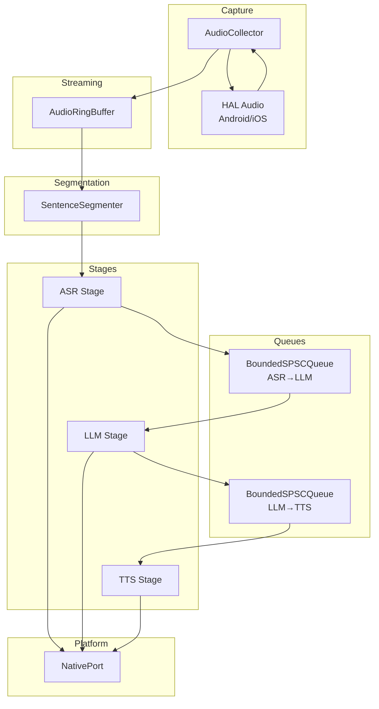
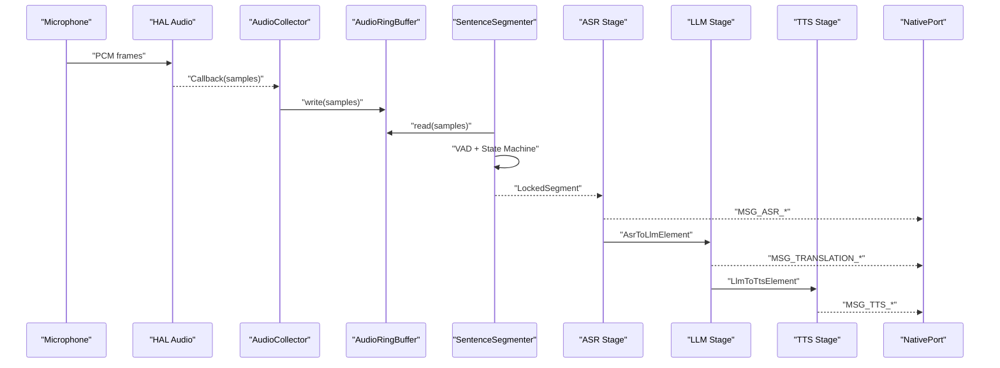
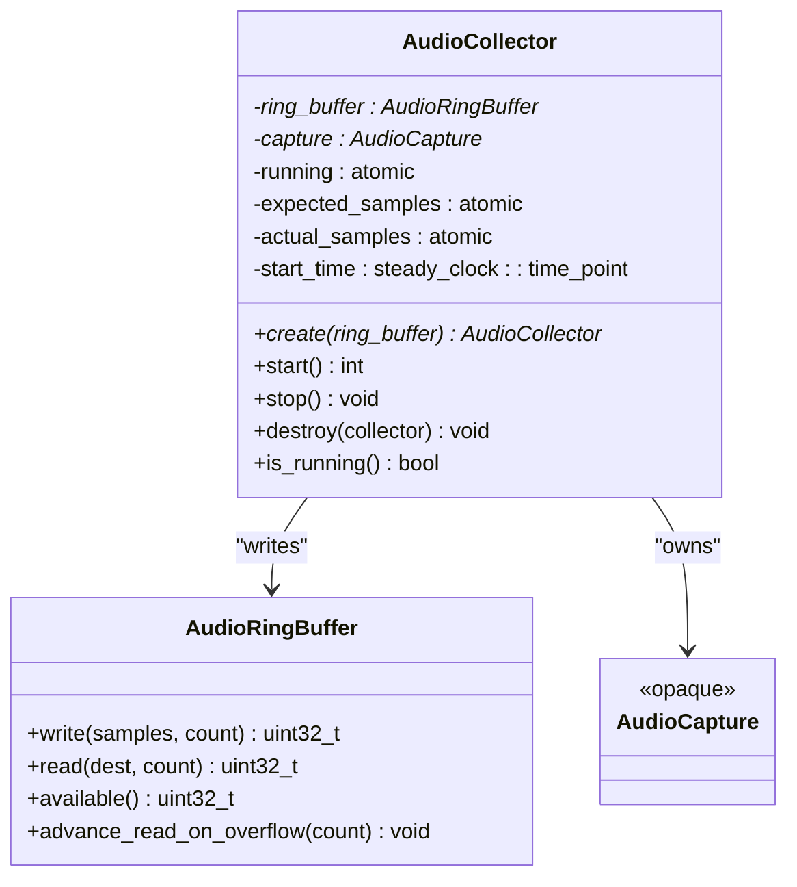
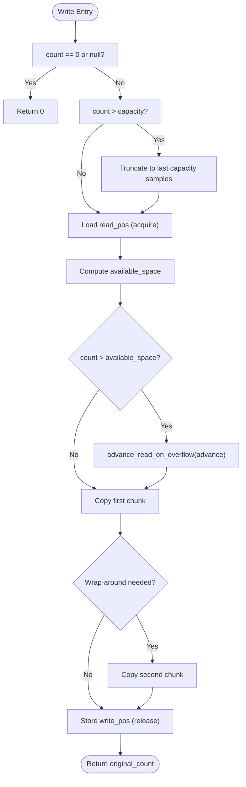
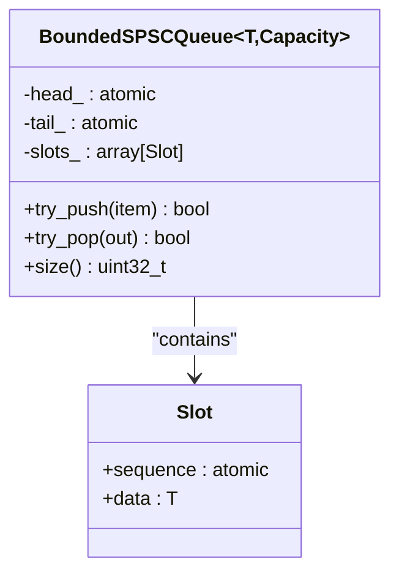
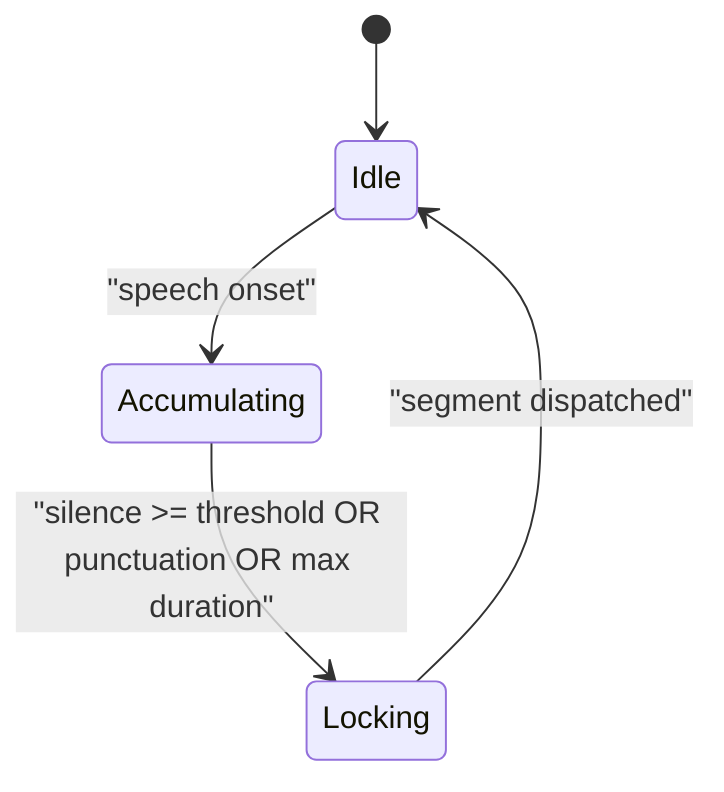
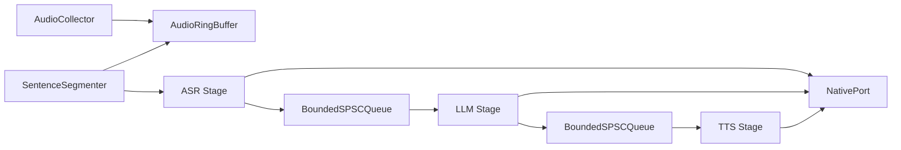

# Audio Processing Pipeline

<cite>
**Referenced Files in This Document**
- [audio_collector.h](file://native/include/audio_collector.h)
- [audio_collector.cpp](file://native/src/audio_collector.cpp)
- [hal_audio.h](file://native/hal/hal_audio.h)
- [hal_audio_android.c](file://native/hal/android/hal_audio_android.c)
- [hal_audio_ios.m](file://native/hal/ios/hal_audio_ios.m)
- [audio_ring_buffer.h](file://native/include/audio_ring_buffer.h)
- [bounded_spsc_queue.h](file://native/include/bounded_spsc_queue.h)
- [sentence_segmenter.h](file://native/include/sentence_segmenter.h)
- [sentence_segmenter.cpp](file://native/src/sentence_segmenter.cpp)
- [pipeline_controller.h](file://native/include/pipeline_controller.h)
- [pipeline_controller.cpp](file://native/src/pipeline_controller.cpp)
- [echo_types.h](file://native/include/echo_types.h)
- [native_port.h](file://native/include/native_port.h)
- [native_port.cpp](file://native/src/native_port.cpp)
- [hal_thread.h](file://native/hal/hal_thread.h)
</cite>

## Table of Contents
1. Introduction
2. Project Structure
3. Core Components
4. Architecture Overview
5. Detailed Component Analysis
6. Dependency Analysis
7. Performance Considerations
8. Troubleshooting Guide
9. Conclusion

## Introduction
This document explains QwenEcho’s real-time audio processing pipeline with a focus on live microphone capture, segmentation, and streaming between stages. It covers:
- Platform-independent microphone capture via AAudio (Android) and AVAudioEngine (iOS)
- Lock-free circular ring buffer for zero-contention audio streaming
- Voice activity detection and sentence boundary detection
- Bounded single-producer single-consumer queues for inter-stage communication
- Audio format handling, sample rate considerations, channel management, and synchronization strategies
- Configuration examples, interruption handling, and latency optimization techniques

## Project Structure
The audio pipeline is implemented in native C/C++ with platform-specific HAL backends:
- High-level orchestration: PipelineController wires components and manages lifecycle
- Capture: AudioCollector uses HAL to read PCM from the device microphone
- Streaming: AudioRingBuffer provides lock-free SPSC buffering between producer and consumer
- Segmentation: SentenceSegmenter performs VAD and sentence boundary detection
- Inter-stage transport: BoundedSPSCQueue carries ASR→LLM and LLM→TTS messages
- Platform integration: HAL implementations for Android (AAudio) and iOS (AVAudioEngine)
- Messaging: NativePort posts events to the Flutter UI layer



**Diagram sources**
- [pipeline_controller.cpp:107-126](file://native/src/pipeline_controller.cpp#L107-L126)
- [audio_collector.cpp:136-201](file://native/src/audio_collector.cpp#L136-L201)
- [audio_ring_buffer.h:27-189](file://native/include/audio_ring_buffer.h#L27-L189)
- [sentence_segmenter.cpp:206-330](file://native/src/sentence_segmenter.cpp#L206-L330)
- [bounded_spsc_queue.h:29-142](file://native/include/bounded_spsc_queue.h#L29-L142)
- [native_port.cpp:38-75](file://native/src/native_port.cpp#L38-L75)

**Section sources**
- [pipeline_controller.h:1-107](file://native/include/pipeline_controller.h#L1-L107)
- [pipeline_controller.cpp:272-393](file://native/src/pipeline_controller.cpp#L272-L393)

## Core Components
- AudioCollector: Captures PCM at 16 kHz, mono, 16-bit; writes to ring buffer; detects sample drops and reports via NativePort.
- AudioRingBuffer: Lock-free SPSC circular buffer with overwrite-on-overflow policy and cache-line separation to avoid false sharing.
- SentenceSegmenter: Energy-based VAD plus state machine for sentence locking; dispatches locked segments to ASR.
- BoundedSPSCQueue: Lock-free bounded queue with drop-oldest overflow semantics for ASR→LLM and LLM→TTS messaging.
- HAL Audio: Platform abstraction over AAudio (Android) and AVAudioEngine (iOS).
- NativePort: Typed message posting to Flutter UI.

**Section sources**
- [audio_collector.h:1-95](file://native/include/audio_collector.h#L1-L95)
- [audio_collector.cpp:1-245](file://native/src/audio_collector.cpp#L1-L245)
- [audio_ring_buffer.h:1-192](file://native/include/audio_ring_buffer.h#L1-L192)
- [bounded_spsc_queue.h:1-145](file://native/include/bounded_spsc_queue.h#L1-L145)
- [sentence_segmenter.h:1-142](file://native/include/sentence_segmenter.h#L1-L142)
- [sentence_segmenter.cpp:1-330](file://native/src/sentence_segmenter.cpp#L1-L330)
- [hal_audio.h:1-78](file://native/hal/hal_audio.h#L1-L78)
- [native_port.h:1-179](file://native/include/native_port.h#L1-L179)

## Architecture Overview
End-to-end flow:
- AudioCollector runs on a real-time thread, reads PCM from HAL, and writes into AudioRingBuffer.
- SentenceSegmenter consumes from the ring buffer, classifies frames as speech or silence, and locks segments when conditions are met.
- Locked segments are sent to ASR; confirmed text goes through BoundedSPSCQueue to LLM; translation tokens go through another queue to TTS.
- Events are posted to Flutter via NativePort.



**Diagram sources**
- [audio_collector.cpp:93-128](file://native/src/audio_collector.cpp#L93-L128)
- [audio_ring_buffer.h:52-132](file://native/include/audio_ring_buffer.h#L52-L132)
- [sentence_segmenter.cpp:251-294](file://native/src/sentence_segmenter.cpp#L251-L294)
- [native_port.cpp:116-154](file://native/src/native_port.cpp#L116-L154)

## Detailed Component Analysis

### AudioCollector and Platform HAL Integration
Responsibilities:
- Create and start platform audio capture at 16 kHz, mono, 16-bit.
- Run on elevated priority; callback writes directly to ring buffer without blocking.
- Detect sample drops by comparing expected vs actual samples and report via NativePort.

Platform specifics:
- Android: Uses AAudio with low-latency mode and exclusive sharing.
- iOS: Uses AVAudioEngine input tap; converts float32 to int16; requests low IO buffer duration.



**Diagram sources**
- [audio_collector.cpp:47-74](file://native/src/audio_collector.cpp#L47-L74)
- [audio_ring_buffer.h:27-189](file://native/include/audio_ring_buffer.h#L27-L189)
- [hal_audio.h:34-71](file://native/hal/hal_audio.h#L34-L71)

Key behaviors:
- Real-time priority elevation before starting capture.
- Callback must not allocate or block; only write to ring buffer and update atomics.
- Drop detection threshold configured to trigger MSG_SAMPLE_DROP when gap exceeds 10 ms.

Configuration example paths:
- Sample rate and channels: [audio_collector.cpp:31-41](file://native/src/audio_collector.cpp#L31-L41), [hal_audio.h:39-43](file://native/hal/hal_audio.h#L39-L43)
- Start/stop lifecycle: [audio_collector.cpp:157-222](file://native/src/audio_collector.cpp#L157-L222)

Interruption handling:
- Android error callback logs stream errors and can be extended to restart stream or switch devices.
- iOS removes tap and stops engine on stop; session configuration sets category for record+playback.

Latency tuning:
- Android: Low-latency performance mode, small buffer sizing relative to burst size.
- iOS: Preferred IO buffer duration set to ~5 ms; tap buffer sized for ~10 ms frames.

**Section sources**
- [audio_collector.h:1-95](file://native/include/audio_collector.h#L1-L95)
- [audio_collector.cpp:1-245](file://native/src/audio_collector.cpp#L1-L245)
- [hal_audio_android.c:101-175](file://native/hal/android/hal_audio_android.c#L101-L175)
- [hal_audio_ios.m:147-274](file://native/hal/ios/hal_audio_ios.m#L147-L274)
- [hal_thread.h:1-35](file://native/hal/hal_thread.h#L1-L35)

### Lock-Free Circular Ring Buffer (AudioRingBuffer)
Design highlights:
- Power-of-two capacity for fast modulo via bitmask.
- Atomic head/tail with acquire/release ordering; 64-byte alignment to prevent false sharing.
- Overwrite-oldest policy: producer advances read pointer when full to ensure non-blocking writes.

Operations:
- write(): Non-blocking; may advance read pointer to make room.
- read(): Returns up to requested samples if available.
- available(): Consumer-side query of unread samples.
- advance_read_on_overflow(): Producer-only helper during overflow.



**Diagram sources**
- [audio_ring_buffer.h:52-91](file://native/include/audio_ring_buffer.h#L52-L91)
- [audio_ring_buffer.h:152-155](file://native/include/audio_ring_buffer.h#L152-L155)

Synchronization strategy:
- Producer updates write_pos with release; consumer loads with acquire.
- Consumer updates read_pos with release; producer reads with acquire during overflow checks.
- Cache-line separation avoids false sharing between write_pos_ and read_pos_.

**Section sources**
- [audio_ring_buffer.h:1-192](file://native/include/audio_ring_buffer.h#L1-L192)

### Bounded SPSC Queue (Inter-Stage Transport)
Purpose:
- Carry AsrToLlmElement and LlmToTtsElement between stages with bounded capacity.
- Drop-oldest on overflow to keep upstream producers non-blocking.

Mechanism:
- Sequence numbers per slot indicate readiness for write/read.
- Head advanced by consumer; on overflow, producer attempts CAS to advance head and mark slot reusable.



**Diagram sources**
- [bounded_spsc_queue.h:29-142](file://native/include/bounded_spsc_queue.h#L29-L142)

Usage in pipeline:
- ASR produces AsrToLlmElement; LLM consumes and produces LlmToTtsElement; TTS consumes.

**Section sources**
- [bounded_spsc_queue.h:1-145](file://native/include/bounded_spsc_queue.h#L1-L145)
- [echo_types.h:68-86](file://native/include/echo_types.h#L68-L86)

### SentenceSegmenter (VAD + Boundary Detection)
Algorithm overview:
- Frame size: 10 ms (160 samples at 16 kHz).
- VAD: Mean absolute amplitude compared to energy threshold.
- State machine: Idle → Accumulating → Locking → Idle.
- Lock triggers:
  - Silence ≥ configured threshold after minimum speech duration
  - Punctuation notification from ASR
  - Force-lock after maximum segment duration if minimum speech met



**Diagram sources**
- [sentence_segmenter.h:34-38](file://native/include/sentence_segmenter.h#L34-L38)
- [sentence_segmenter.cpp:145-198](file://native/src/sentence_segmenter.cpp#L145-L198)

Processing details:
- feed_audio(): Buffers leftover samples across calls to maintain frame alignment.
- notify_punctuation(): Forces lock if sufficient speech accumulated.
- get_state(): Exposes current state for graceful flush logic.

**Section sources**
- [sentence_segmenter.h:1-142](file://native/include/sentence_segmenter.h#L1-L142)
- [sentence_segmenter.cpp:1-330](file://native/src/sentence_segmenter.cpp#L1-L330)

### Pipeline Controller Orchestration
Responsibilities:
- Create and wire all components: ring buffer, queues, collector, segmenter, stages, monitors.
- Start monitors and audio capture; mark pipeline running.
- Graceful stop: stop collector, wait for segmenter idle and queues drained within deadline, then destroy resources.

```mermaid
sequenceDiagram
participant App as "App"
participant PC as "PipelineController"
participant AC as "AudioCollector"
participant SS as "SentenceSegmenter"
participant Q1 as "ASR→LLM Queue"
participant Q2 as "LLM→TTS Queue"
App->>PC : "start(src_lang, tgt_lang)"
PC->>PC : "validate languages"
PC->>PC : "create ring buffer, queues, stages"
PC->>AC : "start()"
PC-->>App : "ECHO_OK"
App->>PC : "stop()"
PC->>AC : "stop()"
loop until deadline
PC->>SS : "get_state()"
PC->>Q1 : "size()"
PC->>Q2 : "size()"
alt idle & drained
break
else
sleep(poll interval)
end
end
PC->>PC : "destroy resources"
```

**Diagram sources**
- [pipeline_controller.cpp:272-393](file://native/src/pipeline_controller.cpp#L272-L393)
- [pipeline_controller.cpp:395-469](file://native/src/pipeline_controller.cpp#L395-L469)

**Section sources**
- [pipeline_controller.h:1-107](file://native/include/pipeline_controller.h#L1-L107)
- [pipeline_controller.cpp:1-488](file://native/src/pipeline_controller.cpp#L1-L488)

### Audio Format Handling, Sample Rate Conversion, Channel Management
- Capture format: 16 kHz, mono, 16-bit PCM.
- Android: AAudio configured for PCM_I16; callback delivers int16 directly.
- iOS: AVAudioEngine delivers float32; conversion to int16 performed in tap block; preferred sample rate requested; hardware resampling may occur depending on device capabilities.
- Channel management: Mono throughout pipeline; multi-channel would require downmixing before ring buffer.
- Sample rate conversion: Not performed in ring buffer; segmenter expects fixed frame size derived from sample rate. If hardware differs, conversion should be done in HAL or pre-processing stage.

References:
- [audio_collector.cpp:31-41](file://native/src/audio_collector.cpp#L31-L41)
- [hal_audio_android.c:119-137](file://native/hal/android/hal_audio_android.c#L119-L137)
- [hal_audio_ios.m:166-175](file://native/hal/ios/hal_audio_ios.m#L166-L175)
- [sentence_segmenter.cpp:214-216](file://native/src/sentence_segmenter.cpp#L214-L216)

**Section sources**
- [hal_audio.h:39-43](file://native/hal/hal_audio.h#L39-L43)
- [hal_audio_android.c:101-175](file://native/hal/android/hal_audio_android.c#L101-L175)
- [hal_audio_ios.m:147-274](file://native/hal/ios/hal_audio_ios.m#L147-L274)
- [sentence_segmenter.cpp:206-237](file://native/src/sentence_segmenter.cpp#L206-L237)

## Dependency Analysis
Component relationships:
- AudioCollector depends on HAL Audio and writes to AudioRingBuffer.
- SentenceSegmenter reads from AudioRingBuffer and sends LockedSegment to ASR.
- ASR→LLM and LLM→TTS use BoundedSPSCQueue typed elements.
- NativePort is used by stages to post events.



**Diagram sources**
- [pipeline_controller.cpp:107-126](file://native/src/pipeline_controller.cpp#L107-L126)
- [bounded_spsc_queue.h:29-142](file://native/include/bounded_spsc_queue.h#L29-L142)
- [echo_types.h:68-86](file://native/include/echo_types.h#L68-L86)

Coupling and cohesion:
- Tight coupling between AudioCollector and HAL via opaque handle; clean separation via hal_audio.h.
- Ring buffer is cohesive and self-contained; used only by collector and segmenter.
- Queues encapsulate concurrency primitives and overflow behavior.

Potential circular dependencies:
- None observed; data flows strictly forward through queues.

External dependencies:
- Android AAudio APIs
- iOS AVFoundation APIs
- Dart Native Port for UI messaging

**Section sources**
- [hal_audio.h:1-78](file://native/hal/hal_audio.h#L1-L78)
- [bounded_spsc_queue.h:1-145](file://native/include/bounded_spsc_queue.h#L1-L145)
- [native_port.h:1-179](file://native/include/native_port.h#L1-L179)

## Performance Considerations
- Latency targets: E2E budget includes ASR ≤200ms, LLM ≤450ms, TTS ≤100ms in normal mode; throttle mode extends total to ≤1200ms.
- Real-time priority: Elevate capture thread priority to reduce jitter.
- Buffer sizing:
  - Ring buffer capacity chosen to hold many seconds of audio while allowing overwrite policy.
  - Inter-stage queues sized to allow cascade truncation and overlapped execution.
- Avoid allocations in callbacks: Only lock-free writes and atomic updates.
- Cache line alignment: Prevents false sharing between head/tail indices.
- Monitoring: LatencyTracker and thermal/memory monitors adjust behavior under pressure.

[No sources needed since this section provides general guidance]

## Troubleshooting Guide
Common issues and remedies:
- No audio captured:
  - Verify HAL creation/start success codes and log outputs.
  - On Android, check AAudio open/start results; on iOS, verify session category and engine start.
- Glitches or dropouts:
  - Inspect MSG_SAMPLE_DROP events; increase ring buffer capacity or tune HAL buffer sizes.
- Stuttering or high latency:
  - Ensure real-time priority is applied; reduce downstream processing time; monitor latency warnings.
- Interruptions:
  - Handle Android error callback to restart stream or switch device.
  - On iOS, remove tap and stop engine cleanly; reconfigure session if needed.
- Memory pressure:
  - Critical memory level triggers graceful stop; consider reducing model context or enabling throttle mode.

Relevant code paths:
- Sample drop reporting: [audio_collector.cpp:116-127](file://native/src/audio_collector.cpp#L116-L127), [native_port.cpp:302-317](file://native/src/native_port.cpp#L302-L317)
- Android error callback: [hal_audio_android.c:70-82](file://native/hal/android/hal_audio_android.c#L70-L82)
- iOS engine start and tap setup: [hal_audio_ios.m:258-274](file://native/hal/ios/hal_audio_ios.m#L258-L274)
- Graceful stop polling: [pipeline_controller.cpp:427-448](file://native/src/pipeline_controller.cpp#L427-L448)

**Section sources**
- [audio_collector.cpp:116-127](file://native/src/audio_collector.cpp#L116-L127)
- [native_port.cpp:302-317](file://native/src/native_port.cpp#L302-L317)
- [hal_audio_android.c:70-82](file://native/hal/android/hal_audio_android.c#L70-L82)
- [hal_audio_ios.m:258-274](file://native/hal/ios/hal_audio_ios.m#L258-L274)
- [pipeline_controller.cpp:427-448](file://native/src/pipeline_controller.cpp#L427-L448)

## Conclusion
QwenEcho’s audio pipeline achieves low-latency, real-time speech capture and segmentation through:
- Platform-specific HAL integrations ensuring minimal overhead
- Lock-free ring buffer and bounded SPSC queues for contention-free streaming
- Robust VAD and sentence boundary detection
- Comprehensive monitoring and graceful shutdown mechanisms

These design choices collectively support responsive voice interactions across Android and iOS platforms.