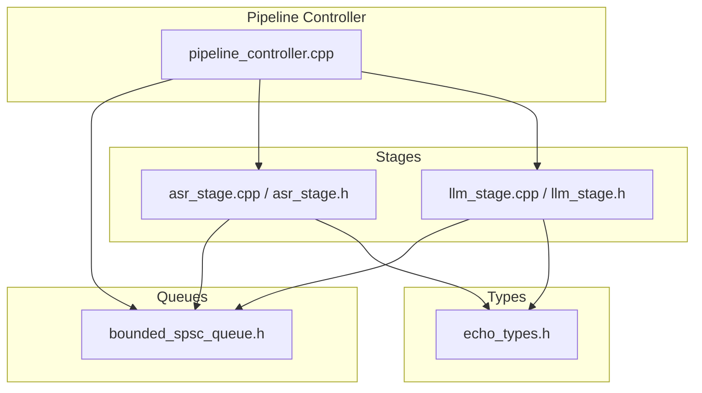
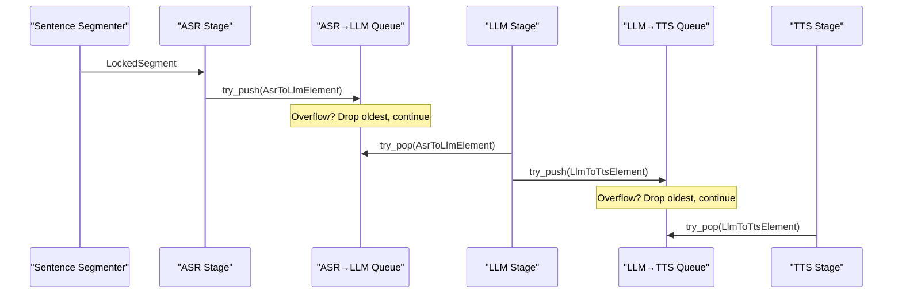
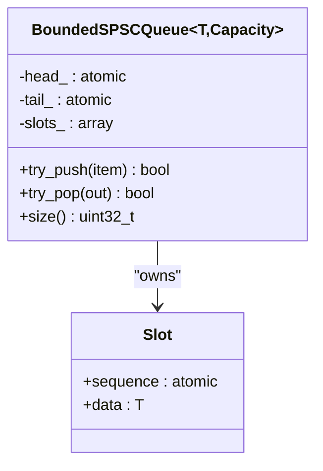
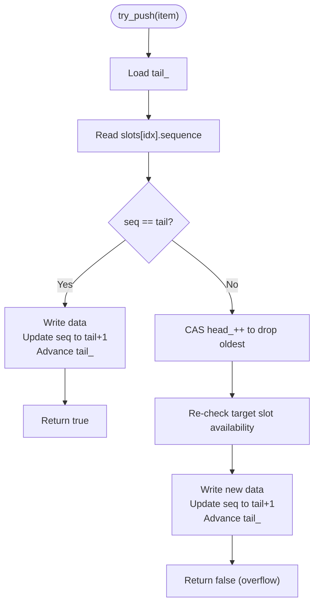
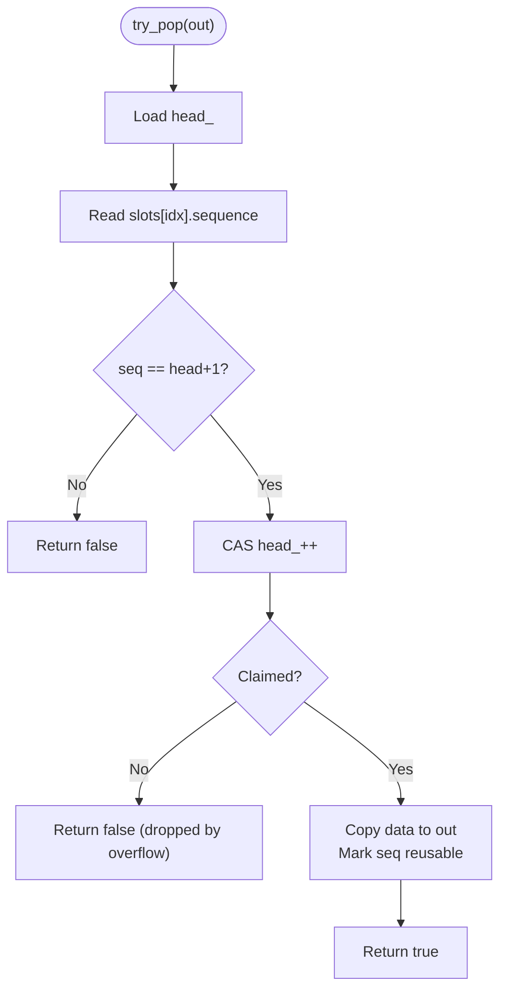
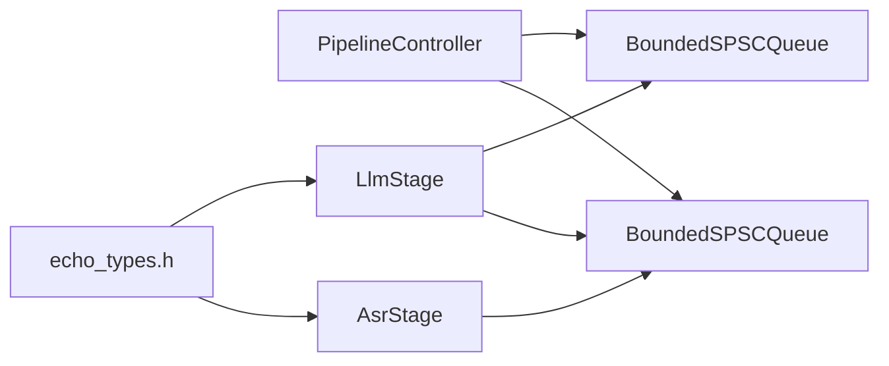

# Bounded SPSC Queues

<cite>
**Referenced Files in This Document**
- [bounded_spsc_queue.h](file://native/include/bounded_spsc_queue.h)
- [asr_stage.cpp](file://native/src/asr_stage.cpp)
- [llm_stage.cpp](file://native/src/llm_stage.cpp)
- [asr_stage.h](file://native/include/asr_stage.h)
- [llm_stage.h](file://native/include/llm_stage.h)
- [echo_types.h](file://native/include/echo_types.h)
- [pipeline_controller.cpp](file://native/src/pipeline_controller.cpp)
- [pipeline_controller.h](file://native/include/pipeline_controller.h)
</cite>

## Table of Contents
1. [Introduction](#introduction)
2. [Project Structure](#project-structure)
3. [Core Components](#core-components)
4. [Architecture Overview](#architecture-overview)
5. [Detailed Component Analysis](#detailed-component-analysis)
6. [Dependency Analysis](#dependency-analysis)
7. [Performance Considerations](#performance-considerations)
8. [Troubleshooting Guide](#troubleshooting-guide)
9. [Conclusion](#conclusion)
10. [Appendices](#appendices)

## Introduction
This document explains QwenEcho’s bounded single-producer single-consumer (SPSC) queue system used for inter-stage communication in the audio pipeline. It covers the lock-free queue implementation with fixed capacity bounds and backpressure via overflow-drop semantics, the data structures that flow between stages (AsrToLlmElement and LlmToTtsElement), lifecycle management, memory allocation strategies, overflow handling, configuration examples, monitoring queue depths, cleanup procedures, thread-safety guarantees, performance characteristics, and debugging approaches for queue-related bottlenecks.

## Project Structure
The queue is implemented as a header-only template and consumed by the ASR and LLM processing stages. The pipeline controller wires these components together and manages their lifecycle.

**Diagram sources**
- [pipeline_controller.cpp:304-353](file://native/src/pipeline_controller.cpp#L304-L353)
- [bounded_spsc_queue.h:1-145](file://native/include/bounded_spsc_queue.h#L1-L145)
- [asr_stage.cpp:1-341](file://native/src/asr_stage.cpp#L1-L341)
- [llm_stage.cpp:1-412](file://native/src/llm_stage.cpp#L1-L412)
- [echo_types.h:64-86](file://native/include/echo_types.h#L64-L86)

**Section sources**
- [pipeline_controller.cpp:304-353](file://native/src/pipeline_controller.cpp#L304-L353)
- [bounded_spsc_queue.h:1-145](file://native/include/bounded_spsc_queue.h#L1-L145)
- [asr_stage.h:48-53](file://native/include/asr_stage.h#L48-L53)
- [llm_stage.h:56-62](file://native/include/llm_stage.h#L56-L62)
- [echo_types.h:64-86](file://native/include/echo_types.h#L64-L86)

## Core Components
- BoundedSPSCQueue<T, Capacity>: A lock-free, power-of-two sized ring buffer using sequence numbers per slot to coordinate producer/consumer without locks. Overflow behavior drops the oldest element and continues; it never blocks.
- AsrToLlmElement: Produced by ASR stage on confirmed text; consumed by LLM stage.
- LlmToTtsElement: Produced by LLM stage on translated text fragments; consumed by TTS stage.

Key behaviors:
- try_push(item): non-blocking; returns true if normal push, false if overflow occurred (oldest dropped).
- try_pop(out): non-blocking; returns true if an item was dequeued, false if empty.
- size(): approximate current number of items (0..Capacity).

Memory layout and alignment:
- head_ and tail_ are aligned to separate cache lines to avoid false sharing.
- Each slot contains an atomic sequence counter and the payload.

Concurrency model:
- Producer exclusively writes tail_.
- Consumer advances head_ via CAS.
- On overflow, producer may also advance head_ via CAS to discard the oldest element before writing.

**Section sources**
- [bounded_spsc_queue.h:8-28](file://native/include/bounded_spsc_queue.h#L8-L28)
- [bounded_spsc_queue.h:29-39](file://native/include/bounded_spsc_queue.h#L29-L39)
- [bounded_spsc_queue.h:51-85](file://native/include/bounded_spsc_queue.h#L51-L85)
- [bounded_spsc_queue.h:93-116](file://native/include/bounded_spsc_queue.h#L93-L116)
- [bounded_spsc_queue.h:123-128](file://native/include/bounded_spsc_queue.h#L123-L128)
- [echo_types.h:64-86](file://native/include/echo_types.h#L64-L86)

## Architecture Overview
The pipeline uses two bounded SPSC queues:
- ASR→LLM queue carries AsrToLlmElement from ASR to LLM.
- LLM→TTS queue carries LlmToTtsElement from LLM to TTS.

The pipeline controller creates and wires these queues at startup and drains them during graceful stop.

**Diagram sources**
- [pipeline_controller.cpp:304-353](file://native/src/pipeline_controller.cpp#L304-L353)
- [asr_stage.cpp:254-270](file://native/src/asr_stage.cpp#L254-L270)
- [llm_stage.cpp:243-252](file://native/src/llm_stage.cpp#L243-L252)
- [llm_stage.cpp:218-237](file://native/src/llm_stage.cpp#L218-L237)

**Section sources**
- [pipeline_controller.cpp:304-353](file://native/src/pipeline_controller.cpp#L304-L353)
- [asr_stage.cpp:254-270](file://native/src/asr_stage.cpp#L254-L270)
- [llm_stage.cpp:243-252](file://native/src/llm_stage.cpp#L243-L252)
- [llm_stage.cpp:218-237](file://native/src/llm_stage.cpp#L218-L237)

## Detailed Component Analysis

### BoundedSPSCQueue Implementation
Design highlights:
- Fixed capacity must be a power of two; bitmask indexing avoids modulo.
- Slot-based storage with per-slot sequence numbers indicating readiness for write/read.
- Non-blocking operations with overflow-drop semantics.
- Atomic ordering ensures visibility across threads without locks.

**Diagram sources**
- [bounded_spsc_queue.h:29-39](file://native/include/bounded_spsc_queue.h#L29-L39)
- [bounded_spsc_queue.h:131-142](file://native/include/bounded_spsc_queue.h#L131-L142)

Overflow and backpressure algorithm:

**Diagram sources**
- [bounded_spsc_queue.h:51-85](file://native/include/bounded_spsc_queue.h#L51-L85)

Consumer pop logic:

**Diagram sources**
- [bounded_spsc_queue.h:93-116](file://native/include/bounded_spsc_queue.h#L93-L116)

Thread-safety guarantees:
- One producer, one consumer per queue instance.
- No locks inside queue methods; relies on atomics and compare-exchange.
- Memory ordering ensures proper synchronization of data visibility.

**Section sources**
- [bounded_spsc_queue.h:8-28](file://native/include/bounded_spsc_queue.h#L8-L28)
- [bounded_spsc_queue.h:51-85](file://native/include/bounded_spsc_queue.h#L51-L85)
- [bounded_spsc_queue.h:93-116](file://native/include/bounded_spsc_queue.h#L93-L116)
- [bounded_spsc_queue.h:123-128](file://native/include/bounded_spsc_queue.h#L123-L128)

### Data Structures Flowing Through Queues
- AsrToLlmElement: Contains segment metadata and confirmed UTF-8 text with length and timestamp.
- LlmToTtsElement: Contains segment metadata and translated UTF-8 text with length and timestamp.

These structs are copied into queue slots and passed between stages.

**Section sources**
- [echo_types.h:64-86](file://native/include/echo_types.h#L64-L86)

### ASR Stage Integration
Responsibilities:
- Receives locked segments, optionally resamples under throttle mode, runs inference, streams partials, finalizes confirmed text, and enqueues AsrToLlmElement into the ASR→LLM queue.

Queue usage:
- Produces elements via try_push; overflow results in dropping the oldest element while continuing to accept new ones.

Lifecycle:
- Created with output queue pointer; worker thread processes segments; destroyed by signaling stop and joining thread.

**Section sources**
- [asr_stage.h:48-53](file://native/include/asr_stage.h#L48-L53)
- [asr_stage.cpp:254-270](file://native/src/asr_stage.cpp#L254-L270)
- [asr_stage.cpp:277-293](file://native/src/asr_stage.cpp#L277-L293)
- [asr_stage.cpp:325-338](file://native/src/asr_stage.cpp#L325-L338)

### LLM Stage Integration
Responsibilities:
- Polls ASR→LLM queue for confirmed text, builds context window, translates tokens, streams translation tokens, and enqueues LlmToTtsElement into the LLM→TTS queue at punctuation boundaries or at completion.

Queue usage:
- Consumes AsrToLlmElement via try_pop; produces LlmToTtsElement via try_push; both are non-blocking.

Lifecycle:
- Created with input/output queue pointers; worker thread polls and processes; destroyed by signaling stop and joining thread.

**Section sources**
- [llm_stage.h:56-62](file://native/include/llm_stage.h#L56-L62)
- [llm_stage.cpp:243-252](file://native/src/llm_stage.cpp#L243-L252)
- [llm_stage.cpp:218-237](file://native/src/llm_stage.cpp#L218-L237)
- [llm_stage.cpp:367-388](file://native/src/llm_stage.cpp#L367-L388)
- [llm_stage.cpp:397-409](file://native/src/llm_stage.cpp#L397-L409)

### Pipeline Controller Lifecycle and Cleanup
Creation and wiring:
- Creates ring buffer, two bounded SPSC queues (default capacity 64), stages, monitors, and starts them.

Graceful stop:
- Stops audio collector, waits for segmenter idle and queues drained (polling size()), then destroys all resources including queues.

Cleanup order:
- Destroys stages in reverse order, then queues, ring buffer, and accelerator.

**Section sources**
- [pipeline_controller.cpp:304-353](file://native/src/pipeline_controller.cpp#L304-L353)
- [pipeline_controller.cpp:395-469](file://native/src/pipeline_controller.cpp#L395-L469)
- [pipeline_controller.cpp:182-244](file://native/src/pipeline_controller.cpp#L182-L244)

## Dependency Analysis
Component relationships:
- PipelineController depends on BoundedSPSCQueue and orchestrates stage creation.
- ASRStage depends on BoundedSPSCQueue<AsrToLlmElement>.
- LLMStage depends on BoundedSPSCQueue<AsrToLlmElement> and BoundedSPSCQueue<LlmToTtsElement>.
- All stages depend on echo_types.h for shared data structures.

**Diagram sources**
- [pipeline_controller.cpp:304-353](file://native/src/pipeline_controller.cpp#L304-L353)
- [asr_stage.cpp:254-270](file://native/src/asr_stage.cpp#L254-L270)
- [llm_stage.cpp:243-252](file://native/src/llm_stage.cpp#L243-L252)
- [llm_stage.cpp:218-237](file://native/src/llm_stage.cpp#L218-L237)
- [echo_types.h:64-86](file://native/include/echo_types.h#L64-L86)

**Section sources**
- [pipeline_controller.cpp:304-353](file://native/src/pipeline_controller.cpp#L304-L353)
- [asr_stage.cpp:254-270](file://native/src/asr_stage.cpp#L254-L270)
- [llm_stage.cpp:243-252](file://native/src/llm_stage.cpp#L243-L252)
- [llm_stage.cpp:218-237](file://native/src/llm_stage.cpp#L218-L237)
- [echo_types.h:64-86](file://native/include/echo_types.h#L64-L86)

## Performance Considerations
- Lock-free design eliminates contention overhead for single-producer/single-consumer pairs.
- Power-of-two capacity enables fast index computation via bitwise AND.
- Cache-line alignment of head_ and tail_ reduces false sharing.
- Overflow-drop semantics ensure producers never block; consumers see the most recent data when older items are dropped.
- Approximate size() provides lightweight monitoring without blocking.

[No sources needed since this section provides general guidance]

## Troubleshooting Guide
Common issues and diagnostics:
- Monitor queue depth: Use size() on both queues to detect backpressure buildup.
- Detect overflow events: In production code paths, track return values of try_push where applicable to count overflow occurrences.
- Graceful drain verification: During stop, poll size() until both queues report zero and the segmenter is idle.
- Latency warnings: Stages report SLA violations via native port messages; correlate with queue depths to identify bottlenecks.

Operational tips:
- If ASR→LLM queue frequently overflows, consider increasing capacity or improving LLM throughput.
- If LLM→TTS queue overflows, consider increasing capacity or optimizing TTS consumption.
- Ensure thermal throttling is not causing disproportionate slowdowns downstream.

**Section sources**
- [pipeline_controller.cpp:427-448](file://native/src/pipeline_controller.cpp#L427-L448)
- [asr_stage.cpp:232-242](file://native/src/asr_stage.cpp#L232-L242)
- [llm_stage.cpp:305-317](file://native/src/llm_stage.cpp#L305-L317)

## Conclusion
QwenEcho’s bounded SPSC queues provide a high-performance, lock-free mechanism for inter-stage communication with predictable overflow behavior. The design ensures non-blocking operation, minimal contention, and clear lifecycle management through the pipeline controller. By monitoring queue sizes and understanding overflow semantics, developers can tune capacities and diagnose bottlenecks effectively.

[No sources needed since this section summarizes without analyzing specific files]

## Appendices

### Configuration Examples
- Default queue capacity: 64 for both ASR→LLM and LLM→TTS queues.
- To configure different capacities, instantiate BoundedSPSCQueue with a custom template parameter and pass those instances to stage constructors.

Example references:
- Default capacity instantiation in pipeline controller.
- Stage constructors accepting queue pointers.

**Section sources**
- [pipeline_controller.cpp:304-315](file://native/src/pipeline_controller.cpp#L304-L315)
- [asr_stage.h:48-53](file://native/include/asr_stage.h#L48-L53)
- [llm_stage.h:56-62](file://native/include/llm_stage.h#L56-L62)

### Monitoring Queue Depths
- Use size() on each queue to obtain approximate current occupancy.
- Integrate monitoring into telemetry or logs to observe trends and spikes.

**Section sources**
- [bounded_spsc_queue.h:123-128](file://native/include/bounded_spsc_queue.h#L123-L128)
- [pipeline_controller.cpp:427-448](file://native/src/pipeline_controller.cpp#L427-L448)

### Cleanup Procedures
- Stop pipeline: signal collectors to stop, wait for segmenter idle and queues drained, destroy stages, queues, ring buffer, and accelerator.
- Ensure workers are joined before destruction to avoid use-after-free.

**Section sources**
- [pipeline_controller.cpp:395-469](file://native/src/pipeline_controller.cpp#L395-L469)
- [asr_stage.cpp:325-338](file://native/src/asr_stage.cpp#L325-L338)
- [llm_stage.cpp:397-409](file://native/src/llm_stage.cpp#L397-L409)