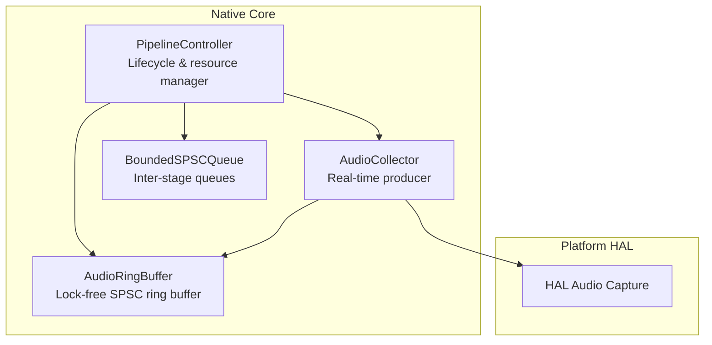
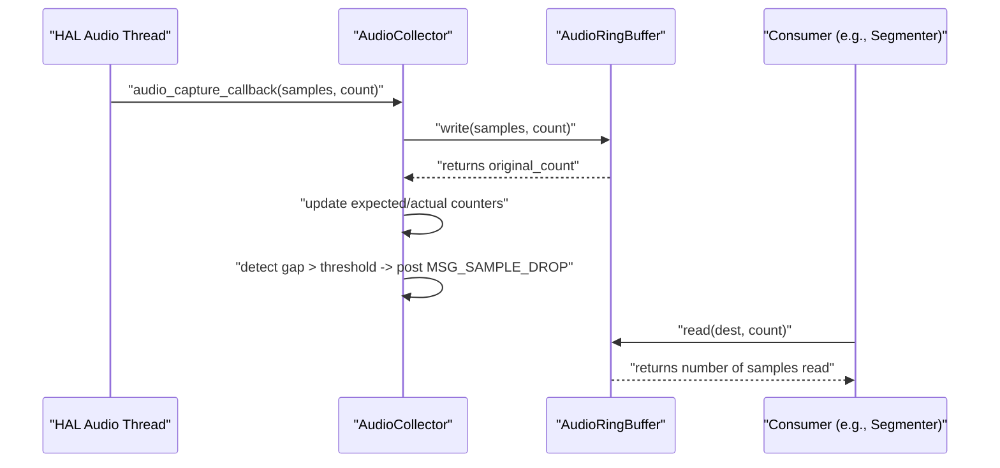
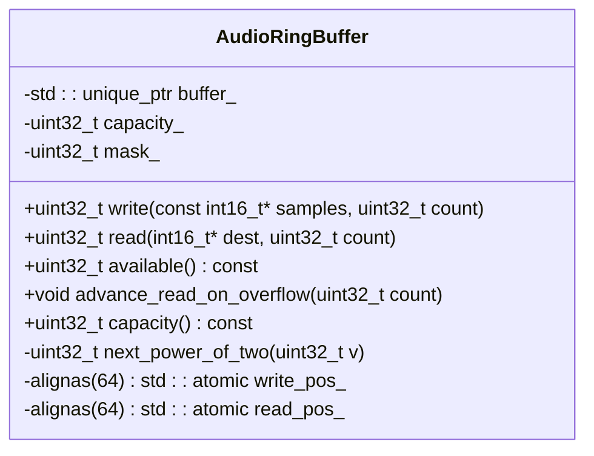
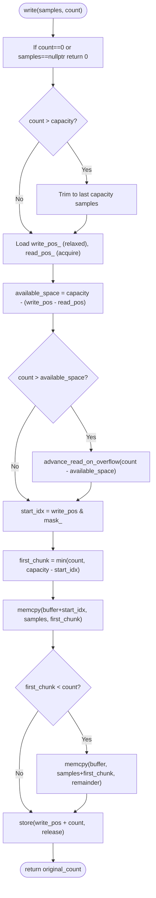
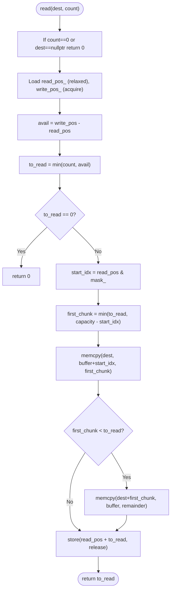
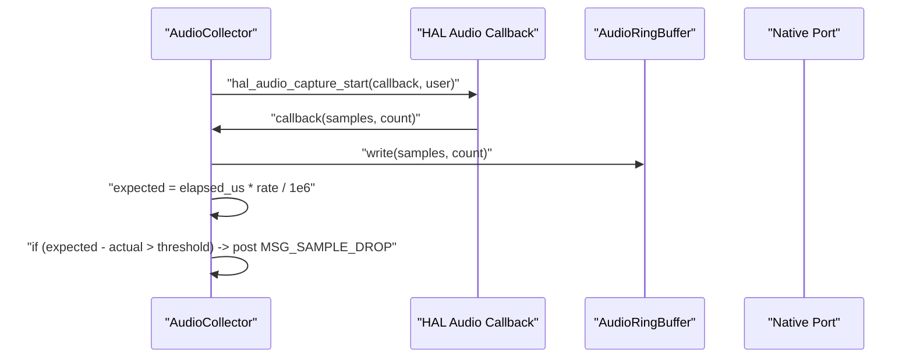
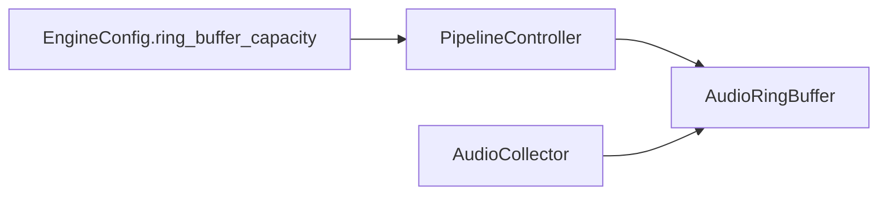

# Lock-free Ring Buffer

<cite>
**Referenced Files in This Document**
- [audio_ring_buffer.h](file://native/include/audio_ring_buffer.h)
- [bounded_spsc_queue.h](file://native/include/bounded_spsc_queue.h)
- [audio_collector.cpp](file://native/src/audio_collector.cpp)
- [audio_collector.h](file://native/include/audio_collector.h)
- [pipeline_controller.cpp](file://native/src/pipeline_controller.cpp)
- [echo_types.h](file://native/include/echo_types.h)
- [test_audio_collector.cpp](file://native/tests/test_audio_collector.cpp)
</cite>

## Table of Contents
1. [Introduction](#introduction)
2. [Project Structure](#project-structure)
3. [Core Components](#core-components)
4. [Architecture Overview](#architecture-overview)
5. [Detailed Component Analysis](#detailed-component-analysis)
6. [Dependency Analysis](#dependency-analysis)
7. [Performance Considerations](#performance-considerations)
8. [Troubleshooting Guide](#troubleshooting-guide)
9. [Conclusion](#conclusion)
10. [Appendices](#appendices)

## Introduction
This document explains QwenEcho’s lock-free circular ring buffer designed for zero-contention audio streaming between a real-time producer (AudioCollector) and one or more consumers. The implementation targets high-performance, low-latency transfer of 16-bit PCM samples with predictable behavior under overflow and underflow conditions. It also covers memory layout, atomic operations, cache-friendly design patterns, capacity management, and practical guidance for configuration, monitoring, and optimization.

## Project Structure
The ring buffer is implemented as a C++ class and integrated into the pipeline via the Audio Collector and Pipeline Controller. A related bounded SPSC queue is provided for inter-stage messaging.

**Diagram sources**
- [audio_ring_buffer.h:27-189](file://native/include/audio_ring_buffer.h#L27-L189)
- [audio_collector.cpp:93-128](file://native/src/audio_collector.cpp#L93-L128)
- [pipeline_controller.cpp:297-322](file://native/src/pipeline_controller.cpp#L297-L322)
- [bounded_spsc_queue.h:29-142](file://native/include/bounded_spsc_queue.h#L29-L142)

**Section sources**
- [audio_ring_buffer.h:10-26](file://native/include/audio_ring_buffer.h#L10-L26)
- [audio_collector.h:1-16](file://native/include/audio_collector.h#L1-L16)
- [pipeline_controller.cpp:297-322](file://native/src/pipeline_controller.cpp#L297-L322)
- [bounded_spsc_queue.h:8-28](file://native/include/bounded_spsc_queue.h#L8-L28)

## Core Components
- AudioRingBuffer: A single-producer, single-consumer (SPSC) circular buffer for int16_t PCM samples. Uses power-of-two capacity, bitmask indexing, and aligned atomic head/tail indices to avoid false sharing. Implements an overwrite-on-overflow policy by advancing the read pointer when needed.
- AudioCollector: Real-time audio capture component that writes incoming PCM frames directly into the ring buffer without blocking. Monitors expected vs actual sample counts to detect drops and report them.
- BoundedSPSCQueue: A template-based lock-free bounded queue with drop-oldest semantics used for inter-stage communication (not the audio path). Demonstrates similar alignment and acquire/release ordering patterns.

Key responsibilities:
- Zero-copy data movement via memcpy within contiguous buffers.
- Non-blocking write/read paths suitable for real-time threads.
- Overflow handling that preserves newest samples at the cost of oldest.
- Underflow detection via available() returning zero.

**Section sources**
- [audio_ring_buffer.h:27-189](file://native/include/audio_ring_buffer.h#L27-L189)
- [audio_collector.cpp:93-128](file://native/src/audio_collector.cpp#L93-L128)
- [bounded_spsc_queue.h:29-142](file://native/include/bounded_spsc_queue.h#L29-L142)

## Architecture Overview
The producer-consumer flow for audio streaming:

**Diagram sources**
- [audio_collector.cpp:93-128](file://native/src/audio_collector.cpp#L93-L128)
- [audio_ring_buffer.h:52-91](file://native/include/audio_ring_buffer.h#L52-L91)
- [audio_ring_buffer.h:101-132](file://native/include/audio_ring_buffer.h#L101-L132)

## Detailed Component Analysis

### AudioRingBuffer Class
Design highlights:
- Power-of-two capacity with mask_ for fast modulo via bitwise AND.
- Separate 64-byte aligned atomic indices write_pos_ and read_pos_ to prevent false sharing.
- Acquire/release memory ordering ensures visibility across threads without locks.
- Overwrite policy: if writing would exceed capacity, advance read pointer to discard oldest samples before writing.

Memory layout overview:
- Two aligned atomic indices on separate cache lines.
- Contiguous int16_t[] buffer managed by unique_ptr.
- Capacity and mask stored alongside.

**Diagram sources**
- [audio_ring_buffer.h:27-189](file://native/include/audio_ring_buffer.h#L27-L189)

Write path algorithm:

**Diagram sources**
- [audio_ring_buffer.h:52-91](file://native/include/audio_ring_buffer.h#L52-L91)
- [audio_ring_buffer.h:152-155](file://native/include/audio_ring_buffer.h#L152-L155)

Read path algorithm:

**Diagram sources**
- [audio_ring_buffer.h:101-132](file://native/include/audio_ring_buffer.h#L101-L132)

Overflow and underflow handling:
- Overflow: Producer advances read pointer to make room; consumer will see fewer samples than produced but never blocks.
- Underflow: Consumer reads up to available(); returns zero if none are ready.

Capacity management:
- Constructor rounds input to next power of two and sets mask_.
- Default capacity in pipeline is configured via constant; see pipeline controller creation.

**Section sources**
- [audio_ring_buffer.h:34-42](file://native/include/audio_ring_buffer.h#L34-L42)
- [audio_ring_buffer.h:52-91](file://native/include/audio_ring_buffer.h#L52-L91)
- [audio_ring_buffer.h:101-132](file://native/include/audio_ring_buffer.h#L101-L132)
- [audio_ring_buffer.h:140-144](file://native/include/audio_ring_buffer.h#L140-L144)
- [audio_ring_buffer.h:152-155](file://native/include/audio_ring_buffer.h#L152-L155)
- [pipeline_controller.cpp:297-302](file://native/src/pipeline_controller.cpp#L297-L302)

### AudioCollector Integration
Responsibilities:
- Starts platform audio capture at 16kHz mono.
- Runs on real-time priority thread context.
- In callback, writes samples to ring buffer and updates expected/actual counters.
- Detects gaps exceeding a threshold and posts a sample drop message.

**Diagram sources**
- [audio_collector.cpp:157-201](file://native/src/audio_collector.cpp#L157-L201)
- [audio_collector.cpp:93-128](file://native/src/audio_collector.cpp#L93-L128)

**Section sources**
- [audio_collector.h:1-16](file://native/include/audio_collector.h#L1-L16)
- [audio_collector.cpp:93-128](file://native/src/audio_collector.cpp#L93-L128)
- [audio_collector.cpp:157-201](file://native/src/audio_collector.cpp#L157-L201)

### BoundedSPSCQueue (for reference)
Used for inter-stage text segments rather than raw audio. Demonstrates similar lock-free principles:
- Fixed power-of-two capacity with sequence numbers per slot.
- Overflow drops oldest element; try_push returns false on overflow.
- Head and tail aligned on separate cache lines.

**Section sources**
- [bounded_spsc_queue.h:8-28](file://native/include/bounded_spsc_queue.h#L8-L28)
- [bounded_spsc_queue.h:29-142](file://native/include/bounded_spsc_queue.h#L29-L142)

## Dependency Analysis
High-level dependencies relevant to the ring buffer:
- AudioCollector depends on AudioRingBuffer for non-blocking writes.
- PipelineController owns and constructs the ring buffer during pipeline start.
- Echo types define default ring buffer capacity field for engine configuration.

**Diagram sources**
- [pipeline_controller.cpp:297-322](file://native/src/pipeline_controller.cpp#L297-L322)
- [echo_types.h:92-129](file://native/include/echo_types.h#L92-L129)

**Section sources**
- [pipeline_controller.cpp:297-322](file://native/src/pipeline_controller.cpp#L297-L322)
- [echo_types.h:92-129](file://native/include/echo_types.h#L92-L129)

## Performance Considerations
- Cache-line separation: write_pos_ and read_pos_ are each aligned to 64 bytes to avoid false sharing between producer and consumer.
- Bitmask indexing: power-of-two capacity enables efficient modulo via bitwise AND.
- Minimal synchronization: relaxed loads for local variables, acquire/release only where necessary to publish/consume state.
- Contiguous memory: memcpy avoids per-sample overhead and leverages optimized bulk copies.
- Overwrite policy: guarantees producer never blocks; consumer may receive fewer samples than produced during overload.

[No sources needed since this section provides general guidance]

## Troubleshooting Guide
Common issues and diagnostics:
- Sample drops: If expected samples significantly exceed actual, a drop event is posted. Use the MSG_SAMPLE_DROP message to monitor and adjust buffer size or processing throughput.
- Underflow symptoms: Consumers reading frequently may get zero samples; ensure consumer loop reads in batches sized to typical frame sizes.
- Overflow symptoms: Consumer lags behind producer; consider increasing ring buffer capacity or improving consumer throughput.
- Misconfiguration: Ensure ring buffer capacity is a power of two; constructor auto-rounds, but using a power-of-two value avoids extra work.

Operational checks:
- Monitor available() from the consumer side to gauge fill level.
- Validate that the collector is running and callbacks are invoked.
- Confirm that stop sequences halt new writes before draining.

**Section sources**
- [audio_collector.cpp:93-128](file://native/src/audio_collector.cpp#L93-L128)
- [audio_ring_buffer.h:140-144](file://native/include/audio_ring_buffer.h#L140-L144)
- [pipeline_controller.cpp:395-469](file://native/src/pipeline_controller.cpp#L395-L469)

## Conclusion
The AudioRingBuffer provides a high-performance, lock-free SPSC channel tailored for real-time audio streaming. Its design emphasizes cache locality, minimal synchronization, and predictable overflow behavior. Combined with the AudioCollector’s RT-safe callback and the PipelineController’s lifecycle management, it delivers robust zero-contention data transfer suitable for latency-sensitive pipelines.

[No sources needed since this section summarizes without analyzing specific files]

## Appendices

### Configuration Examples
- Creating a ring buffer with a given capacity:
  - See usage in tests constructing AudioRingBuffer with small capacities for verification.
- Default capacity in pipeline:
  - Pipeline creates the ring buffer with a predefined constant near 2^20 samples (~65.5 seconds at 16kHz).
- Engine configuration field:
  - EngineConfig includes a ring_buffer_capacity field for higher-level tuning.

**Section sources**
- [test_audio_collector.cpp:139-146](file://native/tests/test_audio_collector.cpp#L139-L146)
- [pipeline_controller.cpp:297-302](file://native/src/pipeline_controller.cpp#L297-L302)
- [echo_types.h:102-104](file://native/include/echo_types.h#L102-L104)

### Monitoring Fill Levels
- Consumer can call available() to determine unread samples and adapt batch sizes accordingly.
- AudioCollector reports sample drops when gaps exceed a threshold, enabling system-level feedback.

**Section sources**
- [audio_ring_buffer.h:140-144](file://native/include/audio_ring_buffer.h#L140-L144)
- [audio_collector.cpp:116-127](file://native/src/audio_collector.cpp#L116-L127)

### Optimization Tips for Different Workloads
- Low-latency scenarios: Keep buffer modest to reduce latency while ensuring consumer keeps up; monitor available() and adjust.
- High-throughput scenarios: Increase capacity to absorb bursts; ensure consumer processes in larger chunks to minimize overhead.
- Memory constraints: Balance capacity against available memory; remember each sample is 2 bytes.

[No sources needed since this section provides general guidance]

### Memory Alignment and Cross-Platform Notes
- Alignment: Both indices use alignas(64) to sit on separate cache lines, preventing false sharing across platforms.
- Atomic ordering: Uses acquire/release semantics consistent with C++11 atomics supported on all major platforms.
- Platform specifics: Audio capture setup and real-time priority are handled via HAL abstractions; ring buffer itself is portable.

**Section sources**
- [audio_ring_buffer.h:179-183](file://native/include/audio_ring_buffer.h#L179-L183)
- [audio_collector.cpp:167-170](file://native/src/audio_collector.cpp#L167-L170)

### Debugging Techniques
- Unit tests demonstrate end-to-end flows: creating a ring buffer, starting the collector, simulating callbacks, verifying available() and read(), and checking drop reporting.
- Inspect test cases for realistic usage patterns and assertions around ring buffer behavior.

**Section sources**
- [test_audio_collector.cpp:197-228](file://native/tests/test_audio_collector.cpp#L197-L228)
- [test_audio_collector.cpp:230-251](file://native/tests/test_audio_collector.cpp#L230-L251)