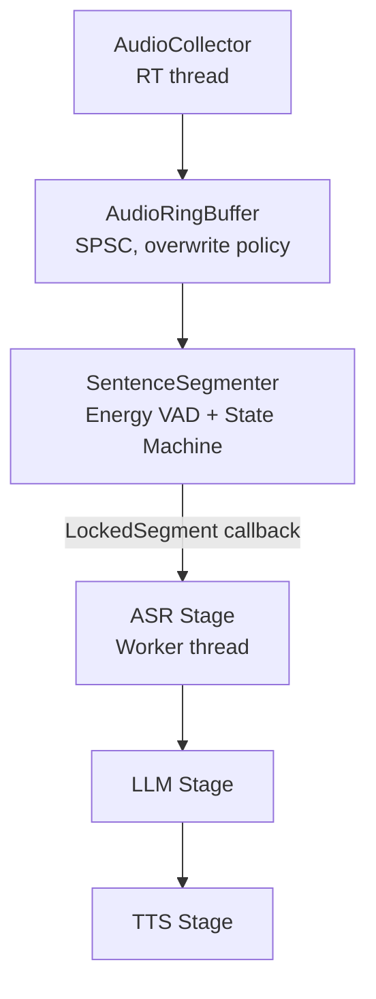
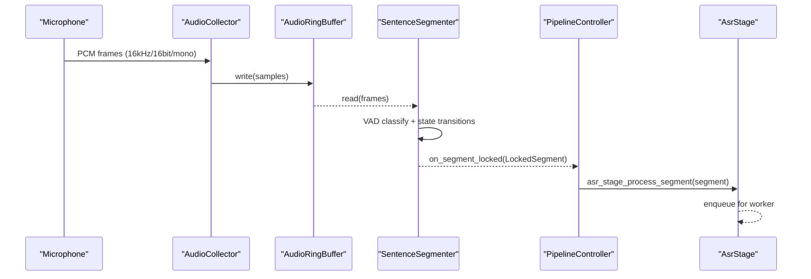
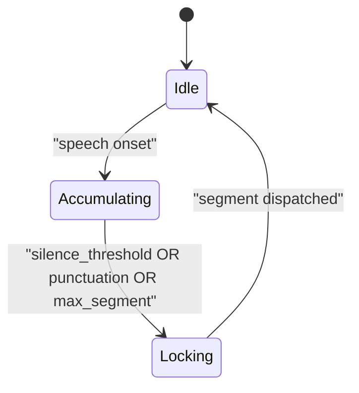
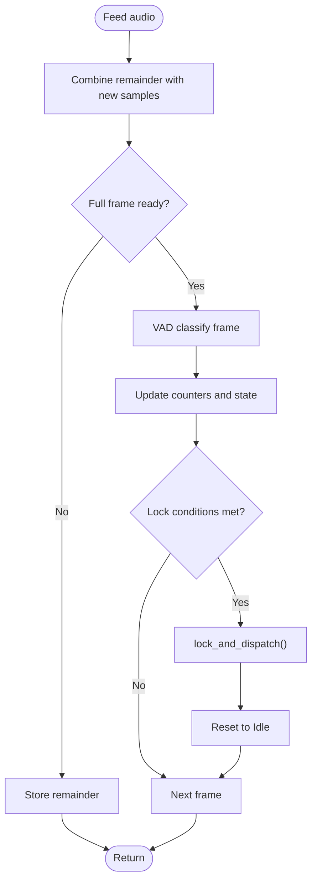
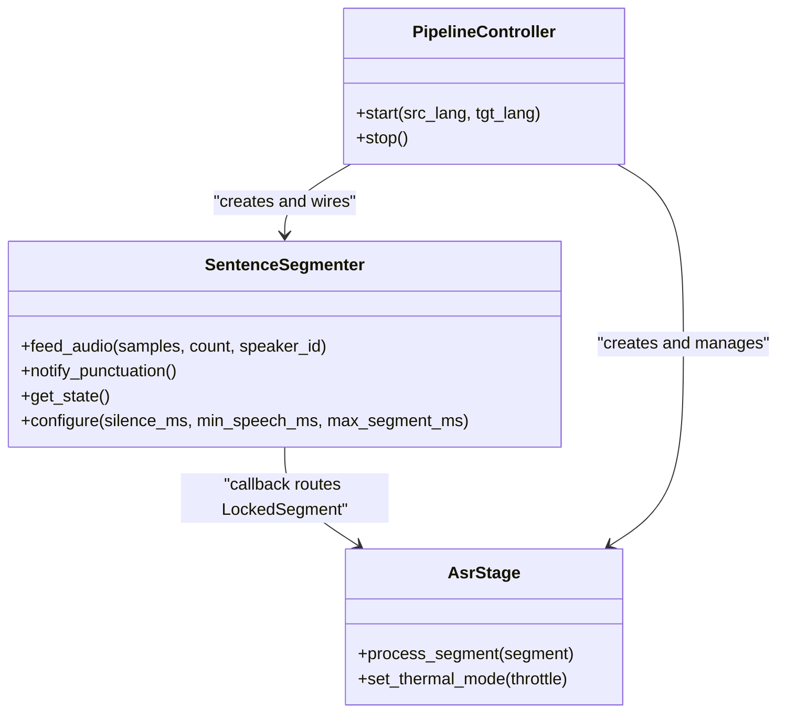
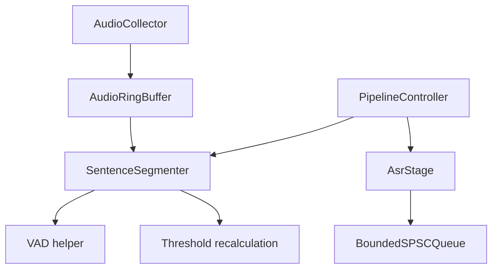

# Sentence Segmentation and Voice Activity Detection

<cite>
**Referenced Files in This Document**
- [sentence_segmenter.h](file://native/include/sentence_segmenter.h)
- [sentence_segmenter.cpp](file://native/src/sentence_segmenter.cpp)
- [test_sentence_segmenter.cpp](file://native/tests/test_sentence_segmenter.cpp)
- [pipeline_controller.h](file://native/include/pipeline_controller.h)
- [pipeline_controller.cpp](file://native/src/pipeline_controller.cpp)
- [asr_stage.h](file://native/include/asr_stage.h)
- [asr_stage.cpp](file://native/src/asr_stage.cpp)
- [echo_types.h](file://native/include/echo_types.h)
- [audio_collector.h](file://native/include/audio_collector.h)
- [audio_collector.cpp](file://native/src/audio_collector.cpp)
- [audio_ring_buffer.h](file://native/include/audio_ring_buffer.h)
- [README.md](file://README.md)
- [design.md](file://.kiro/specs/qwen-echo/design.md)
</cite>

## Table of Contents
1. [Introduction](#introduction)
2. [Project Structure](#project-structure)
3. [Core Components](#core-components)
4. [Architecture Overview](#architecture-overview)
5. [Detailed Component Analysis](#detailed-component-analysis)
6. [Dependency Analysis](#dependency-analysis)
7. [Performance Considerations](#performance-considerations)
8. [Troubleshooting Guide](#troubleshooting-guide)
9. [Conclusion](#conclusion)
10. [Appendices](#appendices)

## Introduction
This document explains QwenEcho’s sentence segmentation and voice activity detection (VAD) system. It covers how continuous audio is segmented into meaningful linguistic units using an energy-based VAD, a state machine for boundary detection, and integration with the ASR pipeline. It also documents the LockedSegment data structure, parameter tuning strategies, edge-case handling, performance characteristics, and false positive/negative considerations.

## Project Structure
The segmenter resides in the native engine and integrates with the broader real-time pipeline:
- Audio Collector captures PCM at 16kHz/16-bit/mono and writes to a lock-free ring buffer.
- The Sentence Segmenter consumes frames from the ring buffer, classifies speech vs silence, and locks segments based on temporal rules.
- Locked segments are dispatched to the ASR stage for transcription and translation downstream.

**Diagram sources**
- [audio_collector.cpp:93-128](file://native/src/audio_collector.cpp#L93-L128)
- [audio_ring_buffer.h:27-192](file://native/include/audio_ring_buffer.h#L27-L192)
- [sentence_segmenter.cpp:251-294](file://native/src/sentence_segmenter.cpp#L251-L294)
- [pipeline_controller.cpp:134-139](file://native/src/pipeline_controller.cpp#L134-L139)
- [asr_stage.cpp:297-318](file://native/src/asr_stage.cpp#L297-318)

**Section sources**
- [README.md:17-33](file://README.md#L17-L33)
- [design.md:77-98](file://.kiro/specs/qwen-echo/design.md#L77-L98)

## Core Components
- Energy-based VAD: Computes mean absolute amplitude per frame and compares against a fixed threshold to classify speech vs non-speech.
- Temporal analysis: Tracks consecutive silence frames, total speech frames, and total frames to enforce minimum speech duration and maximum segment length.
- State machine: Transitions between Idle, Accumulating, and Locking states to determine when to lock and dispatch a segment.
- LockedSegment: A lightweight descriptor carrying audio pointer, sample count, segment ID, speaker ID, and timestamp for downstream processing.

Key responsibilities:
- Frame alignment and partial-frame handling across feed calls.
- Configurable thresholds for silence duration, minimum speech, and max segment length.
- Callback-driven dispatch to ASR upon locking.

**Section sources**
- [sentence_segmenter.h:34-49](file://native/include/sentence_segmenter.h#L34-L49)
- [sentence_segmenter.cpp:85-96](file://native/src/sentence_segmenter.cpp#L85-L96)
- [sentence_segmenter.cpp:145-198](file://native/src/sentence_segmenter.cpp#L145-L198)
- [sentence_segmenter.cpp:251-294](file://native/src/sentence_segmenter.cpp#L251-L294)

## Architecture Overview
End-to-end flow relevant to segmentation:
- Audio Collector writes samples to the ring buffer.
- Sentence Segmenter reads frames, applies VAD, updates state, and locks segments.
- Pipeline Controller wires the segmenter’s callback to ASR stage.
- ASR stage processes locked segments asynchronously and enqueues confirmed text to LLM.

**Diagram sources**
- [audio_collector.cpp:93-128](file://native/src/audio_collector.cpp#L93-L128)
- [audio_ring_buffer.h:52-91](file://native/include/audio_ring_buffer.h#L52-L91)
- [sentence_segmenter.cpp:251-294](file://native/src/sentence_segmenter.cpp#L251-L294)
- [pipeline_controller.cpp:134-139](file://native/src/pipeline_controller.cpp#L134-L139)
- [asr_stage.cpp:297-318](file://native/src/asr_stage.cpp#L297-318)

## Detailed Component Analysis

### Sentence Segmenter: Algorithms and State Machine
- VAD algorithm: Mean absolute amplitude per 10ms frame; if above threshold, classified as speech.
- Temporal analysis:
  - Silence threshold: Lock after N consecutive silence frames (configurable).
  - Minimum speech: Require M speech frames before any lock.
  - Max segment: Force-lock after K total frames if minimum speech met.
- State machine:
  - Idle → Accumulating on first speech frame.
  - Accumulating → Locking on silence threshold, punctuation notification, or force-lock.
  - Locking → Idle after dispatching the segment via callback.

**Diagram sources**
- [sentence_segmenter.h:34-38](file://native/include/sentence_segmenter.h#L34-L38)
- [sentence_segmenter.cpp:145-198](file://native/src/sentence_segmenter.cpp#L145-L198)

#### LockedSegment Data Structure
- Fields:
  - audio_data: Pointer to segment PCM samples.
  - sample_count: Number of int16_t samples.
  - segment_id: Auto-incrementing identifier.
  - speaker_id: Speaker label (e.g., 0 or 1).
  - timestamp_ms: Approximate lock time derived from total frames processed.
- Usage: Passed by reference in the segmenter’s callback; downstream stages must not retain pointers beyond the callback scope.

**Section sources**
- [sentence_segmenter.h:43-49](file://native/include/sentence_segmenter.h#L43-L49)
- [sentence_segmenter.cpp:115-140](file://native/src/sentence_segmenter.cpp#L115-L140)

#### Frame Processing and Partial Frames
- Frame size: 10ms (160 samples at 16kHz).
- Partial frames: Leftover samples are buffered and combined with subsequent input until a full frame is available.
- Feed API: Processes complete frames while preserving leftover samples across calls.

**Diagram sources**
- [sentence_segmenter.cpp:251-294](file://native/src/sentence_segmenter.cpp#L251-L294)
- [sentence_segmenter.cpp:145-198](file://native/src/sentence_segmenter.cpp#L145-L198)

#### Punctuation Integration
- External punctuation notifications can force immediate locking if minimum speech duration is satisfied.
- Useful for ASR-driven sentence boundaries where punctuation is detected during streaming.

**Section sources**
- [sentence_segmenter.h:106-113](file://native/include/sentence_segmenter.h#L106-L113)
- [sentence_segmenter.cpp:296-306](file://native/src/sentence_segmenter.cpp#L296-L306)

#### Configuration and Defaults
- Default thresholds:
  - Silence threshold: 400ms.
  - Minimum speech: 200ms.
  - Max segment: 15000ms.
- Recalculation converts ms thresholds to frame counts based on sample rate and frame size.

**Section sources**
- [sentence_segmenter.cpp:219-237](file://native/src/sentence_segmenter.cpp#L219-237)
- [sentence_segmenter.cpp:101-110](file://native/src/sentence_segmenter.cpp#L101-L110)

### ASR Stage Integration
- The pipeline controller registers the segmenter’s callback to forward LockedSegments to the ASR stage.
- ASR stage copies segment data, optionally resamples in throttle mode, runs inference (stub), streams partial tokens, and enqueues confirmed text.

**Diagram sources**
- [pipeline_controller.cpp:134-139](file://native/src/pipeline_controller.cpp#L134-L139)
- [asr_stage.h:79-87](file://native/include/asr_stage.h#L79-87)
- [asr_stage.cpp:297-318](file://native/src/asr_stage.cpp#L297-318)

**Section sources**
- [pipeline_controller.cpp:134-139](file://native/src/pipeline_controller.cpp#L134-L139)
- [asr_stage.cpp:297-318](file://native/src/asr_stage.cpp#L297-318)

### Audio Collector and Ring Buffer
- Audio Collector writes PCM to the ring buffer at RT priority and detects sample drops.
- Ring buffer uses SPSC design with overwrite-on-overflow policy and cache-line-aligned indices.

**Section sources**
- [audio_collector.cpp:93-128](file://native/src/audio_collector.cpp#L93-L128)
- [audio_ring_buffer.h:27-192](file://native/include/audio_ring_buffer.h#L27-L192)

## Dependency Analysis
- Direct dependencies:
  - SentenceSegmenter depends on internal VAD helpers and configuration recalculation.
  - PipelineController creates and wires SentenceSegmenter and AsrStage.
  - AsrStage depends on bounded queues and Native Port for streaming messages.
- Indirect dependencies:
  - AudioCollector and AudioRingBuffer provide low-latency audio ingestion.
  - Echo types define shared structures used across stages.

**Diagram sources**
- [sentence_segmenter.cpp:85-96](file://native/src/sentence_segmenter.cpp#L85-L96)
- [sentence_segmenter.cpp:101-110](file://native/src/sentence_segmenter.cpp#L101-L110)
- [pipeline_controller.cpp:134-139](file://native/src/pipeline_controller.cpp#L134-L139)
- [asr_stage.cpp:297-318](file://native/src/asr_stage.cpp#L297-318)
- [audio_collector.cpp:93-128](file://native/src/audio_collector.cpp#L93-L128)
- [audio_ring_buffer.h:27-192](file://native/include/audio_ring_buffer.h#L27-L192)

**Section sources**
- [echo_types.h:68-86](file://native/include/echo_types.h#L68-86)
- [pipeline_controller.cpp:107-126](file://native/src/pipeline_controller.cpp#L107-L126)

## Performance Considerations
- Latency targets:
  - ASR first-character latency ≤200ms.
  - E2E budget: ≤800ms normal, ≤1200ms throttle.
- VAD complexity:
  - Per-frame O(n) mean absolute amplitude computation; designed to complete within 30ms per frame.
- Throughput:
  - 10ms frames at 16kHz ensure steady-state processing without blocking upstream.
- Memory:
  - Pre-allocated accumulation buffer reduces allocations during hot path.
- Thermal adaptation:
  - Throttle mode may affect downstream stages; segmenter remains unaffected but overall SLA changes.

[No sources needed since this section provides general guidance]

## Troubleshooting Guide
Common issues and diagnostics:
- No segments locked:
  - Verify minimum speech duration is met before silence or punctuation triggers.
  - Check that VAD threshold is appropriate for environment noise levels.
- Over-segmentation:
  - Increase silence threshold or reduce sensitivity by raising VAD threshold.
- Under-segmentation:
  - Decrease silence threshold or enable punctuation notifications more frequently.
- Overlapping speech:
  - Use speaker_id differentiation; consider separate segmenters per speaker channel if needed.
- False positives (noise misclassified as speech):
  - Raise VAD_ENERGY_THRESHOLD or add pre-filtering (e.g., high-pass) before VAD.
- False negatives (missed speech):
  - Lower VAD_ENERGY_THRESHOLD or increase min_speech_ms tolerance.

Operational checks:
- Confirm segmenter state transitions via get_state().
- Validate LockedSegment fields (sample_count, segment_id, speaker_id, timestamp_ms).
- Ensure punctuation notifications occur only when accumulating and sufficient speech has been seen.

**Section sources**
- [sentence_segmenter.cpp:296-306](file://native/src/sentence_segmenter.cpp#L296-L306)
- [sentence_segmenter.cpp:115-140](file://native/src/sentence_segmenter.cpp#L115-L140)
- [test_sentence_segmenter.cpp:133-170](file://native/tests/test_sentence_segmenter.cpp#L133-L170)

## Conclusion
QwenEcho’s sentence segmentation combines a simple yet effective energy-based VAD with robust temporal analysis and a clear state machine to produce linguistically meaningful segments. The LockedSegment structure enables seamless handoff to ASR and downstream stages. With configurable thresholds and punctuation integration, the system balances accuracy and responsiveness across diverse speaking styles and environments.

[No sources needed since this section summarizes without analyzing specific files]

## Appendices

### Parameter Tuning Examples
- Conversational dialogue with frequent pauses:
  - Reduce silence_threshold_ms to ~300ms; keep min_speech_ms at 200ms.
- Fast-paced monologue:
  - Increase silence_threshold_ms to ~500ms; maintain max_segment_ms at 15000ms.
- Noisy environments:
  - Increase VAD_ENERGY_THRESHOLD slightly; consider adding acoustic preprocessing.
- Overlapping speakers:
  - Assign distinct speaker_id values; evaluate multi-channel segmentation if necessary.

**Section sources**
- [sentence_segmenter.h:84-87](file://native/include/sentence_segmenter.h#L84-87)
- [sentence_segmenter.cpp:219-237](file://native/src/sentence_segmenter.cpp#L219-237)

### Edge Cases and Handling
- Partial frames across multiple feed calls: handled by buffering remainders until a full frame is assembled.
- Punctuation in Idle state: ignored; no effect on state or callbacks.
- Immediate new segment after lock: segmenter resets to Idle and begins accumulating immediately.

**Section sources**
- [test_sentence_segmenter.cpp:331-358](file://native/tests/test_sentence_segmenter.cpp#L331-358)
- [test_sentence_segmenter.cpp:360-370](file://native/tests/test_sentence_segmenter.cpp#L360-370)
- [test_sentence_segmenter.cpp:250-266](file://native/tests/test_sentence_segmenter.cpp#L250-266)

### Integration Notes with ASR Pipeline
- Pipeline controller wires segmenter callback to ASR stage.
- ASR stage enqueues segments for asynchronous processing and reports SLA violations.
- Confirmed text is forwarded to LLM via bounded queue.

**Section sources**
- [pipeline_controller.cpp:134-139](file://native/src/pipeline_controller.cpp#L134-L139)
- [asr_stage.cpp:297-318](file://native/src/asr_stage.cpp#L297-318)