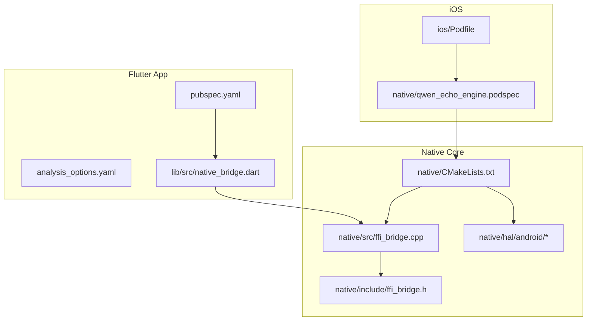
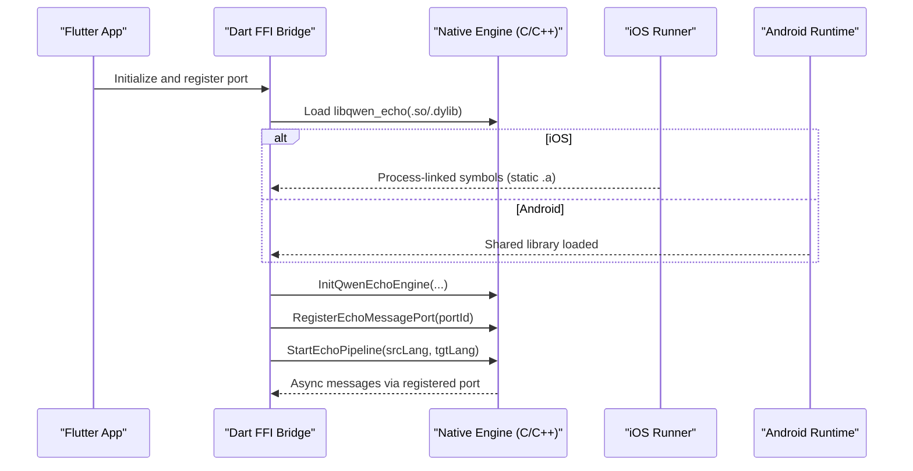
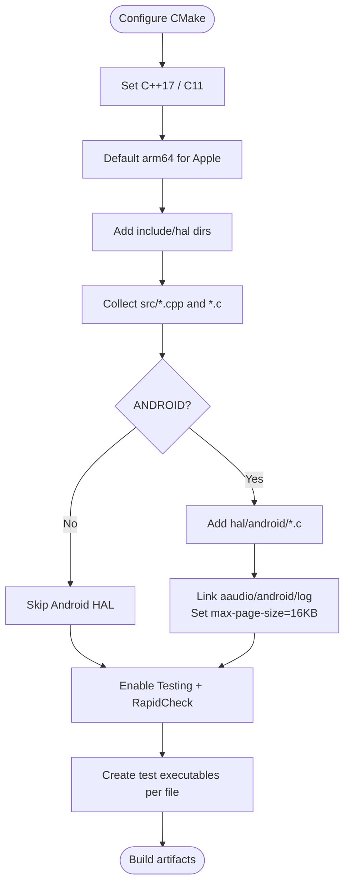
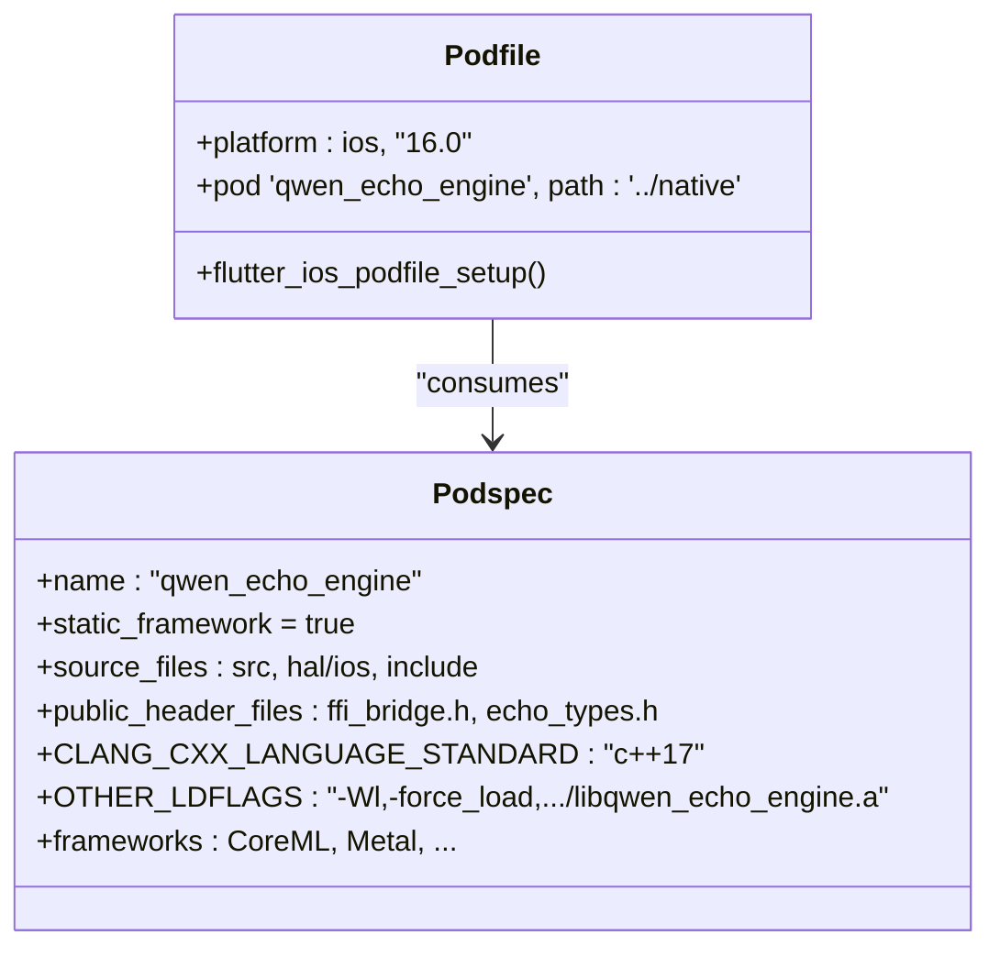
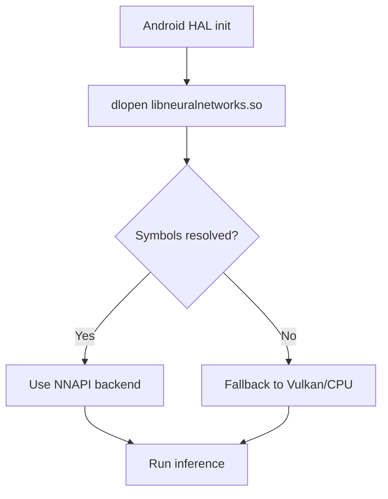
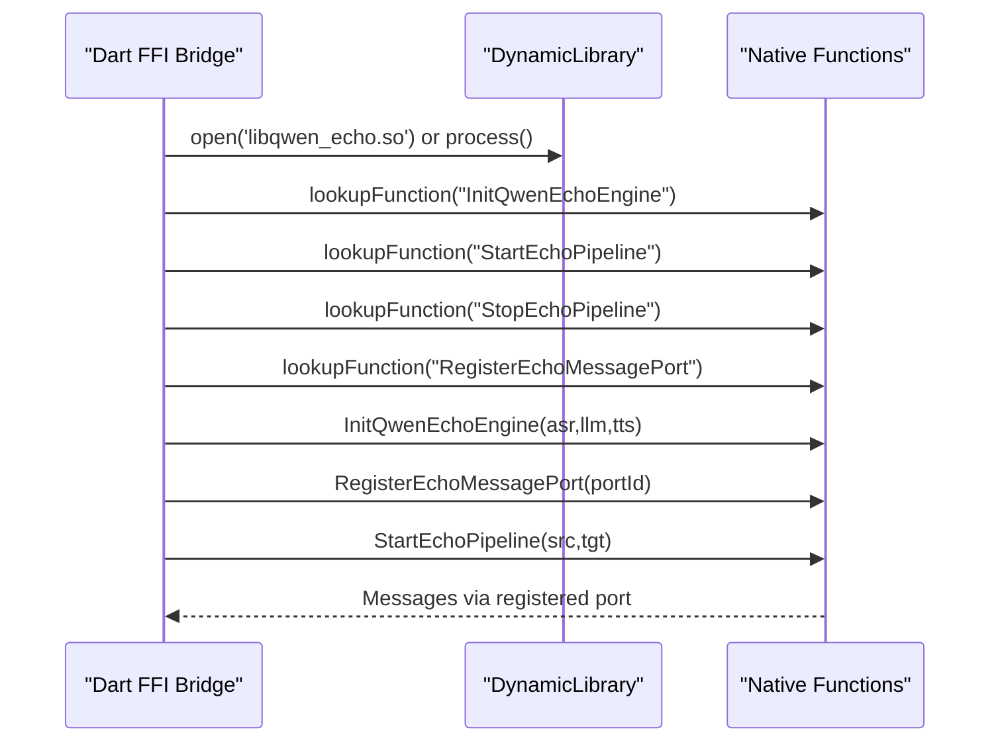
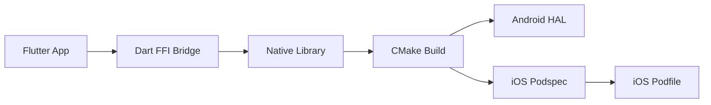

# Build System and Deployment

<cite>
**Referenced Files in This Document**
- [native/CMakeLists.txt](file://native/CMakeLists.txt)
- [ios/Podfile](file://ios/Podfile)
- [native/qwen_echo_engine.podspec](file://native/qwen_echo_engine.podspec)
- [pubspec.yaml](file://pubspec.yaml)
- [analysis_options.yaml](file://analysis_options.yaml)
- [lib/src/native_bridge.dart](file://lib/src/native_bridge.dart)
- [native/include/ffi_bridge.h](file://native/include/ffi_bridge.h)
- [native/src/ffi_bridge.cpp](file://native/src/ffi_bridge.cpp)
- [native/hal/android/hal_accelerator_android.c](file://native/hal/android/hal_accelerator_android.c)
</cite>

## Table of Contents
1. [Introduction](#introduction)
2. [Project Structure](#project-structure)
3. [Core Components](#core-components)
4. [Architecture Overview](#architecture-overview)
5. [Detailed Component Analysis](#detailed-component-analysis)
6. [Dependency Analysis](#dependency-analysis)
7. [Performance Considerations](#performance-considerations)
8. [Troubleshooting Guide](#troubleshooting-guide)
9. [Conclusion](#conclusion)
10. [Appendices](#appendices)

## Introduction
This document explains QwenEcho’s build system and deployment strategy across platforms, focusing on:
- Cross-platform native builds with CMake (C++17, ARM64 optimization)
- RapidCheck-based property testing integration
- Android NDK r21+ integration and APK generation
- iOS CocoaPods configuration and IPA generation
- Flutter build commands, dependency management, and analysis options
- Customizing build configurations, CI pipeline setup, and troubleshooting

The goal is to provide a clear, actionable guide for building, packaging, and distributing QwenEcho on Android and iOS while maintaining a consistent cross-platform native core.

## Project Structure
QwenEcho is a Flutter application that embeds a native C/C++ engine via FFI. The native core is built with CMake and packaged as a static library for iOS via CocoaPods, and as a shared library for Android.

**Diagram sources**
- [native/CMakeLists.txt:1-126](file://native/CMakeLists.txt#L1-L126)
- [ios/Podfile:1-45](file://ios/Podfile#L1-L45)
- [native/qwen_echo_engine.podspec:1-50](file://native/qwen_echo_engine.podspec#L1-L50)
- [pubspec.yaml:1-26](file://pubspec.yaml#L1-L26)
- [analysis_options.yaml:1-8](file://analysis_options.yaml#L1-L8)
- [lib/src/native_bridge.dart:1-230](file://lib/src/native_bridge.dart#L1-L230)
- [native/include/ffi_bridge.h:35-83](file://native/include/ffi_bridge.h#L35-L83)
- [native/src/ffi_bridge.cpp:1-123](file://native/src/ffi_bridge.cpp#L1-L123)
- [native/hal/android/hal_accelerator_android.c:1-132](file://native/hal/android/hal_accelerator_android.c#L1-L132)

**Section sources**
- [native/CMakeLists.txt:1-126](file://native/CMakeLists.txt#L1-L126)
- [ios/Podfile:1-45](file://ios/Podfile#L1-L45)
- [native/qwen_echo_engine.podspec:1-50](file://native/qwen_echo_engine.podspec#L1-L50)
- [pubspec.yaml:1-26](file://pubspec.yaml#L1-L26)
- [analysis_options.yaml:1-8](file://analysis_options.yaml#L1-L8)
- [lib/src/native_bridge.dart:1-230](file://lib/src/native_bridge.dart#L1-L230)
- [native/include/ffi_bridge.h:35-83](file://native/include/ffi_bridge.h#L35-L83)
- [native/src/ffi_bridge.cpp:1-123](file://native/src/ffi_bridge.cpp#L1-L123)
- [native/hal/android/hal_accelerator_android.c:1-132](file://native/hal/android/hal_accelerator_android.c#L1-L132)

## Core Components
- Native build system (CMake): Defines language standards, includes, platform-specific HAL sources, linking flags, and test targets.
- iOS packaging (CocoaPods): Podfile and podspec configure static framework linkage, headers, frameworks, and force-load behavior for FFI symbols.
- Dart FFI bridge: Dart code loads the native library and exposes typed methods for initialization, pipeline control, and port registration.
- Android HAL: Accelerator backend uses NNAPI with dynamic loading and fallback paths; requires NDK r21+.

Key responsibilities:
- Cross-platform compilation targeting ARM64
- Property-based testing with RapidCheck
- Platform-specific linking and symbol exposure for FFI
- Flutter app integration and analysis options

**Section sources**
- [native/CMakeLists.txt:1-126](file://native/CMakeLists.txt#L1-L126)
- [native/qwen_echo_engine.podspec:1-50](file://native/qwen_echo_engine.podspec#L1-L50)
- [ios/Podfile:1-45](file://ios/Podfile#L1-L45)
- [lib/src/native_bridge.dart:1-230](file://lib/src/native_bridge.dart#L1-L230)
- [native/hal/android/hal_accelerator_android.c:1-132](file://native/hal/android/hal_accelerator_android.c#L1-L132)

## Architecture Overview
High-level build and runtime flow:
- Flutter app depends on Dart FFI bindings.
- Dart FFI loads the native library at runtime.
- Native core is compiled by CMake into a static library (iOS) or shared library (Android).
- iOS integrates via CocoaPods; Android integrates via Gradle (managed by Flutter tooling).

**Diagram sources**
- [lib/src/native_bridge.dart:191-222](file://lib/src/native_bridge.dart#L191-L222)
- [native/include/ffi_bridge.h:35-83](file://native/include/ffi_bridge.h#L35-L83)
- [native/src/ffi_bridge.cpp:95-123](file://native/src/ffi_bridge.cpp#L95-L123)
- [native/qwen_echo_engine.podspec:36-42](file://native/qwen_echo_engine.podspec#L36-L42)

## Detailed Component Analysis

### CMake Configuration (Cross-Platform Native Builds)
- Language standards: C++17 and C11 enforced.
- Architecture: Defaults to arm64 for Apple platforms; supports cross-compilation via toolchain files.
- Includes: Public headers under include and hal directories.
- Sources: Aggregates src/*.cpp and c files; conditionally adds Android HAL sources when ANDROID is defined.
- Android specifics: Links against aaudio, android, log; sets max-page-size=16KB for Android 15+ compatibility.
- Testing: Enables CTest and RapidCheck via FetchContent; creates per-test executables and registers them with add_test.

**Diagram sources**
- [native/CMakeLists.txt:1-126](file://native/CMakeLists.txt#L1-L126)

**Section sources**
- [native/CMakeLists.txt:1-126](file://native/CMakeLists.txt#L1-L126)

### iOS Build Configuration (CocoaPods and Xcode)
- Podfile:
  - Sets minimum iOS version to 16.0.
  - Disables CocoaPods analytics to reduce build latency.
  - Uses flutter_ios_podfile_setup and installs Flutter pods.
  - Adds local qwen_echo_engine pod from ../native with modular_headers disabled.
  - Ensures use_modular_headers! without use_frameworks! so the native engine remains a static .a linked directly into Runner.
- Podspec:
  - Declares static_framework = true.
  - Source files include src/**/*.{cpp,c}, hal/ios/**/*.{m,c}, and public headers.
  - Compiler settings enforce C++17 and C11 with strict warnings.
  - Forces load of the static library into Runner to avoid dead-stripping of FFI symbols.
  - Links required iOS frameworks (CoreML, Metal, etc.).

**Diagram sources**
- [ios/Podfile:1-45](file://ios/Podfile#L1-L45)
- [native/qwen_echo_engine.podspec:1-50](file://native/qwen_echo_engine.podspec#L1-L50)

**Section sources**
- [ios/Podfile:1-45](file://ios/Podfile#L1-L45)
- [native/qwen_echo_engine.podspec:1-50](file://native/qwen_echo_engine.podspec#L1-L50)

### Android Build Integration (NDK r21+)
- HAL accelerator implementation dynamically loads NNAPI functions and falls back to Vulkan/CPU if unavailable.
- Requires Android NDK r21+ and targets Android 11+ (API level 30+).
- CMake links Android libraries and sets page size alignment for Android 15+.

**Diagram sources**
- [native/hal/android/hal_accelerator_android.c:1-132](file://native/hal/android/hal_accelerator_android.c#L1-L132)
- [native/CMakeLists.txt:52-67](file://native/CMakeLists.txt#L52-L67)

**Section sources**
- [native/hal/android/hal_accelerator_android.c:1-132](file://native/hal/android/hal_accelerator_android.c#L1-L132)
- [native/CMakeLists.txt:52-67](file://native/CMakeLists.txt#L52-L67)

### Dart FFI Integration
- Dart FFI bridge loads platform-specific libraries:
  - Android/Linux: libqwen_echo.so
  - iOS/macOS: process first (for statically linked symbols), then libqwen_echo.dylib fallback
- Exposes typed Dart methods for:
  - Initialization with model paths
  - Starting/stopping the interpretation pipeline
  - Registering a Dart Native Port for async messages
- Throws EchoEngineException with human-readable descriptions for non-zero error codes.

**Diagram sources**
- [lib/src/native_bridge.dart:191-222](file://lib/src/native_bridge.dart#L191-L222)
- [native/include/ffi_bridge.h:35-83](file://native/include/ffi_bridge.h#L35-L83)
- [native/src/ffi_bridge.cpp:95-123](file://native/src/ffi_bridge.cpp#L95-L123)

**Section sources**
- [lib/src/native_bridge.dart:1-230](file://lib/src/native_bridge.dart#L1-L230)
- [native/include/ffi_bridge.h:35-83](file://native/include/ffi_bridge.h#L35-L83)
- [native/src/ffi_bridge.cpp:1-123](file://native/src/ffi_bridge.cpp#L1-L123)

### Flutter Build Commands, Dependencies, and Analysis Options
- pubspec.yaml:
  - SDK constraints: Dart >=3.2.0 <4.0.0, Flutter >=3.16.0
  - Dependencies: flutter, ffi, path_provider, file_picker
  - Dev dependencies: flutter_test, flutter_lints
- analysis_options.yaml:
  - Includes flutter_lints/flutter.yaml
  - Enables prefer_const_constructors, prefer_const_declarations, avoid_print

Common commands:
- Get dependencies: flutter pub get
- Analyze code: flutter analyze
- Run on device/emulator: flutter run
- Build Android APK: flutter build apk
- Build iOS IPA: flutter build ipa

**Section sources**
- [pubspec.yaml:1-26](file://pubspec.yaml#L1-L26)
- [analysis_options.yaml:1-8](file://analysis_options.yaml#L1-L8)

## Dependency Analysis
The following diagram shows key build-time and runtime dependencies:

**Diagram sources**
- [lib/src/native_bridge.dart:191-222](file://lib/src/native_bridge.dart#L191-L222)
- [native/CMakeLists.txt:1-126](file://native/CMakeLists.txt#L1-L126)
- [native/qwen_echo_engine.podspec:1-50](file://native/qwen_echo_engine.podspec#L1-L50)
- [ios/Podfile:1-45](file://ios/Podfile#L1-L45)

**Section sources**
- [lib/src/native_bridge.dart:191-222](file://lib/src/native_bridge.dart#L191-L222)
- [native/CMakeLists.txt:1-126](file://native/CMakeLists.txt#L1-L126)
- [native/qwen_echo_engine.podspec:1-50](file://native/qwen_echo_engine.podspec#L1-L50)
- [ios/Podfile:1-45](file://ios/Podfile#L1-L45)

## Performance Considerations
- Prefer static linking on iOS to ensure FFI symbols are present in the Runner binary and avoid dead-stripping.
- Use RapidCheck tests to validate edge cases and improve robustness before release builds.
- On Android, ensure 16KB page alignment for devices running Android 15+ to prevent runtime issues.
- Keep CocoaPods analytics disabled during builds to reduce latency.

[No sources needed since this section provides general guidance]

## Troubleshooting Guide
Common issues and resolutions:
- Missing FLUTTER_ROOT or Generated.xcconfig on iOS:
  - Ensure flutter pub get has been executed before pod install.
- Symbols not found at runtime on iOS:
  - Verify static framework and force-load flags are applied; ensure DEAD_CODE_STRIPPING is disabled for the target.
- NNAPI not available on Android:
  - Confirm NDK r21+ and API level 30+; check dynamic loading logs and fallback behavior.
- Page size errors on Android 15+:
  - Ensure max-page-size=16384 linker option is set.
- Lint failures:
  - Review analysis_options.yaml rules and fix violations reported by flutter analyze.

**Section sources**
- [ios/Podfile:12-23](file://ios/Podfile#L12-L23)
- [native/qwen_echo_engine.podspec:36-42](file://native/qwen_echo_engine.podspec#L36-L42)
- [native/hal/android/hal_accelerator_android.c:95-132](file://native/hal/android/hal_accelerator_android.c#L95-L132)
- [native/CMakeLists.txt:61-67](file://native/CMakeLists.txt#L61-L67)
- [analysis_options.yaml:1-8](file://analysis_options.yaml#L1-L8)

## Conclusion
QwenEcho’s build system combines CMake for cross-platform native compilation, CocoaPods for iOS packaging, and Flutter tooling for app distribution. The design emphasizes:
- ARM64 optimization and strict language standards
- Robust FFI integration with proper symbol exposure
- Comprehensive testing via RapidCheck
- Clear platform-specific considerations for Android and iOS

Following the commands and guidelines here will help you build, test, and distribute QwenEcho reliably across platforms.

[No sources needed since this section summarizes without analyzing specific files]

## Appendices

### Customizing Build Configurations
- CMake:
  - Adjust architecture defaults or pass toolchain files for cross-compilation.
  - Toggle QWEN_ECHO_BUILD_TESTS to enable/disable RapidCheck tests.
- iOS:
  - Modify Podfile to change minimum deployment target or pod options.
  - Update podspec compiler flags and frameworks as needed.
- Flutter:
  - Extend analysis_options.yaml with additional lint rules.
  - Add or update dependencies in pubspec.yaml and run flutter pub get.

**Section sources**
- [native/CMakeLists.txt:71-84](file://native/CMakeLists.txt#L71-L84)
- [ios/Podfile:1-10](file://ios/Podfile#L1-10)
- [native/qwen_echo_engine.podspec:26-34](file://native/qwen_echo_engine.podspec#L26-L34)
- [analysis_options.yaml:1-8](file://analysis_options.yaml#L1-L8)
- [pubspec.yaml:10-22](file://pubspec.yaml#L10-L22)

### Continuous Integration Pipeline Examples
- Android:
  - Set up Android SDK and NDK r21+, run flutter build apk, and upload artifacts.
- iOS:
  - Install CocoaPods, run flutter pub get, pod install, and flutter build ipa.
- Tests:
  - Enable CMake tests with RapidCheck and run ctest after native build.
- Linting:
  - Execute flutter analyze and fail the job on violations.

[No sources needed since this section provides general guidance]