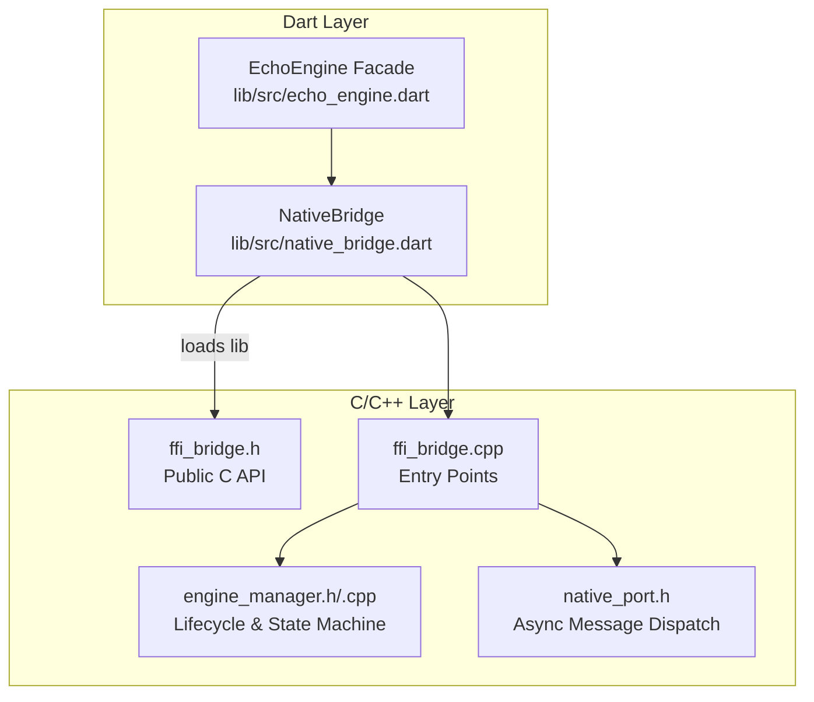
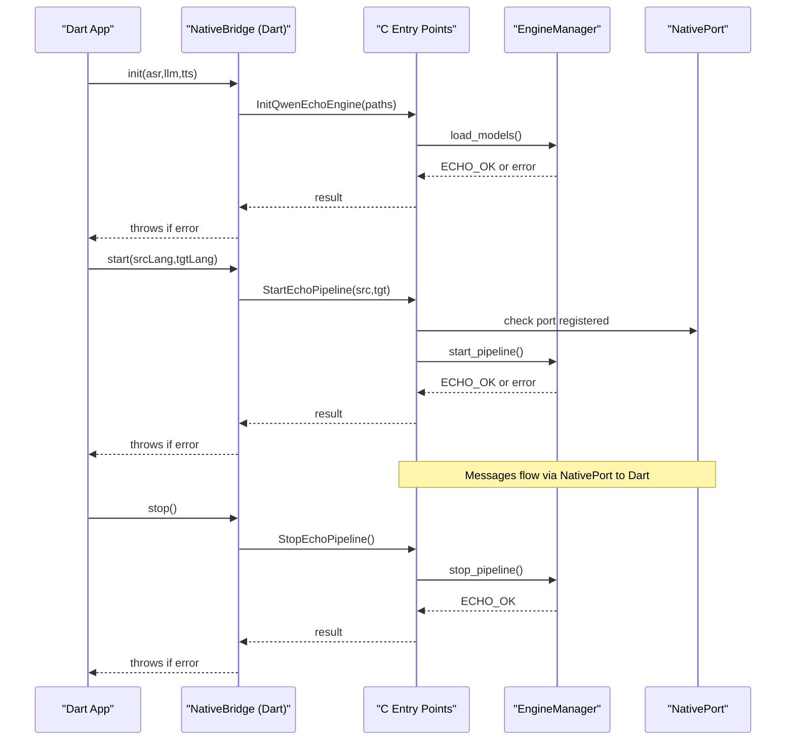
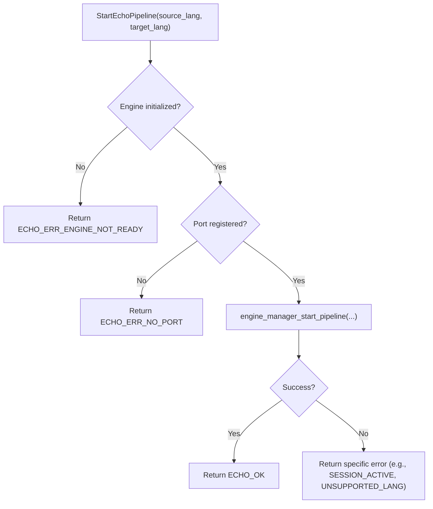
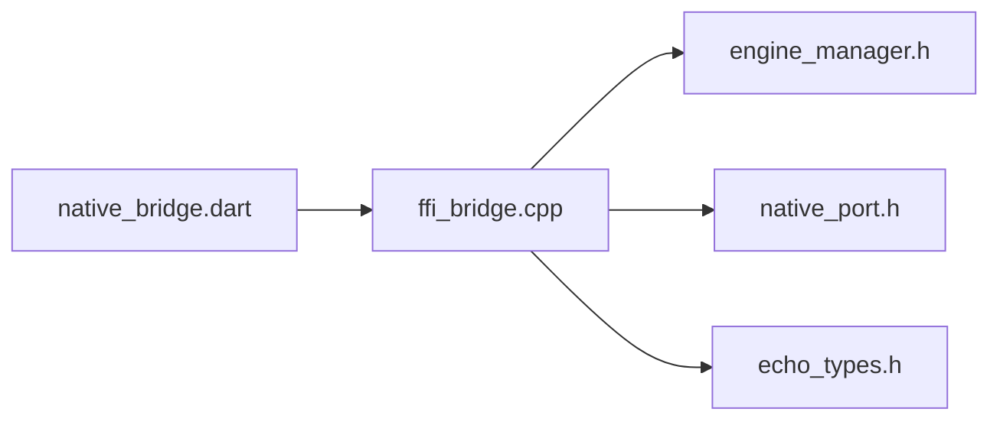
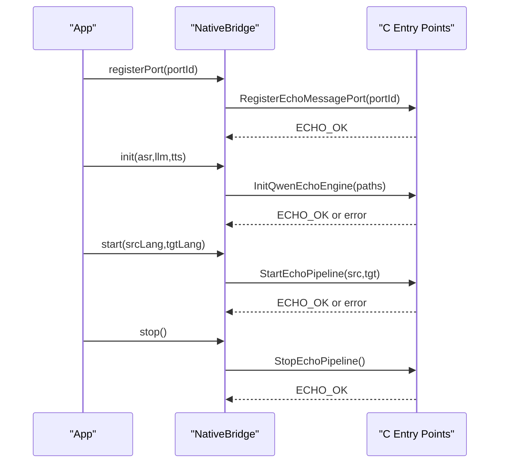

# C FFI Interface Specification

<cite>
**Referenced Files in This Document**
- [ffi_bridge.h](file://native/include/ffi_bridge.h)
- [ffi_bridge.cpp](file://native/src/ffi_bridge.cpp)
- [echo_types.h](file://native/include/echo_types.h)
- [engine_manager.h](file://native/include/engine_manager.h)
- [engine_manager.cpp](file://native/src/engine_manager.cpp)
- [native_port.h](file://native/include/native_port.h)
- [native_bridge.dart](file://lib/src/native_bridge.dart)
- [qwen_echo.dart](file://lib/qwen_echo.dart)
- [README.md](file://README.md)
</cite>

## Table of Contents
1. [Introduction](#introduction)
2. [Project Structure](#project-structure)
3. [Core Components](#core-components)
4. [Architecture Overview](#architecture-overview)
5. [Detailed Component Analysis](#detailed-component-analysis)
6. [Dependency Analysis](#dependency-analysis)
7. [Performance Considerations](#performance-considerations)
8. [Troubleshooting Guide](#troubleshooting-guide)
9. [Conclusion](#conclusion)
10. [Appendices](#appendices)

## Introduction
This document specifies the C Foreign Function Interface (FFI) exposed to Dart for the QwenEcho on-device interpretation engine. It focuses on the four C-linkage entry points: InitQwenEchoEngine, StartEchoPipeline, StopEchoPipeline, and RegisterEchoMessagePort. For each function, it details parameter types, return values, error codes, usage constraints, initialization sequences, error handling patterns, resource management, visibility attributes, extern "C" linkage requirements, and guidance for extending the interface while maintaining ABI compatibility.

## Project Structure
The C FFI is defined in a small public header and implemented by a thin bridge that delegates lifecycle operations to an internal Engine Manager and manages a registered Native Port for asynchronous messaging back to Dart. The Dart side loads the native library via FFI and exposes typed wrappers.

**Diagram sources**
- [ffi_bridge.h:1-84](file://native/include/ffi_bridge.h#L1-L84)
- [ffi_bridge.cpp:1-124](file://native/src/ffi_bridge.cpp#L1-L124)
- [engine_manager.h:1-104](file://native/include/engine_manager.h#L1-L104)
- [engine_manager.cpp:1-201](file://native/src/engine_manager.cpp#L1-L201)
- [native_port.h:1-179](file://native/include/native_port.h#L1-L179)
- [native_bridge.dart:1-230](file://lib/src/native_bridge.dart#L1-L230)
- [qwen_echo.dart:1-16](file://lib/qwen_echo.dart#L1-L16)

**Section sources**
- [README.md:164-175](file://README.md#L164-L175)
- [ffi_bridge.h:1-84](file://native/include/ffi_bridge.h#L1-L84)
- [ffi_bridge.cpp:1-124](file://native/src/ffi_bridge.cpp#L1-L124)
- [native_bridge.dart:1-230](file://lib/src/native_bridge.dart#L1-L230)

## Core Components
- Public C API header: declares the four entry points with default visibility and extern "C" linkage.
- Bridge implementation: thread-safe wrapper around Engine Manager and Native Port registration.
- Engine Manager: owns state machine and orchestrates model loading and pipeline control.
- Native Port: serializes and posts messages from native code to Dart via SendPort.
- Dart bindings: load the shared library, lookup symbols, and wrap calls with exception throwing on errors.

Key responsibilities:
- Visibility and linkage: all functions are exported with default visibility and wrapped in extern "C".
- Error signaling: all functions return int32_t; 0 indicates success, negative values indicate EchoErrorCode.
- Concurrency: bridge uses a mutex to serialize access to global context and port registration.
- Resource ownership: Engine Manager owns models and pipeline; bridge only tracks port registration.

**Section sources**
- [ffi_bridge.h:1-84](file://native/include/ffi_bridge.h#L1-L84)
- [ffi_bridge.cpp:1-124](file://native/src/ffi_bridge.cpp#L1-L124)
- [engine_manager.h:1-104](file://native/include/engine_manager.h#L1-L104)
- [native_port.h:1-179](file://native/include/native_port.h#L1-L179)
- [native_bridge.dart:1-230](file://lib/src/native_bridge.dart#L1-L230)

## Architecture Overview
The FFI layer provides a minimal, stable surface for Dart to control the engine lifecycle and receive streaming results.

**Diagram sources**
- [ffi_bridge.cpp:54-121](file://native/src/ffi_bridge.cpp#L54-L121)
- [engine_manager.h:53-81](file://native/include/engine_manager.h#L53-L81)
- [native_port.h:69-94](file://native/include/native_port.h#L69-L94)
- [native_bridge.dart:132-185](file://lib/src/native_bridge.dart#L132-L185)

## Detailed Component Analysis

### Entry Point: InitQwenEchoEngine
- Purpose: Initialize the engine by loading ASR, LLM, and TTS models from provided paths. Must be called before starting the pipeline.
- Signature:
  - Return type: int32_t
  - Parameters:
    - asr_path: const char* (UTF-8 path to FunASR-Nano GGUF model)
    - llm_path: const char* (UTF-8 path to Qwen3-4B-Instruct GGUF model)
    - tts_path: const char* (UTF-8 path to Qwen3-TTS-Streaming GGUF model)
- Return values:
  - 0 on success
  - Negative EchoErrorCode on failure:
    - ECHO_ERR_ALREADY_INIT if already initialized
    - ECHO_ERR_MODEL_MISSING if any path is NULL or empty
    - Other model-related errors may propagate from model loader
- Usage constraints:
  - Paths must remain valid for the lifetime of the engine.
  - Must be called once before StartEchoPipeline.
  - Thread-safety: bridge serializes calls via a mutex.
- Implementation notes:
  - Ensures Engine Manager exists (lazy creation).
  - Delegates to engine_manager_load_models.
- Visibility and linkage:
  - Declared with __attribute__((visibility("default"))) and extern "C".

Proper initialization sequence:
1. Register message port (see RegisterEchoMessagePort).
2. Call InitQwenEchoEngine with valid model paths.
3. On success, proceed to StartEchoPipeline.

Error handling pattern:
- Check return value; if non-zero, map to EchoErrorCode and handle accordingly (e.g., log, notify user, retry with corrected paths).

Resource management:
- Models are owned by Engine Manager; do not free paths after call returns.
- If initialization fails, caller should not attempt to start pipeline until re-initialized successfully.

**Section sources**
- [ffi_bridge.h:17-33](file://native/include/ffi_bridge.h#L17-L33)
- [ffi_bridge.cpp:56-69](file://native/src/ffi_bridge.cpp#L56-L69)
- [engine_manager.h:53-54](file://native/include/engine_manager.h#L53-L54)
- [echo_types.h:48-62](file://native/include/echo_types.h#L48-L62)

### Entry Point: StartEchoPipeline
- Purpose: Begin audio capture and activate the full ASR → LLM → TTS pipeline for a given language pair.
- Signature:
  - Return type: int32_t
  - Parameters:
    - source_lang: const char* (ISO 639-1 code, e.g., "zh")
    - target_lang: const char* (ISO 639-1 code, e.g., "en")
- Return values:
  - 0 on success
  - Negative EchoErrorCode on failure:
    - ECHO_ERR_ENGINE_NOT_READY if engine not in Ready state
    - ECHO_ERR_SESSION_ACTIVE if pipeline already running
    - ECHO_ERR_NO_PORT if no Native Port registered
    - ECHO_ERR_UNSUPPORTED_LANG if language pair not supported
- Usage constraints:
  - Requires engine initialized and no active session.
  - Requires a registered Native Port for status notifications.
  - Language codes must be valid ISO 639-1 strings.
- Implementation notes:
  - Guards against missing port registration.
  - Delegates to engine_manager_start_pipeline.

Sequence diagram for start:

**Diagram sources**
- [ffi_bridge.cpp:71-88](file://native/src/ffi_bridge.cpp#L71-L88)
- [engine_manager.h:69-70](file://native/include/engine_manager.h#L69-L70)

**Section sources**
- [ffi_bridge.h:35-51](file://native/include/ffi_bridge.h#L35-L51)
- [ffi_bridge.cpp:71-88](file://native/src/ffi_bridge.cpp#L71-L88)
- [engine_manager.h:69-70](file://native/include/engine_manager.h#L69-L70)
- [echo_types.h:48-62](file://native/include/echo_types.h#L48-L62)

### Entry Point: StopEchoPipeline
- Purpose: Stop the active interpretation pipeline, process locked segments, discard unlocked audio, and release pipeline resources.
- Signature:
  - Return type: int32_t
  - Parameters: none
- Return values:
  - 0 on success
  - Negative EchoErrorCode on failure:
    - ECHO_ERR_NO_SESSION if no pipeline session is active
    - ECHO_ERR_NO_PORT if no Native Port registered
- Usage constraints:
  - Requires a registered Native Port for status notifications.
  - Safe to call when no session is active depending on implementation; guard checks apply.
- Implementation notes:
  - Guards against missing port registration.
  - Delegates to engine_manager_stop_pipeline.

**Section sources**
- [ffi_bridge.h:53-65](file://native/include/ffi_bridge.h#L53-L65)
- [ffi_bridge.cpp:90-106](file://native/src/ffi_bridge.cpp#L90-L106)
- [engine_manager.h:81-81](file://native/include/engine_manager.h#L81-L81)
- [echo_types.h:48-62](file://native/include/echo_types.h#L48-L62)

### Entry Point: RegisterEchoMessagePort
- Purpose: Register a Dart Native Port for async message delivery. Replaces any previously registered port.
- Signature:
  - Return type: int32_t
  - Parameters:
    - dart_port_id: int64_t (SendPort ID from Dart)
- Return values:
  - 0 on success
- Usage constraints:
  - Should be called before StartEchoPipeline so the engine can send status and streaming messages.
  - Subsequent calls replace the previous registration.
- Implementation notes:
  - Stores port ID and sets registration flag atomically.
  - Forwards registration to native_port module for message dispatch.

**Section sources**
- [ffi_bridge.h:67-77](file://native/include/ffi_bridge.h#L67-L77)
- [ffi_bridge.cpp:108-121](file://native/src/ffi_bridge.cpp#L108-L121)
- [native_port.h:69-94](file://native/include/native_port.h#L69-L94)

### Visibility Attributes and Linkage Requirements
- All four entry points are declared with:
  - extern "C" linkage to prevent name mangling.
  - __attribute__((visibility("default"))) to ensure symbol export in shared libraries.
- These attributes guarantee stable symbol names across platforms and enable Dart FFI to locate them reliably.

**Section sources**
- [ffi_bridge.h:13-15](file://native/include/ffi_bridge.h#L13-L15)
- [ffi_bridge.h:30-33](file://native/include/ffi_bridge.h#L30-L33)
- [ffi_bridge.h:49-51](file://native/include/ffi_bridge.h#L49-L51)
- [ffi_bridge.h:64-65](file://native/include/ffi_bridge.h#L64-L65)
- [ffi_bridge.h:76-77](file://native/include/ffi_bridge.h#L76-L77)

### Error Codes (EchoErrorCode)
All entry points return int32_t where:
- 0 indicates success.
- Negative values correspond to EchoErrorCode enum entries.

Commonly used codes:
- ECHO_OK = 0
- ECHO_ERR_NOT_INITIALIZED = -1
- ECHO_ERR_ALREADY_INIT = -2
- ECHO_ERR_MODEL_MISSING = -3
- ECHO_ERR_MODEL_INVALID = -4
- ECHO_ERR_MODEL_PERMISSION = -5
- ECHO_ERR_MEMORY = -6
- ECHO_ERR_UNSUPPORTED_LANG = -7
- ECHO_ERR_SESSION_ACTIVE = -8
- ECHO_ERR_NO_SESSION = -9
- ECHO_ERR_NO_PORT = -10
- ECHO_ERR_ENGINE_NOT_READY = -11
- ECHO_ERR_THERMAL_CRITICAL = -12

These codes are mirrored in Dart’s EchoErrorCode for consistent error reporting.

**Section sources**
- [echo_types.h:48-62](file://native/include/echo_types.h#L48-L62)
- [native_bridge.dart:43-75](file://lib/src/native_bridge.dart#L43-L75)

### Dart Bindings and Exception Handling
- NativeBridge loads the platform-specific shared library and looks up the four symbols.
- Each Dart method converts string parameters to UTF-8 pointers, calls the native function, frees memory, and throws EchoEngineException on non-zero returns.
- EchoErrorCode.describe maps numeric codes to human-readable messages.

Recommended Dart-side pattern:
- Wrap calls in try/catch and handle EchoEngineException by inspecting code and message.
- Ensure registerPort is called before startPipeline.

**Section sources**
- [native_bridge.dart:132-185](file://lib/src/native_bridge.dart#L132-L185)
- [native_bridge.dart:191-222](file://lib/src/native_bridge.dart#L191-L222)
- [native_bridge.dart:224-228](file://lib/src/native_bridge.dart#L224-L228)

## Dependency Analysis
The FFI bridge depends on:
- Engine Manager for lifecycle and orchestration.
- Native Port for asynchronous messaging.
- Echo types for enums and shared definitions.

**Diagram sources**
- [ffi_bridge.cpp:9-12](file://native/src/ffi_bridge.cpp#L9-L12)
- [engine_manager.h:1-104](file://native/include/engine_manager.h#L1-L104)
- [native_port.h:1-179](file://native/include/native_port.h#L1-L179)
- [echo_types.h:1-136](file://native/include/echo_types.h#L1-L136)
- [native_bridge.dart:1-230](file://lib/src/native_bridge.dart#L1-L230)

**Section sources**
- [ffi_bridge.cpp:9-12](file://native/src/ffi_bridge.cpp#L9-L12)
- [engine_manager.h:1-104](file://native/include/engine_manager.h#L1-L104)
- [native_port.h:1-179](file://native/include/native_port.h#L1-L179)
- [echo_types.h:1-136](file://native/include/echo_types.h#L1-L136)
- [native_bridge.dart:1-230](file://lib/src/native_bridge.dart#L1-L230)

## Performance Considerations
- Keep model paths valid for the engine lifetime; avoid unnecessary copies.
- Register the message port early to avoid blocking StartEchoPipeline due to missing port checks.
- Avoid calling StartEchoPipeline repeatedly; it will fail with ECHO_ERR_SESSION_ACTIVE if already running.
- Use efficient error handling to minimize overhead during retries or fallbacks.

[No sources needed since this section provides general guidance]

## Troubleshooting Guide
Common issues and resolutions:
- ECHO_ERR_NO_PORT: Ensure RegisterEchoMessagePort is called before StartEchoPipeline.
- ECHO_ERR_ENGINE_NOT_READY: Verify InitQwenEchoEngine succeeded and no prior start was attempted without stop.
- ECHO_ERR_SESSION_ACTIVE: Stop the current pipeline before attempting to start again.
- ECHO_ERR_MODEL_MISSING / ECHO_ERR_MODEL_INVALID / ECHO_ERR_MODEL_PERMISSION: Validate model file existence, permissions, and integrity.
- ECHO_ERR_UNSUPPORTED_LANG: Confirm ISO 639-1 codes are supported by the engine.

Dart-side exception mapping:
- Catch EchoEngineException and use code/message to determine recovery actions.

**Section sources**
- [ffi_bridge.cpp:71-106](file://native/src/ffi_bridge.cpp#L71-L106)
- [native_bridge.dart:224-228](file://lib/src/native_bridge.dart#L224-L228)
- [echo_types.h:48-62](file://native/include/echo_types.h#L48-L62)

## Conclusion
The QwenEcho C FFI interface provides a concise, stable set of four entry points for initializing the engine, controlling the interpretation pipeline, and receiving asynchronous messages. By adhering to the documented initialization sequences, error handling patterns, and resource management guidelines, callers can integrate the engine reliably across platforms. Extending the interface requires careful attention to ABI stability and backward compatibility.

[No sources needed since this section summarizes without analyzing specific files]

## Appendices

### Initialization Sequence Example (Conceptual)

[No sources needed since this diagram shows conceptual workflow, not actual code structure]

### Guidance for Extending the Interface While Maintaining ABI Compatibility
- Add new functions only at the end of the existing symbol set to preserve symbol order and offsets.
- Maintain extern "C" linkage and default visibility for all new entry points.
- Keep parameter types stable; avoid changing sizes or alignment of existing structs.
- Introduce optional parameters via sentinel values or versioned config structures rather than altering signatures.
- Preserve existing error code semantics; add new codes only by appending to the enum and documenting their usage.
- Provide clear documentation for new functions’ preconditions, postconditions, and threading guarantees.
- Update Dart bindings in lockstep to maintain parity between native and Dart layers.

[No sources needed since this section provides general guidance]