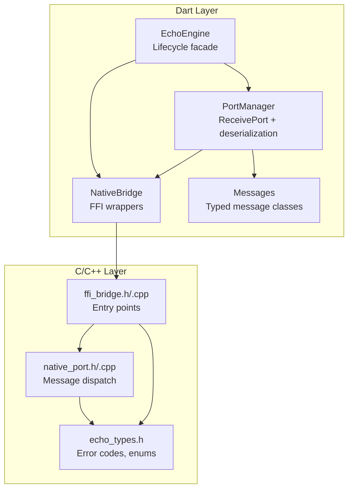
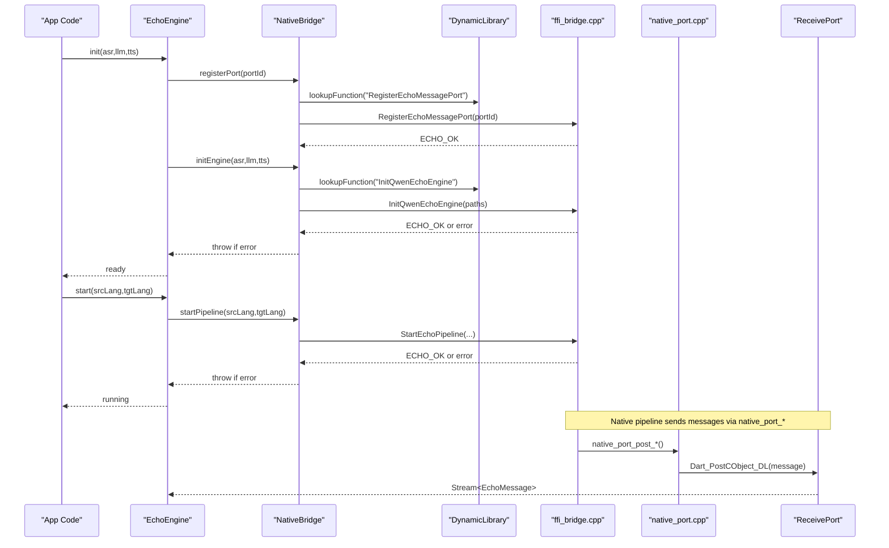
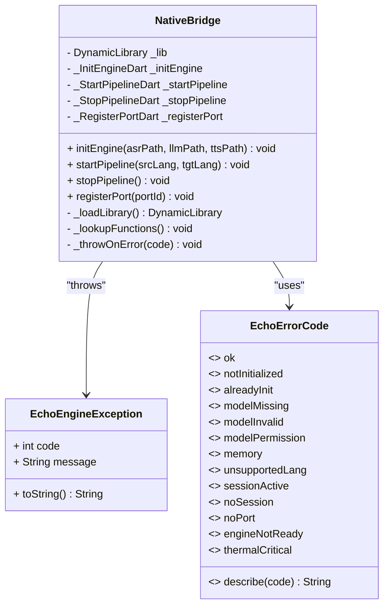
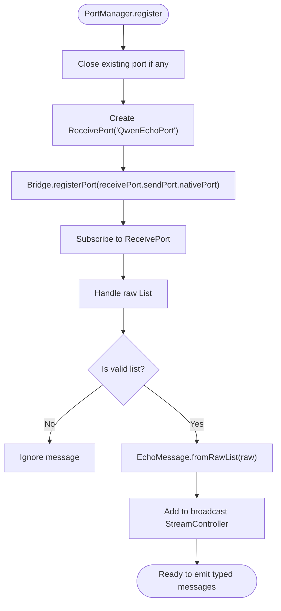
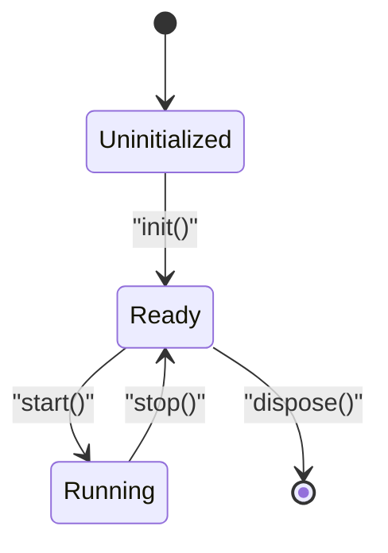
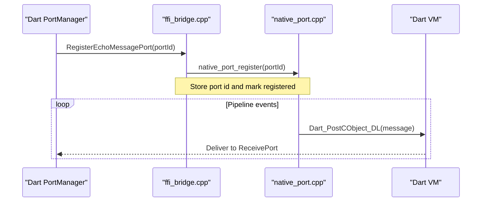
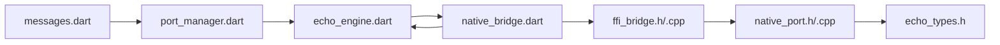

# Dart FFI Bindings Implementation

<cite>
**Referenced Files in This Document**
- [qwen_echo.dart](file://lib/qwen_echo.dart)
- [native_bridge.dart](file://lib/src/native_bridge.dart)
- [echo_engine.dart](file://lib/src/echo_engine.dart)
- [port_manager.dart](file://lib/src/port_manager.dart)
- [messages.dart](file://lib/src/messages.dart)
- [ffi_bridge.h](file://native/include/ffi_bridge.h)
- [ffi_bridge.cpp](file://native/src/ffi_bridge.cpp)
- [native_port.h](file://native/include/native_port.h)
- [native_port.cpp](file://native/src/native_port.cpp)
- [echo_types.h](file://native/include/echo_types.h)
</cite>

## Table of Contents
1. [Introduction](#introduction)
2. [Project Structure](#project-structure)
3. [Core Components](#core-components)
4. [Architecture Overview](#architecture-overview)
5. [Detailed Component Analysis](#detailed-component-analysis)
6. [Dependency Analysis](#dependency-analysis)
7. [Performance Considerations](#performance-considerations)
8. [Troubleshooting Guide](#troubleshooting-guide)
9. [Conclusion](#conclusion)

## Introduction
This document explains the Dart FFI bindings that wrap the native C/C++ QwenEcho engine. It covers how Dart calls native functions, manages memory across language boundaries, and converts types between Dart and C. It documents the NativeBridge class structure, error handling strategies for FFI calls, lifecycle management of native resources, and provides guidance on async/await patterns, exception handling for native errors, and debugging techniques for FFI communication issues.

## Project Structure
The project exposes a small set of C-linkage entry points from the native side and wraps them with typed Dart FFI bindings. The Dart layer composes these bindings into a higher-level facade that manages lifecycle and streams messages back to the UI.

**Diagram sources**
- [native_bridge.dart:103-229](file://lib/src/native_bridge.dart#L103-L229)
- [port_manager.dart:18-84](file://lib/src/port_manager.dart#L18-L84)
- [echo_engine.dart:37-107](file://lib/src/echo_engine.dart#L37-L107)
- [messages.dart:8-33](file://lib/src/messages.dart#L8-L33)
- [ffi_bridge.h:30-77](file://native/include/ffi_bridge.h#L30-L77)
- [ffi_bridge.cpp:54-123](file://native/src/ffi_bridge.cpp#L54-L123)
- [native_port.h:77-172](file://native/include/native_port.h#L77-L172)
- [native_port.cpp:38-75](file://native/src/native_port.cpp#L38-L75)
- [echo_types.h:48-62](file://native/include/echo_types.h#L48-L62)

**Section sources**
- [qwen_echo.dart:1-16](file://lib/qwen_echo.dart#L1-L16)
- [native_bridge.dart:1-229](file://lib/src/native_bridge.dart#L1-L229)
- [echo_engine.dart:1-108](file://lib/src/echo_engine.dart#L1-L108)
- [port_manager.dart:1-85](file://lib/src/port_manager.dart#L1-L85)
- [messages.dart:1-336](file://lib/src/messages.dart#L1-L336)
- [ffi_bridge.h:1-84](file://native/include/ffi_bridge.h#L1-L84)
- [ffi_bridge.cpp:1-124](file://native/src/ffi_bridge.cpp#L1-L124)
- [native_port.h:1-179](file://native/include/native_port.h#L1-L179)
- [native_port.cpp:1-320](file://native/src/native_port.cpp#L1-L320)
- [echo_types.h:1-136](file://native/include/echo_types.h#L1-L136)

## Core Components
- NativeBridge: Loads the platform-specific shared library, resolves function pointers, marshals UTF-8 strings, and throws typed exceptions on non-zero return codes.
- PortManager: Creates a ReceivePort, registers it with the engine, and transforms raw lists into typed EchoMessage objects via a broadcast stream.
- EchoEngine: High-level facade coordinating lifecycle (init → start → stop), composing NativeBridge and PortManager.
- Messages: Strongly-typed Dart classes mirroring the C MessageType enum and payload layouts.
- ffi_bridge.h/.cpp: Minimal C-linkage surface exposing InitQwenEchoEngine, StartEchoPipeline, StopEchoPipeline, RegisterEchoMessagePort.
- native_port.h/.cpp: Serializes typed messages as Dart_CObject arrays and posts them to the registered Dart port.
- echo_types.h: Shared error codes and message type tags used by both sides.

Key responsibilities:
- Type-safe FFI signatures and conversions (UTF-8 string marshaling).
- Centralized error code mapping and Dart exception throwing.
- Asynchronous streaming of results via Dart ports.
- Lifecycle state tracking on the Dart side.

**Section sources**
- [native_bridge.dart:103-229](file://lib/src/native_bridge.dart#L103-L229)
- [port_manager.dart:18-84](file://lib/src/port_manager.dart#L18-L84)
- [echo_engine.dart:37-107](file://lib/src/echo_engine.dart#L37-L107)
- [messages.dart:8-33](file://lib/src/messages.dart#L8-L33)
- [ffi_bridge.h:30-77](file://native/include/ffi_bridge.h#L30-L77)
- [native_port.h:77-172](file://native/include/native_port.h#L77-L172)
- [echo_types.h:48-62](file://native/include/echo_types.h#L48-L62)

## Architecture Overview
The Dart layer uses FFI to call four C functions. After initialization, the Dart side registers a Native Port so the native engine can asynchronously push messages. All synchronous control flows (init/start/stop) return integer status codes; failures are converted to Dart exceptions. Streaming data is delivered via typed messages.

**Diagram sources**
- [echo_engine.dart:66-98](file://lib/src/echo_engine.dart#L66-L98)
- [native_bridge.dart:138-185](file://lib/src/native_bridge.dart#L138-L185)
- [ffi_bridge.cpp:57-121](file://native/src/ffi_bridge.cpp#L57-L121)
- [native_port.cpp:116-317](file://native/src/native_port.cpp#L116-L317)
- [messages.dart:14-33](file://lib/src/messages.dart#L14-L33)

## Detailed Component Analysis

### NativeBridge: FFI Wrappers and Memory Management
Responsibilities:
- Platform-specific dynamic library loading.
- Function pointer resolution for the four C entry points.
- UTF-8 string marshaling using toNativeUtf8 and manual free via calloc.free.
- Error code translation to Dart exceptions.

Memory management highlights:
- Each method that passes strings allocates native memory and frees it in a finally block to avoid leaks.
- No long-lived native buffers are held by Dart; only short-lived UTF-8 copies are created per call.

Error handling:
- Non-zero returns are mapped to EchoEngineException with human-readable messages derived from EchoErrorCode.describe.

Type conversions:
- Dart String → Pointer<Utf8> for C char*.
- int64_t Dart SendPort ID passed as Int64.

**Diagram sources**
- [native_bridge.dart:103-229](file://lib/src/native_bridge.dart#L103-L229)
- [native_bridge.dart:43-93](file://lib/src/native_bridge.dart#L43-L93)

**Section sources**
- [native_bridge.dart:103-229](file://lib/src/native_bridge.dart#L103-L229)
- [native_bridge.dart:43-93](file://lib/src/native_bridge.dart#L43-L93)

### PortManager: Native Port Registration and Message Deserialization
Responsibilities:
- Create a ReceivePort and register its native port ID with the engine.
- Subscribe to incoming messages and transform raw lists into typed EchoMessage instances.
- Provide a broadcast Stream for multiple listeners.

Asynchronous messaging:
- Uses dart:isolate ReceivePort to receive messages posted from native code.
- Deserializes each list according to MessageType tags defined in messages.dart.

**Diagram sources**
- [port_manager.dart:42-50](file://lib/src/port_manager.dart#L42-L50)
- [port_manager.dart:76-83](file://lib/src/port_manager.dart#L76-L83)
- [messages.dart:14-33](file://lib/src/messages.dart#L14-L33)

**Section sources**
- [port_manager.dart:18-84](file://lib/src/port_manager.dart#L18-L84)
- [messages.dart:8-33](file://lib/src/messages.dart#L8-L33)

### EchoEngine: Lifecycle Facade
Responsibilities:
- Compose NativeBridge and PortManager.
- Manage lifecycle states: uninitialized → ready → running.
- Ensure port registration before initialization to allow status messages during init.

State transitions:
- init: register port, initialize engine, transition to ready.
- start: start pipeline, transition to running.
- stop: stop pipeline, transition back to ready.
- dispose: release Dart-side resources without stopping native engine.

**Diagram sources**
- [echo_engine.dart:14-23](file://lib/src/echo_engine.dart#L14-L23)
- [echo_engine.dart:66-98](file://lib/src/echo_engine.dart#L66-L98)

**Section sources**
- [echo_engine.dart:37-107](file://lib/src/echo_engine.dart#L37-L107)

### Native Side: Entry Points and Message Dispatch
- ffi_bridge.h/.cpp: Exposes four C-linkage functions. Maintains a global context with mutex-guarded access to the Engine Manager and port registration state. Enforces preconditions such as port registration before starting/stopping the pipeline.
- native_port.h/.cpp: Provides typed post functions that serialize payloads into Dart_CObject arrays and dispatch them through the registered Dart port. Uses atomic variables for thread-safe access to port state and supports runtime injection of the posting function for testing.

**Diagram sources**
- [ffi_bridge.cpp:108-121](file://native/src/ffi_bridge.cpp#L108-L121)
- [native_port.cpp:38-52](file://native/src/native_port.cpp#L38-L52)
- [native_port.cpp:62-75](file://native/src/native_port.cpp#L62-L75)

**Section sources**
- [ffi_bridge.h:30-77](file://native/include/ffi_bridge.h#L30-L77)
- [ffi_bridge.cpp:54-123](file://native/src/ffi_bridge.cpp#L54-L123)
- [native_port.h:77-172](file://native/include/native_port.h#L77-L172)
- [native_port.cpp:38-75](file://native/src/native_port.cpp#L38-L75)

### Type Conversions and Message Schema
- Dart String ↔ C const char*: Marshaled via UTF-8 pointers; freed after use.
- Dart int64 ↔ C int64_t: Used for SendPort IDs and timestamps.
- Dart double ↔ C double: Used for temperature values.
- Message schema: Each message is a List<int/String/double> starting with a type tag matching MessageType constants.

Examples of mappings:
- ASR partial: [type=1, speaker_id, text, timestamp_ms]
- Translation done: [type=4, speaker_id, full_text, segment_id]
- Thermal state: [type=11, thermal_mode, temperature_c]
- Memory warning: [type=12, current_bytes, limit_bytes, level]

**Section sources**
- [messages.dart:36-49](file://lib/src/messages.dart#L36-L49)
- [messages.dart:52-335](file://lib/src/messages.dart#L52-L335)
- [native_port.h:100-172](file://native/include/native_port.h#L100-L172)

## Dependency Analysis
High-level dependencies:
- Dart layer depends on dart:ffi, dart:io, package:ffi for memory allocation utilities.
- EchoEngine depends on NativeBridge and PortManager.
- PortManager depends on NativeBridge and messages.dart.
- Native layer depends on echo_types.h for shared enums and error codes.

**Diagram sources**
- [echo_engine.dart:37-107](file://lib/src/echo_engine.dart#L37-L107)
- [port_manager.dart:18-84](file://lib/src/port_manager.dart#L18-L84)
- [native_bridge.dart:103-229](file://lib/src/native_bridge.dart#L103-L229)
- [ffi_bridge.cpp:54-123](file://native/src/ffi_bridge.cpp#L54-L123)
- [native_port.cpp:38-75](file://native/src/native_port.cpp#L38-L75)
- [echo_types.h:48-62](file://native/include/echo_types.h#L48-L62)

**Section sources**
- [qwen_echo.dart:1-16](file://lib/qwen_echo.dart#L1-L16)
- [echo_engine.dart:37-107](file://lib/src/echo_engine.dart#L37-L107)
- [native_bridge.dart:103-229](file://lib/src/native_bridge.dart#L103-L229)
- [native_port.cpp:38-75](file://native/src/native_port.cpp#L38-L75)
- [echo_types.h:48-62](file://native/include/echo_types.h#L48-L62)

## Performance Considerations
- Minimize allocations: Reuse message buffers where possible on the native side; keep Dart-side parsing lightweight.
- Avoid blocking the main isolate: Use streams and async handlers to process high-frequency messages.
- Throttle logging: Excessive logging in hot paths can degrade performance.
- Prefer compact messages: Keep payloads minimal to reduce serialization overhead.
- Monitor resource usage: Leverage memory and thermal warnings to adapt behavior proactively.

[No sources needed since this section provides general guidance]

## Troubleshooting Guide
Common issues and remedies:
- Library load failures:
  - Verify platform-specific library names and availability.
  - On iOS/macOS, ensure symbols are exported and accessible via process or dylib.
- Missing port registration:
  - Ensure registerPort is called before startPipeline or stopPipeline.
  - Confirm the ReceivePort is created and not closed prematurely.
- Type mismatches:
  - Validate MessageType tags and payload lengths match the expected schema.
  - Check numeric types (int vs int64, double) align with native definitions.
- Memory leaks:
  - Ensure all allocated UTF-8 buffers are freed after FFI calls.
  - Dispose PortManager when tearing down the engine.
- Async delivery problems:
  - Confirm Dart_PostCObject_DL is available or injected for tests.
  - Inspect whether messages are being dropped due to an unregistered port.

Debugging techniques:
- Log error codes and messages from EchoErrorCode.describe.
- Wrap FFI calls with try/catch to capture EchoEngineException details.
- Add temporary logging around message parsing to verify raw list shapes.
- Use unit tests with a mock post function to validate message serialization.

**Section sources**
- [native_bridge.dart:138-185](file://lib/src/native_bridge.dart#L138-L185)
- [native_bridge.dart:224-228](file://lib/src/native_bridge.dart#L224-L228)
- [port_manager.dart:42-50](file://lib/src/port_manager.dart#L42-L50)
- [native_port.cpp:62-75](file://native/src/native_port.cpp#L62-L75)
- [echo_types.h:48-62](file://native/include/echo_types.h#L48-L62)

## Conclusion
The Dart FFI bindings provide a clean, type-safe interface to the native QwenEcho engine. NativeBridge handles platform loading, function resolution, and safe memory management. PortManager enables asynchronous streaming of rich, typed messages. EchoEngine orchestrates lifecycle and state transitions. Together, they form a robust bridge that balances safety, performance, and usability while offering clear error reporting and extensibility for future enhancements.