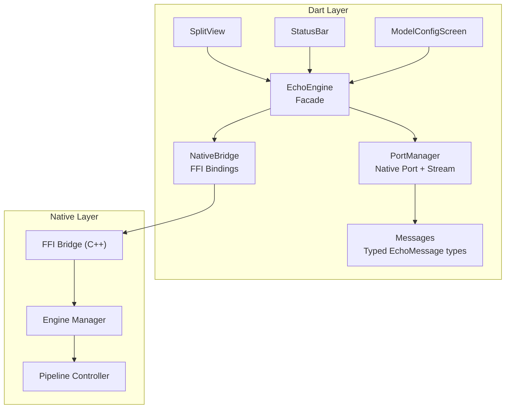
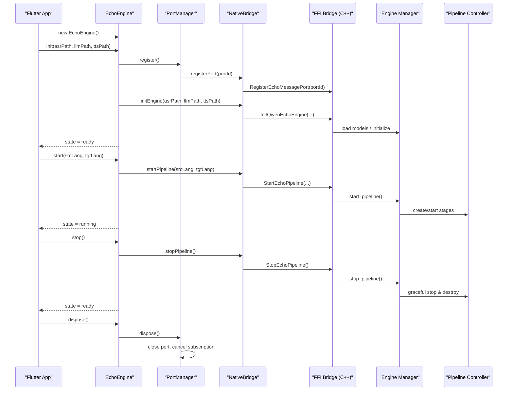
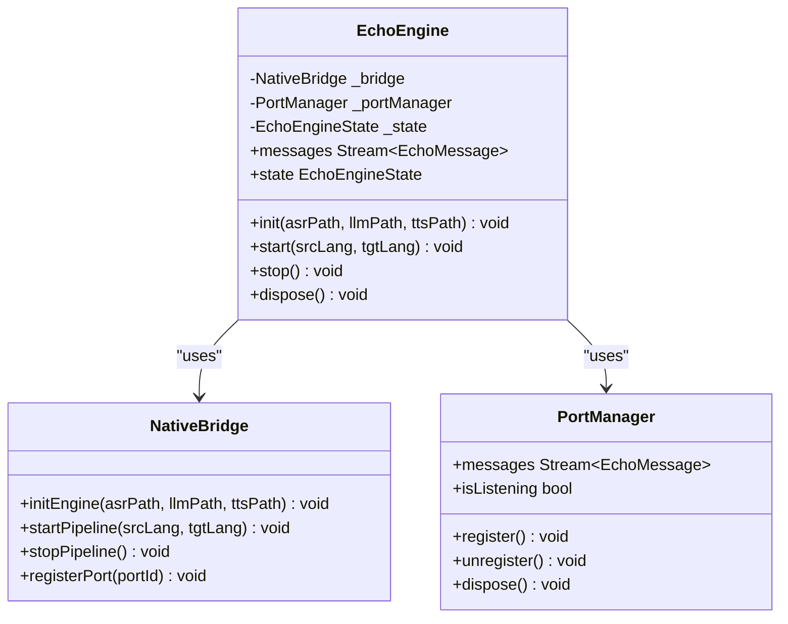
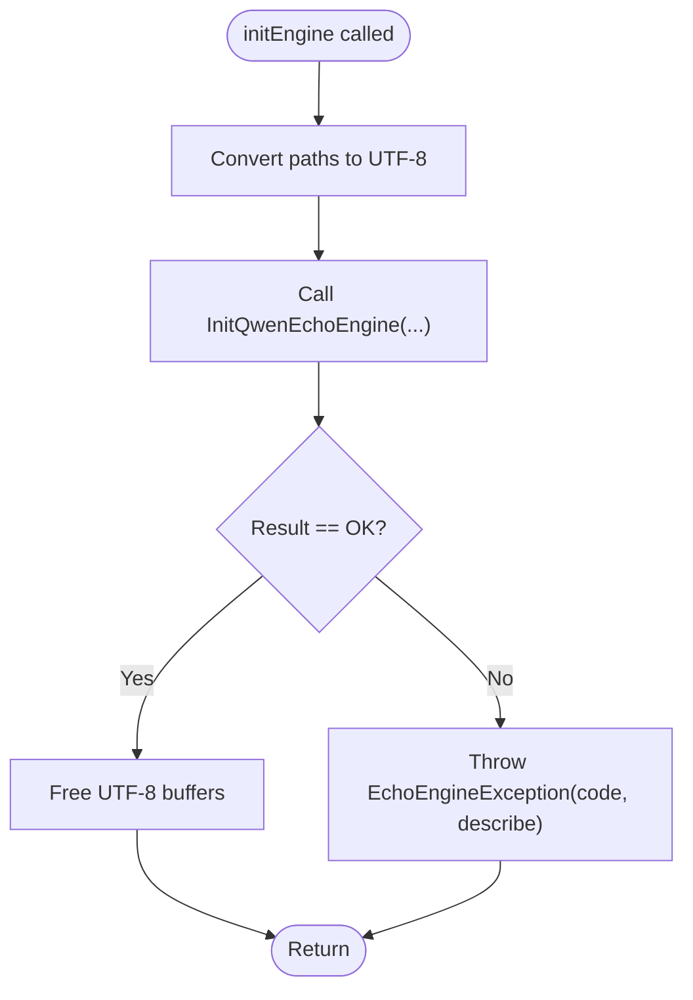
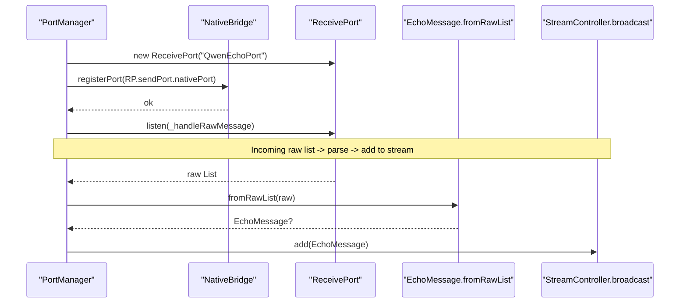
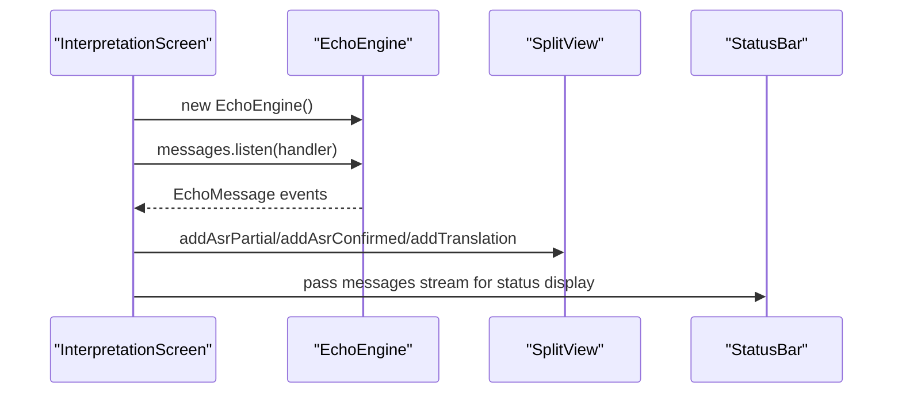
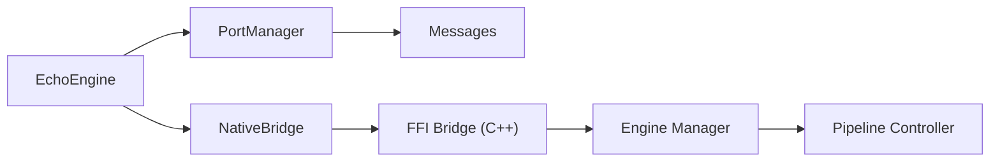

# EchoEngine High-Level Facade

<cite>
**Referenced Files in This Document**
- [qwen_echo.dart](file://lib/qwen_echo.dart)
- [echo_engine.dart](file://lib/src/echo_engine.dart)
- [native_bridge.dart](file://lib/src/native_bridge.dart)
- [port_manager.dart](file://lib/src/port_manager.dart)
- [messages.dart](file://lib/src/messages.dart)
- [main.dart](file://lib/main.dart)
- [split_view.dart](file://lib/src/ui/split_view.dart)
- [status_bar.dart](file://lib/src/ui/status_bar.dart)
- [model_config_screen.dart](file://lib/src/ui/model_config_screen.dart)
- [ffi_bridge.cpp](file://native/src/ffi_bridge.cpp)
- [pipeline_controller.cpp](file://native/src/pipeline_controller.cpp)
- [engine_manager.cpp](file://native/src/engine_manager.cpp)
- [README.md](file://README.md)
</cite>

## Table of Contents
1. [Introduction](#introduction)
2. [Project Structure](#project-structure)
3. [Core Components](#core-components)
4. [Architecture Overview](#architecture-overview)
5. [Detailed Component Analysis](#detailed-component-analysis)
6. [Dependency Analysis](#dependency-analysis)
7. [Performance Considerations](#performance-considerations)
8. [Troubleshooting Guide](#troubleshooting-guide)
9. [Conclusion](#conclusion)
10. [Appendices](#appendices)

## Introduction
This document explains the EchoEngine facade, a high-level Dart API that unifies NativeBridge and PortManager to provide a simple, safe interface for initializing, starting, stopping, and cleaning up the on-device simultaneous interpretation engine. It covers:
- Facade pattern implementation and simplified method signatures
- Automatic resource management (ports, streams, FFI memory)
- Complete lifecycle from initialization through pipeline control to cleanup
- Typical usage patterns and Flutter widget integration
- Configuration options, error handling at the application level, performance considerations, and best practices for production

## Project Structure
The EchoEngine facade lives in the Dart layer and orchestrates:
- NativeBridge: Dart FFI bindings to the native C/C++ engine
- PortManager: Native Port registration and typed message stream
- Messages: Typed message classes for ASR, translation, TTS, diagnostics
- UI components: SplitView, StatusBar, ModelConfigScreen

**Diagram sources**
- [echo_engine.dart:1-108](file://lib/src/echo_engine.dart#L1-L108)
- [native_bridge.dart:1-230](file://lib/src/native_bridge.dart#L1-L230)
- [port_manager.dart:1-84](file://lib/src/port_manager.dart#L1-L84)
- [messages.dart:1-336](file://lib/src/messages.dart#L1-L336)
- [ffi_bridge.cpp:1-123](file://native/src/ffi_bridge.cpp#L1-L123)
- [engine_manager.cpp:1-34](file://native/src/engine_manager.cpp#L1-L34)
- [pipeline_controller.cpp:141-487](file://native/src/pipeline_controller.cpp#L141-L487)

**Section sources**
- [qwen_echo.dart:1-16](file://lib/qwen_echo.dart#L1-L16)
- [README.md:15-93](file://README.md#L15-L93)

## Core Components
- EchoEngine: The facade providing init(), start(), stop(), dispose() and a messages stream. It encapsulates lifecycle state transitions and delegates to NativeBridge and PortManager.
- NativeBridge: Loads platform-specific shared libraries and exposes typed methods for InitQwenEchoEngine, StartEchoPipeline, StopEchoPipeline, RegisterEchoMessagePort. Throws EchoEngineException on non-zero returns.
- PortManager: Creates a ReceivePort, registers it with the native engine, deserializes raw lists into typed EchoMessage objects, and exposes a broadcast Stream<EchoMessage>.
- Messages: Defines all message types (ASR partial/confirmed, translation streaming/done, TTS started/completed, errors, thermal/memory/latency warnings, sample drops).

Key responsibilities:
- EchoEngine manages state (uninitialized → ready → running), coordinates port registration before engine init, and ensures proper disposal.
- NativeBridge handles FFI function lookup, UTF-8 string allocation/freeing, and error-to-exception mapping.
- PortManager owns the receive port lifecycle and message parsing.

**Section sources**
- [echo_engine.dart:25-108](file://lib/src/echo_engine.dart#L25-L108)
- [native_bridge.dart:99-230](file://lib/src/native_bridge.dart#L99-L230)
- [port_manager.dart:18-84](file://lib/src/port_manager.dart#L18-L84)
- [messages.dart:7-49](file://lib/src/messages.dart#L7-L49)

## Architecture Overview
The EchoEngine facade hides complexity behind a small set of methods while ensuring correct ordering of operations and resource cleanup.

**Diagram sources**
- [echo_engine.dart:60-108](file://lib/src/echo_engine.dart#L60-L108)
- [native_bridge.dart:132-186](file://lib/src/native_bridge.dart#L132-L186)
- [ffi_bridge.cpp:95-123](file://native/src/ffi_bridge.cpp#L95-L123)
- [engine_manager.cpp:1-34](file://native/src/engine_manager.cpp#L1-L34)
- [pipeline_controller.cpp:389-487](file://native/src/pipeline_controller.cpp#L389-L487)

## Detailed Component Analysis

### EchoEngine Facade
- Responsibilities:
  - Maintain lifecycle state (uninitialized, ready, running)
  - Ensure port is registered before engine init
  - Provide a single messages stream via PortManager
  - Expose simple methods: init(), start(), stop(), dispose()
- Simplified API:
  - init(asrPath, llmPath, ttsPath): Registers port, initializes engine, sets state to ready
  - start(srcLang, tgtLang): Starts pipeline, sets state to running
  - stop(): Stops pipeline gracefully, resets state to ready
  - dispose(): Disposes PortManager resources; does not stop native engine automatically
- Error handling:
  - Delegates exceptions to NativeBridge, which throws EchoEngineException with human-readable messages

**Diagram sources**
- [echo_engine.dart:25-108](file://lib/src/echo_engine.dart#L25-L108)
- [native_bridge.dart:99-186](file://lib/src/native_bridge.dart#L99-L186)
- [port_manager.dart:18-84](file://lib/src/port_manager.dart#L18-L84)

**Section sources**
- [echo_engine.dart:25-108](file://lib/src/echo_engine.dart#L25-L108)

### NativeBridge FFI Bindings
- Responsibilities:
  - Load platform-specific library (Android .so, iOS/macOS dylib or process)
  - Lookup functions: InitQwenEchoEngine, StartEchoPipeline, StopEchoPipeline, RegisterEchoMessagePort
  - Convert Dart strings to UTF-8, free allocated memory in finally blocks
  - Throw EchoEngineException when native returns non-zero
- Error codes:
  - Mirrors native EchoErrorCode enum with human-readable descriptions

**Diagram sources**
- [native_bridge.dart:132-150](file://lib/src/native_bridge.dart#L132-L150)
- [native_bridge.dart:224-229](file://lib/src/native_bridge.dart#L224-L229)

**Section sources**
- [native_bridge.dart:99-230](file://lib/src/native_bridge.dart#L99-L230)

### PortManager and Message Flow
- Responsibilities:
  - Create ReceivePort and register with native engine
  - Listen for raw lists and parse them into typed EchoMessage instances
  - Expose a broadcast Stream<EchoMessage> for multiple subscribers
- Lifecycle:
  - register(): closes existing port if any, creates new ReceivePort, registers with native, starts listening
  - unregister(): closes current port
  - dispose(): cancels subscription, closes port, closes controller

**Diagram sources**
- [port_manager.dart:38-84](file://lib/src/port_manager.dart#L38-L84)
- [messages.dart:14-33](file://lib/src/messages.dart#L14-L33)

**Section sources**
- [port_manager.dart:18-84](file://lib/src/port_manager.dart#L18-L84)
- [messages.dart:7-49](file://lib/src/messages.dart#L7-L49)

### Flutter Integration Examples
- Initialization and lifecycle in a StatefulWidget:
  - Construct EchoEngine in initState
  - Subscribe to messages stream
  - In dispose, cancel subscription and call dispose()
- Routing messages to UI:
  - AsrPartialMessage/AsrConfirmedMessage update originating speaker half
  - TranslationStreamMessage updates opposing speaker half
  - Thermal/Memory/Latency warnings handled by StatusBar overlay

**Diagram sources**
- [main.dart:47-105](file://lib/main.dart#L47-L105)
- [split_view.dart:52-77](file://lib/src/ui/split_view.dart#L52-L77)
- [status_bar.dart:74-99](file://lib/src/ui/status_bar.dart#L74-L99)

**Section sources**
- [main.dart:47-105](file://lib/main.dart#L47-L105)
- [split_view.dart:16-118](file://lib/src/ui/split_view.dart#L16-L118)
- [status_bar.dart:56-123](file://lib/src/ui/status_bar.dart#L56-L123)

### Configuration Options
- Model paths:
  - ASR, LLM, TTS GGUF model file paths are required for init()
- Language pair:
  - ISO 639-1 codes for srcLang and tgtLang in start()
- Platform library loading:
  - Android: libqwen_echo.so
  - iOS/macOS: process or libqwen_echo.dylib
- Offline policy:
  - No network after provisioning; models stored locally

**Section sources**
- [echo_engine.dart:60-87](file://lib/src/echo_engine.dart#L60-L87)
- [native_bridge.dart:191-207](file://lib/src/native_bridge.dart#L191-L207)
- [README.md:177-185](file://README.md#L177-L185)

## Dependency Analysis
High-level dependencies between Dart components and native modules:

**Diagram sources**
- [echo_engine.dart:1-108](file://lib/src/echo_engine.dart#L1-L108)
- [native_bridge.dart:1-230](file://lib/src/native_bridge.dart#L1-L230)
- [port_manager.dart:1-84](file://lib/src/port_manager.dart#L1-L84)
- [ffi_bridge.cpp:1-123](file://native/src/ffi_bridge.cpp#L1-L123)
- [engine_manager.cpp:1-34](file://native/src/engine_manager.cpp#L1-L34)
- [pipeline_controller.cpp:141-487](file://native/src/pipeline_controller.cpp#L141-L487)

**Section sources**
- [qwen_echo.dart:1-16](file://lib/qwen_echo.dart#L1-L16)

## Performance Considerations
- Pipeline budgets:
  - ASR first-character ≤200ms (Normal/Throttle)
  - LLM first-token ≤450ms (Normal/Throttle)
  - TTS time-to-first-audio ≤100ms (Normal/Throttle)
  - E2E total ≤800ms (Normal), ≤1200ms (Throttle)
- Thermal management:
  - Normal ≤42°C: full performance, larger context
  - Throttle >43°C: reduced context, lower ASR rate
  - Critical >50°C: pause pipeline until temperature drops
- Memory budget:
  - Level 1 (85%): release KV caches and TTS buffers
  - Level 2 (95%): stop pipeline to prevent OOM
- Best practices:
  - Avoid repeated init calls; reuse a single EchoEngine instance per app session
  - Always call stop() before dispose() if a session is active
  - Monitor thermal and memory warnings via StatusBar and WarningOverlay
  - Keep language pairs within supported set to avoid unsupportedLang errors

[No sources needed since this section provides general guidance]

## Troubleshooting Guide
Common issues and resolutions:
- Engine not initialized:
  - Ensure init() is called before start()
  - Verify model files exist and are valid GGUF/INT4
- Already initialized:
  - Do not call init() again; reuse the same EchoEngine instance
- Unsupported language pair:
  - Use valid ISO 639-1 codes recognized by the engine
- Session already active:
  - Call stop() before starting another session
- No Native Port registered:
  - Ensure PortManager.register() is invoked during init()
- Critical thermal state:
  - Allow device to cool; pipeline may be paused automatically
- Memory pressure:
  - Expect automatic cache releases and possible pipeline stop at critical levels

Error reporting:
- EchoEngineException carries code and human-readable message
- ErrorMessage events include errorCode, modelName, detail for deeper diagnostics

**Section sources**
- [native_bridge.dart:43-93](file://lib/src/native_bridge.dart#L43-L93)
- [messages.dart:201-224](file://lib/src/messages.dart#L201-L224)
- [README.md:140-163](file://README.md#L140-L163)

## Conclusion
EchoEngine provides a clean, high-level facade that simplifies interaction with the native QwenEcho engine. By combining NativeBridge and PortManager, it offers straightforward lifecycle management, robust error handling, and seamless integration with Flutter widgets. Following the recommended usage patterns and monitoring thermal/memory conditions will ensure reliable operation in production environments.

[No sources needed since this section summarizes without analyzing specific files]

## Appendices

### Typical Usage Patterns
- Basic lifecycle:
  - Create EchoEngine
  - Subscribe to messages
  - init(model paths)
  - start(language pair)
  - stop()
  - dispose()
- Flutter widget integration:
  - Route ASR and translation messages to SplitView halves
  - Display thermal and warning indicators via StatusBar and WarningOverlay
- Model configuration:
  - Use ModelConfigScreen to import/remove GGUF models locally

**Section sources**
- [main.dart:47-105](file://lib/main.dart#L47-L105)
- [model_config_screen.dart:17-150](file://lib/src/ui/model_config_screen.dart#L17-L150)