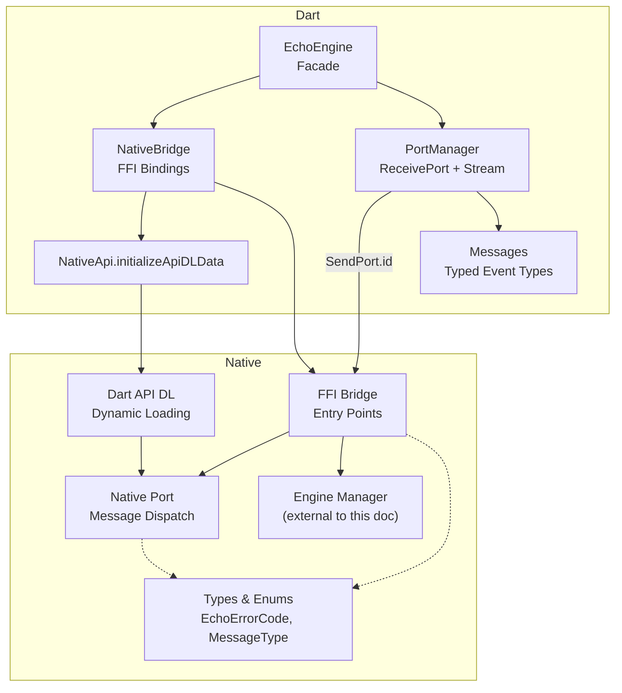
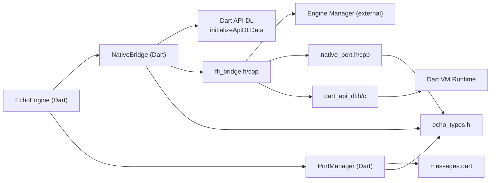

# FFI Bridge and Dart Integration

<cite>
**Referenced Files in This Document**
- [ffi_bridge.h](file://native/include/ffi_bridge.h)
- [ffi_bridge.cpp](file://native/src/ffi_bridge.cpp)
- [dart_api_dl.h](file://native/include/dart_api_dl.h)
- [dart_api_dl.c](file://native/src/dart_api_dl.c)
- [dart_api_dl_impl.h](file://native/include/internal/dart_api_dl_impl.h)
- [native_port.h](file://native/include/native_port.h)
- [native_port.cpp](file://native/src/native_port.cpp)
- [echo_types.h](file://native/include/echo_types.h)
- [native_bridge.dart](file://lib/src/native_bridge.dart)
- [port_manager.dart](file://lib/src/port_manager.dart)
- [messages.dart](file://lib/src/messages.dart)
- [echo_engine.dart](file://lib/src/echo_engine.dart)
</cite>

## Update Summary
**Changes Made**
- Added comprehensive documentation for the new InitDartApiDL() function and Dart API dynamic loading subsystem
- Updated the four C-linkage entry points section to include the fifth entry point (InitDartApiDL)
- Enhanced the architecture overview to show the Dart API DL initialization flow
- Updated the EchoEngine facade lifecycle to reflect the new initialization sequence
- Added detailed explanation of the Dart API DL mechanism and its importance for Flutter integration
- Updated troubleshooting guide with common issues related to Dart API DL initialization

## Table of Contents
1. [Introduction](#introduction)
2. [Project Structure](#project-structure)
3. [Core Components](#core-components)
4. [Architecture Overview](#architecture-overview)
5. [Detailed Component Analysis](#detailed-component-analysis)
6. [Dependency Analysis](#dependency-analysis)
7. [Performance Considerations](#performance-considerations)
8. [Troubleshooting Guide](#troubleshooting-guide)
9. [Conclusion](#conclusion)
10. [Appendices](#appendices)

## Introduction
This document explains QwenEcho's cross-language communication layer between the native C/C++ engine and the Dart runtime. It focuses on:
- The five C-linkage entry points exposed via FFI, including the new Dart API dynamic loading initialization
- Dart FFI bindings and error handling
- The Port Manager's asynchronous message delivery system
- The typed event system for inter-process communication
- The EchoEngine facade that combines NativeBridge and PortManager
- Practical guidance for extending the interface, handling async operations, and debugging issues

## Project Structure
The FFI bridge spans two layers with enhanced Dart API dynamic loading support:
- Native side (C/C++): public C-linkage API, Dart API DL initialization, port registration, and typed message dispatch
- Dart side: FFI bindings, port manager, typed messages, and a high-level facade



**Diagram sources**
- [ffi_bridge.h:1-97](file://native/include/ffi_bridge.h#L1-L97)
- [ffi_bridge.cpp:1-149](file://native/src/ffi_bridge.cpp#L1-L149)
- [dart_api_dl.h:1-175](file://native/include/dart_api_dl.h#L1-L175)
- [dart_api_dl.c:45-79](file://native/src/dart_api_dl.c#L45-L79)
- [native_port.h:1-179](file://native/include/native_port.h#L1-L179)
- [native_port.cpp:1-320](file://native/src/native_port.cpp#L1-L320)
- [echo_types.h:1-136](file://native/include/echo_types.h#L1-L136)
- [native_bridge.dart:1-249](file://lib/src/native_bridge.dart#L1-L249)
- [port_manager.dart:1-85](file://lib/src/port_manager.dart#L1-L85)
- [messages.dart:1-336](file://lib/src/messages.dart#L1-L336)
- [echo_engine.dart:1-111](file://lib/src/echo_engine.dart#L1-L111)

**Section sources**
- [ffi_bridge.h:1-97](file://native/include/ffi_bridge.h#L1-L97)
- [ffi_bridge.cpp:1-149](file://native/src/ffi_bridge.cpp#L1-L149)
- [dart_api_dl.h:1-175](file://native/include/dart_api_dl.h#L1-L175)
- [dart_api_dl.c:45-79](file://native/src/dart_api_dl.c#L45-L79)
- [native_port.h:1-179](file://native/include/native_port.h#L1-L179)
- [native_port.cpp:1-320](file://native/src/native_port.cpp#L1-L320)
- [echo_types.h:1-136](file://native/include/echo_types.h#L1-L136)
- [native_bridge.dart:1-249](file://lib/src/native_bridge.dart#L1-L249)
- [port_manager.dart:1-85](file://lib/src/port_manager.dart#L1-L85)
- [messages.dart:1-336](file://lib/src/messages.dart#L1-L336)
- [echo_engine.dart:1-111](file://lib/src/echo_engine.dart#L1-L111)

## Core Components
- **Enhanced C-linkage entry points (FFI Bridge)**:
  - InitDartApiDL(data) - Initialize Dart API dynamic loading subsystem
  - InitQwenEchoEngine(asr_path, llm_path, tts_path)
  - StartEchoPipeline(source_lang, target_lang)
  - StopEchoPipeline()
  - RegisterEchoMessagePort(dart_port_id)
- Dart FFI bindings (NativeBridge):
  - Loads platform-specific shared library
  - Exposes typed methods with UTF-8 marshalling and error throwing
  - Integrates with NativeApi.initializeApiDLData for dynamic loading
- Port Manager:
  - Creates a ReceivePort, registers it with the engine
  - Deserializes raw lists into typed EchoMessage objects and exposes a broadcast Stream
- Typed event system (Messages):
  - Message type tags and strongly-typed Dart classes for ASR, translation, TTS, errors, thermal, memory, latency, and sample drops
- EchoEngine facade:
  - Orchestrates lifecycle (init → start → stop), integrates NativeBridge and PortManager, and exposes a unified Stream<EchoMessage>

Key responsibilities and interactions are detailed in the following sections.

**Section sources**
- [ffi_bridge.h:17-90](file://native/include/ffi_bridge.h#L17-L90)
- [ffi_bridge.cpp:64-146](file://native/src/ffi_bridge.cpp#L64-L146)
- [native_bridge.dart:103-241](file://lib/src/native_bridge.dart#L103-L241)
- [port_manager.dart:18-84](file://lib/src/port_manager.dart#L18-L84)
- [messages.dart:8-49](file://lib/src/messages.dart#L8-L49)
- [echo_engine.dart:37-110](file://lib/src/echo_engine.dart#L37-L110)

## Architecture Overview
End-to-end flow from Dart to native and back, with Dart API DL initialization:

```mermaid
sequenceDiagram
participant UI as "Dart UI"
participant Facade as "EchoEngine"
participant Bridge as "NativeBridge"
participant DL as "Dart API DL"
participant FFI as "FFI Bridge (C)"
participant NPort as "Native Port"
participant DartVM as "Dart VM"
participant PM as "PortManager"
UI->>Facade : init(asr,llm,tts)
Facade->>Bridge : initDartApiDL()
Bridge->>DL : Dart_InitializeApiDL(NativeApi.initializeApiDLData)
DL-->>Bridge : Success (Dart_PostCObject_DL available)
Bridge-->>Facade : success
Facade->>PM : register()
PM->>Bridge : registerPort(portId)
Bridge->>FFI : RegisterEchoMessagePort(portId)
FFI-->>Bridge : ECHO_OK
Bridge-->>PM : success
Facade->>Bridge : initEngine(paths)
Bridge->>FFI : InitQwenEchoEngine(...)
FFI-->>Bridge : ECHO_OK or error
Bridge-->>Facade : throws if error
UI->>Facade : start(srcLang, tgtLang)
Facade->>Bridge : startPipeline(srcLang, tgtLang)
Bridge->>FFI : StartEchoPipeline(...)
FFI-->>Bridge : ECHO_OK or error
Bridge-->>Facade : throws if error
Note over FFI,NPort : Pipeline runs; events posted via Native Port using Dart_PostCObject_DL
FFI->>NPort : post_* functions
NPort->>DartVM : Dart_PostCObject_DL(portId, array)
DartVM-->>PM : List<dynamic>
PM->>PM : parse to EchoMessage
PM-->>UI : Stream<EchoMessage>
```

**Diagram sources**
- [ffi_bridge.h:17-90](file://native/include/ffi_bridge.h#L17-L90)
- [ffi_bridge.cpp:117-146](file://native/src/ffi_bridge.cpp#L117-L146)
- [dart_api_dl.h:27](file://native/include/dart_api_dl.h#L27)
- [dart_api_dl.c:45-79](file://native/src/dart_api_dl.c#L45-L79)
- [native_port.h:69-94](file://native/include/native_port.h#L69-L94)
- [native_port.cpp:36-75](file://native/src/native_port.cpp#L36-L75)
- [native_bridge.dart:188-191](file://lib/src/native_bridge.dart#L188-L191)
- [port_manager.dart:42-50](file://lib/src/port_manager.dart#L42-L50)
- [messages.dart:14-33](file://lib/src/messages.dart#L14-L33)
- [echo_engine.dart:71-78](file://lib/src/echo_engine.dart#L71-L78)

## Detailed Component Analysis

### C-linkage Entry Points (FFI Bridge)
Responsibilities:
- Initialize Dart API dynamic loading subsystem for reliable message passing
- Initialize engine with model paths
- Start/stop pipeline with language pair validation and port checks
- Register Dart SendPort ID for asynchronous messaging

**Updated** Added new InitDartApiDL function as the first required initialization step

Parameter specifications:
- **InitDartApiDL(void* data)** - NEW ENTRY POINT
  - Must be called before any other FFI function
  - Takes NativeApi.initializeApiDLData from Dart
  - Initializes Dart API dynamic loading and makes Dart_PostCObject_DL available
  - Returns ECHO_OK on success, ECHO_ERR_NOT_INITIALIZED on failure
- InitQwenEchoEngine(const char* asr_path, const char* llm_path, const char* tts_path)
  - Requires InitDartApiDL to have been called first
  - Returns ECHO_OK on success; negative EchoErrorCode on failure
- StartEchoPipeline(const char* source_lang, const char* target_lang)
  - Requires initialized engine and registered port; returns ECHO_OK or specific errors
- StopEchoPipeline(void)
  - Requires active session and registered port; returns ECHO_OK or specific errors
- RegisterEchoMessagePort(int64_t dart_port_id)
  - Requires InitDartApiDL to have been called first
  - Stores port ID and forwards to native_port module; returns ECHO_OK

Error codes:
- Defined centrally in echo_types.h and mirrored in Dart for user-friendly descriptions

Concurrency:
- All entry points lock a global mutex to protect engine manager access and port state

**Section sources**
- [ffi_bridge.h:17-90](file://native/include/ffi_bridge.h#L17-L90)
- [ffi_bridge.cpp:64-146](file://native/src/ffi_bridge.cpp#L64-L146)
- [echo_types.h:48-62](file://native/include/echo_types.h#L48-L62)

### Dart API Dynamic Loading Subsystem
**NEW SECTION**

The Dart API dynamic loading subsystem enables reliable communication between Dart and native code by dynamically loading the Dart API symbols at runtime. This is essential for Flutter's dynamic loading mechanism.

Key components:
- **Dart_InitializeApiDL**: Core initialization function that sets up function pointers
- **DartApi structure**: Contains version information and function pointer table
- **Function pointer resolution**: Maps Dart API symbols to their runtime addresses
- **Version compatibility checking**: Ensures Dart VM compatibility at runtime

Initialization process:
1. Dart passes NativeApi.initializeApiDLData to native code
2. Native code calls Dart_InitializeApiDL with this data
3. Function pointers for all supported Dart APIs are resolved
4. Dart_PostCObject_DL becomes available for message posting

**Section sources**
- [dart_api_dl.h:13-27](file://native/include/dart_api_dl.h#L13-L27)
- [dart_api_dl.c:45-79](file://native/src/dart_api_dl.c#L45-L79)
- [dart_api_dl_impl.h:10-21](file://native/include/internal/dart_api_dl_impl.h#L10-L21)

### Dart FFI Bindings (NativeBridge)
Responsibilities:
- Load platform-specific native library
- Lookup and bind the five C functions (including InitDartApiDL)
- Convert Dart strings to UTF-8 and free memory safely
- Throw EchoEngineException on non-zero return codes
- Integrate with NativeApi.initializeApiDLData for dynamic loading

**Updated** Added support for InitDartApiDL function binding and integration

Platform loading strategy:
- Android/Linux: libqwen_echo.so
- iOS/macOS: process first, fallback to libqwen_echo.dylib

Error handling:
- Mirrors EchoErrorCode enum values
- Provides human-readable descriptions via describe(code)

Memory management:
- Uses ffi package calloc/free for UTF-8 buffers

**Section sources**
- [native_bridge.dart:103-241](file://lib/src/native_bridge.dart#L103-L241)
- [native_bridge.dart:43-75](file://lib/src/native_bridge.dart#L43-L75)

### Port Manager (Asynchronous Message Delivery)
Responsibilities:
- Create a ReceivePort and register its nativePort id with the engine
- Listen for incoming messages and deserialize them into typed EchoMessage objects
- Expose a broadcast Stream<EchoMessage> for multiple subscribers
- Manage lifecycle (register/unregister/dispose)

Behavior:
- If a port is already registered, it closes and replaces it
- Incoming raw lists are parsed by EchoMessage.fromRawList; unknown formats are ignored

**Section sources**
- [port_manager.dart:18-84](file://lib/src/port_manager.dart#L18-L84)
- [messages.dart:14-33](file://lib/src/messages.dart#L14-L33)

### Typed Event System (Messages)
Responsibilities:
- Define message type tags matching native MessageType enum
- Provide strongly-typed Dart classes for each event
- Parse raw arrays into typed objects

Supported events:
- ASR partial and confirmed
- Translation stream tokens and completion
- TTS started and complete
- Error notifications
- Thermal state changes
- Memory warnings
- Latency warnings
- Sample drop detection

**Section sources**
- [messages.dart:8-49](file://lib/src/messages.dart#L8-L49)
- [messages.dart:52-335](file://lib/src/messages.dart#L52-L335)
- [echo_types.h:30-42](file://native/include/echo_types.h#L30-L42)

### EchoEngine Facade
Responsibilities:
- Combine NativeBridge and PortManager into a single high-level API
- Manage lifecycle states: uninitialized → ready → running
- Ensure Dart API DL is initialized before any other operations
- Ensure port is registered before initialization so status messages can be received
- Expose Stream<EchoMessage> for UI consumption

**Updated** Enhanced lifecycle to include Dart API DL initialization as the first step

Lifecycle:
- **init**: Call initDartApiDL(), register port, call initEngine, set state to ready
- start: call startPipeline, set state to running
- stop: call stopPipeline, reset state to ready
- dispose: close port resources

**Section sources**
- [echo_engine.dart:37-110](file://lib/src/echo_engine.dart#L37-L110)

### Native Port Implementation (Message Dispatch)
Responsibilities:
- Maintain an atomic port ID and registration flag
- Serialize typed messages into Dart_CObject arrays
- Post messages via Dart_PostCObject_DL (now available through dynamic loading)
- Provide typed post_* functions for all event types

Thread-safety:
- Atomic variables ensure safe concurrent posting from pipeline threads

Runtime binding:
- Allows setting a custom post function for testing or when Dart SDK headers are unavailable
- Now relies on Dart_PostCObject_DL from the dynamic loading subsystem

**Section sources**
- [native_port.h:69-94](file://native/include/native_port.h#L69-L94)
- [native_port.cpp:36-75](file://native/src/native_port.cpp#L36-L75)
- [native_port.cpp:116-317](file://native/src/native_port.cpp#L116-L317)

## Dependency Analysis
High-level dependencies across components with Dart API DL integration:



**Diagram sources**
- [echo_engine.dart:1-111](file://lib/src/echo_engine.dart#L1-L111)
- [native_bridge.dart:1-249](file://lib/src/native_bridge.dart#L1-L249)
- [port_manager.dart:1-85](file://lib/src/port_manager.dart#L1-L85)
- [ffi_bridge.h:1-97](file://native/include/ffi_bridge.h#L1-L97)
- [ffi_bridge.cpp:1-149](file://native/src/ffi_bridge.cpp#L1-L149)
- [dart_api_dl.h:1-175](file://native/include/dart_api_dl.h#L1-L175)
- [dart_api_dl.c:45-79](file://native/src/dart_api_dl.c#L45-L79)
- [native_port.h:1-179](file://native/include/native_port.h#L1-L179)
- [native_port.cpp:1-320](file://native/src/native_port.cpp#L1-L320)
- [echo_types.h:1-136](file://native/include/echo_types.h#L1-L136)
- [messages.dart:1-336](file://lib/src/messages.dart#L1-L336)

**Section sources**
- [echo_engine.dart:1-111](file://lib/src/echo_engine.dart#L1-L111)
- [native_bridge.dart:1-249](file://lib/src/native_bridge.dart#L1-L249)
- [port_manager.dart:1-85](file://lib/src/port_manager.dart#L1-L85)
- [ffi_bridge.h:1-97](file://native/include/ffi_bridge.h#L1-L97)
- [ffi_bridge.cpp:1-149](file://native/src/ffi_bridge.cpp#L1-L149)
- [dart_api_dl.h:1-175](file://native/include/dart_api_dl.h#L1-L175)
- [dart_api_dl.c:45-79](file://native/src/dart_api_dl.c#L45-L79)
- [native_port.h:1-179](file://native/include/native_port.h#L1-L179)
- [native_port.cpp:1-320](file://native/src/native_port.cpp#L1-L320)
- [echo_types.h:1-136](file://native/include/echo_types.h#L1-L136)
- [messages.dart:1-336](file://lib/src/messages.dart#L1-L336)

## Performance Considerations
- Minimize string allocations: reuse UTF-8 buffers where possible on the Dart side
- Avoid excessive logging in hot paths; rely on structured events (latency, memory, thermal)
- Use broadcast streams judiciously; subscribe only what you need
- Prefer typed parsing to avoid dynamic overhead in message handlers
- Keep port registration stable; frequent re-registration may cause missed messages during transitions
- **New**: Dart API DL initialization happens once at startup and has minimal performance impact

[No sources needed since this section provides general guidance]

## Troubleshooting Guide
Common issues and strategies:
- **Dart API DL initialization failures**:
  - Verify InitDartApiDL is called before any other FFI operations
  - Check that NativeApi.initializeApiDLData is properly passed from Dart
  - Ensure Dart VM version compatibility (major version must match)
- No messages received:
  - Verify RegisterEchoMessagePort was called after InitDartApiDL
  - Ensure the ReceivePort is still open and subscribed
  - Check that Dart_PostCObject_DL is available (initialized by Dart API DL)
- Engine not ready:
  - Confirm InitDartApiDL succeeded before calling other FFI functions
  - Verify InitQwenEchoEngine succeeded and returned ECHO_OK
  - Check EchoEngineState is ready before calling start
- Unsupported language pair:
  - Validate ISO 639-1 codes and supported pairs
- Port not registered:
  - Ensure PortManager.register() completed successfully
  - Verify InitDartApiDL was called before port registration
- Memory pressure or thermal throttling:
  - Monitor MemoryWarningMessage and ThermalStateMessage to adapt behavior
- Debugging Dart-native communication:
  - Log EchoEngineException details (code and message)
  - Inspect raw lists before parsing to verify format
  - For native-side issues, add temporary logs around post_* calls
  - Check Dart API DL initialization logs for symbol resolution issues

**Updated** Added new troubleshooting scenarios for Dart API DL initialization

**Section sources**
- [native_bridge.dart:43-75](file://lib/src/native_bridge.dart#L43-L75)
- [native_bridge.dart:188-191](file://lib/src/native_bridge.dart#L188-L191)
- [port_manager.dart:42-50](file://lib/src/port_manager.dart#L42-L50)
- [messages.dart:14-33](file://lib/src/messages.dart#L14-L33)
- [echo_engine.dart:71-78](file://lib/src/echo_engine.dart#L71-L78)
- [ffi_bridge.cpp:117-127](file://native/src/ffi_bridge.cpp#L117-L127)

## Conclusion
QwenEcho's FFI bridge cleanly separates concerns with enhanced Dart API dynamic loading support:
- The C-linkage entry points provide a minimal, stable surface for Dart, now including Dart API DL initialization
- Dart API DL ensures reliable symbol resolution and message passing between Dart and native code
- NativeBridge handles platform specifics and error translation
- PortManager abstracts asynchronous messaging and typing
- EchoEngine offers a simple, stateful facade for application code with proper initialization sequencing

This design enables robust, extensible, and debuggable cross-language communication suitable for real-time interpretation pipelines, with improved reliability through dynamic Dart API loading.

[No sources needed since this section summarizes without analyzing specific files]

## Appendices

### Extending the FFI Interface
To add a new capability:
- Add a new C-linkage function in ffi_bridge.h and implement it in ffi_bridge.cpp
- Mirror any new error codes in echo_types.h and update Dart EchoErrorCode
- In Dart, add corresponding typedefs and methods in NativeBridge
- If the feature emits events, add a new post_* function in native_port.h/cpp and a new message type in messages.dart
- **Important**: Ensure InitDartApiDL is called before any new FFI functions that use Dart APIs

**Updated** Added note about InitDartApiDL requirement for new features

**Section sources**
- [ffi_bridge.h:17-90](file://native/include/ffi_bridge.h#L17-L90)
- [ffi_bridge.cpp:64-146](file://native/src/ffi_bridge.cpp#L64-L146)
- [echo_types.h:48-62](file://native/include/echo_types.h#L48-L62)
- [native_bridge.dart:103-241](file://lib/src/native_bridge.dart#L103-L241)
- [native_port.h:96-172](file://native/include/native_port.h#L96-L172)
- [native_port.cpp:116-317](file://native/src/native_port.cpp#L116-L317)
- [messages.dart:8-49](file://lib/src/messages.dart#L8-L49)

### Handling Asynchronous Operations
- Always initialize Dart API DL before initializing the engine to receive early status messages
- Register the port after Dart API DL initialization but before engine initialization
- Subscribe to EchoEngine.messages before starting the pipeline
- Handle EchoEngineException promptly to prevent cascading failures
- Use cancelable subscriptions to avoid leaks when stopping the pipeline

**Updated** Added Dart API DL initialization as the first step in the lifecycle

**Section sources**
- [echo_engine.dart:71-78](file://lib/src/echo_engine.dart#L71-L78)
- [port_manager.dart:42-50](file://lib/src/port_manager.dart#L42-L50)

### Debugging Dart-Native Communication
- Print EchoEngineException.code and message for quick triage
- Temporarily log raw lists in PortManager._handleRawMessage to validate payloads
- Verify platform library loading path and symbols exist
- On iOS/macOS, confirm whether the process library resolves correctly
- **New**: Check Dart API DL initialization logs for symbol resolution issues
- **New**: Verify NativeApi.initializeApiDLData is properly passed from Dart
- **New**: Ensure InitDartApiDL is called before any other FFI operations

**Updated** Added new debugging steps for Dart API DL issues

**Section sources**
- [native_bridge.dart:191-207](file://lib/src/native_bridge.dart#L191-L207)
- [native_bridge.dart:188-191](file://lib/src/native_bridge.dart#L188-L191)
- [port_manager.dart:76-83](file://lib/src/port_manager.dart#L76-L83)
- [native_bridge.dart:43-75](file://lib/src/native_bridge.dart#L43-L75)
- [ffi_bridge.cpp:117-127](file://native/src/ffi_bridge.cpp#L117-L127)

### Dart API Dynamic Loading Deep Dive
**NEW SECTION**

The Dart API dynamic loading subsystem is crucial for Flutter integration and provides several key benefits:

**Benefits:**
- Enables dynamic loading of Dart symbols at runtime
- Supports Flutter's plugin architecture and dynamic loading mechanisms
- Provides version compatibility checking between Dart VM and native code
- Ensures reliable message passing through Dart_PostCObject_DL

**Initialization Flow:**
1. Dart side: NativeApi.initializeApiDLData provides function pointer table
2. Native side: InitDartApiDL receives this data and initializes function pointers
3. Result: All Dart API symbols become available through _DL suffix variants

**Version Compatibility:**
- Major version must match exactly (compile-time check)
- Minor version differences are handled gracefully
- Missing symbols in older Dart versions are left uninitialized

**Critical Dependencies:**
- Dart_PostCObject_DL must be available before RegisterEchoMessagePort
- All subsequent FFI operations depend on successful Dart API DL initialization

**Section sources**
- [dart_api_dl.h:13-27](file://native/include/dart_api_dl.h#L13-L27)
- [dart_api_dl.c:45-79](file://native/src/dart_api_dl.c#L45-L79)
- [dart_api_dl_impl.h:10-21](file://native/include/internal/dart_api_dl_impl.h#L10-L21)
- [ffi_bridge.cpp:117-127](file://native/src/ffi_bridge.cpp#L117-L127)