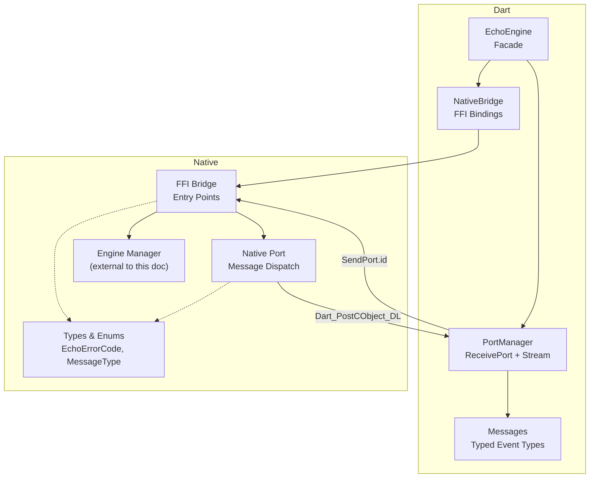
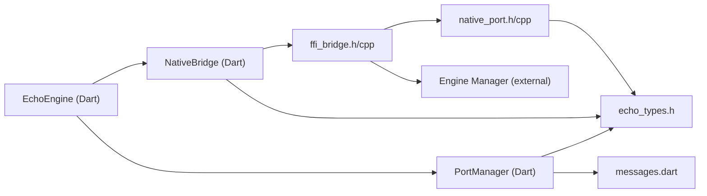

# FFI Bridge and Dart Integration

<cite>
**Referenced Files in This Document**
- [ffi_bridge.h](file://native/include/ffi_bridge.h)
- [ffi_bridge.cpp](file://native/src/ffi_bridge.cpp)
- [native_port.h](file://native/include/native_port.h)
- [native_port.cpp](file://native/src/native_port.cpp)
- [echo_types.h](file://native/include/echo_types.h)
- [native_bridge.dart](file://lib/src/native_bridge.dart)
- [port_manager.dart](file://lib/src/port_manager.dart)
- [messages.dart](file://lib/src/messages.dart)
- [echo_engine.dart](file://lib/src/echo_engine.dart)
</cite>

## Table of Contents
1. [Introduction](#introduction)
2. [Project Structure](#project-structure)
3. [Core Components](#core-components)
4. [Architecture Overview](#architecture-overview)
5. [Detailed Component Analysis](#detailed-component-analysis)
6. [Dependency Analysis](#dependency-analysis)
7. [Performance Considerations](#performance-considerations)
8. [Troubleshooting Guide](#troubleshooting-guide)
9. [Conclusion](#conclusion)
10. [Appendices](#appendices)

## Introduction
This document explains QwenEcho’s cross-language communication layer between the native C/C++ engine and the Dart runtime. It focuses on:
- The four C-linkage entry points exposed via FFI
- Dart FFI bindings and error handling
- The Port Manager’s asynchronous message delivery system
- The typed event system for inter-process communication
- The EchoEngine facade that combines NativeBridge and PortManager
- Practical guidance for extending the interface, handling async operations, and debugging issues

## Project Structure
The FFI bridge spans two layers:
- Native side (C/C++): public C-linkage API, port registration, and typed message dispatch
- Dart side: FFI bindings, port manager, typed messages, and a high-level facade



**Diagram sources**
- [ffi_bridge.h:1-84](file://native/include/ffi_bridge.h#L1-L84)
- [ffi_bridge.cpp:1-124](file://native/src/ffi_bridge.cpp#L1-L124)
- [native_port.h:1-179](file://native/include/native_port.h#L1-L179)
- [native_port.cpp:1-320](file://native/src/native_port.cpp#L1-L320)
- [echo_types.h:1-136](file://native/include/echo_types.h#L1-L136)
- [native_bridge.dart:1-230](file://lib/src/native_bridge.dart#L1-L230)
- [port_manager.dart:1-85](file://lib/src/port_manager.dart#L1-L85)
- [messages.dart:1-336](file://lib/src/messages.dart#L1-L336)
- [echo_engine.dart:1-108](file://lib/src/echo_engine.dart#L1-L108)

**Section sources**
- [ffi_bridge.h:1-84](file://native/include/ffi_bridge.h#L1-L84)
- [ffi_bridge.cpp:1-124](file://native/src/ffi_bridge.cpp#L1-L124)
- [native_port.h:1-179](file://native/include/native_port.h#L1-L179)
- [native_port.cpp:1-320](file://native/src/native_port.cpp#L1-L320)
- [echo_types.h:1-136](file://native/include/echo_types.h#L1-L136)
- [native_bridge.dart:1-230](file://lib/src/native_bridge.dart#L1-L230)
- [port_manager.dart:1-85](file://lib/src/port_manager.dart#L1-L85)
- [messages.dart:1-336](file://lib/src/messages.dart#L1-L336)
- [echo_engine.dart:1-108](file://lib/src/echo_engine.dart#L1-L108)

## Core Components
- C-linkage entry points (FFI Bridge):
  - InitQwenEchoEngine(asr_path, llm_path, tts_path)
  - StartEchoPipeline(source_lang, target_lang)
  - StopEchoPipeline()
  - RegisterEchoMessagePort(dart_port_id)
- Dart FFI bindings (NativeBridge):
  - Loads platform-specific shared library
  - Exposes typed methods with UTF-8 marshalling and error throwing
- Port Manager:
  - Creates a ReceivePort, registers it with the engine
  - Deserializes raw lists into typed EchoMessage objects and exposes a broadcast Stream
- Typed event system (Messages):
  - Message type tags and strongly-typed Dart classes for ASR, translation, TTS, errors, thermal, memory, latency, and sample drops
- EchoEngine facade:
  - Orchestrates lifecycle (init → start → stop), integrates NativeBridge and PortManager, and exposes a unified Stream<EchoMessage>

Key responsibilities and interactions are detailed in the following sections.

**Section sources**
- [ffi_bridge.h:17-77](file://native/include/ffi_bridge.h#L17-L77)
- [ffi_bridge.cpp:54-121](file://native/src/ffi_bridge.cpp#L54-L121)
- [native_bridge.dart:103-229](file://lib/src/native_bridge.dart#L103-L229)
- [port_manager.dart:18-84](file://lib/src/port_manager.dart#L18-L84)
- [messages.dart:8-49](file://lib/src/messages.dart#L8-L49)
- [echo_engine.dart:37-107](file://lib/src/echo_engine.dart#L37-L107)

## Architecture Overview
End-to-end flow from Dart to native and back:

```mermaid
sequenceDiagram
participant UI as "Dart UI"
participant Facade as "EchoEngine"
participant Bridge as "NativeBridge"
participant FFI as "FFI Bridge (C)"
participant NPort as "Native Port"
participant DartVM as "Dart VM"
participant PM as "PortManager"
UI->>Facade : init(asr,llm,tts)
Facade->>PM : register()
PM->>Bridge : registerPort(portId)
Bridge->>FFI : RegisterEchoMessagePort(portId)
FFI-->>Bridge : ECHO_OK
Bridge-->>PM : success
Facade->>Bridge : initEngine(paths)
Bridge->>FFI : InitQwenEchoEngine(...)
FFI-->>Bridge : ECHO_OK or error
Bridge-->>Facade : throws if error
UI->>Facade : start(srcLang, tgtLang)
Facade->>Bridge : startPipeline(srcLang, tgtLang)
Bridge->>FFI : StartEchoPipeline(...)
FFI-->>Bridge : ECHO_OK or error
Bridge-->>Facade : throws if error
Note over FFI,NPort : Pipeline runs; events posted via Native Port
FFI->>NPort : post_* functions
NPort->>DartVM : Dart_PostCObject_DL(portId, array)
DartVM-->>PM : List<dynamic>
PM->>PM : parse to EchoMessage
PM-->>UI : Stream<EchoMessage>
```

**Diagram sources**
- [ffi_bridge.h:17-77](file://native/include/ffi_bridge.h#L17-L77)
- [ffi_bridge.cpp:54-121](file://native/src/ffi_bridge.cpp#L54-L121)
- [native_port.h:69-94](file://native/include/native_port.h#L69-L94)
- [native_port.cpp:36-75](file://native/src/native_port.cpp#L36-L75)
- [native_bridge.dart:138-185](file://lib/src/native_bridge.dart#L138-L185)
- [port_manager.dart:42-50](file://lib/src/port_manager.dart#L42-L50)
- [messages.dart:14-33](file://lib/src/messages.dart#L14-L33)
- [echo_engine.dart:66-87](file://lib/src/echo_engine.dart#L66-L87)

## Detailed Component Analysis

### C-linkage Entry Points (FFI Bridge)
Responsibilities:
- Initialize engine with model paths
- Start/stop pipeline with language pair validation and port checks
- Register Dart SendPort ID for asynchronous messaging

Parameter specifications:
- InitQwenEchoEngine(const char* asr_path, const char* llm_path, const char* tts_path)
  - Returns ECHO_OK on success; negative EchoErrorCode on failure
- StartEchoPipeline(const char* source_lang, const char* target_lang)
  - Requires initialized engine and registered port; returns ECHO_OK or specific errors
- StopEchoPipeline(void)
  - Requires active session and registered port; returns ECHO_OK or specific errors
- RegisterEchoMessagePort(int64_t dart_port_id)
  - Stores port ID and forwards to native_port module; returns ECHO_OK

Error codes:
- Defined centrally in echo_types.h and mirrored in Dart for user-friendly descriptions

Concurrency:
- All entry points lock a global mutex to protect engine manager access and port state

**Section sources**
- [ffi_bridge.h:17-77](file://native/include/ffi_bridge.h#L17-L77)
- [ffi_bridge.cpp:54-121](file://native/src/ffi_bridge.cpp#L54-L121)
- [echo_types.h:48-62](file://native/include/echo_types.h#L48-L62)

### Dart FFI Bindings (NativeBridge)
Responsibilities:
- Load platform-specific native library
- Lookup and bind the four C functions
- Convert Dart strings to UTF-8 and free memory safely
- Throw EchoEngineException on non-zero return codes

Platform loading strategy:
- Android/Linux: libqwen_echo.so
- iOS/macOS: process first, fallback to libqwen_echo.dylib

Error handling:
- Mirrors EchoErrorCode enum values
- Provides human-readable descriptions via describe(code)

Memory management:
- Uses ffi package calloc/free for UTF-8 buffers

**Section sources**
- [native_bridge.dart:103-229](file://lib/src/native_bridge.dart#L103-L229)
- [native_bridge.dart:43-75](file://lib/src/native_bridge.dart#L43-L75)

### Port Manager (Asynchronous Message Delivery)
Responsibilities:
- Create a ReceivePort and register its nativePort id with the engine
- Listen for incoming messages and deserialize them into typed EchoMessage objects
- Expose a broadcast Stream<EchoMessage> for multiple subscribers
- Manage lifecycle (register/unregister/dispose)

Behavior:
- If a port is already registered, it closes and replaces it
- Incoming raw lists are parsed by EchoMessage.fromRawList; unknown formats are ignored

**Section sources**
- [port_manager.dart:18-84](file://lib/src/port_manager.dart#L18-L84)
- [messages.dart:14-33](file://lib/src/messages.dart#L14-L33)

### Typed Event System (Messages)
Responsibilities:
- Define message type tags matching native MessageType enum
- Provide strongly-typed Dart classes for each event
- Parse raw arrays into typed objects

Supported events:
- ASR partial and confirmed
- Translation stream tokens and completion
- TTS started and complete
- Error notifications
- Thermal state changes
- Memory warnings
- Latency warnings
- Sample drop detection

**Section sources**
- [messages.dart:8-49](file://lib/src/messages.dart#L8-L49)
- [messages.dart:52-335](file://lib/src/messages.dart#L52-L335)
- [echo_types.h:30-42](file://native/include/echo_types.h#L30-L42)

### EchoEngine Facade
Responsibilities:
- Combine NativeBridge and PortManager into a single high-level API
- Manage lifecycle states: uninitialized → ready → running
- Ensure port is registered before initialization so status messages can be received
- Expose Stream<EchoMessage> for UI consumption

Lifecycle:
- init: register port, call initEngine, set state to ready
- start: call startPipeline, set state to running
- stop: call stopPipeline, reset state to ready
- dispose: close port resources

**Section sources**
- [echo_engine.dart:37-107](file://lib/src/echo_engine.dart#L37-L107)

### Native Port Implementation (Message Dispatch)
Responsibilities:
- Maintain an atomic port ID and registration flag
- Serialize typed messages into Dart_CObject arrays
- Post messages via Dart_PostCObject_DL (or a mock function pointer for tests)
- Provide typed post_* functions for all event types

Thread-safety:
- Atomic variables ensure safe concurrent posting from pipeline threads

Runtime binding:
- Allows setting a custom post function for testing or when Dart SDK headers are unavailable

**Section sources**
- [native_port.h:69-94](file://native/include/native_port.h#L69-L94)
- [native_port.cpp:36-75](file://native/src/native_port.cpp#L36-L75)
- [native_port.cpp:116-317](file://native/src/native_port.cpp#L116-L317)

## Dependency Analysis
High-level dependencies across components:



**Diagram sources**
- [echo_engine.dart:1-108](file://lib/src/echo_engine.dart#L1-L108)
- [native_bridge.dart:1-230](file://lib/src/native_bridge.dart#L1-L230)
- [port_manager.dart:1-85](file://lib/src/port_manager.dart#L1-L85)
- [ffi_bridge.h:1-84](file://native/include/ffi_bridge.h#L1-L84)
- [ffi_bridge.cpp:1-124](file://native/src/ffi_bridge.cpp#L1-L124)
- [native_port.h:1-179](file://native/include/native_port.h#L1-L179)
- [native_port.cpp:1-320](file://native/src/native_port.cpp#L1-L320)
- [echo_types.h:1-136](file://native/include/echo_types.h#L1-L136)
- [messages.dart:1-336](file://lib/src/messages.dart#L1-L336)

**Section sources**
- [echo_engine.dart:1-108](file://lib/src/echo_engine.dart#L1-L108)
- [native_bridge.dart:1-230](file://lib/src/native_bridge.dart#L1-L230)
- [port_manager.dart:1-85](file://lib/src/port_manager.dart#L1-L85)
- [ffi_bridge.h:1-84](file://native/include/ffi_bridge.h#L1-L84)
- [ffi_bridge.cpp:1-124](file://native/src/ffi_bridge.cpp#L1-L124)
- [native_port.h:1-179](file://native/include/native_port.h#L1-L179)
- [native_port.cpp:1-320](file://native/src/native_port.cpp#L1-L320)
- [echo_types.h:1-136](file://native/include/echo_types.h#L1-L136)
- [messages.dart:1-336](file://lib/src/messages.dart#L1-L336)

## Performance Considerations
- Minimize string allocations: reuse UTF-8 buffers where possible on the Dart side
- Avoid excessive logging in hot paths; rely on structured events (latency, memory, thermal)
- Use broadcast streams judiciously; subscribe only what you need
- Prefer typed parsing to avoid dynamic overhead in message handlers
- Keep port registration stable; frequent re-registration may cause missed messages during transitions

[No sources needed since this section provides general guidance]

## Troubleshooting Guide
Common issues and strategies:
- No messages received:
  - Verify RegisterEchoMessagePort was called before starting the pipeline
  - Ensure the ReceivePort is still open and subscribed
- Engine not ready:
  - Confirm InitQwenEchoEngine succeeded and returned ECHO_OK
  - Check EchoEngineState is ready before calling start
- Unsupported language pair:
  - Validate ISO 639-1 codes and supported pairs
- Port not registered:
  - Ensure PortManager.register() completed successfully
- Memory pressure or thermal throttling:
  - Monitor MemoryWarningMessage and ThermalStateMessage to adapt behavior
- Debugging Dart-native communication:
  - Log EchoEngineException details (code and message)
  - Inspect raw lists before parsing to verify format
  - For native-side issues, add temporary logs around post_* calls

**Section sources**
- [native_bridge.dart:43-75](file://lib/src/native_bridge.dart#L43-L75)
- [port_manager.dart:42-50](file://lib/src/port_manager.dart#L42-L50)
- [messages.dart:14-33](file://lib/src/messages.dart#L14-L33)
- [echo_engine.dart:66-87](file://lib/src/echo_engine.dart#L66-L87)

## Conclusion
QwenEcho’s FFI bridge cleanly separates concerns:
- The C-linkage entry points provide a minimal, stable surface for Dart
- NativeBridge handles platform specifics and error translation
- PortManager abstracts asynchronous messaging and typing
- EchoEngine offers a simple, stateful facade for application code

This design enables robust, extensible, and debuggable cross-language communication suitable for real-time interpretation pipelines.

[No sources needed since this section summarizes without analyzing specific files]

## Appendices

### Extending the FFI Interface
To add a new capability:
- Add a new C-linkage function in ffi_bridge.h and implement it in ffi_bridge.cpp
- Mirror any new error codes in echo_types.h and update Dart EchoErrorCode
- In Dart, add corresponding typedefs and methods in NativeBridge
- If the feature emits events, add a new post_* function in native_port.h/cpp and a new message type in messages.dart

**Section sources**
- [ffi_bridge.h:17-77](file://native/include/ffi_bridge.h#L17-L77)
- [ffi_bridge.cpp:54-121](file://native/src/ffi_bridge.cpp#L54-L121)
- [echo_types.h:48-62](file://native/include/echo_types.h#L48-L62)
- [native_bridge.dart:103-229](file://lib/src/native_bridge.dart#L103-L229)
- [native_port.h:96-172](file://native/include/native_port.h#L96-L172)
- [native_port.cpp:116-317](file://native/src/native_port.cpp#L116-L317)
- [messages.dart:8-49](file://lib/src/messages.dart#L8-L49)

### Handling Asynchronous Operations
- Always register the port before initializing the engine to receive early status messages
- Subscribe to EchoEngine.messages before starting the pipeline
- Handle EchoEngineException promptly to prevent cascading failures
- Use cancelable subscriptions to avoid leaks when stopping the pipeline

**Section sources**
- [echo_engine.dart:66-87](file://lib/src/echo_engine.dart#L66-L87)
- [port_manager.dart:42-50](file://lib/src/port_manager.dart#L42-L50)

### Debugging Dart-Native Communication
- Print EchoEngineException.code and message for quick triage
- Temporarily log raw lists in PortManager._handleRawMessage to validate payloads
- Verify platform library loading path and symbols exist
- On iOS/macOS, confirm whether the process library resolves correctly

**Section sources**
- [native_bridge.dart:191-207](file://lib/src/native_bridge.dart#L191-L207)
- [port_manager.dart:76-83](file://lib/src/port_manager.dart#L76-L83)
- [native_bridge.dart:43-75](file://lib/src/native_bridge.dart#L43-L75)