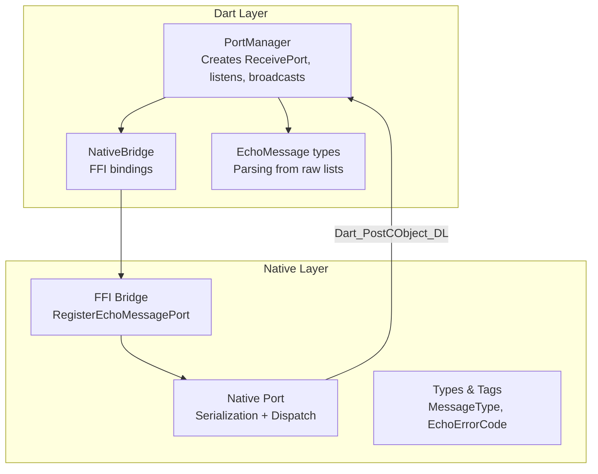
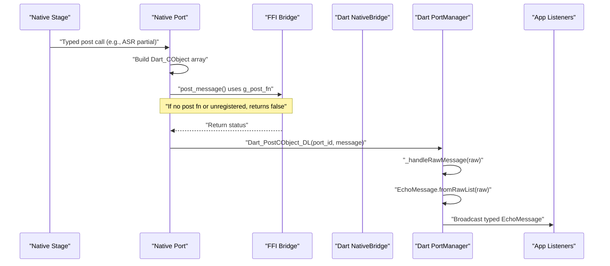
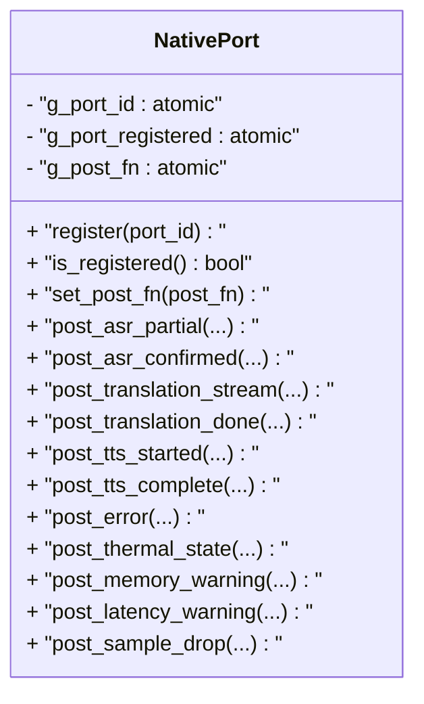
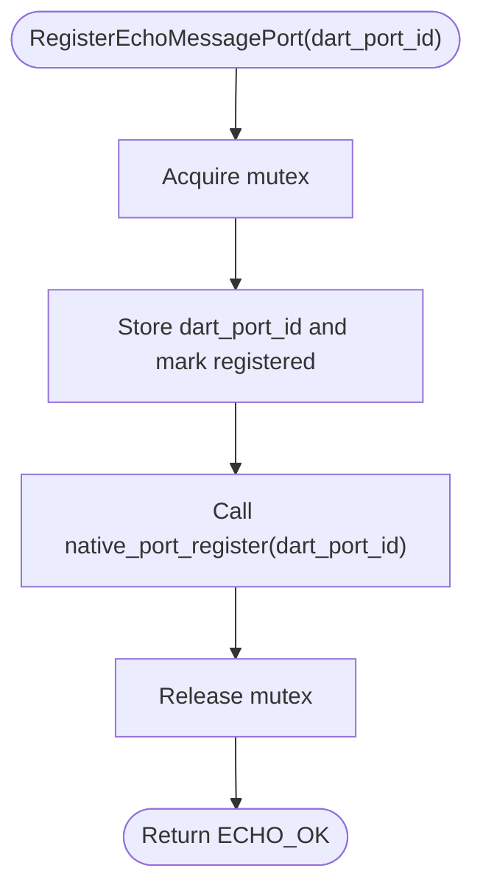
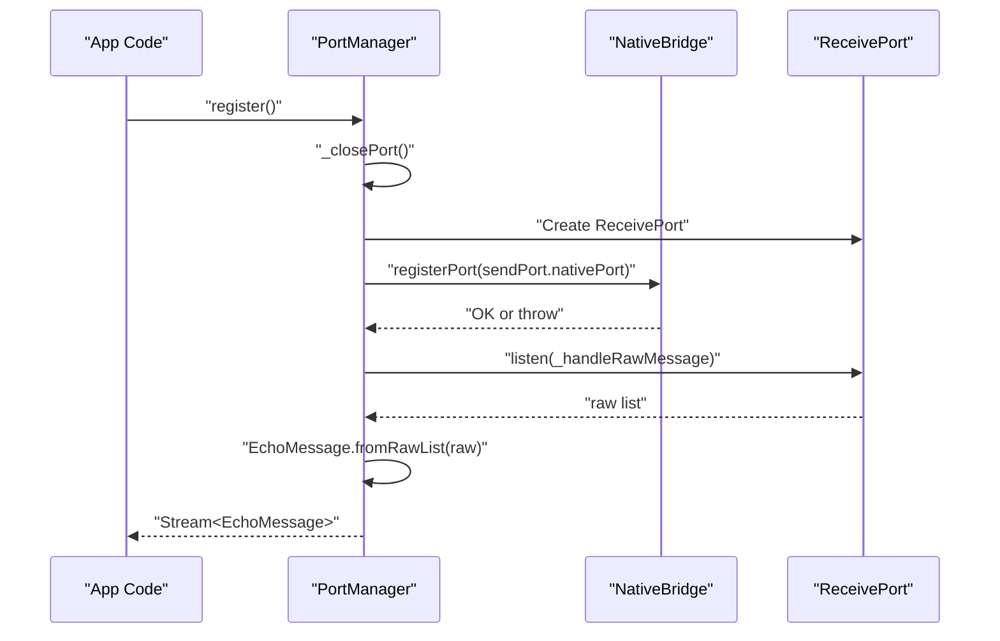
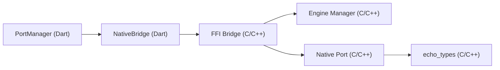

# Native Port Manager

<cite>
**Referenced Files in This Document**
- [native_port.h](file://native/include/native_port.h)
- [native_port.cpp](file://native/src/native_port.cpp)
- [ffi_bridge.h](file://native/include/ffi_bridge.h)
- [ffi_bridge.cpp](file://native/src/ffi_bridge.cpp)
- [echo_types.h](file://native/include/echo_types.h)
- [port_manager.dart](file://lib/src/port_manager.dart)
- [native_bridge.dart](file://lib/src/native_bridge.dart)
- [messages.dart](file://lib/src/messages.dart)
- [test_native_port.cpp](file://native/tests/test_native_port.cpp)
</cite>

## Table of Contents
1. [Introduction](#introduction)
2. [Project Structure](#project-structure)
3. [Core Components](#core-components)
4. [Architecture Overview](#architecture-overview)
5. [Detailed Component Analysis](#detailed-component-analysis)
6. [Dependency Analysis](#dependency-analysis)
7. [Performance Considerations](#performance-considerations)
8. [Troubleshooting Guide](#troubleshooting-guide)
9. [Conclusion](#conclusion)

## Introduction
This document explains the Native Port Manager system that delivers asynchronous messages from native C/C++ code to Dart via a Dart Native Port. It covers:
- SendPort registration and replacement semantics
- Message serialization and dispatch
- Thread safety and concurrency guarantees
- Connection state management and reconnection patterns
- Handling multiple concurrent sessions
- Examples for registering ports, handling incoming messages, and cleanup
- Common issues such as port lifecycle and message ordering guarantees

## Project Structure
The Native Port Manager spans both native and Dart layers:
- Native side: FFI bridge exposes C-linkage functions; Native Port serializes typed messages and posts them to the registered Dart port.
- Dart side: PortManager creates a ReceivePort, registers it with the engine, and transforms raw lists into typed EchoMessage objects on a broadcast stream.

**Diagram sources**
- [port_manager.dart:1-85](file://lib/src/port_manager.dart#L1-L85)
- [native_bridge.dart:100-230](file://lib/src/native_bridge.dart#L100-L230)
- [ffi_bridge.cpp:108-123](file://native/src/ffi_bridge.cpp#L108-L123)
- [native_port.cpp:1-320](file://native/src/native_port.cpp#L1-L320)
- [echo_types.h:26-62](file://native/include/echo_types.h#L26-L62)

**Section sources**
- [port_manager.dart:1-85](file://lib/src/port_manager.dart#L1-L85)
- [native_bridge.dart:100-230](file://lib/src/native_bridge.dart#L100-L230)
- [ffi_bridge.h:1-84](file://native/include/ffi_bridge.h#L1-L84)
- [ffi_bridge.cpp:1-123](file://native/src/ffi_bridge.cpp#L1-L123)
- [native_port.h:1-179](file://native/include/native_port.h#L1-L179)
- [native_port.cpp:1-320](file://native/src/native_port.cpp#L1-L320)
- [echo_types.h:1-136](file://native/include/echo_types.h#L1-L136)
- [messages.dart:1-336](file://lib/src/messages.dart#L1-L336)

## Core Components
- Native Port (C/C++)
  - Maintains an atomic port ID, registration flag, and runtime post function pointer.
  - Provides typed post functions for each message type, building Dart_CObject arrays and posting via the configured function pointer.
- FFI Bridge (C/C++)
  - Exposes RegisterEchoMessagePort to Dart, storing the port and forwarding to Native Port.
  - Guards pipeline operations requiring a registered port.
- Dart PortManager
  - Creates a ReceivePort, registers it via NativeBridge, and subscribes to raw messages.
  - Deserializes raw lists into typed EchoMessage instances and emits them on a broadcast Stream.
- Dart NativeBridge
  - Loads the native library and binds to C-linkage functions.
  - Throws EchoEngineException on non-zero return codes.
- Message Types (Dart)
  - Strongly typed classes mirroring native MessageType tags, with parsing from raw lists.

Key responsibilities:
- Registration and replacement of the active port
- Safe cross-thread posting using atomics
- Type-safe message delivery across the FFI boundary
- Broadcast distribution to multiple Dart listeners

**Section sources**
- [native_port.h:65-179](file://native/include/native_port.h#L65-L179)
- [native_port.cpp:19-75](file://native/src/native_port.cpp#L19-L75)
- [ffi_bridge.h:67-77](file://native/include/ffi_bridge.h#L67-L77)
- [ffi_bridge.cpp:108-123](file://native/src/ffi_bridge.cpp#L108-L123)
- [port_manager.dart:18-84](file://lib/src/port_manager.dart#L18-L84)
- [native_bridge.dart:100-230](file://lib/src/native_bridge.dart#L100-L230)
- [messages.dart:1-336](file://lib/src/messages.dart#L1-L336)

## Architecture Overview
End-to-end flow from native stage to Dart UI:

**Diagram sources**
- [native_port.cpp:116-133](file://native/src/native_port.cpp#L116-L133)
- [native_port.cpp:62-75](file://native/src/native_port.cpp#L62-L75)
- [ffi_bridge.cpp:108-123](file://native/src/ffi_bridge.cpp#L108-L123)
- [port_manager.dart:76-83](file://lib/src/port_manager.dart#L76-L83)
- [messages.dart:14-33](file://lib/src/messages.dart#L14-L33)

## Detailed Component Analysis

### Native Port Module (C/C++)
Responsibilities:
- Global atomic state for port ID, registration flag, and post function pointer
- Typed message builders for all supported message types
- Posting through the configured Dart_PostCObject_Type function pointer

Thread safety:
- All module-level state is std::atomic with acquire/release semantics
- Multiple pipeline threads can safely post concurrently without locks

Message format:
- Each message is a Dart_CObject array whose first element is a MessageType tag
- Subsequent elements match the documented payload per message type

Re-registration:
- Calling register with a new port_id replaces the previous registration
- Only the most recently registered port receives messages

Error behavior:
- If not registered or post function not set, post calls return false

**Diagram sources**
- [native_port.cpp:19-75](file://native/src/native_port.cpp#L19-L75)
- [native_port.h:65-179](file://native/include/native_port.h#L65-L179)

**Section sources**
- [native_port.cpp:19-75](file://native/src/native_port.cpp#L19-L75)
- [native_port.cpp:116-317](file://native/src/native_port.cpp#L116-L317)
- [native_port.h:65-179](file://native/include/native_port.h#L65-L179)

### FFI Bridge (C/C++)
Responsibilities:
- Expose RegisterEchoMessagePort to Dart
- Maintain local port registration state
- Enforce that certain operations require a registered port

Registration flow:
- Stores the Dart port ID atomically
- Marks port as registered
- Forwards to Native Port for message dispatch

Guarded operations:
- Pipeline stop requires a registered port; otherwise returns ECHO_ERR_NO_PORT

**Diagram sources**
- [ffi_bridge.cpp:108-123](file://native/src/ffi_bridge.cpp#L108-L123)
- [ffi_bridge.h:67-77](file://native/include/ffi_bridge.h#L67-L77)

**Section sources**
- [ffi_bridge.cpp:1-123](file://native/src/ffi_bridge.cpp#L1-123)
- [ffi_bridge.h:1-84](file://native/include/ffi_bridge.h#L1-L84)

### Dart PortManager
Responsibilities:
- Create and manage a ReceivePort
- Register the port with the engine via NativeBridge
- Transform raw lists into typed EchoMessage and broadcast to subscribers
- Provide lifecycle methods: register, unregister, dispose

Concurrency model:
- Single ReceivePort listener deserializes messages
- Broadcast stream fans out to multiple listeners

Lifecycle:
- register closes any existing port before creating a new one
- unregister cancels subscription and closes the port
- dispose additionally closes the StreamController

**Diagram sources**
- [port_manager.dart:38-83](file://lib/src/port_manager.dart#L38-L83)
- [native_bridge.dart:177-185](file://lib/src/native_bridge.dart#L177-L185)
- [messages.dart:14-33](file://lib/src/messages.dart#L14-L33)

**Section sources**
- [port_manager.dart:18-84](file://lib/src/port_manager.dart#L18-L84)
- [messages.dart:1-336](file://lib/src/messages.dart#L1-L336)

### Dart Message Types
Responsibilities:
- Define MessageType constants aligned with native enum
- Parse raw lists into strongly typed message classes
- Provide convenience helpers (e.g., usagePercent, modeName)

Guarantees:
- Unknown type tags are ignored by the parser
- Empty lists return null

**Section sources**
- [messages.dart:36-49](file://lib/src/messages.dart#L36-L49)
- [messages.dart:14-33](file://lib/src/messages.dart#L14-L33)
- [echo_types.h:26-42](file://native/include/echo_types.h#L26-L42)

## Dependency Analysis
High-level dependencies:
- Dart PortManager depends on Dart NativeBridge for FFI calls
- Dart NativeBridge loads the native library and binds to C-linkage functions
- Native FFI Bridge depends on Engine Manager for lifecycle and on Native Port for messaging
- Native Port depends on echo_types for message tags and error codes

**Diagram sources**
- [port_manager.dart:1-85](file://lib/src/port_manager.dart#L1-L85)
- [native_bridge.dart:100-230](file://lib/src/native_bridge.dart#L100-L230)
- [ffi_bridge.cpp:1-123](file://native/src/ffi_bridge.cpp#L1-123)
- [native_port.cpp:1-320](file://native/src/native_port.cpp#L1-L320)
- [echo_types.h:1-136](file://native/include/echo_types.h#L1-L136)

**Section sources**
- [port_manager.dart:1-85](file://lib/src/port_manager.dart#L1-L85)
- [native_bridge.dart:100-230](file://lib/src/native_bridge.dart#L100-L230)
- [ffi_bridge.cpp:1-123](file://native/src/ffi_bridge.cpp#L1-L123)
- [native_port.cpp:1-320](file://native/src/native_port.cpp#L1-L320)
- [echo_types.h:1-136](file://native/include/echo_types.h#L1-L136)

## Performance Considerations
- Serialization cost: Each message constructs a small Dart_CObject array; keep payloads minimal and avoid large strings when possible.
- Atomic overhead: Post path reads atomics with acquire semantics; negligible compared to I/O and serialization.
- Backpressure: The Dart ReceivePort buffers incoming messages; heavy producers should consider application-level throttling if needed.
- Broadcasting: A single listener deserializes once and fans out via broadcast; this avoids duplicate parsing but may increase memory pressure if consumers are slow.

[No sources needed since this section provides general guidance]

## Troubleshooting Guide
Common issues and resolutions:
- No messages received
  - Ensure a port is registered before starting/stopping pipeline operations. The FFI layer enforces this and returns ECHO_ERR_NO_PORT if missing.
  - Verify that the post function pointer is set (used in tests). Without it, post calls return false.
- Port replacement
  - Re-registering a port replaces the previous one; only the latest registration receives messages.
- Lifecycle leaks
  - Always call unregister or dispose to cancel subscriptions and close ports. In-flight messages may be lost after closing.
- Ordering guarantees
  - Messages posted from native are delivered in order per port. If you need strict ordering across stages, rely on segment_id and timestamps included in messages.
- Error diagnostics
  - Use ErrorMessage events to surface errors from native stages. Check errorCode and modelName fields.

Operational examples (paths only):
- Register a port and listen
  - [port_manager.dart:38-50](file://lib/src/port_manager.dart#L38-L50)
  - [native_bridge.dart:177-185](file://lib/src/native_bridge.dart#L177-L185)
- Handle incoming messages
  - [port_manager.dart:76-83](file://lib/src/port_manager.dart#L76-L83)
  - [messages.dart:14-33](file://lib/src/messages.dart#L14-L33)
- Cleanup procedures
  - [port_manager.dart:55-63](file://lib/src/port_manager.dart#L55-L63)
- Test-driven verification of message formats
  - [test_native_port.cpp:105-137](file://native/tests/test_native_port.cpp#L105-L137)

**Section sources**
- [ffi_bridge.cpp:100-106](file://native/src/ffi_bridge.cpp#L100-L106)
- [test_native_port.cpp:105-137](file://native/tests/test_native_port.cpp#L105-L137)
- [port_manager.dart:55-63](file://lib/src/port_manager.dart#L55-L63)
- [messages.dart:14-33](file://lib/src/messages.dart#L14-L33)

## Conclusion
The Native Port Manager provides a robust, thread-safe channel for streaming structured messages from native stages to Dart. It uses atomic state for safe concurrent posting, supports port replacement for reconnection scenarios, and offers a clean Dart API with typed messages and broadcast streams. Proper lifecycle management—registering early, replacing ports as needed, and disposing resources—ensures reliable operation across multiple concurrent sessions.