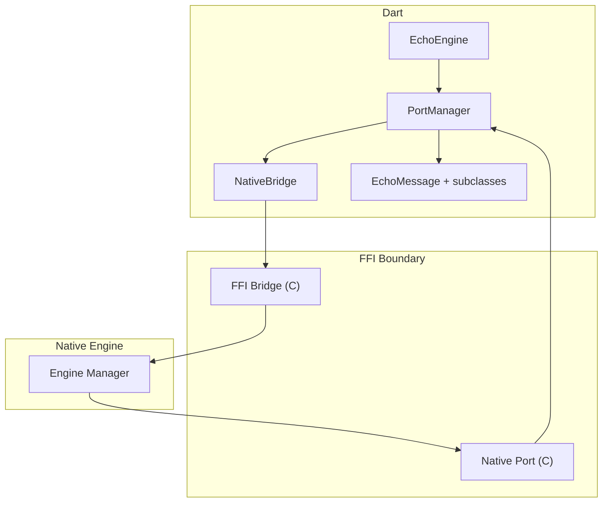
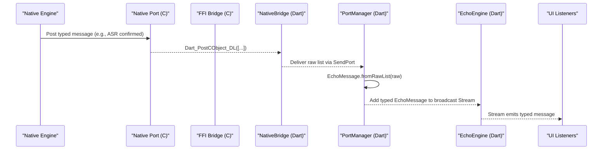
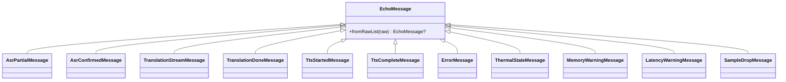
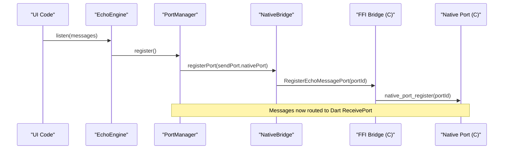

# Typed Message Protocol

<cite>
**Referenced Files in This Document**
- [echo_types.h](file://native/include/echo_types.h)
- [ffi_bridge.h](file://native/include/ffi_bridge.h)
- [ffi_bridge.cpp](file://native/src/ffi_bridge.cpp)
- [native_port.h](file://native/include/native_port.h)
- [native_port.cpp](file://native/src/native_port.cpp)
- [messages.dart](file://lib/src/messages.dart)
- [port_manager.dart](file://lib/src/port_manager.dart)
- [native_bridge.dart](file://lib/src/native_bridge.dart)
- [echo_engine.dart](file://lib/src/echo_engine.dart)
- [qwen_echo.dart](file://lib/qwen_echo.dart)
- [test_echo_types.cpp](file://native/tests/test_echo_types.cpp)
- [test_native_port.cpp](file://native/tests/test_native_port.cpp)
- [messages_test.dart](file://test/messages_test.dart)
</cite>

## Table of Contents
1. Introduction
2. Project Structure
3. Core Components
4. Architecture Overview
5. Detailed Component Analysis
6. Dependency Analysis
7. Performance Considerations
8. Troubleshooting Guide
9. Conclusion
10. Appendices

## Introduction
This document describes the typed event system used for inter-process communication between the native QwenEcho engine and the Flutter UI. It covers the EchoMessage class hierarchy, message serialization formats, type-safe event handling patterns, supported message types (pipeline status updates, transcription results, translation outputs, and error notifications), message routing mechanisms, event listener registration, subscription patterns, and guidance for implementing custom handlers and extending the protocol with new message types.

## Project Structure
The typed message protocol spans both native C/C++ and Dart layers:
- Native side:
  - Shared constants and types (message tags, error codes).
  - FFI bridge exposing lifecycle functions to Dart.
  - Native Port module serializing messages and dispatching them via Dart’s Native Port.
- Dart side:
  - FFI bindings to call into native entry points.
  - Port manager that registers a ReceivePort, deserializes raw lists into typed messages, and exposes a broadcast Stream.
  - High-level EchoEngine facade combining initialization, start/stop, and message streaming.

**Diagram sources**
- [echo_engine.dart:37-107](file://lib/src/echo_engine.dart#L37-L107)
- [port_manager.dart:18-84](file://lib/src/port_manager.dart#L18-L84)
- [native_bridge.dart:103-229](file://lib/src/native_bridge.dart#L103-L229)
- [ffi_bridge.cpp:54-123](file://native/src/ffi_bridge.cpp#L54-L123)
- [native_port.cpp:36-75](file://native/src/native_port.cpp#L36-L75)

**Section sources**
- [qwen_echo.dart:1-16](file://lib/qwen_echo.dart#L1-L16)
- [echo_engine.dart:1-108](file://lib/src/echo_engine.dart#L1-L108)
- [port_manager.dart:1-85](file://lib/src/port_manager.dart#L1-L85)
- [native_bridge.dart:1-230](file://lib/src/native_bridge.dart#L1-L230)
- [ffi_bridge.h:1-84](file://native/include/ffi_bridge.h#L1-L84)
- [ffi_bridge.cpp:1-124](file://native/src/ffi_bridge.cpp#L1-L124)
- [native_port.h:1-179](file://native/include/native_port.h#L1-L179)
- [native_port.cpp:1-320](file://native/src/native_port.cpp#L1-L320)

## Core Components
- EchoMessage hierarchy (Dart):
  - Base sealed class with a static parser from raw lists.
  - Concrete message classes for ASR partial/confirmed, translation stream/done, TTS started/complete, error, thermal state, memory warning, latency warning, and sample drop.
- MessageType constants (Dart):
  - Integer tags mirroring the native MessageType enum.
- Native Port (C/C++):
  - Functions to post each typed message as a Dart_CObject array over a registered port.
- FFI Bridge (C/C++):
  - Entry points for init/start/stop and port registration; enforces port registration before pipeline operations.
- Port Manager (Dart):
  - Creates a ReceivePort, registers it with the engine, listens for raw lists, parses into EchoMessage, and exposes a broadcast Stream.
- Native Bridge (Dart):
  - FFI bindings to call native entry points and throw typed exceptions on errors.
- EchoEngine (Dart):
  - Facade orchestrating lifecycle and exposing a unified messages stream.

**Section sources**
- [messages.dart:1-336](file://lib/src/messages.dart#L1-L336)
- [native_port.h:96-172](file://native/include/native_port.h#L96-L172)
- [native_port.cpp:116-317](file://native/src/native_port.cpp#L116-L317)
- [ffi_bridge.h:17-77](file://native/include/ffi_bridge.h#L17-L77)
- [ffi_bridge.cpp:54-123](file://native/src/ffi_bridge.cpp#L54-L123)
- [port_manager.dart:18-84](file://lib/src/port_manager.dart#L18-L84)
- [native_bridge.dart:103-229](file://lib/src/native_bridge.dart#L103-L229)
- [echo_engine.dart:37-107](file://lib/src/echo_engine.dart#L37-L107)

## Architecture Overview
End-to-end flow from native events to Dart streams:

**Diagram sources**
- [native_port.cpp:116-154](file://native/src/native_port.cpp#L116-L154)
- [native_port.cpp:62-75](file://native/src/native_port.cpp#L62-L75)
- [port_manager.dart:76-83](file://lib/src/port_manager.dart#L76-L83)
- [messages.dart:14-33](file://lib/src/messages.dart#L14-L33)
- [echo_engine.dart:46-48](file://lib/src/echo_engine.dart#L46-L48)

## Detailed Component Analysis

### EchoMessage Class Hierarchy and Serialization
- Base class provides a single entry point to parse raw lists into strongly-typed objects based on the first element (type tag).
- Each concrete message class defines its fields and a private factory to deserialize from a raw list.
- The Dart MessageType constants mirror the native MessageType enum values to ensure cross-language consistency.

**Diagram sources**
- [messages.dart:8-33](file://lib/src/messages.dart#L8-L33)
- [messages.dart:52-335](file://lib/src/messages.dart#L52-L335)

Supported message types and wire format (first element is the type tag):
- ASR partial: [type=1, speaker_id, text, timestamp_ms]
- ASR confirmed: [type=2, speaker_id, text, timestamp_ms, segment_id]
- Translation stream token: [type=3, speaker_id, token, segment_id]
- Translation done: [type=4, speaker_id, full_text, segment_id]
- TTS started: [type=5, speaker_id, segment_id]
- TTS complete: [type=6, speaker_id, segment_id]
- Error: [type=10, error_code, model_name, detail]
- Thermal state: [type=11, thermal_mode, temperature_c]
- Memory warning: [type=12, current_bytes, limit_bytes, level]
- Latency warning: [type=13, stage, actual_ms, budget_ms]
- Sample drop: [type=14, dropped_samples, timestamp_ms]

These tags are defined in the native header and mirrored in Dart.

**Section sources**
- [echo_types.h:30-42](file://native/include/echo_types.h#L30-L42)
- [messages.dart:36-49](file://lib/src/messages.dart#L36-L49)
- [messages.dart:52-335](file://lib/src/messages.dart#L52-L335)
- [test_echo_types.cpp:21-34](file://native/tests/test_echo_types.cpp#L21-L34)
- [messages_test.dart:6-134](file://test/messages_test.dart#L6-L134)

### Message Routing and Event Listener Registration
- Dart side:
  - PortManager creates a ReceivePort, registers it with the engine via NativeBridge.registerPort, and subscribes to incoming raw lists.
  - Incoming raw lists are parsed by EchoMessage.fromRawList and added to a broadcast StreamController.
  - EchoEngine exposes a messages stream that UI components can subscribe to.
- Native side:
  - FFI bridge stores the Dart port ID and forwards to native_port_register.
  - Native Port posts typed messages using Dart_PostCObject_DL through the registered port.

**Diagram sources**
- [echo_engine.dart:66-75](file://lib/src/echo_engine.dart#L66-L75)
- [port_manager.dart:42-50](file://lib/src/port_manager.dart#L42-L50)
- [native_bridge.dart:182-185](file://lib/src/native_bridge.dart#L182-L185)
- [ffi_bridge.cpp:108-121](file://native/src/ffi_bridge.cpp#L108-L121)
- [native_port.cpp:38-42](file://native/src/native_port.cpp#L38-L42)

**Section sources**
- [port_manager.dart:18-84](file://lib/src/port_manager.dart#L18-L84)
- [native_bridge.dart:177-185](file://lib/src/native_bridge.dart#L177-L185)
- [ffi_bridge.cpp:108-121](file://native/src/ffi_bridge.cpp#L108-L121)
- [native_port.h:69-94](file://native/include/native_port.h#L69-L94)

### Type-Safe Event Handling Patterns
- Subscribe to EchoEngine.messages to receive strongly-typed messages.
- Use switch or pattern matching on the concrete message type to handle each case safely.
- For diagnostics (thermal, memory, latency, sample drops), update UI overlays or logs accordingly.
- For transcription and translation, accumulate tokens per segment and finalize when TranslationDone arrives.

Example usage paths:
- [echo_engine.dart:46-48](file://lib/src/echo_engine.dart#L46-L48)
- [messages.dart:14-33](file://lib/src/messages.dart#L14-L33)

**Section sources**
- [echo_engine.dart:46-48](file://lib/src/echo_engine.dart#L46-L48)
- [messages.dart:14-33](file://lib/src/messages.dart#L14-L33)

### Extending the Protocol with New Message Types
To add a new message type:
1. Define a new tag in the native MessageType enum and implement a native_port_post_* function in the Native Port module.
2. Mirror the tag in Dart MessageType constants.
3. Create a new EchoMessage subclass with a _fromRaw factory.
4. Update EchoMessage.fromRawList to route the new tag to the new subclass.
5. Optionally add tests for both native serialization and Dart parsing.

Reference locations:
- Native tag definitions and posting functions:
  - [echo_types.h:30-42](file://native/include/echo_types.h#L30-L42)
  - [native_port.h:100-172](file://native/include/native_port.h#L100-L172)
  - [native_port.cpp:116-317](file://native/src/native_port.cpp#L116-L317)
- Dart tag constants and message classes:
  - [messages.dart:36-49](file://lib/src/messages.dart#L36-L49)
  - [messages.dart:52-335](file://lib/src/messages.dart#L52-L335)
- Parser dispatch:
  - [messages.dart:14-33](file://lib/src/messages.dart#L14-L33)

**Section sources**
- [echo_types.h:30-42](file://native/include/echo_types.h#L30-L42)
- [native_port.h:100-172](file://native/include/native_port.h#L100-L172)
- [native_port.cpp:116-317](file://native/src/native_port.cpp#L116-L317)
- [messages.dart:14-49](file://lib/src/messages.dart#L14-L49)
- [messages.dart:52-335](file://lib/src/messages.dart#L52-L335)

## Dependency Analysis
High-level dependencies across layers:

**Diagram sources**
- [messages.dart:1-336](file://lib/src/messages.dart#L1-L336)
- [port_manager.dart:1-85](file://lib/src/port_manager.dart#L1-L85)
- [native_bridge.dart:1-230](file://lib/src/native_bridge.dart#L1-L230)
- [ffi_bridge.h:1-84](file://native/include/ffi_bridge.h#L1-L84)
- [ffi_bridge.cpp:1-124](file://native/src/ffi_bridge.cpp#L1-L124)
- [native_port.h:1-179](file://native/include/native_port.h#L1-L179)
- [native_port.cpp:1-320](file://native/src/native_port.cpp#L1-L320)
- [echo_types.h:1-136](file://native/include/echo_types.h#L1-L136)

**Section sources**
- [messages.dart:1-336](file://lib/src/messages.dart#L1-L336)
- [port_manager.dart:1-85](file://lib/src/port_manager.dart#L1-L85)
- [native_bridge.dart:1-230](file://lib/src/native_bridge.dart#L1-L230)
- [ffi_bridge.h:1-84](file://native/include/ffi_bridge.h#L1-L84)
- [ffi_bridge.cpp:1-124](file://native/src/ffi_bridge.cpp#L1-L124)
- [native_port.h:1-179](file://native/include/native_port.h#L1-L179)
- [native_port.cpp:1-320](file://native/src/native_port.cpp#L1-L320)
- [echo_types.h:1-136](file://native/include/echo_types.h#L1-L136)

## Performance Considerations
- Avoid heavy work inside message handlers; offload CPU-intensive tasks to isolates if needed.
- Prefer immutable message objects and avoid unnecessary allocations in hot paths.
- Batch UI updates where appropriate to reduce frame jank.
- Monitor diagnostic messages (memory, latency, thermal) to adapt behavior proactively.

[No sources needed since this section provides general guidance]

## Troubleshooting Guide
Common issues and checks:
- No messages received:
  - Ensure PortManager.register() was called before starting the pipeline.
  - Verify that the engine returned success from RegisterEchoMessagePort.
- Pipeline start fails with “no port”:
  - Confirm that a port is registered; the FFI bridge enforces this guard.
- Unknown message type:
  - EchoMessage.fromRawList returns null for unknown tags; check logs and ensure Dart and native tags are synchronized.
- Errors surfaced:
  - Native calls throw EchoEngineException with descriptive messages; inspect code and message fields.

Relevant references:
- Port registration and guards:
  - [ffi_bridge.cpp:82-88](file://native/src/ffi_bridge.cpp#L82-L88)
  - [ffi_bridge.cpp:100-106](file://native/src/ffi_bridge.cpp#L100-L106)
  - [native_port.cpp:62-75](file://native/src/native_port.cpp#L62-L75)
- Parser behavior for unknown types:
  - [messages.dart:14-33](file://lib/src/messages.dart#L14-L33)
- Exception and error codes:
  - [native_bridge.dart:43-93](file://lib/src/native_bridge.dart#L43-L93)
  - [native_bridge.dart:224-228](file://lib/src/native_bridge.dart#L224-L228)

**Section sources**
- [ffi_bridge.cpp:82-106](file://native/src/ffi_bridge.cpp#L82-L106)
- [native_port.cpp:62-75](file://native/src/native_port.cpp#L62-L75)
- [messages.dart:14-33](file://lib/src/messages.dart#L14-L33)
- [native_bridge.dart:43-93](file://lib/src/native_bridge.dart#L43-L93)
- [native_bridge.dart:224-228](file://lib/src/native_bridge.dart#L224-L228)

## Conclusion
The typed message protocol provides a robust, type-safe channel between the native QwenEcho engine and Flutter UI. By aligning message tags across languages, serializing payloads consistently, and exposing a broadcast Stream of strongly-typed messages, the system enables clear separation of concerns and safe event handling. Extensibility is straightforward: add a native tag and dispatcher, mirror it in Dart, create a message class, and update the parser.

[No sources needed since this section summarizes without analyzing specific files]

## Appendices

### Appendix A: Message Format Reference
- ASR partial: [1, speaker_id, text, timestamp_ms]
- ASR confirmed: [2, speaker_id, text, timestamp_ms, segment_id]
- Translation stream: [3, speaker_id, token, segment_id]
- Translation done: [4, speaker_id, full_text, segment_id]
- TTS started: [5, speaker_id, segment_id]
- TTS complete: [6, speaker_id, segment_id]
- Error: [10, error_code, model_name, detail]
- Thermal state: [11, thermal_mode, temperature_c]
- Memory warning: [12, current_bytes, limit_bytes, level]
- Latency warning: [13, stage, actual_ms, budget_ms]
- Sample drop: [14, dropped_samples, timestamp_ms]

**Section sources**
- [echo_types.h:30-42](file://native/include/echo_types.h#L30-L42)
- [messages.dart:36-49](file://lib/src/messages.dart#L36-L49)
- [messages.dart:52-335](file://lib/src/messages.dart#L52-L335)
- [native_port.h:100-172](file://native/include/native_port.h#L100-L172)
- [native_port.cpp:116-317](file://native/src/native_port.cpp#L116-L317)
- [messages_test.dart:6-134](file://test/messages_test.dart#L6-L134)

### Appendix B: Example Usage Paths
- Initialize and listen:
  - [echo_engine.dart:66-75](file://lib/src/echo_engine.dart#L66-L75)
  - [echo_engine.dart:46-48](file://lib/src/echo_engine.dart#L46-L48)
- Parse and handle messages:
  - [messages.dart:14-33](file://lib/src/messages.dart#L14-L33)
  - [messages.dart:52-335](file://lib/src/messages.dart#L52-L335)

**Section sources**
- [echo_engine.dart:66-75](file://lib/src/echo_engine.dart#L66-L75)
- [echo_engine.dart:46-48](file://lib/src/echo_engine.dart#L46-L48)
- [messages.dart:14-33](file://lib/src/messages.dart#L14-L33)
- [messages.dart:52-335](file://lib/src/messages.dart#L52-L335)