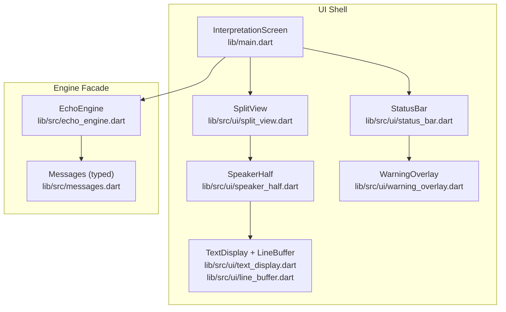
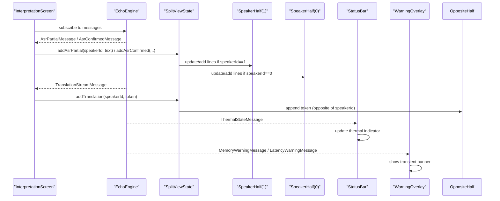
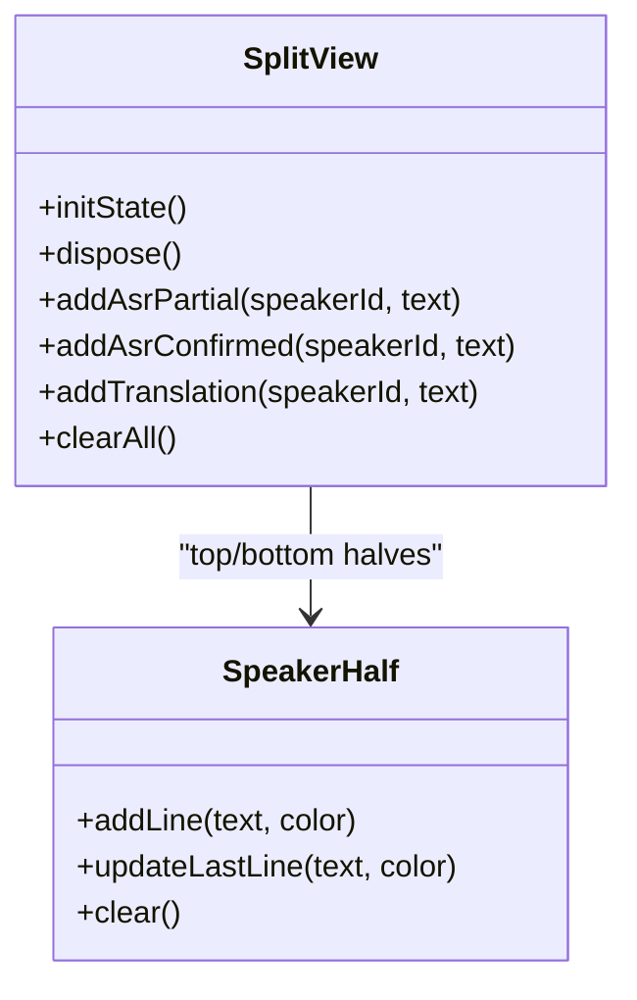
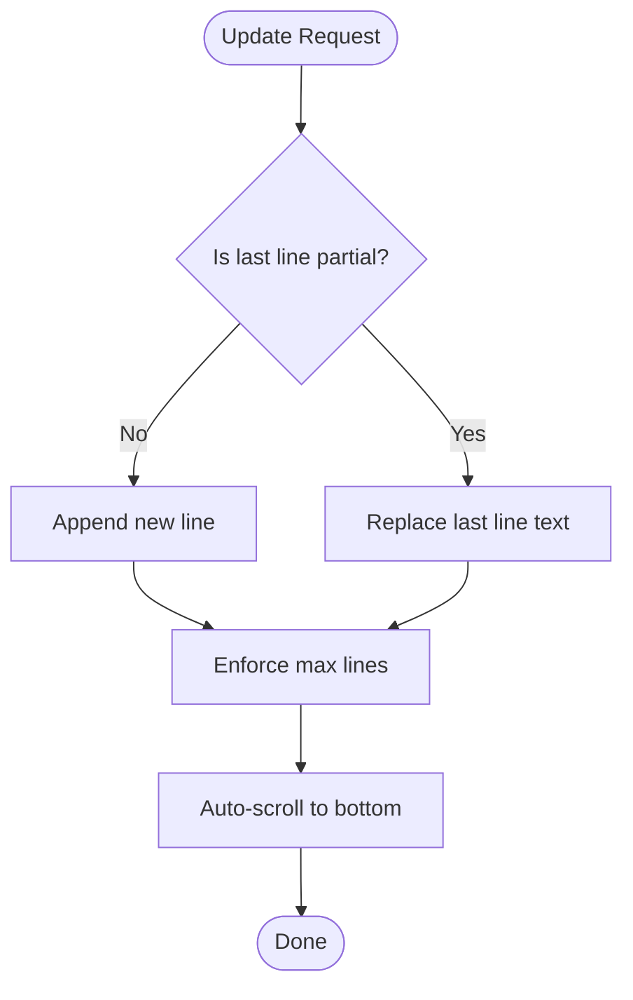
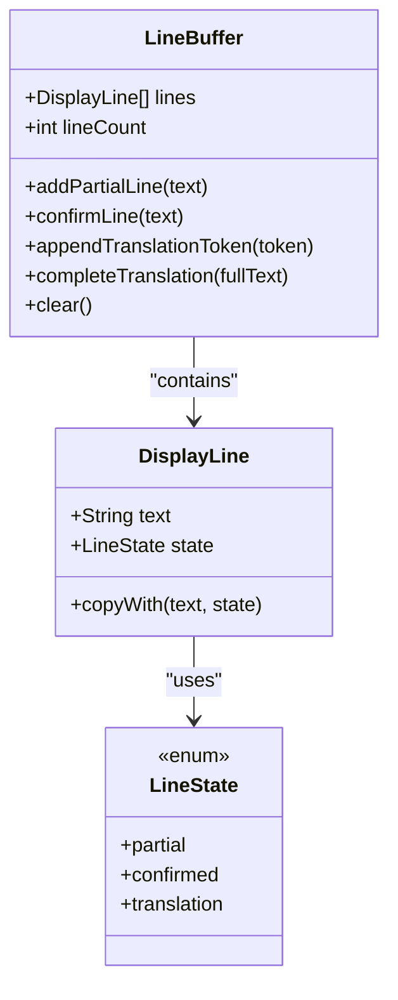
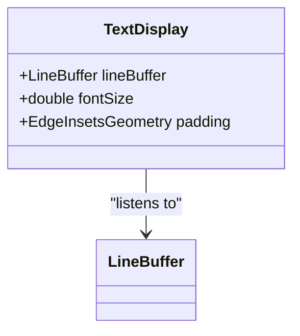
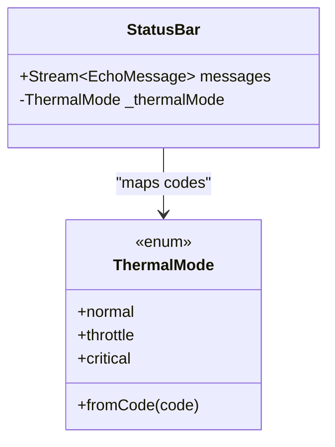
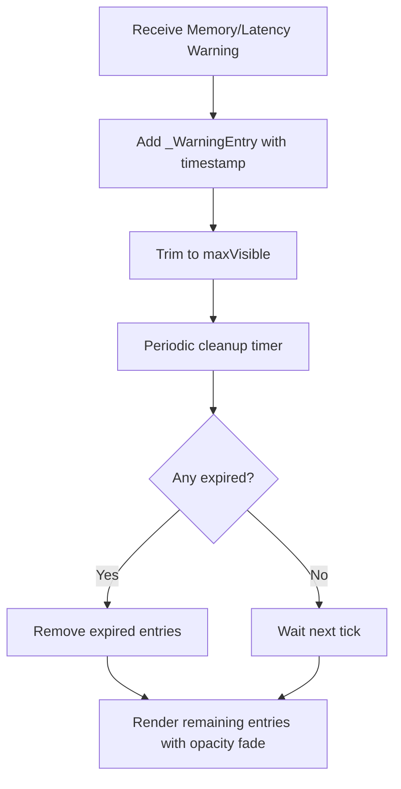
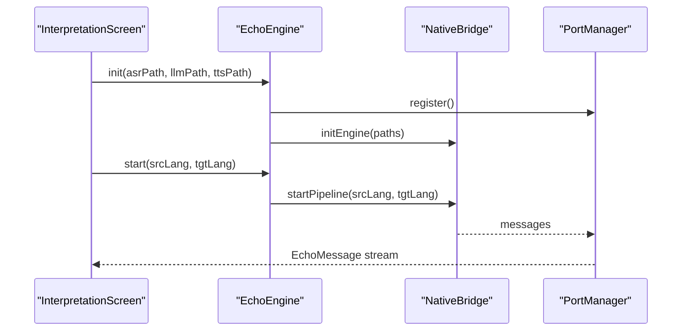
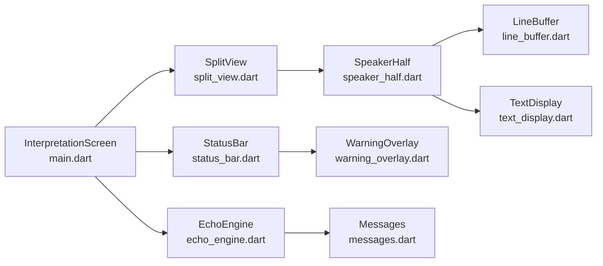

# Flutter UI Layer

<cite>
**Referenced Files in This Document**
- [main.dart](file://lib/main.dart)
- [qwen_echo.dart](file://lib/qwen_echo.dart)
- [echo_engine.dart](file://lib/src/echo_engine.dart)
- [messages.dart](file://lib/src/messages.dart)
- [split_view.dart](file://lib/src/ui/split_view.dart)
- [speaker_half.dart](file://lib/src/ui/speaker_half.dart)
- [line_buffer.dart](file://lib/src/ui/line_buffer.dart)
- [text_display.dart](file://lib/src/ui/text_display.dart)
- [status_bar.dart](file://lib/src/ui/status_bar.dart)
- [warning_overlay.dart](file://lib/src/ui/warning_overlay.dart)
- [model_config_screen.dart](file://lib/src/ui/model_config_screen.dart)
- [split_view_test.dart](file://test/split_view_test.dart)
- [line_buffer_test.dart](file://test/ui/line_buffer_test.dart)
- [status_bar_test.dart](file://test/ui/status_bar_test.dart)
</cite>

## Table of Contents
1. [Introduction](#introduction)
2. [Project Structure](#project-structure)
3. [Core Components](#core-components)
4. [Architecture Overview](#architecture-overview)
5. [Detailed Component Analysis](#detailed-component-analysis)
6. [Dependency Analysis](#dependency-analysis)
7. [Performance Considerations](#performance-considerations)
8. [Troubleshooting Guide](#troubleshooting-guide)
9. [Conclusion](#conclusion)
10. [Appendices](#appendices)

## Introduction
This document explains the Flutter UI layer for QwenEcho’s bilateral interpretation interface. It focuses on the split-view architecture that divides the screen into two equal halves with a 180-degree rotation for face-to-face conversations, real-time text rendering with auto-scrolling, and a line buffer with three-color state management (partial ASR, confirmed ASR, streaming translation). It also covers the persistent status bar showing offline indicators and thermal monitoring, plus a warning overlay system for memory and latency alerts. Finally, it details widget composition patterns, state management approaches, and integration with the native engine via the EchoEngine facade, along with guidance for customization, device orientation handling, and responsive layouts.

## Project Structure
The Flutter UI is organized under lib/src/ui with clear separation of concerns:
- Split view orchestration and orientation control
- Speaker half rendering and line buffering
- Reusable text display with auto-scroll
- Status bar and warning overlays
- Engine facade and typed messages bridging to native code

**Diagram sources**
- [main.dart:118-152](file://lib/main.dart#L118-L152)
- [split_view.dart:86-116](file://lib/src/ui/split_view.dart#L86-L116)
- [speaker_half.dart:113-152](file://lib/src/ui/speaker_half.dart#L113-L152)
- [text_display.dart:89-122](file://lib/src/ui/text_display.dart#L89-L122)
- [line_buffer.dart:48-175](file://lib/src/ui/line_buffer.dart#L48-L175)
- [status_bar.dart:102-123](file://lib/src/ui/status_bar.dart#L102-L123)
- [warning_overlay.dart:144-199](file://lib/src/ui/warning_overlay.dart#L144-L199)
- [echo_engine.dart:37-107](file://lib/src/echo_engine.dart#L37-L107)
- [messages.dart:8-49](file://lib/src/messages.dart#L8-L49)

**Section sources**
- [main.dart:11-30](file://lib/main.dart#L11-L30)
- [qwen_echo.dart:1-16](file://lib/qwen_echo.dart#L1-L16)

## Core Components
- InterpretationScreen: Root screen wiring EchoEngine messages to the split view and status bar.
- SplitView: 50/50 vertical split with top half rotated 180 degrees; locks orientation to portrait; exposes methods to push content per speaker.
- SpeakerHalf: Per-speaker text area with line buffer, idle indicator, and auto-scroll behavior.
- TextDisplay and LineBuffer: Reusable components implementing three-color state management and max-line enforcement.
- StatusBar: Persistent offline badge and thermal mode indicator; integrates WarningOverlay.
- WarningOverlay: Transient notifications for memory and latency warnings with auto-dismiss.
- EchoEngine: Facade over native engine exposing lifecycle and message stream.
- Messages: Typed message classes for ASR, translation, TTS, errors, thermal, memory, latency, and sample drops.

Key responsibilities:
- Message routing from EchoEngine to appropriate halves
- Real-time updates with minimal rebuilds
- Stateful buffers with color-coded states
- System UI and orientation management
- Non-AI status and warning presentation

**Section sources**
- [main.dart:32-153](file://lib/main.dart#L32-L153)
- [split_view.dart:8-117](file://lib/src/ui/split_view.dart#L8-L117)
- [speaker_half.dart:30-153](file://lib/src/ui/speaker_half.dart#L30-L153)
- [text_display.dart:17-122](file://lib/src/ui/text_display.dart#L17-L122)
- [line_buffer.dart:44-175](file://lib/src/ui/line_buffer.dart#L44-L175)
- [status_bar.dart:56-180](file://lib/src/ui/status_bar.dart#L56-L180)
- [warning_overlay.dart:31-200](file://lib/src/ui/warning_overlay.dart#L31-L200)
- [echo_engine.dart:25-107](file://lib/src/echo_engine.dart#L25-L107)
- [messages.dart:7-49](file://lib/src/messages.dart#L7-L49)

## Architecture Overview
The UI subscribes to EchoEngine.messages and routes events to the correct speaker half or status components. The split view enforces immersive full-screen behavior and locks orientation to ensure consistent layout during face-to-face use.

**Diagram sources**
- [main.dart:67-105](file://lib/main.dart#L67-L105)
- [split_view.dart:52-71](file://lib/src/ui/split_view.dart#L52-L71)
- [status_bar.dart:90-99](file://lib/src/ui/status_bar.dart#L90-L99)
- [warning_overlay.dart:87-104](file://lib/src/ui/warning_overlay.dart#L87-L104)
- [messages.dart:51-155](file://lib/src/messages.dart#L51-L155)

## Detailed Component Analysis

### Split View and Orientation Management
- Splits the screen vertically into two Expanded children (50/50).
- Rotates the top half by 180 degrees using Transform.rotate for face-to-face reading.
- Locks orientation to portraitUp and enables immersive sticky mode on init; restores defaults on dispose.
- Exposes public methods to push ASR partial/confirmed text and translation tokens to specific halves.

**Diagram sources**
- [split_view.dart:25-83](file://lib/src/ui/split_view.dart#L25-L83)
- [speaker_half.dart:46-110](file://lib/src/ui/speaker_half.dart#L46-L110)

**Section sources**
- [split_view.dart:34-50](file://lib/src/ui/split_view.dart#L34-L50)
- [split_view.dart:86-116](file://lib/src/ui/split_view.dart#L86-L116)
- [split_view_test.dart:8-41](file://test/split_view_test.dart#L8-L41)

### Speaker Half and Auto-Scrolling
- Maintains an internal list of DisplayLine entries with a maximum length.
- Provides addLine and updateLastLine APIs; replaces the last partial line when updating.
- Auto-scrolls to bottom after each update using a ScrollController and post-frame callback.
- Shows an idle indicator when no content has been received.

**Diagram sources**
- [speaker_half.dart:59-85](file://lib/src/ui/speaker_half.dart#L59-L85)
- [speaker_half.dart:94-104](file://lib/src/ui/speaker_half.dart#L94-L104)

**Section sources**
- [speaker_half.dart:46-110](file://lib/src/ui/speaker_half.dart#L46-L110)
- [speaker_half.dart:113-152](file://lib/src/ui/speaker_half.dart#L113-L152)
- [split_view_test.dart:116-180](file://test/split_view_test.dart#L116-L180)

### Line Buffer and Three-Color State Management
- Defines LineState enum: partial, confirmed, translation.
- DisplayLine holds text and state; supports equality and copyWith.
- LineBuffer manages up to 50 lines, replacing partial lines, appending translation tokens typewriter-style, and finalizing translations.
- Notifies listeners on changes; used by TextDisplay to render.

**Diagram sources**
- [line_buffer.dart:4-42](file://lib/src/ui/line_buffer.dart#L4-L42)
- [line_buffer.dart:48-175](file://lib/src/ui/line_buffer.dart#L48-L175)

**Section sources**
- [line_buffer.dart:44-175](file://lib/src/ui/line_buffer.dart#L44-L175)
- [line_buffer_test.dart:15-148](file://test/ui/line_buffer_test.dart#L15-L148)

### Text Display Widget
- Renders a scrollable list of DisplayLine items with colors mapped from LineState.
- Subscribes to LineBuffer changes and auto-scrolls after frame renders.
- Configurable font size and padding.

**Diagram sources**
- [text_display.dart:22-41](file://lib/src/ui/text_display.dart#L22-L41)
- [text_display.dart:89-122](file://lib/src/ui/text_display.dart#L89-L122)

**Section sources**
- [text_display.dart:17-122](file://lib/src/ui/text_display.dart#L17-L122)

### Status Bar and Thermal Monitoring
- Always-visible OFFLINE badge indicating air-gapped operation.
- Thermal indicator updates based on ThermalStateMessage with color-coded modes (Normal/Throttle/Critical).
- Integrates WarningOverlay for transient notifications.

**Diagram sources**
- [status_bar.dart:18-54](file://lib/src/ui/status_bar.dart#L18-L54)
- [status_bar.dart:102-179](file://lib/src/ui/status_bar.dart#L102-L179)

**Section sources**
- [status_bar.dart:56-180](file://lib/src/ui/status_bar.dart#L56-L180)
- [status_bar_test.dart:9-70](file://test/ui/status_bar_test.dart#L9-L70)

### Warning Overlay System
- Displays transient banners for memory and latency warnings.
- Auto-dismisses after a configurable duration; caps concurrent visible warnings.
- Formats messages with severity-based colors.

**Diagram sources**
- [warning_overlay.dart:87-129](file://lib/src/ui/warning_overlay.dart#L87-L129)
- [warning_overlay.dart:144-199](file://lib/src/ui/warning_overlay.dart#L144-L199)

**Section sources**
- [warning_overlay.dart:31-200](file://lib/src/ui/warning_overlay.dart#L31-L200)

### Engine Integration via EchoEngine Facade
- EchoEngine wraps NativeBridge and PortManager, exposing init/start/stop/dispose and a Stream<EchoMessage>.
- InterpretationScreen subscribes to messages and routes them to SplitView and StatusBar.

**Diagram sources**
- [echo_engine.dart:60-98](file://lib/src/echo_engine.dart#L60-L98)
- [main.dart:54-65](file://lib/main.dart#L54-L65)
- [main.dart:67-105](file://lib/main.dart#L67-L105)

**Section sources**
- [echo_engine.dart:25-107](file://lib/src/echo_engine.dart#L25-L107)
- [main.dart:32-105](file://lib/main.dart#L32-L105)

## Dependency Analysis
High-level dependencies among UI components and engine facade:

**Diagram sources**
- [main.dart:118-152](file://lib/main.dart#L118-L152)
- [split_view.dart:86-116](file://lib/src/ui/split_view.dart#L86-L116)
- [speaker_half.dart:113-152](file://lib/src/ui/speaker_half.dart#L113-L152)
- [line_buffer.dart:48-175](file://lib/src/ui/line_buffer.dart#L48-L175)
- [text_display.dart:89-122](file://lib/src/ui/text_display.dart#L89-L122)
- [status_bar.dart:102-123](file://lib/src/ui/status_bar.dart#L102-L123)
- [warning_overlay.dart:144-199](file://lib/src/ui/warning_overlay.dart#L144-L199)
- [echo_engine.dart:37-107](file://lib/src/echo_engine.dart#L37-L107)
- [messages.dart:8-49](file://lib/src/messages.dart#L8-L49)

**Section sources**
- [qwen_echo.dart:1-16](file://lib/qwen_echo.dart#L1-L16)

## Performance Considerations
- Line buffer limits to 50 lines to prevent unbounded growth; oldest lines are discarded automatically.
- Auto-scroll uses short-duration animations to minimize jank while keeping the latest content in view.
- TextDisplay listens to LineBuffer and triggers minimal rebuilds; consider using ValueListenableBuilder or Riverpod for larger apps.
- Avoid frequent setState calls in tight loops; batch updates where possible.
- Keep immersive mode enabled only while in the split view to reduce overhead elsewhere.

[No sources needed since this section provides general guidance]

## Troubleshooting Guide
Common issues and resolutions:
- No text appears in either half:
  - Verify EchoEngine.init and start were called before expecting messages.
  - Ensure InterpretationScreen subscribes to EchoEngine.messages and routes to SplitView.
- Translation not appearing in opposing half:
  - Confirm addTranslation maps speakerId to the opposite half.
- Auto-scroll not working:
  - Ensure ScrollController has clients and animateTo is invoked after frame renders.
- Thermal indicator stuck:
  - Check that ThermalStateMessage is emitted and StatusBar listens to the same messages stream.
- Warnings not shown:
  - Confirm WarningOverlay receives the same messages stream and displayDuration is reasonable.

**Section sources**
- [main.dart:67-105](file://lib/main.dart#L67-L105)
- [split_view.dart:64-71](file://lib/src/ui/split_view.dart#L64-L71)
- [speaker_half.dart:94-104](file://lib/src/ui/speaker_half.dart#L94-L104)
- [status_bar.dart:90-99](file://lib/src/ui/status_bar.dart#L90-L99)
- [warning_overlay.dart:87-104](file://lib/src/ui/warning_overlay.dart#L87-L104)

## Conclusion
QwenEcho’s Flutter UI layer implements a robust bilateral interpretation interface with a clear split-view design, real-time text rendering, and comprehensive status and warning systems. The architecture cleanly separates UI concerns from engine logic through the EchoEngine facade and typed messages, enabling maintainability and testability. With explicit orientation locking and immersive mode, the UI remains stable across devices and orientations suitable for face-to-face conversation scenarios.

[No sources needed since this section summarizes without analyzing specific files]

## Appendices

### Customization Examples
- Customize appearance:
  - Adjust TextDisplay colors via TextDisplayColors constants.
  - Modify SpeakerHalf padding, font sizes, and idle text.
  - Update StatusBar thermal colors and labels.
- Handle device rotation:
  - SplitView locks orientation to portrait; override preferredOrientations in parent screens if needed.
- Implement responsive layouts:
  - Use MediaQuery and LayoutBuilder to adapt padding and font sizes for different screen sizes.
  - Consider adaptive widgets for smaller screens to reduce line height and increase density.

**Section sources**
- [text_display.dart:6-15](file://lib/src/ui/text_display.dart#L6-L15)
- [speaker_half.dart:3-16](file://lib/src/ui/speaker_half.dart#L3-L16)
- [status_bar.dart:31-53](file://lib/src/ui/status_bar.dart#L31-L53)
- [split_view.dart:34-50](file://lib/src/ui/split_view.dart#L34-L50)

### Model Configuration Screen
- Provides local import and removal of GGUF models (ASR/LLM/TTS) with progress feedback and error handling.
- Uses ModelRepository for storage operations and FilePicker for file selection.

**Section sources**
- [model_config_screen.dart:17-150](file://lib/src/ui/model_config_screen.dart#L17-L150)