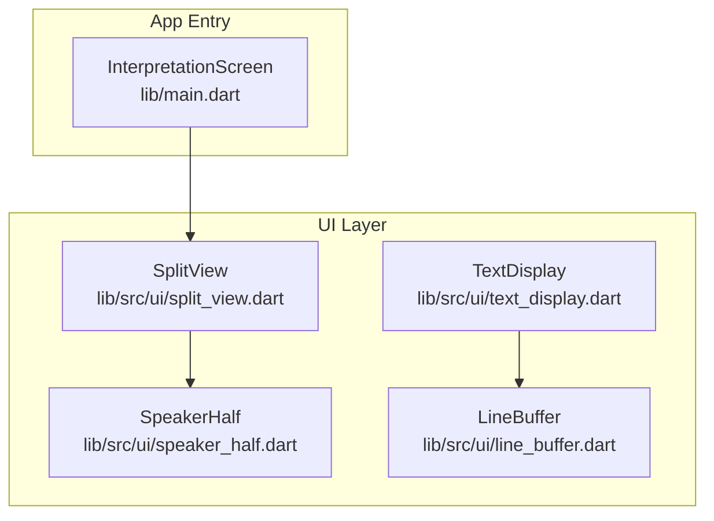
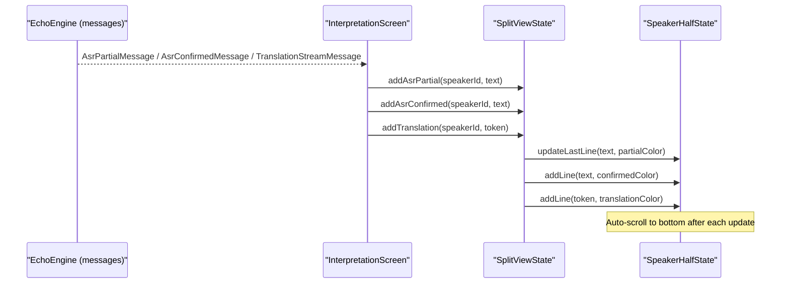
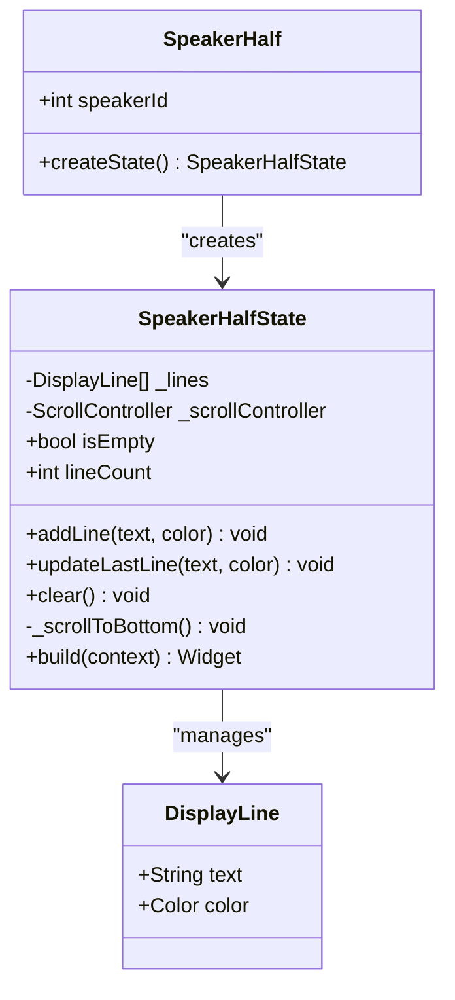
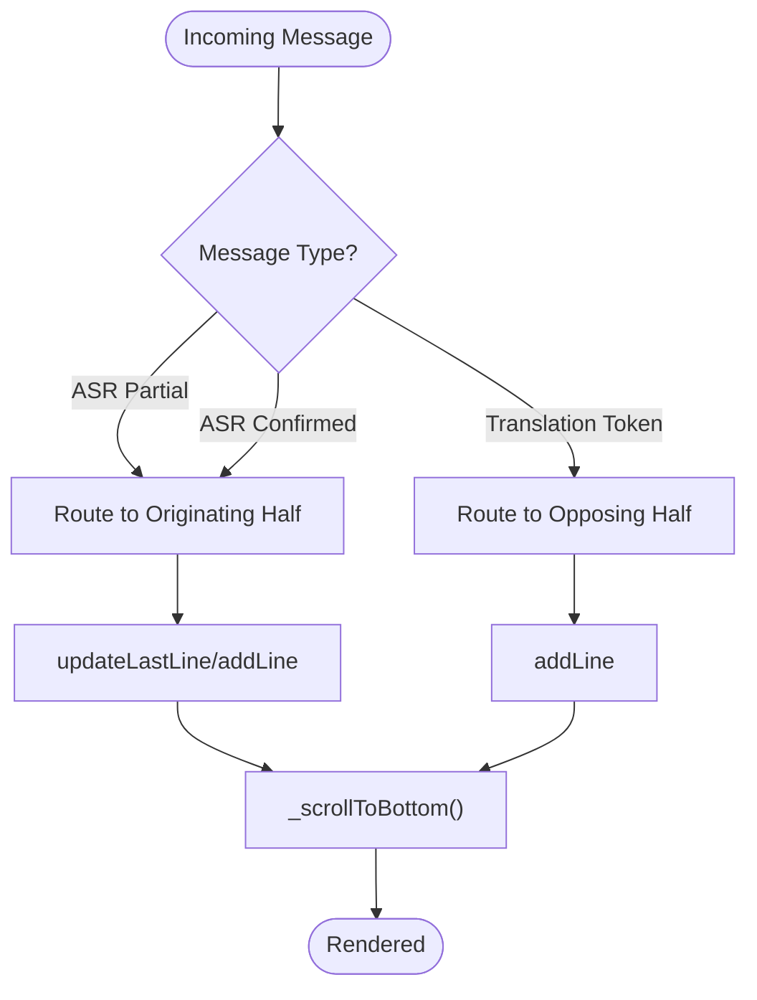
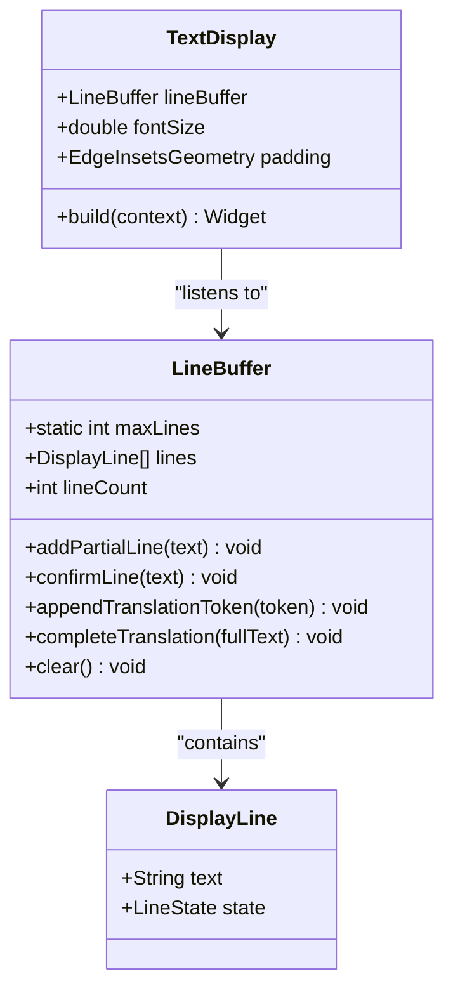
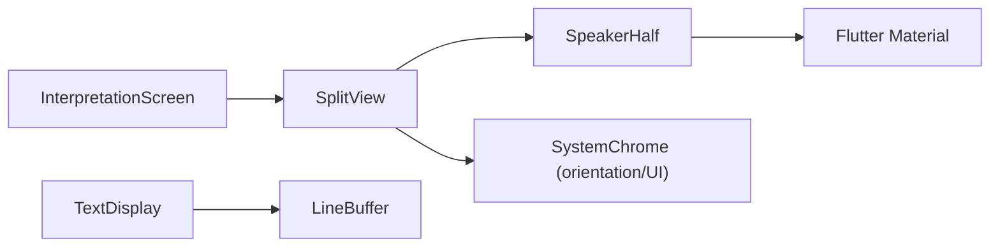
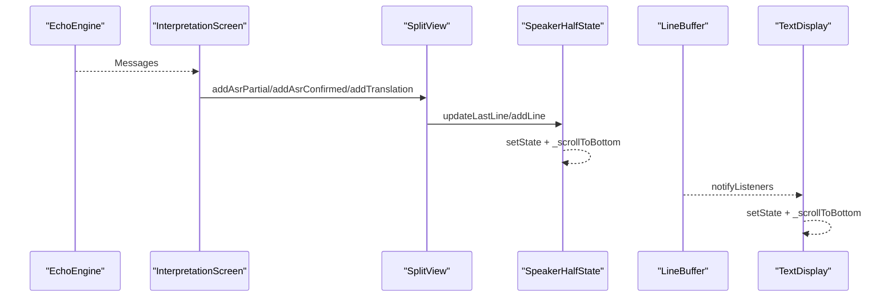

# Speaker Half Component

<cite>
**Referenced Files in This Document**
- [speaker_half.dart](file://lib/src/ui/speaker_half.dart)
- [split_view.dart](file://lib/src/ui/split_view.dart)
- [text_display.dart](file://lib/src/ui/text_display.dart)
- [line_buffer.dart](file://lib/src/ui/line_buffer.dart)
- [main.dart](file://lib/main.dart)
- [split_view_test.dart](file://test/split_view_test.dart)
- [text_display_test.dart](file://test/ui/text_display_test.dart)
</cite>

## Table of Contents
1. [Introduction](#introduction)
2. [Project Structure](#project-structure)
3. [Core Components](#core-components)
4. [Architecture Overview](#architecture-overview)
5. [Detailed Component Analysis](#detailed-component-analysis)
6. [Dependency Analysis](#dependency-analysis)
7. [Performance Considerations](#performance-considerations)
8. [Troubleshooting Guide](#troubleshooting-guide)
9. [Conclusion](#conclusion)
10. [Appendices](#appendices)

## Introduction
This document provides a comprehensive guide to the SpeakerHalf component, which represents one side of the bilateral split view used for face-to-face interpretation. It explains how SpeakerHalf manages speaker ID assignment, maintains state for line updates (partial and confirmed ASR text, translations), and integrates with text rendering. It also covers configuration options, styling customization, accessibility considerations, performance characteristics for real-time updates, and memory management for long conversations.

## Project Structure
SpeakerHalf is part of the UI layer under lib/src/ui. It is composed by SplitView, which orchestrates two halves (top and bottom). TextDisplay and LineBuffer provide an alternative, more advanced rendering path that can be used instead of or alongside SpeakerHalf’s internal list.

**Diagram sources**
- [speaker_half.dart:30-43](file://lib/src/ui/speaker_half.dart#L30-L43)
- [split_view.dart:8-21](file://lib/src/ui/split_view.dart#L8-L21)
- [text_display.dart:17-41](file://lib/src/ui/text_display.dart#L17-L41)
- [line_buffer.dart:44-61](file://lib/src/ui/line_buffer.dart#L44-L61)
- [main.dart:32-45](file://lib/main.dart#L32-L45)

**Section sources**
- [speaker_half.dart:1-154](file://lib/src/ui/speaker_half.dart#L1-L154)
- [split_view.dart:1-117](file://lib/src/ui/split_view.dart#L1-L117)
- [text_display.dart:1-123](file://lib/src/ui/text_display.dart#L1-L123)
- [line_buffer.dart:1-176](file://lib/src/ui/line_buffer.dart#L1-L176)
- [main.dart:1-154](file://lib/main.dart#L1-L154)

## Core Components
- SpeakerHalf: A StatefulWidget representing one half of the split view. It owns a scrollable list of colored lines, enforces a maximum line count, auto-scrolls to the latest content, and shows an idle indicator when empty.
- SplitView: The parent container that creates two SpeakerHalf instances (top rotated 180 degrees), locks orientation, and exposes methods to push partial/confirmed ASR text and translation tokens to specific halves.
- TextDisplay and LineBuffer: An alternative rendering approach where TextDisplay listens to a LineBuffer (ChangeNotifier) and renders three-state lines (partial, confirmed, translation) with auto-scrolling.

Key responsibilities:
- SpeakerHalf:
  - Manage per-half line buffer and scrolling
  - Enforce max lines limit
  - Update last line for partial ASR streaming
  - Render idle indicator when no content
- SplitView:
  - Assign speaker IDs (0 = bottom, 1 = top)
  - Route messages from engine to correct half
  - Handle translation routing to opposing half
- TextDisplay + LineBuffer:
  - Provide a ChangeNotifier-based buffer with typed states
  - Render color-coded lines based on state

**Section sources**
- [speaker_half.dart:30-154](file://lib/src/ui/speaker_half.dart#L30-L154)
- [split_view.dart:23-117](file://lib/src/ui/split_view.dart#L23-L117)
- [text_display.dart:17-123](file://lib/src/ui/text_display.dart#L17-L123)
- [line_buffer.dart:44-176](file://lib/src/ui/line_buffer.dart#L44-L176)

## Architecture Overview
The runtime flow connects the EchoEngine message stream to SplitView, which then calls into SpeakerHalfState to update the display. Translations are routed to the opposing half.

**Diagram sources**
- [main.dart:67-105](file://lib/main.dart#L67-L105)
- [split_view.dart:52-71](file://lib/src/ui/split_view.dart#L52-L71)
- [speaker_half.dart:56-85](file://lib/src/ui/speaker_half.dart#L56-L85)

## Detailed Component Analysis

### SpeakerHalf State Management and Rendering
SpeakerHalf maintains an internal list of DisplayLine entries, each carrying text and a color. It exposes public methods to add lines and update the last line in place for partial ASR updates. When the buffer exceeds a configured maximum, it discards oldest lines to bound memory usage. After each update, it schedules an animated scroll to the bottom.

Key behaviors:
- Speaker ID assignment:
  - 0 maps to the bottom half (normal orientation)
  - 1 maps to the top half (rotated 180 degrees)
- Partial ASR updates:
  - updateLastLine replaces the last line only if both existing and new lines are partial; otherwise appends a new line
- Confirmed ASR updates:
  - addLine appends a new line with confirmed color
- Translation updates:
  - addLine appends a new line with translation color
- Idle indicator:
  - Shows placeholder text when the buffer is empty
- Max lines enforcement:
  - Discards oldest lines beyond the limit

**Diagram sources**
- [speaker_half.dart:18-43](file://lib/src/ui/speaker_half.dart#L18-L43)
- [speaker_half.dart:45-110](file://lib/src/ui/speaker_half.dart#L45-L110)

**Section sources**
- [speaker_half.dart:30-154](file://lib/src/ui/speaker_half.dart#L30-L154)

### Integration with SplitView
SplitView constructs two SpeakerHalf widgets, assigns IDs, rotates the top half, and exposes methods to push messages. It locks orientation and hides system UI for immersive use.

Important integration points:
- Orientation lock and immersive mode in lifecycle hooks
- Routing logic:
  - Partial/confirmed ASR → originating speaker’s half
  - Translation tokens → opposing speaker’s half
- Clearing both halves via global keys

**Diagram sources**
- [split_view.dart:33-83](file://lib/src/ui/split_view.dart#L33-L83)
- [speaker_half.dart:94-104](file://lib/src/ui/speaker_half.dart#L94-L104)

**Section sources**
- [split_view.dart:1-117](file://lib/src/ui/split_view.dart#L1-L117)

### Alternative Rendering Path: TextDisplay and LineBuffer
TextDisplay is a widget that subscribes to a LineBuffer and renders lines with three distinct states. LineBuffer is a ChangeNotifier managing a bounded list of typed DisplayLine entries and exposing methods for partial, confirmed, and translation updates.

Highlights:
- Three-line states: partial, confirmed, translation
- Color mapping via TextDisplayColors
- Auto-scroll behavior similar to SpeakerHalf
- Bounded buffer enforced by maxLines

**Diagram sources**
- [text_display.dart:17-41](file://lib/src/ui/text_display.dart#L17-L41)
- [line_buffer.dart:44-176](file://lib/src/ui/line_buffer.dart#L44-L176)

**Section sources**
- [text_display.dart:1-123](file://lib/src/ui/text_display.dart#L1-L123)
- [line_buffer.dart:1-176](file://lib/src/ui/line_buffer.dart#L1-L176)

### Concrete Examples from the Codebase
- ASR partial/confirmed text rendering:
  - SplitView routes partial and confirmed messages to the originating half using updateLastLine and addLine respectively.
  - Tests verify that partial updates replace the last line and confirmed lines appear distinctly.
- Translation rendering:
  - SplitView routes translation tokens to the opposing half with a dedicated color.
  - Tests confirm that translations appear in the opposite half and that full-duplex operation works.

Examples paths:
- [Routing partial/confirmed/translation:52-71](file://lib/src/ui/split_view.dart#L52-L71)
- [Behavior tests for SpeakerHalf buffer and idle state:116-181](file://test/split_view_test.dart#L116-L181)
- [TextDisplay color mapping and updates:37-97](file://test/ui/text_display_test.dart#L37-L97)

**Section sources**
- [split_view.dart:52-71](file://lib/src/ui/split_view.dart#L52-L71)
- [split_view_test.dart:116-181](file://test/split_view_test.dart#L116-L181)
- [text_display_test.dart:37-97](file://test/ui/text_display_test.dart#L37-L97)

## Dependency Analysis
SpeakerHalf depends on Flutter Material components and uses a local list for state. SplitView composes two SpeakerHalf instances and controls orientation/system UI. TextDisplay depends on LineBuffer for reactive updates.

**Diagram sources**
- [speaker_half.dart:1-2](file://lib/src/ui/speaker_half.dart#L1-L2)
- [split_view.dart:1-5](file://lib/src/ui/split_view.dart#L1-L5)
- [text_display.dart:1-4](file://lib/src/ui/text_display.dart#L1-L4)
- [main.dart:1-9](file://lib/main.dart#L1-L9)

**Section sources**
- [speaker_half.dart:1-154](file://lib/src/ui/speaker_half.dart#L1-L154)
- [split_view.dart:1-117](file://lib/src/ui/split_view.dart#L1-L117)
- [text_display.dart:1-123](file://lib/src/ui/text_display.dart#L1-L123)
- [main.dart:1-154](file://lib/main.dart#L1-L154)

## Performance Considerations
- Real-time updates:
  - updateLastLine avoids creating extra lines for partial ASR by replacing the last partial entry, minimizing rebuild overhead.
  - Auto-scroll uses a short animation duration to keep the latest content visible without blocking the UI thread.
- Memory management:
  - Both SpeakerHalf and LineBuffer enforce a maximum number of lines (50) by discarding oldest entries, preventing unbounded growth during long conversations.
- Rebuild efficiency:
  - setState is scoped to minimal changes within addLine/updateLastLine/clear.
  - TextDisplay leverages ChangeNotifier to trigger targeted rebuilds only when the buffer changes.

Recommendations:
- Keep kMaxLines/maxLines tuned to device capabilities and conversation length expectations.
- Avoid frequent large string concatenations; prefer incremental token updates for translations.
- Consider debouncing extremely rapid partial updates if needed, though current implementation already coalesces partial updates by replacing the last line.

[No sources needed since this section provides general guidance]

## Troubleshooting Guide
Common issues and resolutions:
- Lines not appearing:
  - Ensure the correct speakerId is passed and SplitView._halfStateFor resolves to the intended half.
  - Verify that addAsrPartial/addAsrConfirmed/addTranslation are invoked from the message handler.
- Partial text not updating in place:
  - updateLastLine only replaces the last line when both existing and new lines are partial; ensure colors match expected constants.
- Overflow beyond max lines:
  - Confirm that addLine/updateLastLine call the limit enforcement logic; check test coverage for max lines behavior.
- Idle indicator persists unexpectedly:
  - Check isEmpty condition and ensure lines are added via addLine/updateLastLine.

Relevant code paths:
- [SpeakerHalf addLine/updateLastLine/clear:56-92](file://lib/src/ui/speaker_half.dart#L56-L92)
- [SplitView routing methods:52-71](file://lib/src/ui/split_view.dart#L52-L71)
- [Tests for max lines and idle behavior:116-181](file://test/split_view_test.dart#L116-L181)

**Section sources**
- [speaker_half.dart:56-92](file://lib/src/ui/speaker_half.dart#L56-L92)
- [split_view.dart:52-71](file://lib/src/ui/split_view.dart#L52-L71)
- [split_view_test.dart:116-181](file://test/split_view_test.dart#L116-L181)

## Conclusion
SpeakerHalf is a focused, efficient container for displaying one speaker’s text in the split view. It manages line buffers, enforces limits, handles partial/confirmed ASR updates, and integrates seamlessly with SplitView for full-duplex operation. For more advanced scenarios, TextDisplay and LineBuffer offer a reactive, state-typed rendering path with similar performance characteristics. Together, these components deliver responsive, accessible, and memory-safe real-time text updates suitable for simultaneous interpretation.

[No sources needed since this section summarizes without analyzing specific files]

## Appendices

### Configuration Options and Styling Customization
- Colors:
  - Partial ASR color, confirmed ASR color, and translation color are defined as constants in SpeakerHalf and mirrored in TextDisplayColors for consistency.
- Font size and padding:
  - SpeakerHalf uses fixed font size and padding; TextDisplay accepts configurable fontSize and padding parameters.
- Max lines:
  - SpeakerHalf uses kMaxLines; LineBuffer uses maxLines. Adjust these values to balance history retention and memory usage.

Example paths:
- [SpeakerHalf color constants and defaults:9-16](file://lib/src/ui/speaker_half.dart#L9-L16)
- [TextDisplay constructor parameters:22-37](file://lib/src/ui/text_display.dart#L22-L37)
- [LineBuffer maxLines constant:49-50](file://lib/src/ui/line_buffer.dart#L49-L50)

**Section sources**
- [speaker_half.dart:9-16](file://lib/src/ui/speaker_half.dart#L9-L16)
- [text_display.dart:22-37](file://lib/src/ui/text_display.dart#L22-L37)
- [line_buffer.dart:49-50](file://lib/src/ui/line_buffer.dart#L49-L50)

### Accessibility Features
- Current implementation does not include explicit semantic labels or accessibility hints for lines or idle indicators.
- Recommendations:
  - Add semantic labels to convey “partial speech”, “confirmed speech”, and “translation” states.
  - Provide meaningful descriptions for screen readers (e.g., “Speaker 0 partial: ...”, “Speaker 1 translation: ...”).
  - Ensure contrast ratios meet accessibility guidelines for all text states.

[No sources needed since this section provides general guidance]

### Data Flows and Processing Logic
- Incoming messages from EchoEngine are routed to SplitView, which dispatches them to the appropriate SpeakerHalfState method.
- SpeakerHalfState updates its internal buffer and triggers auto-scroll.
- TextDisplay reacts to LineBuffer changes and re-renders accordingly.

**Diagram sources**
- [main.dart:67-105](file://lib/main.dart#L67-L105)
- [split_view.dart:52-71](file://lib/src/ui/split_view.dart#L52-L71)
- [speaker_half.dart:94-104](file://lib/src/ui/speaker_half.dart#L94-L104)
- [text_display.dart:68-86](file://lib/src/ui/text_display.dart#L68-L86)
- [line_buffer.dart:153-158](file://lib/src/ui/line_buffer.dart#L153-L158)