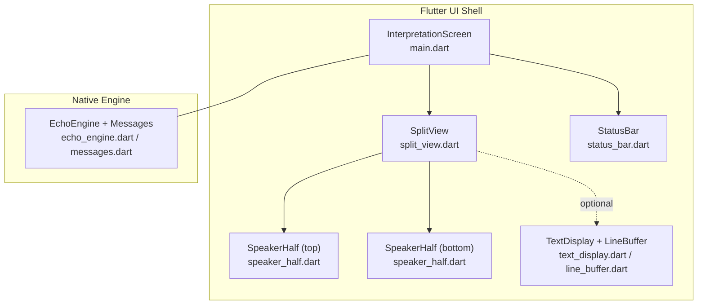
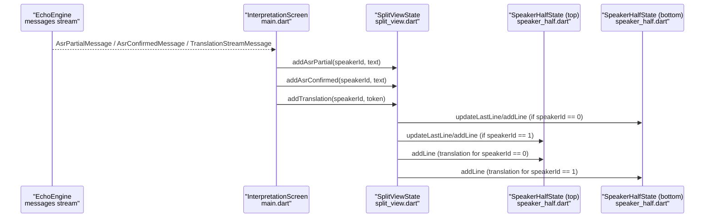
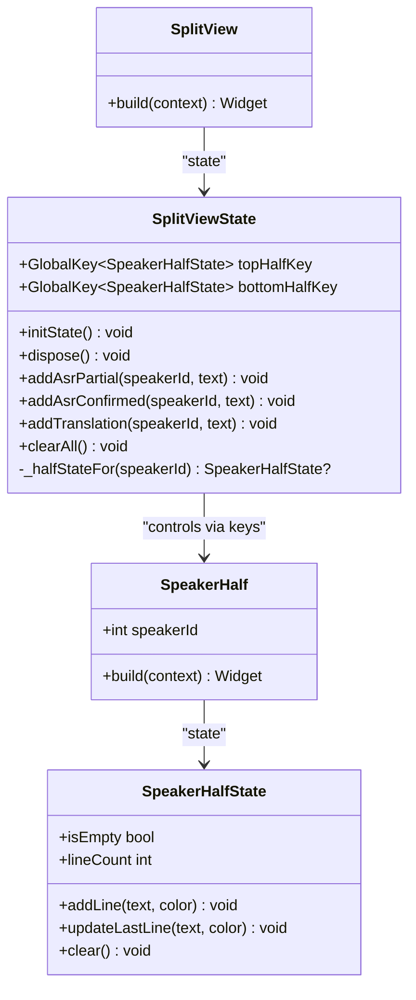
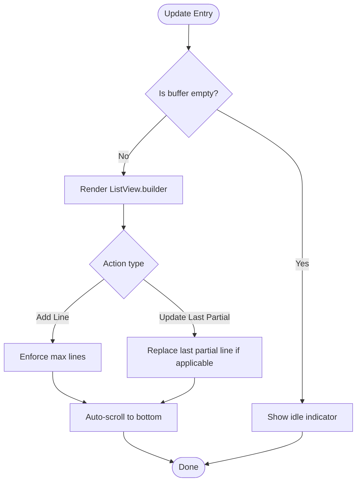
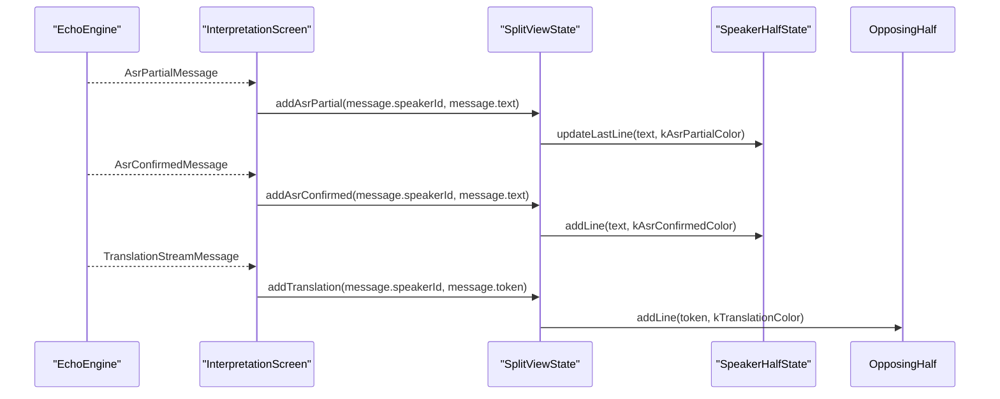
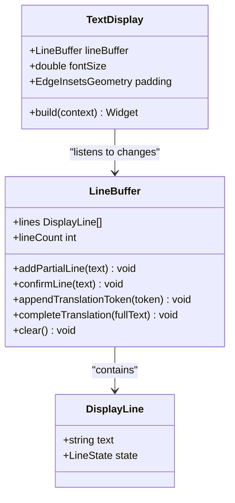
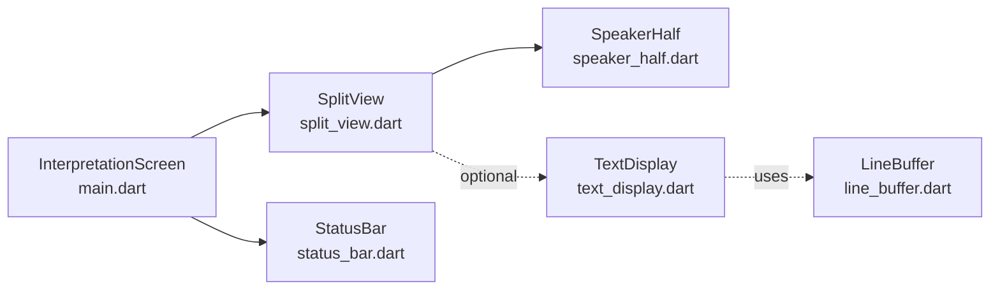

# Split View Architecture

<cite>
**Referenced Files in This Document**
- [split_view.dart](file://lib/src/ui/split_view.dart)
- [speaker_half.dart](file://lib/src/ui/speaker_half.dart)
- [line_buffer.dart](file://lib/src/ui/line_buffer.dart)
- [text_display.dart](file://lib/src/ui/text_display.dart)
- [main.dart](file://lib/main.dart)
- [status_bar.dart](file://lib/src/ui/status_bar.dart)
- [qwen_echo.dart](file://lib/qwen_echo.dart)
- [README.md](file://README.md)
- [split_view_test.dart](file://test/split_view_test.dart)
</cite>

## Table of Contents
1. [Introduction](#introduction)
2. [Project Structure](#project-structure)
3. [Core Components](#core-components)
4. [Architecture Overview](#architecture-overview)
5. [Detailed Component Analysis](#detailed-component-analysis)
6. [Dependency Analysis](#dependency-analysis)
7. [Performance Considerations](#performance-considerations)
8. [Troubleshooting Guide](#troubleshooting-guide)
9. [Conclusion](#conclusion)
10. [Appendices](#appendices)

## Introduction
This document explains the SplitView component that implements QwenEcho’s bilateral interpretation interface. It provides a 50/50 screen division with a 180-degree rotation for the top half to support face-to-face conversations. The component manages independent speaker halves using GlobalKey, locks orientation to portrait mode, and enables immersive system UI. It exposes message routing methods (addAsrPartial, addAsrConfirmed, addTranslation) to push content to specific speaker halves based on speaker IDs. The documentation covers widget composition patterns, lifecycle management in initState/dispose, integration with SpeakerHalf components, responsive layout considerations, and cross-platform compatibility.

## Project Structure
The SplitView is part of the Flutter UI shell and integrates with the native engine via Dart FFI. The relevant UI components are organized under lib/src/ui. The main application wires engine messages into the SplitView through InterpretationScreen.

**Diagram sources**
- [main.dart:117-152](file://lib/main.dart#L117-L152)
- [split_view.dart:86-116](file://lib/src/ui/split_view.dart#L86-L116)
- [speaker_half.dart:35-43](file://lib/src/ui/speaker_half.dart#L35-L43)
- [status_bar.dart:102-123](file://lib/src/ui/status_bar.dart#L102-L123)
- [text_display.dart:22-41](file://lib/src/ui/text_display.dart#L22-L41)
- [line_buffer.dart:48-61](file://lib/src/ui/line_buffer.dart#L48-L61)

**Section sources**
- [README.md:41-93](file://README.md#L41-L93)
- [qwen_echo.dart:1-16](file://lib/qwen_echo.dart#L1-L16)

## Core Components
- SplitView: Full-screen bilateral split view with two equal halves; top half rotated 180 degrees for opposing speaker. Manages orientation lock and immersive UI. Exposes public methods to route ASR partial/confirmed text and translations to specific halves.
- SpeakerHalf: Displays one speaker’s own ASR text and incoming translation from the opposing speaker. Maintains an internal buffer with idle indicator when empty. Supports auto-scrolling and max line limit.
- TextDisplay and LineBuffer: Alternative rendering approach using ChangeNotifier-based buffer with three-line states (partial, confirmed, translation). Useful for more advanced state-driven rendering.

Key responsibilities:
- Screen division and rotation: Column with two Expanded children; top child wrapped in Transform.rotate with angle pi.
- Orientation lock: Portrait-only enforced in initState; restored in dispose.
- Immersive UI: System UI hidden in immersiveSticky mode during usage; edgeToEdge restored on dispose.
- Message routing: Methods map speakerId to the correct half and update lines or last partial line accordingly.

**Section sources**
- [split_view.dart:8-21](file://lib/src/ui/split_view.dart#L8-L21)
- [split_view.dart:34-50](file://lib/src/ui/split_view.dart#L34-L50)
- [split_view.dart:52-83](file://lib/src/ui/split_view.dart#L52-L83)
- [split_view.dart:86-116](file://lib/src/ui/split_view.dart#L86-L116)
- [speaker_half.dart:30-43](file://lib/src/ui/speaker_half.dart#L30-L43)
- [speaker_half.dart:46-110](file://lib/src/ui/speaker_half.dart#L46-L110)
- [text_display.dart:17-41](file://lib/src/ui/text_display.dart#L17-L41)
- [line_buffer.dart:44-61](file://lib/src/ui/line_buffer.dart#L44-L61)

## Architecture Overview
The runtime flow connects the native engine’s message stream to the UI via InterpretationScreen, which uses a GlobalKey<SplitViewState> to call routing methods. SplitView then updates the appropriate SpeakerHalf instances.

**Diagram sources**
- [main.dart:67-105](file://lib/main.dart#L67-L105)
- [split_view.dart:52-83](file://lib/src/ui/split_view.dart#L52-L83)
- [speaker_half.dart:56-85](file://lib/src/ui/speaker_half.dart#L56-L85)

## Detailed Component Analysis

### SplitView Component
- Layout: Uses Scaffold with black background and a Column body containing two Expanded widgets for equal height halves. A thin divider separates them.
- Rotation: Top half is wrapped in Transform.rotate with angle math.pi to achieve 180-degree rotation for face-to-face reading.
- State Management: Holds two GlobalKey<SpeakerHalfState> references to independently control each half.
- Lifecycle:
  - initState: Locks orientation to portraitUp and sets immersive sticky system UI.
  - dispose: Restores default orientations and switches back to edge-to-edge system UI.
- Message Routing:
  - addAsrPartial(speakerId, text): Updates the last partial line in the specified half using kAsrPartialColor.
  - addAsrConfirmed(speakerId, text): Adds a new confirmed line in the specified half using kAsrConfirmedColor.
  - addTranslation(speakerId, text): Adds a translation line to the opposing half using kTranslationColor.
  - clearAll(): Clears both halves.

**Diagram sources**
- [split_view.dart:16-21](file://lib/src/ui/split_view.dart#L16-L21)
- [split_view.dart:25-83](file://lib/src/ui/split_view.dart#L25-L83)
- [split_view.dart:86-116](file://lib/src/ui/split_view.dart#L86-L116)
- [speaker_half.dart:35-43](file://lib/src/ui/speaker_half.dart#L35-L43)
- [speaker_half.dart:46-110](file://lib/src/ui/speaker_half.dart#L46-L110)

**Section sources**
- [split_view.dart:8-21](file://lib/src/ui/split_view.dart#L8-L21)
- [split_view.dart:34-50](file://lib/src/ui/split_view.dart#L34-L50)
- [split_view.dart:52-83](file://lib/src/ui/split_view.dart#L52-L83)
- [split_view.dart:86-116](file://lib/src/ui/split_view.dart#L86-L116)

### SpeakerHalf Component
- Purpose: Renders one speaker’s display area with an idle indicator when empty and a scrollable list of colored lines when populated.
- Buffer: Internal list of DisplayLine objects with a maximum line count (kMaxLines = 50). Oldest lines are discarded when exceeded.
- Auto-scroll: After adding/updating lines, scrolls to the bottom smoothly using a ScrollController and post-frame callback.
- Public API:
  - addLine(text, color): Adds a new line and enforces the limit.
  - updateLastLine(text, color): Replaces the last partial line if it matches partial color semantics; otherwise appends a new line.
  - clear(): Resets to idle state.

**Diagram sources**
- [speaker_half.dart:46-110](file://lib/src/ui/speaker_half.dart#L46-L110)
- [speaker_half.dart:113-152](file://lib/src/ui/speaker_half.dart#L113-L152)

**Section sources**
- [speaker_half.dart:30-43](file://lib/src/ui/speaker_half.dart#L30-L43)
- [speaker_half.dart:46-110](file://lib/src/ui/speaker_half.dart#L46-L110)
- [speaker_half.dart:113-152](file://lib/src/ui/speaker_half.dart#L113-L152)

### Integration with Main Application
InterpretationScreen subscribes to EchoEngine.messages and routes typed messages to SplitView:
- AsrPartialMessage → addAsrPartial(speakerId, text)
- AsrConfirmedMessage → addAsrConfirmed(speakerId, text)
- TranslationStreamMessage → addTranslation(speakerId, token)
- Other messages (TTS lifecycle, warnings) are handled elsewhere (e.g., StatusBar).

**Diagram sources**
- [main.dart:67-105](file://lib/main.dart#L67-L105)
- [split_view.dart:52-83](file://lib/src/ui/split_view.dart#L52-L83)
- [speaker_half.dart:56-85](file://lib/src/ui/speaker_half.dart#L56-L85)

**Section sources**
- [main.dart:47-65](file://lib/main.dart#L47-L65)
- [main.dart:67-105](file://lib/main.dart#L67-L105)
- [main.dart:117-152](file://lib/main.dart#L117-L152)

### Alternative Rendering with TextDisplay and LineBuffer
For more advanced scenarios, TextDisplay can render a LineBuffer-backed list with three-line states:
- LineBuffer maintains partial, confirmed, and translation lines with change notifications.
- TextDisplay listens to LineBuffer changes and rebuilds with auto-scroll behavior.

**Diagram sources**
- [line_buffer.dart:48-151](file://lib/src/ui/line_buffer.dart#L48-L151)
- [text_display.dart:22-41](file://lib/src/ui/text_display.dart#L22-L41)
- [text_display.dart:88-122](file://lib/src/ui/text_display.dart#L88-L122)

**Section sources**
- [line_buffer.dart:44-61](file://lib/src/ui/line_buffer.dart#L44-L61)
- [line_buffer.dart:70-143](file://lib/src/ui/line_buffer.dart#L70-L143)
- [text_display.dart:17-41](file://lib/src/ui/text_display.dart#L17-L41)
- [text_display.dart:88-122](file://lib/src/ui/text_display.dart#L88-L122)

## Dependency Analysis
- SplitView depends on:
  - Flutter Material and Services for layout and system UI/orientation control.
  - SpeakerHalf for rendering each half.
- InterpretationScreen depends on:
  - EchoEngine messages stream and StatusBar overlay.
- Optional dependency:
  - TextDisplay and LineBuffer provide an alternative rendering path for state-driven lists.

**Diagram sources**
- [main.dart:117-152](file://lib/main.dart#L117-L152)
- [split_view.dart:86-116](file://lib/src/ui/split_view.dart#L86-L116)
- [speaker_half.dart:35-43](file://lib/src/ui/speaker_half.dart#L35-L43)
- [status_bar.dart:102-123](file://lib/src/ui/status_bar.dart#L102-L123)
- [text_display.dart:22-41](file://lib/src/ui/text_display.dart#L22-L41)
- [line_buffer.dart:48-61](file://lib/src/ui/line_buffer.dart#L48-L61)

**Section sources**
- [main.dart:117-152](file://lib/main.dart#L117-L152)
- [split_view.dart:86-116](file://lib/src/ui/split_view.dart#L86-L116)
- [speaker_half.dart:35-43](file://lib/src/ui/speaker_half.dart#L35-L43)
- [status_bar.dart:102-123](file://lib/src/ui/status_bar.dart#L102-L123)
- [text_display.dart:22-41](file://lib/src/ui/text_display.dart#L22-L41)
- [line_buffer.dart:48-61](file://lib/src/ui/line_buffer.dart#L48-L61)

## Performance Considerations
- Line buffer limits: Both SpeakerHalf and LineBuffer enforce a maximum of 50 lines to prevent unbounded growth and maintain smooth scrolling.
- Auto-scroll strategy: Post-frame callbacks ensure scrolling occurs after layout, minimizing jank.
- Minimal rebuilds: SplitView delegates rendering to SpeakerHalf; only necessary setState calls occur within SpeakerHalfState.
- System UI and orientation: Locking orientation and enabling immersive mode reduces layout churn and improves focus during interpretation.

[No sources needed since this section provides general guidance]

## Troubleshooting Guide
Common issues and checks:
- Missing rotation: Ensure top half is wrapped in Transform.rotate with angle pi. Tests verify the presence of a 180-degree rotation matrix.
- Orientation not locked: Verify SystemChrome.setPreferredOrientations is called in initState with portraitUp and restored in dispose.
- No content displayed: Confirm idle indicator appears when buffers are empty and that routing methods are invoked correctly.
- Simultaneous full-duplex: Validate that both halves can receive messages independently without interference.

Relevant tests:
- Two halves rendered with Expanded and 50/50 split.
- Top half rotation verified via Transform matrix.
- Orientation lock verified by mocking platform channel calls.
- Idle indicators shown when no text received.
- Independent ASR text display per speaker.
- Translation appears in opposing half.
- Full-duplex simultaneous updates.

**Section sources**
- [split_view_test.dart:9-20](file://test/split_view_test.dart#L9-L20)
- [split_view_test.dart:22-41](file://test/split_view_test.dart#L22-L41)
- [split_view_test.dart:43-63](file://test/split_view_test.dart#L43-L63)
- [split_view_test.dart:65-70](file://test/split_view_test.dart#L65-L70)
- [split_view_test.dart:72-84](file://test/split_view_test.dart#L72-L84)
- [split_view_test.dart:86-96](file://test/split_view_test.dart#L86-L96)
- [split_view_test.dart:98-113](file://test/split_view_test.dart#L98-L113)

## Conclusion
SplitView provides a robust, full-screen bilateral interpretation interface tailored for face-to-face conversation scenarios. Its design leverages Flutter’s layout primitives, global keys for independent control, and system APIs for orientation and immersive UI. The message routing methods cleanly separate concerns between the engine’s event stream and UI updates, while SpeakerHalf ensures efficient rendering with bounded buffers and auto-scroll. Optional TextDisplay and LineBuffer components offer a state-driven alternative for richer rendering needs.

[No sources needed since this section summarizes without analyzing specific files]

## Appendices

### Responsive Layout Considerations
- Equal-height halves: Using Expanded within a Column ensures both halves occupy exactly 50% of the available space regardless of device size.
- Safe areas: StatusBar uses SafeArea to avoid system insets; consider wrapping SplitView similarly if additional overlays are introduced.
- Padding and font sizes: SpeakerHalf applies consistent horizontal and vertical padding; adjust for readability on different screen densities.

[No sources needed since this section doesn't analyze specific files]

### Cross-Platform Compatibility
- Platform APIs: SystemChrome.setPreferredOrientations and setEnabledSystemUIMode are supported on Android and iOS via Flutter services.
- Native engine integration: The app runs entirely offline with models loaded locally; UI remains agnostic to platform specifics beyond system UI handling.

**Section sources**
- [README.md:95-100](file://README.md#L95-L100)
- [README.md:164-175](file://README.md#L164-L175)